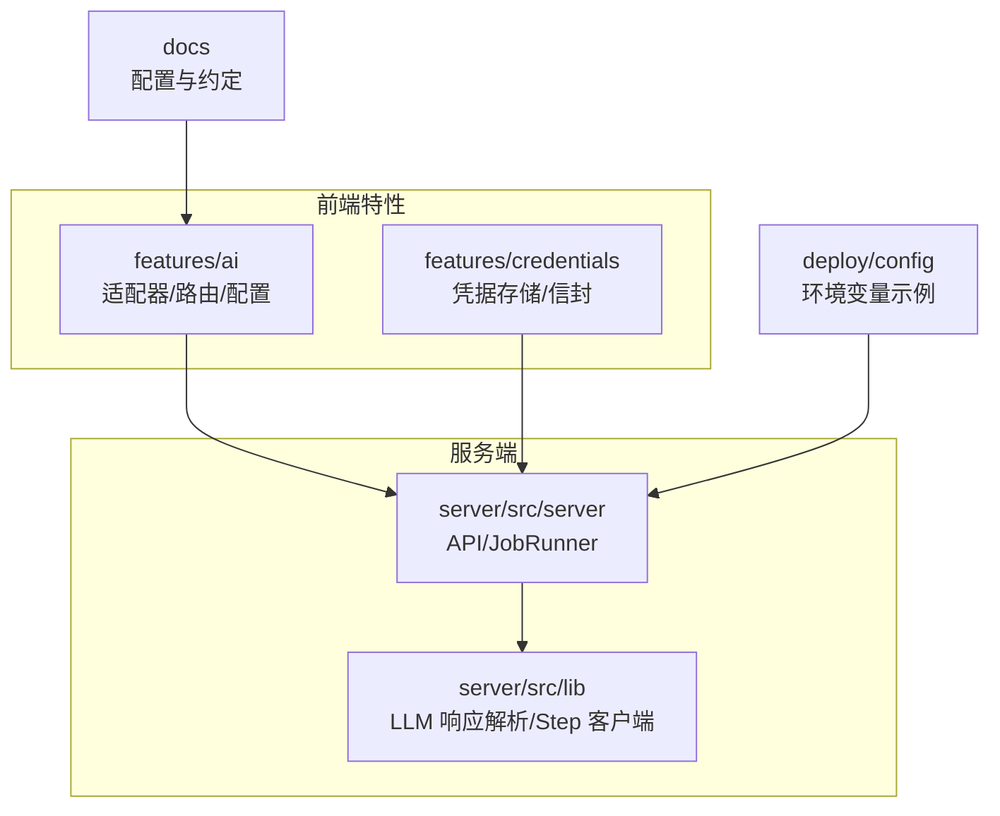
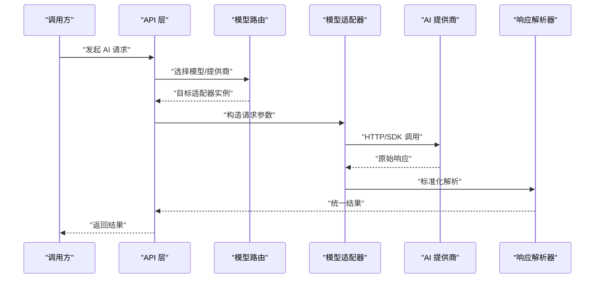
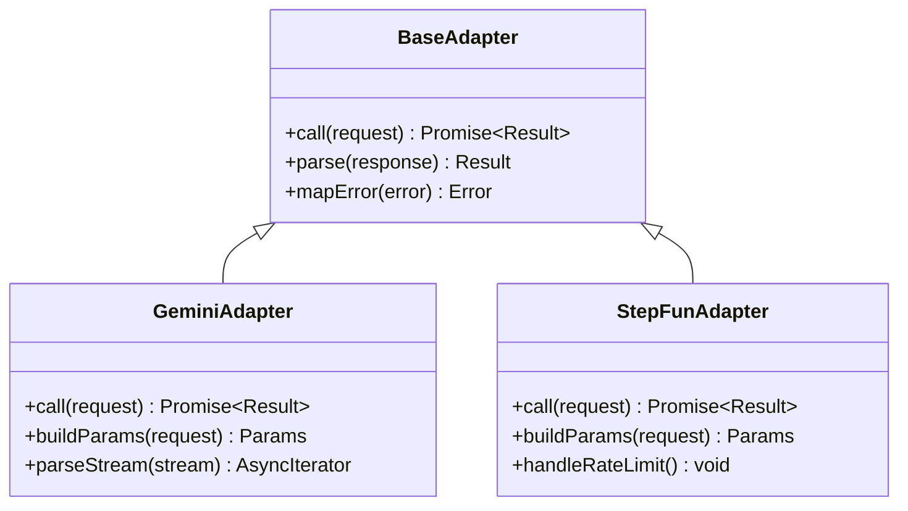
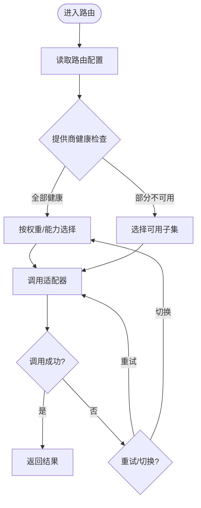
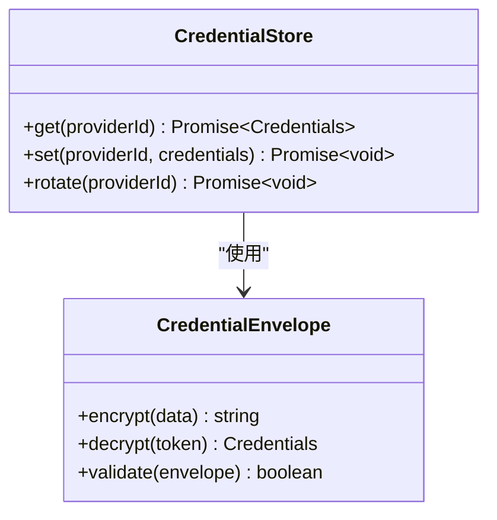
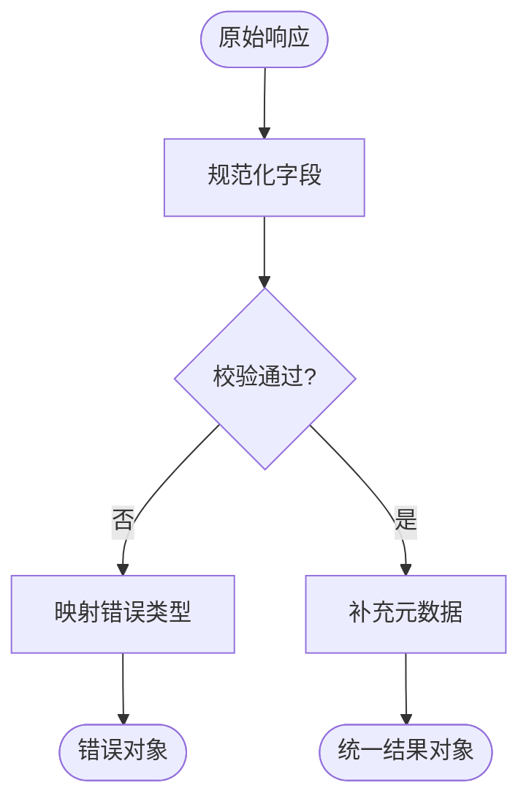
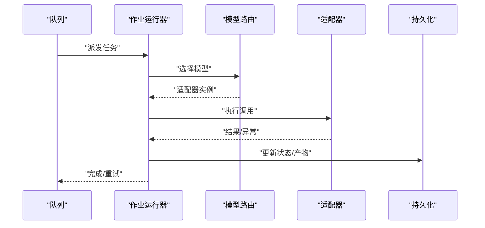
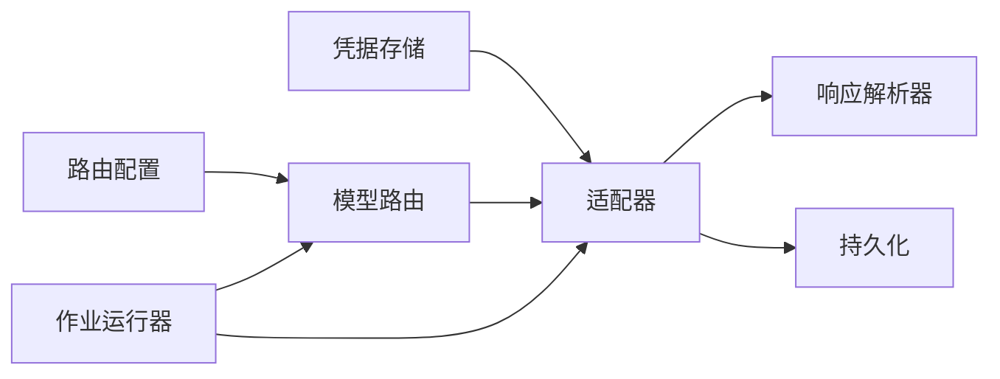

# AI 服务集成

<cite>
**本文档引用的文件**   
- [src/features/ai/config.ts](file://src/features/ai/config.ts)
- [src/features/ai/model-routing.ts](file://src/features/ai/model-routing.ts)
- [src/features/ai/gemini-adapter.ts](file://src/features/ai/gemini-adapter.ts)
- [src/features/ai/stepfun-adapter.ts](file://src/features/ai/stepfun-adapter.ts)
- [src/features/ai/schemas.ts](file://src/features/ai/schemas.ts)
- [src/features/ai/index.ts](file://src/features/ai/index.ts)
- [src/features/credentials/provider-credential-store.ts](file://src/features/credentials/provider-credential-store.ts)
- [src/features/credentials/credential-envelope.ts](file://src/features/credentials/credential-envelope.ts)
- [server/src/lib/llm-response-parser.ts](file://server/src/lib/llm-response-parser.ts)
- [server/src/lib/step-client.ts](file://server/src/lib/step-client.ts)
- [server/src/server/job-runner.ts](file://server/src/server/job-runner.ts)
- [server/src/server/api.ts](file://server/src/server/api.ts)
- [deploy/env.example](file://deploy/env.example)
- [config/tts.env.example](file://config/tts.env.example)
- [docs/configuration/credentials.md](file://docs/configuration/credentials.md)
- [docs/conventions/routing.md](file://docs/conventions/routing.md)
</cite>

## 目录
1. [简介](#简介)
2. [项目结构](#项目结构)
3. [核心组件](#核心组件)
4. [架构总览](#架构总览)
5. [详细组件分析](#详细组件分析)
6. [依赖关系分析](#依赖关系分析)
7. [性能考虑](#性能考虑)
8. [故障排查指南](#故障排查指南)
9. [结论](#结论)
10. [附录](#附录)

## 简介
本文件面向 PurpleInk 的 AI 服务集成，重点阐述多模型适配器架构与实现，涵盖 Gemini、StepFun 等提供商的接入方式；说明模型路由机制、负载均衡策略与故障转移逻辑；描述 AI 请求处理流程、参数转换与结果解析机制；并给出配置管理、密钥管理与安全最佳实践。同时提供自定义模型适配器的开发指南与扩展点说明，以及性能优化、缓存策略与错误重试机制建议。

## 项目结构
AI 相关能力主要分布在以下模块：
- features/ai：模型适配器、路由、配置与类型定义
- features/credentials：凭据存储与信封封装
- server/src/lib：LLM 响应解析与 Step 客户端
- server/src/server：作业运行器与 API 入口
- deploy/config：环境变量示例
- docs：配置与约定文档

图表来源
- [src/features/ai/index.ts](file://src/features/ai/index.ts)
- [src/features/credentials/provider-credential-store.ts](file://src/features/credentials/provider-credential-store.ts)
- [server/src/server/api.ts](file://server/src/server/api.ts)
- [server/src/lib/llm-response-parser.ts](file://server/src/lib/llm-response-parser.ts)

章节来源
- [src/features/ai/index.ts](file://src/features/ai/index.ts)
- [deploy/env.example](file://deploy/env.example)
- [docs/configuration/credentials.md](file://docs/configuration/credentials.md)

## 核心组件
- 模型适配器（Adapter）：对上游 LLM 调用进行统一封装，屏蔽不同厂商差异
- 模型路由（Model Routing）：根据配置与策略选择具体模型或提供商
- 凭据管理（Credentials）：集中管理各提供商密钥，支持加密与注入
- 响应解析（Response Parser）：标准化不同返回格式为内部统一结构
- 作业运行器（Job Runner）：编排 AI 任务执行、重试与状态推进

章节来源
- [src/features/ai/gemini-adapter.ts](file://src/features/ai/gemini-adapter.ts)
- [src/features/ai/stepfun-adapter.ts](file://src/features/ai/stepfun-adapter.ts)
- [src/features/ai/model-routing.ts](file://src/features/ai/model-routing.ts)
- [src/features/credentials/provider-credential-store.ts](file://src/features/credentials/provider-credential-store.ts)
- [server/src/lib/llm-response-parser.ts](file://server/src/lib/llm-response-parser.ts)
- [server/src/server/job-runner.ts](file://server/src/server/job-runner.ts)

## 架构总览
整体采用“适配器 + 路由 + 凭据 + 解析”的分层设计。上层通过统一的 AI 接口发起请求，由路由决定目标提供商与模型；适配器负责参数转换与调用；响应经解析器统一化后回传。凭据在运行时注入，确保密钥不泄露。

图表来源
- [server/src/server/api.ts](file://server/src/server/api.ts)
- [src/features/ai/model-routing.ts](file://src/features/ai/model-routing.ts)
- [src/features/ai/gemini-adapter.ts](file://src/features/ai/gemini-adapter.ts)
- [src/features/ai/stepfun-adapter.ts](file://src/features/ai/stepfun-adapter.ts)
- [server/src/lib/llm-response-parser.ts](file://server/src/lib/llm-response-parser.ts)

## 详细组件分析

### 模型适配器（Gemini / StepFun）
- 职责：将内部请求转换为各提供商所需格式，处理鉴权、流式与非流式响应、错误码映射
- 关键要点：
  - 参数映射：系统提示、消息列表、温度、最大生成长度等
  - 结果解析：文本、结构化输出、工具调用等
  - 错误处理：网络异常、限流、配额不足、非法参数等
  - 可观测性：日志、指标埋点

图表来源
- [src/features/ai/gemini-adapter.ts](file://src/features/ai/gemini-adapter.ts)
- [src/features/ai/stepfun-adapter.ts](file://src/features/ai/stepfun-adapter.ts)

章节来源
- [src/features/ai/gemini-adapter.ts](file://src/features/ai/gemini-adapter.ts)
- [src/features/ai/stepfun-adapter.ts](file://src/features/ai/stepfun-adapter.ts)

### 模型路由与负载均衡
- 路由策略：按提供商权重、模型能力、成本、延迟、健康状态进行选择
- 负载均衡：轮询、加权随机、最少活跃连接、基于错误率降级
- 故障转移：失败自动切换至备选提供商或降级模型

图表来源
- [src/features/ai/model-routing.ts](file://src/features/ai/model-routing.ts)
- [docs/conventions/routing.md](file://docs/conventions/routing.md)

章节来源
- [src/features/ai/model-routing.ts](file://src/features/ai/model-routing.ts)
- [docs/conventions/routing.md](file://docs/conventions/routing.md)

### 凭据管理与安全
- 凭据存储：集中式存储，支持数据库或密钥管理服务
- 信封封装：敏感字段加密，运行时解密注入
- 最小权限：仅暴露必要字段给适配器
- 审计与轮换：记录访问日志，支持定期轮换

图表来源
- [src/features/credentials/provider-credential-store.ts](file://src/features/credentials/provider-credential-store.ts)
- [src/features/credentials/credential-envelope.ts](file://src/features/credentials/credential-envelope.ts)

章节来源
- [src/features/credentials/provider-credential-store.ts](file://src/features/credentials/provider-credential-store.ts)
- [src/features/credentials/credential-envelope.ts](file://src/features/credentials/credential-envelope.ts)
- [docs/configuration/credentials.md](file://docs/configuration/credentials.md)

### 响应解析与标准化
- 目标：将不同提供商的响应统一为内部结构，便于下游消费
- 内容：文本、引用、工具调用、元数据、统计信息
- 错误映射：将外部错误码映射为内部错误类型

图表来源
- [server/src/lib/llm-response-parser.ts](file://server/src/lib/llm-response-parser.ts)

章节来源
- [server/src/lib/llm-response-parser.ts](file://server/src/lib/llm-response-parser.ts)

### 作业运行与编排
- 职责：调度 AI 任务、管理生命周期、重试与状态推进
- 关键点：并发控制、超时、幂等、回滚与补偿

图表来源
- [server/src/server/job-runner.ts](file://server/src/server/job-runner.ts)

章节来源
- [server/src/server/job-runner.ts](file://server/src/server/job-runner.ts)

## 依赖关系分析
- 适配器依赖凭据存储获取密钥
- 路由依赖配置与健康检查
- 解析器依赖适配器返回的原始响应
- 作业运行器依赖路由与解析器

图表来源
- [src/features/ai/model-routing.ts](file://src/features/ai/model-routing.ts)
- [src/features/credentials/provider-credential-store.ts](file://src/features/credentials/provider-credential-store.ts)
- [server/src/lib/llm-response-parser.ts](file://server/src/lib/llm-response-parser.ts)
- [server/src/server/job-runner.ts](file://server/src/server/job-runner.ts)

章节来源
- [src/features/ai/model-routing.ts](file://src/features/ai/model-routing.ts)
- [src/features/credentials/provider-credential-store.ts](file://src/features/credentials/provider-credential-store.ts)
- [server/src/lib/llm-response-parser.ts](file://server/src/lib/llm-response-parser.ts)
- [server/src/server/job-runner.ts](file://server/src/server/job-runner.ts)

## 性能考虑
- 连接池与复用：HTTP/SDK 连接池，减少握手开销
- 流式处理：优先使用流式接口降低首字节延迟
- 缓存策略：对相同输入与参数的结果进行缓存（注意一致性）
- 批处理：合并小请求，提高吞吐
- 超时与熔断：设置合理超时，快速失败避免雪崩
- 异步与并发：限制并发度，避免资源耗尽

[本节为通用指导，无需特定文件来源]

## 故障排查指南
- 常见问题
  - 密钥无效或过期：检查凭据存储与轮换
  - 限流与配额不足：调整权重与降级策略
  - 参数不合法：核对参数映射与校验规则
  - 网络抖动：启用重试与退避
- 诊断步骤
  - 查看适配器日志与指标
  - 检查路由配置与健康状态
  - 验证凭据信封解密过程
  - 对比原始响应与解析结果

章节来源
- [src/features/ai/gemini-adapter.ts](file://src/features/ai/gemini-adapter.ts)
- [src/features/ai/stepfun-adapter.ts](file://src/features/ai/stepfun-adapter.ts)
- [src/features/ai/model-routing.ts](file://src/features/ai/model-routing.ts)
- [src/features/credentials/provider-credential-store.ts](file://src/features/credentials/provider-credential-store.ts)

## 结论
PurpleInk 的 AI 服务集成通过清晰的适配器与路由分层，实现了多提供商的统一接入与灵活调度。配合完善的凭据管理、响应标准化与作业编排，能够稳定支撑复杂业务场景。建议在部署中强化监控与告警，持续优化路由策略与缓存命中率，提升整体性能与可用性。

[本节为总结，无需特定文件来源]

## 附录

### 配置与环境变量
- 提供商密钥：通过环境变量或密钥管理服务注入
- 路由策略：权重、健康检查阈值、降级模型
- 超时与重试：全局与按提供商配置

章节来源
- [deploy/env.example](file://deploy/env.example)
- [config/tts.env.example](file://config/tts.env.example)
- [docs/configuration/credentials.md](file://docs/configuration/credentials.md)

### 自定义模型适配器开发指南
- 步骤
  - 定义适配器接口与基类方法
  - 实现参数映射与结果解析
  - 处理鉴权、错误与重试
  - 注册到路由与凭据存储
- 扩展点
  - 新增提供商：实现适配器并配置路由
  - 新增解析器：适配新返回格式
  - 新增策略：扩展路由与负载均衡算法

章节来源
- [src/features/ai/gemini-adapter.ts](file://src/features/ai/gemini-adapter.ts)
- [src/features/ai/stepfun-adapter.ts](file://src/features/ai/stepfun-adapter.ts)
- [src/features/ai/schemas.ts](file://src/features/ai/schemas.ts)
- [src/features/ai/index.ts](file://src/features/ai/index.ts)