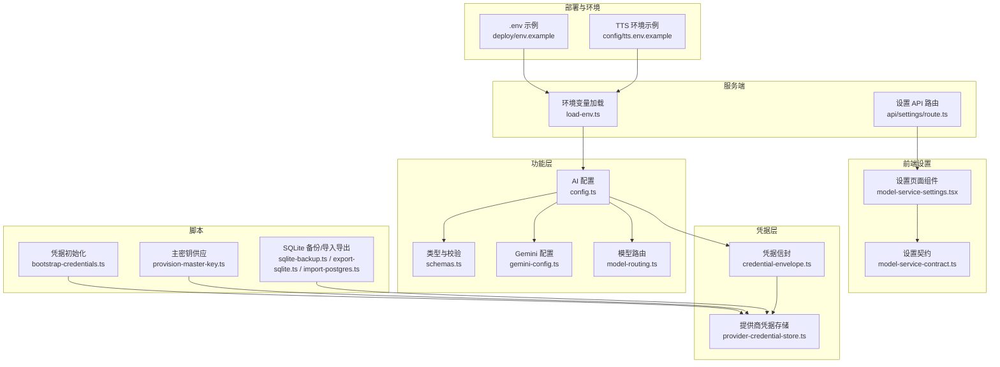
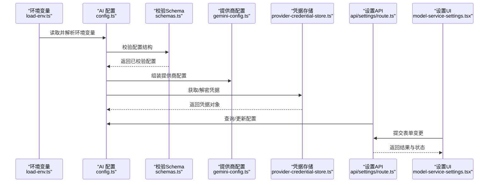
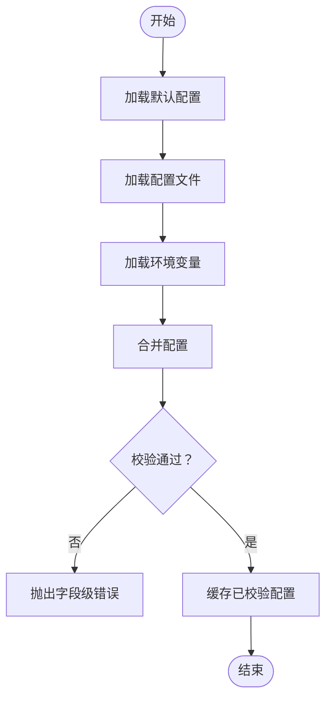
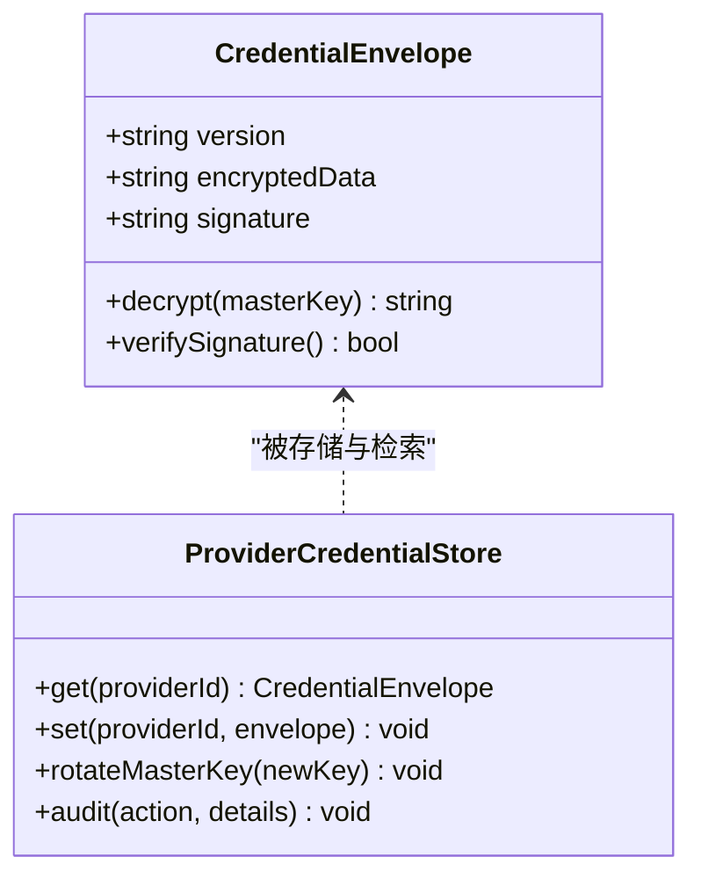
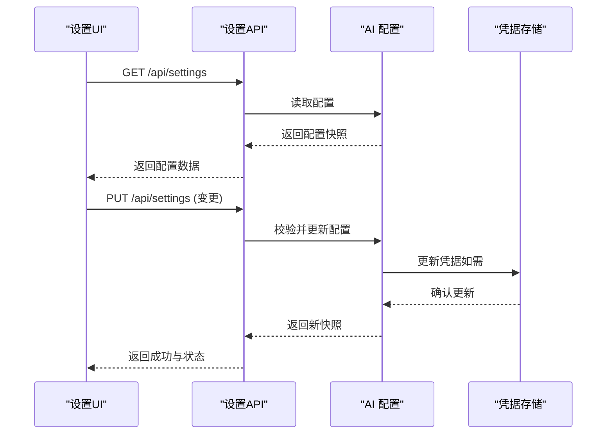
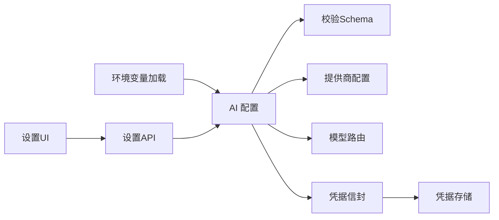

# AI 配置管理

<cite>
**本文引用的文件**   
- [config.ts](file://src/features/ai/config.ts)
- [schemas.ts](file://src/features/ai/schemas.ts)
- [gemini-config.ts](file://src/features/ai/gemini-config.ts)
- [model-routing.ts](file://src/features/ai/model-routing.ts)
- [credential-envelope.ts](file://src/features/credentials/credential-envelope.ts)
- [provider-credential-store.ts](file://src/features/credentials/provider-credential-store.ts)
- [load-env.ts](file://server/src/lib/load-env.ts)
- [tts.env.example](file://config/tts.env.example)
- [env.example](file://deploy/env.example)
- [worker.env.example](file://deploy/worker.env.example)
- [bootstrap-credentials.ts](file://scripts/setup/bootstrap-credentials.ts)
- [provision-master-key.ts](file://scripts/migration/provision-master-key.ts)
- [sqlite-backup.ts](file://scripts/migration/sqlite-backup.ts)
- [export-sqlite.ts](file://scripts/migration/export-sqlite.ts)
- [import-postgres.ts](file://scripts/migration/import-postgres.ts)
- [reconcile-postgres.ts](file://scripts/migration/reconcile-postgres.ts)
- [route.ts](file://src/app/api/settings/route.ts)
- [model-service-settings.tsx](file://src/app/products/(app)/settings/model-service-settings.tsx)
- [model-service-contract.ts](file://src/app/products/(app)/settings/model-service-contract.ts)
- [ISSUE-011-settings-placeholders.md](file://docs/issues/ISSUE-011-settings-placeholders.md)
- [ISSUE-003-next-ai-credentials.md](file://docs/issues/ISSUE-003-next-ai-credentials.md)
</cite>

## 目录
1. [简介](#简介)
2. [项目结构](#项目结构)
3. [核心组件](#核心组件)
4. [架构总览](#架构总览)
5. [详细组件分析](#详细组件分析)
6. [依赖关系分析](#依赖关系分析)
7. [性能考虑](#性能考虑)
8. [故障排查指南](#故障排查指南)
9. [结论](#结论)
10. [附录](#附录)

## 简介
本文件面向 PurpleInk AI 的配置管理系统，聚焦以下目标：
- 明确配置结构设计、验证机制与优先级（环境变量、配置文件、运行时配置）
- 定义提供商设置的合同与类型安全保证
- 说明密钥管理、敏感信息加密与安全存储方案
- 描述配置的动态更新、热重载与版本兼容性处理
- 提供完整配置示例与最佳实践
- 覆盖配置迁移、备份恢复与审计日志能力

## 项目结构
AI 配置相关代码主要分布在以下位置：
- 功能层：src/features/ai（AI 配置、模型路由、提供商配置）
- 凭据层：src/features/credentials（凭据信封、提供商凭据存储）
- 服务端加载：server/src/lib/load-env.ts（环境变量加载）
- 部署与环境：config/ 与 deploy/ 下的 .env 示例
- 脚本：scripts/setup 与 scripts/migration（凭据初始化、主密钥、备份/导入导出）
- 前端设置页：src/app/products/(app)/settings（设置界面与 API 路由）

**图表来源** 
- [config.ts](file://src/features/ai/config.ts)
- [schemas.ts](file://src/features/ai/schemas.ts)
- [gemini-config.ts](file://src/features/ai/gemini-config.ts)
- [model-routing.ts](file://src/features/ai/model-routing.ts)
- [credential-envelope.ts](file://src/features/credentials/credential-envelope.ts)
- [provider-credential-store.ts](file://src/features/credentials/provider-credential-store.ts)
- [load-env.ts](file://server/src/lib/load-env.ts)
- [route.ts](file://src/app/api/settings/route.ts)
- [model-service-settings.tsx](file://src/app/products/(app)/settings/model-service-settings.tsx)
- [model-service-contract.ts](file://src/app/products/(app)/settings/model-service-contract.ts)
- [env.example](file://deploy/env.example)
- [tts.env.example](file://config/tts.env.example)
- [bootstrap-credentials.ts](file://scripts/setup/bootstrap-credentials.ts)
- [provision-master-key.ts](file://scripts/migration/provision-master-key.ts)
- [sqlite-backup.ts](file://scripts/migration/sqlite-backup.ts)
- [export-sqlite.ts](file://scripts/migration/export-sqlite.ts)
- [import-postgres.ts](file://scripts/migration/import-postgres.ts)

**章节来源**
- [config.ts](file://src/features/ai/config.ts)
- [schemas.ts](file://src/features/ai/schemas.ts)
- [gemini-config.ts](file://src/features/ai/gemini-config.ts)
- [model-routing.ts](file://src/features/ai/model-routing.ts)
- [credential-envelope.ts](file://src/features/credentials/credential-envelope.ts)
- [provider-credential-store.ts](file://src/features/credentials/provider-credential-store.ts)
- [load-env.ts](file://server/src/lib/load-env.ts)
- [route.ts](file://src/app/api/settings/route.ts)
- [model-service-settings.tsx](file://src/app/products/(app)/settings/model-service-settings.tsx)
- [model-service-contract.ts](file://src/app/products/(app)/settings/model-service-contract.ts)
- [env.example](file://deploy/env.example)
- [tts.env.example](file://config/tts.env.example)
- [bootstrap-credentials.ts](file://scripts/setup/bootstrap-credentials.ts)
- [provision-master-key.ts](file://scripts/migration/provision-master-key.ts)
- [sqlite-backup.ts](file://scripts/migration/sqlite-backup.ts)
- [export-sqlite.ts](file://scripts/migration/export-sqlite.ts)
- [import-postgres.ts](file://scripts/migration/import-postgres.ts)

## 核心组件
- AI 配置入口：负责聚合各提供商配置、合并优先级、暴露统一访问接口
- 类型与校验：集中定义配置 Schema，确保类型安全与输入校验
- 提供商配置：按提供商维度组织参数（如 Gemini），支持可选字段与默认值
- 模型路由：根据策略选择具体模型或提供商实例
- 凭据管理：凭据信封封装敏感数据，提供商凭据存储实现持久化与访问控制
- 环境变量加载：在服务端启动时加载并校验环境变量
- 设置 API 与前端面板：提供运行时查看与修改配置的能力

**章节来源**
- [config.ts](file://src/features/ai/config.ts)
- [schemas.ts](file://src/features/ai/schemas.ts)
- [gemini-config.ts](file://src/features/ai/gemini-config.ts)
- [model-routing.ts](file://src/features/ai/model-routing.ts)
- [credential-envelope.ts](file://src/features/credentials/credential-envelope.ts)
- [provider-credential-store.ts](file://src/features/credentials/provider-credential-store.ts)
- [load-env.ts](file://server/src/lib/load-env.ts)
- [route.ts](file://src/app/api/settings/route.ts)
- [model-service-settings.tsx](file://src/app/products/(app)/settings/model-service-settings.tsx)

## 架构总览
下图展示了从环境变量到运行时配置的加载与校验流程，以及凭据的加密与存储路径。

**图表来源** 
- [load-env.ts](file://server/src/lib/load-env.ts)
- [config.ts](file://src/features/ai/config.ts)
- [schemas.ts](file://src/features/ai/schemas.ts)
- [gemini-config.ts](file://src/features/ai/gemini-config.ts)
- [provider-credential-store.ts](file://src/features/credentials/provider-credential-store.ts)
- [route.ts](file://src/app/api/settings/route.ts)
- [model-service-settings.tsx](file://src/app/products/(app)/settings/model-service-settings.tsx)

## 详细组件分析

### AI 配置与校验（config.ts + schemas.ts）
- 职责
  - 聚合多源配置（环境变量、配置文件、运行时设置）
  - 使用集中式 Schema 进行类型与值域校验
  - 暴露统一的配置访问接口，供上层模块消费
- 设计要点
  - 分层合并：基础默认值 → 配置文件 → 环境变量 → 运行时设置
  - 严格校验：必填字段、枚举值、范围限制、格式校验
  - 错误反馈：失败时给出清晰的字段级错误信息
- 复杂度与性能
  - 校验在启动与设置更新时执行，建议缓存已校验结果以减少重复开销
  - 大对象合并采用浅拷贝优先，避免不必要的深拷贝

**图表来源** 
- [config.ts](file://src/features/ai/config.ts)
- [schemas.ts](file://src/features/ai/schemas.ts)

**章节来源**
- [config.ts](file://src/features/ai/config.ts)
- [schemas.ts](file://src/features/ai/schemas.ts)

### 提供商配置（gemini-config.ts）
- 职责
  - 定义特定提供商（如 Gemini）的参数结构与默认值
  - 将通用配置映射为提供商所需的具体字段
- 设计要点
  - 字段可选性与默认值管理
  - 与全局配置解耦，便于扩展新提供商
- 类型安全
  - 使用强类型约束，避免运行时类型错误

**章节来源**
- [gemini-config.ts](file://src/features/ai/gemini-config.ts)

### 模型路由（model-routing.ts）
- 职责
  - 根据策略（如权重、健康检查、成本优化）选择模型或提供商
  - 支持动态切换与回退
- 设计要点
  - 路由策略可插拔
  - 与配置系统联动，读取运行时开关与阈值

**章节来源**
- [model-routing.ts](file://src/features/ai/model-routing.ts)

### 凭据信封与存储（credential-envelope.ts + provider-credential-store.ts）
- 职责
  - 凭据信封：对敏感信息进行封装、签名与版本标记
  - 提供商凭据存储：提供加密存储、读取、更新与权限控制
- 设计要点
  - 主密钥管理：通过独立脚本初始化与轮换
  - 最小权限原则：仅允许必要服务访问凭据
  - 审计记录：记录凭据访问与变更事件

**图表来源** 
- [credential-envelope.ts](file://src/features/credentials/credential-envelope.ts)
- [provider-credential-store.ts](file://src/features/credentials/provider-credential-store.ts)

**章节来源**
- [credential-envelope.ts](file://src/features/credentials/credential-envelope.ts)
- [provider-credential-store.ts](file://src/features/credentials/provider-credential-store.ts)

### 环境变量加载（load-env.ts）
- 职责
  - 在服务端启动时加载环境变量，并进行基本校验
  - 将环境变量映射到配置键空间
- 设计要点
  - 区分必需与可选变量
  - 提供清晰的缺失变量提示

**章节来源**
- [load-env.ts](file://server/src/lib/load-env.ts)

### 设置 API 与前端面板（route.ts + model-service-settings.tsx + model-service-contract.ts）
- 职责
  - 提供 REST 接口用于查询与更新 AI 配置
  - 前端面板展示当前配置并提供编辑能力
  - 契约文件定义前后端交互的数据结构
- 设计要点
  - 请求校验与响应格式化
  - 变更后的热重载与缓存失效策略
  - 权限控制与操作审计

**图表来源** 
- [route.ts](file://src/app/api/settings/route.ts)
- [model-service-settings.tsx](file://src/app/products/(app)/settings/model-service-settings.tsx)
- [model-service-contract.ts](file://src/app/products/(app)/settings/model-service-contract.ts)

**章节来源**
- [route.ts](file://src/app/api/settings/route.ts)
- [model-service-settings.tsx](file://src/app/products/(app)/settings/model-service-settings.tsx)
- [model-service-contract.ts](file://src/app/products/(app)/settings/model-service-contract.ts)

### 环境变量与配置文件示例
- 部署与环境示例
  - deploy/env.example：应用运行所需的环境变量模板
  - config/tts.env.example：TTS 相关环境变量模板
- 最佳实践
  - 使用 .env 文件管理本地开发配置，禁止提交敏感信息
  - 生产环境通过容器编排注入环境变量
  - 对必填变量进行启动时校验，失败即中止服务

**章节来源**
- [env.example](file://deploy/env.example)
- [tts.env.example](file://config/tts.env.example)

### 凭据初始化与主密钥管理
- bootstrap-credentials.ts：初始化提供商凭据，生成并写入凭据信封
- provision-master-key.ts：生成或轮换主密钥，确保凭据加密强度
- 安全建议
  - 主密钥与凭据分离存储
  - 定期轮换主密钥，保持向后兼容
  - 限制访问权限，记录审计日志

**章节来源**
- [bootstrap-credentials.ts](file://scripts/setup/bootstrap-credentials.ts)
- [provision-master-key.ts](file://scripts/migration/provision-master-key.ts)

### 配置迁移、备份与恢复
- sqlite-backup.ts：对 SQLite 数据进行备份
- export-sqlite.ts / import-postgres.ts：跨数据库导出与导入
- reconcile-postgres.ts：数据一致性校验与修复
- 建议流程
  - 变更前全量备份
  - 灰度发布与回滚预案
  - 变更后校验关键配置项

**章节来源**
- [sqlite-backup.ts](file://scripts/migration/sqlite-backup.ts)
- [export-sqlite.ts](file://scripts/migration/export-sqlite.ts)
- [import-postgres.ts](file://scripts/migration/import-postgres.ts)
- [reconcile-postgres.ts](file://scripts/migration/reconcile-postgres.ts)

### 版本兼容性与占位符
- ISSUE-011-settings-placeholders.md：讨论设置占位符与版本兼容问题
- 建议
  - 引入配置版本号，支持向前/向后兼容
  - 对废弃字段提供迁移脚本与降级路径

**章节来源**
- [ISSUE-011-settings-placeholders.md](file://docs/issues/ISSUE-011-settings-placeholders.md)

### 凭据设计与安全
- ISSUE-003-next-ai-credentials.md：阐述凭据设计的演进与安全考量
- 建议
  - 使用信封模式封装敏感数据
  - 实施最小权限与访问审计
  - 定期安全评估与渗透测试

**章节来源**
- [ISSUE-003-next-ai-credentials.md](file://docs/issues/ISSUE-003-next-ai-credentials.md)

## 依赖关系分析
- 低耦合高内聚
  - AI 配置与提供商配置解耦，便于扩展
  - 凭据管理与业务逻辑分离，提升安全性
- 外部依赖
  - 环境变量加载依赖运行时环境
  - 设置 API 依赖前端契约与权限控制
- 潜在循环依赖
  - 应避免配置模块直接依赖凭据存储的实现细节，通过接口抽象

**图表来源** 
- [config.ts](file://src/features/ai/config.ts)
- [schemas.ts](file://src/features/ai/schemas.ts)
- [gemini-config.ts](file://src/features/ai/gemini-config.ts)
- [model-routing.ts](file://src/features/ai/model-routing.ts)
- [credential-envelope.ts](file://src/features/credentials/credential-envelope.ts)
- [provider-credential-store.ts](file://src/features/credentials/provider-credential-store.ts)
- [load-env.ts](file://server/src/lib/load-env.ts)
- [route.ts](file://src/app/api/settings/route.ts)
- [model-service-settings.tsx](file://src/app/products/(app)/settings/model-service-settings.tsx)

**章节来源**
- [config.ts](file://src/features/ai/config.ts)
- [schemas.ts](file://src/features/ai/schemas.ts)
- [gemini-config.ts](file://src/features/ai/gemini-config.ts)
- [model-routing.ts](file://src/features/ai/model-routing.ts)
- [credential-envelope.ts](file://src/features/credentials/credential-envelope.ts)
- [provider-credential-store.ts](file://src/features/credentials/provider-credential-store.ts)
- [load-env.ts](file://server/src/lib/load-env.ts)
- [route.ts](file://src/app/api/settings/route.ts)
- [model-service-settings.tsx](file://src/app/products/(app)/settings/model-service-settings.tsx)

## 性能考虑
- 配置校验与合并应在启动阶段完成，运行时尽量只读
- 对频繁访问的配置项进行内存缓存，设置合理的失效策略
- 凭据解密与存储访问应加锁与限流，避免热点竞争
- 设置更新后采用增量刷新，减少全量重建开销

## 故障排查指南
- 常见问题
  - 环境变量缺失或格式错误：检查 .env 与容器注入
  - 凭据解密失败：核对主密钥版本与权限
  - 配置校验失败：查看字段级错误信息
- 排查步骤
  - 启用详细日志，定位错误堆栈
  - 使用设置 API 查询当前快照，对比期望值
  - 通过备份与迁移脚本恢复至稳定版本

**章节来源**
- [load-env.ts](file://server/src/lib/load-env.ts)
- [credential-envelope.ts](file://src/features/credentials/credential-envelope.ts)
- [provider-credential-store.ts](file://src/features/credentials/provider-credential-store.ts)
- [route.ts](file://src/app/api/settings/route.ts)

## 结论
PurpleInk AI 的配置管理系统以类型安全与强校验为核心，结合凭据信封与加密存储，实现了安全、可扩展且易于维护的配置能力。通过设置 API 与前端面板，支持运行时动态更新与热重载；借助迁移与备份脚本，保障数据安全与版本兼容。建议在生产环境中严格执行最小权限、审计与轮换策略，持续提升系统的安全性与稳定性。

## 附录
- 配置优先级建议
  - 默认值 < 配置文件 < 环境变量 < 运行时设置
- 最佳实践清单
  - 使用强类型 Schema 校验所有配置
  - 分离敏感信息与业务配置
  - 定期轮换主密钥并审计凭据访问
  - 变更前备份，变更后校验
  - 对废弃字段提供迁移与降级路径