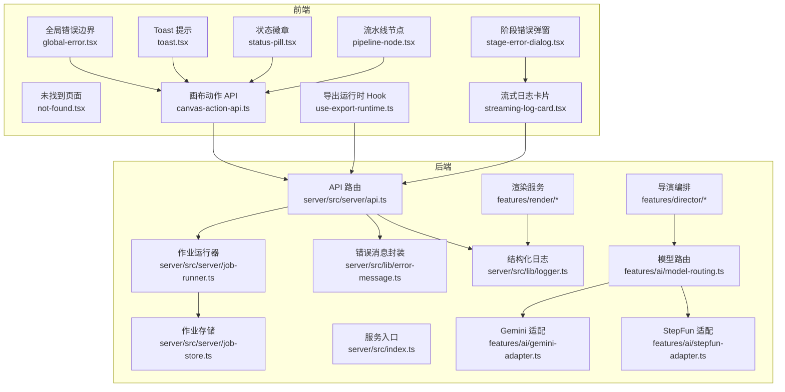
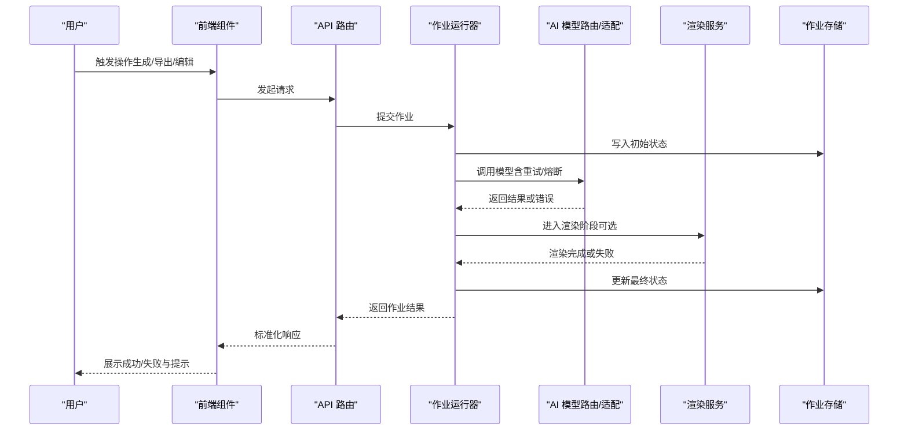
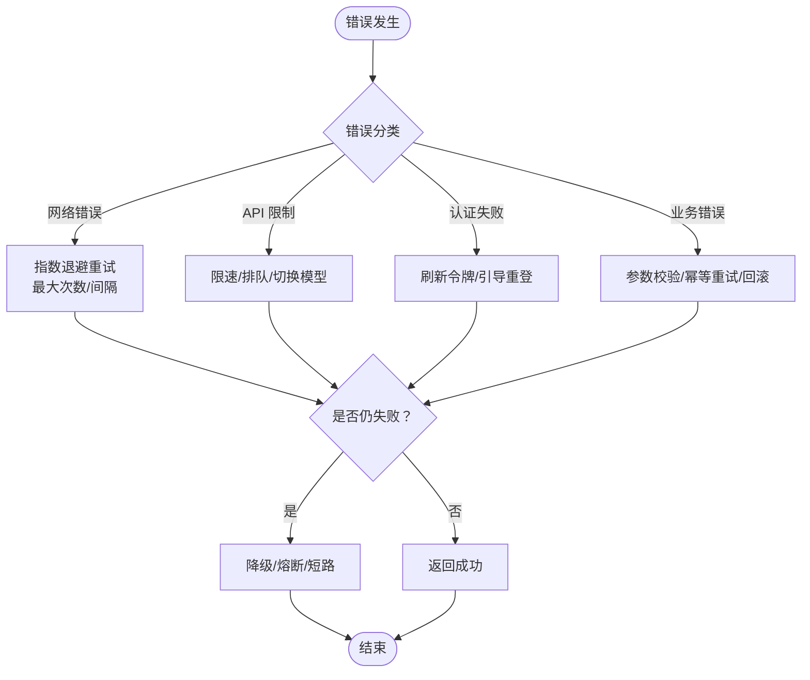
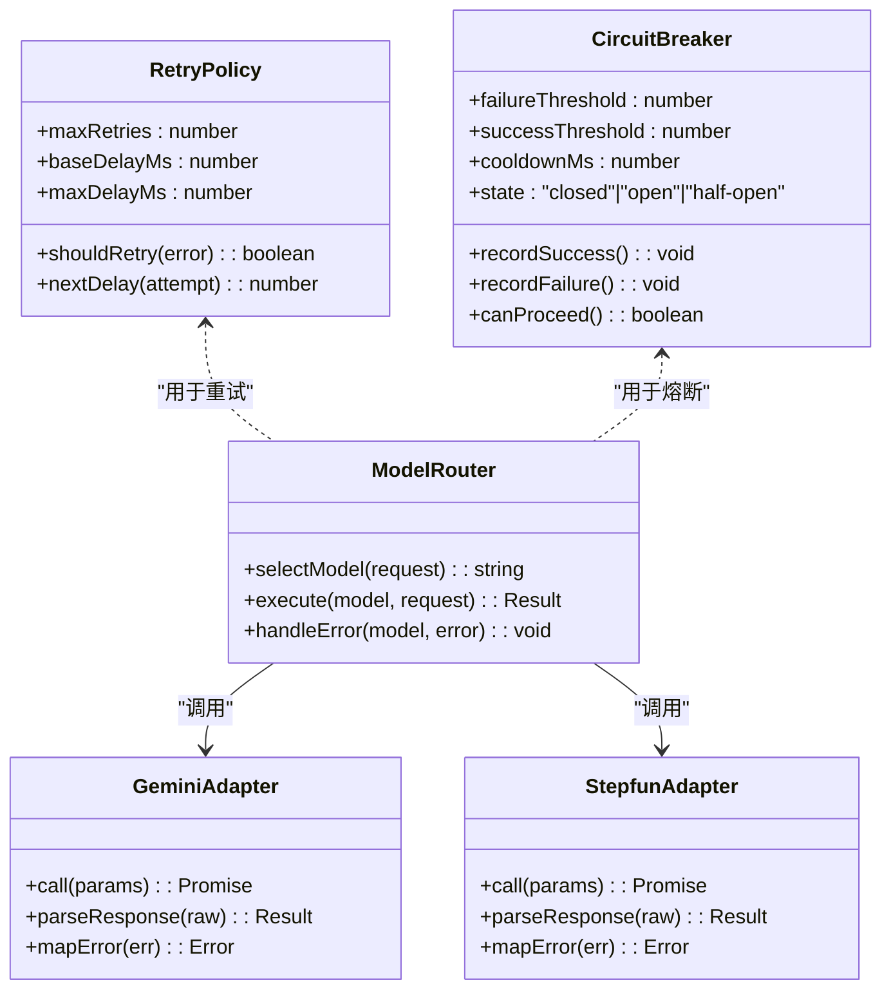
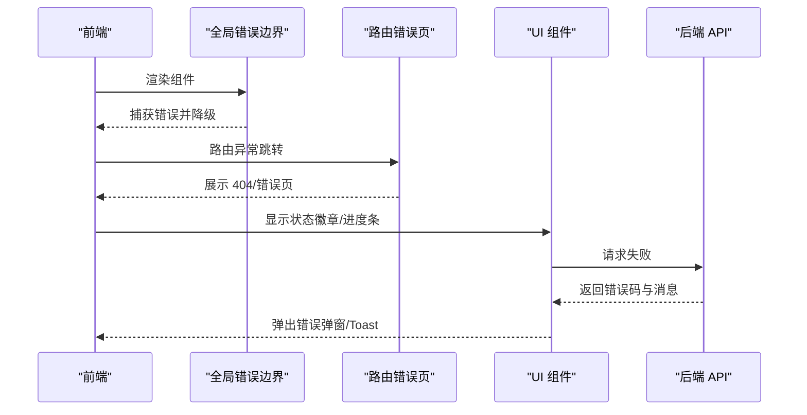
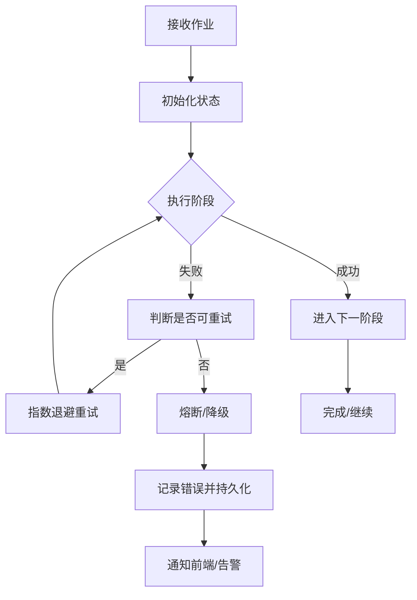
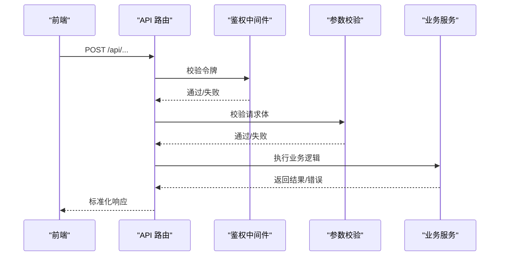
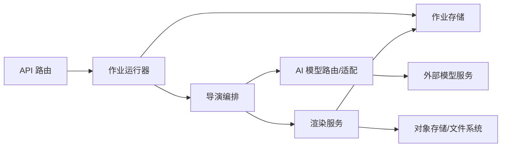

# AI 错误处理

<cite>
**本文引用的文件**   
- [error-message.ts](file://server/src/lib/error-message.ts)
- [logger.ts](file://server/src/lib/logger.ts)
- [job-runner.ts](file://server/src/server/job-runner.ts)
- [job-store.ts](file://server/src/server/job-store.ts)
- [api.ts](file://server/src/server/api.ts)
- [index.ts](file://server/src/index.ts)
- [global-error.tsx](file://src/app/global-error.tsx)
- [not-found.tsx](file://src/app/not-found.tsx)
- [route.ts](file://src/app/api/artifacts/[id]/route.ts)
- [route.ts](file://src/app/api/director/pipeline/route.ts)
- [route.ts](file://src/app/api/director/stage/route.ts)
- [route.ts](file://src/app/api/render/route.ts)
- [route.ts](file://src/app/api/jobs/[id]/route.ts)
- [model-routing.ts](file://src/features/ai/model-routing.ts)
- [gemini-adapter.ts](file://src/features/ai/gemini-adapter.ts)
- [stepfun-adapter.ts](file://src/features/ai/stepfun-adapter.ts)
- [pi-provider.ts](file://src/features/director/pi-provider.ts)
- [stage-runner.ts](file://src/features/director/stage-runner.ts)
- [queue-handler.ts](file://src/features/director/queue-handler.ts)
- [export-service.ts](file://src/features/render/export-service.ts)
- [renderer.ts](file://src/features/render/renderer.ts)
- [repository.ts](file://src/features/render/repository.ts)
- [canvas-action-api.ts](file://src/app/products/(app)/canvas/[projectId]/canvas-action-api.ts)
- [use-export-runtime.ts](file://src/app/products/(app)/export/[projectId]/use-export-runtime.ts)
- [streaming-log-card.tsx](file://src/app/products/(app)/canvas/[projectId]/streaming-log-card.tsx)
- [stage-error-dialog.tsx](file://src/app/products/(app)/canvas/[projectId]/stage-error-dialog.tsx)
- [toast.tsx](file://src/components/ui/toast.tsx)
- [status-pill.tsx](file://src/components/ui/status-pill.tsx)
- [pipeline-node.tsx](file://src/components/ui/pipeline-node.tsx)
</cite>

## 目录
1. [简介](#简介)
2. [项目结构](#项目结构)
3. [核心组件](#核心组件)
4. [架构总览](#架构总览)
5. [详细组件分析](#详细组件分析)
6. [依赖关系分析](#依赖关系分析)
7. [性能考量](#性能考量)
8. [故障排查指南](#故障排查指南)
9. [结论](#结论)
10. [附录](#附录)

## 简介
本文件系统性梳理 PurpleInk AI 的错误处理机制，覆盖错误分类、重试与容错策略（指数退避、熔断器、断路器）、监控告警与诊断工具、日志记录与分析方法、常见错误排查步骤与解决方案，以及用户体验优化（友好提示与降级服务）。文档面向开发与运维人员，同时兼顾非技术读者的可理解性。

## 项目结构
PurpleInk 的错误处理贯穿前后端：
- 服务端：统一的错误消息封装、结构化日志、作业调度与执行、API 层错误响应、AI 模型适配层与编排层的错误传播。
- 前端：全局错误边界、路由级错误页、任务流状态展示、用户提示与降级 UI。

**图表来源** 
- [global-error.tsx](file://src/app/global-error.tsx)
- [not-found.tsx](file://src/app/not-found.tsx)
- [canvas-action-api.ts](file://src/app/products/(app)/canvas/[projectId]/canvas-action-api.ts)
- [use-export-runtime.ts](file://src/app/products/(app)/export/[projectId]/use-export-runtime.ts)
- [streaming-log-card.tsx](file://src/app/products/(app)/canvas/[projectId]/streaming-log-card.tsx)
- [stage-error-dialog.tsx](file://src/app/products/(app)/canvas/[projectId]/stage-error-dialog.tsx)
- [toast.tsx](file://src/components/ui/toast.tsx)
- [status-pill.tsx](file://src/components/ui/status-pill.tsx)
- [pipeline-node.tsx](file://src/components/ui/pipeline-node.tsx)
- [api.ts](file://server/src/server/api.ts)
- [job-runner.ts](file://server/src/server/job-runner.ts)
- [job-store.ts](file://server/src/server/job-store.ts)
- [error-message.ts](file://server/src/lib/error-message.ts)
- [logger.ts](file://server/src/lib/logger.ts)
- [model-routing.ts](file://src/features/ai/model-routing.ts)
- [gemini-adapter.ts](file://src/features/ai/gemini-adapter.ts)
- [stepfun-adapter.ts](file://src/features/ai/stepfun-adapter.ts)

**章节来源**
- [index.ts](file://server/src/index.ts)
- [api.ts](file://server/src/server/api.ts)
- [job-runner.ts](file://server/src/server/job-runner.ts)
- [job-store.ts](file://server/src/server/job-store.ts)
- [error-message.ts](file://server/src/lib/error-message.ts)
- [logger.ts](file://server/src/lib/logger.ts)

## 核心组件
- 错误消息封装：统一错误码、消息模板与上下文注入，便于前端展示与日志检索。
- 结构化日志：按级别输出请求 ID、阶段、错误类型、堆栈摘要等字段，支持聚合分析。
- 作业运行器：负责异步任务的调度、重试、失败回滚与状态持久化。
- 模型路由与适配：对多模型调用进行统一封装，集中处理网络异常、限流与鉴权失败。
- 前端错误边界与提示：捕获渲染期与运行时错误，提供降级 UI 与友好提示。

**章节来源**
- [error-message.ts](file://server/src/lib/error-message.ts)
- [logger.ts](file://server/src/lib/logger.ts)
- [job-runner.ts](file://server/src/server/job-runner.ts)
- [model-routing.ts](file://src/features/ai/model-routing.ts)
- [gemini-adapter.ts](file://src/features/ai/gemini-adapter.ts)
- [stepfun-adapter.ts](file://src/features/ai/stepfun-adapter.ts)
- [global-error.tsx](file://src/app/global-error.tsx)

## 架构总览
下图展示了从前端到后端的错误处理链路，包括 API 路由、作业调度、AI 模型调用与渲染服务的错误传播路径。

**图表来源** 
- [api.ts](file://server/src/server/api.ts)
- [job-runner.ts](file://server/src/server/job-runner.ts)
- [job-store.ts](file://server/src/server/job-store.ts)
- [model-routing.ts](file://src/features/ai/model-routing.ts)
- [gemini-adapter.ts](file://src/features/ai/gemini-adapter.ts)
- [stepfun-adapter.ts](file://src/features/ai/stepfun-adapter.ts)
- [renderer.ts](file://src/features/render/renderer.ts)
- [export-service.ts](file://src/features/render/export-service.ts)

## 详细组件分析

### 错误分类与处理策略
- 网络错误：连接超时、DNS 解析失败、TLS 握手失败等。策略：指数退避重试、快速失败、熔断保护。
- API 限制：速率限制、配额不足、并发上限。策略：排队与节流、退避时间计算、切换备用模型。
- 认证失败：令牌过期、权限不足、密钥无效。策略：刷新令牌、引导重新登录、拒绝敏感操作。
- 业务逻辑错误：参数校验失败、资源不存在、状态不合法。策略：明确错误码与消息、前端表单校验、幂等重试。

**图表来源** 
- [model-routing.ts](file://src/features/ai/model-routing.ts)
- [gemini-adapter.ts](file://src/features/ai/gemini-adapter.ts)
- [stepfun-adapter.ts](file://src/features/ai/stepfun-adapter.ts)
- [job-runner.ts](file://server/src/server/job-runner.ts)

**章节来源**
- [model-routing.ts](file://src/features/ai/model-routing.ts)
- [gemini-adapter.ts](file://src/features/ai/gemini-adapter.ts)
- [stepfun-adapter.ts](file://src/features/ai/stepfun-adapter.ts)
- [job-runner.ts](file://server/src/server/job-runner.ts)

### 错误重试机制（指数退避、熔断器、断路器）
- 指数退避：在连续失败时逐步增加等待时间，避免雪崩；设置最大重试次数与上限间隔。
- 熔断器：当错误率超过阈值时快速失败，减少下游压力；冷却一段时间后半开探测恢复。
- 断路器：针对特定依赖（如某模型或外部服务）隔离故障，切换到健康分支或降级路径。

**图表来源** 
- [model-routing.ts](file://src/features/ai/model-routing.ts)
- [gemini-adapter.ts](file://src/features/ai/gemini-adapter.ts)
- [stepfun-adapter.ts](file://src/features/ai/stepfun-adapter.ts)

**章节来源**
- [model-routing.ts](file://src/features/ai/model-routing.ts)
- [gemini-adapter.ts](file://src/features/ai/gemini-adapter.ts)
- [stepfun-adapter.ts](file://src/features/ai/stepfun-adapter.ts)

### 错误监控、告警与诊断
- 结构化日志：包含请求 ID、阶段、错误类型、堆栈摘要、耗时与资源指标，便于聚合与检索。
- 指标采集：错误率、延迟分布、重试次数、熔断状态、队列积压等关键指标。
- 告警规则：基于阈值（错误率突增、熔断频繁打开、队列长时间堆积）触发通知。
- 诊断工具：链路追踪、错误快照、上下文数据收集（参数、环境、配置片段脱敏）。

**章节来源**
- [logger.ts](file://server/src/lib/logger.ts)
- [job-runner.ts](file://server/src/server/job-runner.ts)
- [job-store.ts](file://server/src/server/job-store.ts)

### 错误日志记录格式与分析方法
- 建议字段：timestamp、level、requestId、component、message、errorCode、stack、context、durationMs、tags。
- 分析方法：按 errorCode 聚合统计、按 component 定位模块、按 requestId 串联链路、按 tags 过滤场景。
- 安全注意：脱敏敏感信息（密钥、用户标识），保留必要上下文以便复现。

**章节来源**
- [logger.ts](file://server/src/lib/logger.ts)
- [error-message.ts](file://server/src/lib/error-message.ts)

### 前端错误边界与用户体验优化
- 全局错误边界：捕获 React 渲染期错误，显示友好提示并提供重试按钮。
- 路由级错误页：处理 404 与未知路由，提供导航回退。
- 任务流状态展示：通过状态徽章与进度条反馈当前阶段与失败原因。
- 流式日志与错误弹窗：实时展示阶段日志，失败时弹出可操作的错误详情。
- Toast 提示：轻量级成功/失败反馈，提升交互体验。

**图表来源** 
- [global-error.tsx](file://src/app/global-error.tsx)
- [not-found.tsx](file://src/app/not-found.tsx)
- [status-pill.tsx](file://src/components/ui/status-pill.tsx)
- [pipeline-node.tsx](file://src/components/ui/pipeline-node.tsx)
- [streaming-log-card.tsx](file://src/app/products/(app)/canvas/[projectId]/streaming-log-card.tsx)
- [stage-error-dialog.tsx](file://src/app/products/(app)/canvas/[projectId]/stage-error-dialog.tsx)
- [toast.tsx](file://src/components/ui/toast.tsx)

**章节来源**
- [global-error.tsx](file://src/app/global-error.tsx)
- [not-found.tsx](file://src/app/not-found.tsx)
- [status-pill.tsx](file://src/components/ui/status-pill.tsx)
- [pipeline-node.tsx](file://src/components/ui/pipeline-node.tsx)
- [streaming-log-card.tsx](file://src/app/products/(app)/canvas/[projectId]/streaming-log-card.tsx)
- [stage-error-dialog.tsx](file://src/app/products/(app)/canvas/[projectId]/stage-error-dialog.tsx)
- [toast.tsx](file://src/components/ui/toast.tsx)

### 作业与渲染流程中的错误处理
- 作业运行器：负责生命周期管理、重试、失败回滚与状态持久化。
- 渲染服务：处理媒体编码、帧序列、缩略图生成等阶段的错误，支持部分失败与恢复。
- 存储层：确保作业状态一致性与可恢复性，支持断点续跑。

**图表来源** 
- [job-runner.ts](file://server/src/server/job-runner.ts)
- [job-store.ts](file://server/src/server/job-store.ts)
- [renderer.ts](file://src/features/render/renderer.ts)
- [export-service.ts](file://src/features/render/export-service.ts)

**章节来源**
- [job-runner.ts](file://server/src/server/job-runner.ts)
- [job-store.ts](file://server/src/server/job-store.ts)
- [renderer.ts](file://src/features/render/renderer.ts)
- [export-service.ts](file://src/features/render/export-service.ts)

### API 路由与错误响应
- 统一错误响应：标准化错误码、消息与上下文，便于前端解析与展示。
- 参数校验：前置校验失败直接返回 4xx，避免进入业务逻辑。
- 鉴权与授权：令牌校验失败返回 401/403，并引导重新登录。

**图表来源** 
- [api.ts](file://server/src/server/api.ts)
- [route.ts](file://src/app/api/artifacts/[id]/route.ts)
- [route.ts](file://src/app/api/director/pipeline/route.ts)
- [route.ts](file://src/app/api/director/stage/route.ts)
- [route.ts](file://src/app/api/render/route.ts)
- [route.ts](file://src/app/api/jobs/[id]/route.ts)

**章节来源**
- [api.ts](file://server/src/server/api.ts)
- [route.ts](file://src/app/api/artifacts/[id]/route.ts)
- [route.ts](file://src/app/api/director/pipeline/route.ts)
- [route.ts](file://src/app/api/director/stage/route.ts)
- [route.ts](file://src/app/api/render/route.ts)
- [route.ts](file://src/app/api/jobs/[id]/route.ts)

### 前端 API 调用与错误处理
- 画布动作 API：封装画布相关操作，统一处理网络与业务错误，提供重试与降级。
- 导出运行时 Hook：管理导出任务状态、错误提示与进度反馈。
- 流式日志与错误弹窗：实时展示阶段日志，失败时弹出可操作的错误详情。

**章节来源**
- [canvas-action-api.ts](file://src/app/products/(app)/canvas/[projectId]/canvas-action-api.ts)
- [use-export-runtime.ts](file://src/app/products/(app)/export/[projectId]/use-export-runtime.ts)
- [streaming-log-card.tsx](file://src/app/products/(app)/canvas/[projectId]/streaming-log-card.tsx)
- [stage-error-dialog.tsx](file://src/app/products/(app)/canvas/[projectId]/stage-error-dialog.tsx)

## 依赖关系分析
- 低耦合高内聚：错误处理在各层独立实现，通过标准接口传递错误对象与上下文。
- 外部依赖：AI 模型服务、渲染引擎、数据库与对象存储的异常需被上层捕获与转化。
- 潜在循环依赖：通过抽象层与事件总线解耦，避免模块间直接强引用。

**图表来源** 
- [api.ts](file://server/src/server/api.ts)
- [job-runner.ts](file://server/src/server/job-runner.ts)
- [job-store.ts](file://server/src/server/job-store.ts)
- [model-routing.ts](file://src/features/ai/model-routing.ts)
- [gemini-adapter.ts](file://src/features/ai/gemini-adapter.ts)
- [stepfun-adapter.ts](file://src/features/ai/stepfun-adapter.ts)
- [renderer.ts](file://src/features/render/renderer.ts)
- [export-service.ts](file://src/features/render/export-service.ts)

**章节来源**
- [api.ts](file://server/src/server/api.ts)
- [job-runner.ts](file://server/src/server/job-runner.ts)
- [job-store.ts](file://server/src/server/job-store.ts)
- [model-routing.ts](file://src/features/ai/model-routing.ts)
- [gemini-adapter.ts](file://src/features/ai/gemini-adapter.ts)
- [stepfun-adapter.ts](file://src/features/ai/stepfun-adapter.ts)
- [renderer.ts](file://src/features/render/renderer.ts)
- [export-service.ts](file://src/features/render/export-service.ts)

## 性能考量
- 重试与熔断：合理设置最大重试次数与冷却时间，避免放大负载。
- 队列与并发：控制并发度与队列长度，防止内存与 CPU 峰值过高。
- 缓存与幂等：对读多写少场景启用缓存，对写操作保证幂等以减少重复成本。
- 日志采样：在高吞吐下对调试日志进行采样，降低 IO 开销。

[本节为通用指导，无需具体文件来源]

## 故障排查指南
- 网络错误：检查 DNS、代理、防火墙与 TLS 配置；查看连接超时与重试日志。
- API 限制：确认配额与速率限制策略；观察熔断状态与切换模型日志。
- 认证失败：验证令牌有效期与权限范围；检查刷新令牌流程与重登引导。
- 业务错误：核对参数校验规则与状态机约束；查看错误码与上下文数据。
- 渲染失败：检查输入文件格式与尺寸；查看编码参数与磁盘空间。

**章节来源**
- [logger.ts](file://server/src/lib/logger.ts)
- [error-message.ts](file://server/src/lib/error-message.ts)
- [job-runner.ts](file://server/src/server/job-runner.ts)
- [model-routing.ts](file://src/features/ai/model-routing.ts)
- [renderer.ts](file://src/features/render/renderer.ts)

## 结论
PurpleInk AI 的错误处理体系以统一的消息封装与结构化日志为基础，结合指数退避、熔断器与断路器模式，有效应对网络、限流、认证与业务错误。前端通过错误边界与友好的 UI 反馈提升用户体验。建议在后续迭代中完善指标采集与告警规则，持续优化重试与降级策略，保障系统稳定性与可观测性。

[本节为总结性内容，无需具体文件来源]

## 附录
- 错误码规范：定义错误码命名约定与层级（网络、鉴权、业务、系统）。
- 日志字段字典：统一字段含义与示例，便于跨团队对齐。
- 降级策略清单：列出各模块的降级路径与回退方案。
- 监控看板建议：推荐关键指标与可视化布局。

[本节为补充说明，无需具体文件来源]