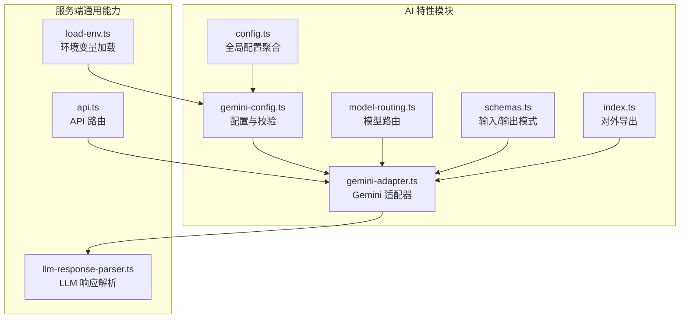
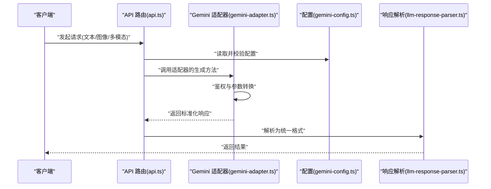
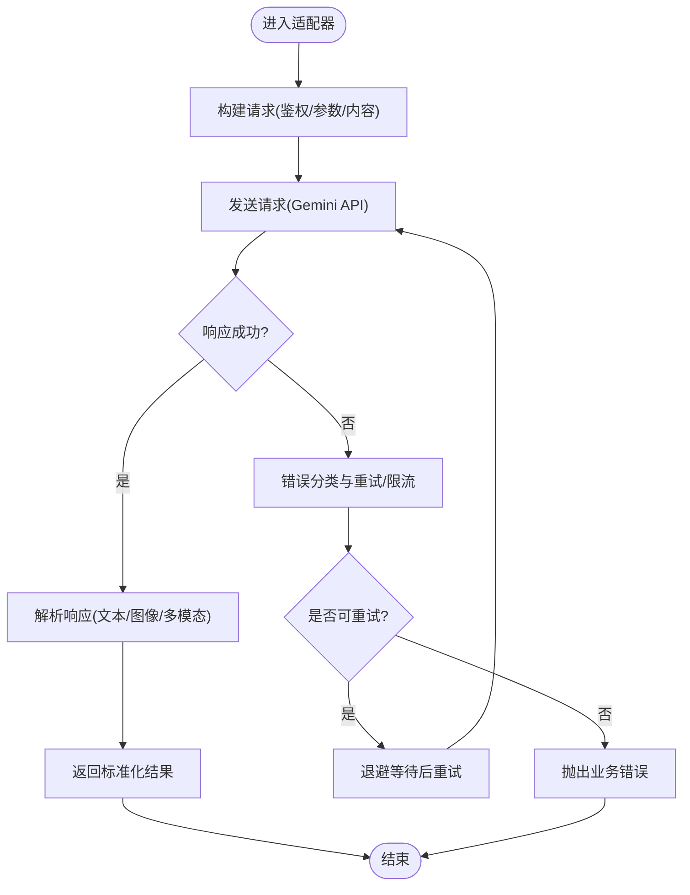
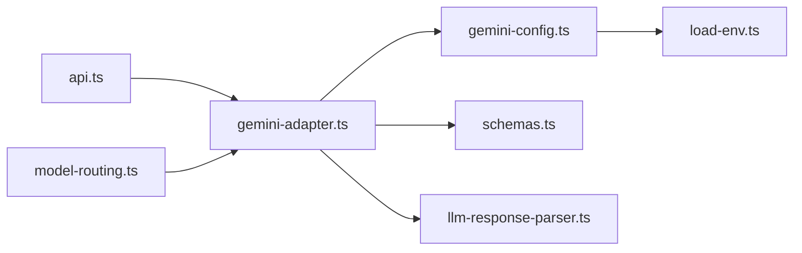

# Gemini 模型集成

<cite>
**本文引用的文件**   
- [src/features/ai/gemini-adapter.ts](file://src/features/ai/gemini-adapter.ts)
- [src/features/ai/gemini-config.ts](file://src/features/ai/gemini-config.ts)
- [src/features/ai/config.ts](file://src/features/ai/config.ts)
- [src/features/ai/model-routing.ts](file://src/features/ai/model-routing.ts)
- [src/features/ai/schemas.ts](file://src/features/ai/schemas.ts)
- [src/features/ai/index.ts](file://src/features/ai/index.ts)
- [server/src/lib/llm-response-parser.ts](file://server/src/lib/llm-response-parser.ts)
- [server/src/lib/load-env.ts](file://server/src/lib/load-env.ts)
- [server/src/server/api.ts](file://server/src/server/api.ts)
</cite>

## 目录
1. [简介](#简介)
2. [项目结构](#项目结构)
3. [核心组件](#核心组件)
4. [架构总览](#架构总览)
5. [详细组件分析](#详细组件分析)
6. [依赖关系分析](#依赖关系分析)
7. [性能考量](#性能考量)
8. [故障排查指南](#故障排查指南)
9. [结论](#结论)
10. [附录](#附录)

## 简介
本文件面向需要在项目中集成 Google Gemini AI 模型的开发者，提供从认证配置、请求格式转换到响应解析的完整实现说明。文档涵盖支持的模型类型、功能特性与使用限制，给出完整的配置选项（API 密钥设置、模型参数调优与安全配置），并提供文本生成、图像理解与多模态处理的调用示例路径。同时包含错误处理策略、速率限制建议与最佳实践，帮助你在生产环境中稳定高效地使用 Gemini。

## 项目结构
Gemini 集成位于前端特性模块 src/features/ai 中，并通过 server 层的通用 LLM 响应解析器进行统一输出处理。关键目录与职责：
- src/features/ai：Gemini 适配器、配置、路由与模式定义
- server/src/lib：LLM 响应解析与环境加载等通用能力
- server/src/server：API 层入口，用于对外暴露服务接口

图表来源
- [src/features/ai/gemini-adapter.ts](file://src/features/ai/gemini-adapter.ts)
- [src/features/ai/gemini-config.ts](file://src/features/ai/gemini-config.ts)
- [src/features/ai/model-routing.ts](file://src/features/ai/model-routing.ts)
- [src/features/ai/schemas.ts](file://src/features/ai/schemas.ts)
- [src/features/ai/config.ts](file://src/features/ai/config.ts)
- [src/features/ai/index.ts](file://src/features/ai/index.ts)
- [server/src/lib/llm-response-parser.ts](file://server/src/lib/llm-response-parser.ts)
- [server/src/lib/load-env.ts](file://server/src/lib/load-env.ts)
- [server/src/server/api.ts](file://server/src/server/api.ts)

章节来源
- [src/features/ai/gemini-adapter.ts](file://src/features/ai/gemini-adapter.ts)
- [src/features/ai/gemini-config.ts](file://src/features/ai/gemini-config.ts)
- [src/features/ai/model-routing.ts](file://src/features/ai/model-routing.ts)
- [src/features/ai/schemas.ts](file://src/features/ai/schemas.ts)
- [src/features/ai/config.ts](file://src/features/ai/config.ts)
- [src/features/ai/index.ts](file://src/features/ai/index.ts)
- [server/src/lib/llm-response-parser.ts](file://server/src/lib/llm-response-parser.ts)
- [server/src/lib/load-env.ts](file://server/src/lib/load-env.ts)
- [server/src/server/api.ts](file://server/src/server/api.ts)

## 核心组件
- Gemini 适配器：封装与 Google Gemini API 的交互，负责鉴权、请求构造、流式与非流式调用、错误重试与限流控制。
- 配置模块：集中管理 API Key、模型选择、安全与超时等参数，并进行运行时校验。
- 模型路由：根据任务类型或用户选择将请求分发到合适的 Gemini 模型。
- 模式定义：统一输入/输出的数据结构与校验规则，确保前后端一致性。
- 响应解析：将 Gemini 原始响应转换为应用内部标准格式，便于上层消费。

章节来源
- [src/features/ai/gemini-adapter.ts](file://src/features/ai/gemini-adapter.ts)
- [src/features/ai/gemini-config.ts](file://src/features/ai/gemini-config.ts)
- [src/features/ai/model-routing.ts](file://src/features/ai/model-routing.ts)
- [src/features/ai/schemas.ts](file://src/features/ai/schemas.ts)
- [server/src/lib/llm-response-parser.ts](file://server/src/lib/llm-response-parser.ts)

## 架构总览
下图展示从 API 入口到 Gemini 适配器再到响应解析的整体流程。

图表来源
- [server/src/server/api.ts](file://server/src/server/api.ts)
- [src/features/ai/gemini-adapter.ts](file://src/features/ai/gemini-adapter.ts)
- [src/features/ai/gemini-config.ts](file://src/features/ai/gemini-config.ts)
- [server/src/lib/llm-response-parser.ts](file://server/src/lib/llm-response-parser.ts)

## 详细组件分析

### Gemini 适配器（gemini-adapter.ts）
- 职责
  - 构建 HTTP 请求头与 Body，支持文本、图像与多模态输入
  - 处理鉴权（API Key）、重试与速率限制
  - 统一错误码映射与异常包装
  - 可选流式输出处理
- 关键点
  - 请求体构造遵循 Gemini 官方规范，确保字段命名与嵌套结构正确
  - 对网络错误、配额超限、模型不可用等情况进行差异化处理
  - 通过配置注入超时、并发与重试策略

图表来源
- [src/features/ai/gemini-adapter.ts](file://src/features/ai/gemini-adapter.ts)

章节来源
- [src/features/ai/gemini-adapter.ts](file://src/features/ai/gemini-adapter.ts)

### 配置模块（gemini-config.ts / config.ts）
- 职责
  - 加载并校验环境变量（如 API Key、Base URL、超时、并发）
  - 提供默认值与严格校验，防止运行时配置错误
  - 聚合全局 AI 配置，供其他模块使用
- 关键点
  - 敏感信息仅从环境变量获取，避免硬编码
  - 提供最小可用配置与扩展配置两类接口
  - 支持按环境切换不同配置集（开发/测试/生产）

章节来源
- [src/features/ai/gemini-config.ts](file://src/features/ai/gemini-config.ts)
- [src/features/ai/config.ts](file://src/features/ai/config.ts)
- [server/src/lib/load-env.ts](file://server/src/lib/load-env.ts)

### 模型路由（model-routing.ts）
- 职责
  - 根据任务类型（文本生成、图像理解、多模态）选择合适模型
  - 支持动态模型切换与回退策略
- 关键点
  - 路由表维护模型能力与适用场景
  - 失败时自动降级到备选模型

章节来源
- [src/features/ai/model-routing.ts](file://src/features/ai/model-routing.ts)

### 模式定义（schemas.ts）
- 职责
  - 定义输入/输出的 JSON Schema，确保数据一致性
  - 在适配器与解析器之间作为契约
- 关键点
  - 文本、图像与多模态输入的结构化描述
  - 输出字段校验与缺失字段提示

章节来源
- [src/features/ai/schemas.ts](file://src/features/ai/schemas.ts)

### 对外导出（index.ts）
- 职责
  - 统一导出适配器与配置，简化上层引用
- 关键点
  - 保持最小 API 暴露面，隐藏内部细节

章节来源
- [src/features/ai/index.ts](file://src/features/ai/index.ts)

### 响应解析（llm-response-parser.ts）
- 职责
  - 将 Gemini 原始响应转换为应用内标准格式
  - 处理流式片段合并与最终结果组装
- 关键点
  - 兼容多种响应结构，保证稳定性
  - 错误信息规范化，便于前端展示

章节来源
- [server/src/lib/llm-response-parser.ts](file://server/src/lib/llm-response-parser.ts)

## 依赖关系分析
- 耦合度
  - 适配器强依赖配置与模式定义，弱依赖响应解析器
  - 路由模块独立于具体实现，便于替换后端
- 外部依赖
  - Google Gemini API（HTTP/REST 或 SDK）
  - 环境变量加载库
- 潜在循环依赖
  - 通过 index.ts 统一导出，避免直接循环引用

图表来源
- [server/src/server/api.ts](file://server/src/server/api.ts)
- [src/features/ai/gemini-adapter.ts](file://src/features/ai/gemini-adapter.ts)
- [src/features/ai/gemini-config.ts](file://src/features/ai/gemini-config.ts)
- [src/features/ai/schemas.ts](file://src/features/ai/schemas.ts)
- [server/src/lib/llm-response-parser.ts](file://server/src/lib/llm-response-parser.ts)
- [server/src/lib/load-env.ts](file://server/src/lib/load-env.ts)
- [src/features/ai/model-routing.ts](file://src/features/ai/model-routing.ts)

章节来源
- [server/src/server/api.ts](file://server/src/server/api.ts)
- [src/features/ai/gemini-adapter.ts](file://src/features/ai/gemini-adapter.ts)
- [src/features/ai/gemini-config.ts](file://src/features/ai/gemini-config.ts)
- [src/features/ai/schemas.ts](file://src/features/ai/schemas.ts)
- [server/src/lib/llm-response-parser.ts](file://server/src/lib/llm-response-parser.ts)
- [server/src/lib/load-env.ts](file://server/src/lib/load-env.ts)
- [src/features/ai/model-routing.ts](file://src/features/ai/model-routing.ts)

## 性能考量
- 连接与并发
  - 合理设置最大并发请求数，避免触发服务端限流
  - 复用连接池，减少握手开销
- 超时与重试
  - 针对网络抖动设置短超时与指数退避重试
  - 区分可重试与不可重试错误，避免无效重试
- 流式输出
  - 对长文本生成启用流式传输，降低首字节延迟
- 缓存与去重
  - 对相同输入进行缓存，减少重复请求
- 资源清理
  - 及时释放请求上下文与临时对象，避免内存泄漏

[本节为通用指导，不直接分析具体文件]

## 故障排查指南
- 常见错误
  - 鉴权失败：检查 API Key 是否正确且未过期
  - 配额超限：查看用量与限额，必要时申请提升
  - 模型不可用：切换到备用模型或稍后重试
  - 输入格式错误：依据 schemas.ts 校验输入结构
- 诊断步骤
  - 开启调试日志，记录请求与响应摘要
  - 使用最小可复现用例定位问题
  - 检查环境变量加载顺序与覆盖规则
- 恢复策略
  - 自动重试与降级
  - 熔断保护，避免雪崩效应

章节来源
- [src/features/ai/gemini-adapter.ts](file://src/features/ai/gemini-adapter.ts)
- [src/features/ai/schemas.ts](file://src/features/ai/schemas.ts)
- [server/src/lib/load-env.ts](file://server/src/lib/load-env.ts)

## 结论
通过统一的适配器、严格的配置校验、清晰的模型路由与标准化的响应解析，本项目实现了与 Google Gemini API 的稳定集成。建议在上线前完成配置审计、限流与监控接入，并结合业务场景优化超时与重试策略，以获得更好的用户体验与系统稳定性。

[本节为总结性内容，不直接分析具体文件]

## 附录

### 支持的模型类型与功能特性
- 文本生成：适用于对话、摘要、翻译、代码生成等
- 图像理解：图片描述、OCR、视觉问答
- 多模态：文本+图像联合输入，跨模态推理
- 限制与约束
  - 单次输入大小与 token 上限
  - 并发与 QPS 限制
  - 特定模型的功能开关与地区可用性

[本节为概念性说明，不直接分析具体文件]

### 配置选项说明
- API 密钥设置
  - 环境变量名与加载优先级
  - 密钥轮换与存储安全
- 模型参数调优
  - temperature、top_p、max_tokens 等
  - 输出格式约束与结构化输出
- 安全配置
  - 白名单域名与 Base URL
  - 敏感信息脱敏与日志策略

章节来源
- [src/features/ai/gemini-config.ts](file://src/features/ai/gemini-config.ts)
- [server/src/lib/load-env.ts](file://server/src/lib/load-env.ts)

### 调用示例（路径指引）
- 文本生成
  - 参考适配器中的文本生成方法与请求构造位置
  - 参考模式定义中的文本输入结构
- 图像理解
  - 参考适配器中的图像输入编码与上传逻辑
  - 参考响应解析中的图像相关字段处理
- 多模态处理
  - 参考适配器中的多模态请求体拼装
  - 参考路由模块中的模型选择策略

章节来源
- [src/features/ai/gemini-adapter.ts](file://src/features/ai/gemini-adapter.ts)
- [src/features/ai/schemas.ts](file://src/features/ai/schemas.ts)
- [src/features/ai/model-routing.ts](file://src/features/ai/model-routing.ts)

### 错误处理策略与速率限制
- 错误分类
  - 网络错误、鉴权错误、配额错误、模型错误、输入错误
- 重试与退避
  - 指数退避与最大重试次数
  - 幂等性与去重键
- 速率限制
  - 客户端令牌桶或滑动窗口限流
  - 队列与背压机制

章节来源
- [src/features/ai/gemini-adapter.ts](file://src/features/ai/gemini-adapter.ts)

### 最佳实践建议
- 配置管理
  - 使用环境变量与密钥管理服务
  - 分环境隔离配置
- 健壮性
  - 超时、重试、熔断与降级
  - 监控告警与链路追踪
- 性能
  - 流式输出与批量请求
  - 缓存热点输入与结果

[本节为通用指导，不直接分析具体文件]