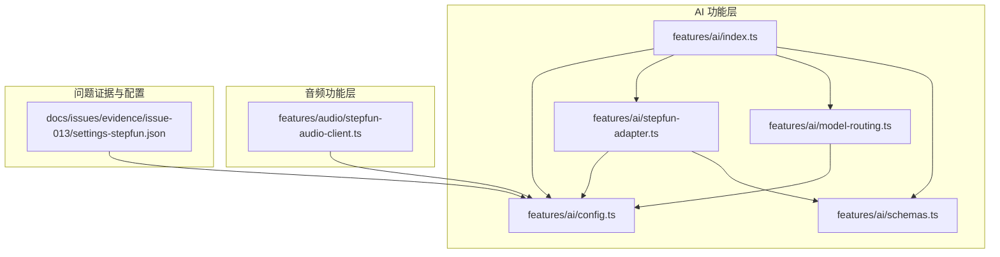
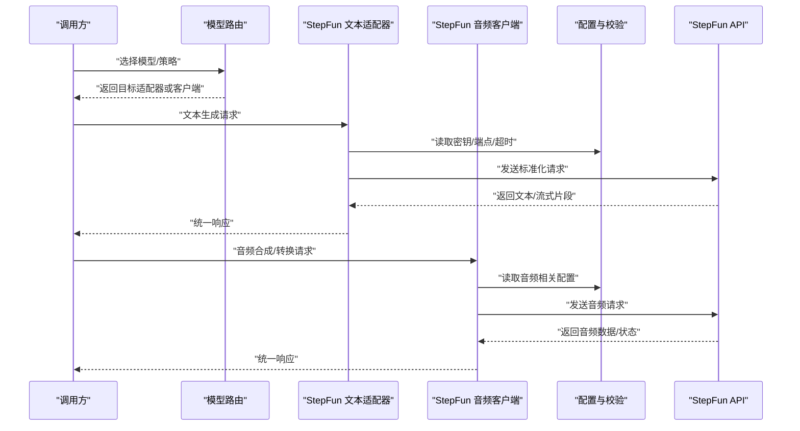
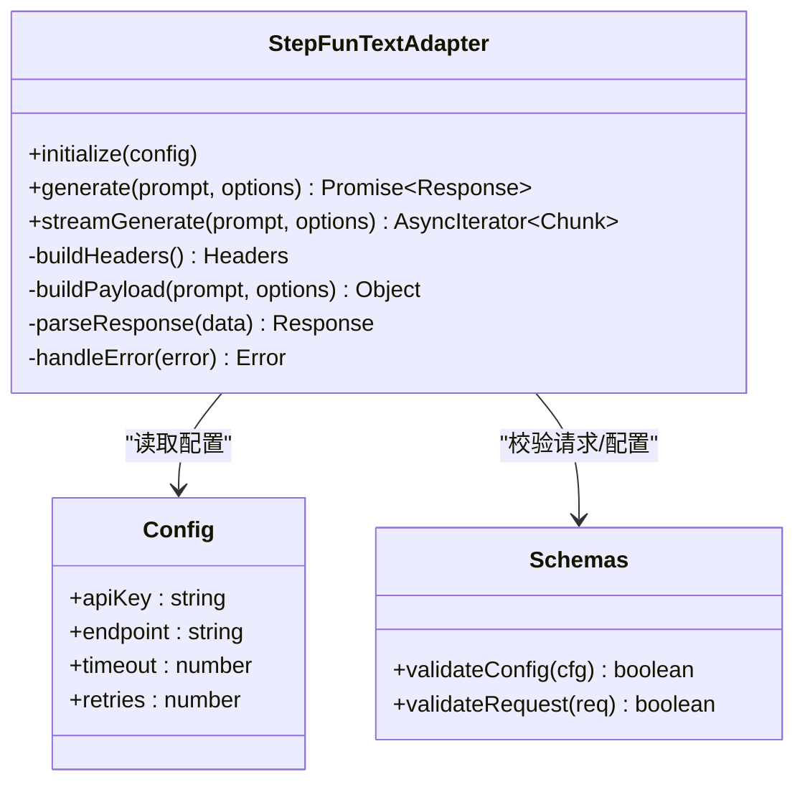
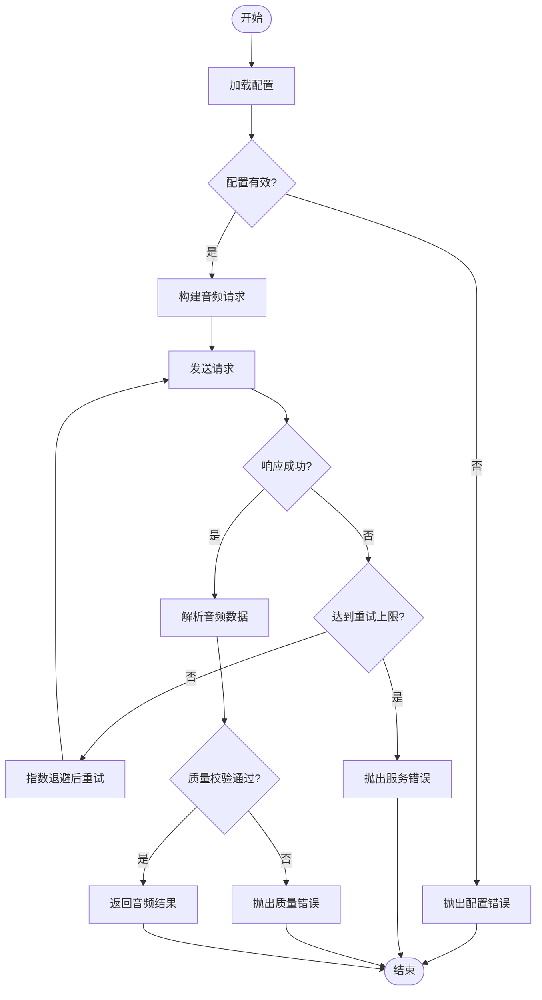
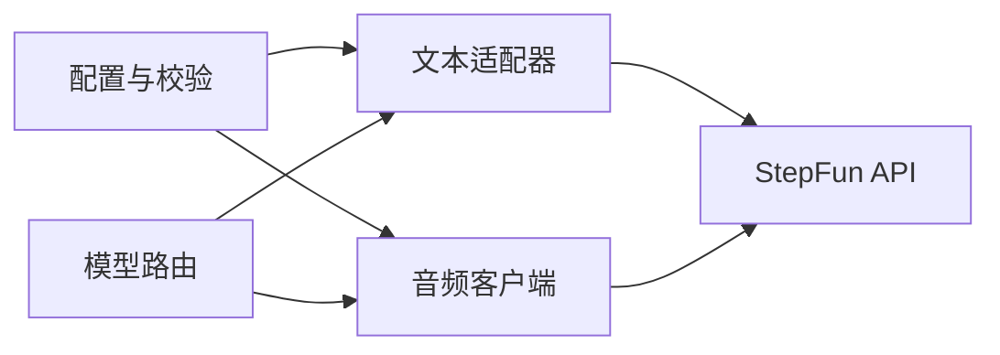

# StepFun 模型集成

<cite>
**本文引用的文件**   
- [stepfun-adapter.ts](file://src/features/ai/stepfun-adapter.ts)
- [stepfun-adapter.test.ts](file://src/features/ai/stepfun-adapter.test.ts)
- [stepfun-audio-client.ts](file://src/features/audio/stepfun-audio-client.ts)
- [stepfun-audio-client.test.ts](file://src/features/audio/stepfun-audio-client.test.ts)
- [config.ts](file://src/features/ai/config.ts)
- [model-routing.ts](file://src/features/ai/model-routing.ts)
- [schemas.ts](file://src/features/ai/schemas.ts)
- [index.ts](file://src/features/ai/index.ts)
- [issue-013-settings-stepfun.json](file://docs/issues/evidence/issue-013/settings-stepfun.json)
</cite>

## 目录
1. [简介](#简介)
2. [项目结构](#项目结构)
3. [核心组件](#核心组件)
4. [架构总览](#架构总览)
5. [详细组件分析](#详细组件分析)
6. [依赖关系分析](#依赖关系分析)
7. [性能考虑](#性能考虑)
8. [故障排查指南](#故障排查指南)
9. [结论](#结论)
10. [附录](#附录)

## 简介
本文件面向在 PurpleInk 项目中集成 StepFun AI 模型的开发者，系统性说明 StepFun API 的认证机制、请求构建与响应处理流程，覆盖文本生成与音频能力，并给出配置示例、调用方式、与标准 OpenAI 兼容接口的差异与适配逻辑、错误处理与重试策略、以及性能优化建议。文档同时提供调试技巧与实际使用场景指引，帮助快速落地与排障。

## 项目结构
StepFun 相关代码主要分布在以下模块：
- AI 功能层：适配器、配置、路由、类型与模式校验等
- 音频功能层：StepFun 音频客户端封装
- 问题证据与配置样例：用于验证与回归测试的配置片段

图表来源
- [index.ts](file://src/features/ai/index.ts)
- [config.ts](file://src/features/ai/config.ts)
- [stepfun-adapter.ts](file://src/features/ai/stepfun-adapter.ts)
- [model-routing.ts](file://src/features/ai/model-routing.ts)
- [schemas.ts](file://src/features/ai/schemas.ts)
- [stepfun-audio-client.ts](file://src/features/audio/stepfun-audio-client.ts)
- [issue-013-settings-stepfun.json](file://docs/issues/evidence/issue-013/settings-stepfun.json)

章节来源
- [index.ts](file://src/features/ai/index.ts)
- [config.ts](file://src/features/ai/config.ts)
- [stepfun-adapter.ts](file://src/features/ai/stepfun-adapter.ts)
- [model-routing.ts](file://src/features/ai/model-routing.ts)
- [schemas.ts](file://src/features/ai/schemas.ts)
- [stepfun-audio-client.ts](file://src/features/audio/stepfun-audio-client.ts)
- [issue-013-settings-stepfun.json](file://docs/issues/evidence/issue-013/settings-stepfun.json)

## 核心组件
- StepFun 文本适配器：负责将上层统一的 LLM 调用接口转换为 StepFun 的请求格式，处理鉴权头、参数映射、流式与非流式响应解析。
- StepFun 音频客户端：封装 StepFun 音频合成/转换等能力，统一输入输出格式，支持错误码与重试策略。
- 配置与模式校验：集中管理 StepFun 密钥、端点、超时、重试次数等；通过模式校验确保配置完整性与合法性。
- 模型路由：根据业务需求选择具体 StepFun 模型或回退策略。

章节来源
- [stepfun-adapter.ts](file://src/features/ai/stepfun-adapter.ts)
- [stepfun-audio-client.ts](file://src/features/audio/stepfun-audio-client.ts)
- [config.ts](file://src/features/ai/config.ts)
- [model-routing.ts](file://src/features/ai/model-routing.ts)
- [schemas.ts](file://src/features/ai/schemas.ts)

## 架构总览
StepFun 集成采用“适配器 + 配置 + 路由”的分层设计：
- 上层通过统一接口发起文本或音频请求
- 适配器负责协议转换（OpenAI 兼容到 StepFun）
- 配置模块加载并校验环境变量与运行时设置
- 路由模块决定具体模型与降级策略
- 音频客户端独立封装音频领域能力

图表来源
- [stepfun-adapter.ts](file://src/features/ai/stepfun-adapter.ts)
- [stepfun-audio-client.ts](file://src/features/audio/stepfun-audio-client.ts)
- [config.ts](file://src/features/ai/config.ts)
- [model-routing.ts](file://src/features/ai/model-routing.ts)

## 详细组件分析

### StepFun 文本适配器
职责与要点：
- 认证机制：从配置中获取 API Key，按 StepFun 要求注入请求头（如 Authorization）。
- 请求构建：将上层统一消息体转换为 StepFun 所需的字段，包括模型名、系统/用户消息、温度、最大长度等。
- 响应处理：支持非流式与流式两种返回，解析增量片段并聚合为完整内容。
- 错误处理：捕获网络异常、HTTP 错误码、JSON 解析失败，抛出统一错误对象以便上层重试或降级。
- 兼容性：尽量遵循 OpenAI 兼容语义，减少上层改动成本。

图表来源
- [stepfun-adapter.ts](file://src/features/ai/stepfun-adapter.ts)
- [config.ts](file://src/features/ai/config.ts)
- [schemas.ts](file://src/features/ai/schemas.ts)

章节来源
- [stepfun-adapter.ts](file://src/features/ai/stepfun-adapter.ts)
- [stepfun-adapter.test.ts](file://src/features/ai/stepfun-adapter.test.ts)
- [config.ts](file://src/features/ai/config.ts)
- [schemas.ts](file://src/features/ai/schemas.ts)

### StepFun 音频客户端
职责与要点：
- 能力范围：音频合成、语音转写、音频格式转换等（以实际实现为准）。
- 认证与端点：复用配置中的密钥与端点，必要时区分文本与音频端点。
- 请求构建：将文本/音频输入序列化为 StepFun 所需格式，设置采样率、编码、延迟等参数。
- 响应处理：接收二进制音频流或结构化结果，进行解码与质量校验。
- 错误与重试：对网络抖动、限流、服务不可用等错误进行指数退避重试。

图表来源
- [stepfun-audio-client.ts](file://src/features/audio/stepfun-audio-client.ts)
- [config.ts](file://src/features/ai/config.ts)

章节来源
- [stepfun-audio-client.ts](file://src/features/audio/stepfun-audio-client.ts)
- [stepfun-audio-client.test.ts](file://src/features/audio/stepfun-audio-client.test.ts)
- [config.ts](file://src/features/ai/config.ts)

### 配置与模式校验
- 配置项：API Key、基础端点、超时、重试次数、并发限制、模型名称等。
- 校验规则：必填字段检查、URL 格式校验、数值范围校验、模型白名单校验。
- 环境加载：优先从环境变量读取，其次从运行时配置合并，最后应用默认值。

章节来源
- [config.ts](file://src/features/ai/config.ts)
- [schemas.ts](file://src/features/ai/schemas.ts)
- [issue-013-settings-stepfun.json](file://docs/issues/evidence/issue-013/settings-stepfun.json)

### 模型路由
- 路由策略：根据任务类型（文本/音频）、模型能力、负载情况选择具体 StepFun 模型。
- 降级策略：当首选模型不可用时，自动切换到备用模型或回退到本地策略。
- 动态切换：支持运行时更新路由表，无需重启服务。

章节来源
- [model-routing.ts](file://src/features/ai/model-routing.ts)
- [config.ts](file://src/features/ai/config.ts)

## 依赖关系分析
StepFun 集成依赖配置与模式校验模块，文本适配器与音频客户端分别承担不同领域的能力封装，路由模块作为入口统一调度。

图表来源
- [config.ts](file://src/features/ai/config.ts)
- [stepfun-adapter.ts](file://src/features/ai/stepfun-adapter.ts)
- [stepfun-audio-client.ts](file://src/features/audio/stepfun-audio-client.ts)
- [model-routing.ts](file://src/features/ai/model-routing.ts)

章节来源
- [config.ts](file://src/features/ai/config.ts)
- [stepfun-adapter.ts](file://src/features/ai/stepfun-adapter.ts)
- [stepfun-audio-client.ts](file://src/features/audio/stepfun-audio-client.ts)
- [model-routing.ts](file://src/features/ai/model-routing.ts)

## 性能考虑
- 连接池与超时：合理设置 HTTP 连接池大小与超时时间，避免资源耗尽。
- 流式处理：优先使用流式接口降低首字节延迟，提升交互体验。
- 重试与退避：对瞬态错误启用指数退避，避免雪崩效应。
- 缓存与去重：对相同提示词与参数组合进行结果缓存，减少重复请求。
- 并发控制：限制并发请求数，防止触发服务端限流。

[本节为通用性能指导，不直接分析具体文件]

## 故障排查指南
常见问题与定位方法：
- 认证失败：检查 API Key 是否正确、是否包含多余空格或换行；确认请求头注入正确。
- 参数错误：核对模型名是否在白名单内，必填字段是否齐全；查看模式校验日志。
- 网络错误：检查端点 URL、代理设置、DNS 解析；观察重试次数与退避间隔。
- 响应解析失败：确认返回 JSON 结构是否符合预期，增加容错与降级逻辑。
- 音频质量问题：检查采样率、编码格式、输入文本长度；对比不同模型效果。

章节来源
- [stepfun-adapter.test.ts](file://src/features/ai/stepfun-adapter.test.ts)
- [stepfun-audio-client.test.ts](file://src/features/audio/stepfun-audio-client.test.ts)
- [issue-013-settings-stepfun.json](file://docs/issues/evidence/issue-013/settings-stepfun.json)

## 结论
StepFun 集成通过清晰的适配器与客户端分层，结合严格的配置校验与灵活的路由策略，实现了文本与音频能力的统一接入。建议在开发阶段充分使用测试用例与问题证据，生产环境关注性能与稳定性指标，持续优化重试与降级策略。

[本节为总结性内容，不直接分析具体文件]

## 附录

### 配置示例与调用方式
- 配置项清单：API Key、基础端点、超时、重试次数、并发限制、模型名称等。
- 环境变量加载：优先读取环境变量，其次合并运行时配置，最后应用默认值。
- 调用步骤：初始化配置 → 选择模型 → 构建请求 → 发送请求 → 解析响应。

章节来源
- [config.ts](file://src/features/ai/config.ts)
- [schemas.ts](file://src/features/ai/schemas.ts)
- [issue-013-settings-stepfun.json](file://docs/issues/evidence/issue-013/settings-stepfun.json)

### 与 OpenAI 兼容接口的差异与适配
- 字段映射：部分字段名或取值范围存在差异，需在适配器中进行转换。
- 流式协议：增量片段的结构与顺序可能不同，需适配解析逻辑。
- 错误码：StepFun 的错误码与 OpenAI 不一致，需统一映射为内部错误类型。
- 鉴权头：Authorization 头部格式可能不同，需按 StepFun 规范注入。

章节来源
- [stepfun-adapter.ts](file://src/features/ai/stepfun-adapter.ts)
- [stepfun-audio-client.ts](file://src/features/audio/stepfun-audio-client.ts)

### 调试技巧
- 启用详细日志：记录请求头、请求体、响应体与耗时。
- 模拟断点：在适配器与客户端的关键路径插入断点，逐步验证数据流转。
- 回放请求：保存失败请求的原始数据，便于复现与定位。
- 对比模型：切换不同模型进行对比，评估效果与性能差异。

章节来源
- [stepfun-adapter.test.ts](file://src/features/ai/stepfun-adapter.test.ts)
- [stepfun-audio-client.test.ts](file://src/features/audio/stepfun-audio-client.test.ts)