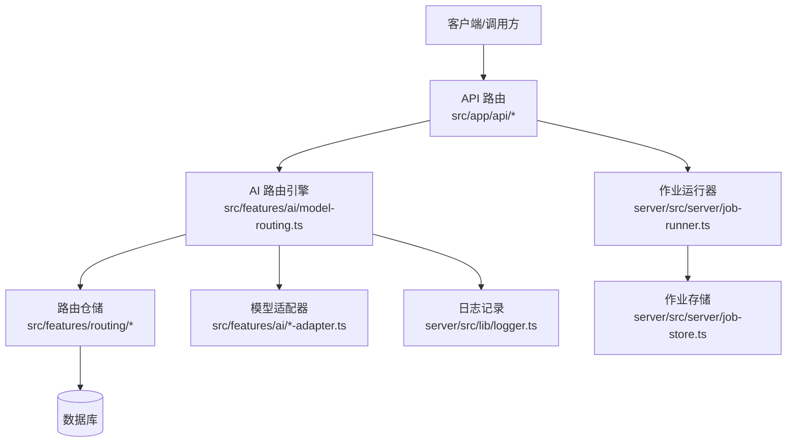
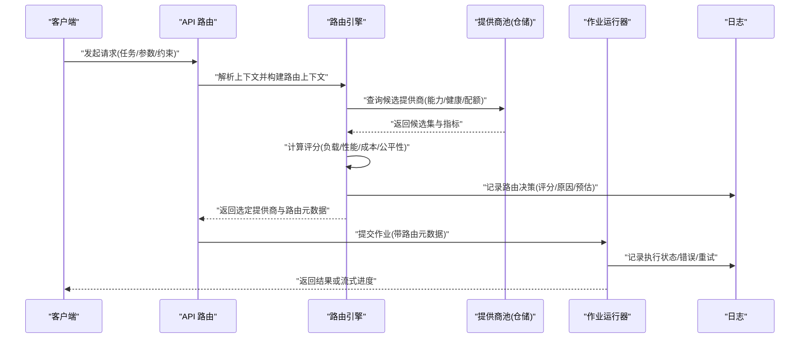
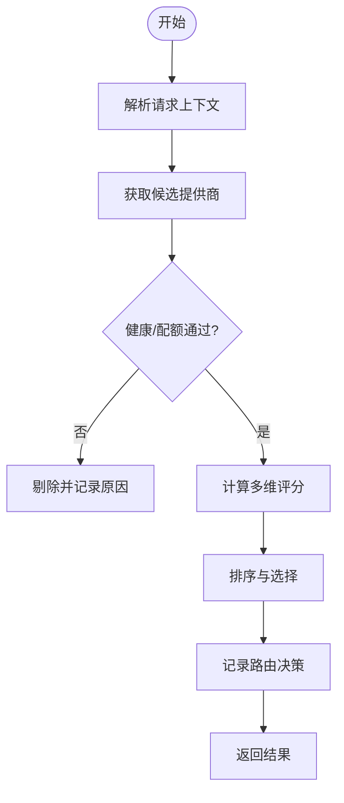
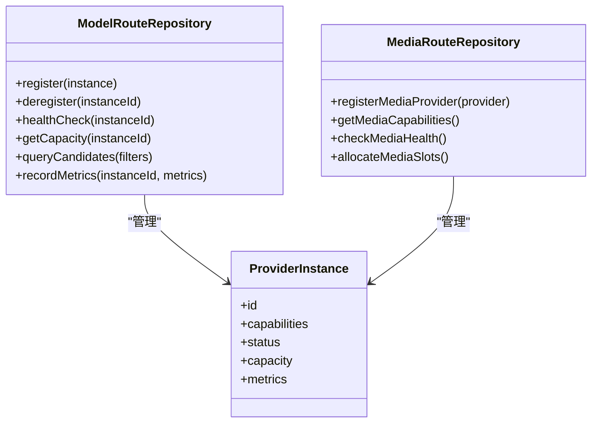
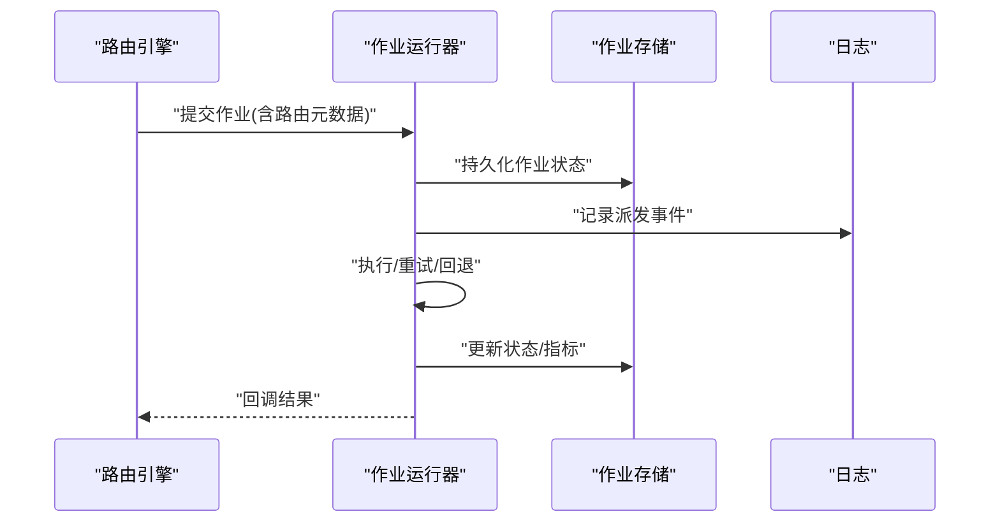
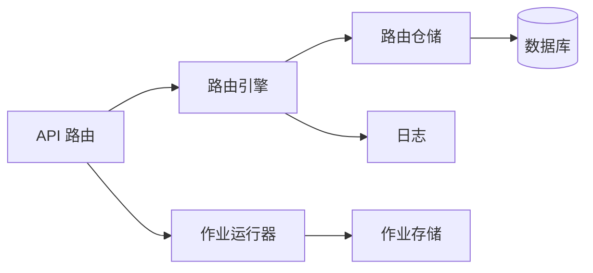

# 模型路由系统

<cite>
**本文引用的文件**   
- [src/features/ai/model-routing.ts](file://src/features/ai/model-routing.ts)
- [src/features/ai/model-routing.test.ts](file://src/features/ai/model-routing.test.ts)
- [src/features/routing/index.ts](file://src/features/routing/index.ts)
- [src/features/routing/media-route-repository.ts](file://src/features/routing/media-route-repository.ts)
- [src/features/routing/media-route-repository.pg.test.ts](file://src/features/routing/media-route-repository.pg.test.ts)
- [src/features/routing/model-route-repository.ts](file://src/features/routing/model-route-repository.ts)
- [src/features/routing/model-route-repository.pg.test.ts](file://src/features/routing/model-route-repository.pg.test.ts)
- [src/app/api/director/pipeline/route.ts](file://src/app/api/director/pipeline/route.ts)
- [src/app/api/render/route.ts](file://src/app/api/render/route.ts)
- [server/src/server/job-runner.ts](file://server/src/server/job-runner.ts)
- [server/src/server/job-store.ts](file://server/src/server/job-store.ts)
- [server/src/lib/logger.ts](file://server/src/lib/logger.ts)
- [docs/conventions/routing.md](file://docs/conventions/routing.md)
- [docs/designs/README.md](file://docs/designs/README.md)
</cite>

## 目录
1. [简介](#简介)
2. [项目结构](#项目结构)
3. [核心组件](#核心组件)
4. [架构总览](#架构总览)
5. [详细组件分析](#详细组件分析)
6. [依赖关系分析](#依赖关系分析)
7. [性能考量](#性能考量)
8. [故障排查指南](#故障排查指南)
9. [结论](#结论)
10. [附录](#附录)

## 简介
本文件面向 PurpleInk 的“模型路由系统”，聚焦以下目标：
- 智能路由算法：基于负载、性能与成本的动态选择策略
- 提供商池管理：健康检查、容量控制与自动扩缩容
- 公平性调度：多用户与多任务的资源均衡分配
- 可视化监控与日志：决策追踪、指标上报与可观测性
- 配置与扩展：路由策略配置方法与自定义规则扩展指南
- 高可用：故障检测、自动恢复与降级策略

## 项目结构
围绕模型路由的核心代码分布在以下模块：
- AI 层路由与适配器：src/features/ai/*（含 model-routing.ts 及多个适配器）
- 路由仓储与持久化：src/features/routing/*（媒体与模型路由仓库）
- API 入口与编排：src/app/api/*（导演管道、渲染等）
- 服务端作业执行：server/src/server/*（作业运行器与存储）
- 日志与可观测性：server/src/lib/logger.ts
- 设计约定与文档：docs/conventions/routing.md、docs/designs/README.md

图表来源 
- [src/app/api/director/pipeline/route.ts](file://src/app/api/director/pipeline/route.ts)
- [src/app/api/render/route.ts](file://src/app/api/render/route.ts)
- [src/features/ai/model-routing.ts](file://src/features/ai/model-routing.ts)
- [src/features/routing/index.ts](file://src/features/routing/index.ts)
- [src/features/routing/model-route-repository.ts](file://src/features/routing/model-route-repository.ts)
- [src/features/routing/media-route-repository.ts](file://src/features/routing/media-route-repository.ts)
- [server/src/server/job-runner.ts](file://server/src/server/job-runner.ts)
- [server/src/server/job-store.ts](file://server/src/server/job-store.ts)
- [server/src/lib/logger.ts](file://server/src/lib/logger.ts)

章节来源
- [docs/conventions/routing.md](file://docs/conventions/routing.md)
- [docs/designs/README.md](file://docs/designs/README.md)

## 核心组件
- 路由引擎（model-routing.ts）
  - 负责根据请求上下文（任务类型、质量要求、预算约束等）从候选提供商池中挑选最优实例
  - 内置策略：负载优先、延迟优先、成本优先、混合加权；支持按租户/项目维度隔离
  - 输出：选定提供商实例 + 路由元数据（评分、原因、预估耗时与成本）
- 路由仓储（routing/*）
  - 维护提供商注册表、健康状态、容量配额、历史性能与成本指标
  - 提供查询接口：按能力筛选、按健康度过滤、按配额限制、按权重排序
- 作业执行（job-runner.ts / job-store.ts）
  - 将路由结果转化为可执行的作业，持久化状态并驱动异步执行
  - 支持重试、超时、回退与失败聚合
- 日志与可观测性（logger.ts）
  - 结构化日志：路由决策、错误堆栈、指标采样
  - 便于接入外部监控系统（如 Prometheus/Grafana）

章节来源
- [src/features/ai/model-routing.ts](file://src/features/ai/model-routing.ts)
- [src/features/routing/index.ts](file://src/features/routing/index.ts)
- [src/features/routing/model-route-repository.ts](file://src/features/routing/model-route-repository.ts)
- [src/features/routing/media-route-repository.ts](file://src/features/routing/media-route-repository.ts)
- [server/src/server/job-runner.ts](file://server/src/server/job-runner.ts)
- [server/src/server/job-store.ts](file://server/src/server/job-store.ts)
- [server/src/lib/logger.ts](file://server/src/lib/logger.ts)

## 架构总览
下图展示一次典型的路由请求从 API 到提供商调用的完整流程，以及关键的可观测点。

图表来源 
- [src/app/api/director/pipeline/route.ts](file://src/app/api/director/pipeline/route.ts)
- [src/app/api/render/route.ts](file://src/app/api/render/route.ts)
- [src/features/ai/model-routing.ts](file://src/features/ai/model-routing.ts)
- [src/features/routing/model-route-repository.ts](file://src/features/routing/model-route-repository.ts)
- [server/src/server/job-runner.ts](file://server/src/server/job-runner.ts)
- [server/src/server/job-store.ts](file://server/src/server/job-store.ts)
- [server/src/lib/logger.ts](file://server/src/lib/logger.ts)

## 详细组件分析

### 路由引擎（model-routing.ts）
- 输入：任务描述、质量等级、预算上限、SLA 要求、租户/项目标识
- 候选生成：从仓储中拉取具备能力的提供商，过滤不健康与超配额的实例
- 评分函数：综合负载因子、延迟分位、吞吐、成本系数、公平性惩罚
- 选择策略：
  - 单目标优化：最小延迟、最低成本、最高吞吐
  - 多目标加权：可配置权重组合，支持灰度与实验分流
  - 公平性：对低优先级租户/任务施加惩罚，避免饥饿
- 输出：选定实例、评分明细、预估耗时与成本、路由原因
- 可观测性：每次决策记录结构化日志，包含输入摘要、候选集大小、最终选择与理由

图表来源 
- [src/features/ai/model-routing.ts](file://src/features/ai/model-routing.ts)

章节来源
- [src/features/ai/model-routing.ts](file://src/features/ai/model-routing.ts)
- [src/features/ai/model-routing.test.ts](file://src/features/ai/model-routing.test.ts)

### 提供商池与仓储（routing/*）
- 注册与发现：动态注册新实例，支持热更新
- 健康检查：周期性探测（HTTP/TCP/业务探针），失败阈值触发下线
- 容量控制：最大并发、队列长度、限流令牌桶
- 指标采集：延迟分布、成功率、错误码、成本计数
- 持久化：PostgreSQL 存储（见 .pg.test.ts），保证一致性
- 查询接口：按能力标签、健康状态、配额剩余、权重排序

图表来源 
- [src/features/routing/model-route-repository.ts](file://src/features/routing/model-route-repository.ts)
- [src/features/routing/media-route-repository.ts](file://src/features/routing/media-route-repository.ts)

章节来源
- [src/features/routing/model-route-repository.ts](file://src/features/routing/model-route-repository.ts)
- [src/features/routing/model-route-repository.pg.test.ts](file://src/features/routing/model-route-repository.pg.test.ts)
- [src/features/routing/media-route-repository.ts](file://src/features/routing/media-route-repository.ts)
- [src/features/routing/media-route-repository.pg.test.ts](file://src/features/routing/media-route-repository.pg.test.ts)

### 作业执行与持久化（job-runner.ts / job-store.ts）
- 作业生命周期：创建、排队、派发、执行、完成/失败、重试、归档
- 路由元数据透传：在作业上下文中携带所选提供商与决策依据
- 失败处理：指数退避重试、熔断、快速失败、降级到次优提供商
- 存储：作业状态、审计日志、指标快照

图表来源 
- [server/src/server/job-runner.ts](file://server/src/server/job-runner.ts)
- [server/src/server/job-store.ts](file://server/src/server/job-store.ts)

章节来源
- [server/src/server/job-runner.ts](file://server/src/server/job-runner.ts)
- [server/src/server/job-store.ts](file://server/src/server/job-store.ts)

### API 集成（director/pipeline/route.ts / render/route.ts）
- 统一入口：接收上层调用，构造路由上下文
- 校验与鉴权：参数校验、权限检查、配额限制
- 路由调用：调用路由引擎并返回决策结果
- 作业编排：将路由结果转为作业并提交执行

章节来源
- [src/app/api/director/pipeline/route.ts](file://src/app/api/director/pipeline/route.ts)
- [src/app/api/render/route.ts](file://src/app/api/render/route.ts)

### 日志与可观测性（logger.ts）
- 结构化字段：traceId、spanId、userId、tenantId、routeDecision、providerId、latency、cost
- 分级输出：debug/info/warn/error
- 采样策略：高频路径采样，关键路径全量记录
- 集成建议：对接集中式日志平台与指标系统

章节来源
- [server/src/lib/logger.ts](file://server/src/lib/logger.ts)

## 依赖关系分析
- 耦合关系
  - API 层仅依赖路由引擎抽象，降低实现替换成本
  - 路由引擎依赖仓储接口，屏蔽底层存储与健康探测细节
  - 作业运行器与仓储解耦，通过消息/队列进行异步协作
- 外部依赖
  - 数据库：PostgreSQL（仓储持久化）
  - 日志系统：结构化日志库
  - 可选：缓存（热点指标）、消息队列（削峰填谷）

图表来源 
- [src/app/api/director/pipeline/route.ts](file://src/app/api/director/pipeline/route.ts)
- [src/features/ai/model-routing.ts](file://src/features/ai/model-routing.ts)
- [src/features/routing/model-route-repository.ts](file://src/features/routing/model-route-repository.ts)
- [server/src/server/job-runner.ts](file://server/src/server/job-runner.ts)
- [server/src/server/job-store.ts](file://server/src/server/job-store.ts)

章节来源
- [src/features/routing/index.ts](file://src/features/routing/index.ts)

## 性能考量
- 评分计算复杂度：O(N log N) 排序，N 为候选提供商数量；可通过预排序与缓存优化
- 健康检查频率：按需调整，避免频繁探测导致抖动
- 指标采样：对高频路径采用滑动窗口统计，减少 I/O 压力
- 批处理：批量更新仓储指标，降低写放大
- 内存占用：热点提供商信息缓存，设置 TTL 与淘汰策略

## 故障排查指南
- 常见问题
  - 无候选提供商：检查健康检查阈值与配额限制
  - 路由震荡：增加平滑因子与冷却时间
  - 延迟突增：查看分位延迟与错误率，定位瓶颈提供商
  - 成本超标：检查成本系数与预算上限配置
- 诊断步骤
  - 检索 traceId 对应的路由决策日志
  - 检查仓储中的健康状态与指标快照
  - 验证作业执行状态与重试次数
  - 对比不同策略下的评分差异
- 恢复策略
  - 自动下线故障实例，切换至次优提供商
  - 临时放宽健康阈值，观察恢复趋势
  - 启用降级模式（只读/简化任务）

章节来源
- [server/src/lib/logger.ts](file://server/src/lib/logger.ts)
- [src/features/ai/model-routing.test.ts](file://src/features/ai/model-routing.test.ts)

## 结论
PurpleInk 的模型路由系统以“路由引擎 + 提供商池仓储 + 作业执行”为核心，结合多维度评分与公平性调度，实现了基于负载、性能与成本的动态选择。通过结构化日志与可观测性设计，系统具备良好的可诊断性与可扩展性。建议在后续迭代中引入更细粒度的租户级配额与策略实验框架，进一步提升灵活性与稳定性。

## 附录
- 配置方法
  - 策略权重：负载/性能/成本/公平性的权重比例
  - 健康阈值：失败次数、超时阈值、冷却时间
  - 配额与限流：最大并发、队列长度、令牌速率
  - 预算与 SLA：成本上限、延迟分位、成功率目标
- 自定义规则扩展
  - 新增评分维度：在路由引擎中扩展评分函数
  - 自定义健康探针：实现新的探测协议与判定逻辑
  - 策略插件：通过插件机制注入新的选择策略
- 监控与报表
  - 关键指标：选择分布、平均延迟、成功率、成本/请求
  - 告警规则：健康异常、延迟突增、成本越界
  - 可视化：提供商面板、租户用量、策略效果对比