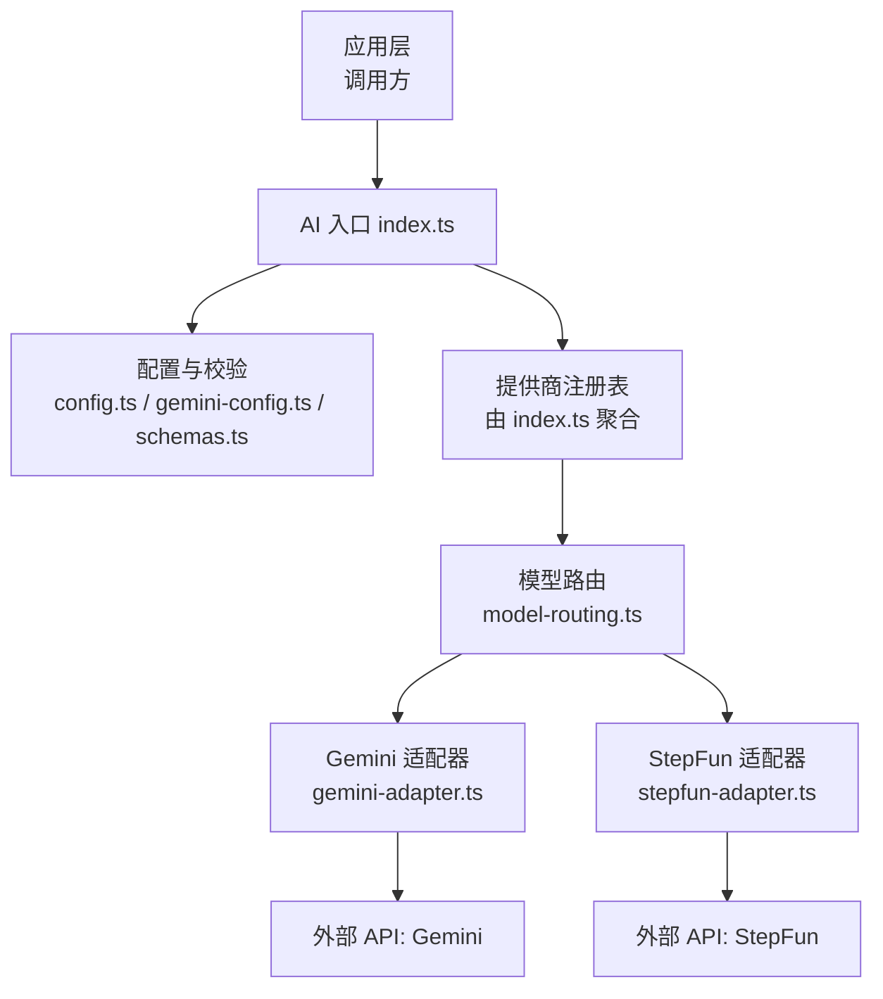
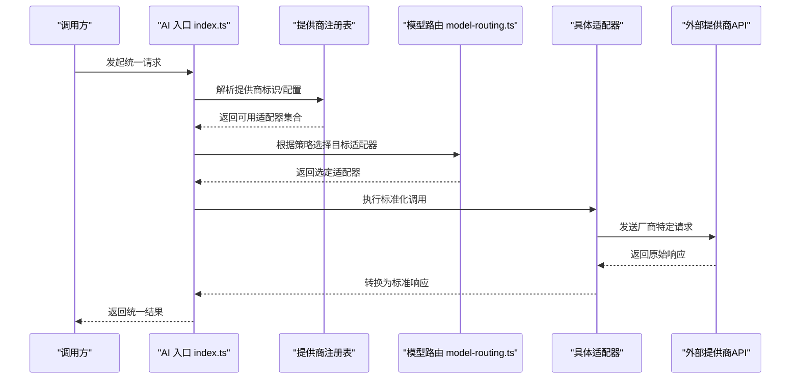
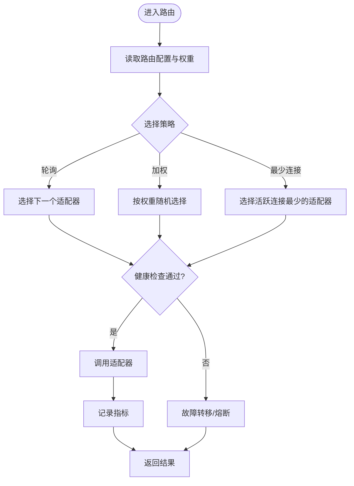
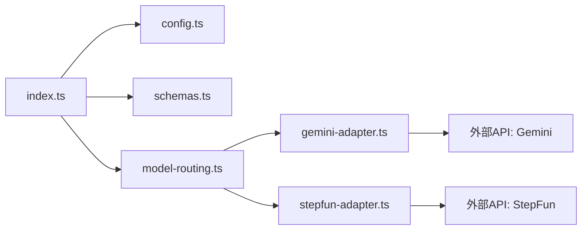

# 模型适配器架构

<cite>
**本文引用的文件**   
- [src/features/ai/index.ts](file://src/features/ai/index.ts)
- [src/features/ai/config.ts](file://src/features/ai/config.ts)
- [src/features/ai/model-routing.ts](file://src/features/ai/model-routing.ts)
- [src/features/ai/gemini-adapter.ts](file://src/features/ai/gemini-adapter.ts)
- [src/features/ai/stepfun-adapter.ts](file://src/features/ai/stepfun-adapter.ts)
- [src/features/ai/schemas.ts](file://src/features/ai/schemas.ts)
- [src/features/ai/gemini-config.ts](file://src/features/ai/gemini-config.ts)
- [src/features/ai/model-routing.test.ts](file://src/features/ai/model-routing.test.ts)
- [src/features/ai/gemini-adapter.test.ts](file://src/features/ai/gemini-adapter.test.ts)
- [src/features/ai/stepfun-adapter.test.ts](file://src/features/ai/stepfun-adapter.test.ts)
- [src/features/ai/config.test.ts](file://src/features/ai/config.test.ts)
- [src/features/ai/gemini-config.test.ts](file://src/features/ai/gemini-config.test.ts)
</cite>

## 目录
1. [简介](#简介)
2. [项目结构](#项目结构)
3. [核心组件](#核心组件)
4. [架构总览](#架构总览)
5. [详细组件分析](#详细组件分析)
6. [依赖关系分析](#依赖关系分析)
7. [性能考量](#性能考量)
8. [故障排查指南](#故障排查指南)
9. [结论](#结论)
10. [附录](#附录)

## 简介
本文件系统性阐述 PurpleInk AI 的“模型适配器”架构，围绕适配器模式展开：通过抽象接口统一不同 AI 提供商的请求与响应格式，实现请求处理流程标准化、响应数据规范化；通过提供商注册表完成动态加载、配置管理与生命周期管理；通过模型路由策略实现负载均衡、故障转移与性能监控；并提供自定义适配器的开发规范与示例路径。文档同时覆盖错误处理、重试机制与超时控制等关键特性，帮助读者快速理解并扩展该架构。

## 项目结构
AI 相关能力集中在 src/features/ai 目录下，采用“按功能域组织”的结构：
- 适配器实现：gemini-adapter.ts、stepfun-adapter.ts
- 路由与调度：model-routing.ts
- 配置与校验：config.ts、gemini-config.ts、schemas.ts
- 入口与导出：index.ts
- 测试用例：各模块对应的 *.test.ts

图表来源
- [src/features/ai/index.ts](file://src/features/ai/index.ts)
- [src/features/ai/config.ts](file://src/features/ai/config.ts)
- [src/features/ai/gemini-config.ts](file://src/features/ai/gemini-config.ts)
- [src/features/ai/schemas.ts](file://src/features/ai/schemas.ts)
- [src/features/ai/model-routing.ts](file://src/features/ai/model-routing.ts)
- [src/features/ai/gemini-adapter.ts](file://src/features/ai/gemini-adapter.ts)
- [src/features/ai/stepfun-adapter.ts](file://src/features/ai/stepfun-adapter.ts)

章节来源
- [src/features/ai/index.ts](file://src/features/ai/index.ts)
- [src/features/ai/config.ts](file://src/features/ai/config.ts)
- [src/features/ai/model-routing.ts](file://src/features/ai/model-routing.ts)
- [src/features/ai/gemini-adapter.ts](file://src/features/ai/gemini-adapter.ts)
- [src/features/ai/stepfun-adapter.ts](file://src/features/ai/stepfun-adapter.ts)
- [src/features/ai/schemas.ts](file://src/features/ai/schemas.ts)

## 核心组件
- 抽象适配器接口：定义统一的请求输入、流式与非流式输出、元数据与错误语义，屏蔽底层差异。
- 提供商注册表：集中管理已注册的适配器实例，支持动态发现、配置注入与生命周期钩子。
- 模型路由：基于策略选择具体适配器，内置负载均衡、故障转移与指标采集。
- 配置与校验：集中读取环境变量/配置文件，结合 schema 校验，确保运行时安全。
- 适配器实现：针对特定厂商（如 Gemini、StepFun）的具体实现，负责协议转换、鉴权、重试与超时。

章节来源
- [src/features/ai/index.ts](file://src/features/ai/index.ts)
- [src/features/ai/config.ts](file://src/features/ai/config.ts)
- [src/features/ai/schemas.ts](file://src/features/ai/schemas.ts)
- [src/features/ai/model-routing.ts](file://src/features/ai/model-routing.ts)
- [src/features/ai/gemini-adapter.ts](file://src/features/ai/gemini-adapter.ts)
- [src/features/ai/stepfun-adapter.ts](file://src/features/ai/stepfun-adapter.ts)

## 架构总览
下图展示了从调用方到具体适配器及外部 API 的完整链路，以及路由、配置与校验在其中的作用。

图表来源
- [src/features/ai/index.ts](file://src/features/ai/index.ts)
- [src/features/ai/model-routing.ts](file://src/features/ai/model-routing.ts)
- [src/features/ai/gemini-adapter.ts](file://src/features/ai/gemini-adapter.ts)
- [src/features/ai/stepfun-adapter.ts](file://src/features/ai/stepfun-adapter.ts)

## 详细组件分析

### 抽象适配器接口与统一请求/响应
- 抽象接口职责
  - 统一入参：消息体、系统提示、参数集、上下文信息。
  - 统一出参：文本/结构化内容、使用量统计、耗时、追踪 ID。
  - 流式支持：增量片段推送、结束事件、错误事件。
  - 错误语义：区分网络错误、业务错误、限流错误，便于上层重试与降级。
- 标准化机制
  - 请求阶段：对入参进行校验与补齐（默认参数、安全过滤）。
  - 响应阶段：将厂商差异字段映射为标准结构，保证下游一致性。
  - 资源清理：连接池释放、临时文件清理、日志脱敏。

章节来源
- [src/features/ai/gemini-adapter.ts](file://src/features/ai/gemini-adapter.ts)
- [src/features/ai/stepfun-adapter.ts](file://src/features/ai/stepfun-adapter.ts)

### 提供商注册表：动态加载、配置管理与生命周期
- 动态加载
  - 通过约定或显式注册的方式，将适配器类/工厂函数加入注册表。
  - 支持按需懒加载，减少启动开销。
- 配置管理
  - 从 config.ts / gemini-config.ts 读取环境或配置文件，经 schemas.ts 校验后注入适配器实例。
  - 提供热更新能力（可选），允许在不重启服务的情况下切换密钥或端点。
- 生命周期管理
  - 初始化：建立连接池、预热缓存、校验凭据。
  - 运行期：健康检查、指标上报、优雅关闭。
  - 销毁：释放资源、停止后台任务。

章节来源
- [src/features/ai/index.ts](file://src/features/ai/index.ts)
- [src/features/ai/config.ts](file://src/features/ai/config.ts)
- [src/features/ai/gemini-config.ts](file://src/features/ai/gemini-config.ts)
- [src/features/ai/schemas.ts](file://src/features/ai/schemas.ts)

### 模型路由策略：负载均衡、故障转移与性能监控
- 负载均衡
  - 轮询/加权轮询/最少连接数等策略，依据适配器权重与实时负载进行选择。
- 故障转移
  - 失败探测与熔断：连续失败阈值触发熔断，自动切换到备用适配器。
  - 快速失败：对不可用节点立即跳过，降低尾延迟。
- 性能监控
  - 采集 QPS、P50/P95 延迟、错误率、重试次数、配额消耗等指标。
  - 暴露健康检查端点，供编排平台探测。

图表来源
- [src/features/ai/model-routing.ts](file://src/features/ai/model-routing.ts)

章节来源
- [src/features/ai/model-routing.ts](file://src/features/ai/model-routing.ts)

### 配置与校验：集中化与安全
- 配置来源
  - 环境变量优先，其次为配置文件或运行时注入。
- 校验规则
  - 使用 schemas.ts 定义必填项、类型、取值范围与依赖关系。
  - 对敏感字段（如密钥）进行最小权限与脱敏打印。
- 多环境支持
  - 开发/测试/生产环境分离，支持灰度发布与回滚。

章节来源
- [src/features/ai/config.ts](file://src/features/ai/config.ts)
- [src/features/ai/gemini-config.ts](file://src/features/ai/gemini-config.ts)
- [src/features/ai/schemas.ts](file://src/features/ai/schemas.ts)

### 适配器实现：Gemini 与 StepFun
- Gemini 适配器
  - 负责与 Gemini API 交互，包括鉴权、参数映射、流式响应处理与错误归一化。
- StepFun 适配器
  - 负责与 StepFun API 交互，包含音频/文本等多模态能力的适配与标准化。

章节来源
- [src/features/ai/gemini-adapter.ts](file://src/features/ai/gemini-adapter.ts)
- [src/features/ai/stepfun-adapter.ts](file://src/features/ai/stepfun-adapter.ts)

### 自定义适配器开发指南
- 接口规范
  - 实现统一抽象接口：定义请求方法、流式方法、健康检查与销毁方法。
  - 遵循错误语义：明确区分可重试与不可重试错误。
- 配置要求
  - 提供适配器专属配置项（如端点、密钥、超时、并发限制），并通过 schemas.ts 校验。
- 生命周期
  - 实现初始化、运行期健康检查、优雅关闭。
- 测试建议
  - 编写单元测试验证参数校验、错误分支与流式行为。
  - 编写集成测试对接沙箱环境，验证端到端流程。

章节来源
- [src/features/ai/gemini-adapter.ts](file://src/features/ai/gemini-adapter.ts)
- [src/features/ai/stepfun-adapter.ts](file://src/features/ai/stepfun-adapter.ts)
- [src/features/ai/schemas.ts](file://src/features/ai/schemas.ts)

### 错误处理、重试机制与超时控制
- 错误分类
  - 网络错误、认证失败、限流、业务校验失败、超时等。
- 重试策略
  - 指数退避 + 抖动，针对限流与瞬时错误生效；幂等性保障。
- 超时控制
  - 请求级超时、流式分片超时、整体会话超时。
- 熔断与降级
  - 连续失败阈值触发熔断，自动降级到备用适配器或返回兜底结果。

章节来源
- [src/features/ai/model-routing.ts](file://src/features/ai/model-routing.ts)
- [src/features/ai/gemini-adapter.ts](file://src/features/ai/gemini-adapter.ts)
- [src/features/ai/stepfun-adapter.ts](file://src/features/ai/stepfun-adapter.ts)

## 依赖关系分析
- 内聚与耦合
  - 适配器与路由低耦合：通过抽象接口解耦，路由仅依赖接口契约。
  - 配置与实现分离：config.ts 与 schemas.ts 独立于具体适配器。
- 外部依赖
  - 各适配器依赖对应厂商 SDK/HTTP 客户端。
- 潜在循环依赖
  - 通过入口 index.ts 统一聚合，避免模块间直接互相引用。

图表来源
- [src/features/ai/index.ts](file://src/features/ai/index.ts)
- [src/features/ai/config.ts](file://src/features/ai/config.ts)
- [src/features/ai/schemas.ts](file://src/features/ai/schemas.ts)
- [src/features/ai/model-routing.ts](file://src/features/ai/model-routing.ts)
- [src/features/ai/gemini-adapter.ts](file://src/features/ai/gemini-adapter.ts)
- [src/features/ai/stepfun-adapter.ts](file://src/features/ai/stepfun-adapter.ts)

章节来源
- [src/features/ai/index.ts](file://src/features/ai/index.ts)
- [src/features/ai/model-routing.ts](file://src/features/ai/model-routing.ts)

## 性能考量
- 连接复用与池化：HTTP/SDK 连接池减少握手开销。
- 流式处理：大文本/音频分片传输，降低内存峰值与首字节延迟。
- 并发控制：令牌桶/信号量限制并发，防止雪崩。
- 指标与观测：QPS、延迟分布、错误率、配额使用实时监控。
- 缓存策略：热点 Prompt/模板缓存，减少重复计算。

## 故障排查指南
- 常见问题定位
  - 配置错误：检查环境变量与 schema 校验结果。
  - 认证失败：核对密钥有效期与作用域。
  - 限流/配额耗尽：查看速率限制与配额使用情况。
  - 超时/重试风暴：调整超时与重试参数，观察是否出现抖动。
- 诊断手段
  - 启用调试日志（脱敏）、采集分布式追踪 ID。
  - 使用健康检查端点与指标面板定位瓶颈。
- 恢复策略
  - 快速切换至备用适配器或降级模式。
  - 隔离异常节点，逐步恢复流量。

章节来源
- [src/features/ai/model-routing.ts](file://src/features/ai/model-routing.ts)
- [src/features/ai/gemini-adapter.ts](file://src/features/ai/gemini-adapter.ts)
- [src/features/ai/stepfun-adapter.ts](file://src/features/ai/stepfun-adapter.ts)

## 结论
PurpleInk 的模型适配器架构通过抽象接口与统一流程，屏蔽了多厂商差异，提升了系统的可扩展性与稳定性。提供商注册表与模型路由实现了灵活的动态装配与智能调度，配合完善的错误处理、重试与超时控制，保障了在高并发与不稳定网络下的可靠运行。开发者可依据规范快速接入新提供商，持续扩展能力边界。

## 附录
- 测试参考
  - 路由策略与适配器行为的单测/集成测试可作为实现参考。

章节来源
- [src/features/ai/model-routing.test.ts](file://src/features/ai/model-routing.test.ts)
- [src/features/ai/gemini-adapter.test.ts](file://src/features/ai/gemini-adapter.test.ts)
- [src/features/ai/stepfun-adapter.test.ts](file://src/features/ai/stepfun-adapter.test.ts)
- [src/features/ai/config.test.ts](file://src/features/ai/config.test.ts)
- [src/features/ai/gemini-config.test.ts](file://src/features/ai/gemini-config.test.ts)