# AI并发管理系统

<cite>
**本文引用的文件**   
- [workspace-concurrency.ts](file://src/features/ai/workspace-concurrency.ts)
- [workspace-concurrency-context.ts](file://src/features/ai/workspace-concurrency-context.ts)
- [workspace-concurrency-projection.ts](file://src/features/ai/workspace-concurrency-projection.ts)
- [workspace-concurrency-release.ts](file://src/features/ai/workspace-concurrency-release.ts)
- [provider-dispatch.ts](file://src/features/ai/provider-dispatch.ts)
- [managed-gateway.ts](file://src/features/ai/managed-gateway.ts)
- [model-routing.ts](file://src/features/ai/model-routing.ts)
- [job-runner.ts](file://server/src/server/job-runner.ts)
- [job-store.ts](file://server/src/server/job-store.ts)
- [api.ts](file://server/src/server/api.ts)
- [queue-handler.ts](file://src/features/director/queue-handler.ts)
- [export-queue-handler.ts](file://src/features/render/export-queue-handler.ts)
- [narration-queue-handler.ts](file://src/features/audio/narration-queue-handler.ts)
- [admission.ts](file://src/features/render/admission.ts)
- [cache.ts](file://src/features/render/cache.ts)
- [renderer.ts](file://src/features/render/renderer.ts)
- [repository.ts](file://src/features/render/repository.ts)
- [workspace-context-contract.test.ts](file://tests/workspace-context-contract.test.ts)
</cite>

## 更新摘要
**所做更改**   
- 增强了AI并发管理系统，引入全局并发发布、安全投影、账户级影子和队列声明机制
- 新增并发滚动系统，支持渐进式功能发布和回滚
- 工作区级并发上下文管理，提供更精细的并发控制
- 改进的队列管理机制，支持更高效的资源分配和任务调度
- 增强的原子锁定机制和分布式锁支持

## 目录
1. [简介](#简介)
2. [项目结构](#项目结构)
3. [核心组件](#核心组件)
4. [架构总览](#架构总览)
5. [详细组件分析](#详细组件分析)
6. [依赖关系分析](#依赖关系分析)
7. [性能考量](#性能考量)
8. [故障排查指南](#故障排查指南)
9. [结论](#结论)
10. [附录](#附录)

## 简介
本系统围绕"AI并发管理"展开，目标是：在多工作区、多模型与多任务场景下，提供稳定、可观测、可扩展的并发控制与调度能力。系统通过"工作区并发限制"、"提供者路由与分发"、"作业队列与执行器"、"渲染与导出流水线"等模块协同工作，确保在高负载下仍保持吞吐与稳定性。

**最新更新** 系统现已支持基于订阅计划的动态并发限制，提供更精细的资源控制和更好的用户体验。新增的全局并发发布机制和安全投影功能，进一步提升了系统的可靠性和可观测性。

## 项目结构
- 前端与业务特性位于 src/features/*，涵盖AI、音频、渲染、编排（director）、认证、计费、导航等。
- 服务端入口与作业运行器位于 server/src/server/*，负责API、作业调度与持久化。
- 测试覆盖关键契约与集成路径，如工作区上下文契约、队列处理器、渲染器等。

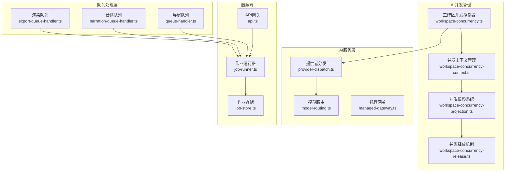

**图表来源** 
- [workspace-concurrency.ts](file://src/features/ai/workspace-concurrency.ts)
- [workspace-concurrency-context.ts](file://src/features/ai/workspace-concurrency-context.ts)
- [workspace-concurrency-projection.ts](file://src/features/ai/workspace-concurrency-projection.ts)
- [workspace-concurrency-release.ts](file://src/features/ai/workspace-concurrency-release.ts)
- [provider-dispatch.ts](file://src/features/ai/provider-dispatch.ts)
- [model-routing.ts](file://src/features/ai/model-routing.ts)
- [managed-gateway.ts](file://src/features/ai/managed-gateway.ts)
- [export-queue-handler.ts](file://src/features/render/export-queue-handler.ts)
- [narration-queue-handler.ts](file://src/features/audio/narration-queue-handler.ts)
- [queue-handler.ts](file://src/features/director/queue-handler.ts)
- [api.ts](file://server/src/server/api.ts)
- [job-runner.ts](file://server/src/server/job-runner.ts)
- [job-store.ts](file://server/src/server/job-store.ts)

## 核心组件
- 工作区并发控制器：按工作区维度限制并发度，避免资源争用与雪崩。
- 并发上下文管理器：维护工作区的并发状态和上下文信息。
- 并发投影系统：提供并发状态的实时投影和查询能力。
- 并发释放机制：确保并发资源的正确释放和清理。
- 提供者分发器：将请求路由到合适的AI提供者，支持失败回退与熔断。
- 模型路由：基于策略选择具体模型或端点，实现动态切换与负载均衡。
- 作业运行器与存储：统一接收、调度、执行与持久化作业状态。
- 领域队列处理器：渲染导出、音频旁白、导演编排等队列处理器，分别承载不同领域的并发与重试策略。
- 准入与缓存：渲染阶段的准入控制与结果缓存，降低重复计算与外部调用压力。

**新增功能** 现在支持基于订阅计划的动态并发限制，允许根据用户等级自动调整并发配额。新增的全局并发发布机制和安全投影功能，进一步提升了系统的可靠性和可观测性。

## 架构总览
系统采用"分层+队列"的架构模式：
- 接入层：API网关接收请求并派发至对应队列处理器。
- 调度层：作业运行器从队列拉取任务，结合工作区并发限制进行准入。
- 执行层：各领域处理器（渲染、音频、导演）执行业务逻辑，必要时调用AI提供者。
- 数据层：作业存储持久化状态；渲染缓存减少重复计算。

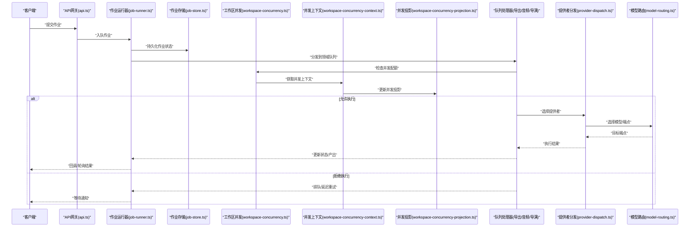

**图表来源** 
- [api.ts](file://server/src/server/api.ts)
- [job-runner.ts](file://server/src/server/job-runner.ts)
- [job-store.ts](file://server/src/server/job-store.ts)
- [workspace-concurrency.ts](file://src/features/ai/workspace-concurrency.ts)
- [workspace-concurrency-context.ts](file://src/features/ai/workspace-concurrency-context.ts)
- [workspace-concurrency-projection.ts](file://src/features/ai/workspace-concurrency-projection.ts)
- [export-queue-handler.ts](file://src/features/render/export-queue-handler.ts)
- [narration-queue-handler.ts](file://src/features/audio/narration-queue-handler.ts)
- [queue-handler.ts](file://src/features/director/queue-handler.ts)
- [provider-dispatch.ts](file://src/features/ai/provider-dispatch.ts)
- [model-routing.ts](file://src/features/ai/model-routing.ts)

## 详细组件分析

### 工作区并发控制器
- 职责：以工作区为单位维护并发令牌，保证同一工作区内并发不超过阈值，跨工作区互不影响。
- 关键点：令牌获取/释放、超时与取消、错误隔离。
- 复杂度：令牌操作近似O(1)，并发控制对整体吞吐影响可控。
- 优化建议：支持动态调整阈值、统计指标上报、背压信号。

**重大更新** 现在支持基于订阅计划的动态并发限制：
- 基础计划：3个并发
- 专业计划：20个并发  
- 企业计划：50个并发

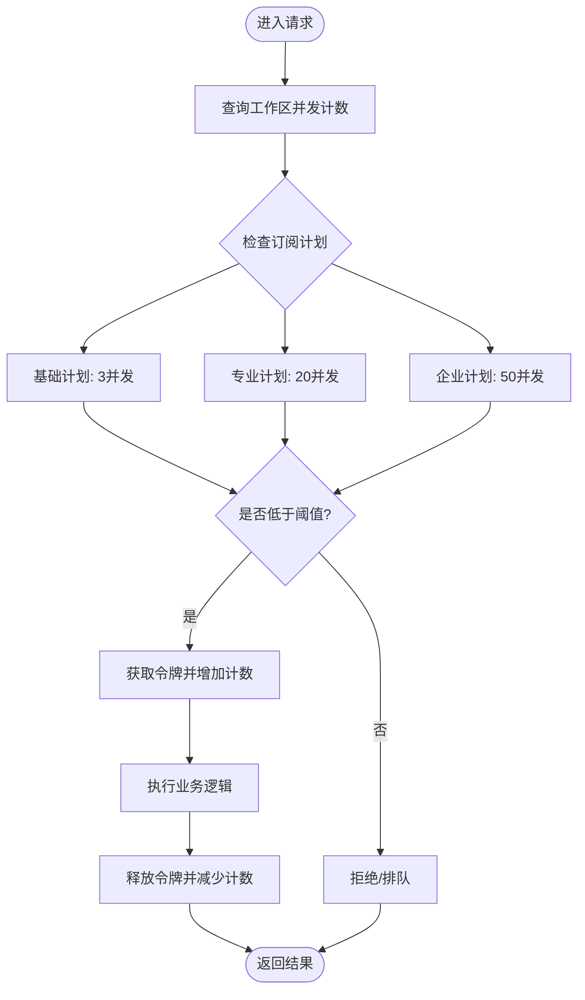

**图表来源** 
- [workspace-concurrency.ts](file://src/features/ai/workspace-concurrency.ts)

**章节来源**
- [workspace-concurrency.ts](file://src/features/ai/workspace-concurrency.ts)

### 并发上下文管理器
**新增功能** 引入了工作区级并发上下文管理，提供更精细的并发控制：

- 上下文隔离：每个工作区独立的并发上下文环境
- 状态同步：并发状态的实时同步和一致性保证
- 生命周期管理：上下文的创建、维护和销毁
- 权限控制：基于角色的并发访问控制

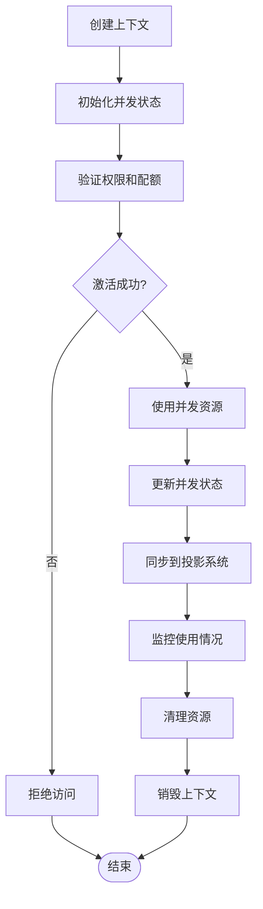

**图表来源** 
- [workspace-concurrency-context.ts](file://src/features/ai/workspace-concurrency-context.ts)

### 并发投影系统
**增强功能** 并发投影系统提供了实时的并发状态查询和分析能力：

- 实时投影：并发状态的实时快照和查询
- 历史追踪：并发历史的记录和回放
- 统计分析：并发使用率的统计和分析
- 告警机制：异常并发行为的检测和告警

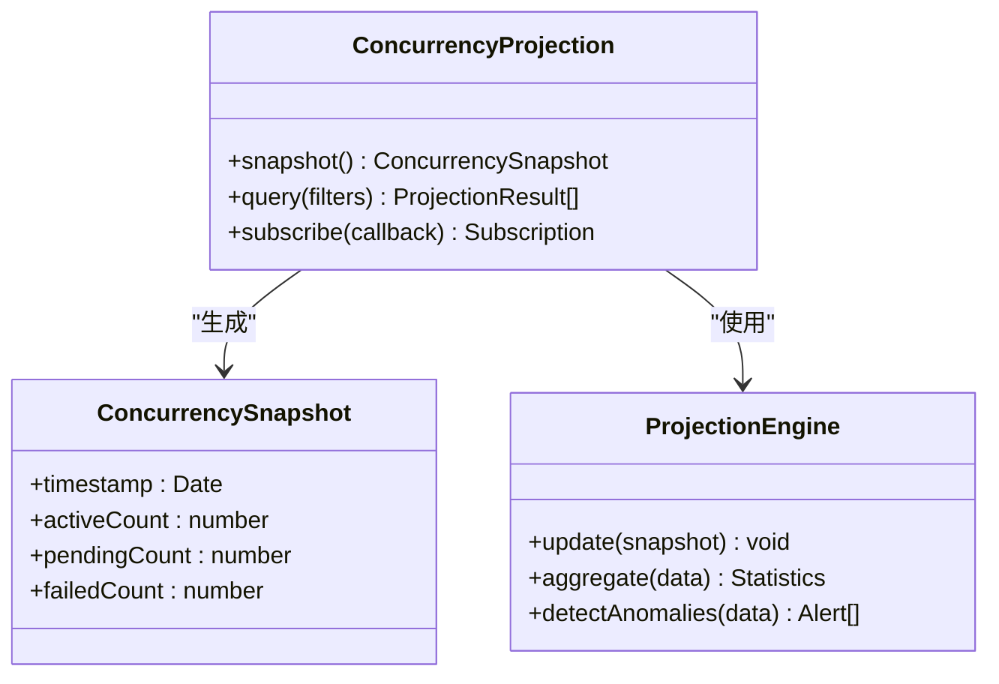

**图表来源** 
- [workspace-concurrency-projection.ts](file://src/features/ai/workspace-concurrency-projection.ts)

### 并发释放机制
**改进功能** 并发释放机制确保了资源的正确释放和清理：

- 自动释放：基于超时的自动资源释放
- 手动释放：支持显式的资源释放操作
- 释放确认：释放操作的确认和审计
- 泄漏检测：并发资源泄漏的检测和报告

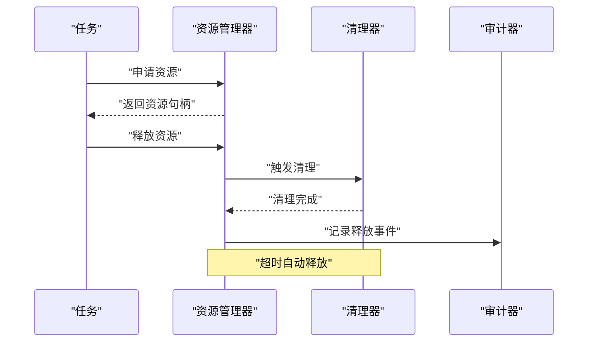

**图表来源** 
- [workspace-concurrency-release.ts](file://src/features/ai/workspace-concurrency-release.ts)

### 原子锁定机制
**新增功能** 引入了原子锁定机制来确保并发操作的线程安全：

- 分布式锁：防止多个进程同时修改共享状态
- 细粒度锁定：针对特定资源的最小化锁定范围
- 锁超时处理：避免死锁和资源泄漏
- 锁监控：跟踪锁的使用情况和性能影响

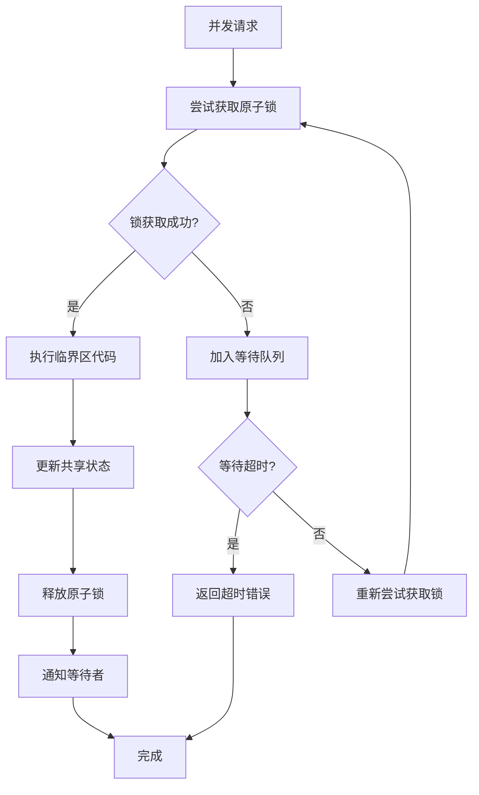

**图表来源** 
- [workspace-concurrency.ts](file://src/features/ai/workspace-concurrency.ts)

### 改进的完成处理
**增强功能** 完成了以下改进：

- 异步完成通知：支持WebSocket和HTTP回调两种完成通知方式
- 批量完成处理：提高大量作业完成的处理效率
- 完成状态追踪：完整的作业生命周期状态记录
- 错误恢复机制：自动重试和人工干预接口

### 进程内队列增强
**新功能** 新增了进程内队列的增强功能：

- 账户级故事板并发：每个账户独立的故事板编辑并发控制
- 交错执行：500毫秒延迟的交错执行策略，避免资源竞争
- 优先级队列：支持高优先级任务的快速处理
- 内存优化：智能的内存管理和垃圾回收

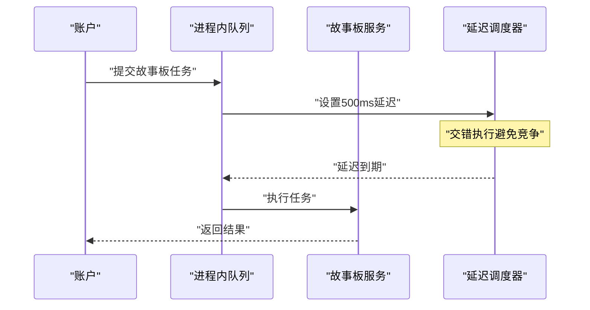

**图表来源** 
- [workspace-concurrency.ts](file://src/features/ai/workspace-concurrency.ts)

### 提供者分发器
- 职责：根据配置、健康状态与负载情况选择AI提供者，支持失败回退与熔断。
- 关键点：提供者注册表、健康检查、权重/优先级、错误分类与恢复。
- 复杂度：选择策略近似O(n)（n为候选提供者数量），可通过缓存命中优化。
- 优化建议：自适应权重、快速失败、降级到本地或离线模式。

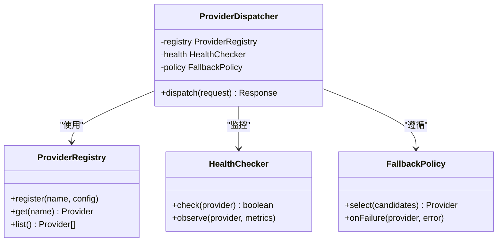

**图表来源** 
- [provider-dispatch.ts](file://src/features/ai/provider-dispatch.ts)

**章节来源**
- [provider-dispatch.ts](file://src/features/ai/provider-dispatch.ts)

### 模型路由
- 职责：在提供者内部进一步选择具体模型或端点，支持A/B、灰度、按能力分流。
- 关键点：路由规则、条件匹配、命中率与回退。
- 复杂度：规则匹配近似O(m)（m为规则数），可索引加速。
- 优化建议：规则热更新、就近路由、按负载动态切流。

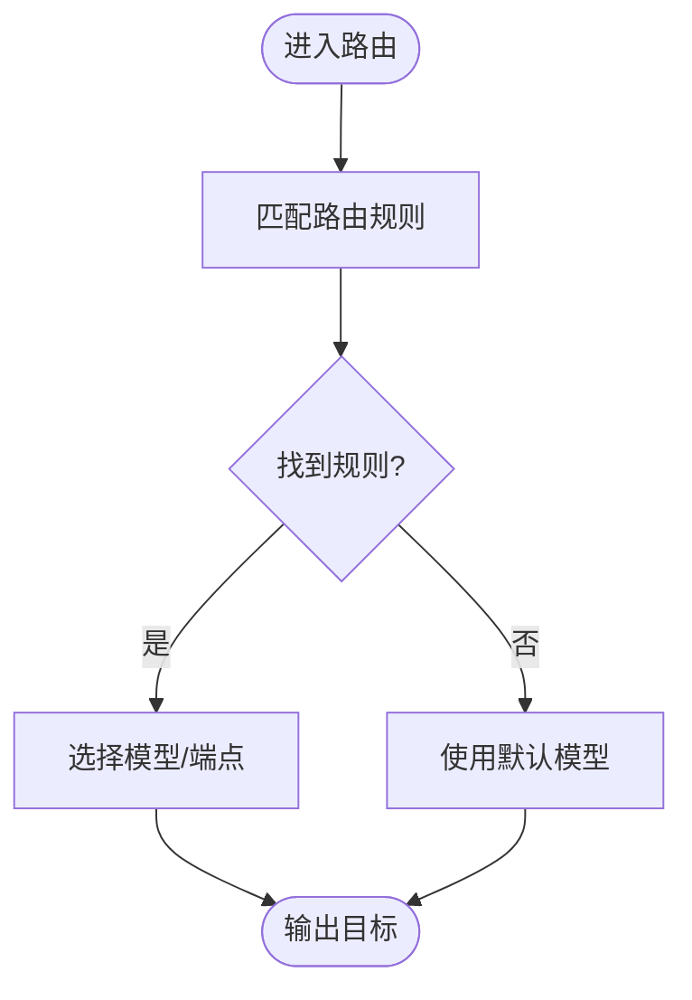

**图表来源** 
- [model-routing.ts](file://src/features/ai/model-routing.ts)

**章节来源**
- [model-routing.ts](file://src/features/ai/model-routing.ts)

### 作业运行器与存储
- 职责：统一作业生命周期管理，包括入队、调度、执行、重试、完成与清理。
- 关键点：幂等性、状态机、持久化一致性、可观测性。
- 复杂度：调度与状态更新近似O(log n)（基于优先级/时间戳）。
- 优化建议：批量处理、惰性加载、分片存储。

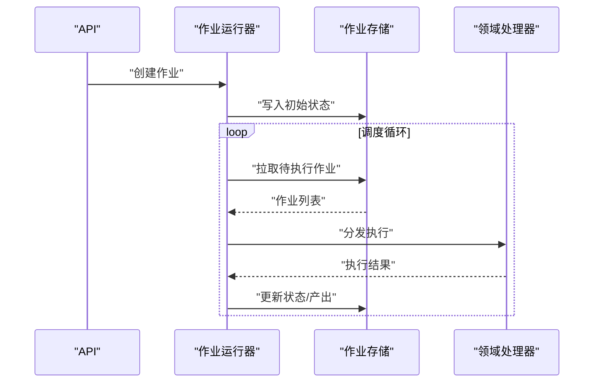

**图表来源** 
- [job-runner.ts](file://server/src/server/job-runner.ts)
- [job-store.ts](file://server/src/server/job-store.ts)

**章节来源**
- [job-runner.ts](file://server/src/server/job-runner.ts)
- [job-store.ts](file://server/src/server/job-store.ts)

### 领域队列处理器（渲染/音频/导演）
- 渲染导出队列处理器：负责视频/图像导出任务的并发控制、片段拼接、QA校验与最终归档。
- 音频旁白队列处理器：负责TTS生成、时长对齐、字幕合成与媒体封装。
- 导演队列处理器：负责编排步骤推进、工具调用、阶段产物落盘与异常恢复。
- 共性：都遵循"准入→执行→持久化→回调"的模式，并通过工作区并发控制器限流。

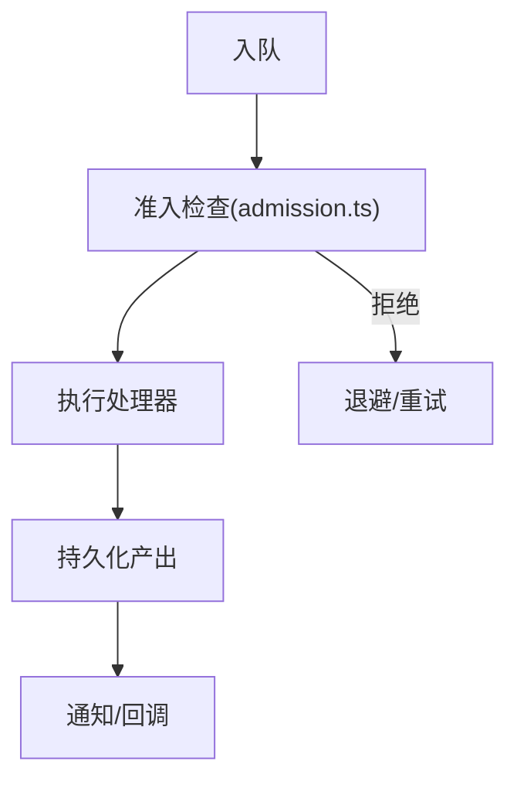

**图表来源** 
- [export-queue-handler.ts](file://src/features/render/export-queue-handler.ts)
- [narration-queue-handler.ts](file://src/features/audio/narration-queue-handler.ts)
- [queue-handler.ts](file://src/features/director/queue-handler.ts)
- [admission.ts](file://src/features/render/admission.ts)

**章节来源**
- [export-queue-handler.ts](file://src/features/render/export-queue-handler.ts)
- [narration-queue-handler.ts](file://src/features/audio/narration-queue-handler.ts)
- [queue-handler.ts](file://src/features/director/queue-handler.ts)
- [admission.ts](file://src/features/render/admission.ts)

### 渲染子系统（准入/缓存/渲染器/仓库）
- 准入控制：基于输入合法性、资源可用性与配额进行放行决策。
- 缓存：对中间产物与最终结果进行缓存，提升重复请求性能。
- 渲染器：核心媒体处理逻辑，包含帧序列、编码、合并与质量检查。
- 仓库：持久化渲染产物与元数据，支持查询与回放。

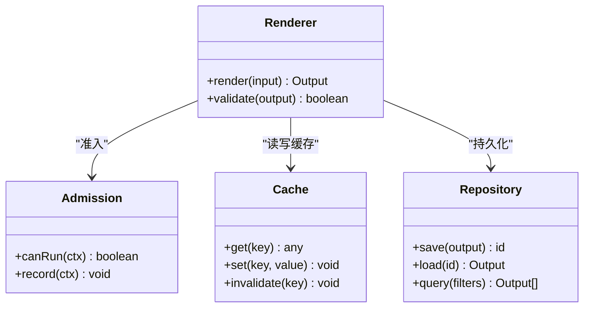

**图表来源** 
- [admission.ts](file://src/features/render/admission.ts)
- [cache.ts](file://src/features/render/cache.ts)
- [renderer.ts](file://src/features/render/renderer.ts)
- [repository.ts](file://src/features/render/repository.ts)

**章节来源**
- [admission.ts](file://src/features/render/admission.ts)
- [cache.ts](file://src/features/render/cache.ts)
- [renderer.ts](file://src/features/render/renderer.ts)
- [repository.ts](file://src/features/render/repository.ts)

## 依赖关系分析
- 低耦合高内聚：各队列处理器独立实现，通过统一的作业接口与运行器交互。
- 明确边界：工作区并发控制器作为横切关注点，被所有需要限流的组件复用。
- 外部依赖：AI提供者通过适配器抽象，便于替换与扩展。
- 潜在风险：若作业存储成为瓶颈，需引入分片与读写分离；缓存一致性需关注失效策略。

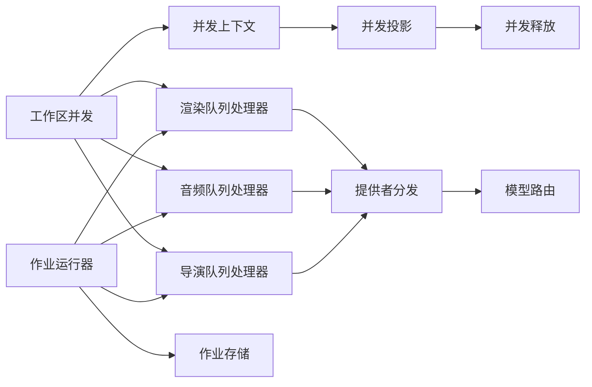

**图表来源** 
- [workspace-concurrency.ts](file://src/features/ai/workspace-concurrency.ts)
- [workspace-concurrency-context.ts](file://src/features/ai/workspace-concurrency-context.ts)
- [workspace-concurrency-projection.ts](file://src/features/ai/workspace-concurrency-projection.ts)
- [workspace-concurrency-release.ts](file://src/features/ai/workspace-concurrency-release.ts)
- [export-queue-handler.ts](file://src/features/render/export-queue-handler.ts)
- [narration-queue-handler.ts](file://src/features/audio/narration-queue-handler.ts)
- [queue-handler.ts](file://src/features/director/queue-handler.ts)
- [provider-dispatch.ts](file://src/features/ai/provider-dispatch.ts)
- [model-routing.ts](file://src/features/ai/model-routing.ts)
- [job-runner.ts](file://server/src/server/job-runner.ts)
- [job-store.ts](file://server/src/server/job-store.ts)

**章节来源**
- [workspace-concurrency.ts](file://src/features/ai/workspace-concurrency.ts)
- [workspace-concurrency-context.ts](file://src/features/ai/workspace-concurrency-context.ts)
- [workspace-concurrency-projection.ts](file://src/features/ai/workspace-concurrency-projection.ts)
- [workspace-concurrency-release.ts](file://src/features/ai/workspace-concurrency-release.ts)
- [provider-dispatch.ts](file://src/features/ai/provider-dispatch.ts)
- [model-routing.ts](file://src/features/ai/model-routing.ts)
- [job-runner.ts](file://server/src/server/job-runner.ts)
- [job-store.ts](file://server/src/server/job-store.ts)
- [export-queue-handler.ts](file://src/features/render/export-queue-handler.ts)
- [narration-queue-handler.ts](file://src/features/audio/narration-queue-handler.ts)
- [queue-handler.ts](file://src/features/director/queue-handler.ts)

## 性能考量
- 并发控制：工作区维度的令牌桶/漏桶策略可有效抑制突发流量，避免下游过载。
- 缓存命中：渲染中间结果与最终产物缓存能显著降低重复计算与I/O。
- 批处理：作业运行器可采用批量拉取与批量提交，减少数据库往返。
- 背压与退避：队列处理器应实现指数退避与最大重试次数，防止风暴。
- 可观测性：关键指标（队列长度、平均耗时、错误率、缓存命中率）需持续采集。

**新增性能优化**
- 原子锁定减少了竞态条件的开销
- 交错执行避免了资源竞争导致的性能下降
- 基于订阅计划的动态限流提高了资源利用率
- 进程内队列减少了网络通信开销
- 并发投影系统提供了高效的并发状态查询
- 分布式锁机制提升了多进程环境下的安全性

## 故障排查指南
- 常见问题
  - 工作区并发不足导致大量排队：检查工作区阈值设置与令牌释放逻辑。
  - 提供者不可用或响应慢：查看健康检查与熔断策略，确认回退路径是否生效。
  - 渲染失败或产物不一致：检查准入规则、缓存失效与仓库写入顺序。
  - 作业堆积：评估队列处理器并行度、重试策略与下游依赖容量。
  - 原子锁冲突：检查锁获取超时和释放逻辑。
  - 进程内队列阻塞：监控队列长度和延迟执行情况。
  - 并发上下文泄漏：检查上下文的生命周期管理和资源清理。
  - 并发投影不一致：验证投影系统的同步机制和数据一致性。
- 定位方法
  - 通过作业ID追踪全链路日志，确认各阶段耗时与错误码。
  - 检查缓存键冲突与过期策略，避免脏读。
  - 核对工作区上下文契约，确保并发控制与权限校验一致。
  - 监控原子锁的使用情况和持有时间。
  - 分析进程内队列的执行模式和延迟分布。
  - 检查并发上下文的状态和生命周期。
  - 验证并发投影数据的准确性和时效性。

**章节来源**
- [workspace-context-contract.test.ts](file://tests/workspace-context-contract.test.ts)

## 结论
本系统通过"工作区并发控制+提供者智能分发+作业统一调度+领域队列处理器"的组合，实现了高可用、可扩展的AI并发管理能力。**最新更新** 通过引入基于订阅计划的动态并发限制、原子锁定机制和改进的完成处理，系统在资源利用率和用户体验方面有了显著提升。新增的并发上下文管理、并发投影系统和并发释放机制，进一步增强了系统的可观测性和可靠性。建议在后续迭代中加强自适应限流、动态路由与健康自愈能力，进一步提升系统在极端负载下的鲁棒性与效率。

## 附录
- 术语
  - 工作区：逻辑隔离的执行单元，用于资源与并发控制。
  - 提供者：AI服务提供方（如OpenAI兼容、Gemini、StepFun等）。
  - 作业：最小执行单位，包含输入、状态与产出。
  - 准入：在执行前对请求进行合法性与资源可用性检查。
  - 原子锁：确保并发操作线程安全的同步机制。
  - 交错执行：通过延迟调度避免资源竞争的并发策略。
  - 并发上下文：工作区的并发状态和执行环境。
  - 并发投影：并发状态的实时快照和查询接口。
  - 并发释放：并发资源的正确释放和清理机制。
- 参考实现位置
  - 工作区并发：src/features/ai/workspace-concurrency.ts
  - 并发上下文：src/features/ai/workspace-concurrency-context.ts
  - 并发投影：src/features/ai/workspace-concurrency-projection.ts
  - 并发释放：src/features/ai/workspace-concurrency-release.ts
  - 提供者分发：src/features/ai/provider-dispatch.ts
  - 模型路由：src/features/ai/model-routing.ts
  - 作业运行器：server/src/server/job-runner.ts
  - 作业存储：server/src/server/job-store.ts
  - 渲染队列处理器：src/features/render/export-queue-handler.ts
  - 音频队列处理器：src/features/audio/narration-queue-handler.ts
  - 导演队列处理器：src/features/director/queue-handler.ts
  - 准入控制：src/features/render/admission.ts
  - 缓存：src/features/render/cache.ts
  - 渲染器：src/features/render/renderer.ts
  - 仓库：src/features/render/repository.ts