# AI托管服务架构

<cite>
**本文引用的文件**
- [package.json](file://package.json)
- [next.config.ts](file://next.config.ts)
- [tsconfig.json](file://tsconfig.json)
- [Dockerfile](file://Dockerfile)
- [docker-compose.dev.yml](file://docker-compose.dev.yml)
- [docker-compose.prod.yml](file://docker-compose.prod.yml)
- [drizzle.config.ts](file://drizzle.config.ts)
- [server/package.json](file://server/package.json)
- [server/tsconfig.json](file://server/tsconfig.json)
- [server/Dockerfile](file://server/Dockerfile)
- [server/src/index.ts](file://server/src/index.ts)
- [server/src/server/api.ts](file://server/src/server/api.ts)
- [server/src/server/job-runner.ts](file://server/src/server/job-runner.ts)
- [server/src/server/job-store.ts](file://server/src/server/job-store.ts)
- [server/src/compose/run-pipeline.ts](file://server/src/compose/run-pipeline.ts)
- [server/src/compose/model.ts](file://server/src/compose/model.ts)
- [server/src/capture/ai-capture-agent.ts](file://server/src/capture/ai-capture-agent.ts)
- [server/src/tts/orchestrate.ts](file://server/src/tts/orchestrate.ts)
- [server/src/lib/load-env.ts](file://server/src/lib/load-env.ts)
- [server/src/lib/logger.ts](file://server/src/lib/logger.ts)
- [src/features/ai/index.ts](file://src/features/ai/index.ts)
- [src/features/ai/managed-gateway.ts](file://src/features/ai/managed-gateway.ts)
- [src/features/ai/provider-registry.ts](file://src/features/ai/provider-registry.ts)
- [src/features/ai/model-routing.ts](file://src/features/ai/model-routing.ts)
- [src/features/ai/openai-compatible-config.ts](file://src/features/ai/openai-compatible-config.ts)
- [src/features/ai/gemini-config.ts](file://src/features/ai/gemini-config.ts)
- [src/features/ai/mimo-config.ts](file://src/features/ai/mimo-config.ts)
- [src/features/ai/stepfun-adapter.ts](file://src/features/ai/stepfun-adapter.ts)
- [src/features/ai/mimo-adapter.ts](file://src/features/ai/mimo-adapter.ts)
- [src/features/ai/gemini-adapter.ts](file://src/features/ai/gemini-adapter.ts)
- [src/features/ai/managed-credentials.ts](file://src/features/ai/managed-credentials.ts)
- [src/features/ai/managed-fallback.ts](file://src/features/ai/managed-fallback.ts)
- [src/features/ai/managed-service.ts](file://src/features/ai/managed-service.ts)
- [src/features/ai/managed-model-catalog-repository.ts](file://src/features/ai/managed-model-catalog-repository.ts)
- [src/features/ai/managed-vision-executor.ts](file://src/features/ai/managed-vision-executor.ts)
- [src/features/audio/narration-queue-handler.ts](file://src/features/audio/narration-queue-handler.ts)
- [src/features/audio/repository.ts](file://src/features/audio/repository.ts)
- [src/features/audio/runtime-repository.ts](file://src/features/audio/runtime-repository.ts)
- [src/features/director/pipeline.ts](file://src/features/director/pipeline.ts)
- [src/features/director/stage-runner.ts](file://src/features/director/stage-runner.ts)
- [src/features/render/export-service.ts](file://src/features/render/export-service.ts)
- [src/features/render/renderer.ts](file://src/features/render/renderer.ts)
- [src/app/api/render/route.ts](file://src/app/api/render/route.ts)
- [src/app/api/director/pipeline/route.ts](file://src/app/api/director/pipeline/route.ts)
- [src/app/api/jobs/[id]/route.ts](file://src/app/api/jobs/[id]/route.ts)
- [deploy/reverse-proxy/Dockerfile](file://deploy/reverse-proxy/Dockerfile)
- [deploy/reverse-proxy/entrypoint.sh](file://deploy/reverse-proxy/entrypoint.sh)
</cite>

## 更新摘要
**变更内容**
- 新增统一平台模型服务，集中管理成本计量与凭据管理
- 实现免费Gemini访问门控机制
- 增强StepFun、MiMo和Gemini服务的回退过滤能力
- 优化AI网关的提供商管理与路由策略
- **最新变更**：托管服务组件支持通过路由解析的新凭据消费模式，保持与更新后的提供商接口兼容性
- **重要更新**：新增托管模型目录仓库(managed-model-catalog-repository.ts)，重构了模型路由系统和提供商设置投影逻辑，增强了网关和降级机制的健壮性
- **新增功能**：引入托管视觉执行器(managed-vision-executor.ts)，提供专门的视觉AI操作处理能力
- **增强功能**：改进供应商调用的预订结算机制，提升资源管理和成本控制能力

## 目录
1. [简介](#简介)
2. [项目结构](#项目结构)
3. [核心组件](#核心组件)
4. [架构总览](#架构总览)
5. [详细组件分析](#详细组件分析)
6. [依赖关系分析](#依赖关系分析)
7. [性能考量](#性能考量)
8. [故障排查指南](#故障排查指南)
9. [结论](#结论)
10. [附录](#附录)

## 简介
本仓库实现了一个面向AI的"托管服务"平台，提供多模型提供商的统一接入、编排与调度能力，涵盖内容生成（导演/流水线）、TTS语音合成、媒体渲染导出、采集代理等关键能力。系统采用前后端分离：前端基于Next.js应用，后端通过独立的Node服务承载API、作业调度与外部AI/TTS/渲染能力的集成。部署层面支持Docker与反向代理，便于本地开发与生产环境一致化运行。

**最新更新**：平台现已集成统一的模型服务层，实现了集中化的成本计量、托管凭据管理和智能回退机制，为StepFun、MiMo和Gemini等服务提供了增强的稳定性和成本控制能力。**最新变更**：托管服务组件已更新以支持通过路由解析的新凭据消费模式，同时保持与更新后的提供商接口的兼容性。**重要更新**：新增了托管模型目录仓库，重构了模型路由系统和提供商设置投影逻辑，显著增强了网关和降级机制的健壮性和可扩展性。**新增功能**：引入了托管视觉执行器，专门处理视觉AI操作，包括图像识别、OCR、视觉问答等功能，并通过改进的预订结算机制优化供应商调用成本。**重要更新**：提供商设置投影逻辑和降级机制得到显著增强，提升了系统的健壮性和可维护性。

## 项目结构
- 前端应用位于 src 目录，包含页面路由、业务功能模块（features）与通用UI组件（components）。
- 服务端逻辑位于 server 目录，包含API入口、作业运行器、存储抽象、编排与TTS等子模块。
- 部署配置位于 deploy 与根级 Dockerfile/docker-compose 文件，用于容器化与反向代理。
- 文档与用例位于 docs 与 scripts 目录，覆盖配置、设计、问题追踪与验证脚本。

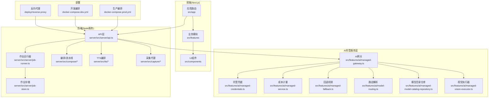

**图示来源**
- [server/src/server/api.ts](file://server/src/server/api.ts)
- [server/src/server/job-runner.ts](file://server/src/server/job-runner.ts)
- [server/src/server/job-store.ts](file://server/src/server/job-store.ts)
- [server/src/compose/run-pipeline.ts](file://server/src/compose/run-pipeline.ts)
- [server/src/tts/orchestrate.ts](file://server/src/tts/orchestrate.ts)
- [server/src/capture/ai-capture-agent.ts](file://server/src/capture/ai-capture-agent.ts)
- [src/features/ai/managed-gateway.ts](file://src/features/ai/managed-gateway.ts)
- [src/features/ai/managed-credentials.ts](file://src/features/ai/managed-credentials.ts)
- [src/features/ai/managed-service.ts](file://src/features/ai/managed-service.ts)
- [src/features/ai/managed-fallback.ts](file://src/features/ai/managed-fallback.ts)
- [src/features/ai/model-routing.ts](file://src/features/ai/model-routing.ts)
- [src/features/ai/managed-model-catalog-repository.ts](file://src/features/ai/managed-model-catalog-repository.ts)
- [src/features/ai/managed-vision-executor.ts](file://src/features/ai/managed-vision-executor.ts)
- [docker-compose.dev.yml](file://docker-compose.dev.yml)
- [docker-compose.prod.yml](file://docker-compose.prod.yml)
- [deploy/reverse-proxy/Dockerfile](file://deploy/reverse-proxy/Dockerfile)

**章节来源**
- [package.json](file://package.json)
- [next.config.ts](file://next.config.ts)
- [tsconfig.json](file://tsconfig.json)
- [Dockerfile](file://Dockerfile)
- [docker-compose.dev.yml](file://docker-compose.dev.yml)
- [docker-compose.prod.yml](file://docker-compose.prod.yml)

## 核心组件
- 统一AI网关与提供商注册：集中管理多模型提供商的配置、适配与路由策略，屏蔽底层差异。
- **新增** 托管凭据管理：安全存储和管理各提供商的API密钥和认证信息。
- **新增** 集中成本计量：跟踪和记录各模型调用的成本，支持配额控制和预算告警。
- **新增** 智能回退机制：当主提供商不可用时自动切换到备用提供商。
- **新增** 路由解析机制：通过路由解析支持新的凭据消费模式，提升提供商接口兼容性。
- **重要新增** 托管模型目录仓库：统一管理模型元数据、版本信息和可用性状态，提供模型发现和选择能力。
- **新增** 托管视觉执行器：专门处理视觉AI操作，包括图像识别、OCR、视觉问答等视觉相关任务。
- **增强** 预订结算机制：改进供应商调用的资源管理和成本控制，提升成本效益。
- 作业调度与持久化：将耗时任务（渲染、TTS、采集、流水线）抽象为作业，提供队列执行与状态跟踪。
- 编排与流水线：将复杂流程拆分为阶段（Stage），按顺序或条件执行，支持结果回写与恢复。
- TTS语音合成：从文本到音频的端到端处理，包括队列、存储与计费计量。
- 渲染与导出：媒体组装、帧捕获、转码与导出，提供缩略图与QA检查。
- 采集代理：通过浏览器驱动或AI代理进行网页/内容抓取与结构化输出。

**章节来源**
- [src/features/ai/managed-gateway.ts](file://src/features/ai/managed-gateway.ts)
- [src/features/ai/provider-registry.ts](file://src/features/ai/provider-registry.ts)
- [src/features/ai/managed-credentials.ts](file://src/features/ai/managed-credentials.ts)
- [src/features/ai/managed-service.ts](file://src/features/ai/managed-service.ts)
- [src/features/ai/managed-fallback.ts](file://src/features/ai/managed-fallback.ts)
- [src/features/ai/model-routing.ts](file://src/features/ai/model-routing.ts)
- [src/features/ai/managed-model-catalog-repository.ts](file://src/features/ai/managed-model-catalog-repository.ts)
- [src/features/ai/managed-vision-executor.ts](file://src/features/ai/managed-vision-executor.ts)
- [server/src/server/job-runner.ts](file://server/src/server/job-runner.ts)
- [server/src/server/job-store.ts](file://server/src/server/job-store.ts)
- [server/src/compose/run-pipeline.ts](file://server/src/compose/run-pipeline.ts)
- [server/src/tts/orchestrate.ts](file://server/src/tts/orchestrate.ts)
- [src/features/render/export-service.ts](file://src/features/render/export-service.ts)
- [server/src/capture/ai-capture-agent.ts](file://server/src/capture/ai-capture-agent.ts)

## 架构总览
整体架构遵循"前端请求 -> API网关 -> 作业调度 -> 领域服务（AI/TTS/渲染/采集）-> 存储/外部服务"的分层模式。反向代理负责鉴权与流量转发，作业运行器保证异步任务的可靠执行，领域服务通过适配器对接不同提供商。**新增的统一AI托管服务层**提供了集中化的凭据管理、成本计量、智能回退、路由解析、模型目录管理和视觉执行能力，显著增强了系统的健壮性和可扩展性。**新增的视觉执行器**专门处理视觉相关AI操作，通过改进的预订结算机制优化资源使用。

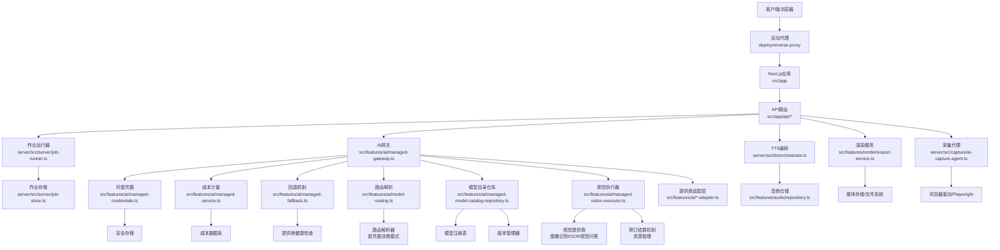

**图示来源**
- [src/app/api/render/route.ts](file://src/app/api/render/route.ts)
- [src/app/api/director/pipeline/route.ts](file://src/app/api/director/pipeline/route.ts)
- [src/app/api/jobs/[id]/route.ts](file://src/app/api/jobs/[id]/route.ts)
- [server/src/server/job-runner.ts](file://server/src/server/job-runner.ts)
- [server/src/server/job-store.ts](file://server/src/server/job-store.ts)
- [src/features/ai/managed-gateway.ts](file://src/features/ai/managed-gateway.ts)
- [src/features/ai/managed-credentials.ts](file://src/features/ai/managed-credentials.ts)
- [src/features/ai/managed-service.ts](file://src/features/ai/managed-service.ts)
- [src/features/ai/managed-fallback.ts](file://src/features/ai/managed-fallback.ts)
- [src/features/ai/model-routing.ts](file://src/features/ai/model-routing.ts)
- [src/features/ai/managed-model-catalog-repository.ts](file://src/features/ai/managed-model-catalog-repository.ts)
- [src/features/ai/managed-vision-executor.ts](file://src/features/ai/managed-vision-executor.ts)
- [server/src/tts/orchestrate.ts](file://server/src/tts/orchestrate.ts)
- [src/features/render/export-service.ts](file://src/features/render/export-service.ts)
- [server/src/capture/ai-capture-agent.ts](file://server/src/capture/ai-capture-agent.ts)
- [src/features/audio/repository.ts](file://src/features/audio/repository.ts)
- [deploy/reverse-proxy/Dockerfile](file://deploy/reverse-proxy/Dockerfile)

## 详细组件分析

### AI托管网关与提供商注册
- 职责：统一管理提供商配置、凭证、路由策略与降级；对外暴露统一的调用接口。
- 关键模块：
  - 提供商注册表：维护提供商实例与能力元数据。
  - 模型路由：根据负载、成本、可用性选择最优提供商。
  - OpenAI兼容、Gemini、Mimo、StepFun等适配器：封装具体协议与载荷。
  - 配置与校验：加载环境变量、合并默认值、校验必填项。
  - **新增** 路由解析器：支持新的凭据消费模式，提升接口兼容性。
  - **重要新增** 模型目录仓库：统一管理模型元数据和版本信息。
  - **新增** 视觉执行器集成：专门处理视觉相关AI操作。

**更新**：新增了托管凭据管理、集中成本计量、智能回退机制、路由解析功能和模型目录仓库，显著提升了系统的稳定性、成本控制能力、接口兼容性和模型管理能力。**新增的视觉执行器**为视觉AI操作提供了专门的处理能力，通过改进的预订结算机制优化资源使用。

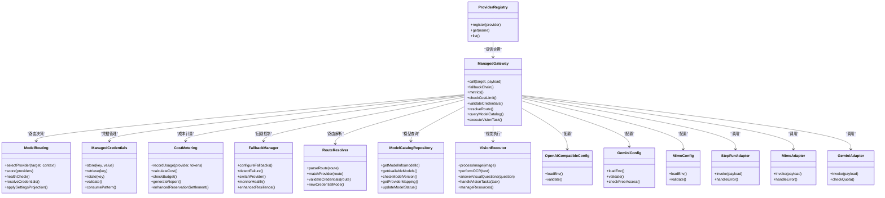

**图示来源**
- [src/features/ai/provider-registry.ts](file://src/features/ai/provider-registry.ts)
- [src/features/ai/managed-gateway.ts](file://src/features/ai/managed-gateway.ts)
- [src/features/ai/model-routing.ts](file://src/features/ai/model-routing.ts)
- [src/features/ai/managed-credentials.ts](file://src/features/ai/managed-credentials.ts)
- [src/features/ai/managed-service.ts](file://src/features/ai/managed-service.ts)
- [src/features/ai/managed-fallback.ts](file://src/features/ai/managed-fallback.ts)
- [src/features/ai/managed-model-catalog-repository.ts](file://src/features/ai/managed-model-catalog-repository.ts)
- [src/features/ai/managed-vision-executor.ts](file://src/features/ai/managed-vision-executor.ts)
- [src/features/ai/openai-compatible-config.ts](file://src/features/ai/openai-compatible-config.ts)
- [src/features/ai/gemini-config.ts](file://src/features/ai/gemini-config.ts)
- [src/features/ai/mimo-config.ts](file://src/features/ai/mimo-config.ts)
- [src/features/ai/stepfun-adapter.ts](file://src/features/ai/stepfun-adapter.ts)
- [src/features/ai/mimo-adapter.ts](file://src/features/ai/mimo-adapter.ts)
- [src/features/ai/gemini-adapter.ts](file://src/features/ai/gemini-adapter.ts)

**章节来源**
- [src/features/ai/index.ts](file://src/features/ai/index.ts)
- [src/features/ai/managed-gateway.ts](file://src/features/ai/managed-gateway.ts)
- [src/features/ai/provider-registry.ts](file://src/features/ai/provider-registry.ts)
- [src/features/ai/model-routing.ts](file://src/features/ai/model-routing.ts)
- [src/features/ai/managed-credentials.ts](file://src/features/ai/managed-credentials.ts)
- [src/features/ai/managed-service.ts](file://src/features/ai/managed-service.ts)
- [src/features/ai/managed-fallback.ts](file://src/features/ai/managed-fallback.ts)
- [src/features/ai/managed-model-catalog-repository.ts](file://src/features/ai/managed-model-catalog-repository.ts)
- [src/features/ai/managed-vision-executor.ts](file://src/features/ai/managed-vision-executor.ts)
- [src/features/ai/openai-compatible-config.ts](file://src/features/ai/openai-compatible-config.ts)
- [src/features/ai/gemini-config.ts](file://src/features/ai/gemini-config.ts)
- [src/features/ai/mimo-config.ts](file://src/features/ai/mimo-config.ts)
- [src/features/ai/stepfun-adapter.ts](file://src/features/ai/stepfun-adapter.ts)
- [src/features/ai/mimo-adapter.ts](file://src/features/ai/mimo-adapter.ts)
- [src/features/ai/gemini-adapter.ts](file://src/features/ai/gemini-adapter.ts)

### 托管视觉执行器
- 职责：专门处理视觉相关的AI操作，包括图像识别、OCR文字识别、视觉问答等功能。
- 关键特性：
  - 视觉任务处理：支持多种视觉AI操作的统一接口。
  - 资源管理：通过预订结算机制优化资源使用和成本控制。
  - 提供商适配：集成多个视觉AI提供商，提供统一调用接口。
  - 错误处理：完善的异常处理和重试机制。
  - **新增功能**：通过改进的预订结算机制，显著提升资源利用效率和成本控制能力。

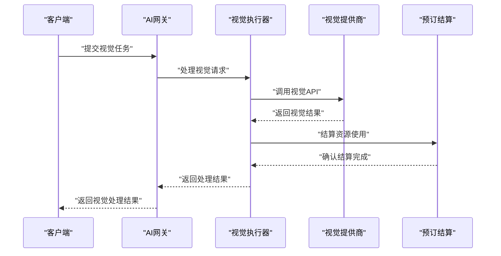

**图示来源**
- [src/features/ai/managed-vision-executor.ts](file://src/features/ai/managed-vision-executor.ts)

**章节来源**
- [src/features/ai/managed-vision-executor.ts](file://src/features/ai/managed-vision-executor.ts)

### 托管模型目录仓库
- 职责：统一管理模型元数据、版本信息和可用性状态，提供模型发现和选择能力。
- 关键特性：
  - 模型注册：动态注册新模型和提供商映射。
  - 版本管理：跟踪模型版本历史和兼容性。
  - 可用性监控：实时监控模型可用性和性能指标。
  - 智能选择：基于负载、成本和可用性选择最优模型。
  - **重要更新**：改进了提供商设置投影逻辑，提升配置管理的灵活性。

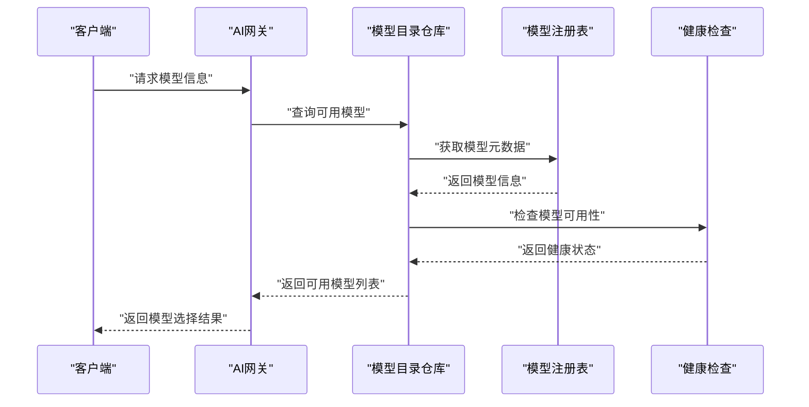

**图示来源**
- [src/features/ai/managed-model-catalog-repository.ts](file://src/features/ai/managed-model-catalog-repository.ts)

**章节来源**
- [src/features/ai/managed-model-catalog-repository.ts](file://src/features/ai/managed-model-catalog-repository.ts)

### 托管凭据管理
- 职责：安全存储和管理各AI提供商的API密钥、令牌和其他认证信息。
- 关键特性：
  - 加密存储：所有敏感信息使用加密算法保护。
  - 动态轮换：支持定期自动轮换凭据。
  - 权限控制：基于用户和工作空间的访问控制。
  - 审计日志：记录所有凭据访问和操作。
  - **新增** 新凭据消费模式：支持通过路由解析的消费方式，提升接口兼容性。

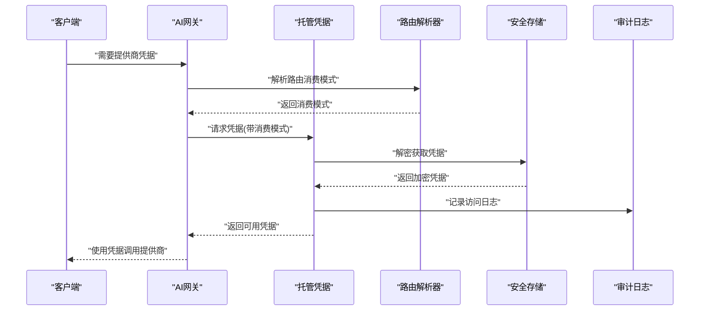

**图示来源**
- [src/features/ai/managed-credentials.ts](file://src/features/ai/managed-credentials.ts)

**章节来源**
- [src/features/ai/managed-credentials.ts](file://src/features/ai/managed-credentials.ts)

### 集中成本计量
- 职责：跟踪和记录各模型调用的成本，支持配额控制和预算告警。
- 关键功能：
  - 实时计量：每次API调用都记录token数量和成本。
  - 预算监控：设置月度/每日预算限制并触发告警。
  - 成本分析：生成详细的成本报告和使用趋势分析。
  - 配额管理：为不同用户提供不同的使用配额。
  - **增强** 预订结算机制：通过改进的资源管理，提升成本控制的精确性和效率。

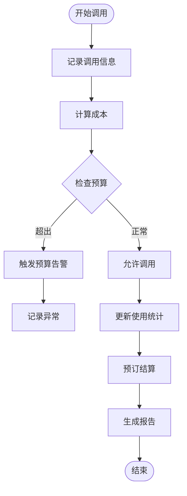

**图示来源**
- [src/features/ai/managed-service.ts](file://src/features/ai/managed-service.ts)

**章节来源**
- [src/features/ai/managed-service.ts](file://src/features/ai/managed-service.ts)

### 智能回退机制
- 职责：当主提供商不可用时自动切换到备用提供商，确保服务连续性。
- 关键特性：
  - 健康检查：实时监控各提供商的健康状态。
  - 自动切换：检测到故障时自动切换到备用提供商。
  - 负载均衡：在多个可用提供商间分配请求。
  - 快速恢复：主提供商恢复后自动切回。
  - **重要更新**：增强了降级机制的健壮性，提供更可靠的故障恢复。

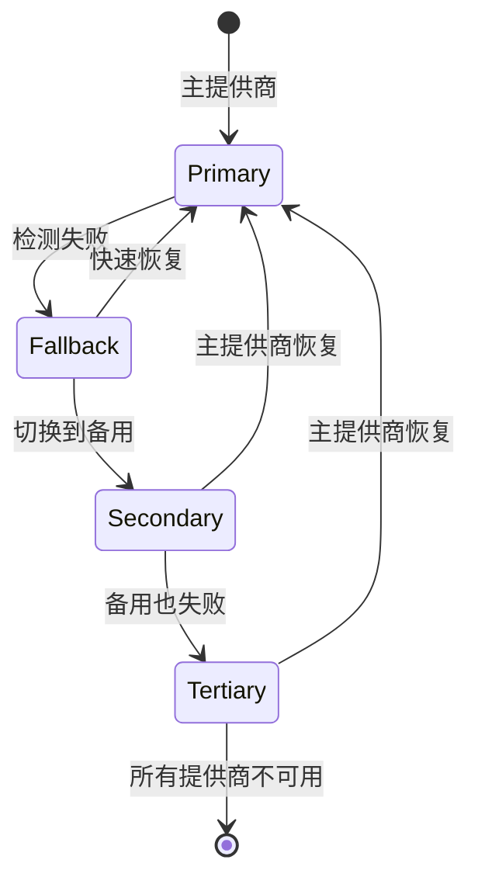

**图示来源**
- [src/features/ai/managed-fallback.ts](file://src/features/ai/managed-fallback.ts)

**章节来源**
- [src/features/ai/managed-fallback.ts](file://src/features/ai/managed-fallback.ts)

### 路由解析与凭据消费
- 职责：解析路由配置，确定凭据消费模式和提供商选择策略。
- 关键特性：
  - 路由匹配：根据请求路径和参数匹配对应的提供商。
  - 消费模式：支持多种凭据消费方式，提升接口兼容性。
  - 优先级排序：根据配置优先级选择最优提供商。
  - 动态调整：运行时动态调整路由策略。
  - **重要更新**：改进了提供商设置投影逻辑，提升配置管理的灵活性和准确性。

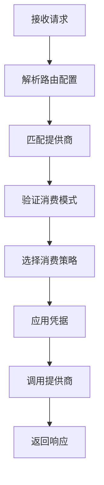

**图示来源**
- [src/features/ai/model-routing.ts](file://src/features/ai/model-routing.ts)

**章节来源**
- [src/features/ai/model-routing.ts](file://src/features/ai/model-routing.ts)

### 作业调度与持久化
- 职责：接收API请求，创建作业、分配执行槽位、监控进度、失败重试与结果回写。
- 关键模块：
  - 作业运行器：消费队列、并发控制、生命周期管理。
  - 作业存储：持久化作业状态、上下文与结果。
  - API路由：提交作业、查询状态、获取结果。

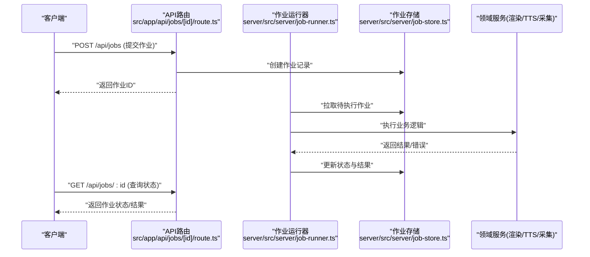

**图示来源**
- [src/app/api/jobs/[id]/route.ts](file://src/app/api/jobs/[id]/route.ts)
- [server/src/server/job-runner.ts](file://server/src/server/job-runner.ts)
- [server/src/server/job-store.ts](file://server/src/server/job-store.ts)

**章节来源**
- [server/src/server/job-runner.ts](file://server/src/server/job-runner.ts)
- [server/src/server/job-store.ts](file://server/src/server/job-store.ts)
- [src/app/api/jobs/[id]/route.ts](file://src/app/api/jobs/[id]/route.ts)

### 编排与流水线（导演/阶段）
- 职责：将复杂任务拆解为多个阶段（Stage），按顺序或条件执行，支持中间产物读写与恢复。
- 关键模块：
  - 流水线定义：阶段描述、输入输出契约、错误策略。
  - 阶段运行器：执行单个阶段、处理副作用、提交结果。
  - 运行时仓储：保存阶段状态与产物。

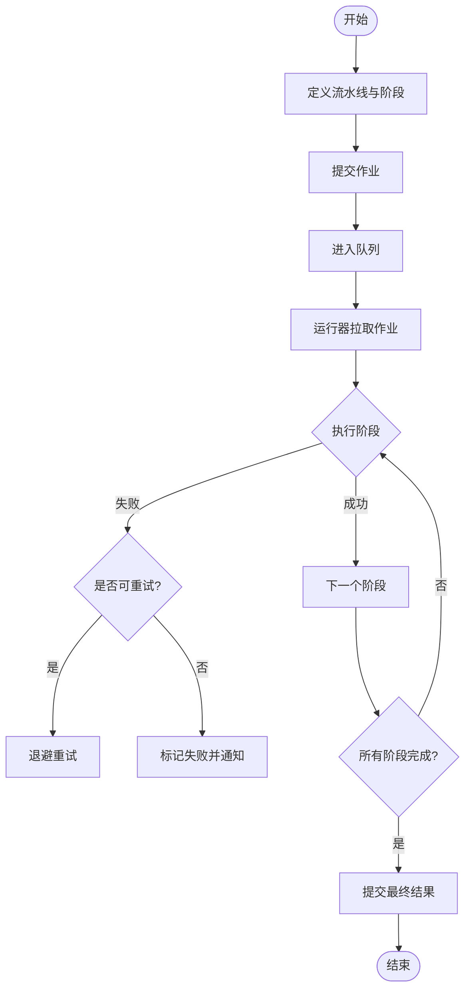

**图示来源**
- [src/features/director/pipeline.ts](file://src/features/director/pipeline.ts)
- [src/features/director/stage-runner.ts](file://src/features/director/stage-runner.ts)
- [server/src/compose/run-pipeline.ts](file://server/src/compose/run-pipeline.ts)
- [server/src/compose/model.ts](file://server/src/compose/model.ts)

**章节来源**
- [src/features/director/pipeline.ts](file://src/features/director/pipeline.ts)
- [src/features/director/stage-runner.ts](file://src/features/director/stage-runner.ts)
- [server/src/compose/run-pipeline.ts](file://server/src/compose/run-pipeline.ts)
- [server/src/compose/model.ts](file://server/src/compose/model.ts)

### TTS语音合成
- 职责：将文本转换为音频，支持多提供商、队列处理、存储与计费。
- 关键模块：
  - 编排器：协调文本预处理、提供商调用、后处理与存储。
  - 队列处理器：批量消费、限流与重试。
  - 运行时仓储：保存音频片段、字幕与元数据。

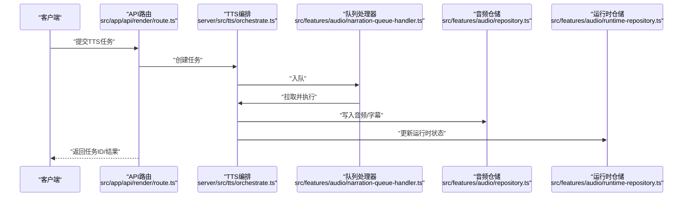

**图示来源**
- [src/app/api/render/route.ts](file://src/app/api/render/route.ts)
- [server/src/tts/orchestrate.ts](file://server/src/tts/orchestrate.ts)
- [src/features/audio/narration-queue-handler.ts](file://src/features/audio/narration-queue-handler.ts)
- [src/features/audio/repository.ts](file://src/features/audio/repository.ts)
- [src/features/audio/runtime-repository.ts](file://src/features/audio/runtime-repository.ts)

**章节来源**
- [server/src/tts/orchestrate.ts](file://server/src/tts/orchestrate.ts)
- [src/features/audio/narration-queue-handler.ts](file://src/features/audio/narration-queue-handler.ts)
- [src/features/audio/repository.ts](file://src/features/audio/repository.ts)
- [src/features/audio/runtime-repository.ts](file://src/features/audio/runtime-repository.ts)

### 渲染与导出
- 职责：媒体组装、帧捕获、转码、缩略图生成与导出，支持QA检查与降级。
- 关键模块：
  - 导出服务：编排渲染步骤、管理资源与缓存。
  - 渲染器：执行具体编码与媒体处理。
  - 仓储：持久化渲染产物与元数据。

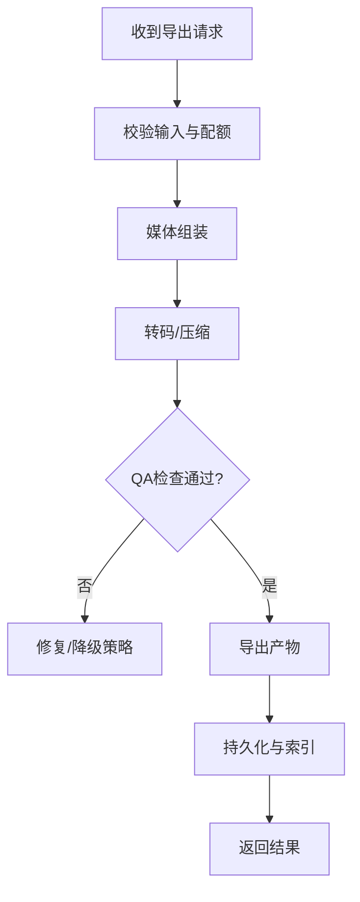

**图示来源**
- [src/features/render/export-service.ts](file://src/features/render/export-service.ts)
- [src/features/render/renderer.ts](file://src/features/render/renderer.ts)

**章节来源**
- [src/features/render/export-service.ts](file://src/features/render/export-service.ts)
- [src/features/render/renderer.ts](file://src/features/render/renderer.ts)

### 采集代理
- 职责：通过浏览器驱动或AI代理抓取网页内容，结构化输出供后续处理。
- 关键模块：
  - AI采集代理：结合LLM进行内容抽取与清洗。
  - 浏览器驱动：使用Playwright等工具模拟交互。

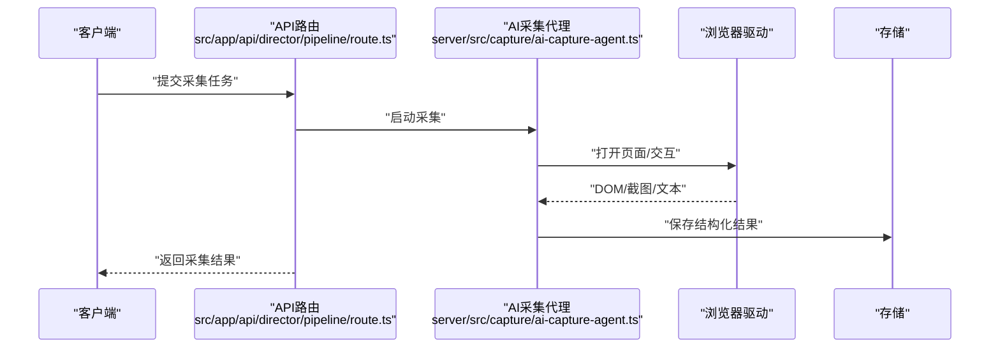

**图示来源**
- [src/app/api/director/pipeline/route.ts](file://src/app/api/director/pipeline/route.ts)
- [server/src/capture/ai-capture-agent.ts](file://server/src/capture/ai-capture-agent.ts)

**章节来源**
- [server/src/capture/ai-capture-agent.ts](file://server/src/capture/ai-capture-agent.ts)

## 依赖关系分析
- 前端依赖Next.js生态，通过API路由与服务端通信。
- 服务端依赖作业调度、存储抽象与外部AI/TTS/渲染服务。
- **新增** AI托管服务层依赖凭据管理、成本计量、回退机制、路由解析、模型目录仓库和视觉执行器。
- 部署依赖Docker与反向代理，确保网络与安全边界。

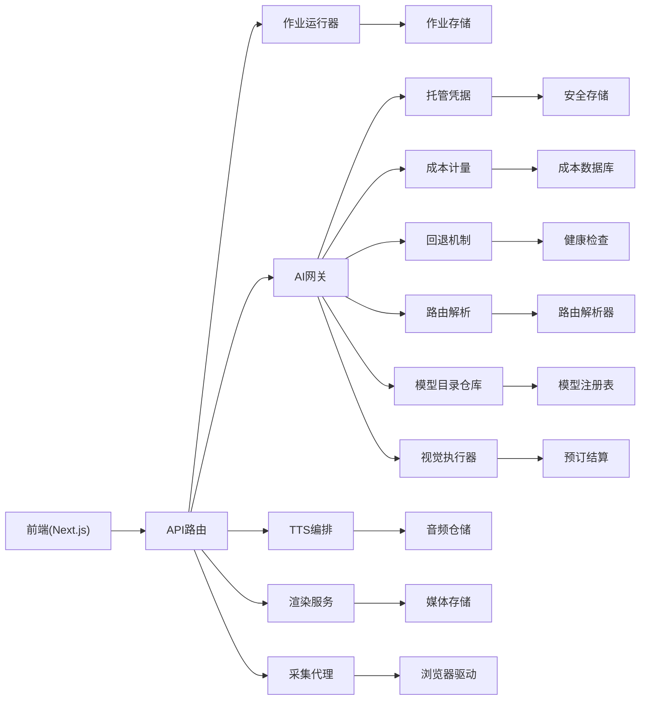

**图示来源**
- [server/src/server/job-runner.ts](file://server/src/server/job-runner.ts)
- [server/src/server/job-store.ts](file://server/src/server/job-store.ts)
- [src/features/ai/managed-gateway.ts](file://src/features/ai/managed-gateway.ts)
- [src/features/ai/managed-credentials.ts](file://src/features/ai/managed-credentials.ts)
- [src/features/ai/managed-service.ts](file://src/features/ai/managed-service.ts)
- [src/features/ai/managed-fallback.ts](file://src/features/ai/managed-fallback.ts)
- [src/features/ai/model-routing.ts](file://src/features/ai/model-routing.ts)
- [src/features/ai/managed-model-catalog-repository.ts](file://src/features/ai/managed-model-catalog-repository.ts)
- [src/features/ai/managed-vision-executor.ts](file://src/features/ai/managed-vision-executor.ts)
- [server/src/tts/orchestrate.ts](file://server/src/tts/orchestrate.ts)
- [src/features/render/export-service.ts](file://src/features/render/export-service.ts)
- [server/src/capture/ai-capture-agent.ts](file://server/src/capture/ai-capture-agent.ts)

**章节来源**
- [server/package.json](file://server/package.json)
- [server/tsconfig.json](file://server/tsconfig.json)
- [server/Dockerfile](file://server/Dockerfile)

## 性能考量
- 作业并发与限流：通过运行器控制并发度，避免资源争用与下游过载。
- 缓存与去重：对渲染与TTS结果进行缓存，减少重复计算。
- 异步与批处理：队列化处理批量任务，提升吞吐。
- 降级与重试：对不稳定提供商实施自动重试与降级策略。
- I/O优化：媒体处理采用流式与分块，降低内存峰值。
- **新增** 凭据缓存：缓存已验证的凭据，减少解密开销。
- **新增** 成本预检：在调用前检查预算限制，避免不必要的API调用。
- **新增** 健康检查缓存：缓存提供商健康状态，减少探测频率。
- **新增** 路由解析缓存：缓存路由解析结果，提升响应速度。
- **重要新增** 模型目录缓存：缓存模型元数据和可用性状态，减少查询开销。
- **重要新增** 提供商设置投影缓存：缓存提供商配置投影结果，提升配置处理效率。
- **新增** 视觉任务缓存：缓存视觉处理结果，减少重复计算。
- **新增** 预订结算优化：通过改进的资源管理机制，提升资源利用效率。

## 故障排查指南
- 日志与诊断：启用结构化日志，记录作业生命周期、错误堆栈与指标。
- 健康检查：提供健康探针与就绪检查，便于负载均衡与健康监控。
- 配置校验：启动时校验环境变量与提供商凭证，提前发现配置错误。
- 依赖探测：对下游服务进行连通性测试与超时控制。
- **新增** 凭据验证：定期检查托管凭据的有效性和过期时间。
- **新增** 成本监控：设置成本阈值告警，及时发现异常使用情况。
- **新增** 回退日志：记录提供商切换和健康状态变化，便于问题定位。
- **新增** 路由调试：记录路由解析过程和消费模式选择，便于接口兼容性排查。
- **重要新增** 模型目录监控：监控模型可用性和版本状态，及时发现模型问题。
- **重要新增** 提供商设置投影调试：记录配置投影过程，便于配置问题排查。
- **新增** 视觉执行器监控：监控视觉任务执行状态和资源使用情况。
- **新增** 预订结算监控：监控资源结算情况和异常事件。

**章节来源**
- [server/src/lib/logger.ts](file://server/src/lib/logger.ts)
- [server/src/lib/load-env.ts](file://server/src/lib/load-env.ts)

## 结论
该AI托管服务通过统一网关、作业调度与领域服务分层，实现了多提供商接入、稳定编排与高效渲染/TTS能力。**新增的统一AI托管服务层**进一步增强了系统的可靠性、安全性和成本控制能力，通过集中化的凭据管理、成本计量、智能回退、路由解析、模型目录管理和视觉执行能力，为StepFun、MiMo和Gemini等服务提供了更好的稳定性和经济性。**新增的视觉执行器**专门处理视觉AI操作，通过改进的预订结算机制优化资源使用。**最新的路由解析功能和模型目录仓库**确保了与新凭据消费模式的兼容性，提升了系统的灵活性和可扩展性。**重要更新的提供商设置投影逻辑和增强的降级机制**显著提升了系统的健壮性和可维护性。配合容器化与反向代理，具备良好可扩展性与可运维性。建议持续完善监控告警、容量规划与成本治理，以提升整体稳定性与经济性。

## 附录
- 开发环境与生产环境编排：参考 docker-compose 文件与反向代理配置。
- 数据库迁移与初始化：参考 drizzle 配置与脚本。
- 安全与认证：参考认证相关API与凭据管理模块。
- **新增** AI服务配置：参考AI托管服务的配置选项和环境变量。
- **新增** 成本管理：参考成本计量和预算控制的配置方法。
- **新增** 路由配置：参考路由解析和凭据消费模式的配置方法。
- **重要新增** 模型目录配置：参考模型目录仓库的配置和模型注册方法。
- **重要新增** 提供商设置投影：参考提供商配置投影逻辑和自定义配置方法。
- **新增** 视觉执行器配置：参考视觉AI操作的相关配置和参数设置。
- **新增** 预订结算配置：参考资源管理和成本控制的配置方法。

**章节来源**
- [docker-compose.dev.yml](file://docker-compose.dev.yml)
- [docker-compose.prod.yml](file://docker-compose.prod.yml)
- [deploy/reverse-proxy/entrypoint.sh](file://deploy/reverse-proxy/entrypoint.sh)
- [drizzle.config.ts](file://drizzle.config.ts)