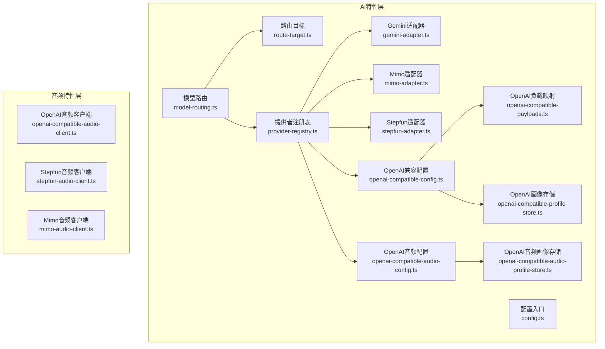
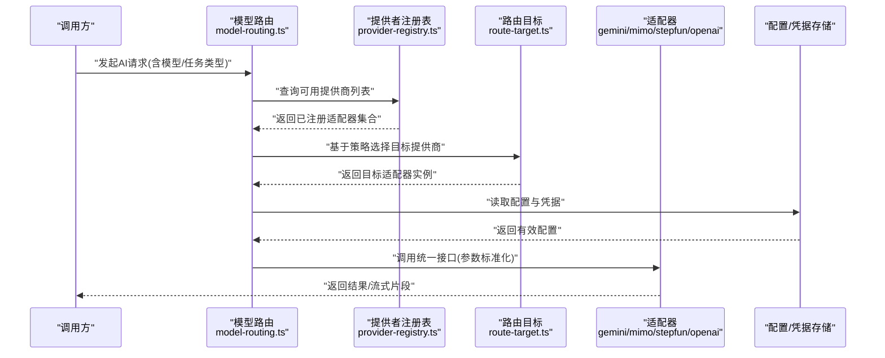
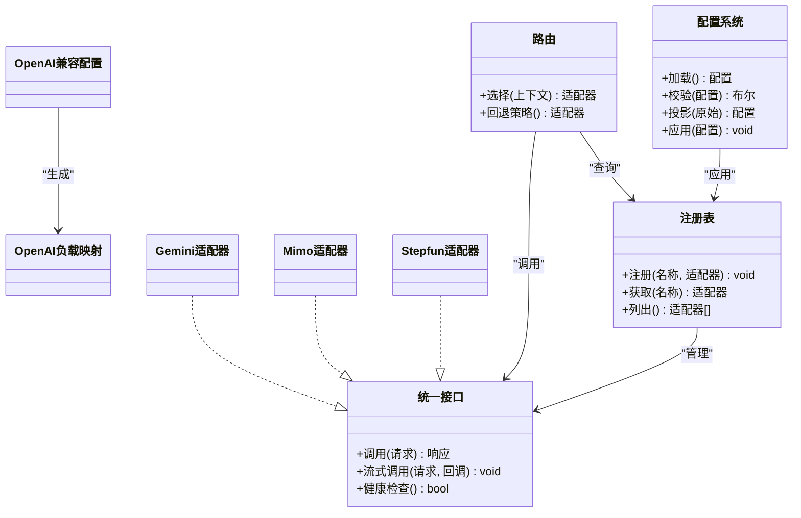

# AI系统集成

<cite>
**本文引用的文件**   
- [src/features/ai/index.ts](file://src/features/ai/index.ts)
- [src/features/ai/provider-registry.ts](file://src/features/ai/provider-registry.ts)
- [src/features/ai/model-routing.ts](file://src/features/ai/model-routing.ts)
- [src/features/ai/route-target.ts](file://src/features/ai/route-target.ts)
- [src/features/ai/gemini-adapter.ts](file://src/features/ai/gemini-adapter.ts)
- [src/features/ai/mimo-adapter.ts](file://src/features/ai/mimo-adapter.ts)
- [src/features/ai/stepfun-adapter.ts](file://src/features/ai/stepfun-adapter.ts)
- [src/features/ai/openai-compatible-config.ts](file://src/features/ai/openai-compatible-config.ts)
- [src/features/ai/openai-compatible-payloads.ts](file://src/features/ai/openai-compatible-payloads.ts)
- [src/features/ai/openai-compatible-audio-config.ts](file://src/features/ai/openai-compatible-audio-config.ts)
- [src/features/ai/openai-compatible-profile-store.ts](file://src/features/ai/openai-compatible-profile-store.ts)
- [src/features/ai/openai-compatible-audio-profile-store.ts](file://src/features/ai/openai-compatible-audio-profile-store.ts)
- [src/features/ai/config.ts](file://src/features/ai/config.ts)
- [src/features/ai/provider-settings-contract.ts](file://src/features/ai/provider-settings-contract.ts)
- [src/features/ai/provider-settings-validation.ts](file://src/features/ai/provider-settings-validation.ts)
- [src/features/ai/provider-settings-projection.ts](file://src/features/ai/provider-settings-projection.ts)
- [src/features/ai/provider-settings-dependencies.ts](file://src/features/ai/provider-settings-dependencies.ts)
- [src/features/ai/provider-settings-apply.ts](file://src/features/ai/provider-settings-apply.ts)
- [src/features/ai/route-provider-defaults.ts](file://src/features/ai/route-provider-defaults.ts)
- [src/features/ai/route-contract-error.ts](file://src/features/ai/route-contract-error.ts)
- [src/features/audio/openai-compatible-audio-client.ts](file://src/features/audio/openai-compatible-audio-client.ts)
- [src/features/audio/stepfun-audio-client.ts](file://src/features/audio/stepfun-audio-client.ts)
- [src/features/audio/mimo-audio-client.ts](file://src/features/audio/mimo-audio-client.ts)
</cite>

## 目录
1. [简介](#简介)
2. [项目结构](#项目结构)
3. [核心组件](#核心组件)
4. [架构总览](#架构总览)
5. [详细组件分析](#详细组件分析)
6. [依赖关系分析](#依赖关系分析)
7. [性能考虑](#性能考虑)
8. [故障排查指南](#故障排查指南)
9. [结论](#结论)
10. [附录](#附录)

## 简介
本文件面向PurpleInk的AI集成子系统，系统性阐述Provider模式的设计与实现，包括统一的AI服务接口抽象、动态插件式注册机制、适配器设计以及配置管理。文档覆盖Gemini、Mimo、Stepfun与OpenAI兼容API等提供商的具体实现要点，解释凭据与路由策略的配置方式，说明错误处理与重试、超时、降级与熔断策略，并给出性能优化建议（缓存、批量、连接池）与扩展新提供商的开发指南。

## 项目结构
AI能力集中在src/features/ai目录下，围绕“统一接口 + 注册表 + 路由 + 适配器”的组织方式展开；音频相关能力在src/features/audio中，提供各提供商的音频客户端实现。配置与设置应用逻辑分布在provider-settings-*系列文件中，确保配置的校验、投影与应用流程清晰可控。

图表来源
- [src/features/ai/provider-registry.ts](file://src/features/ai/provider-registry.ts)
- [src/features/ai/model-routing.ts](file://src/features/ai/model-routing.ts)
- [src/features/ai/route-target.ts](file://src/features/ai/route-target.ts)
- [src/features/ai/gemini-adapter.ts](file://src/features/ai/gemini-adapter.ts)
- [src/features/ai/mimo-adapter.ts](file://src/features/ai/mimo-adapter.ts)
- [src/features/ai/stepfun-adapter.ts](file://src/features/ai/stepfun-adapter.ts)
- [src/features/ai/openai-compatible-config.ts](file://src/features/ai/openai-compatible-config.ts)
- [src/features/ai/openai-compatible-payloads.ts](file://src/features/ai/openai-compatible-payloads.ts)
- [src/features/ai/openai-compatible-audio-config.ts](file://src/features/ai/openai-compatible-audio-config.ts)
- [src/features/ai/openai-compatible-profile-store.ts](file://src/features/ai/openai-compatible-profile-store.ts)
- [src/features/ai/openai-compatible-audio-profile-store.ts](file://src/features/ai/openai-compatible-audio-profile-store.ts)
- [src/features/audio/openai-compatible-audio-client.ts](file://src/features/audio/openai-compatible-audio-client.ts)
- [src/features/audio/stepfun-audio-client.ts](file://src/features/audio/stepfun-audio-client.ts)
- [src/features/audio/mimo-audio-client.ts](file://src/features/audio/mimo-audio-client.ts)

章节来源
- [src/features/ai/index.ts](file://src/features/ai/index.ts)
- [src/features/ai/provider-registry.ts](file://src/features/ai/provider-registry.ts)
- [src/features/ai/model-routing.ts](file://src/features/ai/model-routing.ts)
- [src/features/ai/route-target.ts](file://src/features/ai/route-target.ts)

## 核心组件
- 统一接口抽象：定义跨提供商一致的调用契约，屏蔽底层差异，便于上层编排与路由。
- 提供者注册表：集中管理所有AI提供商的注册、发现与生命周期，支持动态加载与热插拔。
- 模型路由：根据请求上下文、权重或健康状态选择具体提供商实例，实现多活与负载均衡。
- 适配器：将统一接口适配到各提供商的SDK/HTTP API，负责参数转换、流式响应与错误归一化。
- 配置系统：对提供商配置进行校验、投影与合并，支持占位符替换与凭据注入。
- 音频客户端：为文本转语音等场景提供各提供商的专用客户端实现。

章节来源
- [src/features/ai/provider-registry.ts](file://src/features/ai/provider-registry.ts)
- [src/features/ai/model-routing.ts](file://src/features/ai/model-routing.ts)
- [src/features/ai/config.ts](file://src/features/ai/config.ts)
- [src/features/ai/provider-settings-contract.ts](file://src/features/ai/provider-settings-contract.ts)
- [src/features/ai/provider-settings-validation.ts](file://src/features/ai/provider-settings-validation.ts)
- [src/features/ai/provider-settings-projection.ts](file://src/features/ai/provider-settings-projection.ts)
- [src/features/ai/provider-settings-dependencies.ts](file://src/features/ai/provider-settings-dependencies.ts)
- [src/features/ai/provider-settings-apply.ts](file://src/features/ai/provider-settings-apply.ts)

## 架构总览
下图展示了从请求进入路由到最终调用具体提供商适配器的完整流程，以及配置与凭据的装配过程。

图表来源
- [src/features/ai/model-routing.ts](file://src/features/ai/model-routing.ts)
- [src/features/ai/provider-registry.ts](file://src/features/ai/provider-registry.ts)
- [src/features/ai/route-target.ts](file://src/features/ai/route-target.ts)
- [src/features/ai/config.ts](file://src/features/ai/config.ts)

## 详细组件分析

### Provider注册表与动态插件机制
- 职责：维护提供商名称到适配器实现的映射，支持运行时注册与卸载，提供按名称或条件查找的能力。
- 关键点：
  - 注册时进行基础校验（名称唯一性、必填字段）。
  - 支持懒初始化，按需创建适配器实例以节省资源。
  - 暴露健康检查与统计钩子，供路由与健康监控使用。
- 扩展点：新增提供商只需实现统一接口并按约定注册即可。

章节来源
- [src/features/ai/provider-registry.ts](file://src/features/ai/provider-registry.ts)

### 模型路由与路由目标
- 职责：根据请求上下文（模型名、任务类型、租户/项目标识、质量要求）选择最佳提供商实例。
- 策略：
  - 默认策略：按优先级与权重选择。
  - 健康感知：剔除不可用或超时的提供商。
  - 回退策略：主备切换与降级路径。
- 目标解析：将高层路由决策落地为具体适配器实例与调用参数。

章节来源
- [src/features/ai/model-routing.ts](file://src/features/ai/model-routing.ts)
- [src/features/ai/route-target.ts](file://src/features/ai/route-target.ts)

### 适配器设计（Gemini / Mimo / Stepfun / OpenAI兼容）
- 统一接口：定义输入输出、流式回调、错误码与重试语义，屏蔽各厂商差异。
- Gemini适配器：
  - 负责文本生成/对话/工具调用等任务的适配。
  - 处理模型参数映射、安全阈值与速率限制。
- Mimo适配器：
  - 针对Mimo的API规范进行参数转换与响应解析。
  - 处理媒体相关的元数据与格式约束。
- Stepfun适配器：
  - 适配Stepfun的文本/音频能力，封装鉴权与分页。
- OpenAI兼容：
  - 通用OpenAI风格API的适配层，包含负载构造、流式SSE处理与错误归一化。
  - 通过配置文件驱动端点、密钥、模型映射与功能开关。

章节来源
- [src/features/ai/gemini-adapter.ts](file://src/features/ai/gemini-adapter.ts)
- [src/features/ai/mimo-adapter.ts](file://src/features/ai/mimo-adapter.ts)
- [src/features/ai/stepfun-adapter.ts](file://src/features/ai/stepfun-adapter.ts)
- [src/features/ai/openai-compatible-config.ts](file://src/features/ai/openai-compatible-config.ts)
- [src/features/ai/openai-compatible-payloads.ts](file://src/features/ai/openai-compatible-payloads.ts)

### 配置管理与凭据管理
- 配置入口：集中加载环境变量与配置文件，提供强类型访问器。
- 设置合同：定义各提供商设置的字段、类型与约束。
- 校验与投影：对原始配置进行合法性校验、缺失值填充与字段投影，形成运行时可用配置。
- 依赖注入：将凭据、代理、超时等外部依赖注入到适配器实例。
- 应用流程：校验通过后，将配置应用到注册表中的适配器实例，使其生效。

章节来源
- [src/features/ai/config.ts](file://src/features/ai/config.ts)
- [src/features/ai/provider-settings-contract.ts](file://src/features/ai/provider-settings-contract.ts)
- [src/features/ai/provider-settings-validation.ts](file://src/features/ai/provider-settings-validation.ts)
- [src/features/ai/provider-settings-projection.ts](file://src/features/ai/provider-settings-projection.ts)
- [src/features/ai/provider-settings-dependencies.ts](file://src/features/ai/provider-settings-dependencies.ts)
- [src/features/ai/provider-settings-apply.ts](file://src/features/ai/provider-settings-apply.ts)

### 音频客户端（TTS/ASR等）
- OpenAI兼容音频客户端：遵循OpenAI音频API规范，支持流式与非流式合成，自动重试与错误分类。
- Stepfun音频客户端：封装Stepfun音频能力，处理鉴权、分片与进度上报。
- Mimo音频客户端：适配Mimo音频接口，处理媒体格式与元数据。

章节来源
- [src/features/audio/openai-compatible-audio-client.ts](file://src/features/audio/openai-compatible-audio-client.ts)
- [src/features/audio/stepfun-audio-client.ts](file://src/features/audio/stepfun-audio-client.ts)
- [src/features/audio/mimo-audio-client.ts](file://src/features/audio/mimo-audio-client.ts)

### OpenAI兼容画像与配置存储
- 画像存储：用于缓存不同模型的调用画像（如延迟、成功率、成本），辅助路由与限流。
- 音频画像存储：专门记录音频任务的画像指标，支撑音频路由与配额控制。
- 配置驱动：通过配置文件声明模型到画像键的映射，支持动态更新。

章节来源
- [src/features/ai/openai-compatible-profile-store.ts](file://src/features/ai/openai-compatible-profile-store.ts)
- [src/features/ai/openai-compatible-audio-profile-store.ts](file://src/features/ai/openai-compatible-audio-profile-store.ts)
- [src/features/ai/openai-compatible-config.ts](file://src/features/ai/openai-compatible-config.ts)

## 依赖关系分析
- 低耦合高内聚：适配器仅依赖统一接口与配置，不直接耦合上层业务。
- 路由解耦：路由模块只依赖注册表与目标解析，不关心具体实现细节。
- 配置独立：配置系统通过校验与投影产出纯净配置，避免污染适配器。
- 外部依赖：HTTP客户端、日志、队列与数据库由基础设施层提供，适配器通过依赖注入获取。

图表来源
- [src/features/ai/provider-registry.ts](file://src/features/ai/provider-registry.ts)
- [src/features/ai/model-routing.ts](file://src/features/ai/model-routing.ts)
- [src/features/ai/gemini-adapter.ts](file://src/features/ai/gemini-adapter.ts)
- [src/features/ai/mimo-adapter.ts](file://src/features/ai/mimo-adapter.ts)
- [src/features/ai/stepfun-adapter.ts](file://src/features/ai/stepfun-adapter.ts)
- [src/features/ai/openai-compatible-config.ts](file://src/features/ai/openai-compatible-config.ts)
- [src/features/ai/openai-compatible-payloads.ts](file://src/features/ai/openai-compatible-payloads.ts)

章节来源
- [src/features/ai/provider-registry.ts](file://src/features/ai/provider-registry.ts)
- [src/features/ai/model-routing.ts](file://src/features/ai/model-routing.ts)
- [src/features/ai/openai-compatible-config.ts](file://src/features/ai/openai-compatible-config.ts)

## 性能考虑
- 请求缓存：对幂等请求启用短期缓存（内存/Redis），降低重复调用成本。
- 批量处理：聚合多个短任务为批量请求，减少握手与序列化开销。
- 连接池：复用HTTP连接，合理设置最大并发与空闲回收策略。
- 流式处理：优先使用流式响应，降低首字节延迟与内存峰值。
- 画像驱动：基于历史画像动态调整路由权重与限流阈值。
- 背压与限流：在适配器层实现令牌桶或滑动窗口限流，保护下游服务。

[本节为通用指导，不直接分析具体文件]

## 故障排查指南
- 常见错误分类：
  - 网络类：超时、DNS失败、连接拒绝。
  - 协议类：状态码非2xx、JSON解析失败、字段缺失。
  - 业务类：配额不足、模型不可用、内容审核拦截。
- 重试与退避：
  - 可重试错误（如5xx、限流）采用指数退避与抖动。
  - 不可重试错误（如4xx、参数错误）立即失败并记录诊断信息。
- 降级与熔断：
  - 当某提供商连续失败超过阈值，触发熔断，切换到备用提供商。
  - 熔断恢复后逐步放量验证健康度。
- 诊断与观测：
  - 记录关键指标：QPS、P95/P99延迟、错误率、熔断状态。
  - 追踪链路ID，关联上下游日志。

章节来源
- [src/features/ai/route-contract-error.ts](file://src/features/ai/route-contract-error.ts)
- [src/features/ai/route-provider-defaults.ts](file://src/features/ai/route-provider-defaults.ts)

## 结论
PurpleInk的AI集成通过Provider模式实现了高度可扩展与可维护的架构。统一接口与注册表解耦了业务与实现，路由与配置系统提供了灵活的控制面。结合适配器设计与音频客户端，系统能够平滑接入多种AI服务提供商，并通过完善的错误处理、重试与熔断机制保障稳定性。建议在扩展新提供商时严格遵循统一接口与配置校验流程，充分利用画像与路由策略提升整体性能与可靠性。

## 附录

### 扩展新AI提供商开发指南
- 步骤概览：
  1. 实现统一接口：定义调用、流式与健康的标准方法。
  2. 编写适配器：完成参数映射、响应解析与错误归一化。
  3. 注册提供商：在注册表中按名称注册适配器实例。
  4. 配置与凭据：在配置系统中声明字段，完成校验与投影。
  5. 路由策略：为新提供商设置默认权重与回退顺序。
  6. 测试与观测：补充单元测试与集成测试，接入指标与日志。
- 最佳实践：
  - 保持适配器无状态，依赖通过注入提供。
  - 明确区分可重试与不可重试错误。
  - 使用流式接口以降低延迟与内存占用。
  - 利用画像存储持续优化路由与限流策略。

章节来源
- [src/features/ai/provider-registry.ts](file://src/features/ai/provider-registry.ts)
- [src/features/ai/config.ts](file://src/features/ai/config.ts)
- [src/features/ai/provider-settings-contract.ts](file://src/features/ai/provider-settings-contract.ts)
- [src/features/ai/provider-settings-validation.ts](file://src/features/ai/provider-settings-validation.ts)
- [src/features/ai/provider-settings-projection.ts](file://src/features/ai/provider-settings-projection.ts)
- [src/features/ai/provider-settings-dependencies.ts](file://src/features/ai/provider-settings-dependencies.ts)
- [src/features/ai/provider-settings-apply.ts](file://src/features/ai/provider-settings-apply.ts)
- [src/features/ai/model-routing.ts](file://src/features/ai/model-routing.ts)
- [src/features/ai/route-target.ts](file://src/features/ai/route-target.ts)