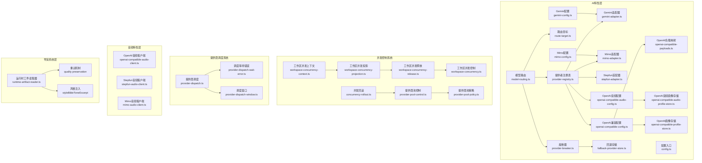
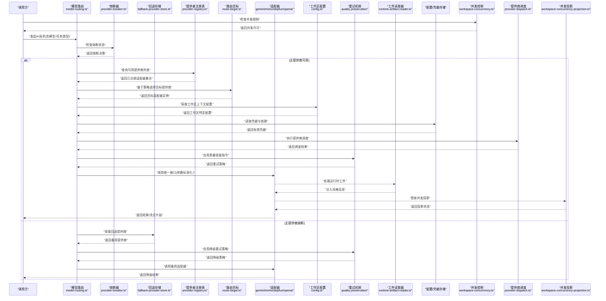
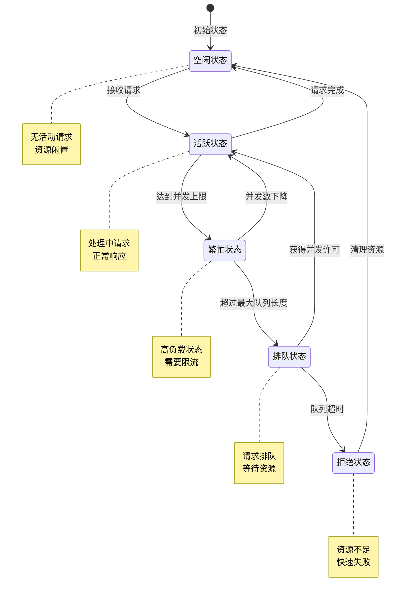
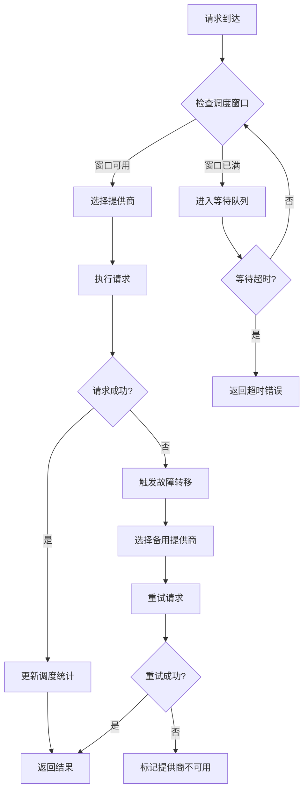
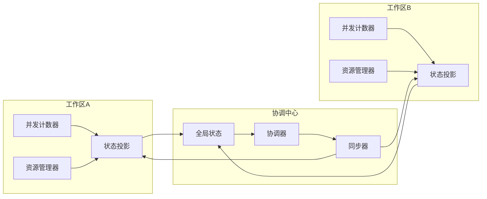
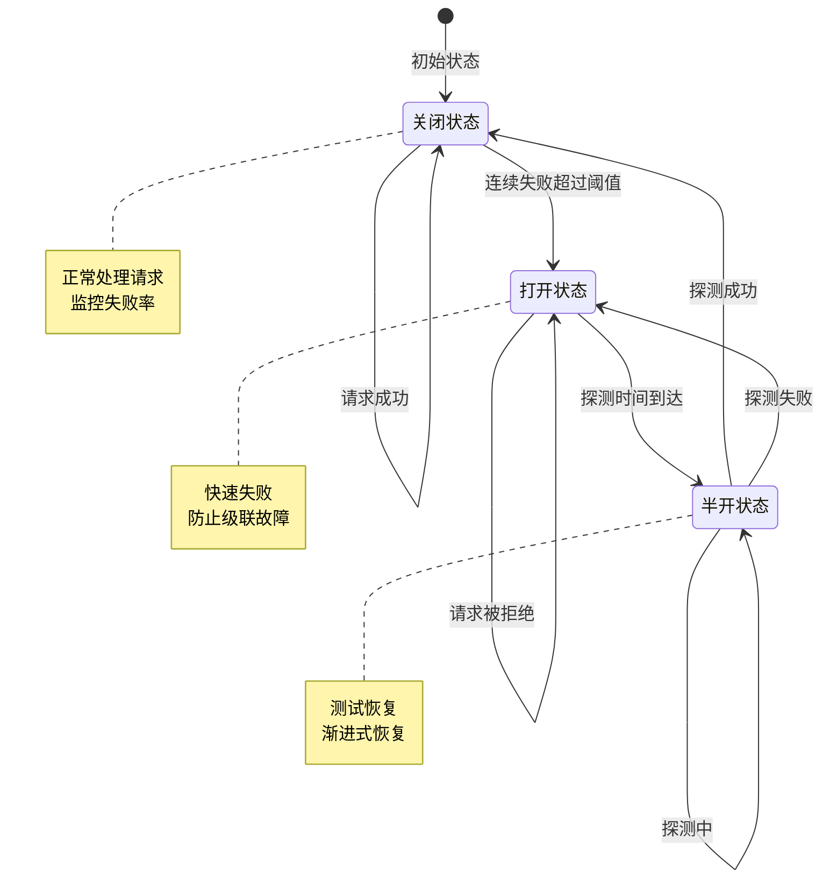
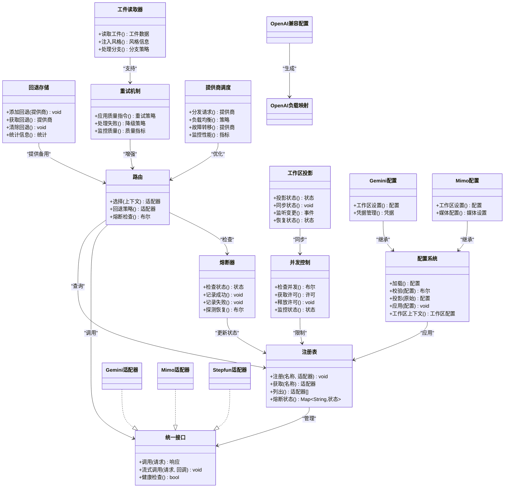

# AI系统集成

<cite>
**本文引用的文件**   
- [src/features/ai/index.ts](file://src/features/ai/index.ts)
- [src/features/ai/provider-registry.ts](file://src/features/ai/provider-registry.ts)
- [src/features/ai/model-routing.ts](file://src/features/ai/model-routing.ts)
- [src/features/ai/route-target.ts](file://src/features/ai/route-target.ts)
- [src/features/ai/gemini-adapter.ts](file://src/features/ai/gemini-adapter.ts)
- [src/features/ai/mimo-adapter.ts](file://src/features/ai/mimo-adapter.ts)
- [src/features/ai/stepfun-adapter.ts](file://src/features/ai/stepfun-adapter.ts)
- [src/features/ai/openai-compatible-config.ts](file://src/features/ai/openai-compatible-config.ts)
- [src/features/ai/openai-compatible-payloads.ts](file://src/features/ai/openai-compatible-payloads.ts)
- [src/features/ai/openai-compatible-audio-config.ts](file://src/features/ai/openai-compatible-audio-config.ts)
- [src/features/ai/openai-compatible-profile-store.ts](file://src/features/ai/openai-compatible-profile-store.ts)
- [src/features/ai/openai-compatible-audio-profile-store.ts](file://src/features/ai/openai-compatible-audio-profile-store.ts)
- [src/features/ai/config.ts](file://src/features/ai/config.ts)
- [src/features/ai/gemini-config.ts](file://src/features/ai/gemini-config.ts)
- [src/features/ai/mimo-config.ts](file://src/features/ai/mimo-config.ts)
- [src/features/ai/provider-settings-contract.ts](file://src/features/ai/provider-settings-contract.ts)
- [src/features/ai/provider-settings-validation.ts](file://src/features/ai/provider-settings-validation.ts)
- [src/features/ai/provider-settings-projection.ts](file://src/features/ai/provider-settings-projection.ts)
- [src/features/ai/provider-settings-dependencies.ts](file://src/features/ai/provider-settings-dependencies.ts)
- [src/features/ai/provider-settings-apply.ts](file://src/features/ai/provider-settings-apply.ts)
- [src/features/ai/route-provider-defaults.ts](file://src/features/ai/route-provider-defaults.ts)
- [src/features/ai/route-contract-error.ts](file://src/features/ai/route-contract-error.ts)
- [src/features/ai/provider-breaker.ts](file://src/features/ai/provider-breaker.ts)
- [src/features/ai/fallback-provider-store.ts](file://src/features/ai/fallback-provider-store.ts)
- [src/features/audio/openai-compatible-audio-client.ts](file://src/features/audio/openai-compatible-audio-client.ts)
- [src/features/audio/stepfun-audio-client.ts](file://src/features/audio/stepfun-audio-client.ts)
- [src/features/audio/mimo-audio-client.ts](file://src/features/audio/mimo-audio-client.ts)
- [src/features/director/runtime-artifact-reader.ts](file://src/features/director/runtime-artifact-reader.ts)
- [src/features/ai/workspace-concurrency-context.ts](file://src/features/ai/workspace-concurrency-context.ts)
- [src/features/ai/workspace-concurrency-projection.ts](file://src/features/ai/workspace-concurrency-projection.ts)
- [src/features/ai/workspace-concurrency-release.ts](file://src/features/ai/workspace-concurrency-release.ts)
- [src/features/ai/workspace-concurrency.ts](file://src/features/ai/workspace-concurrency.ts)
- [src/features/ai/provider-dispatch-wait-error.ts](file://src/features/ai/provider-dispatch-wait-error.ts)
- [src/features/ai/provider-dispatch-window.ts](file://src/features/ai/provider-dispatch-window.ts)
- [src/features/ai/provider-dispatch.ts](file://src/features/ai/provider-dispatch.ts)
- [src/features/ai/concurrency-rollout.ts](file://src/features/ai/concurrency-rollout.ts)
- [src/features/ai/provider-pool-control.ts](file://src/features/ai/provider-pool-control.ts)
- [src/features/ai/provider-pool-policy.ts](file://src/features/ai/provider-pool-policy.ts)
</cite>

## 更新摘要
**所做更改**   
- 新增并发控制系统，支持工作区级别的并发限制和资源隔离
- 增强提供商调度机制，实现智能请求分发和负载均衡
- 引入工作区并发投影系统，确保跨工作区的状态同步
- 优化提供商池控制策略，提升资源利用率和响应性能
- 改进并发回滚机制，支持渐进式并发能力部署

## 目录
1. [简介](#简介)
2. [项目结构](#项目结构)
3. [核心组件](#核心组件)
4. [架构总览](#架构总览)
5. [详细组件分析](#详细组件分析)
6. [并发控制系统](#并发控制系统)
7. [提供商调度优化](#提供商调度优化)
8. [工作区并发投影系统](#工作区并发投影系统)
9. [熔断器与回退机制](#熔断器与回退机制)
10. [依赖关系分析](#依赖关系分析)
11. [性能考虑](#性能考虑)
12. [故障排查指南](#故障排查指南)
13. [结论](#结论)
14. [附录](#附录)

## 简介
本文件面向PurpleInk的AI集成子系统，系统性阐述Provider模式的设计与实现，包括统一的AI服务接口抽象、动态插件式注册机制、适配器设计以及配置管理。文档覆盖Gemini、Mimo、Stepfun与OpenAI兼容API等提供商的具体实现要点，解释凭据与路由策略的配置方式，说明错误处理与重试、超时、降级与熔断策略，并给出性能优化建议（缓存、批量、连接池）与扩展新提供商的开发指南。

**最新更新**：系统已集成全面的熔断器和回退提供商系统，提供健壮的容错机制和自动故障转移能力，确保在高负载或外部服务异常时系统的稳定性和可用性。新增的工作区并发控制系统和提供商调度优化进一步提升了系统的并发处理能力和资源利用率。工作区并发投影系统确保了多租户环境下的状态同步和数据一致性。

## 项目结构
AI能力集中在src/features/ai目录下，围绕"统一接口 + 注册表 + 路由 + 适配器"的组织方式展开；音频相关能力在src/features/audio中，提供各提供商的音频客户端实现。配置与设置应用逻辑分布在provider-settings-*系列文件中，确保配置的校验、投影与应用流程清晰可控。新增的独立配置文件模块（gemini-config.ts、mimo-config.ts、stepfun-adapter.ts）提供了更细粒度的配置管理能力。

图表来源
- [src/features/ai/provider-registry.ts](file://src/features/ai/provider-registry.ts)
- [src/features/ai/model-routing.ts](file://src/features/ai/model-routing.ts)
- [src/features/ai/route-target.ts](file://src/features/ai/route-target.ts)
- [src/features/ai/provider-breaker.ts](file://src/features/ai/provider-breaker.ts)
- [src/features/ai/fallback-provider-store.ts](file://src/features/ai/fallback-provider-store.ts)
- [src/features/ai/gemini-adapter.ts](file://src/features/ai/gemini-adapter.ts)
- [src/features/ai/mimo-adapter.ts](file://src/features/ai/mimo-adapter.ts)
- [src/features/ai/stepfun-adapter.ts](file://src/features/ai/stepfun-adapter.ts)
- [src/features/ai/openai-compatible-config.ts](file://src/features/ai/openai-compatible-config.ts)
- [src/features/ai/openai-compatible-payloads.ts](file://src/features/ai/openai-compatible-payloads.ts)
- [src/features/ai/openai-compatible-audio-config.ts](file://src/features/ai/openai-compatible-audio-config.ts)
- [src/features/ai/openai-compatible-profile-store.ts](file://src/features/ai/openai-compatible-profile-store.ts)
- [src/features/ai/openai-compatible-audio-profile-store.ts](file://src/features/ai/openai-compatible-audio-profile-store.ts)
- [src/features/ai/gemini-config.ts](file://src/features/ai/gemini-config.ts)
- [src/features/ai/mimo-config.ts](file://src/features/ai/mimo-config.ts)
- [src/features/audio/openai-compatible-audio-client.ts](file://src/features/audio/openai-compatible-audio-client.ts)
- [src/features/audio/stepfun-audio-client.ts](file://src/features/audio/stepfun-audio-client.ts)
- [src/features/audio/mimo-audio-client.ts](file://src/features/audio/mimo-audio-client.ts)
- [src/features/director/runtime-artifact-reader.ts](file://src/features/director/runtime-artifact-reader.ts)
- [src/features/ai/workspace-concurrency-context.ts](file://src/features/ai/workspace-concurrency-context.ts)
- [src/features/ai/workspace-concurrency-projection.ts](file://src/features/ai/workspace-concurrency-projection.ts)
- [src/features/ai/workspace-concurrency-release.ts](file://src/features/ai/workspace-concurrency-release.ts)
- [src/features/ai/workspace-concurrency.ts](file://src/features/ai/workspace-concurrency.ts)
- [src/features/ai/provider-dispatch-wait-error.ts](file://src/features/ai/provider-dispatch-wait-error.ts)
- [src/features/ai/provider-dispatch-window.ts](file://src/features/ai/provider-dispatch-window.ts)
- [src/features/ai/provider-dispatch.ts](file://src/features/ai/provider-dispatch.ts)
- [src/features/ai/concurrency-rollout.ts](file://src/features/ai/concurrency-rollout.ts)
- [src/features/ai/provider-pool-control.ts](file://src/features/ai/provider-pool-control.ts)
- [src/features/ai/provider-pool-policy.ts](file://src/features/ai/provider-pool-policy.ts)

章节来源
- [src/features/ai/index.ts](file://src/features/ai/index.ts)
- [src/features/ai/provider-registry.ts](file://src/features/ai/provider-registry.ts)
- [src/features/ai/model-routing.ts](file://src/features/ai/model-routing.ts)
- [src/features/ai/route-target.ts](file://src/features/ai/route-target.ts)

## 核心组件
- 统一接口抽象：定义跨提供商一致的调用契约，屏蔽底层差异，便于上层编排与路由。
- 提供者注册表：集中管理所有AI提供商的注册、发现与生命周期，支持动态加载与热插拔。
- 模型路由：根据请求上下文、权重或健康状态选择具体提供商实例，实现多活与负载均衡。
- 适配器：将统一接口适配到各提供商的SDK/HTTP API，负责参数转换、流式响应与错误归一化。
- 配置系统：对提供商配置进行校验、投影与合并，支持占位符替换与凭据注入，现已集成工作区上下文支持。
- 音频客户端：为文本转语音等场景提供各提供商的专用客户端实现。
- **熔断器**：监控提供商健康状态，在连续失败时自动熔断，防止级联故障。
- **回退机制**：在主提供商不可用时自动切换到备用提供商，确保服务连续性。
- **增强重试机制**：改进的导演系统重试机制，包含质量保留指令，确保输出质量的一致性。
- **风格注入系统**：运行时工件读取器中的styleBibleToneExcerpt注入，提升内容风格一致性。
- **并发控制系统**：工作区级别的并发限制和资源隔离，确保多租户环境下的资源公平分配。
- **提供商调度系统**：智能请求分发和负载均衡，优化资源利用率和响应性能。
- **工作区并发投影系统**：跨工作区的状态同步和数据一致性保证。

**更新**：配置系统现在支持工作区级别的配置隔离，允许不同工作区使用不同的提供商配置和凭据。新增的熔断器和回退机制为系统提供了强大的容错能力。导演系统的重试机制和质量保留指令进一步增强了系统的可靠性。**新增的并发控制系统和工作区并发投影系统显著提升了系统的并发处理能力和多租户支持能力。**

章节来源
- [src/features/ai/provider-registry.ts](file://src/features/ai/provider-registry.ts)
- [src/features/ai/model-routing.ts](file://src/features/ai/model-routing.ts)
- [src/features/ai/config.ts](file://src/features/ai/config.ts)
- [src/features/ai/provider-settings-contract.ts](file://src/features/ai/provider-settings-contract.ts)
- [src/features/ai/provider-settings-validation.ts](file://src/features/ai/provider-settings-validation.ts)
- [src/features/ai/provider-settings-projection.ts](file://src/features/ai/provider-settings-projection.ts)
- [src/features/ai/provider-settings-dependencies.ts](file://src/features/ai/provider-settings-dependencies.ts)
- [src/features/ai/provider-settings-apply.ts](file://src/features/ai/provider-settings-apply.ts)
- [src/features/ai/provider-breaker.ts](file://src/features/ai/provider-breaker.ts)
- [src/features/ai/fallback-provider-store.ts](file://src/features/ai/fallback-provider-store.ts)
- [src/features/director/runtime-artifact-reader.ts](file://src/features/director/runtime-artifact-reader.ts)
- [src/features/ai/workspace-concurrency-context.ts](file://src/features/ai/workspace-concurrency-context.ts)
- [src/features/ai/workspace-concurrency-projection.ts](file://src/features/ai/workspace-concurrency-projection.ts)
- [src/features/ai/provider-dispatch.ts](file://src/features/ai/provider-dispatch.ts)

## 架构总览
下图展示了从请求进入路由到最终调用具体提供商适配器的完整流程，以及配置与凭据的装配过程。新增的工作区上下文机制确保了多租户环境下的配置隔离，熔断器和回退机制提供了健壮的容错保障。导演系统的重试机制和质量保留指令贯穿整个调用链。**新增的并发控制系统和提供商调度系统进一步优化了资源管理和请求分发效率。**

图表来源
- [src/features/ai/model-routing.ts](file://src/features/ai/model-routing.ts)
- [src/features/ai/provider-breaker.ts](file://src/features/ai/provider-breaker.ts)
- [src/features/ai/fallback-provider-store.ts](file://src/features/ai/fallback-provider-store.ts)
- [src/features/ai/provider-registry.ts](file://src/features/ai/provider-registry.ts)
- [src/features/ai/route-target.ts](file://src/features/ai/route-target.ts)
- [src/features/ai/config.ts](file://src/features/ai/config.ts)
- [src/features/director/runtime-artifact-reader.ts](file://src/features/director/runtime-artifact-reader.ts)
- [src/features/ai/workspace-concurrency.ts](file://src/features/ai/workspace-concurrency.ts)
- [src/features/ai/provider-dispatch.ts](file://src/features/ai/provider-dispatch.ts)
- [src/features/ai/workspace-concurrency-projection.ts](file://src/features/ai/workspace-concurrency-projection.ts)

## 详细组件分析

### Provider注册表与动态插件机制
- 职责：维护提供商名称到适配器实现的映射，支持运行时注册与卸载，提供按名称或条件查找的能力。
- 关键点：
  - 注册时进行基础校验（名称唯一性、必填字段）。
  - 支持懒初始化，按需创建适配器实例以节省资源。
  - 暴露健康检查与统计钩子，供路由与健康监控使用。
  - **新增**：支持工作区级别的适配器隔离，不同工作区可使用不同的适配器实例。
  - **增强**：集成熔断器状态监控，实时反映提供商健康度。
  - **优化**：集成并发控制，避免资源竞争和过度消耗。
- 扩展点：新增提供商只需实现统一接口并按约定注册即可。

章节来源
- [src/features/ai/provider-registry.ts](file://src/features/ai/provider-registry.ts)

### 模型路由与路由目标
- 职责：根据请求上下文（模型名、任务类型、租户/项目标识、质量要求）选择最佳提供商实例。
- 策略：
  - 默认策略：按优先级与权重选择。
  - 健康感知：剔除不可用或超时的提供商。
  - 回退策略：主备切换与降级路径。
  - **新增**：工作区感知的路由策略，支持不同工作区的差异化路由规则。
  - **增强**：熔断器集成，自动跳过熔断中的提供商。
  - **优化**：提供商调度集成，实现智能负载均衡。
- 目标解析：将高层路由决策落地为具体适配器实例与调用参数。

章节来源
- [src/features/ai/model-routing.ts](file://src/features/ai/model-routing.ts)
- [src/features/ai/route-target.ts](file://src/features/ai/route-target.ts)

### 适配器设计（Gemini / Mimo / Stepfun / OpenAI兼容）
- 统一接口：定义输入输出、流式回调、错误码与重试语义，屏蔽各厂商差异。
- Gemini适配器：
  - 负责文本生成/对话/工具调用等任务的适配。
  - 处理模型参数映射、安全阈值与速率限制。
  - **更新**：集成了gemini-config.ts中的工作区特定配置。
- Mimo适配器：
  - 针对Mimo的API规范进行参数转换与响应解析。
  - 处理媒体相关的元数据与格式约束。
  - **更新**：通过mimo-config.ts支持工作区级别的配置覆盖。
- Stepfun适配器：
  - 适配Stepfun的文本/音频能力，封装鉴权与分页。
  - **更新**：stepfun-adapter.ts现在支持工作区上下文的凭据管理。
- OpenAI兼容：
  - 通用OpenAI风格API的适配层，包含负载构造、流式SSE处理与错误归一化。
  - 通过配置文件驱动端点、密钥、模型映射与功能开关。

章节来源
- [src/features/ai/gemini-adapter.ts](file://src/features/ai/gemini-adapter.ts)
- [src/features/ai/mimo-adapter.ts](file://src/features/ai/mimo-adapter.ts)
- [src/features/ai/stepfun-adapter.ts](file://src/features/ai/stepfun-adapter.ts)
- [src/features/ai/openai-compatible-config.ts](file://src/features/ai/openai-compatible-config.ts)
- [src/features/ai/openai-compatible-payloads.ts](file://src/features/ai/openai-compatible-payloads.ts)

### 配置管理与凭据管理
- 配置入口：集中加载环境变量与配置文件，提供强类型访问器。
- 设置合同：定义各提供商设置的字段、类型与约束。
- 校验与投影：对原始配置进行合法性校验、缺失值填充与字段投影，形成运行时可用配置。
- 依赖注入：将凭据、代理、超时等外部依赖注入到适配器实例。
- 应用流程：校验通过后，将配置应用到注册表中的适配器实例，使其生效。
- **新增工作区上下文支持**：
  - gemini-config.ts：专门处理Gemini提供商的工作区配置
  - mimo-config.ts：管理Mimo提供商的工作区特定设置
  - stepfun-adapter.ts：集成Stepfun的工作区凭据管理
  - 支持配置继承与覆盖机制

章节来源
- [src/features/ai/config.ts](file://src/features/ai/config.ts)
- [src/features/ai/gemini-config.ts](file://src/features/ai/gemini-config.ts)
- [src/features/ai/mimo-config.ts](file://src/features/ai/mimo-config.ts)
- [src/features/ai/provider-settings-contract.ts](file://src/features/ai/provider-settings-contract.ts)
- [src/features/ai/provider-settings-validation.ts](file://src/features/ai/provider-settings-validation.ts)
- [src/features/ai/provider-settings-projection.ts](file://src/features/ai/provider-settings-projection.ts)
- [src/features/ai/provider-settings-dependencies.ts](file://src/features/ai/provider-settings-dependencies.ts)
- [src/features/ai/provider-settings-apply.ts](file://src/features/ai/provider-settings-apply.ts)

### 音频客户端（TTS/ASR等）
- OpenAI兼容音频客户端：遵循OpenAI音频API规范，支持流式与非流式合成，自动重试与错误分类。
- Stepfun音频客户端：封装Stepfun音频能力，处理鉴权、分片与进度上报。
- Mimo音频客户端：适配Mimo音频接口，处理媒体格式与元数据。

章节来源
- [src/features/audio/openai-compatible-audio-client.ts](file://src/features/audio/openai-compatible-audio-client.ts)
- [src/features/audio/stepfun-audio-client.ts](file://src/features/audio/stepfun-audio-client.ts)
- [src/features/audio/mimo-audio-client.ts](file://src/features/audio/mimo-audio-client.ts)

### OpenAI兼容画像与配置存储
- 画像存储：用于缓存不同模型的调用画像（如延迟、成功率、成本），辅助路由与限流。
- 音频画像存储：专门记录音频任务的画像指标，支撑音频路由与配额控制。
- 配置驱动：通过配置文件声明模型到画像键的映射，支持动态更新。

章节来源
- [src/features/ai/openai-compatible-profile-store.ts](file://src/features/ai/openai-compatible-profile-store.ts)
- [src/features/ai/openai-compatible-audio-profile-store.ts](file://src/features/ai/openai-compatible-audio-profile-store.ts)
- [src/features/ai/openai-compatible-config.ts](file://src/features/ai/openai-compatible-config.ts)

### 运行时工件读取器与风格注入
- **增强功能**：runtime-artifact-reader.ts现在支持styleBibleToneExcerpt注入到评分和音效分支。
- **质量保留**：通过改进的重试机制确保输出质量的一致性。
- **风格一致性**：自动注入风格信息，提升内容生成的风格统一性。
- **智能分支处理**：根据不同分支类型（评分、音效）应用相应的风格注入策略。

**更新**：运行时工件读取器现在能够智能识别和处理不同类型的分支，自动注入相应的风格信息，确保内容生成的一致性和高质量。

章节来源
- [src/features/director/runtime-artifact-reader.ts](file://src/features/director/runtime-artifact-reader.ts)

## 并发控制系统

### 工作区并发上下文管理
工作区并发上下文是并发控制系统的核心组件，负责管理每个工作区的并发限制和资源分配。

- **并发限制**：
  - 基于工作区ID的并发计数
  - 可配置的并发上限和阈值
  - 动态调整并发限制以适应负载变化
- **资源隔离**：
  - 工作区级别的资源隔离
  - 防止资源竞争和相互干扰
  - 公平的资源共享机制
- **状态同步**：
  - 实时并发状态监控
  - 跨工作区的状态同步
  - 并发状态的持久化和恢复

### 提供商池控制策略
提供商池控制负责管理提供商实例的生命周期和资源分配。

- **池化管理**：
  - 提供商实例的创建、销毁和复用
  - 连接池和线程池的统一管理
  - 资源使用的监控和优化
- **负载均衡**：
  - 智能的请求分发策略
  - 基于性能的动态权重调整
  - 故障检测和自动切换
- **容量规划**：
  - 基于历史数据的容量预测
  - 弹性扩缩容支持
  - 资源使用率的优化

图表来源
- [src/features/ai/workspace-concurrency-context.ts](file://src/features/ai/workspace-concurrency-context.ts)
- [src/features/ai/provider-pool-control.ts](file://src/features/ai/provider-pool-control.ts)
- [src/features/ai/provider-pool-policy.ts](file://src/features/ai/provider-pool-policy.ts)

### 并发回滚机制
并发回滚机制确保在并发控制过程中出现异常时能够快速恢复到稳定状态。

- **回滚触发条件**：
  - 并发控制异常
  - 资源分配失败
  - 状态同步错误
- **回滚策略**：
  - 原子性操作保证
  - 部分回滚支持
  - 状态一致性验证
- **恢复机制**：
  - 自动恢复检测
  - 手动干预支持
  - 恢复过程监控

章节来源
- [src/features/ai/workspace-concurrency-context.ts](file://src/features/ai/workspace-concurrency-context.ts)
- [src/features/ai/provider-pool-control.ts](file://src/features/ai/provider-pool-control.ts)
- [src/features/ai/concurrency-rollout.ts](file://src/features/ai/concurrency-rollout.ts)

## 提供商调度优化

### 智能请求分发
提供商调度系统实现了智能化的请求分发和负载均衡机制。

- **分发策略**：
  - 基于性能的动态选择
  - 健康状态感知的路由
  - 工作区特定的分发规则
- **负载均衡**：
  - 轮询和加权算法
  - 连接池的智能分配
  - 热点请求的分散处理
- **故障转移**：
  - 自动故障检测
  - 无缝故障转移
  - 降级策略执行

### 调度窗口管理
调度窗口管理负责控制请求的处理时间和资源占用。

- **时间窗口**：
  - 请求处理的超时控制
  - 资源占用的时间限制
  - 窗口大小的动态调整
- **资源窗口**：
  - 内存和CPU使用限制
  - 网络带宽的合理分配
  - 存储资源的配额管理
- **并发窗口**：
  - 并发请求的数量控制
  - 长尾请求的优先级管理
  - 紧急请求的快速通道

图表来源
- [src/features/ai/provider-dispatch.ts](file://src/features/ai/provider-dispatch.ts)
- [src/features/ai/provider-dispatch-window.ts](file://src/features/ai/provider-dispatch-window.ts)
- [src/features/ai/provider-dispatch-wait-error.ts](file://src/features/ai/provider-dispatch-wait-error.ts)

章节来源
- [src/features/ai/provider-dispatch.ts](file://src/features/ai/provider-dispatch.ts)
- [src/features/ai/provider-dispatch-window.ts](file://src/features/ai/provider-dispatch-window.ts)
- [src/features/ai/provider-dispatch-wait-error.ts](file://src/features/ai/provider-dispatch-wait-error.ts)

## 工作区并发投影系统

### 并发状态投影
工作区并发投影系统负责维护和同步跨工作区的并发状态。

- **状态投影**：
  - 并发计数的实时投影
  - 资源使用情况的快照
  - 性能指标的聚合计算
- **同步机制**：
  - 分布式锁保证一致性
  - 事件驱动的增量更新
  - 冲突检测和解决策略
- **持久化存储**：
  - 并发状态的持久化
  - 历史数据的归档
  - 状态恢复和重建

### 跨工作区协调
跨工作区协调确保多个工作区之间的并发控制和资源分配协调一致。

- **协调策略**：
  - 全局并发限制
  - 工作区间的资源配额
  - 优先级和抢占机制
- **通信机制**：
  - 工作区间的事件广播
  - 状态变更的通知
  - 协调协议的实现
- **一致性保证**：
  - 最终一致性模型
  - 冲突检测和解决
  - 数据完整性验证

图表来源
- [src/features/ai/workspace-concurrency-projection.ts](file://src/features/ai/workspace-concurrency-projection.ts)
- [src/features/ai/workspace-concurrency-release.ts](file://src/features/ai/workspace-concurrency-release.ts)
- [src/features/ai/workspace-concurrency.ts](file://src/features/ai/workspace-concurrency.ts)

章节来源
- [src/features/ai/workspace-concurrency-projection.ts](file://src/features/ai/workspace-concurrency-projection.ts)
- [src/features/ai/workspace-concurrency-release.ts](file://src/features/ai/workspace-concurrency-release.ts)
- [src/features/ai/workspace-concurrency.ts](file://src/features/ai/workspace-concurrency.ts)

## 熔断器与回退机制

### 熔断器设计
熔断器是系统容错的核心组件，负责监控提供商的健康状态并在检测到持续故障时自动熔断，防止级联故障扩散。

- **熔断状态管理**：
  - 关闭状态（Closed）：正常处理请求，监控失败率
  - 打开状态（Open）：拒绝请求，快速失败，定期探测恢复
  - 半开状态（Half-Open）：允许少量请求测试恢复情况
- **熔断触发条件**：
  - 连续失败次数超过阈值
  - 失败率超过预设百分比
  - 响应时间超过超时阈值
- **熔断恢复策略**：
  - 指数退避探测
  - 渐进式流量恢复
  - 健康检查验证

### 回退提供商系统
回退机制确保在主提供商不可用时自动切换到备用提供商，保证服务的连续性和可用性。

- **回退策略配置**：
  - 优先级排序：定义备用提供商的尝试顺序
  - 条件匹配：根据错误类型选择合适的回退提供商
  - 权重分配：支持加权随机选择多个备用提供商
- **回退执行流程**：
  - 主提供商失败检测
  - 回退提供商选择
  - 降级请求处理
  - 结果返回与监控
- **回退状态持久化**：
  - 回退历史记录
  - 性能指标收集
  - 自动恢复检测

图表来源
- [src/features/ai/provider-breaker.ts](file://src/features/ai/provider-breaker.ts)
- [src/features/ai/fallback-provider-store.ts](file://src/features/ai/fallback-provider-store.ts)

### 熔断器与路由集成
熔断器与模型路由深度集成，在路由决策时考虑熔断状态，避免向熔断中的提供商发送请求。

- **路由时熔断检查**：
  - 在选择目标提供商前检查熔断状态
  - 跳过熔断中的提供商
  - 优先选择健康的备用提供商
- **熔断状态传播**：
  - 熔断状态实时更新到注册表
  - 路由策略动态调整权重
  - 监控指标反映熔断影响
- **自动恢复机制**：
  - 定期探测熔断提供商恢复
  - 逐步恢复流量
  - 监控恢复效果

章节来源
- [src/features/ai/provider-breaker.ts](file://src/features/ai/provider-breaker.ts)
- [src/features/ai/fallback-provider-store.ts](file://src/features/ai/fallback-provider-store.ts)
- [src/features/ai/model-routing.ts](file://src/features/ai/model-routing.ts)

## 依赖关系分析
- 低耦合高内聚：适配器仅依赖统一接口与配置，不直接耦合上层业务。
- 路由解耦：路由模块只依赖注册表与目标解析，不关心具体实现细节。
- 配置独立：配置系统通过校验与投影产出纯净配置，避免污染适配器。
- 外部依赖：HTTP客户端、日志、队列与数据库由基础设施层提供，适配器通过依赖注入获取。
- **新增工作区依赖链**：配置模块现在依赖于工作区上下文，支持动态配置加载。
- **熔断器依赖**：熔断器依赖监控数据和配置，不影响核心业务逻辑。
- **回退机制依赖**：回退存储依赖配置和持久化层，提供可靠的备用提供商管理。
- **重试机制依赖**：导演系统的重试机制依赖质量保留指令和工件读取器。
- **并发控制依赖**：并发控制系统依赖工作区上下文和提供商池管理。
- **调度系统依赖**：提供商调度依赖负载均衡算法和故障检测机制。

图表来源
- [src/features/ai/provider-registry.ts](file://src/features/ai/provider-registry.ts)
- [src/features/ai/model-routing.ts](file://src/features/ai/model-routing.ts)
- [src/features/ai/provider-breaker.ts](file://src/features/ai/provider-breaker.ts)
- [src/features/ai/fallback-provider-store.ts](file://src/features/ai/fallback-provider-store.ts)
- [src/features/ai/gemini-adapter.ts](file://src/features/ai/gemini-adapter.ts)
- [src/features/ai/mimo-adapter.ts](file://src/features/ai/mimo-adapter.ts)
- [src/features/ai/stepfun-adapter.ts](file://src/features/ai/stepfun-adapter.ts)
- [src/features/ai/openai-compatible-config.ts](file://src/features/ai/openai-compatible-config.ts)
- [src/features/ai/openai-compatible-payloads.ts](file://src/features/ai/openai-compatible-payloads.ts)
- [src/features/ai/gemini-config.ts](file://src/features/ai/gemini-config.ts)
- [src/features/ai/mimo-config.ts](file://src/features/ai/mimo-config.ts)
- [src/features/director/runtime-artifact-reader.ts](file://src/features/director/runtime-artifact-reader.ts)
- [src/features/ai/workspace-concurrency-context.ts](file://src/features/ai/workspace-concurrency-context.ts)
- [src/features/ai/provider-dispatch.ts](file://src/features/ai/provider-dispatch.ts)
- [src/features/ai/workspace-concurrency-projection.ts](file://src/features/ai/workspace-concurrency-projection.ts)

章节来源
- [src/features/ai/provider-registry.ts](file://src/features/ai/provider-registry.ts)
- [src/features/ai/model-routing.ts](file://src/features/ai/model-routing.ts)
- [src/features/ai/provider-breaker.ts](file://src/features/ai/provider-breaker.ts)
- [src/features/ai/fallback-provider-store.ts](file://src/features/ai/fallback-provider-store.ts)
- [src/features/ai/openai-compatible-config.ts](file://src/features/ai/openai-compatible-config.ts)

## 性能考虑
- 请求缓存：对幂等请求启用短期缓存（内存/Redis），降低重复调用成本。
- 批量处理：聚合多个短任务为批量请求，减少握手与序列化开销。
- 连接池：复用HTTP连接，合理设置最大并发与空闲回收策略。
- 流式处理：优先使用流式响应，降低首字节延迟与内存峰值。
- 画像驱动：基于历史画像动态调整路由权重与限流阈值。
- 背压与限流：在适配器层实现令牌桶或滑动窗口限流，保护下游服务。
- **新增工作区缓存**：工作区级别的配置缓存，避免重复加载相同配置。
- **熔断器性能优化**：
  - 轻量级状态检查，避免阻塞请求
  - 异步状态更新，减少同步开销
  - 合理的探测间隔，平衡恢复速度与资源消耗
- **回退机制优化**：
  - 预加载备用提供商配置
  - 智能回退选择，减少不必要的切换
  - 回退结果缓存，提升后续请求性能
- **重试机制优化**：
  - 质量保留指令减少无效重试
  - 智能退避策略避免雪崩效应
  - 并行重试提升整体吞吐量
- **工件读取优化**：
  - 缓存风格信息减少重复计算
  - 分支预测优化处理路径
  - 增量更新减少IO开销
- **并发控制优化**：
  - 无锁并发数据结构提升性能
  - 批量操作减少锁竞争
  - 异步处理避免阻塞
- **调度系统优化**：
  - 智能负载均衡算法
  - 缓存热点提供商信息
  - 预取和预连接优化

[本节为通用指导，不直接分析具体文件]

## 故障排查指南
- 常见错误分类：
  - 网络类：超时、DNS失败、连接拒绝。
  - 协议类：状态码非2xx、JSON解析失败、字段缺失。
  - 业务类：配额不足、模型不可用、内容审核拦截。
  - **新增工作区级错误**：配置加载失败、工作区上下文缺失、凭据不匹配。
  - **熔断器错误**：熔断状态异常、探测失败、恢复失败。
  - **回退错误**：回退提供商不可用、回退策略失效、回退状态不一致。
  - **重试错误**：质量保留失败、重试策略冲突、退避策略异常。
  - **工件读取错误**：风格注入失败、分支处理异常、工件格式错误。
  - **并发控制错误**：并发限制异常、资源分配失败、状态同步错误。
  - **调度系统错误**：分发失败、负载均衡异常、故障转移失败。
- 重试与退避：
  - 可重试错误（如5xx、限流）采用指数退避与抖动。
  - 不可重试错误（如4xx、参数错误）立即失败并记录诊断信息。
  - **新增**：质量保留指令确保重试过程中的输出一致性。
- 降级与熔断：
  - 当某提供商连续失败超过阈值，触发熔断，切换到备用提供商。
  - 熔断恢复后逐步放量验证健康度。
  - **新增**：熔断器状态监控，实时查看各提供商熔断状态。
  - **新增**：回退机制日志，跟踪回退决策和执行过程。
  - **新增**：重试机制监控，跟踪重试频率和质量保持效果。
- 诊断与观测：
  - 记录关键指标：QPS、P95/P99延迟、错误率、熔断状态。
  - 追踪链路ID，关联上下游日志。
  - **新增工作区监控**：跟踪不同工作区的配置使用情况与错误分布。
  - **新增熔断监控**：监控熔断触发频率、恢复成功率、回退使用率。
  - **新增回退监控**：跟踪回退提供商的性能表现和可靠性。
  - **新增重试监控**：监控重试成功率、质量保持率、退避效果。
  - **新增工件监控**：跟踪风格注入成功率、分支处理效率。
  - **新增并发监控**：监控并发限制、资源使用率、等待队列长度。
  - **新增调度监控**：监控分发成功率、负载均衡效果、故障转移频率。

章节来源
- [src/features/ai/route-contract-error.ts](file://src/features/ai/route-contract-error.ts)
- [src/features/ai/route-provider-defaults.ts](file://src/features/ai/route-provider-defaults.ts)
- [src/features/ai/provider-breaker.ts](file://src/features/ai/provider-breaker.ts)
- [src/features/ai/fallback-provider-store.ts](file://src/features/ai/fallback-provider-store.ts)
- [src/features/director/runtime-artifact-reader.ts](file://src/features/director/runtime-artifact-reader.ts)
- [src/features/ai/workspace-concurrency-context.ts](file://src/features/ai/workspace-concurrency-context.ts)
- [src/features/ai/provider-dispatch.ts](file://src/features/ai/provider-dispatch.ts)

## 结论
PurpleInk的AI集成通过Provider模式实现了高度可扩展与可维护的架构。统一接口与注册表解耦了业务与实现，路由与配置系统提供了灵活的控制面。结合适配器设计与音频客户端，系统能够平滑接入多种AI服务提供商，并通过完善的错误处理、重试与熔断机制保障稳定性。新增的工作区上下文系统和熔断器回退机制进一步增强了多租户环境下的配置管理能力和系统容错能力。导演系统的重试机制和质量保留指令进一步提升了系统的可靠性和输出质量。**最新的并发控制系统和提供商调度优化显著提升了系统的并发处理能力和资源利用率，工作区并发投影系统确保了多租户环境下的状态同步和数据一致性。**建议在扩展新提供商时严格遵循统一接口与配置校验流程，充分利用画像与路由策略提升整体性能与可靠性。

## 附录

### 扩展新AI提供商开发指南
- 步骤概览：
  1. 实现统一接口：定义调用、流式与健康的标准方法。
  2. 编写适配器：完成参数映射、响应解析与错误归一化。
  3. 创建配置模块：为新提供商创建独立的配置文件（参考gemini-config.ts、mimo-config.ts）。
  4. 注册提供商：在注册表中按名称注册适配器实例。
  5. 配置与凭据：在配置系统中声明字段，完成校验与投影。
  6. 路由策略：为新提供商设置默认权重与回退顺序。
  7. 测试与观测：补充单元测试与集成测试，接入指标与日志。
  8. **新增**：配置熔断器支持，设置合适的熔断阈值和探测策略。
  9. **新增**：配置回退策略，定义备用提供商和切换条件。
  10. **新增**：集成重试机制，配置质量保留指令和退避策略。
  11. **新增**：支持工件读取器，实现风格注入和分支处理。
  12. **新增**：配置并发控制，设置工作区级别的并发限制。
  13. **新增**：集成提供商调度，实现智能负载均衡和故障转移。
  14. **新增**：支持工作区并发投影，确保状态同步和数据一致性。
- 最佳实践：
  - 保持适配器无状态，依赖通过注入提供。
  - 明确区分可重试与不可重试错误。
  - 使用流式接口以降低延迟与内存占用。
  - 利用画像存储持续优化路由与限流策略。
  - **新增**：为新提供商实现工作区级别的配置支持。
  - **新增**：配置合理的熔断阈值，避免误熔断和漏熔断。
  - **新增**：设计健壮的回退策略，确保降级服务质量。
  - **新增**：实现质量保留指令，确保重试过程中的一致性。
  - **新增**：支持工件读取器，实现智能风格注入。
  - **新增**：配置适当的并发限制，避免资源耗尽。
  - **新增**：实现高效的调度策略，提升整体吞吐量。
  - **新增**：支持并发投影，确保多租户环境的正确性。

章节来源
- [src/features/ai/provider-registry.ts](file://src/features/ai/provider-registry.ts)
- [src/features/ai/config.ts](file://src/features/ai/config.ts)
- [src/features/ai/gemini-config.ts](file://src/features/ai/gemini-config.ts)
- [src/features/ai/mimo-config.ts](file://src/features/ai/mimo-config.ts)
- [src/features/ai/provider-settings-contract.ts](file://src/features/ai/provider-settings-contract.ts)
- [src/features/ai/provider-settings-validation.ts](file://src/features/ai/provider-settings-validation.ts)
- [src/features/ai/provider-settings-projection.ts](file://src/features/ai/provider-settings-projection.ts)
- [src/features/ai/provider-settings-dependencies.ts](file://src/features/ai/provider-settings-dependencies.ts)
- [src/features/ai/provider-settings-apply.ts](file://src/features/ai/provider-settings-apply.ts)
- [src/features/ai/model-routing.ts](file://src/features/ai/model-routing.ts)
- [src/features/ai/route-target.ts](file://src/features/ai/route-target.ts)
- [src/features/ai/provider-breaker.ts](file://src/features/ai/provider-breaker.ts)
- [src/features/ai/fallback-provider-store.ts](file://src/features/ai/fallback-provider-store.ts)
- [src/features/director/runtime-artifact-reader.ts](file://src/features/director/runtime-artifact-reader.ts)
- [src/features/ai/workspace-concurrency-context.ts](file://src/features/ai/workspace-concurrency-context.ts)
- [src/features/ai/provider-dispatch.ts](file://src/features/ai/provider-dispatch.ts)
- [src/features/ai/workspace-concurrency-projection.ts](file://src/features/ai/workspace-concurrency-projection.ts)