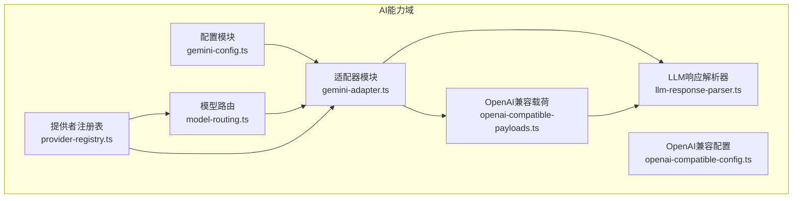
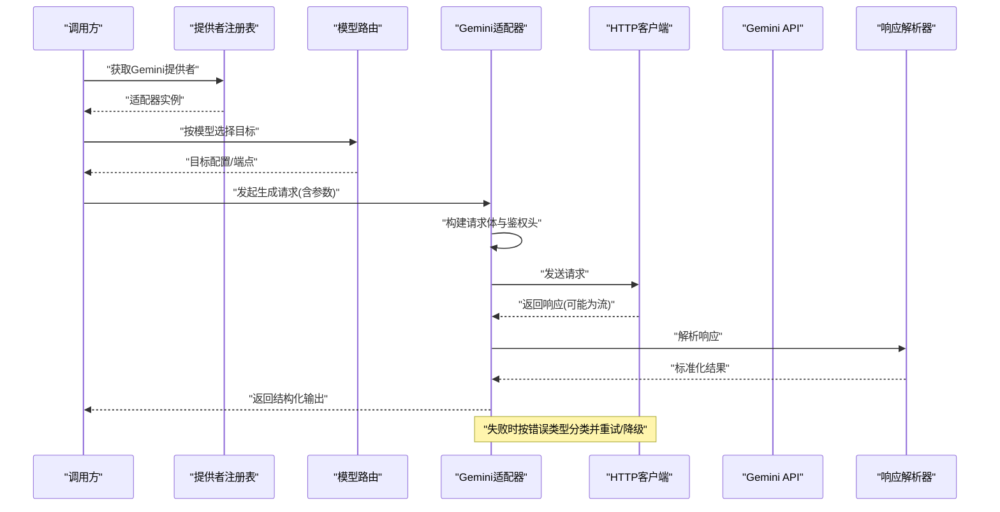
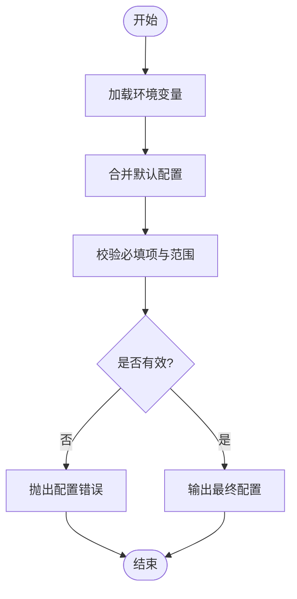
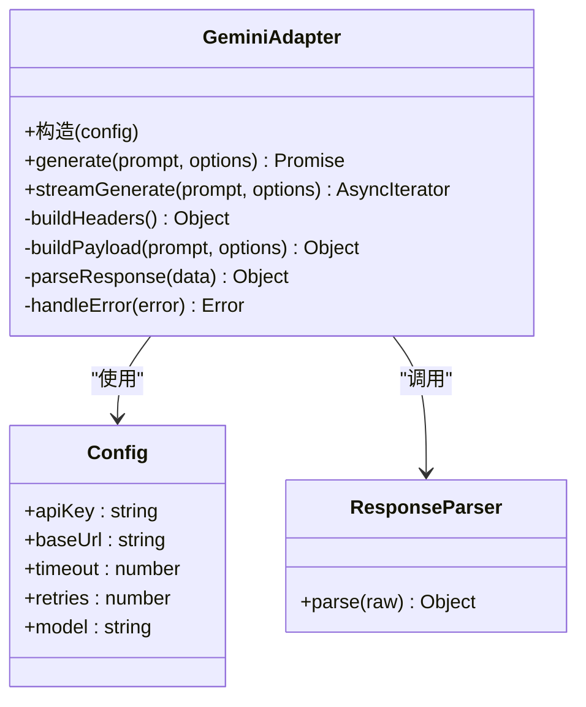
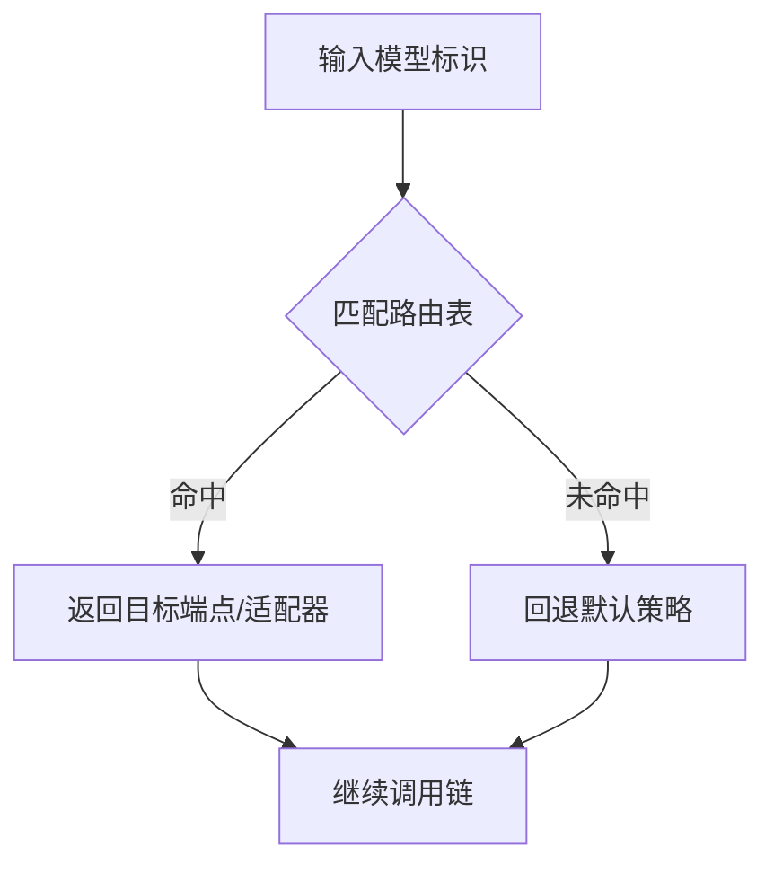
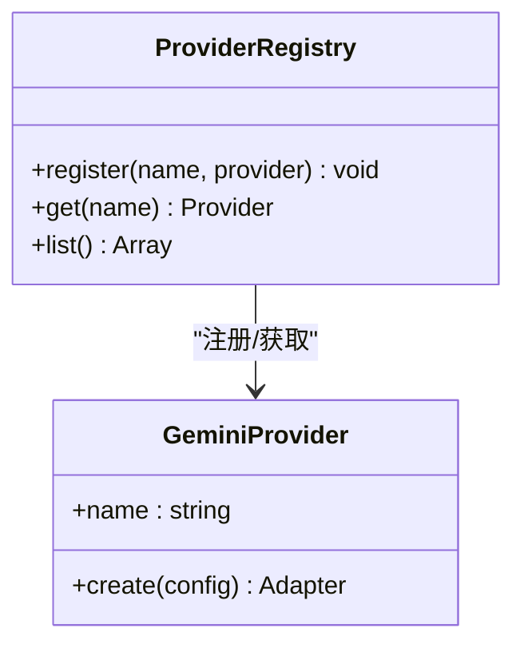
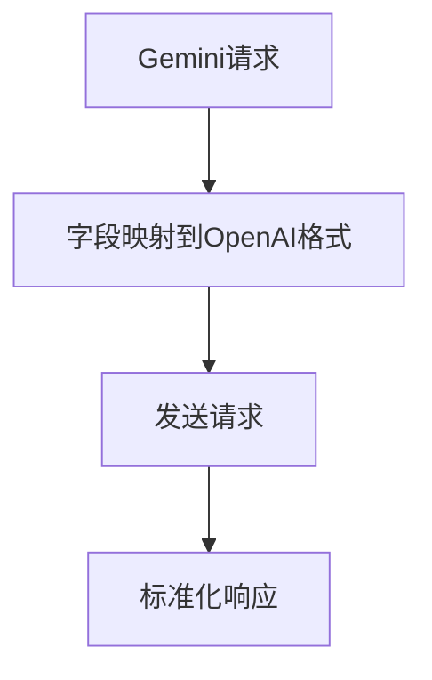
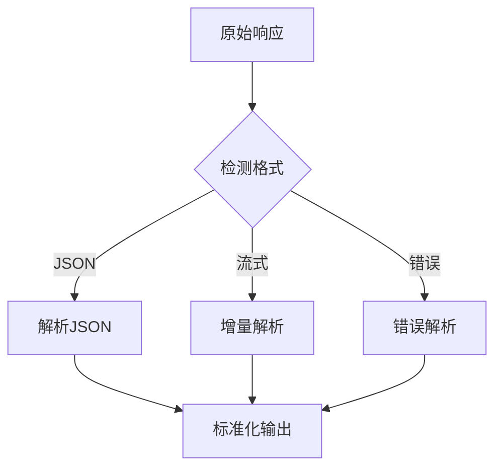
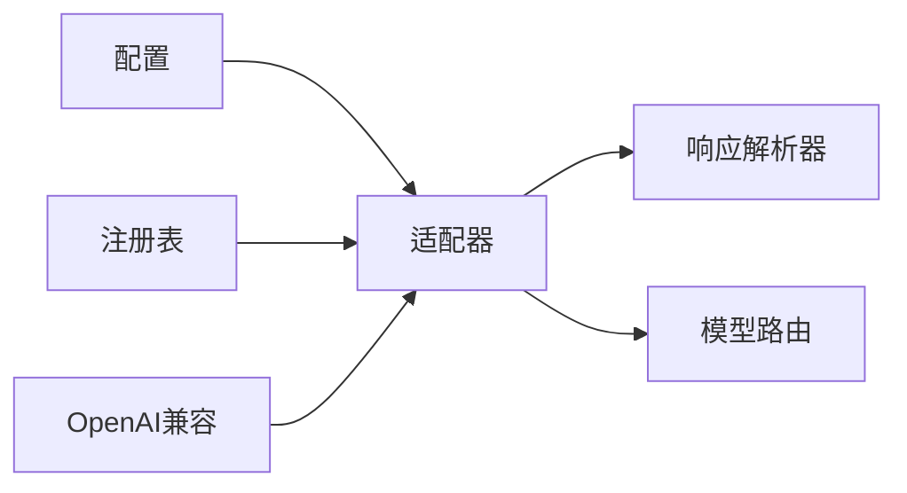

# Gemini适配器

<cite>
**本文引用的文件**   
- [src/features/ai/gemini-adapter.ts](file://src/features/ai/gemini-adapter.ts)
- [src/features/ai/gemini-config.ts](file://src/features/ai/gemini-config.ts)
- [src/features/ai/gemini-adapter.test.ts](file://src/features/ai/gemini-adapter.test.ts)
- [src/features/ai/gemini-config.test.ts](file://src/features/ai/gemini-config.test.ts)
- [src/features/ai/provider-registry.ts](file://src/features/ai/provider-registry.ts)
- [src/features/ai/model-routing.ts](file://src/features/ai/model-routing.ts)
- [src/features/ai/config.ts](file://src/features/ai/config.ts)
- [src/features/ai/openai-compatible-payloads.ts](file://src/features/ai/openai-compatible-payloads.ts)
- [src/features/ai/openai-compatible-config.ts](file://src/features/ai/openai-compatible-config.ts)
- [server/src/lib/llm-response-parser.ts](file://server/src/lib/llm-response-parser.ts)
</cite>

## 目录
1. [简介](#简介)
2. [项目结构](#项目结构)
3. [核心组件](#核心组件)
4. [架构总览](#架构总览)
5. [详细组件分析](#详细组件分析)
6. [依赖关系分析](#依赖关系分析)
7. [性能考虑](#性能考虑)
8. [故障排除指南](#故障排除指南)
9. [结论](#结论)
10. [附录](#附录)

## 简介
本文件面向Gemini AI适配器的集成与使用，覆盖认证方式、请求格式、响应处理、配置选项（API密钥、模型选择、参数调优）、错误处理机制（网络异常、API限制、内容过滤）、性能优化技巧（缓存、批量、连接复用），以及使用示例与最佳实践。文档基于仓库中Gemini相关实现进行梳理，确保读者能够正确配置并高效调用Gemini API。

## 项目结构
Gemini适配器位于AI功能域下，围绕“配置—适配器—路由—注册”的层次组织：
- 配置层：集中管理Gemini相关的配置项与校验
- 适配器层：封装对Gemini API的HTTP调用、鉴权、序列化与反序列化
- 路由层：根据模型名称或策略选择具体后端实现
- 注册层：将适配器纳入统一提供者注册表，供上层编排使用

**图示来源**
- [src/features/ai/gemini-config.ts](file://src/features/ai/gemini-config.ts)
- [src/features/ai/gemini-adapter.ts](file://src/features/ai/gemini-adapter.ts)
- [src/features/ai/provider-registry.ts](file://src/features/ai/provider-registry.ts)
- [src/features/ai/model-routing.ts](file://src/features/ai/model-routing.ts)
- [src/features/ai/openai-compatible-payloads.ts](file://src/features/ai/openai-compatible-payloads.ts)
- [src/features/ai/openai-compatible-config.ts](file://src/features/ai/openai-compatible-config.ts)
- [server/src/lib/llm-response-parser.ts](file://server/src/lib/llm-response-parser.ts)

**章节来源**
- [src/features/ai/gemini-config.ts](file://src/features/ai/gemini-config.ts)
- [src/features/ai/gemini-adapter.ts](file://src/features/ai/gemini-adapter.ts)
- [src/features/ai/provider-registry.ts](file://src/features/ai/provider-registry.ts)
- [src/features/ai/model-routing.ts](file://src/features/ai/model-routing.ts)

## 核心组件
- 配置模块（gemini-config）：定义并校验Gemini所需的配置项，如API密钥、基础URL、超时、重试、模型名等；提供默认值与合并策略。
- 适配器模块（gemini-adapter）：封装对Gemini API的请求构建、鉴权头注入、发送请求、流式与非流式响应解析、错误分类与重试。
- 模型路由（model-routing）：根据传入的模型标识或策略，决定实际调用的后端端点或适配器实例。
- 提供者注册表（provider-registry）：统一管理不同AI提供者（包括Gemini）的注册、查找与生命周期。
- OpenAI兼容层（openai-compatible-*）：在需要时，将Gemini请求转换为OpenAI兼容格式，或将响应标准化为统一结构。
- 响应解析器（llm-response-parser）：统一解析LLM返回的结构化数据，提取文本、工具调用、引用等信息。

**章节来源**
- [src/features/ai/gemini-config.ts](file://src/features/ai/gemini-config.ts)
- [src/features/ai/gemini-adapter.ts](file://src/features/ai/gemini-adapter.ts)
- [src/features/ai/model-routing.ts](file://src/features/ai/model-routing.ts)
- [src/features/ai/provider-registry.ts](file://src/features/ai/provider-registry.ts)
- [src/features/ai/openai-compatible-payloads.ts](file://src/features/ai/openai-compatible-payloads.ts)
- [src/features/ai/openai-compatible-config.ts](file://src/features/ai/openai-compatible-config.ts)
- [server/src/lib/llm-response-parser.ts](file://server/src/lib/llm-response-parser.ts)

## 架构总览
下图展示了从上层调用到Gemini API的完整流程，包括配置加载、鉴权、请求构建、发送、响应解析与错误处理。

**图示来源**
- [src/features/ai/provider-registry.ts](file://src/features/ai/provider-registry.ts)
- [src/features/ai/model-routing.ts](file://src/features/ai/model-routing.ts)
- [src/features/ai/gemini-adapter.ts](file://src/features/ai/gemini-adapter.ts)
- [server/src/lib/llm-response-parser.ts](file://server/src/lib/llm-response-parser.ts)

## 详细组件分析

### 配置模块（gemini-config）
- 职责
  - 定义配置项：API密钥、基础URL、超时、重试次数、并发限制、模型名、系统提示词等
  - 提供默认值与环境变量读取
  - 校验必填字段与取值范围
- 关键点
  - 支持多环境配置合并（开发/测试/生产）
  - 敏感信息隔离（仅运行时注入）
  - 可插拔的验证规则扩展

**图示来源**
- [src/features/ai/gemini-config.ts](file://src/features/ai/gemini-config.ts)

**章节来源**
- [src/features/ai/gemini-config.ts](file://src/features/ai/gemini-config.ts)
- [src/features/ai/config.ts](file://src/features/ai/config.ts)

### 适配器模块（gemini-adapter）
- 职责
  - 构建Gemini API请求体（文本、图像、工具调用等）
  - 注入鉴权头（API Key或Bearer Token）
  - 发送请求（支持流式与非流式）
  - 解析响应（文本、引用、工具调用、元数据）
  - 错误分类与重试（网络异常、限流、内容安全）
- 关键点
  - 统一错误码映射到业务语义
  - 支持部分重试与退避策略
  - 流式响应增量解析，降低首字节延迟

**图示来源**
- [src/features/ai/gemini-adapter.ts](file://src/features/ai/gemini-adapter.ts)
- [server/src/lib/llm-response-parser.ts](file://server/src/lib/llm-response-parser.ts)

**章节来源**
- [src/features/ai/gemini-adapter.ts](file://src/features/ai/gemini-adapter.ts)
- [server/src/lib/llm-response-parser.ts](file://server/src/lib/llm-response-parser.ts)

### 模型路由（model-routing）
- 职责
  - 根据模型名称或策略选择具体后端端点或适配器实例
  - 支持按模型特性分流（例如不同版本或区域）
- 关键点
  - 路由表可配置化
  - 失败回退与就近选择

**图示来源**
- [src/features/ai/model-routing.ts](file://src/features/ai/model-routing.ts)

**章节来源**
- [src/features/ai/model-routing.ts](file://src/features/ai/model-routing.ts)

### 提供者注册表（provider-registry）
- 职责
  - 注册各AI提供者（包括Gemini）
  - 提供按名称或类型查找实例的能力
  - 管理生命周期与依赖注入
- 关键点
  - 单例或按需创建
  - 错误时快速失败并提供诊断信息

**图示来源**
- [src/features/ai/provider-registry.ts](file://src/features/ai/provider-registry.ts)

**章节来源**
- [src/features/ai/provider-registry.ts](file://src/features/ai/provider-registry.ts)

### OpenAI兼容层（openai-compatible-*）
- 职责
  - 将Gemini请求转换为OpenAI兼容格式（当上游期望OpenAI协议时）
  - 将响应标准化为统一结构，便于跨提供者复用
- 关键点
  - 字段映射与缺失值处理
  - 保留原始元数据用于调试

**图示来源**
- [src/features/ai/openai-compatible-payloads.ts](file://src/features/ai/openai-compatible-payloads.ts)
- [src/features/ai/openai-compatible-config.ts](file://src/features/ai/openai-compatible-config.ts)

**章节来源**
- [src/features/ai/openai-compatible-payloads.ts](file://src/features/ai/openai-compatible-payloads.ts)
- [src/features/ai/openai-compatible-config.ts](file://src/features/ai/openai-compatible-config.ts)

### 响应解析器（llm-response-parser）
- 职责
  - 解析多种格式的LLM响应（JSON、流式片段、错误体）
  - 提取文本、工具调用、引用、统计信息等
- 关键点
  - 容错解析（部分字段缺失时降级）
  - 统一错误对象结构

**图示来源**
- [server/src/lib/llm-response-parser.ts](file://server/src/lib/llm-response-parser.ts)

**章节来源**
- [server/src/lib/llm-response-parser.ts](file://server/src/lib/llm-response-parser.ts)

## 依赖关系分析
- 耦合度
  - 适配器强依赖配置与响应解析器，弱依赖路由与注册表
  - OpenAI兼容层作为可选桥接，避免直接耦合上游协议
- 外部依赖
  - HTTP客户端（内置或第三方）
  - 环境变量与密钥管理
- 循环依赖
  - 通过接口与注册表解耦，避免直接互相引用

**图示来源**
- [src/features/ai/gemini-config.ts](file://src/features/ai/gemini-config.ts)
- [src/features/ai/gemini-adapter.ts](file://src/features/ai/gemini-adapter.ts)
- [src/features/ai/model-routing.ts](file://src/features/ai/model-routing.ts)
- [src/features/ai/provider-registry.ts](file://src/features/ai/provider-registry.ts)
- [src/features/ai/openai-compatible-payloads.ts](file://src/features/ai/openai-compatible-payloads.ts)
- [server/src/lib/llm-response-parser.ts](file://server/src/lib/llm-response-parser.ts)

**章节来源**
- [src/features/ai/gemini-config.ts](file://src/features/ai/gemini-config.ts)
- [src/features/ai/gemini-adapter.ts](file://src/features/ai/gemini-adapter.ts)
- [src/features/ai/model-routing.ts](file://src/features/ai/model-routing.ts)
- [src/features/ai/provider-registry.ts](file://src/features/ai/provider-registry.ts)
- [src/features/ai/openai-compatible-payloads.ts](file://src/features/ai/openai-compatible-payloads.ts)
- [server/src/lib/llm-response-parser.ts](file://server/src/lib/llm-response-parser.ts)

## 性能考虑
- 请求缓存
  - 对相同输入与参数的响应进行缓存（键由输入哈希+参数构成）
  - 设置合理的TTL与失效策略
- 批量处理
  - 合并多个短请求为批量调用（若API支持）
  - 控制批次大小以避免超时与限流
- 连接复用
  - 复用HTTP连接池，减少握手开销
  - 合理设置最大空闲连接与超时
- 流式传输
  - 优先使用流式接口以降低首字节延迟
  - 增量渲染与前端展示
- 重试与退避
  - 针对瞬态错误（网络抖动、限流）实施指数退避
  - 限制最大重试次数，避免雪崩

[本节为通用指导，不直接分析具体文件]

## 故障排除指南
- 认证失败
  - 检查API密钥是否正确注入且未被篡改
  - 确认基础URL与区域设置正确
- 网络异常
  - 启用重试与退避
  - 检查代理与防火墙设置
- API限制
  - 监控速率限制与配额
  - 实施队列与背压控制
- 内容过滤
  - 调整提示词以避免触发安全策略
  - 捕获并记录过滤原因以便迭代
- 响应解析错误
  - 查看原始响应日志
  - 升级解析器以兼容新格式

**章节来源**
- [src/features/ai/gemini-adapter.test.ts](file://src/features/ai/gemini-adapter.test.ts)
- [src/features/ai/gemini-config.test.ts](file://src/features/ai/gemini-config.test.ts)

## 结论
Gemini适配器通过清晰的配置、适配器、路由与注册分层，实现了高内聚、低耦合的AI能力接入。结合OpenAI兼容层与统一响应解析器，可在多提供者间平滑切换。建议在生产环境中启用缓存、批量、连接复用与重试退避，以提升稳定性与吞吐。

[本节为总结性内容，不直接分析具体文件]

## 附录
- 使用示例
  - 初始化配置：设置API密钥、模型名、超时与重试
  - 非流式调用：传入提示与参数，等待完整响应
  - 流式调用：逐块接收响应，实时展示
- 最佳实践
  - 使用环境变量管理密钥
  - 为不同环境分离配置
  - 记录关键指标（延迟、错误率、配额使用）
- 调试方法
  - 开启详细日志（请求体、响应体、错误堆栈）
  - 使用本地Mock服务验证请求格式
  - 逐步缩小问题范围（配置、网络、API）

[本节为补充说明，不直接分析具体文件]