# Mimo适配器

<cite>
**本文引用的文件**   
- [mimo-adapter.ts](file://src/features/ai/mimo-adapter.ts)
- [mimo-config.ts](file://src/features/ai/mimo-config.ts)
- [mimo-audio-client.ts](file://src/features/audio/mimo-audio-client.ts)
- [provider-registry.ts](file://src/features/ai/provider-registry.ts)
- [model-routing.ts](file://src/features/ai/model-routing.ts)
- [openai-compatible-payloads.ts](file://src/features/ai/openai-compatible-payloads.ts)
- [openai-compatible-config.ts](file://src/features/ai/openai-compatible-config.ts)
- [pi-stream-bridge.ts](file://src/features/director/pi-stream-bridge.ts)
- [pi-tool-adapter.ts](file://src/features/director/pi-tool-adapter.ts)
- [route-contract-error.ts](file://src/features/ai/route-contract-error.ts)
- [managed-vision-executor.ts](file://src/features/ai/managed-vision-executor.ts)
- [provider-dispatch.ts](file://src/features/ai/provider-dispatch.ts)
- [provider-fairness.ts](file://src/features/ai/provider-fairness.ts)
- [credentials.md](file://docs/configuration/credentials.md)
</cite>

## 更新摘要
**所做更改**   
- 新增模块化提供商调度系统章节，说明新的dispatch机制
- 更新限流与公平调度部分，反映专用速率限制和公平调度实现
- 增强等待恢复机制文档，基于managed-vision-executor改进
- 更新架构图以反映新的调度层和错误处理流程
- 添加性能优化建议，包括并发控制和资源管理

## 目录
1. [简介](#简介)
2. [项目结构](#项目结构)
3. [核心组件](#核心组件)
4. [架构总览](#架构总览)
5. [详细组件分析](#详细组件分析)
6. [模块化调度系统](#模块化调度系统)
7. [依赖关系分析](#依赖关系分析)
8. [性能考量](#性能考量)
9. [故障排查指南](#故障排查指南)
10. [结论](#结论)
11. [附录](#附录)

## 简介
本文件面向Mimo AI适配器的集成与使用，覆盖认证流程、消息格式、流式响应处理、配置管理（凭据、模型参数、超时）、多模态输入、工具调用与函数执行、错误处理与重试机制，以及实际集成步骤、测试方法与性能优化建议。文档基于仓库中Mimo相关实现进行梳理，确保读者能够快速理解并正确接入Mimo能力。

**更新** 本次更新重点反映了MiMo提供商现在使用新的模块化提供商调度系统，具有专用限流、公平调度和通过managed-vision-executor增强的改进等待恢复机制。

## 项目结构
Mimo相关代码主要分布在以下模块：
- AI适配器层：提供统一的LLM调用接口与协议适配
- 音频客户端：封装Mimo音频能力（如TTS）的HTTP调用
- 路由与注册：统一注册Provider、按模型选择具体实现
- OpenAI兼容层：复用通用载荷构造与配置映射
- 导演编排：将适配器嵌入工作流，支持流式桥接与工具调用
- **新增** 调度系统：模块化提供商调度、限流控制、公平调度算法

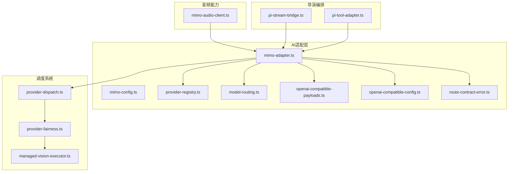

**图表来源**
- [mimo-adapter.ts](file://src/features/ai/mimo-adapter.ts)
- [mimo-config.ts](file://src/features/ai/mimo-config.ts)
- [mimo-audio-client.ts](file://src/features/audio/mimo-audio-client.ts)
- [provider-registry.ts](file://src/features/ai/provider-registry.ts)
- [model-routing.ts](file://src/features/ai/model-routing.ts)
- [openai-compatible-payloads.ts](file://src/features/ai/openai-compatible-payloads.ts)
- [openai-compatible-config.ts](file://src/features/ai/openai-compatible-config.ts)
- [provider-dispatch.ts](file://src/features/ai/provider-dispatch.ts)
- [provider-fairness.ts](file://src/features/ai/provider-fairness.ts)
- [managed-vision-executor.ts](file://src/features/ai/managed-vision-executor.ts)
- [pi-stream-bridge.ts](file://src/features/director/pi-stream-bridge.ts)
- [pi-tool-adapter.ts](file://src/features/director/pi-tool-adapter.ts)

## 核心组件
- Mimo适配器：封装对Mimo API的调用，包括请求构建、鉴权、流式读取、错误转换等
- Mimo配置：集中管理API密钥、基础URL、超时、重试策略、模型参数等
- Provider注册与路由：统一注册Mimo为可用Provider，并按模型名或标签选择具体实现
- OpenAI兼容层：复用通用的消息载荷构造、系统提示、工具定义等
- 音频客户端：封装Mimo音频服务（如TTS）的HTTP交互
- 导演桥接与工具适配：将适配器输出桥接到流式管道，并将外部工具暴露给模型
- **新增** 调度器：模块化提供商调度系统，负责请求分发、限流控制和公平调度
- **新增** 执行器：增强的vision执行器，提供改进的等待恢复和资源管理

## 架构总览
下图展示了从上层调用到Mimo API的完整链路，包含新的调度系统、鉴权、消息构建、流式响应、错误处理与降级路径。

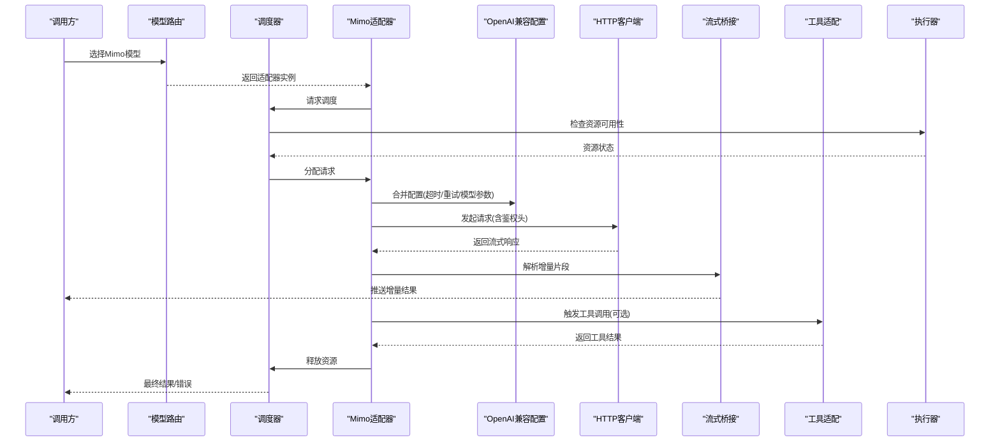

**图表来源**
- [model-routing.ts](file://src/features/ai/model-routing.ts)
- [mimo-adapter.ts](file://src/features/ai/mimo-adapter.ts)
- [provider-dispatch.ts](file://src/features/ai/provider-dispatch.ts)
- [provider-fairness.ts](file://src/features/ai/provider-fairness.ts)
- [managed-vision-executor.ts](file://src/features/ai/managed-vision-executor.ts)
- [openai-compatible-config.ts](file://src/features/ai/openai-compatible-config.ts)
- [pi-stream-bridge.ts](file://src/features/director/pi-stream-bridge.ts)
- [pi-tool-adapter.ts](file://src/features/director/pi-tool-adapter.ts)

## 详细组件分析

### 认证流程
- 鉴权方式：通过请求头注入API密钥（例如Authorization或自定义Header），由适配器在每次请求前组装
- 凭据来源：优先从环境变量或配置中心加载，支持动态刷新
- 安全建议：避免在日志中打印敏感信息；对密钥进行最小权限控制

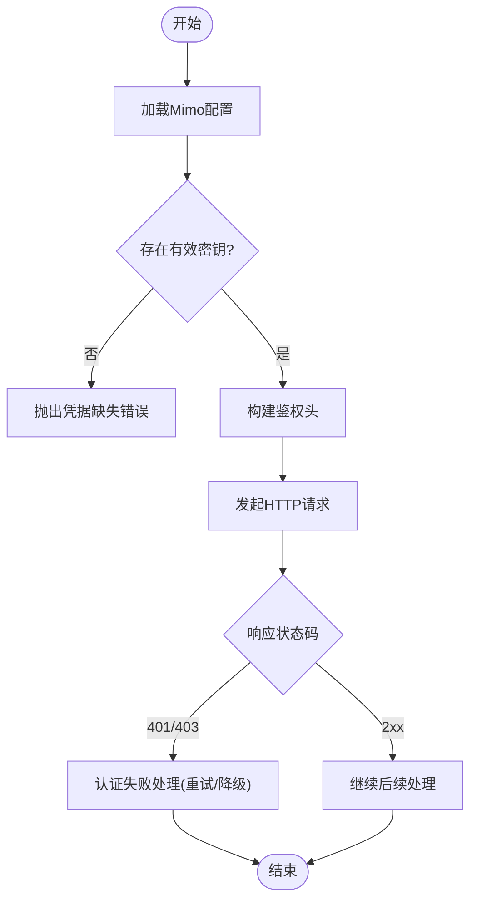

**图表来源**
- [mimo-config.ts](file://src/features/ai/mimo-config.ts)
- [mimo-adapter.ts](file://src/features/ai/mimo-adapter.ts)
- [route-contract-error.ts](file://src/features/ai/route-contract-error.ts)

**章节来源**
- [mimo-config.ts](file://src/features/ai/mimo-config.ts)
- [mimo-adapter.ts](file://src/features/ai/mimo-adapter.ts)
- [route-contract-error.ts](file://src/features/ai/route-contract-error.ts)
- [credentials.md](file://docs/configuration/credentials.md)

### 消息格式与多模态输入
- 消息结构：遵循OpenAI兼容的消息格式（角色、内容、附件等），适配器负责转换为Mimo期望的载荷
- 多模态：支持文本、图片、音频等多类型输入，适配器根据媒体类型进行编码与上传
- 工具定义：以结构化Schema描述工具，供模型在生成过程中调用

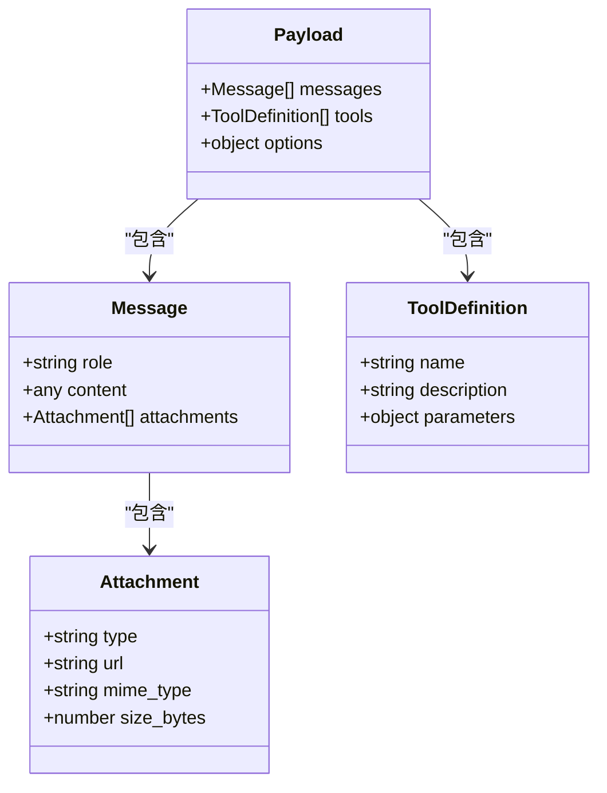

**图表来源**
- [openai-compatible-payloads.ts](file://src/features/ai/openai-compatible-payloads.ts)
- [mimo-adapter.ts](file://src/features/ai/mimo-adapter.ts)

**章节来源**
- [openai-compatible-payloads.ts](file://src/features/ai/openai-compatible-payloads.ts)
- [mimo-adapter.ts](file://src/features/ai/mimo-adapter.ts)

### 流式响应处理
- 流式读取：适配器接收服务端增量数据，解析后通过桥接器推送到上游
- 增量拼接：前端或调用方可实时渲染，提升用户体验
- 中断与取消：支持在需要时中止流式传输，释放资源

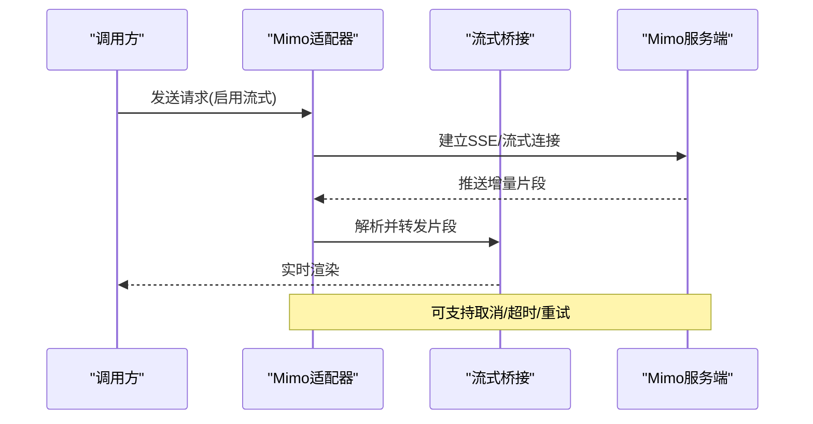

**图表来源**
- [mimo-adapter.ts](file://src/features/ai/mimo-adapter.ts)
- [pi-stream-bridge.ts](file://src/features/director/pi-stream-bridge.ts)

**章节来源**
- [mimo-adapter.ts](file://src/features/ai/mimo-adapter.ts)
- [pi-stream-bridge.ts](file://src/features/director/pi-stream-bridge.ts)

### 工具调用与函数执行
- 工具发现：适配器根据配置加载工具定义，并在响应中携带调用指令
- 执行流程：调用方执行工具函数，将结果回传给适配器，适配器继续生成后续内容
- 错误隔离：工具执行异常不影响主流程，适配器可记录并降级

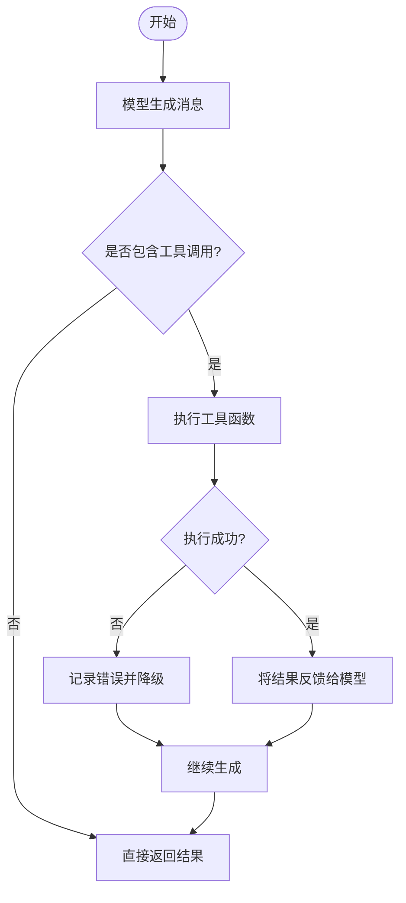

**图表来源**
- [pi-tool-adapter.ts](file://src/features/director/pi-tool-adapter.ts)
- [mimo-adapter.ts](file://src/features/ai/mimo-adapter.ts)

**章节来源**
- [pi-tool-adapter.ts](file://src/features/director/pi-tool-adapter.ts)
- [mimo-adapter.ts](file://src/features/ai/mimo-adapter.ts)

### 配置管理
- 凭据设置：API密钥、基础URL、组织ID等
- 模型参数：温度、最大长度、TopP、频率惩罚等
- 超时与重试：请求超时、连接超时、重试次数与退避策略
- 环境加载：从环境变量或配置文件加载，支持运行时覆盖

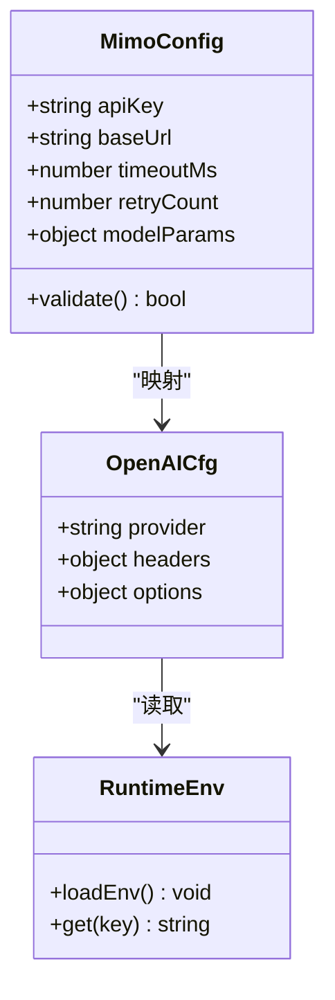

**图表来源**
- [mimo-config.ts](file://src/features/ai/mimo-config.ts)
- [openai-compatible-config.ts](file://src/features/ai/openai-compatible-config.ts)

**章节来源**
- [mimo-config.ts](file://src/features/ai/mimo-config.ts)
- [openai-compatible-config.ts](file://src/features/ai/openai-compatible-config.ts)
- [credentials.md](file://docs/configuration/credentials.md)

### 音频能力（Mimo TTS）
- 功能范围：文本转语音、音色选择、语速控制、音频格式输出
- 调用流程：构造音频请求，发送后获取流式或二进制音频数据
- 错误处理：网络异常、限流、解码失败的兜底策略

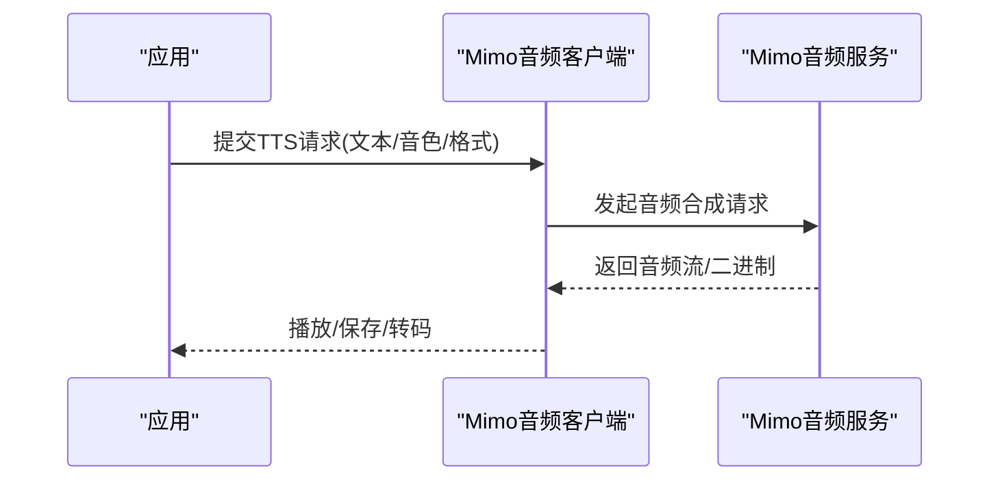

**图表来源**
- [mimo-audio-client.ts](file://src/features/audio/mimo-audio-client.ts)

**章节来源**
- [mimo-audio-client.ts](file://src/features/audio/mimo-audio-client.ts)

## 模块化调度系统

### 调度架构概述
新的模块化调度系统为Mimo提供商提供了专用的请求分发、限流控制和公平调度机制。该系统通过分层设计实现了高可用性和可扩展性。

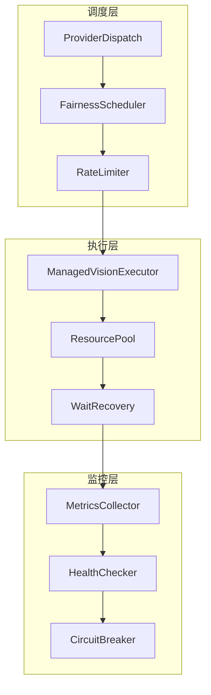

**图表来源**
- [provider-dispatch.ts](file://src/features/ai/provider-dispatch.ts)
- [provider-fairness.ts](file://src/features/ai/provider-fairness.ts)
- [managed-vision-executor.ts](file://src/features/ai/managed-vision-executor.ts)

### 专用限流机制
系统实现了细粒度的限流控制，支持多种限流策略：

- **全局限流**：针对整个Mimo提供商的全局请求限制
- **模型级限流**：针对不同模型的独立限流控制
- **用户级限流**：基于用户身份的个性化限流策略
- **自适应限流**：根据服务器负载动态调整限流阈值

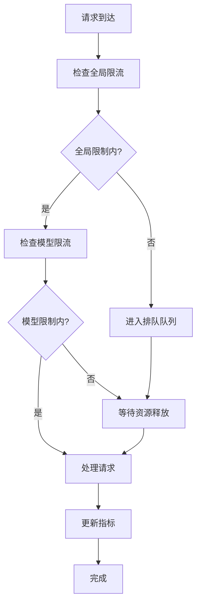

**图表来源**
- [provider-dispatch.ts](file://src/features/ai/provider-dispatch.ts)
- [provider-fairness.ts](file://src/features/ai/provider-fairness.ts)

### 公平调度算法
公平调度确保多个并发请求之间的资源分配公平性：

- **轮询调度**：简单的轮询分配策略
- **加权调度**：基于模型复杂度的权重分配
- **优先级调度**：支持紧急请求的优先处理
- **负载均衡**：动态平衡各执行器的负载

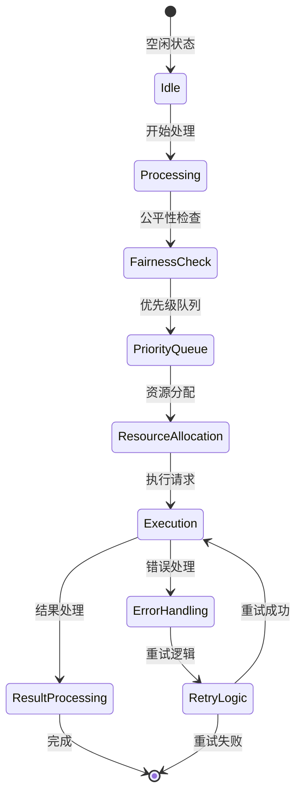

**图表来源**
- [provider-fairness.ts](file://src/features/ai/provider-fairness.ts)
- [managed-vision-executor.ts](file://src/features/ai/managed-vision-executor.ts)

### 增强的等待恢复机制
Managed Vision Executor提供了改进的等待恢复机制：

- **智能超时管理**：动态调整超时时间，避免过早中断
- **状态持久化**：请求状态的持久化存储，支持断点续传
- **自动重试策略**：基于错误类型的智能重试机制
- **资源回收**：及时清理已完成的请求资源

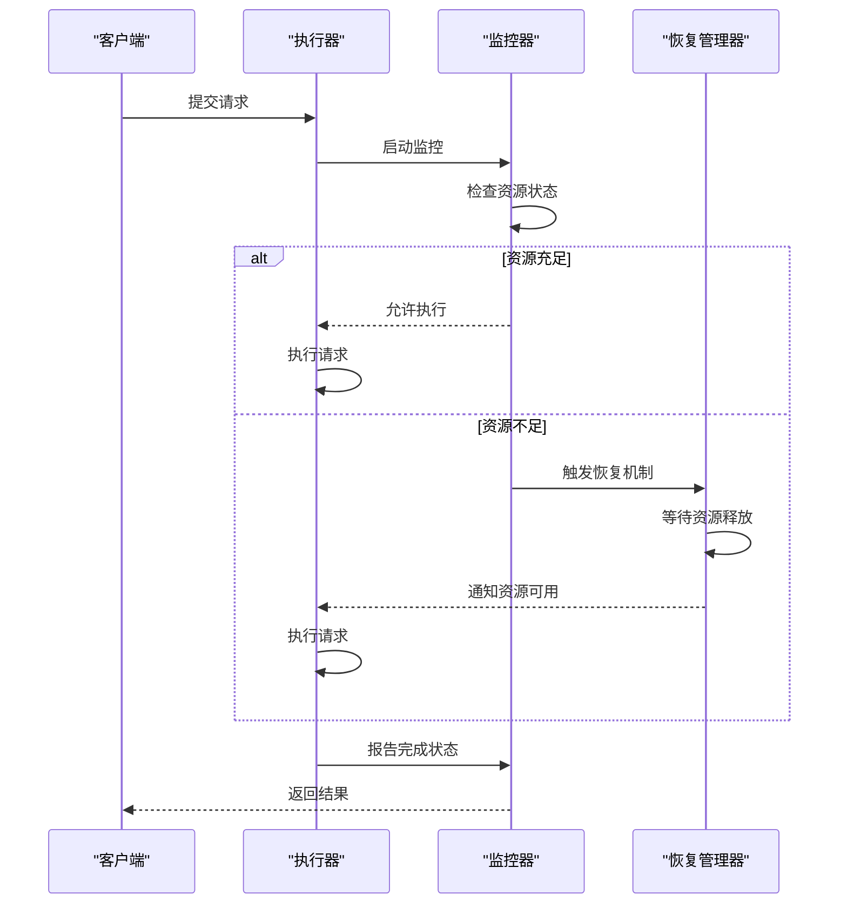

**图表来源**
- [managed-vision-executor.ts](file://src/features/ai/managed-vision-executor.ts)

**章节来源**
- [provider-dispatch.ts](file://src/features/ai/provider-dispatch.ts)
- [provider-fairness.ts](file://src/features/ai/provider-fairness.ts)
- [managed-vision-executor.ts](file://src/features/ai/managed-vision-executor.ts)

## 依赖关系分析
- 适配器依赖OpenAI兼容层进行载荷构造与配置映射
- 路由与注册模块决定何时使用Mimo适配器
- 流式桥接与工具适配将适配器能力融入工作流
- 音频客户端独立于文本适配器，但共享配置与错误处理策略
- **新增** 调度系统依赖公平调度器和执行器，提供统一的请求管理接口

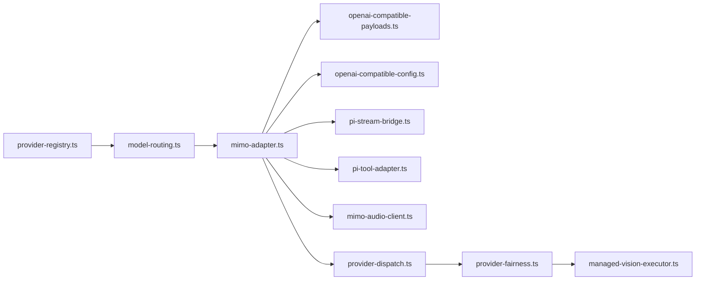

**图表来源**
- [provider-registry.ts](file://src/features/ai/provider-registry.ts)
- [model-routing.ts](file://src/features/ai/model-routing.ts)
- [mimo-adapter.ts](file://src/features/ai/mimo-adapter.ts)
- [openai-compatible-payloads.ts](file://src/features/ai/openai-compatible-payloads.ts)
- [openai-compatible-config.ts](file://src/features/ai/openai-compatible-config.ts)
- [pi-stream-bridge.ts](file://src/features/director/pi-stream-bridge.ts)
- [pi-tool-adapter.ts](file://src/features/director/pi-tool-adapter.ts)
- [mimo-audio-client.ts](file://src/features/audio/mimo-audio-client.ts)
- [provider-dispatch.ts](file://src/features/ai/provider-dispatch.ts)
- [provider-fairness.ts](file://src/features/ai/provider-fairness.ts)
- [managed-vision-executor.ts](file://src/features/ai/managed-vision-executor.ts)

## 性能考量
- 连接复用：保持HTTP连接池，减少握手开销
- 流式优先：尽量使用流式响应降低首字节延迟
- 缓存策略：对静态配置与模型元数据进行本地缓存
- 并发控制：限制并发请求数，避免触发服务端限流
- 压缩与分块：合理设置请求体大小与分块传输
- **新增** 调度优化：利用新的调度系统进行智能资源分配
- **新增** 内存管理：通过执行器优化内存使用和垃圾回收
- **新增** 监控指标：收集关键性能指标用于调优和故障诊断

## 故障排查指南
- 认证失败：检查API密钥有效性、网络可达性、代理设置
- 限流与超时：调整重试次数与退避策略，增加超时阈值
- 流式中断：确认服务端支持SSE/流式，检查客户端取消逻辑
- 工具执行异常：验证工具函数签名与返回值，记录错误上下文
- 降级策略：当Mimo不可用时，切换到备用Provider或返回默认响应
- **新增** 调度问题：检查调度器状态、资源池使用情况、公平性指标
- **新增** 执行器故障：监控执行器健康状态、等待队列长度、恢复成功率

**章节来源**
- [route-contract-error.ts](file://src/features/ai/route-contract-error.ts)
- [mimo-adapter.ts](file://src/features/ai/mimo-adapter.ts)
- [mimo-config.ts](file://src/features/ai/mimo-config.ts)
- [provider-dispatch.ts](file://src/features/ai/provider-dispatch.ts)
- [managed-vision-executor.ts](file://src/features/ai/managed-vision-executor.ts)

## 结论
Mimo适配器通过统一的接口与OpenAI兼容层，简化了与Mimo API的集成。结合新的模块化调度系统、流式响应、工具调用与音频能力，可在复杂工作流中提供稳定高效的AI服务。合理的配置管理与错误处理策略是保障生产稳定性的关键。

**更新** 新的调度系统显著提升了系统的可扩展性和可靠性，通过专用限流、公平调度和增强的等待恢复机制，为大规模部署提供了坚实基础。

## 附录
- 集成步骤
  - 配置凭据与环境变量
  - 注册Provider并选择模型
  - 构建消息与工具定义
  - 启用流式响应与错误处理
  - **新增** 配置调度参数和优化设置
- 测试方法
  - 单元测试：模拟网络与流式数据
  - 集成测试：端到端调用Mimo API
  - 性能测试：压测流式吞吐与延迟
  - **新增** 调度测试：验证限流和公平性
- 最佳实践
  - 最小权限原则管理密钥
  - 监控与告警关键指标
  - 定期更新模型参数与配置
  - **新增** 监控调度器性能和资源使用情况
  - **新增** 定期评估和调整限流策略