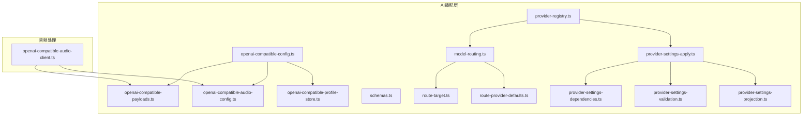
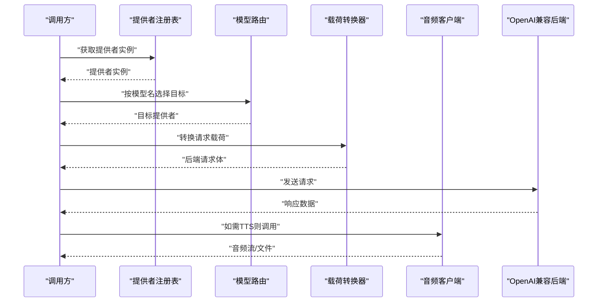
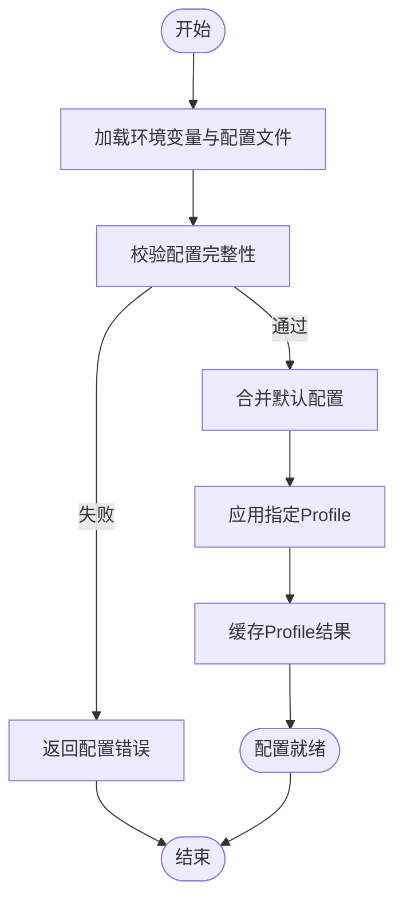
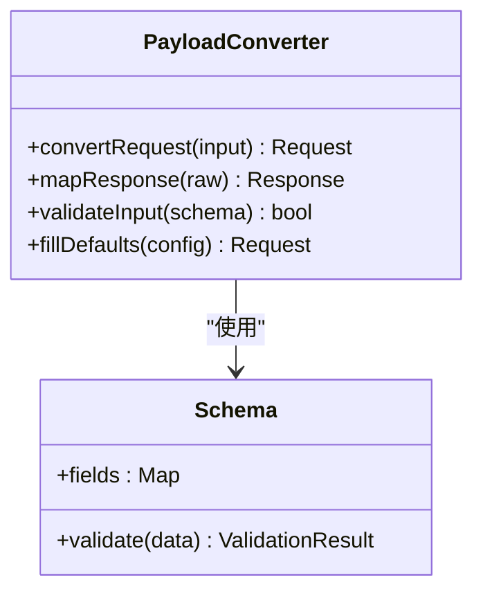
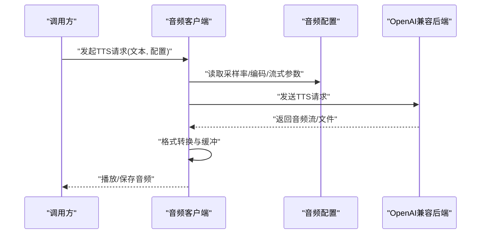
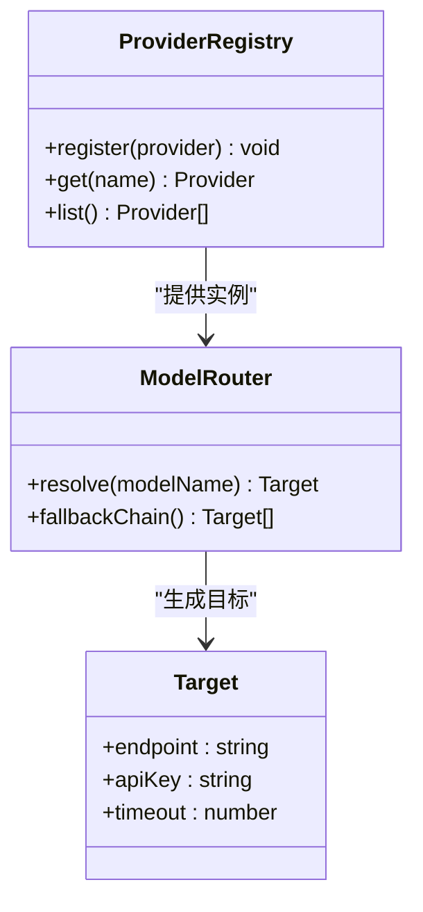
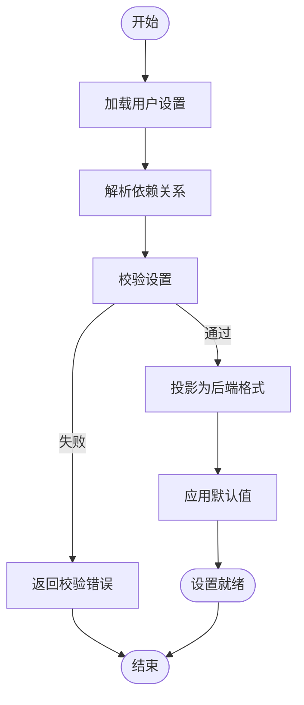
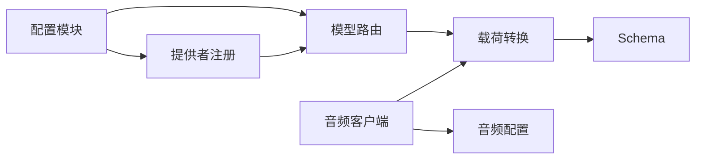

# OpenAI兼容适配器

<cite>
**本文引用的文件**   
- [src/features/ai/openai-compatible-config.ts](file://src/features/ai/openai-compatible-config.ts)
- [src/features/ai/openai-compatible-payloads.ts](file://src/features/ai/openai-compatible-payloads.ts)
- [src/features/ai/openai-compatible-audio-config.ts](file://src/features/ai/openai-compatible-audio-config.ts)
- [src/features/ai/openai-compatible-profile-store.ts](file://src/features/ai/openai-compatible-profile-store.ts)
- [src/features/audio/openai-compatible-audio-client.ts](file://src/features/audio/openai-compatible-audio-client.ts)
- [src/features/ai/provider-registry.ts](file://src/features/ai/provider-registry.ts)
- [src/features/ai/model-routing.ts](file://src/features/ai/model-routing.ts)
- [src/features/ai/provider-settings-apply.ts](file://src/features/ai/provider-settings-apply.ts)
- [src/features/ai/provider-settings-contract.ts](file://src/features/ai/provider-settings-contract.ts)
- [src/features/ai/provider-settings-validation.ts](file://src/features/ai/provider-settings-validation.ts)
- [src/features/ai/provider-settings-dependencies.ts](file://src/features/ai/provider-settings-dependencies.ts)
- [src/features/ai/provider-settings-projection.ts](file://src/features/ai/provider-settings-projection.ts)
- [src/features/ai/route-provider-defaults.ts](file://src/features/ai/route-provider-defaults.ts)
- [src/features/ai/route-target.ts](file://src/features/ai/route-target.ts)
- [src/features/ai/schemas.ts](file://src/features/ai/schemas.ts)
</cite>

## 目录
1. [简介](#简介)
2. [项目结构](#项目结构)
3. [核心组件](#核心组件)
4. [架构总览](#架构总览)
5. [详细组件分析](#详细组件分析)
6. [依赖关系分析](#依赖关系分析)
7. [性能考量](#性能考量)
8. [故障排查指南](#故障排查指南)
9. [结论](#结论)
10. [附录：扩展指南与最佳实践](#附录扩展指南与最佳实践)

## 简介
本文件面向OpenAI兼容适配器的设计与实现，聚焦以下目标：
- 标准接口适配：统一对外暴露OpenAI兼容的调用方式，屏蔽底层服务差异。
- 请求转换与响应映射：将上层通用请求转换为各后端期望格式，并将响应标准化为内部模型。
- 配置系统：支持端点、模型映射、参数转换等灵活配置，提供Profile存储与动态加载。
- 音频能力：TTS集成、音频格式转换、流式传输等高级功能。
- 扩展性：如何接入新的OpenAI兼容服务、自定义配置与最佳实践建议。

## 项目结构
OpenAI兼容相关代码主要分布在两个领域：
- AI适配层（features/ai）：负责配置、载荷转换、提供者注册、路由、设置校验与投影等。
- 音频处理（features/audio）：负责OpenAI兼容的音频客户端、格式转换与流式传输。

图表来源
- [src/features/ai/openai-compatible-config.ts](file://src/features/ai/openai-compatible-config.ts)
- [src/features/ai/openai-compatible-payloads.ts](file://src/features/ai/openai-compatible-payloads.ts)
- [src/features/ai/openai-compatible-audio-config.ts](file://src/features/ai/openai-compatible-audio-config.ts)
- [src/features/ai/openai-compatible-profile-store.ts](file://src/features/ai/openai-compatible-profile-store.ts)
- [src/features/ai/provider-registry.ts](file://src/features/ai/provider-registry.ts)
- [src/features/ai/model-routing.ts](file://src/features/ai/model-routing.ts)
- [src/features/ai/provider-settings-apply.ts](file://src/features/ai/provider-settings-apply.ts)
- [src/features/ai/provider-settings-dependencies.ts](file://src/features/ai/provider-settings-dependencies.ts)
- [src/features/ai/provider-settings-validation.ts](file://src/features/ai/provider-settings-validation.ts)
- [src/features/ai/provider-settings-projection.ts](file://src/features/ai/provider-settings-projection.ts)
- [src/features/ai/route-provider-defaults.ts](file://src/features/ai/route-provider-defaults.ts)
- [src/features/ai/route-target.ts](file://src/features/ai/route-target.ts)
- [src/features/ai/schemas.ts](file://src/features/ai/schemas.ts)
- [src/features/audio/openai-compatible-audio-client.ts](file://src/features/audio/openai-compatible-audio-client.ts)

章节来源
- [src/features/ai/openai-compatible-config.ts](file://src/features/ai/openai-compatible-config.ts)
- [src/features/ai/openai-compatible-payloads.ts](file://src/features/ai/openai-compatible-payloads.ts)
- [src/features/ai/openai-compatible-audio-config.ts](file://src/features/ai/openai-compatible-audio-config.ts)
- [src/features/ai/openai-compatible-profile-store.ts](file://src/features/ai/openai-compatible-profile-store.ts)
- [src/features/audio/openai-compatible-audio-client.ts](file://src/features/audio/openai-compatible-audio-client.ts)
- [src/features/ai/provider-registry.ts](file://src/features/ai/provider-registry.ts)
- [src/features/ai/model-routing.ts](file://src/features/ai/model-routing.ts)

## 核心组件
- 配置中心（openai-compatible-config.ts）：集中管理OpenAI兼容服务的端点、鉴权、超时、重试等基础配置，并提供按Profile切换的能力。
- 载荷转换（openai-compatible-payloads.ts）：将通用请求体转换为具体后端的请求格式，并处理字段映射、默认值填充与校验。
- 音频配置（openai-compatible-audio-config.ts）：定义TTS相关的采样率、编码格式、流式参数、速率控制等。
- Profile存储（openai-compatible-profile-store.ts）：持久化或内存缓存不同环境的配置Profile，支持动态加载与版本兼容。
- 音频客户端（openai-compatible-audio-client.ts）：封装TTS调用、音频流式接收、格式转换与错误恢复。
- 提供者注册与路由（provider-registry.ts、model-routing.ts）：维护多提供者实例，基于模型名与策略选择目标服务。
- 设置应用与校验（provider-settings-*.ts）：对Provider设置进行依赖解析、校验、投影与合并默认值。
- 路由目标与默认值（route-target.ts、route-provider-defaults.ts）：定义路由目标结构与默认配置模板。
- 类型与Schema（schemas.ts）：统一的输入输出Schema定义，确保跨模块一致性。

章节来源
- [src/features/ai/openai-compatible-config.ts](file://src/features/ai/openai-compatible-config.ts)
- [src/features/ai/openai-compatible-payloads.ts](file://src/features/ai/openai-compatible-payloads.ts)
- [src/features/ai/openai-compatible-audio-config.ts](file://src/features/ai/openai-compatible-audio-config.ts)
- [src/features/ai/openai-compatible-profile-store.ts](file://src/features/ai/openai-compatible-profile-store.ts)
- [src/features/audio/openai-compatible-audio-client.ts](file://src/features/audio/openai-compatible-audio-client.ts)
- [src/features/ai/provider-registry.ts](file://src/features/ai/provider-registry.ts)
- [src/features/ai/model-routing.ts](file://src/features/ai/model-routing.ts)
- [src/features/ai/provider-settings-apply.ts](file://src/features/ai/provider-settings-apply.ts)
- [src/features/ai/provider-settings-dependencies.ts](file://src/features/ai/provider-settings-dependencies.ts)
- [src/features/ai/provider-settings-validation.ts](file://src/features/ai/provider-settings-validation.ts)
- [src/features/ai/provider-settings-projection.ts](file://src/features/ai/provider-settings-projection.ts)
- [src/features/ai/route-target.ts](file://src/features/ai/route-target.ts)
- [src/features/ai/route-provider-defaults.ts](file://src/features/ai/route-provider-defaults.ts)
- [src/features/ai/schemas.ts](file://src/features/ai/schemas.ts)

## 架构总览
OpenAI兼容适配器采用“配置驱动 + 提供者抽象 + 载荷转换”的分层设计：
- 配置层：通过Profile管理多环境配置，支持动态加载与版本兼容。
- 路由层：根据模型名与策略选择具体提供者。
- 适配层：将通用请求转换为后端特定格式，并将响应标准化。
- 音频层：封装TTS调用、流式传输与格式转换。

图表来源
- [src/features/ai/provider-registry.ts](file://src/features/ai/provider-registry.ts)
- [src/features/ai/model-routing.ts](file://src/features/ai/model-routing.ts)
- [src/features/ai/openai-compatible-payloads.ts](file://src/features/ai/openai-compatible-payloads.ts)
- [src/features/audio/openai-compatible-audio-client.ts](file://src/features/audio/openai-compatible-audio-client.ts)

## 详细组件分析

### 配置系统与Profile管理
- openai-compatible-config.ts：集中定义端点、鉴权、超时、重试、日志等基础配置项，并提供按Profile读取与合并的能力。
- openai-compatible-profile-store.ts：实现Profile的存储与加载，支持内存缓存、磁盘持久化与版本兼容检查。
- route-provider-defaults.ts：提供默认配置模板，便于快速初始化新提供者。
- route-target.ts：定义路由目标的字段结构与约束。

图表来源
- [src/features/ai/openai-compatible-config.ts](file://src/features/ai/openai-compatible-config.ts)
- [src/features/ai/openai-compatible-profile-store.ts](file://src/features/ai/openai-compatible-profile-store.ts)
- [src/features/ai/route-provider-defaults.ts](file://src/features/ai/route-provider-defaults.ts)
- [src/features/ai/route-target.ts](file://src/features/ai/route-target.ts)

章节来源
- [src/features/ai/openai-compatible-config.ts](file://src/features/ai/openai-compatible-config.ts)
- [src/features/ai/openai-compatible-profile-store.ts](file://src/features/ai/openai-compatible-profile-store.ts)
- [src/features/ai/route-provider-defaults.ts](file://src/features/ai/route-provider-defaults.ts)
- [src/features/ai/route-target.ts](file://src/features/ai/route-target.ts)

### 请求转换与响应映射
- openai-compatible-payloads.ts：将通用请求体转换为后端期望格式，处理字段映射、枚举转换、默认值填充与校验。
- schemas.ts：定义统一的输入输出Schema，保证跨模块一致性与可验证性。

图表来源
- [src/features/ai/openai-compatible-payloads.ts](file://src/features/ai/openai-compatible-payloads.ts)
- [src/features/ai/schemas.ts](file://src/features/ai/schemas.ts)

章节来源
- [src/features/ai/openai-compatible-payloads.ts](file://src/features/ai/openai-compatible-payloads.ts)
- [src/features/ai/schemas.ts](file://src/features/ai/schemas.ts)

### 音频处理能力（TTS集成、格式转换、流式传输）
- openai-compatible-audio-config.ts：定义TTS采样率、编码格式、流式参数、速率控制等。
- openai-compatible-audio-client.ts：封装TTS调用、音频流式接收、格式转换与错误恢复。

图表来源
- [src/features/audio/openai-compatible-audio-client.ts](file://src/features/audio/openai-compatible-audio-client.ts)
- [src/features/ai/openai-compatible-audio-config.ts](file://src/features/ai/openai-compatible-audio-config.ts)

章节来源
- [src/features/audio/openai-compatible-audio-client.ts](file://src/features/audio/openai-compatible-audio-client.ts)
- [src/features/ai/openai-compatible-audio-config.ts](file://src/features/ai/openai-compatible-audio-config.ts)

### 提供者注册与模型路由
- provider-registry.ts：维护多个提供者实例，支持动态注册与生命周期管理。
- model-routing.ts：根据模型名与策略选择目标提供者，支持权重、健康检查与回退。
- route-target.ts、route-provider-defaults.ts：定义路由目标结构与默认配置。

图表来源
- [src/features/ai/provider-registry.ts](file://src/features/ai/provider-registry.ts)
- [src/features/ai/model-routing.ts](file://src/features/ai/model-routing.ts)
- [src/features/ai/route-target.ts](file://src/features/ai/route-target.ts)
- [src/features/ai/route-provider-defaults.ts](file://src/features/ai/route-provider-defaults.ts)

章节来源
- [src/features/ai/provider-registry.ts](file://src/features/ai/provider-registry.ts)
- [src/features/ai/model-routing.ts](file://src/features/ai/model-routing.ts)
- [src/features/ai/route-target.ts](file://src/features/ai/route-target.ts)
- [src/features/ai/route-provider-defaults.ts](file://src/features/ai/route-provider-defaults.ts)

### 设置应用、校验与投影
- provider-settings-apply.ts：合并默认值、应用用户设置、解析依赖关系。
- provider-settings-dependencies.ts：解析设置间的依赖关系，确保顺序正确。
- provider-settings-validation.ts：校验设置的合法性与兼容性。
- provider-settings-projection.ts：将内部设置投影为后端期望格式。

图表来源
- [src/features/ai/provider-settings-apply.ts](file://src/features/ai/provider-settings-apply.ts)
- [src/features/ai/provider-settings-dependencies.ts](file://src/features/ai/provider-settings-dependencies.ts)
- [src/features/ai/provider-settings-validation.ts](file://src/features/ai/provider-settings-validation.ts)
- [src/features/ai/provider-settings-projection.ts](file://src/features/ai/provider-settings-projection.ts)

章节来源
- [src/features/ai/provider-settings-apply.ts](file://src/features/ai/provider-settings-apply.ts)
- [src/features/ai/provider-settings-dependencies.ts](file://src/features/ai/provider-settings-dependencies.ts)
- [src/features/ai/provider-settings-validation.ts](file://src/features/ai/provider-settings-validation.ts)
- [src/features/ai/provider-settings-projection.ts](file://src/features/ai/provider-settings-projection.ts)

## 依赖关系分析
OpenAI兼容适配器内部模块间耦合度较低，职责清晰：
- 配置模块独立于运行时逻辑，便于测试与替换。
- 载荷转换与Schema解耦，支持多后端适配。
- 音频客户端与配置分离，便于扩展新的音频格式。
- 提供者注册与路由解耦，支持热插拔。

图表来源
- [src/features/ai/openai-compatible-config.ts](file://src/features/ai/openai-compatible-config.ts)
- [src/features/ai/provider-registry.ts](file://src/features/ai/provider-registry.ts)
- [src/features/ai/model-routing.ts](file://src/features/ai/model-routing.ts)
- [src/features/ai/openai-compatible-payloads.ts](file://src/features/ai/openai-compatible-payloads.ts)
- [src/features/ai/schemas.ts](file://src/features/ai/schemas.ts)
- [src/features/audio/openai-compatible-audio-client.ts](file://src/features/audio/openai-compatible-audio-client.ts)
- [src/features/ai/openai-compatible-audio-config.ts](file://src/features/ai/openai-compatible-audio-config.ts)

章节来源
- [src/features/ai/openai-compatible-config.ts](file://src/features/ai/openai-compatible-config.ts)
- [src/features/ai/provider-registry.ts](file://src/features/ai/provider-registry.ts)
- [src/features/ai/model-routing.ts](file://src/features/ai/model-routing.ts)
- [src/features/ai/openai-compatible-payloads.ts](file://src/features/ai/openai-compatible-payloads.ts)
- [src/features/ai/schemas.ts](file://src/features/ai/schemas.ts)
- [src/features/audio/openai-compatible-audio-client.ts](file://src/features/audio/openai-compatible-audio-client.ts)
- [src/features/ai/openai-compatible-audio-config.ts](file://src/features/ai/openai-compatible-audio-config.ts)

## 性能考量
- 配置缓存：Profile加载后应缓存，避免重复解析与I/O开销。
- 连接复用：HTTP客户端应启用连接池与Keep-Alive。
- 流式处理：音频流式传输可减少内存占用与首字节延迟。
- 重试与退避：对瞬时错误实施指数退避重试，避免雪崩。
- 负载均衡：多提供者场景下按权重与健康状态分发请求。

## 故障排查指南
- 配置错误：检查环境变量与配置文件语法，确认必填字段完整。
- 鉴权失败：验证API Key与端点URL是否正确，网络可达性。
- 载荷转换异常：核对Schema定义与字段映射规则。
- 音频问题：检查采样率、编码格式是否被后端支持，流式参数是否合理。
- 路由失败：确认模型名与提供者注册是否匹配，健康检查状态。

章节来源
- [src/features/ai/openai-compatible-config.ts](file://src/features/ai/openai-compatible-config.ts)
- [src/features/ai/openai-compatible-payloads.ts](file://src/features/ai/openai-compatible-payloads.ts)
- [src/features/ai/openai-compatible-audio-config.ts](file://src/features/ai/openai-compatible-audio-config.ts)
- [src/features/audio/openai-compatible-audio-client.ts](file://src/features/audio/openai-compatible-audio-client.ts)
- [src/features/ai/model-routing.ts](file://src/features/ai/model-routing.ts)

## 结论
OpenAI兼容适配器通过分层架构实现了高内聚、低耦合的设计，支持灵活的配置管理、精确的请求转换与响应映射，以及强大的音频处理能力。其模块化设计便于扩展新的OpenAI兼容服务，满足多样化业务需求。

## 附录：扩展指南与最佳实践
- 新增OpenAI兼容服务：
  - 在提供者注册表中注册新实例。
  - 实现载荷转换规则，映射字段与枚举。
  - 更新模型路由策略，支持新模型名。
- 自定义配置：
  - 扩展Schema定义，添加新字段。
  - 在默认配置中提供合理默认值。
  - 实现配置校验与依赖解析。
- 最佳实践：
  - 使用环境变量管理敏感信息。
  - 启用连接复用与超时控制。
  - 实施重试与熔断机制。
  - 编写单元测试覆盖关键路径。

章节来源
- [src/features/ai/provider-registry.ts](file://src/features/ai/provider-registry.ts)
- [src/features/ai/openai-compatible-payloads.ts](file://src/features/ai/openai-compatible-payloads.ts)
- [src/features/ai/model-routing.ts](file://src/features/ai/model-routing.ts)
- [src/features/ai/schemas.ts](file://src/features/ai/schemas.ts)
- [src/features/ai/route-provider-defaults.ts](file://src/features/ai/route-provider-defaults.ts)
- [src/features/ai/provider-settings-validation.ts](file://src/features/ai/provider-settings-validation.ts)
- [src/features/ai/provider-settings-dependencies.ts](file://src/features/ai/provider-settings-dependencies.ts)