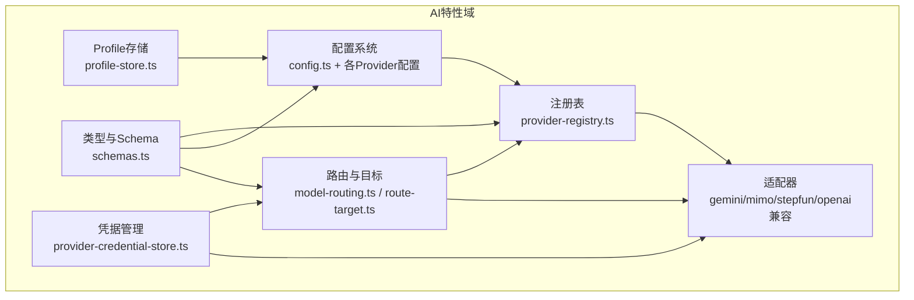
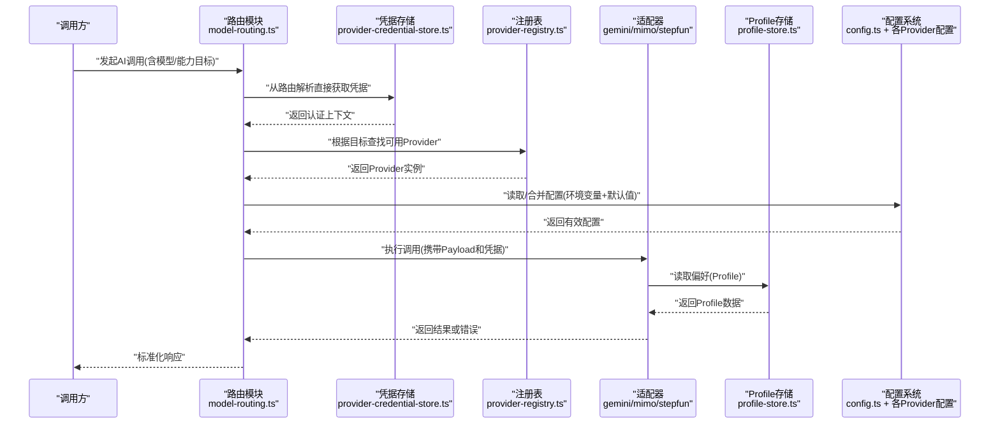
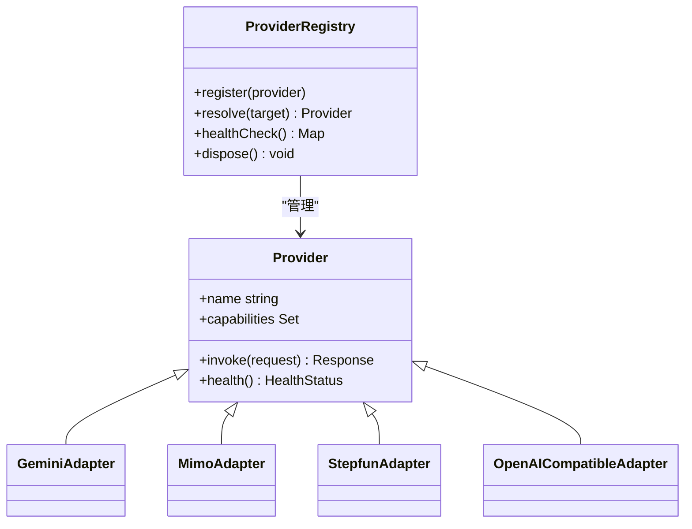
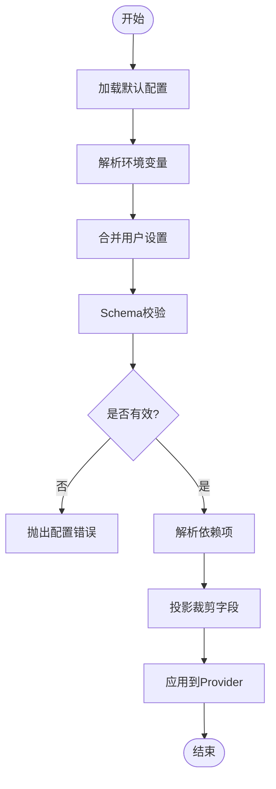
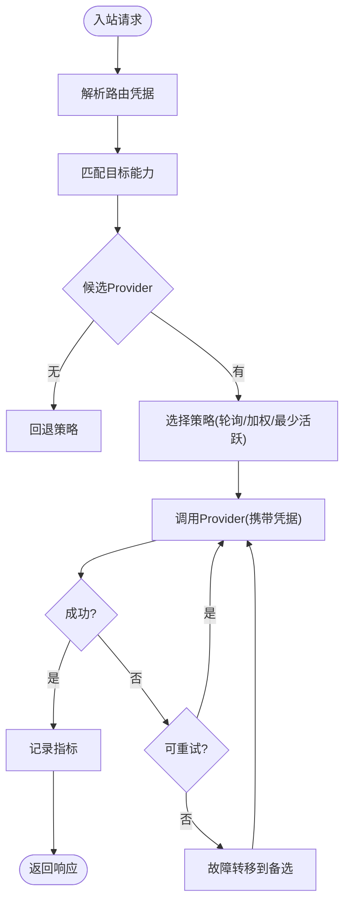
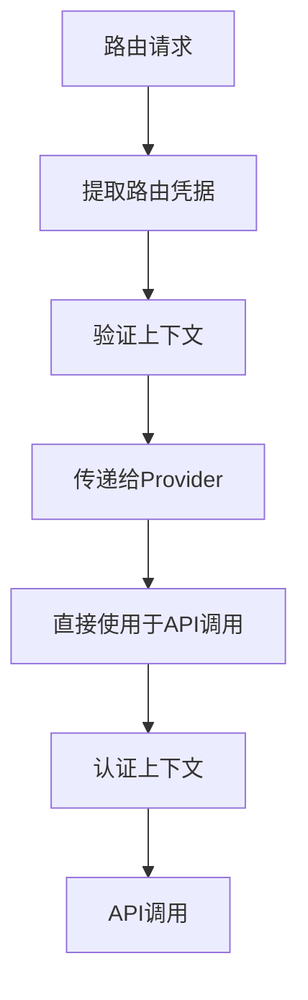
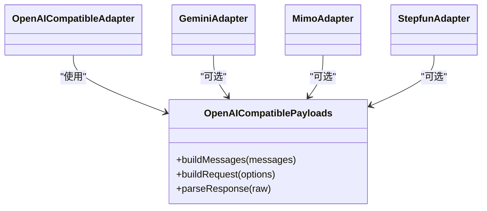
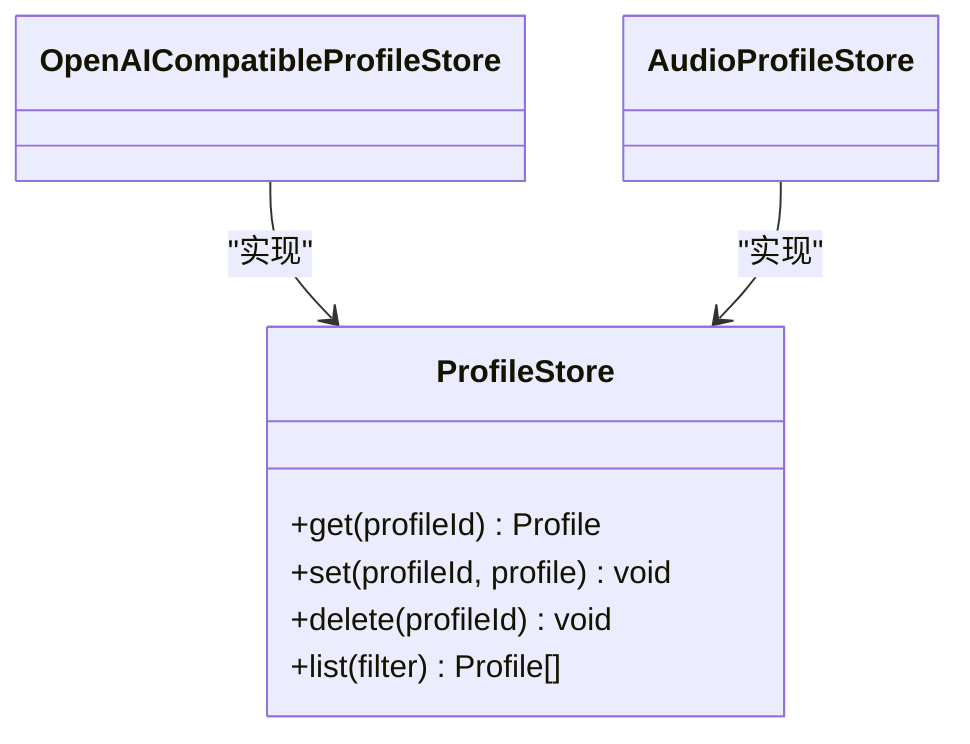
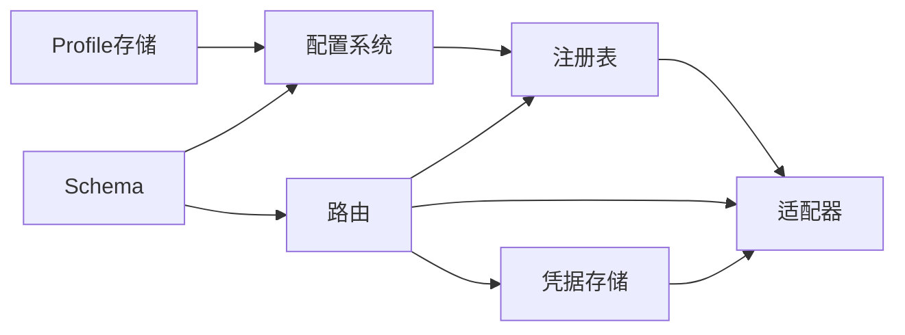

# Provider架构设计

<cite>
**本文档引用的文件**   
- [src/features/ai/provider-registry.ts](file://src/features/ai/provider-registry.ts)
- [src/features/ai/model-routing.ts](file://src/features/ai/model-routing.ts)
- [src/features/ai/config.ts](file://src/features/ai/config.ts)
- [src/features/ai/openai-compatible-config.ts](file://src/features/ai/openai-compatible-config.ts)
- [src/features/ai/gemini-config.ts](file://src/features/ai/gemini-config.ts)
- [src/features/ai/mimo-config.ts](file://src/features/ai/mimo-config.ts)
- [src/features/ai/openai-compatible-audio-config.ts](file://src/features/ai/openai-compatible-audio-config.ts)
- [src/features/ai/provider-settings-contract.ts](file://src/features/ai/provider-settings-contract.ts)
- [src/features/ai/provider-settings-validation.ts](file://src/features/ai/provider-settings-validation.ts)
- [src/features/ai/provider-settings-dependencies.ts](file://src/features/ai/provider-settings-dependencies.ts)
- [src/features/ai/provider-settings-projection.ts](file://src/features/ai/provider-settings-projection.ts)
- [src/features/ai/route-target.ts](file://src/features/ai/route-target.ts)
- [src/features/ai/route-provider-defaults.ts](file://src/features/ai/route-provider-defaults.ts)
- [src/features/ai/route-contract-error.ts](file://src/features/ai/route-contract-error.ts)
- [src/features/ai/gemini-adapter.ts](file://src/features/ai/gemini-adapter.ts)
- [src/features/ai/mimo-adapter.ts](file://src/features/ai/mimo-adapter.ts)
- [src/features/ai/stepfun-adapter.ts](file://src/features/ai/stepfun-adapter.ts)
- [src/features/ai/openai-compatible-payloads.ts](file://src/features/ai/openai-compatible-payloads.ts)
- [src/features/ai/openai-compatible-profile-store.ts](file://src/features/ai/openai-compatible-profile-store.ts)
- [src/features/ai/openai-compatible-audio-profile-store.ts](file://src/features/ai/openai-compatible-audio-profile-store.ts)
- [src/features/ai/index.ts](file://src/features/ai/index.ts)
- [src/features/ai/schemas.ts](file://src/features/ai/schemas.ts)
- [src/features/ai/provider-settings-apply.ts](file://src/features/ai/provider-settings-apply.ts)
- [src/features/credentials/provider-credential-store.ts](file://src/features/credentials/provider-credential-store.ts)
- [src/features/credentials/credential-envelope.ts](file://src/features/credentials/credential-envelope.ts)
</cite>

## 更新摘要
**所做更改**   
- 更新了凭证管理章节，反映PI Provider现在直接从服务器路由解析中消费凭据的新机制
- 修改了架构图以显示新的凭据流和认证上下文传递
- 增强了故障排查指南，包含新的凭据验证问题
- 更新了扩展开发指南，说明新的凭据注入模式

## 目录
1. [简介](#简介)
2. [项目结构](#项目结构)
3. [核心组件](#核心组件)
4. [架构总览](#架构总览)
5. [详细组件分析](#详细组件分析)
6. [依赖关系分析](#依赖关系分析)
7. [性能考量](#性能考量)
8. [故障排查指南](#故障排查指南)
9. [结论](#结论)
10. [附录：扩展新AI提供商开发指南](#附录扩展新ai提供商开发指南)

## 简介
本文件系统性阐述PurpleInk的Provider架构设计，围绕"统一的AI服务接口抽象、动态插件机制、适配器模式"等核心概念展开。重点说明：
- Provider注册表的工作机制（发现、生命周期、依赖注入）
- 配置管理系统（验证、环境变量处理、默认值管理）
- **新增：直接凭据消费机制** - PI Provider现在直接从服务器路由解析中消费凭据，消除了托管凭据与实际API调用之间的潜在分歧
- 路由策略（负载均衡、故障转移、性能监控）
- 扩展新AI提供商的规范与最佳实践

该文档面向不同技术背景的读者，提供从高层概览到代码级细节的分层说明，并辅以可视化图示帮助理解。

## 项目结构
Provider相关能力集中在 src/features/ai 目录下，采用按功能域划分的组织方式：
- 统一接口与注册表：provider-registry.ts、index.ts、schemas.ts
- 配置系统：config.ts、openai-compatible-config.ts、gemini-config.ts、mimo-config.ts、openai-compatible-audio-config.ts
- 设置契约与校验：provider-settings-contract.ts、provider-settings-validation.ts、provider-settings-dependencies.ts、provider-settings-projection.ts、provider-settings-apply.ts
- 路由与目标选择：model-routing.ts、route-target.ts、route-provider-defaults.ts、route-contract-error.ts
- 适配器实现：gemini-adapter.ts、mimo-adapter.ts、stepfun-adapter.ts、openai-compatible-payloads.ts
- 配置文件存储：openai-compatible-profile-store.ts、openai-compatible-audio-profile-store.ts
- **新增：凭据管理**：provider-credential-store.ts、credential-envelope.ts

**图表来源**
- [src/features/ai/provider-registry.ts](file://src/features/ai/provider-registry.ts)
- [src/features/ai/config.ts](file://src/features/ai/config.ts)
- [src/features/ai/model-routing.ts](file://src/features/ai/model-routing.ts)
- [src/features/ai/gemini-adapter.ts](file://src/features/ai/gemini-adapter.ts)
- [src/features/ai/mimo-adapter.ts](file://src/features/ai/mimo-adapter.ts)
- [src/features/ai/stepfun-adapter.ts](file://src/features/ai/stepfun-adapter.ts)
- [src/features/ai/openai-compatible-payloads.ts](file://src/features/ai/openai-compatible-payloads.ts)
- [src/features/ai/openai-compatible-profile-store.ts](file://src/features/ai/openai-compatible-profile-store.ts)
- [src/features/ai/openai-compatible-audio-profile-store.ts](file://src/features/ai/openai-compatible-audio-profile-store.ts)
- [src/features/ai/schemas.ts](file://src/features/ai/schemas.ts)
- [src/features/credentials/provider-credential-store.ts](file://src/features/credentials/provider-credential-store.ts)
- [src/features/credentials/credential-envelope.ts](file://src/features/credentials/credential-envelope.ts)

**章节来源**
- [src/features/ai/index.ts](file://src/features/ai/index.ts)
- [src/features/ai/schemas.ts](file://src/features/ai/schemas.ts)

## 核心组件
- 统一接口抽象：定义跨Provider一致的调用契约，屏蔽底层差异，使上层业务无需关心具体实现。
- 动态插件机制：通过注册表在运行时发现并加载Provider，支持热插拔与按需启用。
- 适配器设计模式：将不同厂商API的差异封装为统一适配层，保证调用一致性与可测试性。
- 配置系统：集中管理各Provider的配置项，包含校验、默认值、环境变量解析与合并。
- **新增：直接凭据消费机制** - 从服务器路由解析直接获取凭据，确保认证上下文一致性。
- 路由策略：基于模型/能力维度进行请求分发，支持负载均衡、故障转移与性能指标采集。
- Profile存储：持久化或缓存Provider的认证与偏好配置，便于会话与多租户隔离。

**章节来源**
- [src/features/ai/provider-registry.ts](file://src/features/ai/provider-registry.ts)
- [src/features/ai/config.ts](file://src/features/ai/config.ts)
- [src/features/ai/model-routing.ts](file://src/features/ai/model-routing.ts)
- [src/features/ai/provider-settings-contract.ts](file://src/features/ai/provider-settings-contract.ts)
- [src/features/ai/provider-settings-validation.ts](file://src/features/ai/provider-settings-validation.ts)
- [src/features/ai/provider-settings-dependencies.ts](file://src/features/ai/provider-settings-dependencies.ts)
- [src/features/ai/provider-settings-projection.ts](file://src/features/ai/provider-settings-projection.ts)
- [src/features/ai/provider-settings-apply.ts](file://src/features/ai/provider-settings-apply.ts)
- [src/features/ai/openai-compatible-profile-store.ts](file://src/features/ai/openai-compatible-profile-store.ts)
- [src/features/ai/openai-compatible-audio-profile-store.ts](file://src/features/ai/openai-compatible-audio-profile-store.ts)
- [src/features/credentials/provider-credential-store.ts](file://src/features/credentials/provider-credential-store.ts)
- [src/features/credentials/credential-envelope.ts](file://src/features/credentials/credential-envelope.ts)

## 架构总览
下图展示了从请求进入、路由决策、凭据解析、Provider调用到结果返回的整体流程，以及配置与Profile存储的交互。**已更新**以反映新的直接凭据消费机制。

**图表来源**
- [src/features/ai/model-routing.ts](file://src/features/ai/model-routing.ts)
- [src/features/credentials/provider-credential-store.ts](file://src/features/credentials/provider-credential-store.ts)
- [src/features/ai/provider-registry.ts](file://src/features/ai/provider-registry.ts)
- [src/features/ai/gemini-adapter.ts](file://src/features/ai/gemini-adapter.ts)
- [src/features/ai/mimo-adapter.ts](file://src/features/ai/mimo-adapter.ts)
- [src/features/ai/stepfun-adapter.ts](file://src/features/ai/stepfun-adapter.ts)
- [src/features/ai/openai-compatible-profile-store.ts](file://src/features/ai/openai-compatible-profile-store.ts)
- [src/features/ai/openai-compatible-audio-profile-store.ts](file://src/features/ai/openai-compatible-audio-profile-store.ts)
- [src/features/ai/config.ts](file://src/features/ai/config.ts)

## 详细组件分析

### 注册表与动态插件机制
- 职责：维护Provider元数据与实例，提供按名称/能力检索、生命周期管理与依赖注入。
- 关键点：
  - 发现：启动时扫描已注册的Provider，构建索引。
  - 生命周期：初始化、预热、健康检查、优雅关闭。
  - 依赖注入：为Provider注入配置、日志、存储等公共能力。
  - 容错：对不可用Provider进行降级与剔除。

**图表来源**
- [src/features/ai/provider-registry.ts](file://src/features/ai/provider-registry.ts)
- [src/features/ai/gemini-adapter.ts](file://src/features/ai/gemini-adapter.ts)
- [src/features/ai/mimo-adapter.ts](file://src/features/ai/mimo-adapter.ts)
- [src/features/ai/stepfun-adapter.ts](file://src/features/ai/stepfun-adapter.ts)

**章节来源**
- [src/features/ai/provider-registry.ts](file://src/features/ai/provider-registry.ts)

### 配置管理系统
- 职责：集中管理各Provider的配置项，包括校验、默认值、环境变量解析与合并。
- 关键点：
  - 分层配置：全局默认值 -> 环境变量 -> 用户设置 -> 运行时覆盖。
  - 校验：使用Schema约束必填字段、取值范围与格式。
  - 依赖解析：支持配置项之间的引用与计算。
  - 投影与裁剪：仅暴露必要字段给调用方，避免泄露敏感信息。
  - 应用：将最终配置应用到Provider实例。

**图表来源**
- [src/features/ai/config.ts](file://src/features/ai/config.ts)
- [src/features/ai/provider-settings-contract.ts](file://src/features/ai/provider-settings-contract.ts)
- [src/features/ai/provider-settings-validation.ts](file://src/features/ai/provider-settings-validation.ts)
- [src/features/ai/provider-settings-dependencies.ts](file://src/features/ai/provider-settings-dependencies.ts)
- [src/features/ai/provider-settings-projection.ts](file://src/features/ai/provider-settings-projection.ts)
- [src/features/ai/provider-settings-apply.ts](file://src/features/ai/provider-settings-apply.ts)

**章节来源**
- [src/features/ai/config.ts](file://src/features/ai/config.ts)
- [src/features/ai/openai-compatible-config.ts](file://src/features/ai/openai-compatible-config.ts)
- [src/features/ai/gemini-config.ts](file://src/features/ai/gemini-config.ts)
- [src/features/ai/mimo-config.ts](file://src/features/ai/mimo-config.ts)
- [src/features/ai/openai-compatible-audio-config.ts](file://src/features/ai/openai-compatible-audio-config.ts)
- [src/features/ai/provider-settings-contract.ts](file://src/features/ai/provider-settings-contract.ts)
- [src/features/ai/provider-settings-validation.ts](file://src/features/ai/provider-settings-validation.ts)
- [src/features/ai/provider-settings-dependencies.ts](file://src/features/ai/provider-settings-dependencies.ts)
- [src/features/ai/provider-settings-projection.ts](file://src/features/ai/provider-settings-projection.ts)
- [src/features/ai/provider-settings-apply.ts](file://src/features/ai/provider-settings-apply.ts)

### 路由策略与目标选择
- 职责：根据请求的目标（模型/能力）选择合适的Provider，并实施负载均衡、故障转移与性能监控。
- 关键点：
  - 目标匹配：基于能力集合与权重进行匹配。
  - 负载均衡：轮询、加权、最少活跃连接等策略。
  - 故障转移：失败重试、降级到备选Provider。
  - 性能监控：记录延迟、成功率、吞吐等指标。
  - **新增：直接凭据解析** - 从服务器路由上下文中直接获取凭据，避免环境变量二次读取。

**图表来源**
- [src/features/ai/model-routing.ts](file://src/features/ai/model-routing.ts)
- [src/features/ai/route-target.ts](file://src/features/ai/route-target.ts)
- [src/features/ai/route-provider-defaults.ts](file://src/features/ai/route-provider-defaults.ts)
- [src/features/ai/route-contract-error.ts](file://src/features/ai/route-contract-error.ts)
- [src/features/credentials/provider-credential-store.ts](file://src/features/credentials/provider-credential-store.ts)

**章节来源**
- [src/features/ai/model-routing.ts](file://src/features/ai/model-routing.ts)
- [src/features/ai/route-target.ts](file://src/features/ai/route-target.ts)
- [src/features/ai/route-provider-defaults.ts](file://src/features/ai/route-provider-defaults.ts)
- [src/features/ai/route-contract-error.ts](file://src/features/ai/route-contract-error.ts)

### 直接凭据消费机制
**新增** - 这是本次更新的核心变更，PI Provider现在直接从服务器路由解析中消费凭据，而不是进行环境变量的二次读取。

- 职责：确保认证上下文的一致性和安全性，消除托管凭据与实际API调用之间的潜在分歧。
- 关键改进：
  - 直接解析：从服务器路由上下文中直接获取凭据，避免中间层转换。
  - 上下文传递：凭据作为请求上下文的一部分传递给Provider。
  - 安全增强：减少凭据在内存中的驻留时间和暴露面。
  - 一致性保证：确保使用的凭据与路由解析时的凭据完全一致。

**图表来源**
- [src/features/credentials/provider-credential-store.ts](file://src/features/credentials/provider-credential-store.ts)
- [src/features/credentials/credential-envelope.ts](file://src/features/credentials/credential-envelope.ts)
- [src/features/ai/model-routing.ts](file://src/features/ai/model-routing.ts)

**章节来源**
- [src/features/credentials/provider-credential-store.ts](file://src/features/credentials/provider-credential-store.ts)
- [src/features/credentials/credential-envelope.ts](file://src/features/credentials/credential-envelope.ts)

### 适配器实现与OpenAI兼容层
- 职责：将不同厂商API的差异封装为统一调用接口，并提供OpenAI兼容的Payload构造与响应解析。
- 关键点：
  - 适配器：Gemini、Mimo、Stepfun各自实现特定协议。
  - OpenAI兼容：统一消息体、流式响应、错误码映射。
  - Profile：认证令牌、端点、模型映射等存储在Profile中。
  - **新增：直接凭据集成** - 适配器现在直接从路由上下文接收凭据，无需额外解析。

**图表来源**
- [src/features/ai/openai-compatible-payloads.ts](file://src/features/ai/openai-compatible-payloads.ts)
- [src/features/ai/gemini-adapter.ts](file://src/features/ai/gemini-adapter.ts)
- [src/features/ai/mimo-adapter.ts](file://src/features/ai/mimo-adapter.ts)
- [src/features/ai/stepfun-adapter.ts](file://src/features/ai/stepfun-adapter.ts)

**章节来源**
- [src/features/ai/openai-compatible-payloads.ts](file://src/features/ai/openai-compatible-payloads.ts)
- [src/features/ai/gemini-adapter.ts](file://src/features/ai/gemini-adapter.ts)
- [src/features/ai/mimo-adapter.ts](file://src/features/ai/mimo-adapter.ts)
- [src/features/ai/stepfun-adapter.ts](file://src/features/ai/stepfun-adapter.ts)

### Profile存储与配置持久化
- 职责：持久化或缓存Provider的认证信息与偏好配置，支持多租户与会话隔离。
- 关键点：
  - 存储后端：内存、文件系统或数据库。
  - 安全：敏感字段加密、最小权限访问。
  - 更新：增量更新与版本控制。

**图表来源**
- [src/features/ai/openai-compatible-profile-store.ts](file://src/features/ai/openai-compatible-profile-store.ts)
- [src/features/ai/openai-compatible-audio-profile-store.ts](file://src/features/ai/openai-compatible-audio-profile-store.ts)

**章节来源**
- [src/features/ai/openai-compatible-profile-store.ts](file://src/features/ai/openai-compatible-profile-store.ts)
- [src/features/ai/openai-compatible-audio-profile-store.ts](file://src/features/ai/openai-compatible-audio-profile-store.ts)

## 依赖关系分析
- 低耦合：注册表与适配器解耦，通过统一接口通信。
- 高内聚：配置、校验、依赖解析、投影与应用逻辑集中在配置子系统。
- 外部依赖：HTTP客户端、日志、存储后端等通过依赖注入引入。
- 循环依赖：通过接口与工厂模式避免直接循环引用。
- **新增：凭据依赖** - 路由模块现在依赖凭据存储来获取认证上下文。

**图表来源**
- [src/features/ai/provider-registry.ts](file://src/features/ai/provider-registry.ts)
- [src/features/ai/config.ts](file://src/features/ai/config.ts)
- [src/features/ai/model-routing.ts](file://src/features/ai/model-routing.ts)
- [src/features/ai/schemas.ts](file://src/features/ai/schemas.ts)
- [src/features/credentials/provider-credential-store.ts](file://src/features/credentials/provider-credential-store.ts)

**章节来源**
- [src/features/ai/provider-registry.ts](file://src/features/ai/provider-registry.ts)
- [src/features/ai/config.ts](file://src/features/ai/config.ts)
- [src/features/ai/model-routing.ts](file://src/features/ai/model-routing.ts)
- [src/features/ai/schemas.ts](file://src/features/ai/schemas.ts)

## 性能考量
- 连接复用：HTTP连接池与超时控制，减少握手开销。
- 缓存策略：对热点配置与Profile进行缓存，降低I/O压力。
- 并发控制：限制并发数与队列长度，防止雪崩。
- 指标采集：记录延迟分位、错误率、吞吐，用于自动扩缩容与告警。
- 流式处理：大模型输出流式返回，提升首字节时间与用户体验。
- **新增：凭据解析优化** - 直接从路由上下文获取凭据，减少了额外的环境变量读取和解析开销。

## 故障排查指南
- 配置错误：检查Schema校验失败原因，确认环境变量与默认值是否正确合并。
- 路由失败：查看目标能力匹配与权重配置，确认候选Provider健康状态。
- 适配器异常：核对Payload构造与响应解析，检查认证令牌与端点配置。
- Profile问题：确认存储后端连通性与权限，检查敏感字段是否被正确加密。
- 性能退化：分析指标与链路追踪，定位瓶颈节点与慢查询。
- **新增：凭据相关问题** - 检查路由上下文中的凭据是否正确传递，确认凭据存储的可用性，验证凭据有效期和作用域。

**章节来源**
- [src/features/ai/route-contract-error.ts](file://src/features/ai/route-contract-error.ts)
- [src/features/ai/provider-settings-validation.ts](file://src/features/ai/provider-settings-validation.ts)
- [src/features/ai/openai-compatible-payloads.ts](file://src/features/ai/openai-compatible-payloads.ts)
- [src/features/credentials/provider-credential-store.ts](file://src/features/credentials/provider-credential-store.ts)

## 结论
PurpleInk的Provider架构通过统一接口抽象、动态注册与适配器模式，实现了高度可扩展与可维护的AI服务集成体系。**新增的直接凭据消费机制**进一步提升了安全性和一致性，消除了托管凭据与实际API调用之间的潜在分歧。配置系统与路由策略保证了灵活性与稳定性，Profile存储提供了安全的凭据管理能力。遵循本文档的扩展指南，可以快速接入新的AI提供商并保持系统一致性。

## 附录：扩展新AI提供商开发指南
- 步骤概览：
  1. 定义适配器：实现统一接口，封装厂商API差异。
  2. 编写配置：提供默认值、环境变量映射与Schema校验规则。
  3. 注册Provider：在注册表中声明名称、能力与优先级。
  4. 配置路由：为目标能力添加路由规则与权重。
  5. **新增：集成直接凭据** - 确保适配器能从路由上下文直接接收凭据。
  6. 测试验证：单元测试覆盖Payload构造、错误处理与边界条件。
- 最佳实践：
  - 保持适配器无状态，依赖注入外部资源。
  - 使用OpenAI兼容层减少重复实现。
  - 严格校验输入输出，避免脏数据传播。
  - 记录关键指标与上下文，便于排障。
  - **新增：利用直接凭据机制** - 避免在适配器中进行额外的凭据解析。
- 常见问题：
  - 环境变量未生效：检查命名约定与加载顺序。
  - 路由不命中：确认能力集合与目标匹配逻辑。
  - 认证失败：核对令牌有效期与作用域。
  - 性能抖动：调整并发与超时参数，启用重试与熔断。
  - **新增：凭据不一致** - 确认所有组件都使用相同的凭据来源，避免混合使用环境变量和路由凭据。

**章节来源**
- [src/features/ai/gemini-adapter.ts](file://src/features/ai/gemini-adapter.ts)
- [src/features/ai/mimo-adapter.ts](file://src/features/ai/mimo-adapter.ts)
- [src/features/ai/stepfun-adapter.ts](file://src/features/ai/stepfun-adapter.ts)
- [src/features/ai/openai-compatible-config.ts](file://src/features/ai/openai-compatible-config.ts)
- [src/features/ai/gemini-config.ts](file://src/features/ai/gemini-config.ts)
- [src/features/ai/mimo-config.ts](file://src/features/ai/mimo-config.ts)
- [src/features/ai/provider-registry.ts](file://src/features/ai/provider-registry.ts)
- [src/features/ai/model-routing.ts](file://src/features/ai/model-routing.ts)
- [src/features/ai/provider-settings-validation.ts](file://src/features/ai/provider-settings-validation.ts)
- [src/features/credentials/provider-credential-store.ts](file://src/features/credentials/provider-credential-store.ts)
- [src/features/credentials/credential-envelope.ts](file://src/features/credentials/credential-envelope.ts)