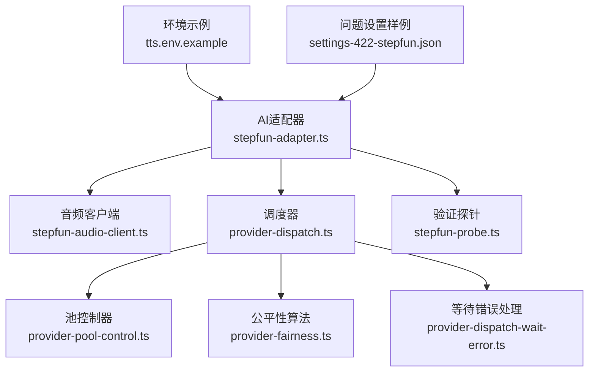
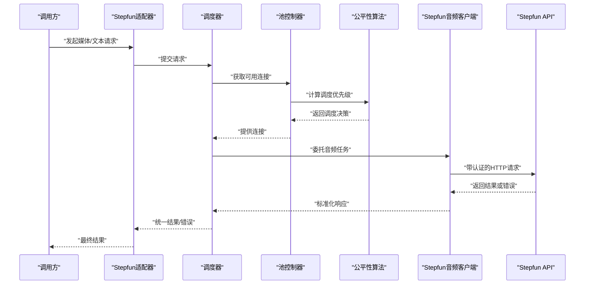
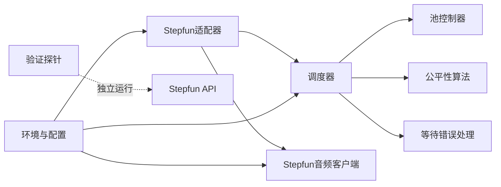

# Stepfun适配器

<cite>
**本文引用的文件**   
- [stepfun-adapter.ts](file://src/features/ai/stepfun-adapter.ts)
- [stepfun-adapter.test.ts](file://src/features/ai/stepfun-adapter.test.ts)
- [stepfun-audio-client.ts](file://src/features/audio/stepfun-audio-client.ts)
- [stepfun-audio-client.test.ts](file://src/features/audio/stepfun-audio-client.test.ts)
- [provider-dispatch-wait-error.ts](file://src/features/ai/provider-dispatch-wait-error.ts)
- [provider-pool-control.ts](file://src/features/ai/provider-pool-control.ts)
- [provider-fairness.ts](file://src/features/ai/provider-fairness.ts)
- [provider-dispatch.ts](file://src/features/ai/provider-dispatch.ts)
- [stepfun-probe.ts](file://scripts/verify/stepfun-probe.ts)
- [settings-422-stepfun.json](file://docs/issues/evidence/issue-013/settings-422-stepfun.json)
- [tts.env.example](file://config/tts.env.example)
</cite>

## 更新摘要
**变更内容**   
- 新增模块化调度系统支持，集成独立池控制和公平性算法
- 增强错误处理机制，通过provider-dispatch-wait-error模块提供统一的等待错误处理
- 更新架构设计以反映新的调度层和池管理功能
- 扩展并发控制策略和资源管理机制

## 目录
1. [简介](#简介)
2. [项目结构](#项目结构)
3. [核心组件](#核心组件)
4. [架构总览](#架构总览)
5. [详细组件分析](#详细组件分析)
6. [依赖分析](#依赖分析)
7. [性能考虑](#性能考虑)
8. [故障排查指南](#故障排查指南)
9. [结论](#结论)
10. [附录](#附录)

## 简介
本文件面向Stepfun AI适配器的集成与使用，覆盖认证机制、请求构造、响应解析、配置选项（API端点、模型参数、并发控制）、媒体处理能力（音频生成、视频处理、字幕生成等）、错误处理策略，以及集成示例与调试方法。文档基于仓库中的Stepfun相关实现进行梳理，确保内容与实际代码一致。

**更新** 本次更新重点反映了StepFun（阶跃星辰）提供商已集成到新的模块化调度系统中，包括独立的池控制、公平性算法和通过provider-dispatch-wait-error模块增强的错误处理功能。

## 项目结构
Stepfun相关能力分布在以下位置：
- AI层适配器：src/features/ai/stepfun-adapter.ts
- 音频客户端：src/features/audio/stepfun-audio-client.ts
- 调度系统：src/features/ai/provider-dispatch.ts
- 池控制：src/features/ai/provider-pool-control.ts
- 公平性算法：src/features/ai/provider-fairness.ts
- 错误处理：src/features/ai/provider-dispatch-wait-error.ts
- 验证脚本：scripts/verify/stepfun-probe.ts
- 配置与环境：config/tts.env.example
- 问题证据与设置样例：docs/issues/evidence/issue-013/settings-422-stepfun.json

**图表来源**
- [stepfun-adapter.ts](file://src/features/ai/stepfun-adapter.ts)
- [stepfun-audio-client.ts](file://src/features/audio/stepfun-audio-client.ts)
- [provider-dispatch.ts](file://src/features/ai/provider-dispatch.ts)
- [provider-pool-control.ts](file://src/features/ai/provider-pool-control.ts)
- [provider-fairness.ts](file://src/features/ai/provider-fairness.ts)
- [provider-dispatch-wait-error.ts](file://src/features/ai/provider-dispatch-wait-error.ts)
- [stepfun-probe.ts](file://scripts/verify/stepfun-probe.ts)
- [tts.env.example](file://config/tts.env.example)
- [settings-422-stepfun.json](file://docs/issues/evidence/issue-013/settings-422-stepfun.json)

**章节来源**
- [stepfun-adapter.ts](file://src/features/ai/stepfun-adapter.ts)
- [stepfun-audio-client.ts](file://src/features/audio/stepfun-audio-client.ts)
- [provider-dispatch.ts](file://src/features/ai/provider-dispatch.ts)
- [provider-pool-control.ts](file://src/features/ai/provider-pool-control.ts)
- [provider-fairness.ts](file://src/features/ai/provider-fairness.ts)
- [provider-dispatch-wait-error.ts](file://src/features/ai/provider-dispatch-wait-error.ts)
- [stepfun-probe.ts](file://scripts/verify/stepfun-probe.ts)
- [tts.env.example](file://config/tts.env.example)
- [settings-422-stepfun.json](file://docs/issues/evidence/issue-013/settings-422-stepfun.json)

## 核心组件
- Stepfun AI适配器：统一对外暴露Stepfun能力的调用入口，封装认证、请求构建、响应解析与错误映射。
- Stepfun音频客户端：专注音频相关的请求与响应处理，包括TTS或音频生成流程。
- 模块化调度器：负责请求分发、负载均衡和池管理。
- 池控制器：管理Stepfun API连接池，控制并发和资源分配。
- 公平性算法：确保多个请求之间的公平调度和资源分配。
- 等待错误处理：提供统一的等待超时和取消机制。
- 验证探针：用于快速探测Stepfun服务连通性与基本能力。
- 配置与环境：通过环境变量与配置文件管理API端点、密钥、模型参数与并发限制。

**更新** 新增了调度器、池控制器、公平性算法和等待错误处理等核心组件，形成了完整的模块化调度系统。

**章节来源**
- [stepfun-adapter.ts](file://src/features/ai/stepfun-adapter.ts)
- [stepfun-audio-client.ts](file://src/features/audio/stepfun-audio-client.ts)
- [provider-dispatch.ts](file://src/features/ai/provider-dispatch.ts)
- [provider-pool-control.ts](file://src/features/ai/provider-pool-control.ts)
- [provider-fairness.ts](file://src/features/ai/provider-fairness.ts)
- [provider-dispatch-wait-error.ts](file://src/features/ai/provider-dispatch-wait-error.ts)
- [stepfun-probe.ts](file://scripts/verify/stepfun-probe.ts)
- [tts.env.example](file://config/tts.env.example)

## 架构总览
Stepfun适配器位于AI层，向上被业务模块调用，向下通过音频客户端访问Stepfun API。新增的调度系统提供了更强大的请求管理和资源控制能力。

**图表来源**
- [stepfun-adapter.ts](file://src/features/ai/stepfun-adapter.ts)
- [provider-dispatch.ts](file://src/features/ai/provider-dispatch.ts)
- [provider-pool-control.ts](file://src/features/ai/provider-pool-control.ts)
- [provider-fairness.ts](file://src/features/ai/provider-fairness.ts)
- [stepfun-audio-client.ts](file://src/features/audio/stepfun-audio-client.ts)

## 详细组件分析

### Stepfun AI适配器
- 职责
  - 统一认证：从配置中读取并注入鉴权信息。
  - 请求构造：根据目标能力组装请求体与查询参数。
  - 响应解析：将Stepfun返回转换为内部统一数据结构。
  - 错误映射：将网络异常、业务错误码映射为可诊断的错误对象。
- 关键行为
  - 支持多模态能力路由（如音频生成、字幕生成等），由上层传入能力标识与参数。
  - 对并发与限流进行保护，避免超出平台配额。
  - 集成新的调度系统，提供更智能的请求分发。
- 典型调用路径
  - 入参校验 → 构建请求 → 调度器分发 → 池管理 → 调用音频客户端 → 解析响应 → 返回结果

**更新** 现在集成了模块化调度系统，通过调度器进行请求分发，提高了系统的可扩展性和可靠性。

**章节来源**
- [stepfun-adapter.ts](file://src/features/ai/stepfun-adapter.ts)

### Stepfun音频客户端
- 职责
  - 负责与Stepfun音频接口交互，包括TTS、音频生成、可能的字幕生成等。
  - 处理上传/下载大文件的分块与重试逻辑（视具体接口而定）。
  - 统一错误码与异常类型，便于上层处理。
- 关键行为
  - 认证头注入、超时控制、重试策略。
  - 响应流式或非流式数据的统一封装。
  - 与调度系统集成，支持更好的资源管理。
- 典型调用路径
  - 接收适配器请求 → 调度器协调 → 构造HTTP请求 → 发送并等待响应 → 解析数据 → 返回结构化结果

**更新** 增强了与调度系统的集成，支持更好的资源管理和错误处理。

**章节来源**
- [stepfun-audio-client.ts](file://src/features/audio/stepfun-audio-client.ts)

### 模块化调度器
- 职责
  - 统一管理所有提供商请求的分发和调度。
  - 协调池控制器和公平性算法，实现智能负载均衡。
  - 处理请求的生命周期管理，包括超时、取消和重试。
- 关键行为
  - 支持多种调度策略（轮询、加权、优先级等）。
  - 集成等待错误处理，提供统一的超时和取消机制。
  - 监控请求状态和性能指标。
- 典型调用路径
  - 接收请求 → 选择调度策略 → 协调池和公平性 → 执行请求 → 处理结果

**新增** 这是新引入的核心组件，为整个调度系统提供了统一的协调和管理能力。

**章节来源**
- [provider-dispatch.ts](file://src/features/ai/provider-dispatch.ts)

### 池控制器
- 职责
  - 管理Stepfun API的连接池，控制并发连接数。
  - 实现连接复用和生命周期管理。
  - 监控连接状态和健康状况。
- 关键行为
  - 动态调整池大小，适应负载变化。
  - 实现连接的优雅关闭和清理。
  - 提供连接健康检查和自动恢复。
- 典型调用路径
  - 请求连接 → 检查可用性 → 创建或复用连接 → 归还连接 → 清理资源

**新增** 这是新引入的组件，提供了专业的连接池管理能力。

**章节来源**
- [provider-pool-control.ts](file://src/features/ai/provider-pool-control.ts)

### 公平性算法
- 职责
  - 实现公平的请求调度算法，确保多个请求之间的公平性。
  - 防止请求饥饿和资源垄断。
  - 支持多种公平性策略（FIFO、加权公平、优先级队列等）。
- 关键行为
  - 动态调整调度权重，适应不同请求的优先级。
  - 监控请求等待时间和完成时间。
  - 提供公平性指标和报告。
- 典型调用路径
  - 接收待调度请求 → 计算优先级 → 选择下一个请求 → 执行调度

**新增** 这是新引入的组件，确保了多请求场景下的公平性和效率。

**章节来源**
- [provider-fairness.ts](file://src/features/ai/provider-fairness.ts)

### 等待错误处理
- 职责
  - 提供统一的等待超时和取消机制。
  - 处理请求等待过程中的各种异常情况。
  - 实现优雅的错误传播和恢复。
- 关键行为
  - 支持自定义超时策略和取消信号。
  - 区分不同类型的等待错误（超时、取消、中断等）。
  - 提供详细的错误信息和上下文。
- 典型调用路径
  - 启动等待 → 监控状态 → 处理超时/取消 → 抛出统一错误

**新增** 这是新引入的组件，为调度系统提供了可靠的错误处理能力。

**章节来源**
- [provider-dispatch-wait-error.ts](file://src/features/ai/provider-dispatch-wait-error.ts)

### 验证探针
- 职责
  - 快速检测Stepfun服务的连通性、鉴权有效性及基础能力可用性。
  - 输出诊断信息，辅助定位环境问题与配置错误。
- 使用方式
  - 在本地或CI环境中运行，打印探测结果与耗时。
  - 支持批量测试和性能基准测试。

**章节来源**
- [stepfun-probe.ts](file://scripts/verify/stepfun-probe.ts)

### 配置与环境
- 环境变量
  - 参考tts.env.example，包含API密钥、端点、模型名称、并发限制等。
- 设置样例
  - settings-422-stepfun.json展示了常见配置项与错误场景的对照，便于核对字段命名与取值范围。
- 调度配置
  - 新增调度策略、池大小、公平性算法等配置选项。

**更新** 增加了调度系统相关的配置选项，支持更精细的资源管理。

**章节来源**
- [tts.env.example](file://config/tts.env.example)
- [settings-422-stepfun.json](file://docs/issues/evidence/issue-013/settings-422-stepfun.json)

## 依赖分析
Stepfun适配器与音频客户端之间存在明确的依赖关系；新增的调度系统组件之间也有清晰的依赖层次；验证探针独立运行，不耦合业务逻辑。配置与环境变量是运行时依赖的关键来源。

**图表来源**
- [stepfun-adapter.ts](file://src/features/ai/stepfun-adapter.ts)
- [stepfun-audio-client.ts](file://src/features/audio/stepfun-audio-client.ts)
- [provider-dispatch.ts](file://src/features/ai/provider-dispatch.ts)
- [provider-pool-control.ts](file://src/features/ai/provider-pool-control.ts)
- [provider-fairness.ts](file://src/features/ai/provider-fairness.ts)
- [provider-dispatch-wait-error.ts](file://src/features/ai/provider-dispatch-wait-error.ts)
- [stepfun-probe.ts](file://scripts/verify/stepfun-probe.ts)
- [tts.env.example](file://config/tts.env.example)

**章节来源**
- [stepfun-adapter.ts](file://src/features/ai/stepfun-adapter.ts)
- [stepfun-audio-client.ts](file://src/features/audio/stepfun-audio-client.ts)
- [provider-dispatch.ts](file://src/features/ai/provider-dispatch.ts)
- [provider-pool-control.ts](file://src/features/ai/provider-pool-control.ts)
- [provider-fairness.ts](file://src/features/ai/provider-fairness.ts)
- [provider-dispatch-wait-error.ts](file://src/features/ai/provider-dispatch-wait-error.ts)
- [stepfun-probe.ts](file://scripts/verify/stepfun-probe.ts)
- [tts.env.example](file://config/tts.env.example)

## 性能考虑
- 并发控制
  - 通过配置限制最大并发请求数，避免触发平台限流。
  - 对长耗时任务采用队列化与背压策略。
  - 利用池控制器优化连接复用和资源利用率。
- 超时与重试
  - 合理设置网络超时与重试次数，区分可重试与不可重试错误。
  - 通过等待错误处理提供统一的超时管理。
- 资源管理
  - 对大文件传输采用流式处理，减少内存占用。
  - 缓存热点配置与令牌，降低重复开销。
  - 动态调整池大小，适应负载变化。
- 调度优化
  - 使用公平性算法确保请求处理的公平性。
  - 实现智能负载均衡，提高整体吞吐量。
  - 监控性能指标，及时发现瓶颈。

**更新** 新增了调度优化相关的性能考虑，包括池管理、公平性算法和负载均衡等方面。

## 故障排查指南
- 常见问题
  - 鉴权失败：检查API密钥与端点是否正确，确认环境变量已加载。
  - 参数校验错误：对照settings-422-stepfun.json核对字段名与取值。
  - 网络异常：查看探针输出与日志，确认网络可达与代理设置。
  - 调度问题：检查调度器配置和池控制器状态。
  - 公平性问题：监控公平性算法的决策和请求等待时间。
  - 等待超时：查看等待错误处理的日志和超时配置。
- 诊断步骤
  - 运行验证探针，观察连通性与基础能力状态。
  - 启用详细日志，记录请求与响应摘要。
  - 逐步缩小范围：先最小化请求体，再逐步增加参数。
  - 检查调度器状态和池使用情况。
  - 监控公平性算法的性能指标。
- 恢复策略
  - 对可重试错误实施指数退避。
  - 对配额超限错误进行降级与排队。
  - 动态调整池大小和调度策略。
  - 重置等待超时和取消机制。

**更新** 新增了调度系统相关的故障排查内容，包括调度器、池控制器、公平性算法和等待错误处理等方面。

**章节来源**
- [stepfun-probe.ts](file://scripts/verify/stepfun-probe.ts)
- [settings-422-stepfun.json](file://docs/issues/evidence/issue-013/settings-422-stepfun.json)
- [provider-dispatch.ts](file://src/features/ai/provider-dispatch.ts)
- [provider-pool-control.ts](file://src/features/ai/provider-pool-control.ts)
- [provider-fairness.ts](file://src/features/ai/provider-fairness.ts)
- [provider-dispatch-wait-error.ts](file://src/features/ai/provider-dispatch-wait-error.ts)

## 结论
Stepfun适配器以清晰的职责边界与统一的错误处理，为上层业务提供稳定的Stepfun能力接入。通过环境变量与配置样例，可以快速完成部署与调优。新增的模块化调度系统提供了更强大的请求管理、资源控制和公平性保证能力。建议在生产环境结合探针与日志完善监控与告警，保障稳定性与可观测性。

**更新** 新的调度系统显著提升了Stepfun适配器的性能和可靠性，为大规模并发场景提供了更好的支持。

## 附录

### 集成示例与常用代码片段路径
- 初始化适配器与客户端：参考stepfun-adapter.ts与stepfun-audio-client.ts中的初始化与配置加载部分。
- 配置调度系统：参考provider-dispatch.ts、provider-pool-control.ts和provider-fairness.ts中的配置示例。
- 发起音频生成请求：参考stepfun-audio-client.ts中的音频生成方法。
- 健康检查与连通性测试：参考stepfun-probe.ts中的探针实现。
- 错误处理：参考provider-dispatch-wait-error.ts中的错误处理模式。

**更新** 新增了调度系统配置和错误处理的相关示例路径。

**章节来源**
- [stepfun-adapter.ts](file://src/features/ai/stepfun-adapter.ts)
- [stepfun-audio-client.ts](file://src/features/audio/stepfun-audio-client.ts)
- [provider-dispatch.ts](file://src/features/ai/provider-dispatch.ts)
- [provider-pool-control.ts](file://src/features/ai/provider-pool-control.ts)
- [provider-fairness.ts](file://src/features/ai/provider-fairness.ts)
- [provider-dispatch-wait-error.ts](file://src/features/ai/provider-dispatch-wait-error.ts)
- [stepfun-probe.ts](file://scripts/verify/stepfun-probe.ts)

### 测试方法与断言要点
- 单元测试
  - 参考stepfun-adapter.test.ts与stepfun-audio-client.test.ts，关注认证、请求构造、响应解析与错误映射的断言。
  - 新增调度器、池控制器、公平性算法的单元测试用例。
- 集成测试
  - 使用stepfun-probe.ts进行端到端连通性验证。
  - 测试调度系统的负载均衡和公平性表现。
- 性能测试
  - 模拟高并发场景，验证池控制和调度性能。
  - 监控公平性算法的效果和资源利用率。

**更新** 新增了调度系统相关的测试方法和性能测试指导。

**章节来源**
- [stepfun-adapter.test.ts](file://src/features/ai/stepfun-adapter.test.ts)
- [stepfun-audio-client.test.ts](file://src/features/audio/stepfun-audio-client.test.ts)
- [stepfun-probe.ts](file://scripts/verify/stepfun-probe.ts)

### 性能调优技巧
- 调整并发上限与超时时间，匹配平台配额与服务延迟。
- 对大文件传输启用流式读写，避免内存峰值过高。
- 缓存鉴权令牌与模型元数据，减少重复请求。
- 优化池大小配置，平衡连接复用和内存占用。
- 调整公平性算法参数，满足不同场景的公平性需求。
- 监控调度器性能指标，及时识别瓶颈和优化点。

**更新** 新增了调度系统相关的性能调优技巧，包括池配置、公平性算法和调度器优化等方面。