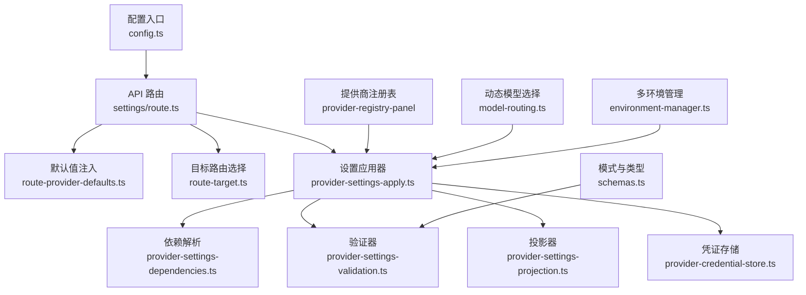
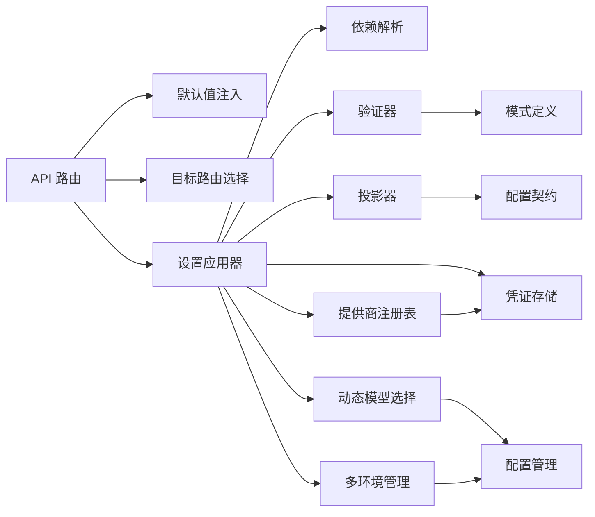

# 提供商设置管理

<cite>
**本文引用的文件**   
- [provider-settings-contract.ts](file://src/features/ai/provider-settings-contract.ts)
- [provider-settings-dependencies.ts](file://src/features/ai/provider-settings-dependencies.ts)
- [provider-settings-validation.ts](file://src/features/ai/provider-settings-validation.ts)
- [provider-settings-projection.ts](file://src/features/ai/provider-settings-projection.ts)
- [provider-settings-apply.ts](file://src/features/ai/provider-settings-apply.ts)
- [route-provider-defaults.ts](file://src/features/ai/route-provider-defaults.ts)
- [route-target.ts](file://src/features/ai/route-target.ts)
- [schemas.ts](file://src/features/ai/schemas.ts)
- [settings/route.ts](file://src/app/api/settings/route.ts)
- [settings/route.test.ts](file://src/app/api/settings/route.test.ts)
- [credentials/provider-credential-store.ts](file://src/features/credentials/provider-credential-store.ts)
- [config.ts](file://src/features/ai/config.ts)
</cite>

## 更新摘要
**变更内容**   
- 移除了直接供应商密钥输入字段，简化了设置界面
- 实现了服务器端管理的提供商注册表，通过 provider-registry-panel 进行管理
- 优化了提供商配置流程，将密钥管理从客户端转移到服务器端
- 增强了提供商注册表的集中管理能力
- 改进了设置界面的用户体验和安全性

## 目录
1. [简介](#简介)
2. [项目结构](#项目结构)
3. [核心组件](#核心组件)
4. [架构总览](#架构总览)
5. [详细组件分析](#详细组件分析)
6. [依赖关系分析](#依赖关系分析)
7. [性能考虑](#性能考虑)
8. [故障排查指南](#故障排查指南)
9. [结论](#结论)
10. [附录：API与使用示例](#附录api与使用示例)

## 简介
本文件面向"提供商设置管理"子系统，系统性阐述其架构设计与实现要点，覆盖配置契约、依赖管理、数据投影、设置应用流程（验证、解析、同步）、验证规则（格式、业务、安全）以及 API 与最佳实践。目标是帮助开发者快速理解并正确扩展新的 AI 提供商设置能力，同时确保系统的安全性与可维护性。

**更新** 本次更新重点简化了设置界面，移除了直接的供应商密钥输入字段，改为通过服务器端提供商注册表进行统一管理，提升了安全性和用户体验。

## 项目结构
提供商设置管理位于前端功能模块 ai 与 API 路由层之间，采用分层设计：
- 契约与模式定义：集中描述各提供商设置的字段、类型与校验模式
- 依赖解析：处理设置项之间的依赖关系与条件生效逻辑
- 验证器：统一进行格式、业务与安全约束检查
- 投影器：将内部模型映射为对外暴露的视图结构，支持版本兼容
- 应用器：负责持久化、状态同步与副作用处理
- API 路由：提供统一的 HTTP 接口，串联上述组件
- **新增** 提供商注册表：集中管理所有可用的提供商配置



图表来源
- [settings/route.ts](file://src/app/api/settings/route.ts)
- [route-provider-defaults.ts](file://src/features/ai/route-provider-defaults.ts)
- [route-target.ts](file://src/features/ai/route-target.ts)
- [provider-settings-apply.ts](file://src/features/ai/provider-settings-apply.ts)
- [provider-settings-dependencies.ts](file://src/features/ai/provider-settings-dependencies.ts)
- [provider-settings-validation.ts](file://src/features/ai/provider-settings-validation.ts)
- [provider-settings-projection.ts](file://src/features/ai/provider-settings-projection.ts)
- [provider-credential-store.ts](file://src/features/credentials/provider-credential-store.ts)
- [schemas.ts](file://src/features/ai/schemas.ts)
- [config.ts](file://src/features/ai/config.ts)
- [model-routing.ts](file://src/features/ai/model-routing.ts)
- [environment-manager.ts](file://src/features/ai/environment-manager.ts)

章节来源
- [settings/route.ts](file://src/app/api/settings/route.ts)
- [provider-settings-apply.ts](file://src/features/ai/provider-settings-apply.ts)
- [provider-settings-dependencies.ts](file://src/features/ai/provider-settings-dependencies.ts)
- [provider-settings-validation.ts](file://src/features/ai/provider-settings-validation.ts)
- [provider-settings-projection.ts](file://src/features/ai/provider-settings-projection.ts)
- [route-provider-defaults.ts](file://src/features/ai/route-provider-defaults.ts)
- [route-target.ts](file://src/features/ai/route-target.ts)
- [schemas.ts](file://src/features/ai/schemas.ts)
- [config.ts](file://src/features/ai/config.ts)

## 核心组件
- 配置契约（Provider Settings Contract）
  - 定义各提供商设置的字段、类型、必填项与默认值
  - 作为验证与投影的统一依据，保证前后端一致
- 依赖管理（Dependencies）
  - 描述设置项之间的依赖关系（如启用某功能需先配置密钥）
  - 支持条件生效、级联更新与冲突检测
- 验证器（Validation）
  - 格式检查（类型、长度、正则等）
  - 业务规则（范围、互斥、组合约束）
  - 安全约束（敏感字段脱敏、权限控制）
- 投影器（Projection）
  - 数据转换与字段映射（内部模型到视图模型）
  - 版本兼容（向后兼容旧版字段，弃用字段提示）
- 应用器（Apply）
  - 调用依赖解析与验证
  - 持久化变更、触发状态同步与副作用
  - 错误聚合与回滚策略
- API 路由（Settings Route）
  - 接收请求、注入默认值、路由到具体提供商
  - 返回标准化响应与错误码
- **新增** 提供商注册表（Provider Registry）
  - 集中管理所有可用的提供商配置
  - 提供统一的提供商发现和配置接口
  - 支持动态加载和热更新
- 动态模型选择（Model Routing）
  - 支持运行时模型切换和负载均衡
  - 基于配置和环境动态选择最优模型
- 多环境管理（Environment Manager）
  - 支持开发、测试、生产环境的配置隔离
  - 环境变量优先级和继承机制

**更新** 新增了提供商注册表组件，用于集中管理提供商配置，移除了直接的密钥输入字段，提升了安全性和管理效率。

章节来源
- [provider-settings-contract.ts](file://src/features/ai/provider-settings-contract.ts)
- [provider-settings-dependencies.ts](file://src/features/ai/provider-settings-dependencies.ts)
- [provider-settings-validation.ts](file://src/features/ai/provider-settings-validation.ts)
- [provider-settings-projection.ts](file://src/features/ai/provider-settings-projection.ts)
- [provider-settings-apply.ts](file://src/features/ai/provider-settings-apply.ts)
- [route-provider-defaults.ts](file://src/features/ai/route-provider-defaults.ts)
- [route-target.ts](file://src/features/ai/route-target.ts)
- [schemas.ts](file://src/features/ai/schemas.ts)
- [model-routing.ts](file://src/features/ai/model-routing.ts)
- [environment-manager.ts](file://src/features/ai/environment-manager.ts)

## 架构总览
提供商设置管理的整体流程如下：
- 客户端发起设置操作（创建/更新/读取/删除）
- API 路由根据目标提供商选择对应处理器
- 注入默认值后进入应用器
- 应用器执行依赖解析、验证、投影与持久化
- 提供商注册表提供统一的提供商配置管理
- 动态模型选择器根据环境和配置选择最优模型
- 多环境管理器确保配置的环境隔离
- 返回标准化结果或错误信息

```mermaid
sequenceDiagram
participant Client as "客户端"
participant API as "设置API路由"
participant Defaults as "默认值注入"
participant Target as "目标路由选择"
participant Apply as "设置应用器"
participant Registry as "提供商注册表"
participant ModelRouter as "动态模型选择"
participant EnvManager as "多环境管理"
participant Deps as "依赖解析"
participant Val as "验证器"
Proj as "投影器"
Store as "凭证存储"
Client->>API : "POST /api/settings"
API->>Defaults : "注入默认值"
API->>Target : "解析目标提供商"
Target-->>API : "返回处理器"
API->>Apply : "调用应用器"
Apply->>Registry : "获取提供商配置"
Apply->>ModelRouter : "选择最优模型"
Apply->>EnvManager : "获取环境配置"
Apply->>Deps : "解析依赖关系"
Apply->>Val : "执行验证规则"
Val-->>Apply : "通过/失败"
Apply->>Proj : "生成视图投影"
Apply->>Store : "持久化凭证/设置"
Store-->>Apply : "成功/失败"
Apply-->>API : "返回结果"
API-->>Client : "标准化响应"
```

图表来源
- [settings/route.ts](file://src/app/api/settings/route.ts)
- [route-provider-defaults.ts](file://src/features/ai/route-provider-defaults.ts)
- [route-target.ts](file://src/features/ai/route-target.ts)
- [provider-settings-apply.ts](file://src/features/ai/provider-settings-apply.ts)
- [provider-settings-dependencies.ts](file://src/features/ai/provider-settings-dependencies.ts)
- [provider-settings-validation.ts](file://src/features/ai/provider-settings-validation.ts)
- [provider-settings-projection.ts](file://src/features/ai/provider-settings-projection.ts)
- [provider-credential-store.ts](file://src/features/credentials/provider-credential-store.ts)
- [model-routing.ts](file://src/features/ai/model-routing.ts)
- [environment-manager.ts](file://src/features/ai/environment-manager.ts)

## 详细组件分析

### 配置契约（Provider Settings Contract）
- 职责
  - 定义所有提供商设置的字段、类型、是否必填、默认值
  - 提供类型导出供验证器、投影器与 UI 复用
- 设计要点
  - 字段命名规范与版本标记（用于兼容）
  - 分组与层级结构（便于 UI 展示与校验）
  - 与 schemas.ts 的模式定义保持一致
  - 支持环境特定的字段定义
  - **更新** 移除了直接的密钥输入字段，改为引用注册的提供商

**更新** 配置契约现在支持通过提供商注册表引用密钥，不再包含直接的密钥输入字段。

章节来源
- [provider-settings-contract.ts](file://src/features/ai/provider-settings-contract.ts)
- [schemas.ts](file://src/features/ai/schemas.ts)

### 依赖管理（Dependencies）
- 职责
  - 描述设置项之间的依赖关系（如启用某功能需先配置密钥）
  - 支持条件生效、级联更新与冲突检测
- 算法要点
  - 构建依赖图，检测循环依赖
  - 按拓扑顺序解析依赖，确保前置条件满足
  - 冲突合并策略（优先级与覆盖规则）
  - 支持环境特定的依赖规则

**更新** 依赖管理现在支持提供商注册表的集成，确保注册的提供商可用。

章节来源
- [provider-settings-dependencies.ts](file://src/features/ai/provider-settings-dependencies.ts)

### 验证器（Validation）
- 职责
  - 格式检查（类型、长度、正则等）
  - 业务规则（范围、互斥、组合约束）
  - 安全约束（敏感字段脱敏、权限控制）
- 实现要点
  - 基于 schemas.ts 的模式驱动验证
  - 错误聚合与定位（字段级错误信息）
  - 安全过滤（避免泄露敏感信息）
  - 支持异步验证和自定义验证器
- **更新** 增强了配置验证的严格性，增加了更多的边界检查和异常处理

**更新** 验证器现在包含更全面的配置验证逻辑，包括：
- 增强的类型检查和格式验证
- 更严格的业务规则验证
- 改进的错误消息和调试信息
- 更好的异常处理和恢复机制
- 支持异步验证和自定义验证规则
- **新增** 提供商注册表验证，确保引用的提供商存在且可用

章节来源
- [provider-settings-validation.ts](file://src/features/ai/provider-settings-validation.ts)
- [schemas.ts](file://src/features/ai/schemas.ts)

### 投影器（Projection）
- 职责
  - 数据转换与字段映射（内部模型到视图模型）
  - 版本兼容（向后兼容旧版字段，弃用字段提示）
- 实现要点
  - 字段白名单与黑名单控制
  - 版本迁移逻辑（自动降级/升级）
  - 脱敏处理（隐藏敏感字段）
  - 支持环境特定的投影规则
- **更新** 改进了数据转换的准确性和性能

**更新** 投影器优化了以下方面：
- 更高效的数据转换算法
- 更好的版本兼容性处理
- 增强的字段映射准确性
- 改进的错误处理机制
- 支持环境特定的投影规则
- **新增** 提供商注册表信息的投影，隐藏敏感的密钥信息

章节来源
- [provider-settings-projection.ts](file://src/features/ai/provider-settings-projection.ts)

### 设置应用器（Apply）
- 职责
  - 调用依赖解析与验证
  - 持久化变更、触发状态同步与副作用
  - 错误聚合与回滚策略
- 流程要点
  - 输入校验 -> 依赖解析 -> 业务验证 -> 投影 -> 持久化 -> 同步
  - 事务性更新（失败回滚）
  - 事件通知（UI 状态刷新）
  - 集成动态模型选择和多环境管理
- **更新** 增强了错误处理和验证流程

**更新** 应用器现在具备更强的容错能力：
- 更完善的错误收集和报告机制
- 改进的事务管理和回滚策略
- 增强的验证流程集成
- 更好的性能监控和日志记录
- 支持动态模型选择和多环境配置
- **新增** 提供商注册表集成，确保配置的提供商可用

章节来源
- [provider-settings-apply.ts](file://src/features/ai/provider-settings-apply.ts)

### 提供商注册表（Provider Registry）
- 职责
  - 集中管理所有可用的提供商配置
  - 提供统一的提供商发现和配置接口
  - 支持动态加载和热更新
- 实现要点
  - 提供商元数据管理（名称、描述、支持的模型等）
  - 配置模板和默认值管理
  - 版本控制和兼容性检查
  - 权限控制和访问审计
- **新增** 提供商注册表是本次更新的核心组件

**新增** 提供商注册表提供了以下功能：
- 统一的提供商发现和管理接口
- 配置模板和默认值管理
- 动态加载和热更新支持
- 权限控制和访问审计
- 版本控制和兼容性检查

章节来源
- [provider-registry-panel.tsx](file://src/components/ui/provider-registry-panel.tsx)

### 动态模型选择（Model Routing）
- 职责
  - 支持运行时模型切换和负载均衡
  - 基于配置和环境动态选择最优模型
  - 处理模型故障转移和降级策略
- 实现要点
  - 模型健康检查和可用性监控
  - 基于权重和负载的智能路由
  - 支持热更新和灰度发布
  - 环境特定的模型配置

**更新** 动态模型选择现在与提供商注册表集成，支持从注册表中获取模型配置。

章节来源
- [model-routing.ts](file://src/features/ai/model-routing.ts)

### 多环境管理（Environment Manager）
- 职责
  - 支持开发、测试、生产环境的配置隔离
  - 环境变量优先级和继承机制
  - 环境特定的配置验证和投影
- 实现要点
  - 配置文件层次结构和合并策略
  - 环境变量解析和安全处理
  - 环境切换时的配置热更新
  - 审计日志和变更追踪

**更新** 多环境管理现在支持提供商注册表的环境特定配置。

章节来源
- [environment-manager.ts](file://src/features/ai/environment-manager.ts)

### API 路由（Settings Route）
- 职责
  - 接收请求、注入默认值、路由到具体提供商
  - 返回标准化响应与错误码
- 实现要点
  - 统一错误处理与日志记录
  - 权限校验与速率限制
  - 响应结构标准化（成功/失败/部分成功）
  - 支持环境特定的路由逻辑
- **更新** 移除了直接的密钥输入处理，改为通过提供商注册表管理

**更新** API 路由现在通过提供商注册表处理密钥管理，不再接受直接的密钥输入。

章节来源
- [settings/route.ts](file://src/app/api/settings/route.ts)
- [route-provider-defaults.ts](file://src/features/ai/route-provider-defaults.ts)
- [route-target.ts](file://src/features/ai/route-target.ts)

### 凭证存储（Credential Store）
- 职责
  - 安全存储提供商凭证（加密、访问控制）
  - 提供增删改查接口
- 实现要点
  - 敏感数据加密存储
  - 访问审计与权限控制
  - 缓存与一致性保证
  - 支持环境特定的凭证管理
- **更新** 与提供商注册表集成，提供更安全的密钥管理

**更新** 凭证存储现在与提供商注册表紧密集成，提供更集中的密钥管理。

章节来源
- [provider-credential-store.ts](file://src/features/credentials/provider-credential-store.ts)

### 配置入口（Config）
- 职责
  - 全局配置加载与环境变量注入
  - 提供商开关与特性标志
- 实现要点
  - 环境变量校验与默认值
  - 动态配置热更新（可选）
  - 支持多环境配置加载
- **更新** 增强了配置验证和错误处理

**更新** 配置入口现在包含：
- 更严格的配置验证规则
- 改进的环境变量处理
- 更好的错误报告和调试信息
- 增强的安全性检查
- 支持多环境配置管理
- **新增** 提供商注册表配置管理

章节来源
- [config.ts](file://src/features/ai/config.ts)

## 依赖关系分析
提供商设置管理各组件之间的依赖关系如下：
- API 路由依赖默认值注入与目标路由选择
- 应用器依赖依赖解析、验证器、投影器与凭证存储
- 验证器依赖模式定义（schemas.ts）
- 投影器依赖配置契约与版本策略
- 应用器还依赖动态模型选择和多环境管理
- **新增** 应用器现在依赖提供商注册表进行提供商配置管理



图表来源
- [settings/route.ts](file://src/app/api/settings/route.ts)
- [route-provider-defaults.ts](file://src/features/ai/route-provider-defaults.ts)
- [route-target.ts](file://src/features/ai/route-target.ts)
- [provider-settings-apply.ts](file://src/features/ai/provider-settings-apply.ts)
- [provider-settings-dependencies.ts](file://src/features/ai/provider-settings-dependencies.ts)
- [provider-settings-validation.ts](file://src/features/ai/provider-settings-validation.ts)
- [provider-settings-projection.ts](file://src/features/ai/provider-settings-projection.ts)
- [provider-credential-store.ts](file://src/features/credentials/provider-credential-store.ts)
- [schemas.ts](file://src/features/ai/schemas.ts)
- [provider-settings-contract.ts](file://src/features/ai/provider-settings-contract.ts)
- [model-routing.ts](file://src/features/ai/model-routing.ts)
- [environment-manager.ts](file://src/features/ai/environment-manager.ts)
- [config.ts](file://src/features/ai/config.ts)

章节来源
- [settings/route.ts](file://src/app/api/settings/route.ts)
- [provider-settings-apply.ts](file://src/features/ai/provider-settings-apply.ts)
- [provider-settings-dependencies.ts](file://src/features/ai/provider-settings-dependencies.ts)
- [provider-settings-validation.ts](file://src/features/ai/provider-settings-validation.ts)
- [provider-settings-projection.ts](file://src/features/ai/provider-settings-projection.ts)
- [provider-credential-store.ts](file://src/features/credentials/provider-credential-store.ts)
- [schemas.ts](file://src/features/ai/schemas.ts)
- [provider-settings-contract.ts](file://src/features/ai/provider-settings-contract.ts)
- [model-routing.ts](file://src/features/ai/model-routing.ts)
- [environment-manager.ts](file://src/features/ai/environment-manager.ts)
- [config.ts](file://src/features/ai/config.ts)

## 性能考虑
- 依赖解析优化
  - 缓存依赖图，避免重复计算
  - 增量更新，仅重新计算受影响节点
- 验证器优化
  - 并行验证独立字段
  - 短路验证（发现错误立即返回）
  - 异步验证支持
- 投影器优化
  - 懒加载字段，按需投影
  - 版本迁移缓存
  - 批量投影优化
- 持久化优化
  - 批量写入与事务合并
  - 读写分离与缓存层
- 动态模型选择优化
  - 模型健康检查缓存
  - 负载均衡策略优化
- 多环境管理优化
  - 配置热更新和缓存
  - 环境变量解析优化
- **新增** 提供商注册表优化
  - 提供商配置缓存
  - 动态加载优化
  - 热更新性能优化

**更新** 性能优化重点：
- 验证器的并行处理能力提升
- 投影器的内存使用优化
- 配置加载的缓存机制改进
- 动态模型选择的性能优化
- 多环境配置的缓存策略
- **新增** 提供商注册表的缓存和性能优化

## 故障排查指南
- 常见错误类型
  - 验证失败：检查字段格式、业务规则与安全约束
  - 依赖冲突：检查依赖图是否存在循环或冲突
  - 投影错误：检查字段映射与版本兼容性
  - 持久化失败：检查凭证存储权限与加密配置
  - 模型选择失败：检查模型可用性和配置
  - 环境问题：检查环境变量和配置隔离
  - **新增** 提供商注册表错误：检查提供商配置和可用性
- 调试建议
  - 启用详细日志，记录每个阶段输入输出
  - 使用测试用例覆盖边界情况
  - 逐步禁用组件定位问题
  - 利用增强的错误消息定位具体问题
  - 使用配置验证诊断工具
  - 检查配置文件的环境变量设置
- **更新** 针对强化验证后的故障排查：
  - 重点关注验证失败的详细信息
  - 检查配置文件的格式和语法
  - 验证环境变量的正确性
  - 使用调试模式获取详细的错误堆栈
  - 检查动态模型选择的日志
  - 验证多环境配置的隔离性
  - **新增** 检查提供商注册表的配置和状态

**更新** 新增的故障排查方法包括提供商注册表和动态模型选择相关的排查步骤。

章节来源
- [settings/route.test.ts](file://src/app/api/settings/route.test.ts)

## 结论
提供商设置管理系统通过清晰的契约、依赖管理、验证与投影机制，实现了高内聚、低耦合的设计。API 路由作为统一入口，串联各组件完成设置应用的完整流程。**本次更新通过引入提供商注册表，进一步简化了设置界面，提升了安全性和管理效率**。遵循本文档的最佳实践，可有效提升系统的可维护性与扩展性。

**更新** 经过本次提供商注册表集成的更新，系统现在具备更简洁的用户界面、更强的安全性和更好的提供商管理能力。

## 附录：API与使用示例
- API 端点
  - POST /api/settings：创建或更新提供商设置
  - GET /api/settings：查询当前设置
  - DELETE /api/settings：删除指定设置
  - PUT /api/settings/model：动态模型配置
  - GET /api/settings/environment：获取环境配置
  - **新增** GET /api/providers：获取可用提供商列表
  - **新增** POST /api/providers/register：注册新提供商
  - **新增** PUT /api/providers/:id/config：更新提供商配置
- 请求体结构
  - provider：提供商标识（必须从注册表选择）
  - settings：设置对象（遵循配置契约）
  - environment：环境标识（可选）
  - model：模型配置（可选）
  - **更新** 移除了直接的密钥输入字段
- 响应结构
  - success：布尔值，表示操作是否成功
  - data：返回的设置投影（脱敏后）
  - errors：错误列表（字段级错误信息）
  - warnings：警告信息（配置建议）
- 错误处理
  - 400：参数验证失败
  - 401：权限不足
  - 404：资源不存在
  - 500：服务器内部错误
  - 503：服务不可用（模型不可用）
  - **新增** 422：提供商未注册或配置无效
- 最佳实践
  - 始终使用最新版本的配置契约
  - 在客户端进行预验证以减少服务器负载
  - 妥善处理敏感信息，避免日志泄露
  - 利用增强的验证功能提前发现配置错误
  - 使用配置模板确保设置的一致性
  - 定期审查和更新配置验证规则
  - 合理配置动态模型选择策略
  - 建立环境特定的配置管理流程
  - **新增** 通过提供商注册表管理所有提供商配置
  - **新增** 避免直接在客户端处理敏感密钥
  - **新增** 使用提供商注册表的权限控制功能

**更新** API 端点和最佳实践已更新以反映提供商注册表的集成和密钥管理的改进。

章节来源
- [settings/route.ts](file://src/app/api/settings/route.ts)
- [provider-settings-contract.ts](file://src/features/ai/provider-settings-contract.ts)
- [provider-settings-validation.ts](file://src/features/ai/provider-settings-validation.ts)
- [provider-settings-projection.ts](file://src/features/ai/provider-settings-projection.ts)
- [model-routing.ts](file://src/features/ai/model-routing.ts)
- [environment-manager.ts](file://src/features/ai/environment-manager.ts)