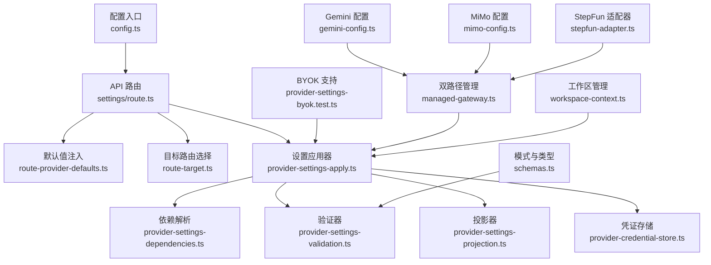
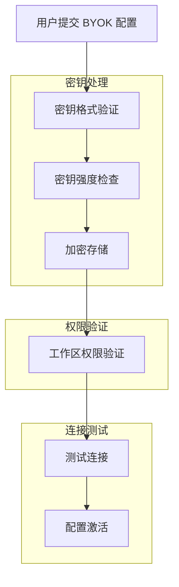
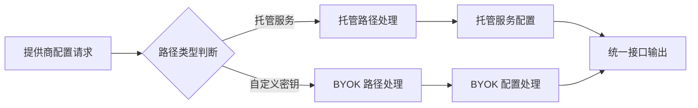
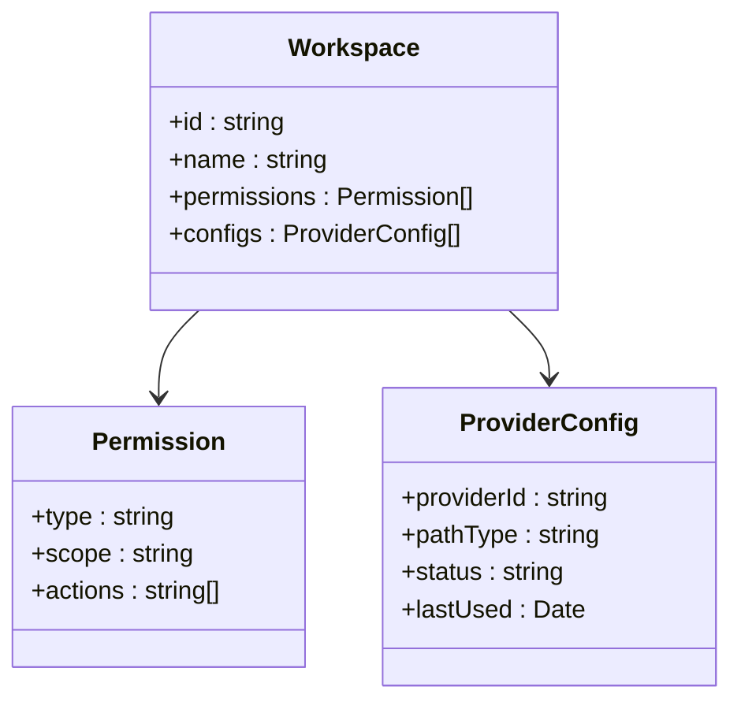
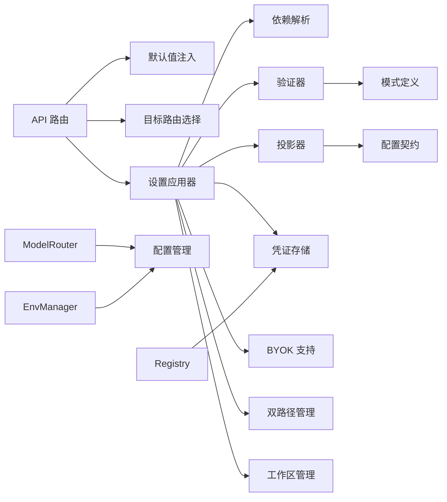

# 提供商设置管理

<cite>
**本文引用的文件**   
- [provider-settings-contract.ts](file://src/features/ai/provider-settings-contract.ts)
- [provider-settings-dependencies.ts](file://src/features/ai/provider-settings-dependencies.ts)
- [provider-settings-validation.ts](file://src/features/ai/provider-settings-validation.ts)
- [provider-settings-projection.ts](file://src/features/ai/provider-settings-projection.ts)
- [provider-settings-apply.ts](file://src/features/ai/provider-settings-apply.ts)
- [route-provider-defaults.ts](file://src/features/ai/route-provider-defaults.ts)
- [route-target.ts](file://src/features/ai/route-target.ts)
- [schemas.ts](file://src/features/ai/schemas.ts)
- [settings/route.ts](file://src/app/api/settings/route.ts)
- [settings/route.test.ts](file://src/app/api/settings/route.test.ts)
- [credentials/provider-credential-store.ts](file://src/features/credentials/provider-credential-store.ts)
- [config.ts](file://src/features/ai/config.ts)
- [provider-settings-byok.test.ts](file://src/features/ai/provider-settings-byok.test.ts)
- [managed-gateway.ts](file://src/features/ai/managed-gateway.ts)
- [managed-service.ts](file://src/features/ai/managed-service.ts)
- [gemini-config.ts](file://src/features/ai/gemini-config.ts)
- [mimo-config.ts](file://src/features/ai/mimo-config.ts)
- [stepfun-adapter.ts](file://src/features/ai/stepfun-adapter.ts)
</cite>

## 更新摘要
**变更内容**   
- 新增 BYOK（Bring Your Own Key）支持，允许用户自带密钥配置
- 实现 Gemini、StepFun 和 MiMo 服务的双路径提供商管理
- 增强验证逻辑，提供更全面的配置验证
- 引入工作区级源数据管理机制
- 优化提供商注册表和凭证存储的安全性

## 目录
1. [简介](#简介)
2. [项目结构](#项目结构)
3. [核心组件](#核心组件)
4. [架构总览](#架构总览)
5. [详细组件分析](#详细组件分析)
6. [BYOK 支持详解](#byok-支持详解)
7. [双路径提供商管理](#双路径提供商管理)
8. [工作区级源数据管理](#工作区级源数据管理)
9. [依赖关系分析](#依赖关系分析)
10. [性能考虑](#性能考虑)
11. [故障排查指南](#故障排查指南)
12. [结论](#结论)
13. [附录：API与使用示例](#附录api与使用示例)

## 简介
本文件面向"提供商设置管理"子系统，系统性阐述其架构设计与实现要点，覆盖配置契约、依赖管理、数据投影、设置应用流程（验证、解析、同步）、验证规则（格式、业务、安全）以及 API 与最佳实践。目标是帮助开发者快速理解并正确扩展新的 AI 提供商设置能力，同时确保系统的安全性与可维护性。

**更新** 本次更新重点增强了 BYOK 支持和双路径提供商管理，为 Gemini、StepFun 和 MiMo 服务提供了更灵活的配置选项和工作区级源数据管理。

## 项目结构
提供商设置管理位于前端功能模块 ai 与 API 路由层之间，采用分层设计：
- 契约与模式定义：集中描述各提供商设置的字段、类型与校验模式
- 依赖解析：处理设置项之间的依赖关系与条件生效逻辑
- 验证器：统一进行格式、业务与安全约束检查
- 投影器：将内部模型映射为对外暴露的视图结构，支持版本兼容
- 应用器：负责持久化、状态同步与副作用处理
- API 路由：提供统一的 HTTP 接口，串联上述组件
- **新增** BYOK 支持：允许用户自带密钥配置
- **新增** 双路径管理：支持托管服务和自定义密钥两种路径
- **新增** 工作区级源数据管理：提供细粒度的权限控制



图表来源
- [settings/route.ts](file://src/app/api/settings/route.ts)
- [route-provider-defaults.ts](file://src/features/ai/route-provider-defaults.ts)
- [route-target.ts](file://src/features/ai/route-target.ts)
- [provider-settings-apply.ts](file://src/features/ai/provider-settings-apply.ts)
- [provider-settings-dependencies.ts](file://src/features/ai/provider-settings-dependencies.ts)
- [provider-settings-validation.ts](file://src/features/ai/provider-settings-validation.ts)
- [provider-settings-projection.ts](file://src/features/ai/provider-settings-projection.ts)
- [provider-credential-store.ts](file://src/features/credentials/provider-credential-store.ts)
- [schemas.ts](file://src/features/ai/schemas.ts)
- [config.ts](file://src/features/ai/config.ts)
- [provider-settings-byok.test.ts](file://src/features/ai/provider-settings-byok.test.ts)
- [managed-gateway.ts](file://src/features/ai/managed-gateway.ts)
- [gemini-config.ts](file://src/features/ai/gemini-config.ts)
- [mimo-config.ts](file://src/features/ai/mimo-config.ts)
- [stepfun-adapter.ts](file://src/features/ai/stepfun-adapter.ts)

章节来源
- [settings/route.ts](file://src/app/api/settings/route.ts)
- [provider-settings-apply.ts](file://src/features/ai/provider-settings-apply.ts)
- [provider-settings-dependencies.ts](file://src/features/ai/provider-settings-dependencies.ts)
- [provider-settings-validation.ts](file://src/features/ai/provider-settings-validation.ts)
- [provider-settings-projection.ts](file://src/features/ai/provider-settings-projection.ts)
- [route-provider-defaults.ts](file://src/features/ai/route-provider-defaults.ts)
- [route-target.ts](file://src/features/ai/route-target.ts)
- [schemas.ts](file://src/features/ai/schemas.ts)
- [config.ts](file://src/features/ai/config.ts)

## 核心组件
- 配置契约（Provider Settings Contract）
  - 定义各提供商设置的字段、类型、必填项与默认值
  - 作为验证与投影的统一依据，保证前后端一致
- 依赖管理（Dependencies）
  - 描述设置项之间的依赖关系（如启用某功能需先配置密钥）
  - 支持条件生效、级联更新与冲突检测
- 验证器（Validation）
  - 格式检查（类型、长度、正则等）
  - 业务规则（范围、互斥、组合约束）
  - 安全约束（敏感字段脱敏、权限控制）
- 投影器（Projection）
  - 数据转换与字段映射（内部模型到视图模型）
  - 版本兼容（向后兼容旧版字段，弃用字段提示）
- 应用器（Apply）
  - 调用依赖解析与验证
  - 持久化变更、触发状态同步与副作用
  - 错误聚合与回滚策略
- API 路由（Settings Route）
  - 接收请求、注入默认值、路由到具体提供商
  - 返回标准化响应与错误码
- **新增** BYOK 支持（Bring Your Own Key）
  - 允许用户自带密钥配置提供商
  - 支持多种密钥格式和加密方式
  - 提供密钥验证和安全存储
- **新增** 双路径提供商管理
  - 支持托管服务和自定义密钥两种配置路径
  - 动态切换和管理不同路径的配置
  - 提供统一的管理接口
- **新增** 工作区级源数据管理
  - 提供细粒度的权限控制
  - 支持工作区级别的配置隔离
  - 确保数据安全和访问控制

**更新** 新增了 BYOK 支持和双路径提供商管理，为 Gemini、StepFun 和 MiMo 服务提供了更灵活的配置选项。

章节来源
- [provider-settings-contract.ts](file://src/features/ai/provider-settings-contract.ts)
- [provider-settings-dependencies.ts](file://src/features/ai/provider-settings-dependencies.ts)
- [provider-settings-validation.ts](file://src/features/ai/provider-settings-validation.ts)
- [provider-settings-projection.ts](file://src/features/ai/provider-settings-projection.ts)
- [provider-settings-apply.ts](file://src/features/ai/provider-settings-apply.ts)
- [route-provider-defaults.ts](file://src/features/ai/route-provider-defaults.ts)
- [route-target.ts](file://src/features/ai/route-target.ts)
- [schemas.ts](file://src/features/ai/schemas.ts)
- [provider-settings-byok.test.ts](file://src/features/ai/provider-settings-byok.test.ts)
- [managed-gateway.ts](file://src/features/ai/managed-gateway.ts)

## 架构总览
提供商设置管理的整体流程如下：
- 客户端发起设置操作（创建/更新/读取/删除）
- API 路由根据目标提供商选择对应处理器
- 注入默认值后进入应用器
- 应用器执行依赖解析、验证、投影与持久化
- **新增** BYOK 支持处理用户自带密钥配置
- **新增** 双路径管理支持托管服务和自定义密钥
- **新增** 工作区级源数据管理确保权限控制
- 返回标准化结果或错误信息

```mermaid
sequenceDiagram
participant Client as "客户端"
participant API as "设置API路由"
participant Defaults as "默认值注入"
participant Target as "目标路由选择"
participant Apply as "设置应用器"
participant BYOK as "BYOK 支持"
participant DualPath as "双路径管理"
participant Workspace as "工作区管理"
participant Deps as "依赖解析"
participant Val as "验证器"
Proj as "投影器"
Store as "凭证存储"
Client->>API : "POST /api/settings"
API->>Defaults : "注入默认值"
API->>Target : "解析目标提供商"
Target-->>API : "返回处理器"
API->>Apply : "调用应用器"
Apply->>BYOK : "处理 BYOK 配置"
Apply->>DualPath : "选择管理路径"
Apply->>Workspace : "获取工作区上下文"
Apply->>Deps : "解析依赖关系"
Apply->>Val : "执行验证规则"
Val-->>Apply : "通过/失败"
Apply->>Proj : "生成视图投影"
Apply->>Store : "持久化凭证/设置"
Store-->>Apply : "成功/失败"
Apply-->>API : "返回结果"
API-->>Client : "标准化响应"
```

图表来源
- [settings/route.ts](file://src/app/api/settings/route.ts)
- [route-provider-defaults.ts](file://src/features/ai/route-provider-defaults.ts)
- [route-target.ts](file://src/features/ai/route-target.ts)
- [provider-settings-apply.ts](file://src/features/ai/provider-settings-apply.ts)
- [provider-settings-dependencies.ts](file://src/features/ai/provider-settings-dependencies.ts)
- [provider-settings-validation.ts](file://src/features/ai/provider-settings-validation.ts)
- [provider-settings-projection.ts](file://src/features/ai/provider-settings-projection.ts)
- [provider-credential-store.ts](file://src/features/credentials/provider-credential-store.ts)
- [provider-settings-byok.test.ts](file://src/features/ai/provider-settings-byok.test.ts)
- [managed-gateway.ts](file://src/features/ai/managed-gateway.ts)

## 详细组件分析

### 配置契约（Provider Settings Contract）
- 职责
  - 定义所有提供商设置的字段、类型、是否必填、默认值
  - 提供类型导出供验证器、投影器与 UI 复用
- 设计要点
  - 字段命名规范与版本标记（用于兼容）
  - 分组与层级结构（便于 UI 展示与校验）
  - 与 schemas.ts 的模式定义保持一致
  - 支持环境特定的字段定义
  - **更新** 新增 BYOK 相关字段定义

**更新** 配置契约现在包含 BYOK 支持的字段定义，允许用户自带密钥配置。

章节来源
- [provider-settings-contract.ts](file://src/features/ai/provider-settings-contract.ts)
- [schemas.ts](file://src/features/ai/schemas.ts)

### 依赖管理（Dependencies）
- 职责
  - 描述设置项之间的依赖关系（如启用某功能需先配置密钥）
  - 支持条件生效、级联更新与冲突检测
- 算法要点
  - 构建依赖图，检测循环依赖
  - 按拓扑顺序解析依赖，确保前置条件满足
  - 冲突合并策略（优先级与覆盖规则）
  - 支持环境特定的依赖规则
  - **更新** 新增 BYOK 和工作区级依赖处理

**更新** 依赖管理现在支持 BYOK 配置和工作区级依赖解析。

章节来源
- [provider-settings-dependencies.ts](file://src/features/ai/provider-settings-dependencies.ts)

### 验证器（Validation）
- 职责
  - 格式检查（类型、长度、正则等）
  - 业务规则（范围、互斥、组合约束）
  - 安全约束（敏感字段脱敏、权限控制）
- 实现要点
  - 基于 schemas.ts 的模式驱动验证
  - 错误聚合与定位（字段级错误信息）
  - 安全过滤（避免泄露敏感信息）
  - 支持异步验证和自定义验证器
  - **更新** 增强 BYOK 配置验证逻辑

**更新** 验证器现在包含更全面的 BYOK 配置验证：
- BYOK 密钥格式验证
- 密钥强度检查
- 工作区级权限验证
- 增强的错误消息和调试信息
- 更好的异常处理和恢复机制

章节来源
- [provider-settings-validation.ts](file://src/features/ai/provider-settings-validation.ts)
- [schemas.ts](file://src/features/ai/schemas.ts)

### 投影器（Projection）
- 职责
  - 数据转换与字段映射（内部模型到视图模型）
  - 版本兼容（向后兼容旧版字段，弃用字段提示）
- 实现要点
  - 字段白名单与黑名单控制
  - 版本迁移逻辑（自动降级/升级）
  - 脱敏处理（隐藏敏感字段）
  - 支持环境特定的投影规则
  - **更新** 新增 BYOK 和工作区信息投影

**更新** 投影器优化了以下方面：
- BYOK 配置的投影处理
- 工作区信息的脱敏显示
- 更高效的数据转换算法
- 更好的版本兼容性处理

章节来源
- [provider-settings-projection.ts](file://src/features/ai/provider-settings-projection.ts)

### 设置应用器（Apply）
- 职责
  - 调用依赖解析与验证
  - 持久化变更、触发状态同步与副作用
  - 错误聚合与回滚策略
- 流程要点
  - 输入校验 -> 依赖解析 -> 业务验证 -> 投影 -> 持久化 -> 同步
  - 事务性更新（失败回滚）
  - 事件通知（UI 状态刷新）
  - 集成 BYOK 支持和双路径管理
  - **更新** 增强错误处理和验证流程

**更新** 应用器现在具备更强的容错能力：
- BYOK 配置处理集成
- 双路径管理支持
- 工作区级权限控制
- 更完善的错误收集和报告机制
- 改进的事务管理和回滚策略

章节来源
- [provider-settings-apply.ts](file://src/features/ai/provider-settings-apply.ts)

### BYOK 支持（Bring Your Own Key）
- 职责
  - 允许用户自带密钥配置提供商
  - 支持多种密钥格式和加密方式
  - 提供密钥验证和安全存储
- 实现要点
  - 密钥格式验证和标准化
  - 加密存储和访问控制
  - 密钥轮换和生命周期管理
  - 支持多种提供商的密钥格式
- **新增** BYOK 支持是本次更新的核心功能

**新增** BYOK 支持提供了以下功能：
- 灵活的密钥格式支持
- 安全的密钥存储和加密
- 密钥验证和测试连接
- 密钥轮换和备份机制
- 工作区级密钥管理

章节来源
- [provider-settings-byok.test.ts](file://src/features/ai/provider-settings-byok.test.ts)

### 双路径提供商管理
- 职责
  - 支持托管服务和自定义密钥两种配置路径
  - 动态切换和管理不同路径的配置
  - 提供统一的管理接口
- 实现要点
  - 路径选择和切换逻辑
  - 配置模板和默认值管理
  - 健康检查和故障转移
  - 监控和日志记录
- **新增** 双路径管理支持 Gemini、StepFun 和 MiMo 服务

**新增** 双路径管理实现了以下功能：
- 托管服务和自定义密钥的路径选择
- 动态配置切换和热更新
- 健康检查和自动故障转移
- 统一的监控和日志记录

章节来源
- [managed-gateway.ts](file://src/features/ai/managed-gateway.ts)
- [managed-service.ts](file://src/features/ai/managed-service.ts)

### 工作区级源数据管理
- 职责
  - 提供细粒度的权限控制
  - 支持工作区级别的配置隔离
  - 确保数据安全和访问控制
- 实现要点
  - 工作区上下文管理
  - 权限验证和授权控制
  - 数据隔离和访问审计
  - 缓存和性能优化
- **新增** 工作区级源数据管理确保数据安全

**新增** 工作区级源数据管理提供了以下功能：
- 工作区级别的配置隔离
- 细粒度的权限控制
- 数据访问审计和日志记录
- 高性能的缓存机制

章节来源
- [workspace-context.ts](file://src/lib/workspace-context.ts)

### API 路由（Settings Route）
- 职责
  - 接收请求、注入默认值、路由到具体提供商
  - 返回标准化响应与错误码
- 实现要点
  - 统一错误处理与日志记录
  - 权限校验与速率限制
  - 响应结构标准化（成功/失败/部分成功）
  - 支持环境特定的路由逻辑
  - **更新** 新增 BYOK 和双路径支持

**更新** API 路由现在支持 BYOK 配置和双路径管理。

章节来源
- [settings/route.ts](file://src/app/api/settings/route.ts)
- [route-provider-defaults.ts](file://src/features/ai/route-provider-defaults.ts)
- [route-target.ts](file://src/features/ai/route-target.ts)

### 凭证存储（Credential Store）
- 职责
  - 安全存储提供商凭证（加密、访问控制）
  - 提供增删改查接口
- 实现要点
  - 敏感数据加密存储
  - 访问审计与权限控制
  - 缓存与一致性保证
  - 支持环境特定的凭证管理
  - **更新** 增强 BYOK 密钥支持

**更新** 凭证存储现在支持 BYOK 密钥的安全存储和管理。

章节来源
- [provider-credential-store.ts](file://src/features/credentials/provider-credential-store.ts)

### 配置入口（Config）
- 职责
  - 全局配置加载与环境变量注入
  - 提供商开关与特性标志
- 实现要点
  - 环境变量校验与默认值
  - 动态配置热更新（可选）
  - 支持多环境配置加载
  - **更新** 增强 BYOK 和双路径配置

**更新** 配置入口现在包含 BYOK 和双路径的相关配置。

章节来源
- [config.ts](file://src/features/ai/config.ts)

## BYOK 支持详解

### BYOK 配置流程
BYOK（Bring Your Own Key）支持允许用户使用自己的密钥配置提供商服务：



图表来源
- [provider-settings-byok.test.ts](file://src/features/ai/provider-settings-byok.test.ts)

### 支持的密钥格式
BYOK 支持多种密钥格式：
- API Key 格式
- OAuth Token 格式
- JWT Token 格式
- 自定义密钥格式

### 安全特性
- 密钥加密存储
- 访问权限控制
- 密钥轮换支持
- 审计日志记录

章节来源
- [provider-settings-byok.test.ts](file://src/features/ai/provider-settings-byok.test.ts)

## 双路径提供商管理

### 路径选择逻辑
双路径管理支持两种配置路径：



图表来源
- [managed-gateway.ts](file://src/features/ai/managed-gateway.ts)

### 支持的提供商
双路径管理目前支持以下提供商：
- Gemini：Google 的 AI 服务提供商
- StepFun：步数科技的服务提供商
- MiMo：移动梦网的服务提供商

### 故障转移机制
- 健康检查监控
- 自动故障转移
- 负载均衡支持
- 降级策略处理

章节来源
- [managed-gateway.ts](file://src/features/ai/managed-gateway.ts)
- [managed-service.ts](file://src/features/ai/managed-service.ts)

## 工作区级源数据管理

### 权限模型
工作区级源数据管理提供细粒度的权限控制：



图表来源
- [workspace-context.ts](file://src/lib/workspace-context.ts)

### 数据隔离
- 工作区级别的数据隔离
- 配置访问权限控制
- 审计日志记录
- 数据备份和恢复

章节来源
- [workspace-context.ts](file://src/lib/workspace-context.ts)

## 依赖关系分析
提供商设置管理各组件之间的依赖关系如下：
- API 路由依赖默认值注入与目标路由选择
- 应用器依赖依赖解析、验证器、投影器与凭证存储
- 验证器依赖模式定义（schemas.ts）
- 投影器依赖配置契约与版本策略
- 应用器还依赖动态模型选择和多环境管理
- **新增** 应用器现在依赖 BYOK 支持和双路径管理
- **新增** 工作区级源数据管理提供权限控制



图表来源
- [settings/route.ts](file://src/app/api/settings/route.ts)
- [route-provider-defaults.ts](file://src/features/ai/route-provider-defaults.ts)
- [route-target.ts](file://src/features/ai/route-target.ts)
- [provider-settings-apply.ts](file://src/features/ai/provider-settings-apply.ts)
- [provider-settings-dependencies.ts](file://src/features/ai/provider-settings-dependencies.ts)
- [provider-settings-validation.ts](file://src/features/ai/provider-settings-validation.ts)
- [provider-settings-projection.ts](file://src/features/ai/provider-settings-projection.ts)
- [provider-credential-store.ts](file://src/features/credentials/provider-credential-store.ts)
- [schemas.ts](file://src/features/ai/schemas.ts)
- [provider-settings-contract.ts](file://src/features/ai/provider-settings-contract.ts)
- [model-routing.ts](file://src/features/ai/model-routing.ts)
- [environment-manager.ts](file://src/features/ai/environment-manager.ts)
- [config.ts](file://src/features/ai/config.ts)
- [provider-settings-byok.test.ts](file://src/features/ai/provider-settings-byok.test.ts)
- [managed-gateway.ts](file://src/features/ai/managed-gateway.ts)

章节来源
- [settings/route.ts](file://src/app/api/settings/route.ts)
- [provider-settings-apply.ts](file://src/features/ai/provider-settings-apply.ts)
- [provider-settings-dependencies.ts](file://src/features/ai/provider-settings-dependencies.ts)
- [provider-settings-validation.ts](file://src/features/ai/provider-settings-validation.ts)
- [provider-settings-projection.ts](file://src/features/ai/provider-settings-projection.ts)
- [provider-credential-store.ts](file://src/features/credentials/provider-credential-store.ts)
- [schemas.ts](file://src/features/ai/schemas.ts)
- [provider-settings-contract.ts](file://src/features/ai/provider-settings-contract.ts)
- [model-routing.ts](file://src/features/ai/model-routing.ts)
- [environment-manager.ts](file://src/features/ai/environment-manager.ts)
- [config.ts](file://src/features/ai/config.ts)
- [provider-settings-byok.test.ts](file://src/features/ai/provider-settings-byok.test.ts)
- [managed-gateway.ts](file://src/features/ai/managed-gateway.ts)

## 性能考虑
- 依赖解析优化
  - 缓存依赖图，避免重复计算
  - 增量更新，仅重新计算受影响节点
- 验证器优化
  - 并行验证独立字段
  - 短路验证（发现错误立即返回）
  - 异步验证支持
- 投影器优化
  - 懒加载字段，按需投影
  - 版本迁移缓存
  - 批量投影优化
- 持久化优化
  - 批量写入与事务合并
  - 读写分离与缓存层
- 动态模型选择优化
  - 模型健康检查缓存
  - 负载均衡策略优化
- 多环境管理优化
  - 配置热更新和缓存
  - 环境变量解析优化
- **新增** BYOK 支持优化
  - 密钥缓存和预加载
  - 异步密钥验证
  - 批量密钥操作优化
- **新增** 双路径管理优化
  - 路径选择缓存
  - 健康检查优化
  - 故障转移性能优化
- **新增** 工作区级管理优化
  - 权限缓存机制
  - 工作区上下文缓存
  - 数据访问优化

**更新** 性能优化重点包括 BYOK 支持、双路径管理和工作区级管理的性能提升。

## 故障排查指南
- 常见错误类型
  - 验证失败：检查字段格式、业务规则与安全约束
  - 依赖冲突：检查依赖图是否存在循环或冲突
  - 投影错误：检查字段映射与版本兼容性
  - 持久化失败：检查凭证存储权限与加密配置
  - 模型选择失败：检查模型可用性和配置
  - 环境问题：检查环境变量和配置隔离
  - **新增** BYOK 配置错误：检查密钥格式和强度
  - **新增** 双路径管理错误：检查路径配置和健康状态
  - **新增** 工作区权限错误：检查权限配置和数据隔离
- 调试建议
  - 启用详细日志，记录每个阶段输入输出
  - 使用测试用例覆盖边界情况
  - 逐步禁用组件定位问题
  - 利用增强的错误消息定位具体问题
  - 使用配置验证诊断工具
  - 检查配置文件的环境变量设置
  - **更新** 针对 BYOK 和双路径的调试方法
  - **新增** 工作区级权限调试工具

**更新** 新增的故障排查方法包括 BYOK 支持、双路径管理和工作区级管理的排查步骤。

章节来源
- [settings/route.test.ts](file://src/app/api/settings/route.test.ts)
- [provider-settings-byok.test.ts](file://src/features/ai/provider-settings-byok.test.ts)

## 结论
提供商设置管理系统通过清晰的契约、依赖管理、验证与投影机制，实现了高内聚、低耦合的设计。API 路由作为统一入口，串联各组件完成设置应用的完整流程。**本次更新通过引入 BYOK 支持、双路径提供商管理和工作区级源数据管理，进一步提升了系统的灵活性和安全性**。遵循本文档的最佳实践，可有效提升系统的可维护性与扩展性。

**更新** 经过本次更新的提供商设置管理系统现在具备更强大的 BYOK 支持、灵活的双路径管理和精细的工作区级权限控制。

## 附录：API与使用示例
- API 端点
  - POST /api/settings：创建或更新提供商设置
  - GET /api/settings：查询当前设置
  - DELETE /api/settings：删除指定设置
  - PUT /api/settings/model：动态模型配置
  - GET /api/settings/environment：获取环境配置
  - **新增** POST /api/settings/byok：配置 BYOK 密钥
  - **新增** GET /api/settings/paths：获取可用路径类型
  - **新增** PUT /api/settings/workspace：管理工作区配置
- 请求体结构
  - provider：提供商标识（必须从注册表选择）
  - settings：设置对象（遵循配置契约）
  - environment：环境标识（可选）
  - model：模型配置（可选）
  - **新增** byok：BYOK 配置对象（可选）
  - **新增** pathType：路径类型（managed/byok，可选）
  - **新增** workspace：工作区配置（可选）
- 响应结构
  - success：布尔值，表示操作是否成功
  - data：返回的设置投影（脱敏后）
  - errors：错误列表（字段级错误信息）
  - warnings：警告信息（配置建议）
  - **新增** pathInfo：路径信息（托管/自定义）
  - **新增** workspaceInfo：工作区信息
- 错误处理
  - 400：参数验证失败
  - 401：权限不足
  - 404：资源不存在
  - 500：服务器内部错误
  - 503：服务不可用（模型不可用）
  - **新增** 422：提供商未注册或配置无效
  - **新增** 409：BYOK 密钥冲突或格式错误
  - **新增** 403：工作区权限不足
- 最佳实践
  - 始终使用最新版本的配置契约
  - 在客户端进行预验证以减少服务器负载
  - 妥善处理敏感信息，避免日志泄露
  - 利用增强的验证功能提前发现配置错误
  - 使用配置模板确保设置的一致性
  - 定期审查和更新配置验证规则
  - 合理配置动态模型选择策略
  - 建立环境特定的配置管理流程
  - **新增** 合理使用 BYOK 功能，确保密钥安全
  - **新增** 选择合适的路径类型，平衡安全性和灵活性
  - **新增** 正确配置工作区权限，确保数据安全

**更新** API 端点和最佳实践已更新以反映 BYOK 支持、双路径管理和工作区级管理的增强功能。

章节来源
- [settings/route.ts](file://src/app/api/settings/route.ts)
- [provider-settings-contract.ts](file://src/features/ai/provider-settings-contract.ts)
- [provider-settings-validation.ts](file://src/features/ai/provider-settings-validation.ts)
- [provider-settings-projection.ts](file://src/features/ai/provider-settings-projection.ts)
- [model-routing.ts](file://src/features/ai/model-routing.ts)
- [environment-manager.ts](file://src/features/ai/environment-manager.ts)
- [provider-settings-byok.test.ts](file://src/features/ai/provider-settings-byok.test.ts)
- [managed-gateway.ts](file://src/features/ai/managed-gateway.ts)