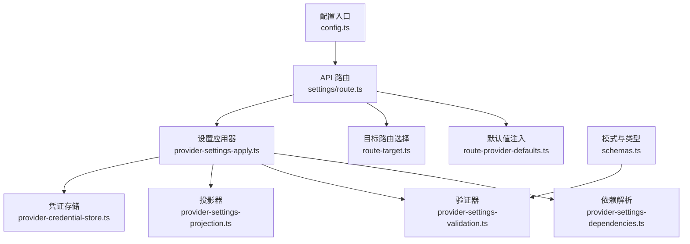
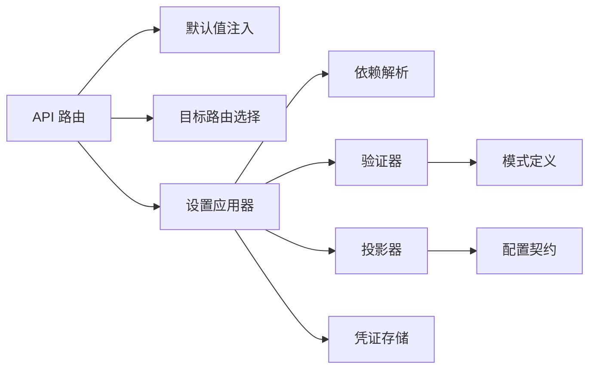

# 提供商设置管理

<cite>
**本文引用的文件**   
- [provider-settings-contract.ts](file://src/features/ai/provider-settings-contract.ts)
- [provider-settings-dependencies.ts](file://src/features/ai/provider-settings-dependencies.ts)
- [provider-settings-validation.ts](file://src/features/ai/provider-settings-validation.ts)
- [provider-settings-projection.ts](file://src/features/ai/provider-settings-projection.ts)
- [provider-settings-apply.ts](file://src/features/ai/provider-settings-apply.ts)
- [route-provider-defaults.ts](file://src/features/ai/route-provider-defaults.ts)
- [route-target.ts](file://src/features/ai/route-target.ts)
- [schemas.ts](file://src/features/ai/schemas.ts)
- [settings/route.ts](file://src/app/api/settings/route.ts)
- [settings/route.test.ts](file://src/app/api/settings/route.test.ts)
- [credentials/provider-credential-store.ts](file://src/features/credentials/provider-credential-store.ts)
- [config.ts](file://src/features/ai/config.ts)
</cite>

## 目录
1. [简介](#简介)
2. [项目结构](#项目结构)
3. [核心组件](#核心组件)
4. [架构总览](#架构总览)
5. [详细组件分析](#详细组件分析)
6. [依赖关系分析](#依赖关系分析)
7. [性能考虑](#性能考虑)
8. [故障排查指南](#故障排查指南)
9. [结论](#结论)
10. [附录：API与使用示例](#附录api与使用示例)

## 简介
本文件面向“提供商设置管理”子系统，系统性阐述其架构设计与实现要点，覆盖配置契约、依赖管理、数据投影、设置应用流程（验证、解析、同步）、验证规则（格式、业务、安全）以及 API 与最佳实践。目标是帮助开发者快速理解并正确扩展新的 AI 提供商设置能力，同时确保系统的安全性与可维护性。

## 项目结构
提供商设置管理位于前端功能模块 ai 与 API 路由层之间，采用分层设计：
- 契约与模式定义：集中描述各提供商设置的字段、类型与校验模式
- 依赖解析：处理设置项之间的依赖关系与条件生效逻辑
- 验证器：统一进行格式、业务与安全约束检查
- 投影器：将内部模型映射为对外暴露的视图结构，支持版本兼容
- 应用器：负责持久化、状态同步与副作用处理
- API 路由：提供统一的 HTTP 接口，串联上述组件



图表来源
- [settings/route.ts](file://src/app/api/settings/route.ts)
- [route-provider-defaults.ts](file://src/features/ai/route-provider-defaults.ts)
- [route-target.ts](file://src/features/ai/route-target.ts)
- [provider-settings-apply.ts](file://src/features/ai/provider-settings-apply.ts)
- [provider-settings-dependencies.ts](file://src/features/ai/provider-settings-dependencies.ts)
- [provider-settings-validation.ts](file://src/features/ai/provider-settings-validation.ts)
- [provider-settings-projection.ts](file://src/features/ai/provider-settings-projection.ts)
- [provider-credential-store.ts](file://src/features/credentials/provider-credential-store.ts)
- [schemas.ts](file://src/features/ai/schemas.ts)
- [config.ts](file://src/features/ai/config.ts)

章节来源
- [settings/route.ts](file://src/app/api/settings/route.ts)
- [provider-settings-apply.ts](file://src/features/ai/provider-settings-apply.ts)
- [provider-settings-dependencies.ts](file://src/features/ai/provider-settings-dependencies.ts)
- [provider-settings-validation.ts](file://src/features/ai/provider-settings-validation.ts)
- [provider-settings-projection.ts](file://src/features/ai/provider-settings-projection.ts)
- [route-provider-defaults.ts](file://src/features/ai/route-provider-defaults.ts)
- [route-target.ts](file://src/features/ai/route-target.ts)
- [schemas.ts](file://src/features/ai/schemas.ts)
- [config.ts](file://src/features/ai/config.ts)

## 核心组件
- 配置契约（Provider Settings Contract）
  - 定义各提供商设置的字段、类型、必填项与默认值
  - 作为验证与投影的统一依据，保证前后端一致
- 依赖管理（Dependencies）
  - 描述设置项之间的依赖关系（如启用某功能需先配置密钥）
  - 支持条件生效、级联更新与冲突检测
- 验证器（Validation）
  - 格式检查（类型、长度、正则等）
  - 业务规则（范围、互斥、组合约束）
  - 安全约束（敏感字段脱敏、权限控制）
- 投影器（Projection）
  - 数据转换与字段映射（内部模型到视图模型）
  - 版本兼容（向后兼容旧版字段，弃用字段提示）
- 应用器（Apply）
  - 调用依赖解析与验证
  - 持久化变更、触发状态同步与副作用
  - 错误聚合与回滚策略
- API 路由（Settings Route）
  - 接收请求、注入默认值、路由到具体提供商
  - 返回标准化响应与错误码

章节来源
- [provider-settings-contract.ts](file://src/features/ai/provider-settings-contract.ts)
- [provider-settings-dependencies.ts](file://src/features/ai/provider-settings-dependencies.ts)
- [provider-settings-validation.ts](file://src/features/ai/provider-settings-validation.ts)
- [provider-settings-projection.ts](file://src/features/ai/provider-settings-projection.ts)
- [provider-settings-apply.ts](file://src/features/ai/provider-settings-apply.ts)
- [route-provider-defaults.ts](file://src/features/ai/route-provider-defaults.ts)
- [route-target.ts](file://src/features/ai/route-target.ts)
- [schemas.ts](file://src/features/ai/schemas.ts)

## 架构总览
提供商设置管理的整体流程如下：
- 客户端发起设置操作（创建/更新/读取/删除）
- API 路由根据目标提供商选择对应处理器
- 注入默认值后进入应用器
- 应用器执行依赖解析、验证、投影与持久化
- 返回标准化结果或错误信息

```mermaid
sequenceDiagram
participant Client as "客户端"
participant API as "设置API路由"
participant Defaults as "默认值注入"
participant Target as "目标路由选择"
participant Apply as "设置应用器"
participant Deps as "依赖解析"
participant Val as "验证器"
Proj as "投影器"
Store as "凭证存储"
Client->>API : "POST /api/settings"
API->>Defaults : "注入默认值"
API->>Target : "解析目标提供商"
Target-->>API : "返回处理器"
API->>Apply : "调用应用器"
Apply->>Deps : "解析依赖关系"
Apply->>Val : "执行验证规则"
Val-->>Apply : "通过/失败"
Apply->>Proj : "生成视图投影"
Apply->>Store : "持久化凭证/设置"
Store-->>Apply : "成功/失败"
Apply-->>API : "返回结果"
API-->>Client : "标准化响应"
```

图表来源
- [settings/route.ts](file://src/app/api/settings/route.ts)
- [route-provider-defaults.ts](file://src/features/ai/route-provider-defaults.ts)
- [route-target.ts](file://src/features/ai/route-target.ts)
- [provider-settings-apply.ts](file://src/features/ai/provider-settings-apply.ts)
- [provider-settings-dependencies.ts](file://src/features/ai/provider-settings-dependencies.ts)
- [provider-settings-validation.ts](file://src/features/ai/provider-settings-validation.ts)
- [provider-settings-projection.ts](file://src/features/ai/provider-settings-projection.ts)
- [provider-credential-store.ts](file://src/features/credentials/provider-credential-store.ts)

## 详细组件分析

### 配置契约（Provider Settings Contract）
- 职责
  - 定义所有提供商设置的字段、类型、是否必填、默认值
  - 提供类型导出供验证器、投影器与 UI 复用
- 设计要点
  - 字段命名规范与版本标记（用于兼容）
  - 分组与层级结构（便于 UI 展示与校验）
  - 与 schemas.ts 的模式定义保持一致

章节来源
- [provider-settings-contract.ts](file://src/features/ai/provider-settings-contract.ts)
- [schemas.ts](file://src/features/ai/schemas.ts)

### 依赖管理（Dependencies）
- 职责
  - 描述设置项之间的依赖关系（如启用某功能需先配置密钥）
  - 支持条件生效、级联更新与冲突检测
- 算法要点
  - 构建依赖图，检测循环依赖
  - 按拓扑顺序解析依赖，确保前置条件满足
  - 冲突合并策略（优先级与覆盖规则）

章节来源
- [provider-settings-dependencies.ts](file://src/features/ai/provider-settings-dependencies.ts)

### 验证器（Validation）
- 职责
  - 格式检查（类型、长度、正则等）
  - 业务规则（范围、互斥、组合约束）
  - 安全约束（敏感字段脱敏、权限控制）
- 实现要点
  - 基于 schemas.ts 的模式驱动验证
  - 错误聚合与定位（字段级错误信息）
  - 安全过滤（避免泄露敏感信息）

章节来源
- [provider-settings-validation.ts](file://src/features/ai/provider-settings-validation.ts)
- [schemas.ts](file://src/features/ai/schemas.ts)

### 投影器（Projection）
- 职责
  - 数据转换与字段映射（内部模型到视图模型）
  - 版本兼容（向后兼容旧版字段，弃用字段提示）
- 实现要点
  - 字段白名单与黑名单控制
  - 版本迁移逻辑（自动降级/升级）
  - 脱敏处理（隐藏敏感字段）

章节来源
- [provider-settings-projection.ts](file://src/features/ai/provider-settings-projection.ts)

### 设置应用器（Apply）
- 职责
  - 调用依赖解析与验证
  - 持久化变更、触发状态同步与副作用
  - 错误聚合与回滚策略
- 流程要点
  - 输入校验 -> 依赖解析 -> 业务验证 -> 投影 -> 持久化 -> 同步
  - 事务性更新（失败回滚）
  - 事件通知（UI 状态刷新）

章节来源
- [provider-settings-apply.ts](file://src/features/ai/provider-settings-apply.ts)

### API 路由（Settings Route）
- 职责
  - 接收请求、注入默认值、路由到具体提供商
  - 返回标准化响应与错误码
- 实现要点
  - 统一错误处理与日志记录
  - 权限校验与速率限制
  - 响应结构标准化（成功/失败/部分成功）

章节来源
- [settings/route.ts](file://src/app/api/settings/route.ts)
- [route-provider-defaults.ts](file://src/features/ai/route-provider-defaults.ts)
- [route-target.ts](file://src/features/ai/route-target.ts)

### 凭证存储（Credential Store）
- 职责
  - 安全存储提供商凭证（加密、访问控制）
  - 提供增删改查接口
- 实现要点
  - 敏感数据加密存储
  - 访问审计与权限控制
  - 缓存与一致性保证

章节来源
- [provider-credential-store.ts](file://src/features/credentials/provider-credential-store.ts)

### 配置入口（Config）
- 职责
  - 全局配置加载与环境变量注入
  - 提供商开关与特性标志
- 实现要点
  - 环境变量校验与默认值
  - 动态配置热更新（可选）

章节来源
- [config.ts](file://src/features/ai/config.ts)

## 依赖关系分析
提供商设置管理各组件之间的依赖关系如下：
- API 路由依赖默认值注入与目标路由选择
- 应用器依赖依赖解析、验证器、投影器与凭证存储
- 验证器依赖模式定义（schemas.ts）
- 投影器依赖配置契约与版本策略



图表来源
- [settings/route.ts](file://src/app/api/settings/route.ts)
- [route-provider-defaults.ts](file://src/features/ai/route-provider-defaults.ts)
- [route-target.ts](file://src/features/ai/route-target.ts)
- [provider-settings-apply.ts](file://src/features/ai/provider-settings-apply.ts)
- [provider-settings-dependencies.ts](file://src/features/ai/provider-settings-dependencies.ts)
- [provider-settings-validation.ts](file://src/features/ai/provider-settings-validation.ts)
- [provider-settings-projection.ts](file://src/features/ai/provider-settings-projection.ts)
- [provider-credential-store.ts](file://src/features/credentials/provider-credential-store.ts)
- [schemas.ts](file://src/features/ai/schemas.ts)
- [provider-settings-contract.ts](file://src/features/ai/provider-settings-contract.ts)

章节来源
- [settings/route.ts](file://src/app/api/settings/route.ts)
- [provider-settings-apply.ts](file://src/features/ai/provider-settings-apply.ts)
- [provider-settings-dependencies.ts](file://src/features/ai/provider-settings-dependencies.ts)
- [provider-settings-validation.ts](file://src/features/ai/provider-settings-validation.ts)
- [provider-settings-projection.ts](file://src/features/ai/provider-settings-projection.ts)
- [provider-credential-store.ts](file://src/features/credentials/provider-credential-store.ts)
- [schemas.ts](file://src/features/ai/schemas.ts)
- [provider-settings-contract.ts](file://src/features/ai/provider-settings-contract.ts)

## 性能考虑
- 依赖解析优化
  - 缓存依赖图，避免重复计算
  - 增量更新，仅重新计算受影响节点
- 验证器优化
  - 并行验证独立字段
  - 短路验证（发现错误立即返回）
- 投影器优化
  - 懒加载字段，按需投影
  - 版本迁移缓存
- 持久化优化
  - 批量写入与事务合并
  - 读写分离与缓存层

[本节为通用指导，不直接分析具体文件]

## 故障排查指南
- 常见错误类型
  - 验证失败：检查字段格式、业务规则与安全约束
  - 依赖冲突：检查依赖图是否存在循环或冲突
  - 投影错误：检查字段映射与版本兼容性
  - 持久化失败：检查凭证存储权限与加密配置
- 调试建议
  - 启用详细日志，记录每个阶段输入输出
  - 使用测试用例覆盖边界情况
  - 逐步禁用组件定位问题

章节来源
- [settings/route.test.ts](file://src/app/api/settings/route.test.ts)

## 结论
提供商设置管理系统通过清晰的契约、依赖管理、验证与投影机制，实现了高内聚、低耦合的设计。API 路由作为统一入口，串联各组件完成设置应用的完整流程。遵循本文档的最佳实践，可有效提升系统的可维护性与扩展性。

[本节为总结，不直接分析具体文件]

## 附录：API与使用示例
- API 端点
  - POST /api/settings：创建或更新提供商设置
  - GET /api/settings：查询当前设置
  - DELETE /api/settings：删除指定设置
- 请求体结构
  - provider：提供商标识
  - settings：设置对象（遵循配置契约）
- 响应结构
  - success：布尔值，表示操作是否成功
  - data：返回的设置投影（脱敏后）
  - errors：错误列表（字段级错误信息）
- 错误处理
  - 400：参数验证失败
  - 401：权限不足
  - 500：服务器内部错误
- 最佳实践
  - 始终使用最新版本的配置契约
  - 在客户端进行预验证以减少服务器负载
  - 妥善处理敏感信息，避免日志泄露

章节来源
- [settings/route.ts](file://src/app/api/settings/route.ts)
- [provider-settings-contract.ts](file://src/features/ai/provider-settings-contract.ts)
- [provider-settings-validation.ts](file://src/features/ai/provider-settings-validation.ts)
- [provider-settings-projection.ts](file://src/features/ai/provider-settings-projection.ts)