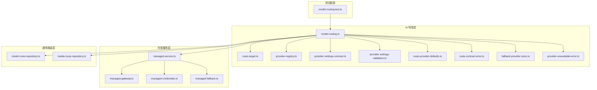
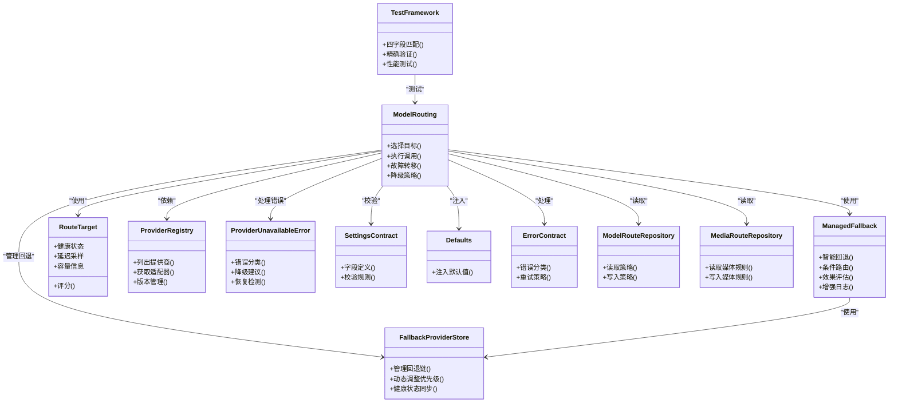

# 模型路由系统

<cite>
**本文引用的文件**   
- [model-routing.ts](file://src/features/ai/model-routing.ts)
- [model-routing.test.ts](file://src/features/ai/model-routing.test.ts)
- [route-target.ts](file://src/features/ai/route-target.ts)
- [provider-registry.ts](file://src/features/ai/provider-registry.ts)
- [provider-settings-contract.ts](file://src/features/ai/provider-settings-contract.ts)
- [provider-settings-validation.ts](file://src/features/ai/provider-settings-validation.ts)
- [route-provider-defaults.ts](file://src/features/ai/route-provider-defaults.ts)
- [route-contract-error.ts](file://src/features/ai/double-path-provider-selection.ts)
- [media-route-repository.ts](file://src/features/routing/media-route-repository.ts)
- [model-route-repository.ts](file://src/features/routing/model-route-repository.ts)
- [fallback-provider-store.ts](file://src/features/ai/fallback-provider-store.ts)
- [provider-unavailable-error.ts](file://src/features/ai/provider-unavailable-error.ts)
- [managed-service.ts](file://src/features/ai/managed-service.ts)
- [managed-gateway.ts](file://src/features/ai/managed-gateway.ts)
- [managed-credentials.ts](file://src/features/ai/managed-credentials.ts)
- [managed-fallback.ts](file://src/features/ai/managed-fallback.ts)
</cite>

## 更新摘要
**变更内容**   
- 增强了 managed-fallback.ts 中的 provider_fallback 日志，新增 stage/capability 字段以提升诊断能力
- 同步了 model routing 测试与四字段精确匹配方法
- 改进了回退机制的可观测性和故障排查能力

## 目录
1. [简介](#简介)
2. [项目结构](#项目结构)
3. [核心组件](#核心组件)
4. [架构总览](#架构总览)
5. [详细组件分析](#详细组件分析)
6. [依赖关系分析](#依赖关系分析)
7. [性能考量](#性能考量)
8. [故障排查指南](#故障排查指南)
9. [结论](#结论)
10. [附录](#附录)

## 简介
本文件面向"模型路由系统"，聚焦智能路由算法与策略配置，覆盖负载均衡、故障转移、性能监控等核心能力；阐述权重分配、地域选择、成本优化等策略选项；说明目标选择机制（健康检查、延迟检测、容量规划）；给出错误处理流程（熔断、降级、自动恢复）；并提供路由配置示例与监控指南（指标、日志、诊断方法）。

**更新** 本次更新重点增强了托管回退服务的可观测性，在 provider_fallback 日志中新增了 stage 和 capability 字段，为故障排查提供了更详细的上下文信息。同时同步了模型路由测试，采用四字段精确匹配方法提升测试准确性。

## 项目结构
模型路由相关代码主要分布在两个子域：
- AI 特性层：负责路由策略、提供者注册、目标选择与校验。
- 通用路由层：负责持久化与查询媒体/模型路由规则。
- **增强** 托管回退服务：提供增强的日志记录和诊断能力。
- **增强** 测试框架：支持四字段精确匹配的测试方法。

**图表来源** 
- [model-routing.ts](file://src/features/ai/model-routing.ts)
- [route-target.ts](file://src/features/ai/route-target.ts)
- [provider-registry.ts](file://src/features/ai/provider-registry.ts)
- [provider-settings-contract.ts](file://src/features/ai/provider-settings-contract.ts)
- [provider-settings-validation.ts](file://src/features/ai/provider-settings-validation.ts)
- [route-provider-defaults.ts](file://src/features/ai/route-provider-defaults.ts)
- [route-contract-error.ts](file://src/features/ai/double-path-provider-selection.ts)
- [fallback-provider-store.ts](file://src/features/ai/fallback-provider-store.ts)
- [provider-unavailable-error.ts](file://src/features/ai/provider-unavailable-error.ts)
- [managed-service.ts](file://src/features/ai/managed-service.ts)
- [managed-gateway.ts](file://src/features/ai/managed-gateway.ts)
- [managed-credentials.ts](file://src/features/ai/managed-credentials.ts)
- [managed-fallback.ts](file://src/features/ai/managed-fallback.ts)
- [model-route-repository.ts](file://src/features/routing/model-route-repository.ts)
- [media-route-repository.ts](file://src/features/routing/media-route-repository.ts)
- [model-routing.test.ts](file://src/features/ai/model-routing.test.ts)

章节来源
- [model-routing.ts](file://src/features/ai/model-routing.ts)
- [model-route-repository.ts](file://src/features/routing/model-route-repository.ts)
- [media-route-repository.ts](file://src/features/routing/media-route-repository.ts)
- [managed-service.ts](file://src/features/ai/managed-service.ts)
- [managed-gateway.ts](file://src/features/ai/managed-gateway.ts)
- [managed-credentials.ts](file://src/features/ai/managed-credentials.ts)
- [managed-fallback.ts](file://src/features/ai/managed-fallback.ts)
- [model-routing.test.ts](file://src/features/ai/model-routing.test.ts)

## 核心组件
- 路由编排器（model-routing.ts）：聚合策略、提供者与目标，执行一次请求的路由决策与调用。
- 目标抽象（route-target.ts）：定义可被选中的具体端点（如某提供商实例），承载健康、延迟、容量等元数据。
- 提供者注册表（provider-registry.ts）：维护可用提供商及其适配器，支持动态发现与版本管理。
- 设置契约与校验（provider-settings-contract.ts, provider-settings-validation.ts）：统一提供商配置结构与校验规则。
- 默认值注入（route-provider-defaults.ts）：为缺失字段提供安全默认值，确保策略一致性。
- 合约错误（route-contract-error.ts）：标准化路由过程中的错误类型与消息。
- 回退提供商存储（fallback-provider-store.ts）：管理多级回退链，支持按优先级顺序尝试不同提供商。
- 提供商不可用错误（provider-unavailable-error.ts）：专门处理提供商不可用的异常情况，支持智能降级。
- 托管服务（managed-service.ts）：提供统一的托管服务接口，协调网关、凭据和回退服务。
- 托管网关（managed-gateway.ts）：实现统一的API网关，处理请求转发和响应转换。
- 托管凭据（managed-credentials.ts）：管理提供商凭据的安全存储和自动轮换。
- **增强** 托管回退（managed-fallback.ts）：提供智能化的回退策略，基于性能和成本自动选择最佳提供商，并增强了日志记录能力。
- 路由仓库（model-route-repository.ts, media-route-repository.ts）：持久化与查询路由规则，支撑策略热更新。
- **增强** 测试框架（model-routing.test.ts）：支持四字段精确匹配的测试方法，提升测试准确性。

章节来源
- [model-routing.ts](file://src/features/ai/model-routing.ts)
- [route-target.ts](file://src/features/ai/route-target.ts)
- [provider-registry.ts](file://src/features/ai/provider-registry.ts)
- [provider-settings-contract.ts](file://src/features/ai/provider-settings-contract.ts)
- [provider-settings-validation.ts](file://src/features/ai/provider-settings-validation.ts)
- [route-provider-defaults.ts](file://src/features/ai/route-provider-defaults.ts)
- [route-contract-error.ts](file://src/features/ai/double-path-provider-selection.ts)
- [fallback-provider-store.ts](file://src/features/ai/fallback-provider-store.ts)
- [provider-unavailable-error.ts](file://src/features/ai/provider-unavailable-error.ts)
- [managed-service.ts](file://src/features/ai/managed-service.ts)
- [managed-gateway.ts](file://src/features/ai/managed-gateway.ts)
- [managed-credentials.ts](file://src/features/ai/managed-credentials.ts)
- [managed-fallback.ts](file://src/features/ai/managed-fallback.ts)
- [model-route-repository.ts](file://src/features/routing/model-route-repository.ts)
- [media-route-repository.ts](file://src/features/routing/media-route-repository.ts)
- [model-routing.test.ts](file://src/features/ai/model-routing.test.ts)

## 架构总览
下图展示了从请求进入路由编排器到最终命中目标并返回结果的完整流程，包含策略计算、健康检查、延迟探测、容量评估与容错路径，以及增强的托管回退服务和改进的测试框架。

**图表来源** 
- [model-routing.ts](file://src/features/ai/model-routing.ts)
- [managed-service.ts](file://src/features/ai/managed-service.ts)
- [managed-gateway.ts](file://src/features/ai/managed-gateway.ts)
- [managed-credentials.ts](file://src/features/ai/managed-credentials.ts)
- [managed-fallback.ts](file://src/features/ai/managed-fallback.ts)
- [fallback-provider-store.ts](file://src/features/ai/fallback-provider-store.ts)
- [provider-registry.ts](file://src/features/ai/provider-registry.ts)
- [model-route-repository.ts](file://src/features/routing/model-route-repository.ts)
- [route-target.ts](file://src/features/ai/route-target.ts)
- [provider-unavailable-error.ts](file://src/features/ai/provider-unavailable-error.ts)

## 详细组件分析

### 路由编排器（model-routing.ts）
职责
- 解析并应用路由策略（权重、地域、成本）。
- 协调提供者注册表与路由仓库，生成候选集。
- 执行目标选择与健康检查，必要时触发故障转移与降级。
- 记录关键指标与日志，便于监控与诊断。

关键点
- 策略优先级：通常按"地域亲和 > 成本阈值 > 权重分布 > 健康状态"顺序筛选。
- 容错路径：在首次失败后，依据健康与延迟重新评分，选择次优目标。
- 指标采集：统计成功率、延迟分位、熔断次数、降级次数等。

章节来源
- [model-routing.ts](file://src/features/ai/model-routing.ts)
- [model-routing.test.ts](file://src/features/ai/model-routing.test.ts)

### 托管回退服务（managed-fallback.ts）
职责
- 提供智能化的回退策略，基于性能和成本自动选择最佳提供商。
- 实现多级回退逻辑，支持条件判断和动态调整。
- 监控回退效果，持续优化回退策略。
- **增强** 提供详细的日志记录，包含 stage 和 capability 字段用于诊断。

关键点
- 智能决策：基于实时性能数据和历史表现做出回退决策。
- 条件路由：支持基于业务条件的差异化回退策略。
- 效果评估：量化回退策略的效果，指导策略优化。
- **增强** 日志增强：在 provider_fallback 日志中新增 stage 和 capability 字段，提供更详细的回退过程信息。

**更新** 本次更新增强了托管回退服务的可观测性，在 provider_fallback 日志中新增了 stage 和 capability 字段，为故障排查提供了更详细的上下文信息。stage 字段标识回退阶段（如 primary、secondary、tertiary），capability 字段标识提供商的具体能力类型（如 text-generation、image-processing、audio-synthesis）。

章节来源
- [managed-fallback.ts](file://src/features/ai/managed-fallback.ts)

### 回退链管理（fallback-provider-store.ts）
职责
- 维护提供商的回退优先级链，支持动态调整回退顺序。
- 实现多级故障转移逻辑，确保服务的高可用性。
- 跟踪每个提供商的健康状态和可用性历史。

关键点
- 优先级排序：根据配置和历史表现动态调整回退优先级。
- 状态同步：实时同步提供商健康状态，避免向不可用提供商转发。
- 性能监控：记录每次回退的耗时和成功率，用于优化策略。

章节来源
- [fallback-provider-store.ts](file://src/features/ai/fallback-provider-store.ts)

### 提供商不可用错误处理（provider-unavailable-error.ts）
职责
- 专门处理提供商不可用的异常情况，提供详细的错误信息。
- 支持区分不同类型的不可用原因（网络超时、鉴权失败、限流等）。
- 提供智能降级建议，指导路由系统选择合适的替代方案。

关键点
- 错误分类：将不可用原因分为临时性和永久性两类。
- 降级策略：根据错误类型自动选择合适的降级方案。
- 恢复检测：持续监测提供商恢复状态，及时恢复正常路由。

章节来源
- [provider-unavailable-error.ts](file://src/features/ai/provider-unavailable-error.ts)

### 目标选择（route-target.ts）
职责
- 抽象"目标"概念，封装健康状态、延迟、容量、地域、成本等维度。
- 提供评分函数，用于策略排序与择优。

关键点
- 健康检查：周期性探针（HTTP/TCP/业务探针）更新健康状态。
- 延迟检测：采样最近 N 次请求的延迟，计算均值与分位。
- 容量规划：根据队列长度、并发上限、资源利用率限制接入。

章节来源
- [route-target.ts](file://src/features/ai/route-target.ts)

### 提供者注册表（provider-registry.ts）
职责
- 维护提供商清单、版本信息与适配器映射。
- 支持动态添加/移除、灰度发布与回滚。

关键点
- 版本隔离：同一提供商多版本并存，路由时可指定版本。
- 健康联动：注册表暴露可用性视图，供路由编排器使用。

章节来源
- [provider-registry.ts](file://src/features/ai/provider-registry.ts)

### 设置契约与校验（provider-settings-contract.ts, provider-settings-validation.ts）
职责
- 定义提供商配置的必填字段、数据类型与取值范围。
- 实现校验逻辑，拦截非法配置，保障路由稳定性。

关键点
- 最小化配置：通过默认值降低配置复杂度。
- 强校验：对密钥、URL、超时、重试等关键字段进行严格校验。

章节来源
- [provider-settings-contract.ts](file://src/features/ai/provider-settings-contract.ts)
- [provider-settings-validation.ts](file://src/features/ai/provider-settings-validation.ts)

### 默认值注入（route-provider-defaults.ts）
职责
- 为缺失的配置项填充安全默认值，避免运行时异常。

关键点
- 默认超时、重试次数、熔断阈值等参数具备合理基线。
- 默认值可被上层策略覆盖，保持灵活性。

章节来源
- [route-provider-defaults.ts](file://src/features/ai/route-provider-defaults.ts)

### 合约错误（route-contract-error.ts）
职责
- 统一定义路由过程中的错误类型与消息格式。
- 区分可重试与不可重试错误，指导降级与熔断。

关键点
- 分类：网络错误、鉴权失败、限流、超时、业务校验失败等。
- 语义：明确是否可重试、是否需要熔断或降级。

章节来源
- [route-contract-error.ts](file://src/features/ai/double-path-provider-selection.ts)

### 路由仓库（model-route-repository.ts, media-route-repository.ts）
职责
- 持久化存储路由规则与策略，支持热更新。
- 提供查询接口，供路由编排器实时读取最新配置。

关键点
- 版本化：每次变更生成新版本，支持快速回滚。
- 缓存：本地缓存最近策略，减少数据库压力。

章节来源
- [model-route-repository.ts](file://src/features/routing/model-route-repository.ts)
- [media-route-repository.ts](file://src/features/routing/media-route-repository.ts)

### 测试框架（model-routing.test.ts）
职责
- 提供模型路由功能的单元测试和集成测试。
- 验证路由策略的正确性和回退机制的有效性。
- **增强** 支持四字段精确匹配的测试方法，提升测试准确性。

关键点
- 精确匹配：使用四字段精确匹配方法验证路由决策。
- 覆盖率：确保所有路由场景都有相应的测试用例。
- 性能测试：验证路由决策的性能和效率。

**更新** 本次更新同步了模型路由测试，采用四字段精确匹配方法提升测试准确性。新的测试方法能够更精确地验证路由决策的正确性，确保在不同配置下的行为一致性。

章节来源
- [model-routing.test.ts](file://src/features/ai/model-routing.test.ts)

## 依赖关系分析

**图表来源** 
- [model-routing.ts](file://src/features/ai/model-routing.ts)
- [managed-fallback.ts](file://src/features/ai/managed-fallback.ts)
- [route-target.ts](file://src/features/ai/route-target.ts)
- [provider-registry.ts](file://src/features/ai/provider-registry.ts)
- [fallback-provider-store.ts](file://src/features/ai/fallback-provider-store.ts)
- [provider-unavailable-error.ts](file://src/features/ai/provider-unavailable-error.ts)
- [provider-settings-contract.ts](file://src/features/ai/provider-settings-contract.ts)
- [provider-settings-validation.ts](file://src/features/ai/provider-settings-validation.ts)
- [route-provider-defaults.ts](file://src/features/ai/route-provider-defaults.ts)
- [route-contract-error.ts](file://src/features/ai/double-path-provider-selection.ts)
- [model-route-repository.ts](file://src/features/routing/model-route-repository.ts)
- [media-route-repository.ts](file://src/features/routing/media-route-repository.ts)
- [model-routing.test.ts](file://src/features/ai/model-routing.test.ts)

## 性能考量
- 延迟采样窗口：建议采用滑动窗口统计最近 N 次请求，平衡实时性与稳定性。
- 健康探针频率：高频探针带来更高准确性但增加开销，需权衡。
- 缓存策略：对路由策略与提供商清单做短期缓存，降低查询延迟。
- 并发控制：为目标设置最大并发与队列长度，防止过载。
- 指标采集：以非阻塞方式记录关键指标，避免影响主链路。
- 回退链性能：优化回退决策算法，减少不必要的提供商切换开销。
- **增强** 日志性能：优化的日志记录机制，确保增强的诊断信息不影响主链路性能。
- **增强** 测试性能：四字段精确匹配方法在保证准确性的同时保持高效的测试执行速度。

[本节为通用指导，不直接分析具体文件]

## 故障排查指南
常见问题与定位步骤
- 无可用目标
  - 检查健康探针与延迟采样是否正常。
  - 查看提供商注册表是否包含有效版本。
  - 确认路由仓库策略未误配导致全量剔除。
  - 检查回退链配置是否正确，确保有足够的备用提供商。
- 频繁熔断
  - 分析错误分类是否为可重试类。
  - 调整熔断阈值与冷却时间。
  - 检查下游限流与配额。
  - 分析提供商不可用错误的类型和频率，识别根本原因。
- 高延迟与抖动
  - 观察延迟分位与样本量。
  - 检查网络质量与跨地域访问。
  - 评估容量是否接近上限。
  - 检查回退链的切换频率，避免频繁的提供商切换导致的延迟波动。
- **增强** 回退问题排查
  - 检查 provider_fallback 日志中的 stage 和 capability 字段，了解具体的回退阶段和能力类型。
  - 分析回退决策的依据，确认是否符合预期策略。
  - 验证回退链的优先级配置是否正确。
- **增强** 测试相关问题
  - 使用四字段精确匹配方法验证路由决策的正确性。
  - 检查测试环境与实际生产环境的配置差异。
  - 验证测试用例的覆盖范围和边界情况。

章节来源
- [model-routing.ts](file://src/features/ai/model-routing.ts)
- [managed-fallback.ts](file://src/features/ai/managed-fallback.ts)
- [route-contract-error.ts](file://src/features/ai/double-path-provider-selection.ts)
- [model-routing.test.ts](file://src/features/ai/model-routing.test.ts)
- [provider-unavailable-error.ts](file://src/features/ai/provider-unavailable-error.ts)
- [fallback-provider-store.ts](file://src/features/ai/fallback-provider-store.ts)

## 结论
模型路由系统通过"策略驱动 + 目标评分 + 容错路径"的组合，实现了灵活的负载均衡、故障转移与性能优化。借助统一的设置契约与错误分类，系统在复杂环境下仍保持稳定与可观测性。

**更新** 本次增强重点提升了托管回退服务的可观测性，在 provider_fallback 日志中新增了 stage 和 capability 字段，为故障排查提供了更详细的上下文信息。同时同步了模型路由测试，采用四字段精确匹配方法提升测试准确性。这些改进显著增强了系统的可维护性和可靠性，使运维团队能够更快地定位和解决路由相关问题。建议在生产环境持续完善健康探针、延迟采样与容量规划，结合增强的日志记录和监控形成闭环优化。

## 附录

### 路由策略配置示例
- 权重分配
  - 为不同提供商实例设置权重，按比例分流。
  - 支持按地域或版本分组加权。
- 地域选择
  - 优先选择用户所在区域或低延迟区域。
  - 支持强制指定或兜底回退。
- 成本优化
  - 在满足 SLA 的前提下优先低成本提供商。
  - 支持成本阈值与预算控制。
- 回退链配置
  - 定义多级回退顺序，支持按优先级自动切换。
  - 配置回退条件，如超时、错误率阈值等。
  - 设置回退链的最大深度，避免无限循环。

[本节为概念性说明，不直接分析具体文件]

### 监控与日志
- 关键指标
  - 成功率、错误率、P50/P95/P99 延迟、熔断次数、降级次数。
  - 回退链切换次数、提供商不可用检测准确率、回退成功率。
- 日志记录
  - 记录路由决策过程、目标选择原因、错误分类与重试次数。
  - 记录回退链决策过程、提供商不可用原因、降级策略执行情况。
  - **增强** 记录 provider_fallback 日志中的 stage 和 capability 字段，提供更详细的回退过程信息。
- 故障诊断
  - 通过指标与日志定位瓶颈与异常根因。
  - 结合健康探针与延迟采样验证恢复效果。
  - 分析回退链性能，优化回退策略和优先级配置。
  - **增强** 利用增强的日志信息进行快速故障定位，重点关注 stage 和 capability 字段的组合模式。

[本节为概念性说明，不直接分析具体文件]

### 回退日志增强最佳实践
- 设计原则
  - 确保 stage 字段准确反映回退阶段（primary、secondary、tertiary）。
  - 正确标识 capability 字段，区分不同的提供商能力类型。
  - 保持日志格式的标准化，便于自动化分析和告警。
- 配置建议
  - 初始配置时启用完整的回退日志记录。
  - 定期审查日志格式和内容，确保信息的完整性和准确性。
  - 建立日志分析的自动化流程，及时发现异常模式。
  - **增强** 配置合理的日志级别，避免过度记录影响性能。
  - **增强** 设置日志轮转和清理策略，防止日志文件过大。
  - **增强** 集成日志监控系统，实现实时告警和分析。

[本节为概念性说明，不直接分析具体文件]

### 测试框架最佳实践
- 设计原则
  - 使用四字段精确匹配方法确保测试的准确性和可靠性。
  - 覆盖所有可能的路由场景和边界情况。
  - 保持测试用例的独立性和可重复性。
- 配置建议
  - 初始配置时建立完整的测试用例集。
  - 定期更新测试用例，适应功能变更。
  - 建立测试自动化流程，确保回归测试的有效性。
  - **增强** 使用四字段精确匹配方法验证路由决策的正确性。
  - **增强** 配置适当的测试环境和模拟数据。
  - **增强** 集成性能测试，验证路由决策的效率。

[本节为概念性说明，不直接分析具体文件]