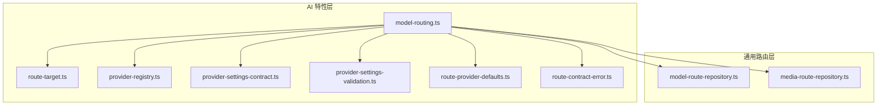
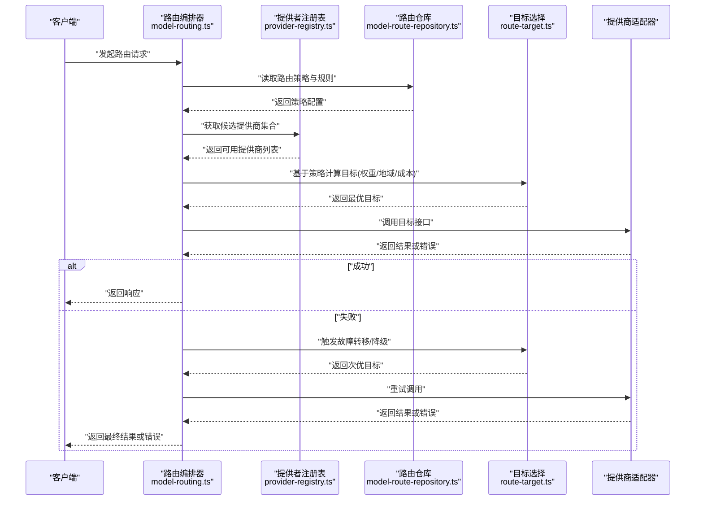
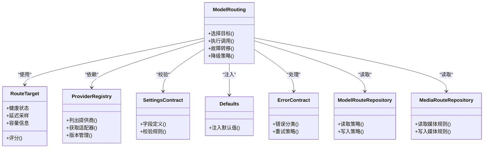

# 模型路由系统

<cite>
**本文引用的文件**   
- [model-routing.ts](file://src/features/ai/model-routing.ts)
- [model-routing.test.ts](file://src/features/ai/model-routing.test.ts)
- [route-target.ts](file://src/features/ai/route-target.ts)
- [provider-registry.ts](file://src/features/ai/provider-registry.ts)
- [provider-settings-contract.ts](file://src/features/ai/provider-settings-contract.ts)
- [provider-settings-validation.ts](file://src/features/ai/provider-settings-validation.ts)
- [route-provider-defaults.ts](file://src/features/ai/route-provider-defaults.ts)
- [route-contract-error.ts](file://src/features/ai/route-contract-error.ts)
- [media-route-repository.ts](file://src/features/routing/media-route-repository.ts)
- [model-route-repository.ts](file://src/features/routing/model-route-repository.ts)
</cite>

## 目录
1. [简介](#简介)
2. [项目结构](#项目结构)
3. [核心组件](#核心组件)
4. [架构总览](#架构总览)
5. [详细组件分析](#详细组件分析)
6. [依赖关系分析](#依赖关系分析)
7. [性能考量](#性能考量)
8. [故障排查指南](#故障排查指南)
9. [结论](#结论)
10. [附录](#附录)

## 简介
本文件面向“模型路由系统”，聚焦智能路由算法与策略配置，覆盖负载均衡、故障转移、性能监控等核心能力；阐述权重分配、地域选择、成本优化等策略选项；说明目标选择机制（健康检查、延迟检测、容量规划）；给出错误处理流程（熔断、降级、自动恢复）；并提供路由配置示例与监控指南（指标、日志、诊断方法）。

## 项目结构
模型路由相关代码主要分布在两个子域：
- AI 特性层：负责路由策略、提供者注册、目标选择与校验。
- 通用路由层：负责持久化与查询媒体/模型路由规则。

图表来源 
- [model-routing.ts](file://src/features/ai/model-routing.ts)
- [route-target.ts](file://src/features/ai/route-target.ts)
- [provider-registry.ts](file://src/features/ai/provider-registry.ts)
- [provider-settings-contract.ts](file://src/features/ai/provider-settings-contract.ts)
- [provider-settings-validation.ts](file://src/features/ai/provider-settings-validation.ts)
- [route-provider-defaults.ts](file://src/features/ai/route-provider-defaults.ts)
- [route-contract-error.ts](file://src/features/ai/route-contract-error.ts)
- [model-route-repository.ts](file://src/features/routing/model-route-repository.ts)
- [media-route-repository.ts](file://src/features/routing/media-route-repository.ts)

章节来源
- [model-routing.ts](file://src/features/ai/model-routing.ts)
- [model-route-repository.ts](file://src/features/routing/model-route-repository.ts)
- [media-route-repository.ts](file://src/features/routing/media-route-repository.ts)

## 核心组件
- 路由编排器（model-routing.ts）：聚合策略、提供者与目标，执行一次请求的路由决策与调用。
- 目标抽象（route-target.ts）：定义可被选中的具体端点（如某提供商实例），承载健康、延迟、容量等元数据。
- 提供者注册表（provider-registry.ts）：维护可用提供商及其适配器，支持动态发现与版本管理。
- 设置契约与校验（provider-settings-contract.ts, provider-settings-validation.ts）：统一提供商配置结构与校验规则。
- 默认值注入（route-provider-defaults.ts）：为缺失字段提供安全默认值，确保策略一致性。
- 合约错误（route-contract-error.ts）：标准化路由过程中的错误类型与消息。
- 路由仓库（model-route-repository.ts, media-route-repository.ts）：持久化与查询路由规则，支撑策略热更新。

章节来源
- [model-routing.ts](file://src/features/ai/model-routing.ts)
- [route-target.ts](file://src/features/ai/route-target.ts)
- [provider-registry.ts](file://src/features/ai/provider-registry.ts)
- [provider-settings-contract.ts](file://src/features/ai/provider-settings-contract.ts)
- [provider-settings-validation.ts](file://src/features/ai/provider-settings-validation.ts)
- [route-provider-defaults.ts](file://src/features/ai/route-provider-defaults.ts)
- [route-contract-error.ts](file://src/features/ai/route-contract-error.ts)
- [model-route-repository.ts](file://src/features/routing/model-route-repository.ts)
- [media-route-repository.ts](file://src/features/routing/media-route-repository.ts)

## 架构总览
下图展示了从请求进入路由编排器到最终命中目标并返回结果的完整流程，包含策略计算、健康检查、延迟探测、容量评估与容错路径。

图表来源 
- [model-routing.ts](file://src/features/ai/model-routing.ts)
- [provider-registry.ts](file://src/features/ai/provider-registry.ts)
- [model-route-repository.ts](file://src/features/routing/model-route-repository.ts)
- [route-target.ts](file://src/features/ai/route-target.ts)

## 详细组件分析

### 路由编排器（model-routing.ts）
职责
- 解析并应用路由策略（权重、地域、成本）。
- 协调提供者注册表与路由仓库，生成候选集。
- 执行目标选择与健康检查，必要时触发故障转移与降级。
- 记录关键指标与日志，便于监控与诊断。

关键点
- 策略优先级：通常按“地域亲和 > 成本阈值 > 权重分布 > 健康状态”顺序筛选。
- 容错路径：在首次失败后，依据健康与延迟重新评分，选择次优目标。
- 指标采集：统计成功率、延迟分位、熔断次数、降级次数等。

章节来源
- [model-routing.ts](file://src/features/ai/model-routing.ts)
- [model-routing.test.ts](file://src/features/ai/model-routing.test.ts)

### 目标选择（route-target.ts）
职责
- 抽象“目标”概念，封装健康状态、延迟、容量、地域、成本等维度。
- 提供评分函数，用于策略排序与择优。

关键点
- 健康检查：周期性探针（HTTP/TCP/业务探针）更新健康状态。
- 延迟检测：采样最近 N 次请求的延迟，计算均值与分位。
- 容量规划：根据队列长度、并发上限、资源利用率限制接入。

章节来源
- [route-target.ts](file://src/features/ai/route-target.ts)

### 提供者注册表（provider-registry.ts）
职责
- 维护提供商清单、版本信息与适配器映射。
- 支持动态添加/移除、灰度发布与回滚。

关键点
- 版本隔离：同一提供商多版本并存，路由时可指定版本。
- 健康联动：注册表暴露可用性视图，供路由编排器使用。

章节来源
- [provider-registry.ts](file://src/features/ai/provider-registry.ts)

### 设置契约与校验（provider-settings-contract.ts, provider-settings-validation.ts）
职责
- 定义提供商配置的必填字段、数据类型与取值范围。
- 实现校验逻辑，拦截非法配置，保障路由稳定性。

关键点
- 最小化配置：通过默认值降低配置复杂度。
- 强校验：对密钥、URL、超时、重试等关键字段进行严格校验。

章节来源
- [provider-settings-contract.ts](file://src/features/ai/provider-settings-contract.ts)
- [provider-settings-validation.ts](file://src/features/ai/provider-settings-validation.ts)

### 默认值注入（route-provider-defaults.ts）
职责
- 为缺失的配置项填充安全默认值，避免运行时异常。

关键点
- 默认超时、重试次数、熔断阈值等参数具备合理基线。
- 默认值可被上层策略覆盖，保持灵活性。

章节来源
- [route-provider-defaults.ts](file://src/features/ai/route-provider-defaults.ts)

### 合约错误（route-contract-error.ts）
职责
- 统一定义路由过程中的错误类型与消息格式。
- 区分可重试与不可重试错误，指导降级与熔断。

关键点
- 分类：网络错误、鉴权失败、限流、超时、业务校验失败等。
- 语义：明确是否可重试、是否需要熔断或降级。

章节来源
- [route-contract-error.ts](file://src/features/ai/route-contract-error.ts)

### 路由仓库（model-route-repository.ts, media-route-repository.ts）
职责
- 持久化存储路由规则与策略，支持热更新。
- 提供查询接口，供路由编排器实时读取最新配置。

关键点
- 版本化：每次变更生成新版本，支持快速回滚。
- 缓存：本地缓存最近策略，减少数据库压力。

章节来源
- [model-route-repository.ts](file://src/features/routing/model-route-repository.ts)
- [media-route-repository.ts](file://src/features/routing/media-route-repository.ts)

## 依赖关系分析

图表来源 
- [model-routing.ts](file://src/features/ai/model-routing.ts)
- [route-target.ts](file://src/features/ai/route-target.ts)
- [provider-registry.ts](file://src/features/ai/provider-registry.ts)
- [provider-settings-contract.ts](file://src/features/ai/provider-settings-contract.ts)
- [provider-settings-validation.ts](file://src/features/ai/provider-settings-validation.ts)
- [route-provider-defaults.ts](file://src/features/ai/route-provider-defaults.ts)
- [route-contract-error.ts](file://src/features/ai/route-contract-error.ts)
- [model-route-repository.ts](file://src/features/routing/model-route-repository.ts)
- [media-route-repository.ts](file://src/features/routing/media-route-repository.ts)

## 性能考量
- 延迟采样窗口：建议采用滑动窗口统计最近 N 次请求，平衡实时性与稳定性。
- 健康探针频率：高频探针带来更高准确性但增加开销，需权衡。
- 缓存策略：对路由策略与提供商清单做短期缓存，降低查询延迟。
- 并发控制：为目标设置最大并发与队列长度，防止过载。
- 指标采集：以非阻塞方式记录关键指标，避免影响主链路。

[本节为通用指导，不直接分析具体文件]

## 故障排查指南
常见问题与定位步骤
- 无可用目标
  - 检查健康探针与延迟采样是否正常。
  - 查看提供商注册表是否包含有效版本。
  - 确认路由仓库策略未误配导致全量剔除。
- 频繁熔断
  - 分析错误分类是否为可重试类。
  - 调整熔断阈值与冷却时间。
  - 检查下游限流与配额。
- 高延迟与抖动
  - 观察延迟分位与样本量。
  - 检查网络质量与跨地域访问。
  - 评估容量是否接近上限。

章节来源
- [route-contract-error.ts](file://src/features/ai/route-contract-error.ts)
- [model-routing.test.ts](file://src/features/ai/model-routing.test.ts)

## 结论
模型路由系统通过“策略驱动 + 目标评分 + 容错路径”的组合，实现了灵活的负载均衡、故障转移与性能优化。借助统一的设置契约与错误分类，系统在复杂环境下仍保持稳定与可观测性。建议在生产环境持续完善健康探针、延迟采样与容量规划，结合监控与日志形成闭环优化。

[本节为总结性内容，不直接分析具体文件]

## 附录

### 路由策略配置示例
- 权重分配
  - 为不同提供商实例设置权重，按比例分流。
  - 支持按地域或版本分组加权。
- 地域选择
  - 优先选择用户所在区域或低延迟区域。
  - 支持强制指定或兜底回退。
- 成本优化
  - 在满足 SLA 的前提下优先低成本提供商。
  - 支持成本阈值与预算控制。

[本节为概念性说明，不直接分析具体文件]

### 监控与日志
- 关键指标
  - 成功率、错误率、P50/P95/P99 延迟、熔断次数、降级次数。
- 日志记录
  - 记录路由决策过程、目标选择原因、错误分类与重试次数。
- 故障诊断
  - 通过指标与日志定位瓶颈与异常根因。
  - 结合健康探针与延迟采样验证恢复效果。

[本节为概念性说明，不直接分析具体文件]