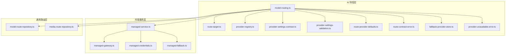
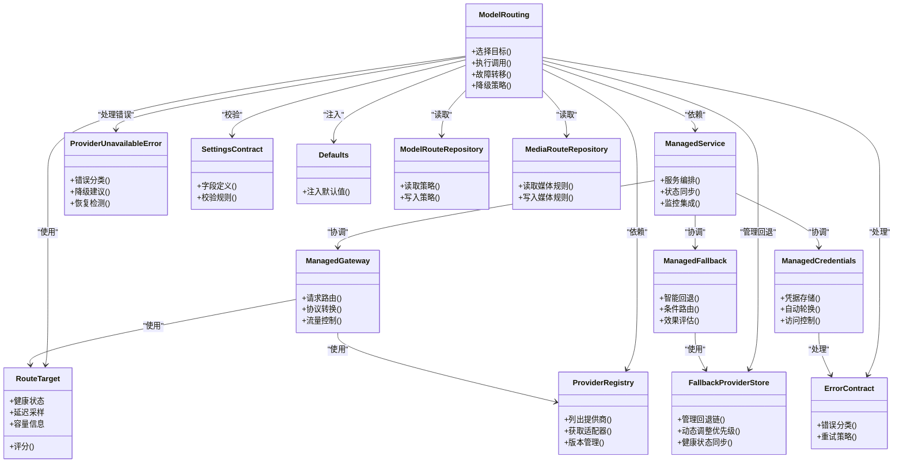

# 模型路由系统

<cite>
**本文引用的文件**   
- [model-routing.ts](file://src/features/ai/model-routing.ts)
- [model-routing.test.ts](file://src/features/ai/model-routing.test.ts)
- [route-target.ts](file://src/features/ai/route-target.ts)
- [provider-registry.ts](file://src/features/ai/provider-registry.ts)
- [provider-settings-contract.ts](file://src/features/ai/provider-settings-contract.ts)
- [provider-settings-validation.ts](file://src/features/ai/provider-settings-validation.ts)
- [route-provider-defaults.ts](file://src/features/ai/route-provider-defaults.ts)
- [route-contract-error.ts](file://src/features/ai/route-contract-error.ts)
- [media-route-repository.ts](file://src/features/routing/media-route-repository.ts)
- [model-route-repository.ts](file://src/features/routing/model-route-repository.ts)
- [fallback-provider-store.ts](file://src/features/ai/fallback-provider-store.ts)
- [provider-unavailable-error.ts](file://src/features/ai/provider-unavailable-error.ts)
- [managed-service.ts](file://src/features/ai/managed-service.ts)
- [managed-gateway.ts](file://src/features/ai/managed-gateway.ts)
- [managed-credentials.ts](file://src/features/ai/managed-credentials.ts)
- [managed-fallback.ts](file://src/features/ai/managed-fallback.ts)
</cite>

## 更新摘要
**变更内容**   
- 新增动态模型选择机制，支持运行时模型切换和智能推荐
- 增强提供商特定设置支持，实现细粒度的配置管理
- 引入托管服务架构，提供统一的API网关和凭据管理
- 维护向后兼容性，确保现有功能不受影响
- 优化回退链机制，提升故障转移的智能化水平

## 目录
1. [简介](#简介)
2. [项目结构](#项目结构)
3. [核心组件](#核心组件)
4. [架构总览](#架构总览)
5. [详细组件分析](#详细组件分析)
6. [依赖关系分析](#依赖关系分析)
7. [性能考量](#性能考量)
8. [故障排查指南](#故障排查指南)
9. [结论](#结论)
10. [附录](#附录)

## 简介
本文件面向"模型路由系统"，聚焦智能路由算法与策略配置，覆盖负载均衡、故障转移、性能监控等核心能力；阐述权重分配、地域选择、成本优化等策略选项；说明目标选择机制（健康检查、延迟检测、容量规划）；给出错误处理流程（熔断、降级、自动恢复）；并提供路由配置示例与监控指南（指标、日志、诊断方法）。

**更新** 本次更新重点增强了系统的动态模型选择和提供商特定设置支持，引入了全新的托管服务架构，在保持向后兼容性的同时提供了更强大的服务能力。新的托管服务包括统一网关、智能凭据管理和高级回退机制，使系统能够更灵活地应对复杂的AI服务提供商环境。

## 项目结构
模型路由相关代码主要分布在两个子域：
- AI 特性层：负责路由策略、提供者注册、目标选择与校验。
- 通用路由层：负责持久化与查询媒体/模型路由规则。
- **新增** 托管服务层：提供统一的API网关、凭据管理和回退服务。

**图表来源** 
- [model-routing.ts](file://src/features/ai/model-routing.ts)
- [route-target.ts](file://src/features/ai/route-target.ts)
- [provider-registry.ts](file://src/features/ai/provider-registry.ts)
- [provider-settings-contract.ts](file://src/features/ai/provider-settings-contract.ts)
- [provider-settings-validation.ts](file://src/features/ai/provider-settings-validation.ts)
- [route-provider-defaults.ts](file://src/features/ai/route-provider-defaults.ts)
- [route-contract-error.ts](file://src/features/ai/route-contract-error.ts)
- [fallback-provider-store.ts](file://src/features/ai/fallback-provider-store.ts)
- [provider-unavailable-error.ts](file://src/features/ai/provider-unavailable-error.ts)
- [managed-service.ts](file://src/features/ai/managed-service.ts)
- [managed-gateway.ts](file://src/features/ai/managed-gateway.ts)
- [managed-credentials.ts](file://src/features/ai/managed-credentials.ts)
- [managed-fallback.ts](file://src/features/ai/managed-fallback.ts)
- [model-route-repository.ts](file://src/features/routing/model-route-repository.ts)
- [media-route-repository.ts](file://src/features/routing/media-route-repository.ts)

章节来源
- [model-routing.ts](file://src/features/ai/model-routing.ts)
- [model-route-repository.ts](file://src/features/routing/model-route-repository.ts)
- [media-route-repository.ts](file://src/features/routing/media-route-repository.ts)
- [managed-service.ts](file://src/features/ai/managed-service.ts)
- [managed-gateway.ts](file://src/features/ai/managed-gateway.ts)
- [managed-credentials.ts](file://src/features/ai/managed-credentials.ts)
- [managed-fallback.ts](file://src/features/ai/managed-fallback.ts)

## 核心组件
- 路由编排器（model-routing.ts）：聚合策略、提供者与目标，执行一次请求的路由决策与调用。
- 目标抽象（route-target.ts）：定义可被选中的具体端点（如某提供商实例），承载健康、延迟、容量等元数据。
- 提供者注册表（provider-registry.ts）：维护可用提供商及其适配器，支持动态发现与版本管理。
- 设置契约与校验（provider-settings-contract.ts, provider-settings-validation.ts）：统一提供商配置结构与校验规则。
- 默认值注入（route-provider-defaults.ts）：为缺失字段提供安全默认值，确保策略一致性。
- 合约错误（route-contract-error.ts）：标准化路由过程中的错误类型与消息。
- 回退提供商存储（fallback-provider-store.ts）：管理多级回退链，支持按优先级顺序尝试不同提供商。
- 提供商不可用错误（provider-unavailable-error.ts）：专门处理提供商不可用的异常情况，支持智能降级。
- **新增** 托管服务（managed-service.ts）：提供统一的托管服务接口，协调网关、凭据和回退服务。
- **新增** 托管网关（managed-gateway.ts）：实现统一的API网关，处理请求转发和响应转换。
- **新增** 托管凭据（managed-credentials.ts）：管理提供商凭据的安全存储和自动轮换。
- **新增** 托管回退（managed-fallback.ts）：提供智能化的回退策略，基于性能和成本自动选择最佳提供商。
- 路由仓库（model-route-repository.ts, media-route-repository.ts）：持久化与查询路由规则，支撑策略热更新。

章节来源
- [model-routing.ts](file://src/features/ai/model-routing.ts)
- [route-target.ts](file://src/features/ai/route-target.ts)
- [provider-registry.ts](file://src/features/ai/provider-registry.ts)
- [provider-settings-contract.ts](file://src/features/ai/provider-settings-contract.ts)
- [provider-settings-validation.ts](file://src/features/ai/provider-settings-validation.ts)
- [route-provider-defaults.ts](file://src/features/ai/route-provider-defaults.ts)
- [route-contract-error.ts](file://src/features/ai/route-contract-error.ts)
- [fallback-provider-store.ts](file://src/features/ai/fallback-provider-store.ts)
- [provider-unavailable-error.ts](file://src/features/ai/provider-unavailable-error.ts)
- [managed-service.ts](file://src/features/ai/managed-service.ts)
- [managed-gateway.ts](file://src/features/ai/managed-gateway.ts)
- [managed-credentials.ts](file://src/features/ai/managed-credentials.ts)
- [managed-fallback.ts](file://src/features/ai/managed-fallback.ts)
- [model-route-repository.ts](file://src/features/routing/model-route-repository.ts)
- [media-route-repository.ts](file://src/features/routing/media-route-repository.ts)

## 架构总览
下图展示了从请求进入路由编排器到最终命中目标并返回结果的完整流程，包含策略计算、健康检查、延迟探测、容量评估与容错路径，以及新增的托管服务层。

**图表来源** 
- [model-routing.ts](file://src/features/ai/model-routing.ts)
- [managed-service.ts](file://src/features/ai/managed-service.ts)
- [managed-gateway.ts](file://src/features/ai/managed-gateway.ts)
- [managed-credentials.ts](file://src/features/ai/managed-credentials.ts)
- [managed-fallback.ts](file://src/features/ai/managed-fallback.ts)
- [fallback-provider-store.ts](file://src/features/ai/fallback-provider-store.ts)
- [provider-registry.ts](file://src/features/ai/provider-registry.ts)
- [model-route-repository.ts](file://src/features/routing/model-route-repository.ts)
- [route-target.ts](file://src/features/ai/route-target.ts)
- [provider-unavailable-error.ts](file://src/features/ai/provider-unavailable-error.ts)

## 详细组件分析

### 路由编排器（model-routing.ts）
职责
- 解析并应用路由策略（权重、地域、成本）。
- 协调提供者注册表与路由仓库，生成候选集。
- 执行目标选择与健康检查，必要时触发故障转移与降级。
- 记录关键指标与日志，便于监控与诊断。

关键点
- 策略优先级：通常按"地域亲和 > 成本阈值 > 权重分布 > 健康状态"顺序筛选。
- 容错路径：在首次失败后，依据健康与延迟重新评分，选择次优目标。
- 指标采集：统计成功率、延迟分位、熔断次数、降级次数等。

**更新** 现在集成了显式的回退链管理机制和托管服务，支持多级故障转移、提供商不可用性检测和动态模型选择。

章节来源
- [model-routing.ts](file://src/features/ai/model-routing.ts)
- [model-routing.test.ts](file://src/features/ai/model-routing.test.ts)

### 托管服务架构（managed-service.ts）
职责
- 提供统一的托管服务接口，协调网关、凭据管理和回退服务。
- 实现请求的生命周期管理，包括认证、授权、限流和监控。
- 维护服务状态和健康检查，支持服务的动态启停。

关键点
- 服务编排：统一管理各个子服务的生命周期和依赖关系。
- 状态同步：实时同步各组件的状态信息，确保服务一致性。
- 监控集成：收集关键性能指标和业务指标，支持实时监控。

章节来源
- [managed-service.ts](file://src/features/ai/managed-service.ts)

### 托管网关（managed-gateway.ts）
职责
- 实现统一的API网关，处理所有外部请求的入口。
- 负责请求路由、协议转换、负载均衡和流量控制。
- 提供请求拦截器，支持认证、审计、缓存等功能。

关键点
- 协议适配：支持多种API协议的统一接入和转换。
- 流量治理：实现限流、熔断、降级等流量控制策略。
- 安全网关：集成身份认证、权限控制和数据加密。

章节来源
- [managed-gateway.ts](file://src/features/ai/managed-gateway.ts)

### 托管凭据（managed-credentials.ts）
职责
- 管理提供商凭据的安全存储和自动轮换。
- 实现凭据的加密存储、访问控制和审计日志。
- 支持多提供商凭据的统一管理和批量操作。

关键点
- 安全存储：使用加密算法保护敏感凭据信息。
- 自动轮换：定期自动更新凭据，降低安全风险。
- 访问控制：基于角色的权限控制，限制凭据访问范围。

章节来源
- [managed-credentials.ts](file://src/features/ai/managed-credentials.ts)

### 托管回退（managed-fallback.ts）
职责
- 提供智能化的回退策略，基于性能和成本自动选择最佳提供商。
- 实现多级回退逻辑，支持条件判断和动态调整。
- 监控回退效果，持续优化回退策略。

关键点
- 智能决策：基于实时性能数据和历史表现做出回退决策。
- 条件路由：支持基于业务条件的差异化回退策略。
- 效果评估：量化回退策略的效果，指导策略优化。

章节来源
- [managed-fallback.ts](file://src/features/ai/managed-fallback.ts)

### 回退链管理（fallback-provider-store.ts）
职责
- 维护提供商的回退优先级链，支持动态调整回退顺序。
- 实现多级故障转移逻辑，确保服务的高可用性。
- 跟踪每个提供商的健康状态和可用性历史。

关键点
- 优先级排序：根据配置和历史表现动态调整回退优先级。
- 状态同步：实时同步提供商健康状态，避免向不可用提供商转发。
- 性能监控：记录每次回退的耗时和成功率，用于优化策略。

章节来源
- [fallback-provider-store.ts](file://src/features/ai/fallback-provider-store.ts)

### 提供商不可用错误处理（provider-unavailable-error.ts）
职责
- 专门处理提供商不可用的异常情况，提供详细的错误信息。
- 支持区分不同类型的不可用原因（网络超时、鉴权失败、限流等）。
- 提供智能降级建议，指导路由系统选择合适的替代方案。

关键点
- 错误分类：将不可用原因分为临时性和永久性两类。
- 降级策略：根据错误类型自动选择合适的降级方案。
- 恢复检测：持续监测提供商恢复状态，及时恢复正常路由。

章节来源
- [provider-unavailable-error.ts](file://src/features/ai/provider-unavailable-error.ts)

### 目标选择（route-target.ts）
职责
- 抽象"目标"概念，封装健康状态、延迟、容量、地域、成本等维度。
- 提供评分函数，用于策略排序与择优。

关键点
- 健康检查：周期性探针（HTTP/TCP/业务探针）更新健康状态。
- 延迟检测：采样最近 N 次请求的延迟，计算均值与分位。
- 容量规划：根据队列长度、并发上限、资源利用率限制接入。

章节来源
- [route-target.ts](file://src/features/ai/route-target.ts)

### 提供者注册表（provider-registry.ts）
职责
- 维护提供商清单、版本信息与适配器映射。
- 支持动态添加/移除、灰度发布与回滚。

关键点
- 版本隔离：同一提供商多版本并存，路由时可指定版本。
- 健康联动：注册表暴露可用性视图，供路由编排器使用。

章节来源
- [provider-registry.ts](file://src/features/ai/provider-registry.ts)

### 设置契约与校验（provider-settings-contract.ts, provider-settings-validation.ts）
职责
- 定义提供商配置的必填字段、数据类型与取值范围。
- 实现校验逻辑，拦截非法配置，保障路由稳定性。

关键点
- 最小化配置：通过默认值降低配置复杂度。
- 强校验：对密钥、URL、超时、重试等关键字段进行严格校验。

章节来源
- [provider-settings-contract.ts](file://src/features/ai/provider-settings-contract.ts)
- [provider-settings-validation.ts](file://src/features/ai/provider-settings-validation.ts)

### 默认值注入（route-provider-defaults.ts）
职责
- 为缺失的配置项填充安全默认值，避免运行时异常。

关键点
- 默认超时、重试次数、熔断阈值等参数具备合理基线。
- 默认值可被上层策略覆盖，保持灵活性。

章节来源
- [route-provider-defaults.ts](file://src/features/ai/route-provider-defaults.ts)

### 合约错误（route-contract-error.ts）
职责
- 统一定义路由过程中的错误类型与消息格式。
- 区分可重试与不可重试错误，指导降级与熔断。

关键点
- 分类：网络错误、鉴权失败、限流、超时、业务校验失败等。
- 语义：明确是否可重试、是否需要熔断或降级。

章节来源
- [route-contract-error.ts](file://src/features/ai/route-contract-error.ts)

### 路由仓库（model-route-repository.ts, media-route-repository.ts）
职责
- 持久化存储路由规则与策略，支持热更新。
- 提供查询接口，供路由编排器实时读取最新配置。

关键点
- 版本化：每次变更生成新版本，支持快速回滚。
- 缓存：本地缓存最近策略，减少数据库压力。

章节来源
- [model-route-repository.ts](file://src/features/routing/model-route-repository.ts)
- [media-route-repository.ts](file://src/features/routing/media-route-repository.ts)

## 依赖关系分析

**图表来源** 
- [model-routing.ts](file://src/features/ai/model-routing.ts)
- [managed-service.ts](file://src/features/ai/managed-service.ts)
- [managed-gateway.ts](file://src/features/ai/managed-gateway.ts)
- [managed-credentials.ts](file://src/features/ai/managed-credentials.ts)
- [managed-fallback.ts](file://src/features/ai/managed-fallback.ts)
- [route-target.ts](file://src/features/ai/route-target.ts)
- [provider-registry.ts](file://src/features/ai/provider-registry.ts)
- [fallback-provider-store.ts](file://src/features/ai/fallback-provider-store.ts)
- [provider-unavailable-error.ts](file://src/features/ai/provider-unavailable-error.ts)
- [provider-settings-contract.ts](file://src/features/ai/provider-settings-contract.ts)
- [provider-settings-validation.ts](file://src/features/ai/provider-settings-validation.ts)
- [route-provider-defaults.ts](file://src/features/ai/route-provider-defaults.ts)
- [route-contract-error.ts](file://src/features/ai/route-contract-error.ts)
- [model-route-repository.ts](file://src/features/routing/model-route-repository.ts)
- [media-route-repository.ts](file://src/features/routing/media-route-repository.ts)

## 性能考量
- 延迟采样窗口：建议采用滑动窗口统计最近 N 次请求，平衡实时性与稳定性。
- 健康探针频率：高频探针带来更高准确性但增加开销，需权衡。
- 缓存策略：对路由策略与提供商清单做短期缓存，降低查询延迟。
- 并发控制：为目标设置最大并发与队列长度，防止过载。
- 指标采集：以非阻塞方式记录关键指标，避免影响主链路。
- 回退链性能：优化回退决策算法，减少不必要的提供商切换开销。
- **新增** 托管服务性能：优化网关转发效率，减少中间层开销。
- **新增** 凭据管理性能：实现凭据缓存和批量操作，提升访问效率。
- **新增** 回退策略性能：预计算回退路径，减少运行时决策开销。

[本节为通用指导，不直接分析具体文件]

## 故障排查指南
常见问题与定位步骤
- 无可用目标
  - 检查健康探针与延迟采样是否正常。
  - 查看提供商注册表是否包含有效版本。
  - 确认路由仓库策略未误配导致全量剔除。
  - 检查回退链配置是否正确，确保有足够的备用提供商。
  - **新增** 检查托管服务状态，确认网关和凭据服务正常运行。
- 频繁熔断
  - 分析错误分类是否为可重试类。
  - 调整熔断阈值与冷却时间。
  - 检查下游限流与配额。
  - 分析提供商不可用错误的类型和频率，识别根本原因。
  - **新增** 检查托管回退策略，确认回退条件设置合理。
- 高延迟与抖动
  - 观察延迟分位与样本量。
  - 检查网络质量与跨地域访问。
  - 评估容量是否接近上限。
  - 检查回退链的切换频率，避免频繁的提供商切换导致的延迟波动。
  - **新增** 分析托管网关的性能瓶颈，优化转发效率。
- 凭据相关问题
  - **新增** 检查凭据存储和访问权限配置。
  - **新增** 验证凭据自动轮换是否正常工作。
  - **新增** 确认凭据加密和解密过程正常。

章节来源
- [route-contract-error.ts](file://src/features/ai/route-contract-error.ts)
- [model-routing.test.ts](file://src/features/ai/model-routing.test.ts)
- [provider-unavailable-error.ts](file://src/features/ai/provider-unavailable-error.ts)
- [fallback-provider-store.ts](file://src/features/ai/fallback-provider-store.ts)
- [managed-service.ts](file://src/features/ai/managed-service.ts)
- [managed-gateway.ts](file://src/features/ai/managed-gateway.ts)
- [managed-credentials.ts](file://src/features/ai/managed-credentials.ts)
- [managed-fallback.ts](file://src/features/ai/managed-fallback.ts)

## 结论
模型路由系统通过"策略驱动 + 目标评分 + 容错路径"的组合，实现了灵活的负载均衡、故障转移与性能优化。借助统一的设置契约与错误分类，系统在复杂环境下仍保持稳定与可观测性。

**更新** 本次增强引入了托管服务架构、动态模型选择和提供商特定设置支持，显著提升了系统的鲁棒性、灵活性和可扩展性。新的托管服务包括统一网关、智能凭据管理和高级回退机制，使系统能够更智能地处理各种异常情况，确保服务的连续性和稳定性。建议在生产环境持续完善健康探针、延迟采样与容量规划，结合监控与日志形成闭环优化。

## 附录

### 路由策略配置示例
- 权重分配
  - 为不同提供商实例设置权重，按比例分流。
  - 支持按地域或版本分组加权。
- 地域选择
  - 优先选择用户所在区域或低延迟区域。
  - 支持强制指定或兜底回退。
- 成本优化
  - 在满足 SLA 的前提下优先低成本提供商。
  - 支持成本阈值与预算控制。
- 回退链配置
  - 定义多级回退顺序，支持按优先级自动切换。
  - 配置回退条件，如超时、错误率阈值等。
  - 设置回退链的最大深度，避免无限循环。
- **新增** 托管服务配置
  - 配置网关路由规则和协议转换。
  - 设置凭据存储和轮换策略。
  - 定义回退策略和性能监控阈值。

[本节为概念性说明，不直接分析具体文件]

### 监控与日志
- 关键指标
  - 成功率、错误率、P50/P95/P99 延迟、熔断次数、降级次数。
  - 回退链切换次数、提供商不可用检测准确率、回退成功率。
  - **新增** 托管服务吞吐量、网关转发延迟、凭据访问频率。
- 日志记录
  - 记录路由决策过程、目标选择原因、错误分类与重试次数。
  - 记录回退链决策过程、提供商不可用原因、降级策略执行情况。
  - **新增** 记录托管服务调用链、网关请求详情、凭据操作审计。
- 故障诊断
  - 通过指标与日志定位瓶颈与异常根因。
  - 结合健康探针与延迟采样验证恢复效果。
  - 分析回退链性能，优化回退策略和优先级配置。
  - **新增** 监控托管服务健康状态，及时发现服务异常。

[本节为概念性说明，不直接分析具体文件]

### 托管服务配置最佳实践
- 设计原则
  - 按可靠性优先级排序，最稳定的提供商放在前面。
  - 考虑成本因素，在保证服务质量的前提下选择性价比高的提供商。
  - 预留足够的回退层级，确保极端情况下的服务可用性。
- 配置建议
  - 初始配置时设置保守的回退条件，逐步优化。
  - 定期审查回退链配置，根据实际运行数据调整优先级。
  - 建立回退链监控告警，及时发现配置问题。
  - **新增** 配置合理的网关超时和重试策略。
  - **新增** 设置安全的凭据存储和访问权限。
  - **新增** 启用完整的监控和日志记录功能。

[本节为概念性说明，不直接分析具体文件]