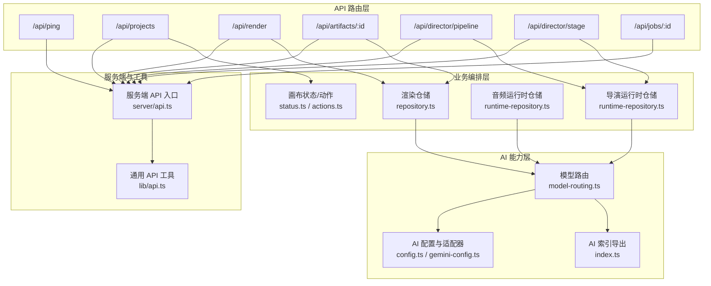
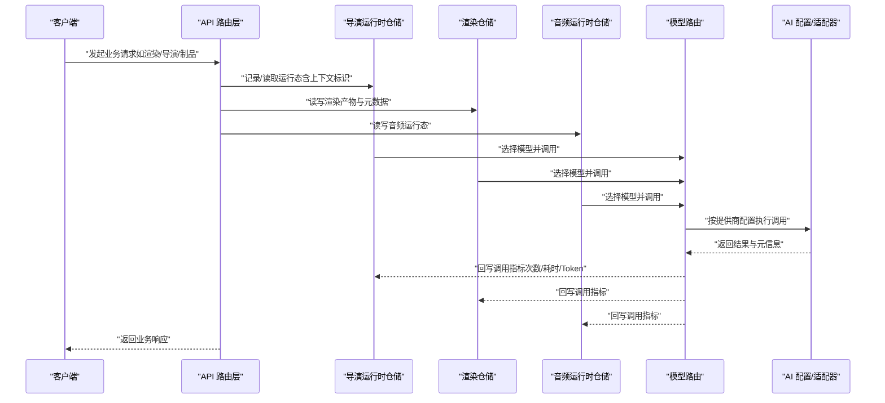
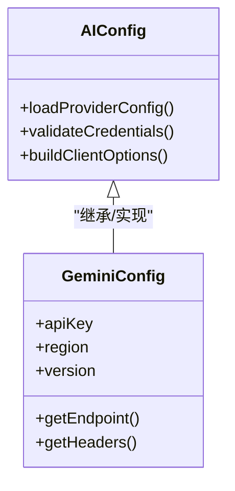
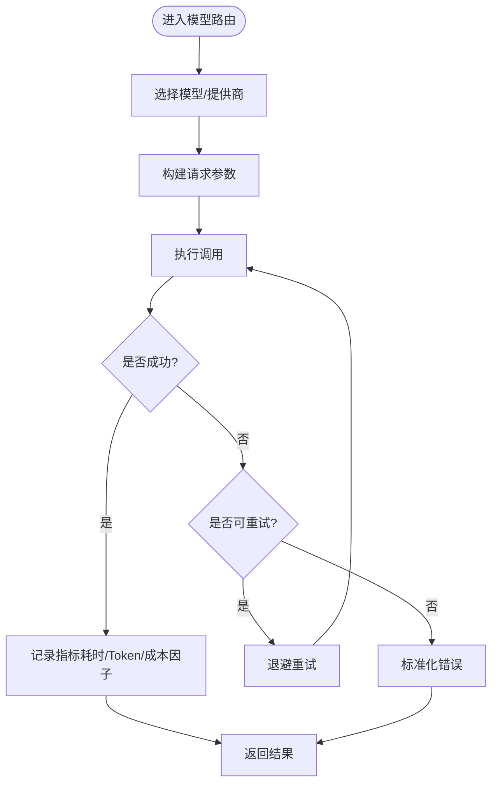
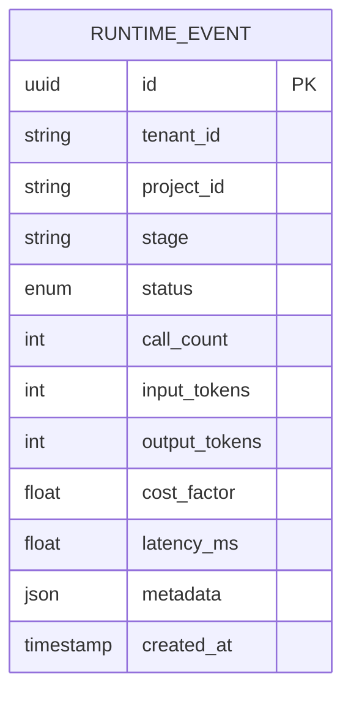
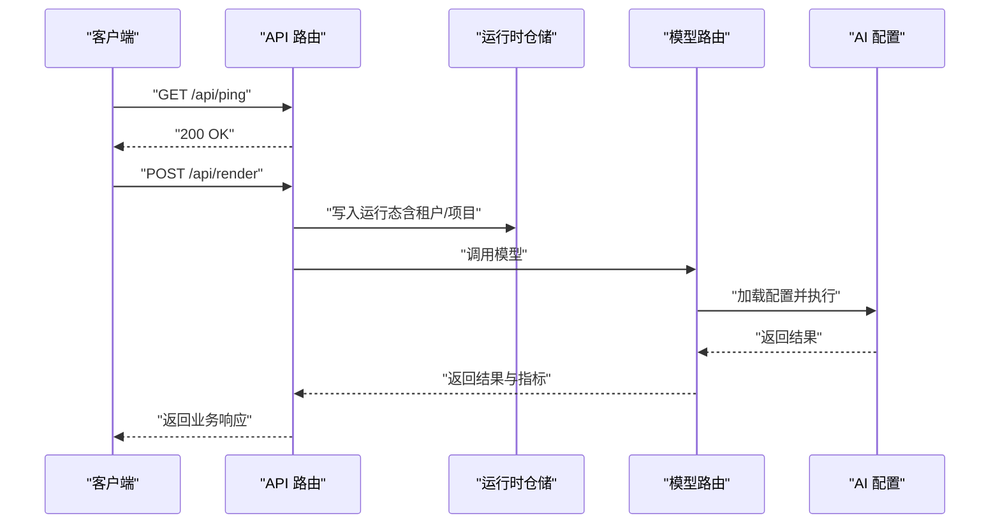
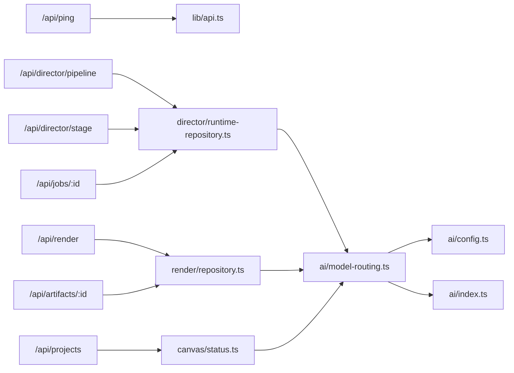

# AI 使用量 API

<cite>
**本文引用的文件**   
- [src/features/ai/config.ts](file://src/features/ai/config.ts)
- [src/features/ai/gemini-config.ts](file://src/features/ai/gemini-config.ts)
- [src/features/ai/model-routing.ts](file://src/features/ai/model-routing.ts)
- [src/features/ai/index.ts](file://src/features/ai/index.ts)
- [src/lib/api.ts](file://src/lib/api.ts)
- [server/src/server/api.ts](file://server/src/server/api.ts)
- [src/app/api/ping/route.ts](file://src/app/api/ping/route.ts)
- [src/app/api/projects/route.ts](file://src/app/api/projects/route.ts)
- [src/app/api/render/route.ts](file://src/app/api/render/route.ts)
- [src/app/api/artifacts/[id]/route.ts](file://src/app/api/artifacts/[id]/route.ts)
- [src/app/api/director/pipeline/route.ts](file://src/app/api/director/pipeline/route.ts)
- [src/app/api/director/stage/route.ts](file://src/app/api/director/stage/route.ts)
- [src/app/api/jobs/[id]/route.ts](file://src/app/api/jobs/[id]/route.ts)
- [src/features/director/pi-provider.ts](file://src/features/director/pi-provider.ts)
- [src/features/director/runtime-repository.ts](file://src/features/director/runtime-repository.ts)
- [src/features/audio/runtime-repository.ts](file://src/features/audio/runtime-repository.ts)
- [src/features/render/repository.ts](file://src/features/render/repository.ts)
- [src/features/canvas/status.ts](file://src/features/canvas/status.ts)
- [src/features/canvas/actions.ts](file://src/features/canvas/actions.ts)
</cite>

## 目录
1. [简介](#简介)
2. [项目结构](#项目结构)
3. [核心组件](#核心组件)
4. [架构总览](#架构总览)
5. [详细组件分析](#详细组件分析)
6. [依赖关系分析](#依赖关系分析)
7. [性能考量](#性能考量)
8. [故障排查指南](#故障排查指南)
9. [结论](#结论)
10. [附录](#附录)

## 简介
本文件为 PurpleInk AI 使用量统计系统的 API 文档，聚焦于 AI 服务调用的计量、统计与分析能力。内容涵盖：
- 不同模型的调用次数、token 消耗与成本计算的接口规范
- 用量趋势分析、配额检查与报告生成接口说明
- 实时监控、告警通知与历史数据查询的 API 支持
- 多租户隔离、数据聚合与性能优化的实现要点

本仓库中未直接暴露“用量统计”的专用 REST 端点；现有代码通过 AI 配置、模型路由、运行时仓储与渲染/导演管道等模块间接采集与存储调用指标。本文基于这些模块的职责与交互，给出面向“用量统计”的 API 设计建议与集成方式，并标注相关源码位置以便追溯。

## 项目结构
与 AI 使用量相关的代码主要分布在以下区域：
- AI 能力层：模型配置、适配器与路由（features/ai）
- 业务编排层：导演与渲染管线（features/director, features/render）
- 运行时与持久化：各域运行时仓储（features/*/runtime-repository.ts, repository.ts）
- API 路由层：Next.js App Router 下的 /api 路由（app/api/*）
- 服务端入口与通用 API 工具（server/src/server/api.ts, src/lib/api.ts）

图表来源
- [src/app/api/ping/route.ts](file://src/app/api/ping/route.ts)
- [src/app/api/projects/route.ts](file://src/app/api/projects/route.ts)
- [src/app/api/render/route.ts](file://src/app/api/render/route.ts)
- [src/app/api/artifacts/[id]/route.ts](file://src/app/api/artifacts/[id]/route.ts)
- [src/app/api/director/pipeline/route.ts](file://src/app/api/director/pipeline/route.ts)
- [src/app/api/director/stage/route.ts](file://src/app/api/director/stage/route.ts)
- [src/app/api/jobs/[id]/route.ts](file://src/app/api/jobs/[id]/route.ts)
- [src/features/ai/config.ts](file://src/features/ai/config.ts)
- [src/features/ai/gemini-config.ts](file://src/features/ai/gemini-config.ts)
- [src/features/ai/model-routing.ts](file://src/features/ai/model-routing.ts)
- [src/features/ai/index.ts](file://src/features/ai/index.ts)
- [src/features/director/runtime-repository.ts](file://src/features/director/runtime-repository.ts)
- [src/features/render/repository.ts](file://src/features/render/repository.ts)
- [src/features/audio/runtime-repository.ts](file://src/features/audio/runtime-repository.ts)
- [src/features/canvas/status.ts](file://src/features/canvas/status.ts)
- [src/features/canvas/actions.ts](file://src/features/canvas/actions.ts)
- [server/src/server/api.ts](file://server/src/server/api.ts)
- [src/lib/api.ts](file://src/lib/api.ts)

章节来源
- [src/features/ai/config.ts](file://src/features/ai/config.ts)
- [src/features/ai/gemini-config.ts](file://src/features/ai/gemini-config.ts)
- [src/features/ai/model-routing.ts](file://src/features/ai/model-routing.ts)
- [src/features/ai/index.ts](file://src/features/ai/index.ts)
- [src/lib/api.ts](file://src/lib/api.ts)
- [server/src/server/api.ts](file://server/src/server/api.ts)

## 核心组件
- AI 配置与适配器
  - 负责加载与校验不同模型提供商的配置（如 Gemini），并提供统一的调用契约。
  - 关键文件：[src/features/ai/config.ts](file://src/features/ai/config.ts)、[src/features/ai/gemini-config.ts](file://src/features/ai/gemini-config.ts)
- 模型路由
  - 根据策略选择具体模型或提供商，统一封装请求参数与响应解析。
  - 关键文件：[src/features/ai/model-routing.ts](file://src/features/ai/model-routing.ts)、[src/features/ai/index.ts](file://src/features/ai/index.ts)
- 运行时仓储
  - 记录各阶段运行态数据（导演、渲染、音频等），可作为用量指标的持久化载体。
  - 关键文件：[src/features/director/runtime-repository.ts](file://src/features/director/runtime-repository.ts)、[src/features/render/repository.ts](file://src/features/render/repository.ts)、[src/features/audio/runtime-repository.ts](file://src/features/audio/runtime-repository.ts)
- API 路由与服务端入口
  - Next.js App Router 暴露 HTTP 接口；服务端入口提供中间件与错误处理。
  - 关键文件：[src/app/api/*](file://src/app/api/ping/route.ts)、[server/src/server/api.ts](file://server/src/server/api.ts)、[src/lib/api.ts](file://src/lib/api.ts)

章节来源
- [src/features/ai/config.ts](file://src/features/ai/config.ts)
- [src/features/ai/gemini-config.ts](file://src/features/ai/gemini-config.ts)
- [src/features/ai/model-routing.ts](file://src/features/ai/model-routing.ts)
- [src/features/ai/index.ts](file://src/features/ai/index.ts)
- [src/features/director/runtime-repository.ts](file://src/features/director/runtime-repository.ts)
- [src/features/render/repository.ts](file://src/features/render/repository.ts)
- [src/features/audio/runtime-repository.ts](file://src/features/audio/runtime-repository.ts)
- [src/app/api/ping/route.ts](file://src/app/api/ping/route.ts)
- [server/src/server/api.ts](file://server/src/server/api.ts)
- [src/lib/api.ts](file://src/lib/api.ts)

## 架构总览
下图展示了从 API 路由到 AI 能力层与运行时仓储的整体调用链，体现“调用—计量—持久化”的关键路径。

图表来源
- [src/app/api/render/route.ts](file://src/app/api/render/route.ts)
- [src/app/api/director/pipeline/route.ts](file://src/app/api/director/pipeline/route.ts)
- [src/app/api/director/stage/route.ts](file://src/app/api/director/stage/route.ts)
- [src/app/api/artifacts/[id]/route.ts](file://src/app/api/artifacts/[id]/route.ts)
- [src/features/director/runtime-repository.ts](file://src/features/director/runtime-repository.ts)
- [src/features/render/repository.ts](file://src/features/render/repository.ts)
- [src/features/audio/runtime-repository.ts](file://src/features/audio/runtime-repository.ts)
- [src/features/ai/model-routing.ts](file://src/features/ai/model-routing.ts)
- [src/features/ai/config.ts](file://src/features/ai/config.ts)

## 详细组件分析

### AI 配置与适配器（Gemini 为例）
- 职责
  - 加载并校验模型提供商配置（密钥、区域、版本等）。
  - 定义统一的调用签名与错误映射。
- 计量点
  - 在调用前后记录时间戳、输入输出长度（可估算 Token）、错误码与重试次数。
- 扩展性
  - 新增提供商时，遵循统一适配器接口，复用模型路由与计量逻辑。

图表来源
- [src/features/ai/config.ts](file://src/features/ai/config.ts)
- [src/features/ai/gemini-config.ts](file://src/features/ai/gemini-config.ts)

章节来源
- [src/features/ai/config.ts](file://src/features/ai/config.ts)
- [src/features/ai/gemini-config.ts](file://src/features/ai/gemini-config.ts)

### 模型路由与调用流程
- 职责
  - 依据策略（优先级、负载、成本）选择模型实例。
  - 统一封装请求参数、重试、超时与错误处理。
- 计量点
  - 记录每次调用的模型名称、提供商、请求 ID、耗时、状态码、Token 估算值、成本计算因子。
- 数据流
  - 上游业务（导演/渲染/音频）通过路由发起调用，路由将指标写入对应运行时仓储。

图表来源
- [src/features/ai/model-routing.ts](file://src/features/ai/model-routing.ts)
- [src/features/ai/index.ts](file://src/features/ai/index.ts)

章节来源
- [src/features/ai/model-routing.ts](file://src/features/ai/model-routing.ts)
- [src/features/ai/index.ts](file://src/features/ai/index.ts)

### 运行时仓储与指标持久化
- 职责
  - 持久化各阶段的运行态数据，包括任务 ID、租户/项目标识、阶段、状态、资源使用等。
- 计量点
  - 在仓储写入时附带用量字段（调用次数、Token、成本因子、延迟分位等），便于后续聚合。
- 典型仓储
  - 导演运行时仓储、渲染仓储、音频运行时仓储。

图表来源
- [src/features/director/runtime-repository.ts](file://src/features/director/runtime-repository.ts)
- [src/features/render/repository.ts](file://src/features/render/repository.ts)
- [src/features/audio/runtime-repository.ts](file://src/features/audio/runtime-repository.ts)

章节来源
- [src/features/director/runtime-repository.ts](file://src/features/director/runtime-repository.ts)
- [src/features/render/repository.ts](file://src/features/render/repository.ts)
- [src/features/audio/runtime-repository.ts](file://src/features/audio/runtime-repository.ts)

### API 路由与监控/告警接入点
- 健康检查
  - /api/ping：用于存活探测与基础可用性监控。
- 业务接口
  - /api/projects、/api/render、/api/artifacts/:id、/api/director/pipeline、/api/director/stage、/api/jobs/:id：承载业务操作，可在入参与出参中携带租户/项目标识，作为用量统计维度。
- 监控与告警
  - 建议在路由层统一拦截异常与耗时，结合日志与指标上报（Prometheus/OpenTelemetry）实现实时告警。

图表来源
- [src/app/api/ping/route.ts](file://src/app/api/ping/route.ts)
- [src/app/api/render/route.ts](file://src/app/api/render/route.ts)
- [src/app/api/director/pipeline/route.ts](file://src/app/api/director/pipeline/route.ts)
- [src/app/api/director/stage/route.ts](file://src/app/api/director/stage/route.ts)
- [src/app/api/artifacts/[id]/route.ts](file://src/app/api/artifacts/[id]/route.ts)
- [src/app/api/jobs/[id]/route.ts](file://src/app/api/jobs/[id]/route.ts)
- [src/features/director/runtime-repository.ts](file://src/features/director/runtime-repository.ts)
- [src/features/ai/model-routing.ts](file://src/features/ai/model-routing.ts)
- [src/features/ai/config.ts](file://src/features/ai/config.ts)

章节来源
- [src/app/api/ping/route.ts](file://src/app/api/ping/route.ts)
- [src/app/api/render/route.ts](file://src/app/api/render/route.ts)
- [src/app/api/director/pipeline/route.ts](file://src/app/api/director/pipeline/route.ts)
- [src/app/api/director/stage/route.ts](file://src/app/api/director/stage/route.ts)
- [src/app/api/artifacts/[id]/route.ts](file://src/app/api/artifacts/[id]/route.ts)
- [src/app/api/jobs/[id]/route.ts](file://src/app/api/jobs/[id]/route.ts)

## 依赖关系分析
- 低耦合高内聚
  - AI 配置与路由独立于业务路由，便于替换提供商与扩展新模型。
  - 运行时仓储抽象了持久化细节，上层仅关注指标字段写入。
- 潜在循环依赖
  - 当前未见明显循环导入；建议在仓储与路由间通过接口解耦。
- 外部依赖
  - 模型提供商 SDK（如 Gemini）通过配置注入，避免硬编码。

图表来源
- [src/app/api/ping/route.ts](file://src/app/api/ping/route.ts)
- [src/app/api/projects/route.ts](file://src/app/api/projects/route.ts)
- [src/app/api/render/route.ts](file://src/app/api/render/route.ts)
- [src/app/api/artifacts/[id]/route.ts](file://src/app/api/artifacts/[id]/route.ts)
- [src/app/api/director/pipeline/route.ts](file://src/app/api/director/pipeline/route.ts)
- [src/app/api/director/stage/route.ts](file://src/app/api/director/stage/route.ts)
- [src/app/api/jobs/[id]/route.ts](file://src/app/api/jobs/[id]/route.ts)
- [src/features/canvas/status.ts](file://src/features/canvas/status.ts)
- [src/features/render/repository.ts](file://src/features/render/repository.ts)
- [src/features/director/runtime-repository.ts](file://src/features/director/runtime-repository.ts)
- [src/features/ai/model-routing.ts](file://src/features/ai/model-routing.ts)
- [src/features/ai/config.ts](file://src/features/ai/config.ts)
- [src/features/ai/index.ts](file://src/features/ai/index.ts)
- [src/lib/api.ts](file://src/lib/api.ts)

章节来源
- [src/lib/api.ts](file://src/lib/api.ts)
- [server/src/server/api.ts](file://server/src/server/api.ts)

## 性能考量
- 指标写入批量化
  - 将高频指标（调用次数、Token、延迟）批量落库，降低 IO 压力。
- 异步上报
  - 使用消息队列或后台任务异步上报指标，避免阻塞主流程。
- 缓存热点
  - 对模型配置与路由策略进行内存缓存，减少冷启动开销。
- 采样与降采样
  - 对长尾请求进行采样记录，保留关键分位（P50/P95/P99）。
- 多租户隔离
  - 所有指标记录包含 tenant_id/project_id，确保查询与聚合时的隔离性与准确性。

## 故障排查指南
- 常见问题定位
  - 模型调用失败：检查 AI 配置是否正确、网络连通性与限流策略。
  - 指标缺失：确认路由层与仓储写入链路是否完整，是否存在异常分支未记录。
  - 成本计算偏差：核对 Token 估算规则与成本因子是否与提供商计费一致。
- 诊断步骤
  - 查看健康检查接口与日志，确认服务可用。
  - 检索运行时仓储中的错误状态与重试次数。
  - 对比模型路由的选择策略与实际调用结果。
- 恢复建议
  - 快速切换备用模型或提供商。
  - 临时关闭非关键指标写入以降低负载。

章节来源
- [src/app/api/ping/route.ts](file://src/app/api/ping/route.ts)
- [src/features/director/runtime-repository.ts](file://src/features/director/runtime-repository.ts)
- [src/features/render/repository.ts](file://src/features/render/repository.ts)
- [src/features/ai/model-routing.ts](file://src/features/ai/model-routing.ts)
- [src/features/ai/config.ts](file://src/features/ai/config.ts)

## 结论
当前仓库未提供专用的“用量统计”REST 接口，但通过 AI 配置、模型路由与运行时仓储已具备完整的指标采集与持久化基础。建议在此基础上补充专门的统计与分析 API（趋势、配额、报告、实时监控与告警），并在路由层统一拦截指标上报，以实现端到端的用量治理。

## 附录
- 建议的用量统计 API 设计（概念性）
  - 用量查询：GET /api/metrics/usage?tenant_id=&project_id=&model=&time_range=
  - 配额检查：GET /api/quota/check?tenant_id=&limit=
  - 报告生成：POST /api/reports/usage?format=pdf|csv&time_range=
  - 实时监控：GET /api/metrics/stream?tenant_id=&project_id=
  - 历史数据：GET /api/metrics/history?tenant_id=&project_id=&granularity=hour|day
- 指标字段建议
  - tenant_id、project_id、model、provider、call_count、input_tokens、output_tokens、cost_factor、latency_ms、error_code、created_at