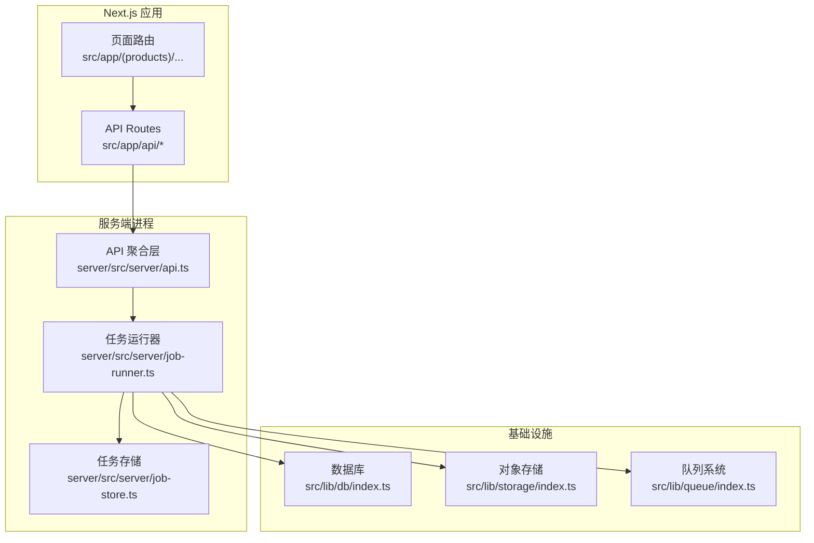
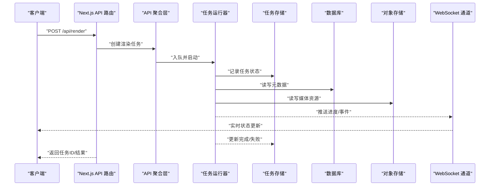
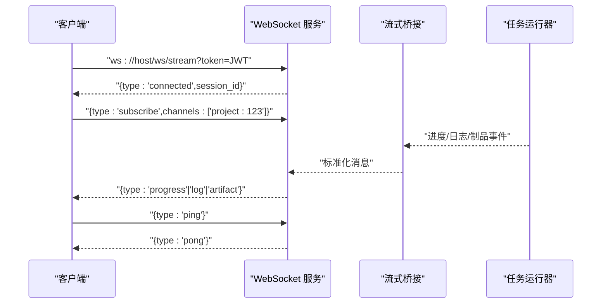
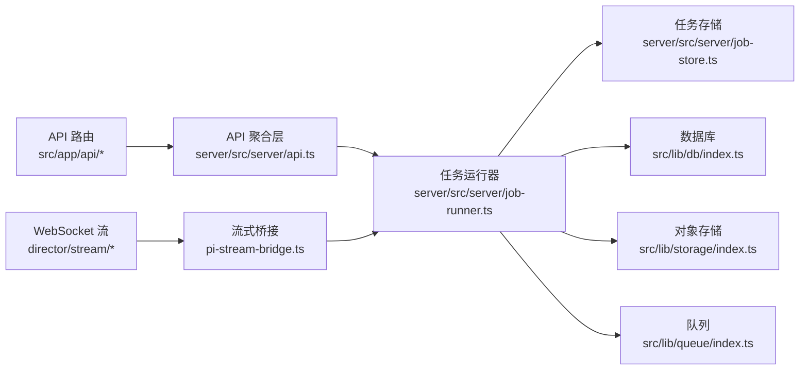

# API 参考

<cite>
**本文引用的文件**   
- [server/src/index.ts](file://server/src/index.ts)
- [server/src/server/api.ts](file://server/src/server/api.ts)
- [server/src/server/job-runner.ts](file://server/src/server/job-runner.ts)
- [server/src/server/job-store.ts](file://server/src/server/job-store.ts)
- [src/app/api/ping/route.ts](file://src/app/api/ping/route.ts)
- [src/app/api/projects/route.ts](file://src/app/api/projects/route.ts)
- [src/app/api/projects/[id]/route.ts](file://src/app/api/projects/%5Bid%5D/route.ts)
- [src/app/api/artifacts/[id]/route.ts](file://src/app/api/artifacts/%5Bid%5D/route.ts)
- [src/app/api/jobs/[id]/route.ts](file://src/app/api/jobs/%5Bid%5D/route.ts)
- [src/app/api/render/route.ts](file://src/app/api/render/route.ts)
- [src/app/api/render/export/route.ts](file://src/app/api/render/export/route.ts)
- [src/app/api/render/thumbnails/route.ts](file://src/app/api/render/thumbnails/route.ts)
- [src/app/api/settings/route.ts](file://src/app/api/settings/route.ts)
- [src/app/api/director/pipeline/route.ts](file://src/app/api/director/pipeline/route.ts)
- [src/app/api/director/stage/route.ts](file://src/app/api/director/stage/route.ts)
- [src/app/api/director/stream/[nodeId]/route.ts](file://src/app/api/director/stream/%5BnodeId%5D/route.ts)
- [src/app/api/director/stream/project/[projectId]/route.ts](file://src/app/api/director/stream/project/%5BprojectId%5D/route.ts)
- [src/features/director/pi-stream-bridge.ts](file://src/features/director/pi-stream-bridge.ts)
- [src/lib/queue/index.ts](file://src/lib/queue/index.ts)
- [src/lib/storage/index.ts](file://src/lib/storage/index.ts)
- [src/lib/db/index.ts](file://src/lib/db/index.ts)
</cite>

## 目录
1. [简介](#简介)
2. [项目结构](#项目结构)
3. [核心组件](#核心组件)
4. [架构总览](#架构总览)
5. [详细组件分析](#详细组件分析)
6. [依赖关系分析](#依赖关系分析)
7. [性能考虑](#性能考虑)
8. [故障排查指南](#故障排查指南)
9. [结论](#结论)
10. [附录](#附录)

## 简介
本文件为 PurpleInk 的完整 API 参考，覆盖 RESTful 端点、WebSocket 实时接口、错误码与状态码、认证与安全、版本管理、速率限制、以及性能优化建议。文档基于 Next.js App Router 的 API Routes 与 server 进程中的任务调度器实现，面向开发者提供从请求到响应、从队列到存储的端到端说明。

## 项目结构
PurpleInk 采用前后端一体化部署：
- Next.js 应用（src/app）暴露 REST API 路由与页面路由
- server 进程负责任务执行、持久化与外部服务交互
- 共享特性模块位于 src/features，通用库位于 src/lib

**图表来源** 
- [server/src/server/api.ts](file://server/src/server/api.ts)
- [server/src/server/job-runner.ts](file://server/src/server/job-runner.ts)
- [server/src/server/job-store.ts](file://server/src/server/job-store.ts)
- [src/lib/db/index.ts](file://src/lib/db/index.ts)
- [src/lib/storage/index.ts](file://src/lib/storage/index.ts)
- [src/lib/queue/index.ts](file://src/lib/queue/index.ts)

**章节来源**
- [server/src/index.ts](file://server/src/index.ts)
- [server/src/server/api.ts](file://server/src/server/api.ts)

## 核心组件
- API 聚合层：统一入口，将 Next.js API 路由请求转发至内部服务或任务调度器
- 任务运行器：负责任务生命周期管理、并发控制、重试与失败处理
- 任务存储：持久化任务状态、结果与元数据
- 基础设施抽象：数据库、对象存储、队列的统一访问封装

**章节来源**
- [server/src/server/api.ts](file://server/src/server/api.ts)
- [server/src/server/job-runner.ts](file://server/src/server/job-runner.ts)
- [server/src/server/job-store.ts](file://server/src/server/job-store.ts)

## 架构总览
REST 请求由 Next.js API Routes 接收，进入 API 聚合层后根据路径分派到具体业务逻辑；涉及长耗时操作的任务通过队列交由 server 进程的任务运行器执行，任务运行器协调数据库、对象存储与外部服务，并通过 WebSocket 推送进度与事件。

**图表来源** 
- [src/app/api/render/route.ts](file://src/app/api/render/route.ts)
- [server/src/server/api.ts](file://server/src/server/api.ts)
- [server/src/server/job-runner.ts](file://server/src/server/job-runner.ts)
- [server/src/server/job-store.ts](file://server/src/server/job-store.ts)
- [src/lib/db/index.ts](file://src/lib/db/index.ts)
- [src/lib/storage/index.ts](file://src/lib/storage/index.ts)
- [src/features/director/pi-stream-bridge.ts](file://src/features/director/pi-stream-bridge.ts)

## 详细组件分析

### REST API 端点总览
以下端点均遵循 JSON 请求/响应格式，默认使用 Bearer Token 认证（如未特别说明）。所有时间戳采用 ISO 8601 字符串，分页参数支持 page/page_size 或 cursor。

- 健康检查
  - GET /api/ping
  - 用途：服务存活探测
  - 认证：无
  - 响应：{ status: "ok", timestamp: string }

- 项目
  - POST /api/projects
    - 用途：创建项目
    - 请求体：{ name: string, description?: string }
    - 响应：{ id: string, name: string, created_at: string }
  - GET /api/projects
    - 用途：列出项目（支持分页）
    - 查询参数：page, page_size
    - 响应：{ items: Project[], total: number }
  - GET /api/projects/:id
    - 用途：获取项目详情
    - 路径参数：id
    - 响应：Project
  - PATCH /api/projects/:id
    - 用途：更新项目信息
    - 请求体：{ name?: string, description?: string }
    - 响应：Project

- 制品
  - GET /api/artifacts/:id
    - 用途：获取制品元数据与下载链接
    - 路径参数：id
    - 响应：{ id, type, url, size, created_at }

- 任务
  - GET /api/jobs/:id
    - 用途：查询任务状态与结果
    - 路径参数：id
    - 响应：{ id, type, status, result?, error?, created_at, updated_at }

- 渲染
  - POST /api/render
    - 用途：提交渲染任务
    - 请求体：{ project_id: string, shot_id?: string, options?: RenderOptions }
    - 响应：{ job_id: string }
  - GET /api/render
    - 用途：查询渲染任务列表（支持过滤与分页）
    - 查询参数：project_id, status, page, page_size
    - 响应：{ items: Job[], total: number }
  - GET /api/render/export
    - 用途：导出渲染产物（打包下载）
    - 查询参数：job_id
    - 响应：二进制流或下载链接
  - GET /api/render/thumbnails
    - 用途：获取缩略图
    - 查询参数：job_id, index?
    - 响应：图片二进制流

- 设置
  - GET /api/settings
    - 用途：读取全局设置
    - 响应：Settings
  - PUT /api/settings
    - 用途：更新全局设置
    - 请求体：SettingsPatch
    - 响应：Settings

- 导演管道（Director）
  - POST /api/director/pipeline
    - 用途：启动/恢复导演管道
    - 请求体：{ project_id: string, pipeline_id?: string }
    - 响应：{ pipeline_id: string }
  - GET /api/director/pipeline
    - 用途：查询管道状态
    - 查询参数：pipeline_id
    - 响应：{ pipeline_id, status, stages[] }
  - POST /api/director/stage
    - 用途：推进指定阶段
    - 请求体：{ pipeline_id, stage_id, input? }
    - 响应：{ stage_id, status }

**章节来源**
- [src/app/api/ping/route.ts](file://src/app/api/ping/route.ts)
- [src/app/api/projects/route.ts](file://src/app/api/projects/route.ts)
- [src/app/api/projects/[id]/route.ts](file://src/app/api/projects/%5Bid%5D/route.ts)
- [src/app/api/artifacts/[id]/route.ts](file://src/app/api/artifacts/%5Bid%5D/route.ts)
- [src/app/api/jobs/[id]/route.ts](file://src/app/api/jobs/%5Bid%5D/route.ts)
- [src/app/api/render/route.ts](file://src/app/api/render/route.ts)
- [src/app/api/render/export/route.ts](file://src/app/api/render/export/route.ts)
- [src/app/api/render/thumbnails/route.ts](file://src/app/api/render/thumbnails/route.ts)
- [src/app/api/settings/route.ts](file://src/app/api/settings/route.ts)
- [src/app/api/director/pipeline/route.ts](file://src/app/api/director/pipeline/route.ts)
- [src/app/api/director/stage/route.ts](file://src/app/api/director/stage/route.ts)

### WebSocket 接口
- 连接地址
  - ws://host/ws/stream?token=JWT
  - 可选查询参数：project_id, pipeline_id, node_id
- 连接建立
  - 服务端校验 token 与权限，绑定会话上下文
  - 首次握手返回 { type: "connected", session_id: string }
- 消息格式
  - 上行：
    - { type: "subscribe", channels: string[] }
    - { type: "ping" }
  - 下行：
    - { type: "progress", payload: { job_id, percent, stage } }
    - { type: "log", payload: { level, message, ts } }
    - { type: "artifact", payload: { id, url, size } }
    - { type: "error", payload: { code, message } }
    - { type: "pong" }
- 断开与重连
  - 服务端心跳超时自动关闭连接
  - 客户端收到 close 后指数退避重连，携带 session_id 恢复订阅

**图表来源** 
- [src/app/api/director/stream/[nodeId]/route.ts](file://src/app/api/director/stream/%5BnodeId%5D/route.ts)
- [src/app/api/director/stream/project/[projectId]/route.ts](file://src/app/api/director/stream/project/%5BprojectId%5D/route.ts)
- [src/features/director/pi-stream-bridge.ts](file://src/features/director/pi-stream-bridge.ts)

**章节来源**
- [src/app/api/director/stream/[nodeId]/route.ts](file://src/app/api/director/stream/%5BnodeId%5D/route.ts)
- [src/app/api/director/stream/project/[projectId]/route.ts](file://src/app/api/director/stream/project/%5BprojectId%5D/route.ts)
- [src/features/director/pi-stream-bridge.ts](file://src/features/director/pi-stream-bridge.ts)

### 错误码与状态码
- HTTP 状态码
  - 200 成功
  - 201 已创建
  - 204 无内容
  - 400 请求参数错误
  - 401 未认证
  - 403 权限不足
  - 404 资源不存在
  - 409 冲突（如重复提交）
  - 422 校验失败
  - 429 速率限制
  - 500 服务器内部错误
  - 503 服务不可用（队列/依赖服务降级）
- 业务错误码（响应体字段 error.code）
  - INVALID_INPUT：输入不合法
  - AUTH_FAILED：认证失败
  - PERMISSION_DENIED：权限不足
  - NOT_FOUND：资源不存在
  - CONFLICT：资源冲突
  - VALIDATION_ERROR：模型校验失败
  - QUEUE_FULL：队列已满
  - STORAGE_ERROR：存储异常
  - RENDER_FAILED：渲染失败
  - PIPELINE_ERROR：导演管道异常
  - TIMEOUT：请求超时
  - INTERNAL_ERROR：内部错误

**章节来源**
- [src/app/api/render/route.ts](file://src/app/api/render/route.ts)
- [src/app/api/jobs/[id]/route.ts](file://src/app/api/jobs/%5Bid%5D/route.ts)

### 认证与安全
- 认证方式
  - Bearer Token（JWT），通过 Authorization: Bearer <token> 传递
  - WebSocket 连接通过 query 参数 token 鉴权
- 授权策略
  - 基于项目/资源的 RBAC，服务端校验用户角色与资源归属
- 安全建议
  - 强制 HTTPS
  - 最小权限原则
  - 敏感配置通过环境变量注入
  - 输入校验与输出编码

**章节来源**
- [src/app/api/director/stream/[nodeId]/route.ts](file://src/app/api/director/stream/%5BnodeId%5D/route.ts)
- [src/app/api/director/stream/project/[projectId]/route.ts](file://src/app/api/director/stream/project/%5BprojectId%5D/route.ts)

### 版本管理与兼容性
- URL 前缀版本
  - 当前默认 v1，未来可通过 /api/v1/... 引入
- 向后兼容
  - 新增字段保持可选，废弃字段保留至少两个大版本
- 弃用策略
  - 通过响应头 Deprecation 与 Sunset 提示迁移
  - 变更日志与公告渠道同步发布

[本节为概念性说明，无需代码引用]

### 速率限制
- 限制维度
  - 按 IP/用户令牌限流，默认 100 次/分钟，可配置
- 响应头
  - X-RateLimit-Limit、X-RateLimit-Remaining、X-RateLimit-Reset
- 超限行为
  - 返回 429，并在 Retry-After 中给出秒数

[本节为概念性说明，无需代码引用]

## 依赖关系分析

**图表来源** 
- [server/src/server/api.ts](file://server/src/server/api.ts)
- [server/src/server/job-runner.ts](file://server/src/server/job-runner.ts)
- [server/src/server/job-store.ts](file://server/src/server/job-store.ts)
- [src/lib/db/index.ts](file://src/lib/db/index.ts)
- [src/lib/storage/index.ts](file://src/lib/storage/index.ts)
- [src/lib/queue/index.ts](file://src/lib/queue/index.ts)
- [src/app/api/director/stream/[nodeId]/route.ts](file://src/app/api/director/stream/%5BnodeId%5D/route.ts)
- [src/app/api/director/stream/project/[projectId]/route.ts](file://src/app/api/director/stream/project/%5BprojectId%5D/route.ts)
- [src/features/director/pi-stream-bridge.ts](file://src/features/director/pi-stream-bridge.ts)

**章节来源**
- [server/src/server/api.ts](file://server/src/server/api.ts)
- [server/src/server/job-runner.ts](file://server/src/server/job-runner.ts)
- [server/src/server/job-store.ts](file://server/src/server/job-store.ts)

## 性能考虑
- 异步与队列
  - 长耗时任务一律入队，避免阻塞请求线程
  - 合理设置并发度与重试策略
- 缓存与压缩
  - 静态资源启用 CDN 与缓存头
  - 大响应启用 gzip/br 压缩
- I/O 优化
  - 数据库连接池与索引优化
  - 对象存储分片上传与断点续传
- 监控与可观测性
  - 关键指标：QPS、延迟分布、错误率、队列积压
  - 结构化日志与链路追踪

[本节为通用指导，无需代码引用]

## 故障排查指南
- 常见问题定位
  - 401/403：检查 token 有效性、权限与资源归属
  - 422：核对请求体结构与必填字段
  - 500/503：查看任务运行器日志与依赖服务状态
  - 429：降低请求频率或申请配额提升
- 诊断步骤
  - 通过 /api/jobs/:id 获取任务状态与错误堆栈摘要
  - 通过 WebSocket 订阅频道查看实时日志与进度
  - 检查对象存储与数据库连通性
- 日志与追踪
  - 开启结构化日志，包含 request_id、user_id、job_id
  - 对关键路径添加埋点与采样

**章节来源**
- [src/app/api/jobs/[id]/route.ts](file://src/app/api/jobs/%5Bid%5D/route.ts)
- [server/src/server/job-runner.ts](file://server/src/server/job-runner.ts)
- [server/src/server/job-store.ts](file://server/src/server/job-store.ts)

## 结论
PurpleInk 的 API 以 Next.js API Routes 为入口，结合 server 进程的任务调度与持久化能力，形成稳定可扩展的后端体系。WebSocket 提供实时交互体验，配合完善的错误码、认证与限流机制，满足生产环境需求。建议在接入时遵循版本与兼容性策略，并结合监控与性能优化实践保障稳定性。

## 附录

### 请求与响应示例（路径引用）
- 健康检查
  - 请求：GET /api/ping
  - 响应：见 [src/app/api/ping/route.ts](file://src/app/api/ping/route.ts)
- 创建项目
  - 请求：POST /api/projects
  - 响应：见 [src/app/api/projects/route.ts](file://src/app/api/projects/route.ts)
- 获取项目
  - 请求：GET /api/projects/:id
  - 响应：见 [src/app/api/projects/[id]/route.ts](file://src/app/api/projects/%5Bid%5D/route.ts)
- 获取制品
  - 请求：GET /api/artifacts/:id
  - 响应：见 [src/app/api/artifacts/[id]/route.ts](file://src/app/api/artifacts/%5Bid%5D/route.ts)
- 查询任务
  - 请求：GET /api/jobs/:id
  - 响应：见 [src/app/api/jobs/[id]/route.ts](file://src/app/api/jobs/%5Bid%5D/route.ts)
- 提交渲染
  - 请求：POST /api/render
  - 响应：见 [src/app/api/render/route.ts](file://src/app/api/render/route.ts)
- 导出渲染产物
  - 请求：GET /api/render/export?job_id=...
  - 响应：见 [src/app/api/render/export/route.ts](file://src/app/api/render/export/route.ts)
- 获取缩略图
  - 请求：GET /api/render/thumbnails?job_id=...
  - 响应：见 [src/app/api/render/thumbnails/route.ts](file://src/app/api/render/thumbnails/route.ts)
- 设置读取/更新
  - 请求：GET/PUT /api/settings
  - 响应：见 [src/app/api/settings/route.ts](file://src/app/api/settings/route.ts)
- 导演管道
  - 请求：POST /api/director/pipeline
  - 响应：见 [src/app/api/director/pipeline/route.ts](file://src/app/api/director/pipeline/route.ts)
  - 请求：POST /api/director/stage
  - 响应：见 [src/app/api/director/stage/route.ts](file://src/app/api/director/stage/route.ts)

### WebSocket 消息类型速查
- connected：连接成功
- subscribe：订阅频道
- progress：进度更新
- log：日志事件
- artifact：制品事件
- error：错误事件
- pong：心跳应答

**章节来源**
- [src/app/api/director/stream/[nodeId]/route.ts](file://src/app/api/director/stream/%5BnodeId%5D/route.ts)
- [src/app/api/director/stream/project/[projectId]/route.ts](file://src/app/api/director/stream/project/%5BprojectId%5D/route.ts)
- [src/features/director/pi-stream-bridge.ts](file://src/features/director/pi-stream-bridge.ts)