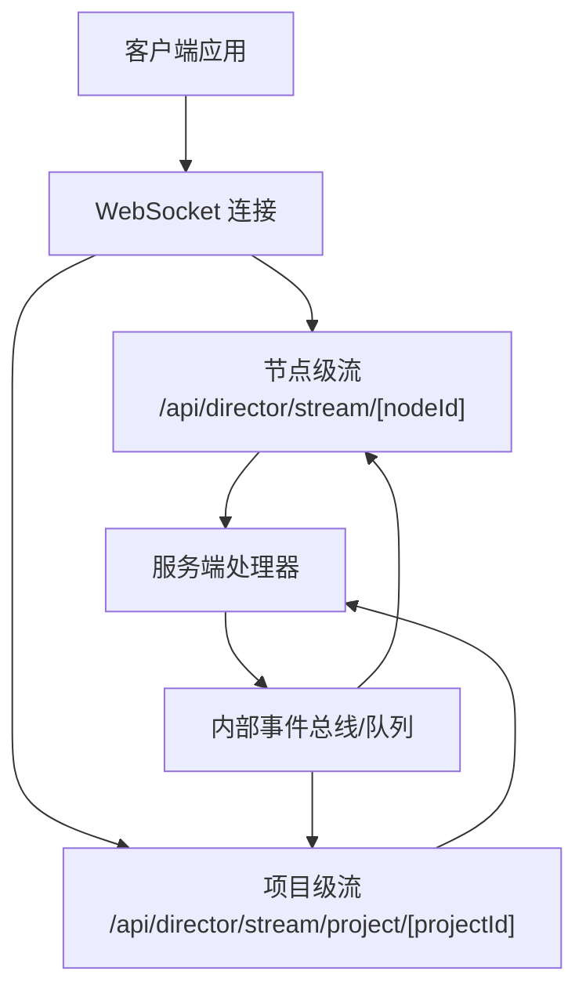
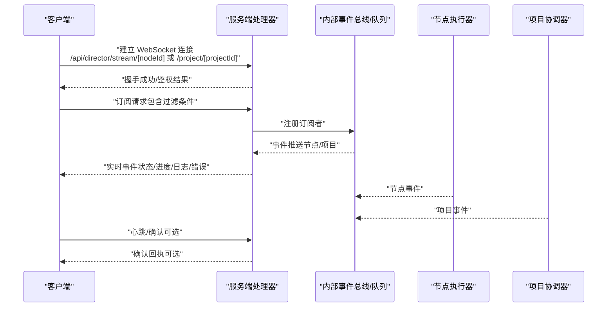
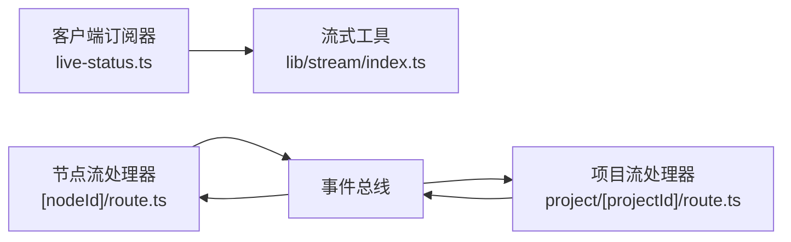

# 实时流 API

<cite>
**本文引用的文件**   
- [src/app/api/director/stream/[nodeId]/route.ts](file://src/app/api/director/stream/[nodeId]/route.ts)
- [src/app/api/director/stream/project/[projectId]/route.ts](file://src/app/api/director/stream/project/[projectId]/route.ts)
- [src/app/products/(app)/canvas/[projectId]/live-status.ts](file://src/app/products/(app)/canvas/[projectId]/live-status.ts)
- [src/app/products/(app)/canvas/[projectId]/streaming-log-card.tsx](file://src/app/products/(app)/canvas/[projectId]/streaming-log-card.tsx)
- [src/lib/stream/index.ts](file://src/lib/stream/index.ts)
</cite>

## 目录
1. [简介](#简介)
2. [项目结构](#项目结构)
3. [核心组件](#核心组件)
4. [架构总览](#架构总览)
5. [详细组件分析](#详细组件分析)
6. [依赖分析](#依赖分析)
7. [性能考虑](#性能考虑)
8. [故障排查指南](#故障排查指南)
9. [结论](#结论)
10. [附录](#附录)

## 简介
本文件为 PurpleInk 导演系统的“实时流 API”提供完整的技术文档，覆盖 WebSocket 连接建立、消息格式与事件类型规范、实时状态更新、进度推送、错误通知的通信协议，以及流式数据处理、断线重连与消息确认机制。同时给出客户端集成示例、错误处理策略、性能优化建议，并说明流式日志收集、实时监控与调试工具的使用方法。

## 项目结构
与实时流相关的代码主要分布在以下位置：
- 服务端流式接口（Next.js App Router）：
  - 按节点维度流：src/app/api/director/stream/[nodeId]/route.ts
  - 按项目维度流：src/app/api/director/stream/project/[projectId]/route.ts
- 客户端侧流式消费与 UI：
  - 实时状态订阅与生命周期管理：src/app/products/(app)/canvas/[projectId]/live-status.ts
  - 流式日志卡片展示：src/app/products/(app)/canvas/[projectId]/streaming-log-card.tsx
- 通用流式工具与类型：
  - 流式数据封装与辅助方法：src/lib/stream/index.ts

图表来源
- [src/app/api/director/stream/[nodeId]/route.ts](file://src/app/api/director/stream/[nodeId]/route.ts)
- [src/app/api/director/stream/project/[projectId]/route.ts](file://src/app/api/director/stream/project/[projectId]/route.ts)

章节来源
- [src/app/api/director/stream/[nodeId]/route.ts](file://src/app/api/director/stream/[nodeId]/route.ts)
- [src/app/api/director/stream/project/[projectId]/route.ts](file://src/app/api/director/stream/project/[projectId]/route.ts)
- [src/app/products/(app)/canvas/[projectId]/live-status.ts](file://src/app/products/(app)/canvas/[projectId]/live-status.ts)
- [src/app/products/(app)/canvas/[projectId]/streaming-log-card.tsx](file://src/app/products/(app)/canvas/[projectId]/streaming-log-card.tsx)
- [src/lib/stream/index.ts](file://src/lib/stream/index.ts)

## 核心组件
- 节点级流接口：用于订阅特定执行节点的实时事件（如阶段推进、中间产物、错误等）。
- 项目级流接口：用于订阅整个项目的聚合事件（如全局进度、汇总状态、跨节点告警）。
- 客户端订阅器：负责连接管理、心跳保活、断线重连、消息分发与去抖合并。
- 流式日志卡片：将服务端推送的日志事件渲染到界面，支持过滤、搜索与滚动加载。

章节来源
- [src/app/api/director/stream/[nodeId]/route.ts](file://src/app/api/director/stream/[nodeId]/route.ts)
- [src/app/api/director/stream/project/[projectId]/route.ts](file://src/app/api/director/stream/project/[projectId]/route.ts)
- [src/app/products/(app)/canvas/[projectId]/live-status.ts](file://src/app/products/(app)/canvas/[projectId]/live-status.ts)
- [src/app/products/(app)/canvas/[projectId]/streaming-log-card.tsx](file://src/app/products/(app)/canvas/[projectId]/streaming-log-card.tsx)
- [src/lib/stream/index.ts](file://src/lib/stream/index.ts)

## 架构总览
下图展示了从客户端发起 WebSocket 连接到服务端处理器，再到内部事件总线与回推给客户端的整体流程。

图表来源
- [src/app/api/director/stream/[nodeId]/route.ts](file://src/app/api/director/stream/[nodeId]/route.ts)
- [src/app/api/director/stream/project/[projectId]/route.ts](file://src/app/api/director/stream/project/[projectId]/route.ts)
- [src/app/products/(app)/canvas/[projectId]/live-status.ts](file://src/app/products/(app)/canvas/[projectId]/live-status.ts)

## 详细组件分析

### 节点级流接口（/api/director/stream/[nodeId]）
- 功能职责
  - 维护单个节点的 WebSocket 会话。
  - 转发该节点产生的事件（阶段推进、中间产物、错误、完成信号）。
  - 支持基于 node_id 的细粒度订阅与过滤。
- 关键行为
  - 连接建立后返回初始状态快照（如有）。
  - 持续推送事件，直到连接关闭或节点结束。
  - 支持可选的消息确认机制（ACK），确保可靠投递。
- 错误处理
  - 网络异常：触发重连逻辑（指数退避）。
  - 业务错误：通过错误事件通道推送，客户端需统一处理。

章节来源
- [src/app/api/director/stream/[nodeId]/route.ts](file://src/app/api/director/stream/[nodeId]/route.ts)

### 项目级流接口（/api/director/stream/project/[projectId]）
- 功能职责
  - 维护项目维度的 WebSocket 会话。
  - 聚合多个节点的事件，输出全局进度、汇总状态、跨节点告警。
- 关键行为
  - 连接建立后返回项目当前状态摘要。
  - 根据订阅范围推送相关事件（可配置过滤）。
  - 支持批量事件压缩与节流，降低带宽占用。
- 错误处理
  - 对上游节点异常进行聚合上报。
  - 对连接中断进行自动恢复与状态同步。

章节来源
- [src/app/api/director/stream/project/[projectId]/route.ts](file://src/app/api/director/stream/project/[projectId]/route.ts)

### 客户端订阅器（live-status.ts）
- 功能职责
  - 管理 WebSocket 生命周期（连接、断开、重连）。
  - 解析事件类型并路由到对应处理器（状态、进度、日志、错误）。
  - 实现心跳保活与超时检测。
  - 提供统一的回调接口供 UI 层使用。
- 关键行为
  - 断线重连：指数退避 + 最大重试次数。
  - 消息确认：可选 ACK 模式，保障可靠性。
  - 去抖合并：对高频事件进行合并，避免 UI 抖动。
- 错误处理
  - 区分网络错误与业务错误，分别提示与恢复。
  - 记录诊断信息便于问题定位。

章节来源
- [src/app/products/(app)/canvas/[projectId]/live-status.ts](file://src/app/products/(app)/canvas/[projectId]/live-status.ts)

### 流式日志卡片（streaming-log-card.tsx）
- 功能职责
  - 接收并渲染来自流的事件日志。
  - 支持按级别过滤、关键词搜索、时间排序。
  - 提供滚动加载与虚拟列表优化。
- 关键行为
  - 增量追加新日志，保持滚动到底部（可选）。
  - 高亮错误与警告条目。
  - 支持导出与复制日志片段。
- 性能优化
  - 虚拟滚动减少 DOM 压力。
  - 防抖搜索与分页加载历史日志。

章节来源
- [src/app/products/(app)/canvas/[projectId]/streaming-log-card.tsx](file://src/app/products/(app)/canvas/[projectId]/streaming-log-card.tsx)

### 通用流式工具（lib/stream/index.ts）
- 功能职责
  - 定义流式数据结构与类型。
  - 提供事件序列化/反序列化、校验与转换工具。
  - 封装通用的重连、心跳、ACK 逻辑。
- 关键行为
  - 统一事件格式，确保前后端一致性。
  - 提供可插拔的错误处理策略。
  - 支持扩展新的事件类型。

章节来源
- [src/lib/stream/index.ts](file://src/lib/stream/index.ts)

## 依赖分析
- 耦合关系
  - 客户端订阅器依赖通用流工具，解耦具体协议细节。
  - 服务端处理器依赖内部事件总线，实现松耦合的事件驱动。
- 外部依赖
  - WebSocket 传输层由 Next.js 运行时提供。
  - 事件总线可能基于内存队列或持久化队列（视部署环境而定）。
- 潜在风险
  - 循环依赖：确保处理器与总线之间单向依赖。
  - 背压：在高吞吐场景下需引入缓冲与限流。

图表来源
- [src/app/products/(app)/canvas/[projectId]/live-status.ts](file://src/app/products/(app)/canvas/[projectId]/live-status.ts)
- [src/lib/stream/index.ts](file://src/lib/stream/index.ts)
- [src/app/api/director/stream/[nodeId]/route.ts](file://src/app/api/director/stream/[nodeId]/route.ts)
- [src/app/api/director/stream/project/[projectId]/route.ts](file://src/app/api/director/stream/project/[projectId]/route.ts)

章节来源
- [src/app/products/(app)/canvas/[projectId]/live-status.ts](file://src/app/products/(app)/canvas/[projectId]/live-status.ts)
- [src/lib/stream/index.ts](file://src/lib/stream/index.ts)
- [src/app/api/director/stream/[nodeId]/route.ts](file://src/app/api/director/stream/[nodeId]/route.ts)
- [src/app/api/director/stream/project/[projectId]/route.ts](file://src/app/api/director/stream/project/[projectId]/route.ts)

## 性能考虑
- 连接管理
  - 复用连接池，避免频繁握手开销。
  - 合理设置心跳间隔与超时阈值。
- 数据传输
  - 使用二进制或压缩格式（如 MessagePack、Gzip）减少体积。
  - 对高频事件进行批处理与节流。
- 前端渲染
  - 虚拟列表与增量更新，避免全量重绘。
  - 异步渲染与分片处理，保证主线程流畅。
- 后端处理
  - 事件去重与合并，降低重复推送。
  - 背压控制与队列限流，防止雪崩。

## 故障排查指南
- 常见问题
  - 连接失败：检查鉴权参数、网络代理与防火墙规则。
  - 事件丢失：启用 ACK 模式并核对序列号。
  - 延迟过高：检查事件总线负载与网络带宽。
- 诊断步骤
  - 查看客户端日志与网络面板，捕获握手与心跳报文。
  - 在服务端启用详细日志，追踪事件生产与消费链路。
  - 使用抓包工具验证消息格式与顺序。
- 恢复策略
  - 自动重连与状态同步。
  - 降级为轮询模式，保障基本可用性。

章节来源
- [src/app/products/(app)/canvas/[projectId]/live-status.ts](file://src/app/products/(app)/canvas/[projectId]/live-status.ts)
- [src/lib/stream/index.ts](file://src/lib/stream/index.ts)

## 结论
PurpleInk 导演系统的实时流 API 通过节点级与项目级双通道，结合客户端订阅器与通用流工具，实现了高可靠、低延迟的实时通信。建议在大规模部署中重点关注背压控制、事件压缩与前端渲染优化，以确保系统稳定性与用户体验。

## 附录

### 消息格式与事件类型规范
- 基础字段
  - type：事件类型（如 status、progress、log、error）
  - id：唯一标识（节点 ID 或项目 ID）
  - ts：时间戳（毫秒）
  - seq：序列号（用于 ACK 与去重）
  - payload：事件载荷（依类型而异）
- 事件类型
  - status：状态更新（如 running、completed、failed）
  - progress：进度推送（百分比、阶段名）
  - log：日志条目（级别、内容、来源）
  - error：错误通知（代码、消息、堆栈）
- 控制消息
  - subscribe：订阅请求（过滤条件）
  - ack：消息确认（seq）
  - heartbeat：心跳（可选）

### 客户端集成示例
- 连接建立
  - 创建 WebSocket 实例，传入节点或项目路径。
  - 监听连接成功与错误事件。
- 订阅与处理
  - 发送 subscribe 消息，指定过滤条件。
  - 根据 type 分发到对应处理器。
- 断线重连
  - 监听断开事件，触发指数退避重连。
  - 重连后重新订阅并同步状态。
- 消息确认
  - 收到事件后发送 ack，携带 seq。
  - 未收到回执时重试或上报错误。

### 错误处理策略
- 分类处理
  - 网络错误：重连与降级。
  - 业务错误：提示用户并记录日志。
  - 数据错误：丢弃并告警。
- 兜底方案
  - 切换至轮询模式获取最终状态。
  - 缓存最近事件，避免 UI 空白。

### 流式日志收集与监控
- 收集方式
  - 通过 log 事件实时推送。
  - 支持按级别与来源过滤。
- 监控指标
  - 事件吞吐量、延迟分布、错误率。
  - 连接数、重连次数、ACK 成功率。
- 调试工具
  - 本地日志回放与对比。
  - 事件轨迹追踪（trace id）。

章节来源
- [src/app/api/director/stream/[nodeId]/route.ts](file://src/app/api/director/stream/[nodeId]/route.ts)
- [src/app/api/director/stream/project/[projectId]/route.ts](file://src/app/api/director/stream/project/[projectId]/route.ts)
- [src/app/products/(app)/canvas/[projectId]/live-status.ts](file://src/app/products/(app)/canvas/[projectId]/live-status.ts)
- [src/app/products/(app)/canvas/[projectId]/streaming-log-card.tsx](file://src/app/products/(app)/canvas/[projectId]/streaming-log-card.tsx)
- [src/lib/stream/index.ts](file://src/lib/stream/index.ts)