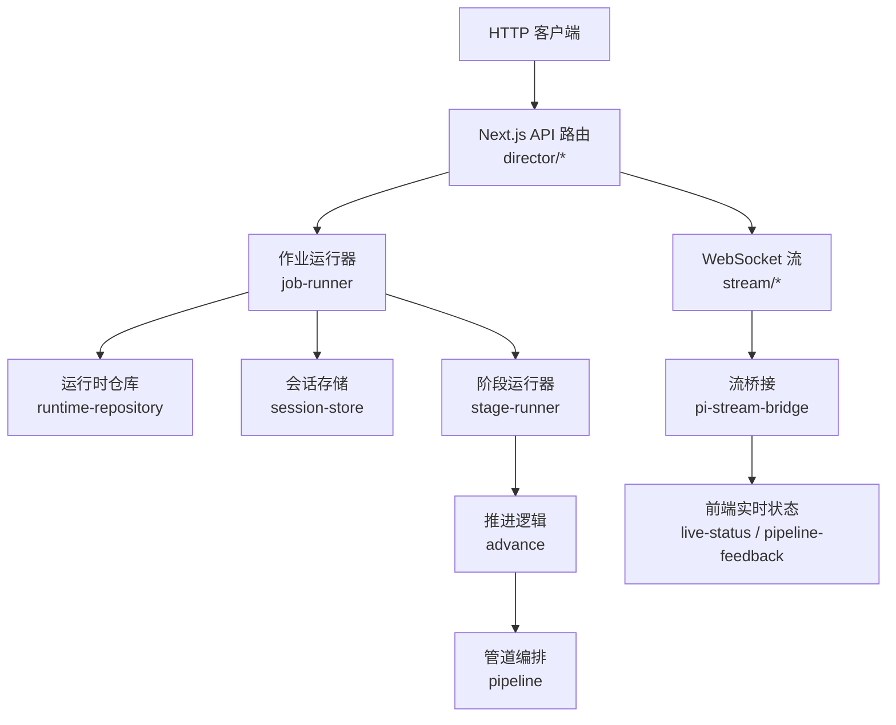
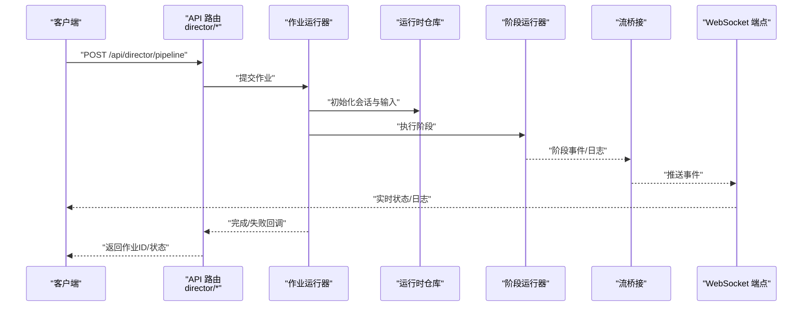
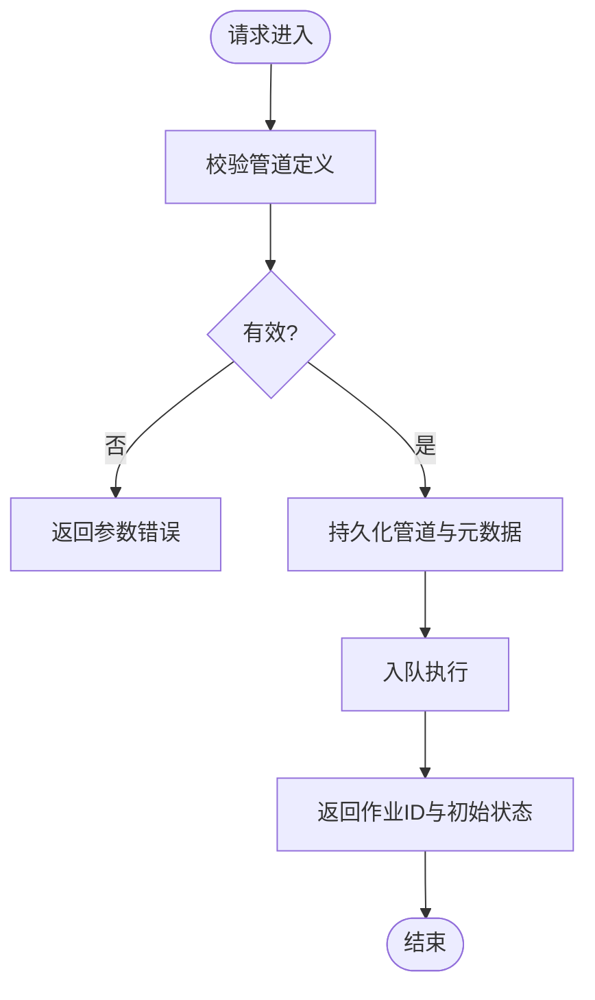
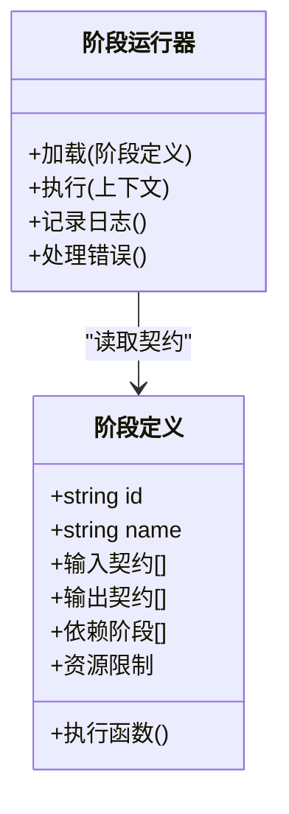
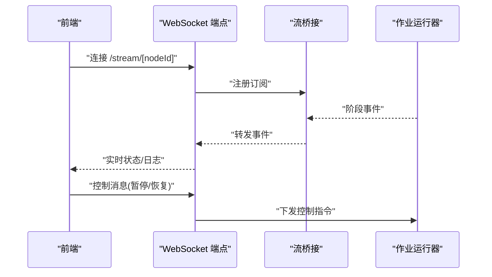
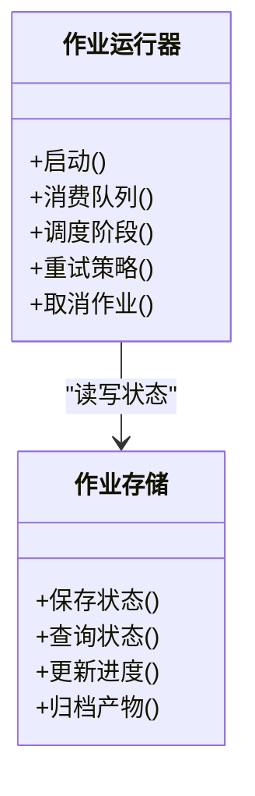
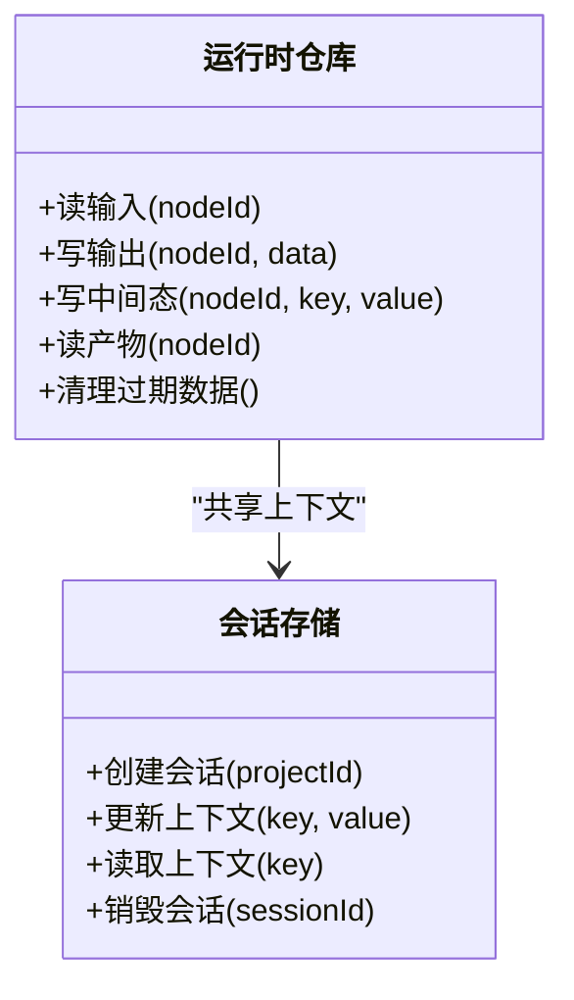
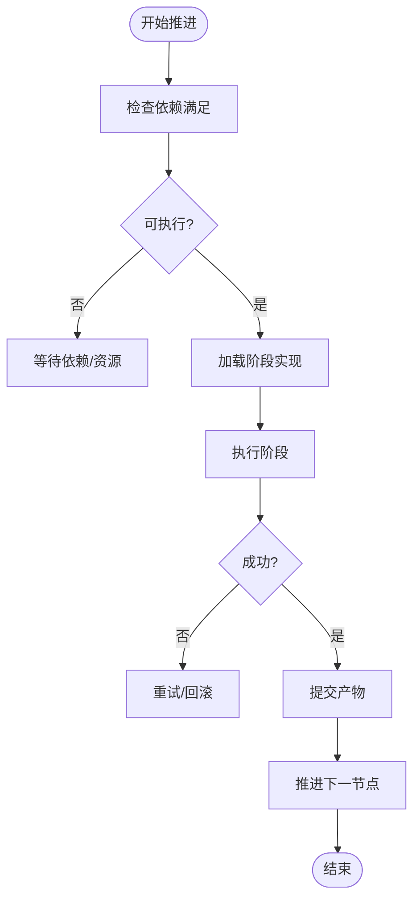
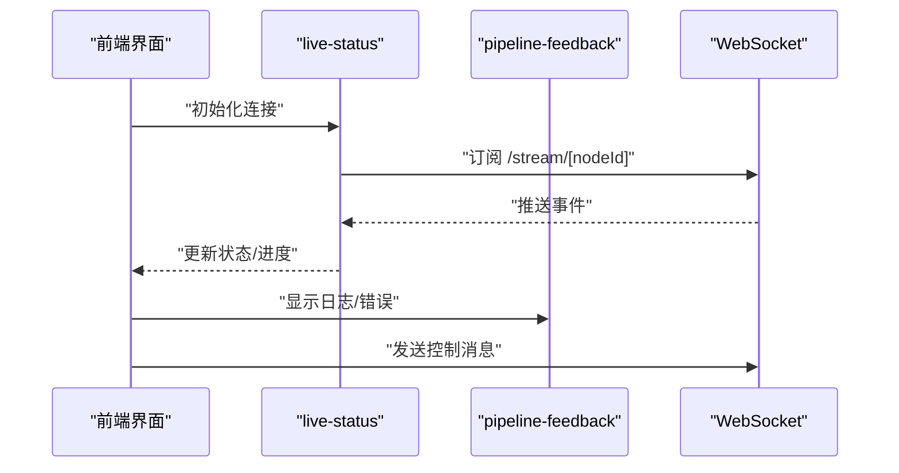
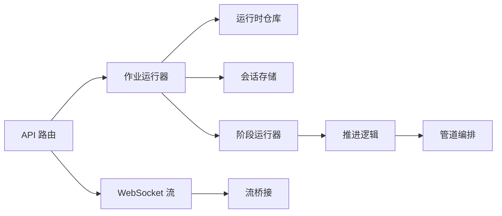

# 导演系统 API

<cite>
**本文引用的文件**   
- [server/src/index.ts](file://server/src/index.ts)
- [server/src/server/api.ts](file://server/src/server/api.ts)
- [server/src/server/job-runner.ts](file://server/src/server/job-runner.ts)
- [server/src/server/job-store.ts](file://server/src/server/job-store.ts)
- [src/app/api/director/pipeline/route.ts](file://src/app/api/director/pipeline/route.ts)
- [src/app/api/director/stage/route.ts](file://src/app/api/director/stage/route.ts)
- [src/app/api/director/stream/[nodeId]/route.ts](file://src/app/api/director/stream/[nodeId]/route.ts)
- [src/app/api/director/stream/project/[projectId]/route.ts](file://src/app/api/director/stream/project/[projectId]/route.ts)
- [src/features/director/pipeline.ts](file://src/features/director/pipeline.ts)
- [src/features/director/advance.ts](file://src/features/director/advance.ts)
- [src/features/director/stage-runner.ts](file://src/features/director/stage-runner.ts)
- [src/features/director/runtime-repository.ts](file://src/features/director/runtime-repository.ts)
- [src/features/director/session-store.ts](file://src/features/director/session-store.ts)
- [src/features/director/pi-stream-bridge.ts](file://src/features/director/pi-stream-bridge.ts)
- [src/features/director/types.ts](file://src/features/director/types.ts)
- [src/lib/stream/index.ts](file://src/lib/stream/index.ts)
- [src/app/products/(app)/canvas/[projectId]/live-status.ts](file://src/app/products/(app)/canvas/[projectId]/live-status.ts)
- [src/app/products/(app)/canvas/[projectId]/pipeline-feedback.ts](file://src/app/products/(app)/canvas/[projectId]/pipeline-feedback.ts)
</cite>

## 目录
1. [简介](#简介)
2. [项目结构](#项目结构)
3. [核心组件](#核心组件)
4. [架构总览](#架构总览)
5. [详细组件分析](#详细组件分析)
6. [依赖分析](#依赖分析)
7. [性能考虑](#性能考虑)
8. [故障排查指南](#故障排查指南)
9. [结论](#结论)
10. [附录](#附录)

## 简介
本文件为 PurpleInk 导演系统的 API 文档，聚焦工作流编排、阶段管理与实时流处理。内容涵盖：
- 管道配置与阶段定义、执行控制的 REST API
- 实时状态同步、事件订阅与消息推送的 WebSocket 接口
- 工具链集成、插件扩展与自定义阶段的开发指南
- 错误恢复、状态持久化与性能监控的 API 支持

目标读者包括前端开发者、后端工程师与系统集成人员，帮助快速理解并接入导演系统的能力。

## 项目结构
导演系统由服务端入口、API 路由、作业调度器、运行时仓库与前端实时状态模块组成。关键路径如下：
- 服务端入口与全局 API 挂载点
- 导演系统 REST 路由（管道、阶段、流）
- 作业运行器与存储抽象
- 导演运行时（阶段执行、推进、会话、产物读写）
- 前端实时状态与管线反馈

图表来源
- [server/src/index.ts](file://server/src/index.ts)
- [src/app/api/director/pipeline/route.ts](file://src/app/api/director/pipeline/route.ts)
- [src/app/api/director/stage/route.ts](file://src/app/api/director/stage/route.ts)
- [src/app/api/director/stream/[nodeId]/route.ts](file://src/app/api/director/stream/[nodeId]/route.ts)
- [src/app/api/director/stream/project/[projectId]/route.ts](file://src/app/api/director/stream/project/[projectId]/route.ts)
- [server/src/server/job-runner.ts](file://server/src/server/job-runner.ts)
- [server/src/server/job-store.ts](file://server/src/server/job-store.ts)
- [src/features/director/runtime-repository.ts](file://src/features/director/runtime-repository.ts)
- [src/features/director/session-store.ts](file://src/features/director/session-store.ts)
- [src/features/director/stage-runner.ts](file://src/features/director/stage-runner.ts)
- [src/features/director/advance.ts](file://src/features/director/advance.ts)
- [src/features/director/pipeline.ts](file://src/features/director/pipeline.ts)
- [src/features/director/pi-stream-bridge.ts](file://src/features/director/pi-stream-bridge.ts)
- [src/app/products/(app)/canvas/[projectId]/live-status.ts](file://src/app/products/(app)/canvas/[projectId]/live-status.ts)
- [src/app/products/(app)/canvas/[projectId]/pipeline-feedback.ts](file://src/app/products/(app)/canvas/[projectId]/pipeline-feedback.ts)

章节来源
- [server/src/index.ts](file://server/src/index.ts)
- [server/src/server/api.ts](file://server/src/server/api.ts)

## 核心组件
- 作业运行器：负责队列消费、任务生命周期管理、并发控制与重试策略。
- 运行时仓库：提供阶段输入/输出、中间态与最终产物的存取能力。
- 阶段运行器：按阶段契约加载与执行阶段逻辑，支持钩子与副作用。
- 推进逻辑：驱动阶段间数据流转、条件分支与收敛。
- 管道编排：解析管道定义、构建执行图、校验拓扑与资源约束。
- 会话存储：维护运行期会话上下文、凭据与临时状态。
- 流桥接：将内部事件转换为可订阅的流式消息，供前端实时展示。
- 前端实时状态：连接 WebSocket，渲染进度、日志与错误提示。

章节来源
- [server/src/server/job-runner.ts](file://server/src/server/job-runner.ts)
- [server/src/server/job-store.ts](file://server/src/server/job-store.ts)
- [src/features/director/runtime-repository.ts](file://src/features/director/runtime-repository.ts)
- [src/features/director/stage-runner.ts](file://src/features/director/stage-runner.ts)
- [src/features/director/advance.ts](file://src/features/director/advance.ts)
- [src/features/director/pipeline.ts](file://src/features/director/pipeline.ts)
- [src/features/director/session-store.ts](file://src/features/director/session-store.ts)
- [src/features/director/pi-stream-bridge.ts](file://src/features/director/pi-stream-bridge.ts)

## 架构总览
导演系统采用“REST + WebSocket”的双通道模式：
- REST 用于创建/更新/查询管道与阶段、触发执行、获取结果
- WebSocket 用于实时推送阶段状态、日志、指标与错误事件

图表来源
- [src/app/api/director/pipeline/route.ts](file://src/app/api/director/pipeline/route.ts)
- [src/app/api/director/stage/route.ts](file://src/app/api/director/stage/route.ts)
- [src/app/api/director/stream/[nodeId]/route.ts](file://src/app/api/director/stream/[nodeId]/route.ts)
- [src/app/api/director/stream/project/[projectId]/route.ts](file://src/app/api/director/stream/project/[projectId]/route.ts)
- [server/src/server/job-runner.ts](file://server/src/server/job-runner.ts)
- [src/features/director/runtime-repository.ts](file://src/features/director/runtime-repository.ts)
- [src/features/director/stage-runner.ts](file://src/features/director/stage-runner.ts)
- [src/features/director/pi-stream-bridge.ts](file://src/features/director/pi-stream-bridge.ts)

## 详细组件分析

### 管道编排 API（/api/director/pipeline）
职责
- 创建/更新/删除管道定义
- 提交执行请求，返回作业 ID
- 查询执行状态与结果

典型调用流程
- 创建管道：POST 提交管道定义，校验拓扑与依赖，落库并返回作业 ID
- 启动执行：POST 触发执行，进入作业队列
- 查询状态：GET 获取当前状态、阶段进度与产物位置

图表来源
- [src/app/api/director/pipeline/route.ts](file://src/app/api/director/pipeline/route.ts)
- [src/features/director/pipeline.ts](file://src/features/director/pipeline.ts)

章节来源
- [src/app/api/director/pipeline/route.ts](file://src/app/api/director/pipeline/route.ts)
- [src/features/director/pipeline.ts](file://src/features/director/pipeline.ts)

### 阶段管理 API（/api/director/stage）
职责
- 注册/更新阶段定义（输入/输出契约、依赖、资源限制）
- 触发单阶段执行或批量执行
- 查询阶段执行历史与产物

关键点
- 阶段契约需声明输入/输出类型、校验规则与副作用
- 支持幂等执行与重试策略
- 产物通过运行时仓库统一访问

图表来源
- [src/app/api/director/stage/route.ts](file://src/app/api/director/stage/route.ts)
- [src/features/director/stage-runner.ts](file://src/features/director/stage-runner.ts)
- [src/features/director/types.ts](file://src/features/director/types.ts)

章节来源
- [src/app/api/director/stage/route.ts](file://src/app/api/director/stage/route.ts)
- [src/features/director/stage-runner.ts](file://src/features/director/stage-runner.ts)
- [src/features/director/types.ts](file://src/features/director/types.ts)

### 实时流处理 API（/api/director/stream/*）
职责
- 节点级流：/api/director/stream/[nodeId] 订阅特定节点的实时事件
- 项目级流：/api/director/stream/project/[projectId] 订阅项目范围内的事件聚合

协议要点
- 使用 WebSocket 建立长连接
- 服务端推送事件：阶段开始/完成、日志、指标、错误
- 客户端可发送控制消息：暂停、恢复、取消

图表来源
- [src/app/api/director/stream/[nodeId]/route.ts](file://src/app/api/director/stream/[nodeId]/route.ts)
- [src/app/api/director/stream/project/[projectId]/route.ts](file://src/app/api/director/stream/project/[projectId]/route.ts)
- [src/features/director/pi-stream-bridge.ts](file://src/features/director/pi-stream-bridge.ts)

章节来源
- [src/app/api/director/stream/[nodeId]/route.ts](file://src/app/api/director/stream/[nodeId]/route.ts)
- [src/app/api/director/stream/project/[projectId]/route.ts](file://src/app/api/director/stream/project/[projectId]/route.ts)
- [src/features/director/pi-stream-bridge.ts](file://src/features/director/pi-stream-bridge.ts)

### 作业运行器与存储（Job Runner & Store）
职责
- 作业运行器：队列消费、并发控制、重试、超时、取消
- 作业存储：持久化作业状态、阶段进度、产物索引

图表来源
- [server/src/server/job-runner.ts](file://server/src/server/job-runner.ts)
- [server/src/server/job-store.ts](file://server/src/server/job-store.ts)

章节来源
- [server/src/server/job-runner.ts](file://server/src/server/job-runner.ts)
- [server/src/server/job-store.ts](file://server/src/server/job-store.ts)

### 运行时仓库与会话存储
职责
- 运行时仓库：阶段输入/输出、中间态、产物读写与版本管理
- 会话存储：运行期上下文、凭据、临时状态与跨阶段共享数据

图表来源
- [src/features/director/runtime-repository.ts](file://src/features/director/runtime-repository.ts)
- [src/features/director/session-store.ts](file://src/features/director/session-store.ts)

章节来源
- [src/features/director/runtime-repository.ts](file://src/features/director/runtime-repository.ts)
- [src/features/director/session-store.ts](file://src/features/director/session-store.ts)

### 推进逻辑与阶段执行
职责
- 推进逻辑：根据阶段依赖与条件决定下一步执行顺序
- 阶段执行：加载阶段实现、注入上下文、执行并收集结果

图表来源
- [src/features/director/advance.ts](file://src/features/director/advance.ts)
- [src/features/director/stage-runner.ts](file://src/features/director/stage-runner.ts)

章节来源
- [src/features/director/advance.ts](file://src/features/director/advance.ts)
- [src/features/director/stage-runner.ts](file://src/features/director/stage-runner.ts)

### 前端实时状态与管线反馈
职责
- 连接 WebSocket，订阅节点/项目级事件
- 渲染进度条、日志卡片、错误弹窗与状态徽章
- 提供用户交互（暂停/恢复/取消）

图表来源
- [src/app/products/(app)/canvas/[projectId]/live-status.ts](file://src/app/products/(app)/canvas/[projectId]/live-status.ts)
- [src/app/products/(app)/canvas/[projectId]/pipeline-feedback.ts](file://src/app/products/(app)/canvas/[projectId]/pipeline-feedback.ts)

章节来源
- [src/app/products/(app)/canvas/[projectId]/live-status.ts](file://src/app/products/(app)/canvas/[projectId]/live-status.ts)
- [src/app/products/(app)/canvas/[projectId]/pipeline-feedback.ts](file://src/app/products/(app)/canvas/[projectId]/pipeline-feedback.ts)

## 依赖分析
- 低耦合：API 路由仅负责请求解析与响应封装，业务逻辑下沉至特性层
- 高内聚：阶段运行器、推进逻辑与运行时仓库围绕“执行”主题组织
- 外部依赖：数据库（持久化）、消息队列（作业调度）、对象存储（产物）

图表来源
- [src/app/api/director/pipeline/route.ts](file://src/app/api/director/pipeline/route.ts)
- [src/app/api/director/stage/route.ts](file://src/app/api/director/stage/route.ts)
- [src/app/api/director/stream/[nodeId]/route.ts](file://src/app/api/director/stream/[nodeId]/route.ts)
- [server/src/server/job-runner.ts](file://server/src/server/job-runner.ts)
- [src/features/director/runtime-repository.ts](file://src/features/director/runtime-repository.ts)
- [src/features/director/session-store.ts](file://src/features/director/session-store.ts)
- [src/features/director/stage-runner.ts](file://src/features/director/stage-runner.ts)
- [src/features/director/advance.ts](file://src/features/director/advance.ts)
- [src/features/director/pipeline.ts](file://src/features/director/pipeline.ts)
- [src/features/director/pi-stream-bridge.ts](file://src/features/director/pi-stream-bridge.ts)

章节来源
- [server/src/server/api.ts](file://server/src/server/api.ts)

## 性能考虑
- 并发控制：作业运行器应限制并发度，避免资源争用与内存峰值
- 批处理：阶段产物写入建议批量提交，减少 IO 次数
- 缓存：热点输入/中间态可使用内存缓存，注意失效策略
- 背压：WebSocket 推送需做速率限制与丢弃策略，防止前端阻塞
- 监控：暴露关键指标（队列长度、阶段耗时、错误率）便于观测

[本节为通用指导，不直接分析具体文件]

## 故障排查指南
常见问题与定位步骤
- 阶段执行失败：查看阶段日志与错误码，确认输入契约与依赖是否满足
- 作业卡住：检查队列堆积、资源占用与锁竞争
- 实时流中断：确认 WebSocket 心跳与重连机制，检查桥接层事件分发
- 产物缺失：核对运行时仓库写入路径与权限，验证归档流程

建议操作
- 启用详细日志与追踪 ID，关联请求与事件
- 使用健康检查端点与指标采集，设置告警阈值
- 对关键路径增加幂等与补偿逻辑

章节来源
- [server/src/server/job-runner.ts](file://server/src/server/job-runner.ts)
- [src/features/director/pi-stream-bridge.ts](file://src/features/director/pi-stream-bridge.ts)

## 结论
PurpleInk 导演系统通过清晰的 REST 与 WebSocket 接口，结合模块化特性层，提供了强大的工作流编排与实时处理能力。遵循本指南进行集成与扩展，可实现稳定、可观测且高性能的导演流水线。

[本节为总结性内容，不直接分析具体文件]

## 附录
- 自定义阶段开发要点
  - 明确输入/输出契约与校验规则
  - 实现幂等执行与错误恢复
  - 通过运行时仓库读写产物与中间态
  - 向流桥接上报事件与日志
- 工具链集成建议
  - 使用标准环境变量与凭据信封
  - 通过 HTTP 或消息队列与外部服务通信
  - 遵循命名规范与版本兼容策略

[本节为补充说明，不直接分析具体文件]