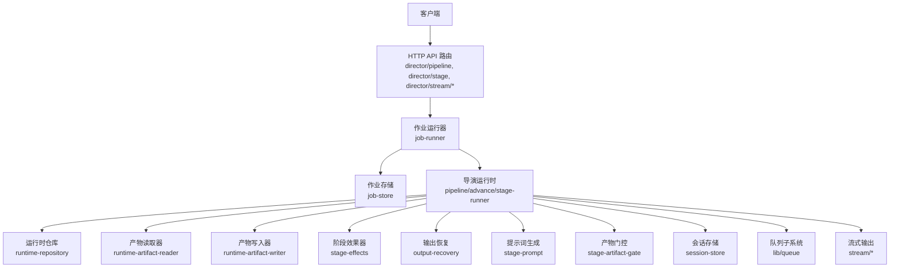
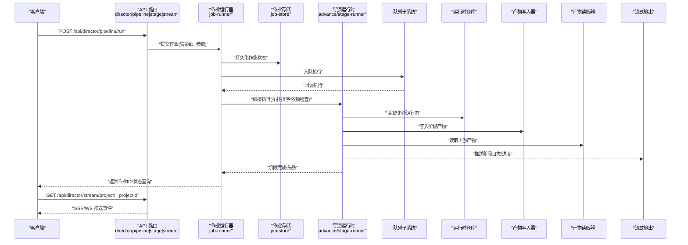
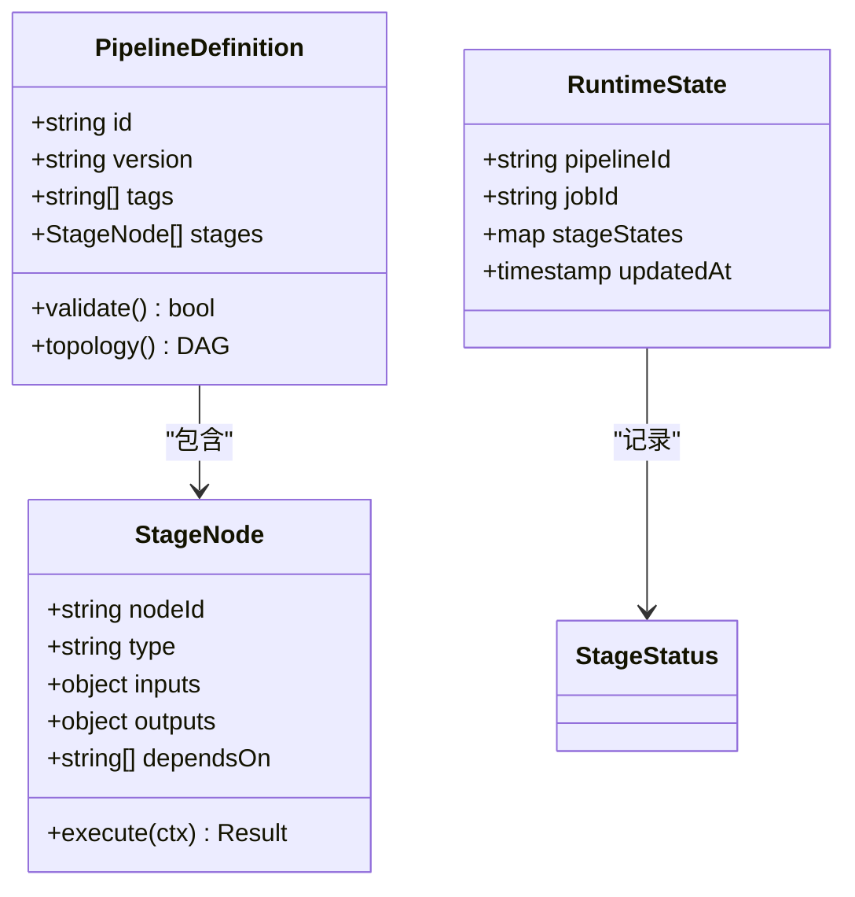
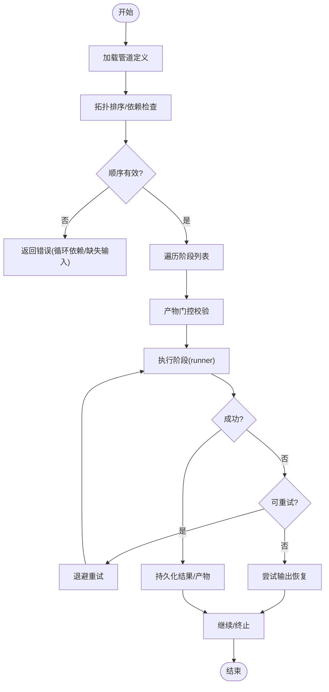
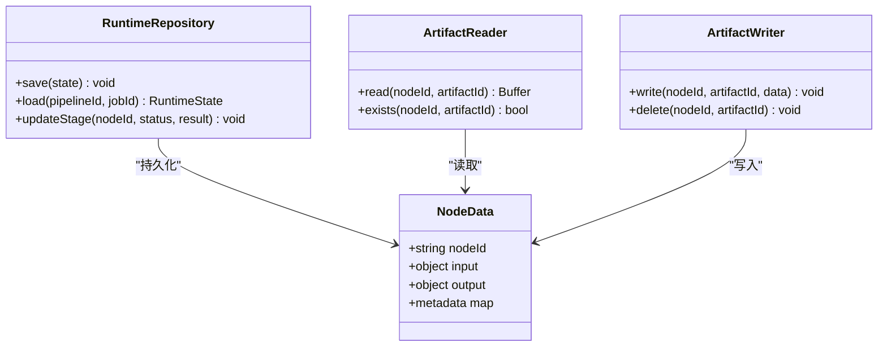
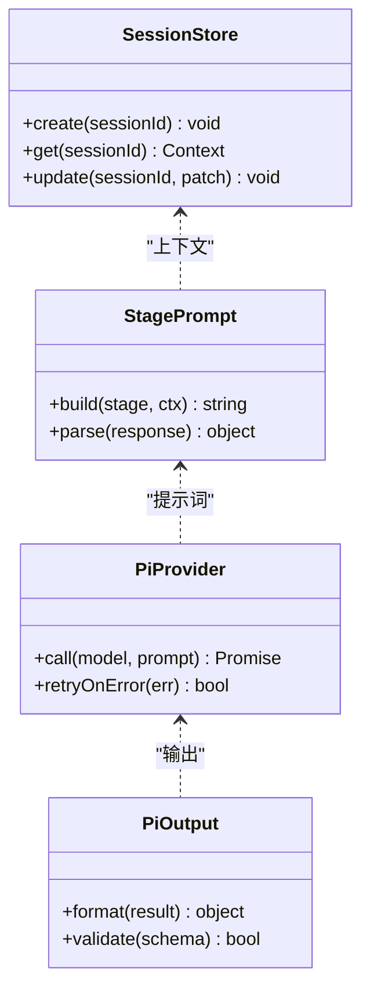
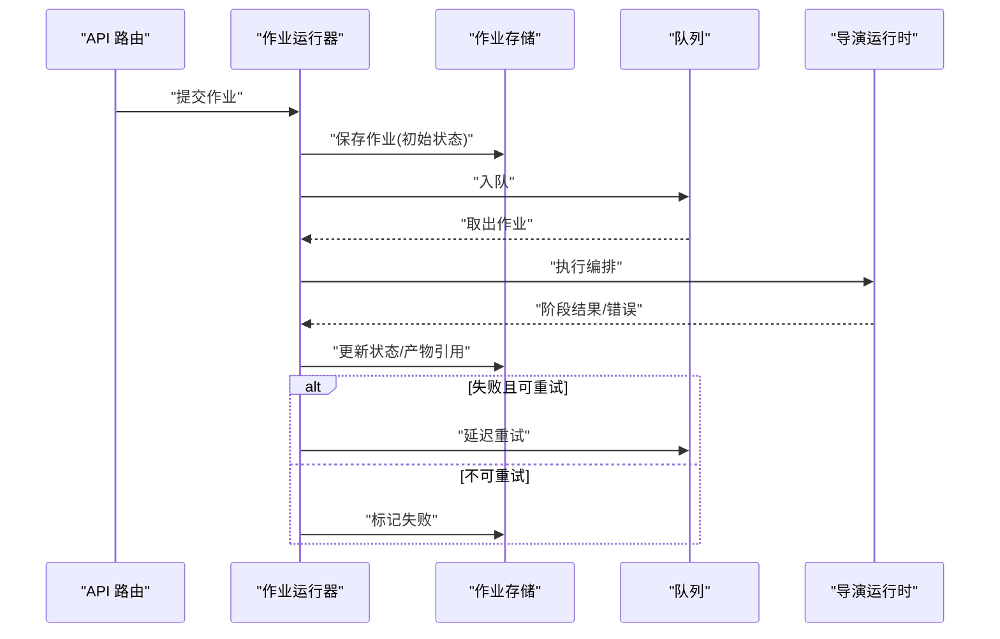
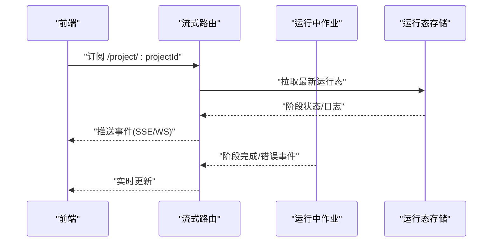
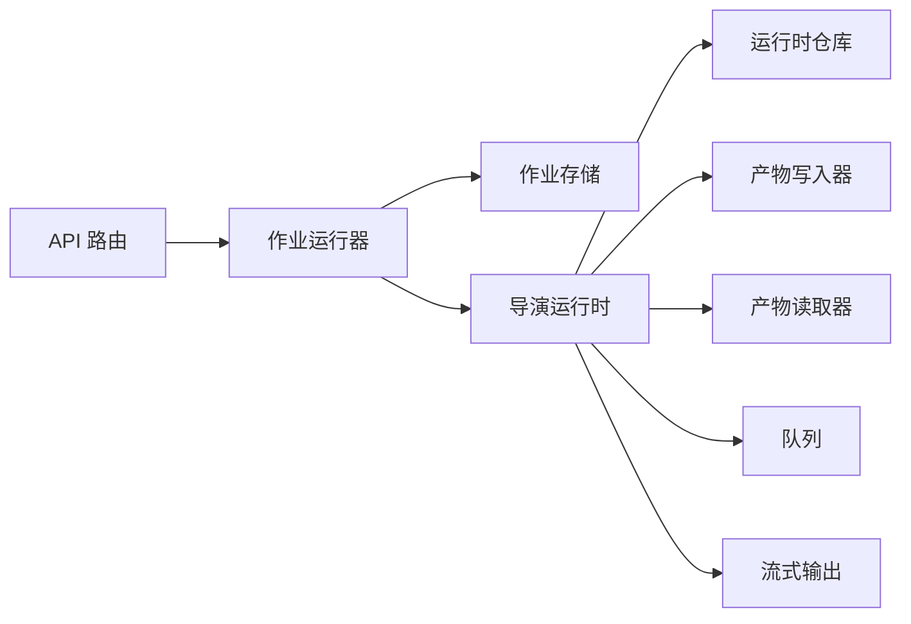

# 管道管理 API

<cite>
**本文引用的文件**   
- [server/src/server/api.ts](file://server/src/server/api.ts)
- [server/src/server/job-runner.ts](file://server/src/server/job-runner.ts)
- [server/src/server/job-store.ts](file://server/src/server/job-store.ts)
- [src/app/api/director/pipeline/route.ts](file://src/app/api/director/pipeline/route.ts)
- [src/app/api/director/stage/route.ts](file://src/app/api/director/stage/route.ts)
- [src/app/api/director/stream/[nodeId]/route.ts](file://src/app/api/director/stream/[nodeId]/route.ts)
- [src/app/api/director/stream/project/[projectId]/route.ts](file://src/app/api/director/stream/project/[projectId]/route.ts)
- [src/features/director/pipeline.ts](file://src/features/director/pipeline.ts)
- [src/features/director/types.ts](file://src/features/director/types.ts)
- [src/features/director/advance.ts](file://src/features/director/advance.ts)
- [src/features/director/runtime-repository.ts](file://src/features/director/runtime-repository.ts)
- [src/features/director/stage-runner.ts](file://src/features/director/stage-runner.ts)
- [src/features/director/stage-result.ts](file://src/features/director/stage-result.ts)
- [src/features/director/stage-effects.ts](file://src/features/director/stage-effects.ts)
- [src/features/director/output-recovery.ts](file://src/features/director/output-recovery.ts)
- [src/features/director/pi-provider.ts](file://src/features/director/pi-provider.ts)
- [src/features/director/pi-output.ts](file://src/features/director/pi-output.ts)
- [src/features/director/runtime-artifact-reader.ts](file://src/features/director/runtime-artifact-reader.ts)
- [src/features/director/runtime-artifact-writer.ts](file://src/features/director/runtime-artifact-writer.ts)
- [src/features/director/runtime-node-data.ts](file://src/features/director/runtime-node-data.ts)
- [src/features/director/session-store.ts](file://src/features/director/session-store.ts)
- [src/features/director/stage-prompt.ts](file://src/features/director/stage-prompt.ts)
- [src/features/director/stage-artifact-gate.ts](file://src/features/director/stage-artifact-gate.ts)
- [src/lib/queue/index.ts](file://src/lib/queue/index.ts)
</cite>

## 目录
1. [简介](#简介)
2. [项目结构](#项目结构)
3. [核心组件](#核心组件)
4. [架构总览](#架构总览)
5. [详细组件分析](#详细组件分析)
6. [依赖分析](#依赖分析)
7. [性能考虑](#性能考虑)
8. [故障排查指南](#故障排查指南)
9. [结论](#结论)
10. [附录](#附录)

## 简介
本文件为 PurpleInk 导演系统的“管道管理”功能提供面向开发者的 API 文档。内容覆盖工作流管道的创建、配置、执行与监控接口，详细说明管道定义结构、阶段依赖关系与执行顺序控制；包含状态管理、错误处理与重试机制的调用方式；并提供版本控制、回滚与恢复的操作接口；同时涵盖性能监控、日志收集与调试信息的获取方法。读者无需深入源码即可理解并正确使用相关 API。

## 项目结构
与管道管理相关的代码主要分布在以下位置：
- 服务端 HTTP API 路由：用于暴露 REST 接口，接收请求并调度任务
- 导演运行时：负责解析管道定义、编排阶段执行、持久化状态与产物
- 队列与作业系统：负责异步执行、重试与并发控制
- 流式输出：用于实时推送执行进度与日志

图表来源
- [server/src/server/api.ts](file://server/src/server/api.ts)
- [server/src/server/job-runner.ts](file://server/src/server/job-runner.ts)
- [server/src/server/job-store.ts](file://server/src/server/job-store.ts)
- [src/app/api/director/pipeline/route.ts](file://src/app/api/director/pipeline/route.ts)
- [src/app/api/director/stage/route.ts](file://src/app/api/director/stage/route.ts)
- [src/app/api/director/stream/[nodeId]/route.ts](file://src/app/api/director/stream/[nodeId]/route.ts)
- [src/app/api/director/stream/project/[projectId]/route.ts](file://src/app/api/director/stream/project/[projectId]/route.ts)
- [src/features/director/pipeline.ts](file://src/features/director/pipeline.ts)
- [src/features/director/advance.ts](file://src/features/director/advance.ts)
- [src/features/director/stage-runner.ts](file://src/features/director/stage-runner.ts)
- [src/features/director/runtime-repository.ts](file://src/features/director/runtime-repository.ts)
- [src/features/director/runtime-artifact-reader.ts](file://src/features/director/runtime-artifact-reader.ts)
- [src/features/director/runtime-artifact-writer.ts](file://src/features/director/runtime-artifact-writer.ts)
- [src/features/director/stage-effects.ts](file://src/features/director/stage-effects.ts)
- [src/features/director/output-recovery.ts](file://src/features/director/output-recovery.ts)
- [src/features/director/stage-prompt.ts](file://src/features/director/stage-prompt.ts)
- [src/features/director/stage-artifact-gate.ts](file://src/features/director/stage-artifact-gate.ts)
- [src/features/director/session-store.ts](file://src/features/director/session-store.ts)
- [src/lib/queue/index.ts](file://src/lib/queue/index.ts)

章节来源
- [server/src/server/api.ts](file://server/src/server/api.ts)
- [src/app/api/director/pipeline/route.ts](file://src/app/api/director/pipeline/route.ts)
- [src/app/api/director/stage/route.ts](file://src/app/api/director/stage/route.ts)
- [src/app/api/director/stream/[nodeId]/route.ts](file://src/app/api/director/stream/[nodeId]/route.ts)
- [src/app/api/director/stream/project/[projectId]/route.ts](file://src/app/api/director/stream/project/[projectId]/route.ts)

## 核心组件
- 管道定义与类型
  - 描述管道节点、阶段、依赖关系、输入输出契约与元数据（版本、标签等）
  - 关键文件：types.ts、pipeline.ts
- 执行编排
  - 解析依赖拓扑、计算执行顺序、驱动阶段运行、处理副作用与产物门控
  - 关键文件：advance.ts、stage-runner.ts、stage-effects.ts、stage-artifact-gate.ts
- 运行时状态与产物
  - 持久化运行态、阶段结果、中间产物与最终产物
  - 关键文件：runtime-repository.ts、stage-result.ts、runtime-artifact-reader.ts、runtime-artifact-writer.ts、runtime-node-data.ts
- 会话与提示词
  - 维护会话上下文、生成阶段提示词、对接外部模型服务
  - 关键文件：session-store.ts、stage-prompt.ts、pi-provider.ts、pi-output.ts
- 输出恢复与容错
  - 断点续跑、失败恢复、幂等性保障
  - 关键文件：output-recovery.ts
- 作业与队列
  - 作业生命周期、重试策略、并发控制
  - 关键文件：job-runner.ts、job-store.ts、lib/queue/index.ts

章节来源
- [src/features/director/types.ts](file://src/features/director/types.ts)
- [src/features/director/pipeline.ts](file://src/features/director/pipeline.ts)
- [src/features/director/advance.ts](file://src/features/director/advance.ts)
- [src/features/director/stage-runner.ts](file://src/features/director/stage-runner.ts)
- [src/features/director/stage-effects.ts](file://src/features/director/stage-effects.ts)
- [src/features/director/stage-artifact-gate.ts](file://src/features/director/stage-artifact-gate.ts)
- [src/features/director/runtime-repository.ts](file://src/features/director/runtime-repository.ts)
- [src/features/director/stage-result.ts](file://src/features/director/stage-result.ts)
- [src/features/director/runtime-artifact-reader.ts](file://src/features/director/runtime-artifact-reader.ts)
- [src/features/director/runtime-artifact-writer.ts](file://src/features/director/runtime-artifact-writer.ts)
- [src/features/director/runtime-node-data.ts](file://src/features/director/runtime-node-data.ts)
- [src/features/director/session-store.ts](file://src/features/director/session-store.ts)
- [src/features/director/stage-prompt.ts](file://src/features/director/stage-prompt.ts)
- [src/features/director/pi-provider.ts](file://src/features/director/pi-provider.ts)
- [src/features/director/pi-output.ts](file://src/features/director/pi-output.ts)
- [src/features/director/output-recovery.ts](file://src/features/director/output-recovery.ts)
- [server/src/server/job-runner.ts](file://server/src/server/job-runner.ts)
- [server/src/server/job-store.ts](file://server/src/server/job-store.ts)
- [src/lib/queue/index.ts](file://src/lib/queue/index.ts)

## 架构总览
下图展示了从 HTTP 请求到管道执行的端到端流程，包括状态持久化、产物读写、流式输出与队列重试。

图表来源
- [server/src/server/api.ts](file://server/src/server/api.ts)
- [server/src/server/job-runner.ts](file://server/src/server/job-runner.ts)
- [server/src/server/job-store.ts](file://server/src/server/job-store.ts)
- [src/app/api/director/pipeline/route.ts](file://src/app/api/director/pipeline/route.ts)
- [src/app/api/director/stage/route.ts](file://src/app/api/director/stage/route.ts)
- [src/app/api/director/stream/[nodeId]/route.ts](file://src/app/api/director/stream/[nodeId]/route.ts)
- [src/app/api/director/stream/project/[projectId]/route.ts](file://src/app/api/director/stream/project/[projectId]/route.ts)
- [src/features/director/advance.ts](file://src/features/director/advance.ts)
- [src/features/director/stage-runner.ts](file://src/features/director/stage-runner.ts)
- [src/features/director/runtime-repository.ts](file://src/features/director/runtime-repository.ts)
- [src/features/director/runtime-artifact-reader.ts](file://src/features/director/runtime-artifact-reader.ts)
- [src/features/director/runtime-artifact-writer.ts](file://src/features/director/runtime-artifact-writer.ts)

## 详细组件分析

### 管道定义与类型
- 职责
  - 定义管道节点、阶段、依赖图、输入输出契约、版本与标签等元数据
  - 提供校验与转换工具，确保下游编排与执行的正确性
- 关键点
  - 阶段依赖关系以有向无环图表示，避免循环依赖
  - 输入输出通过结构化 schema 约束，便于产物门控与复用
  - 版本字段支持向后兼容与灰度发布

图表来源
- [src/features/director/types.ts](file://src/features/director/types.ts)
- [src/features/director/pipeline.ts](file://src/features/director/pipeline.ts)

章节来源
- [src/features/director/types.ts](file://src/features/director/types.ts)
- [src/features/director/pipeline.ts](file://src/features/director/pipeline.ts)

### 执行编排与阶段运行
- 职责
  - 基于依赖拓扑计算执行顺序，驱动阶段运行，处理副作用与产物门控
  - 将阶段结果持久化，并在失败时触发恢复或重试
- 关键点
  - 拓扑排序保证依赖满足后再执行
  - 阶段运行器封装具体执行逻辑，统一错误与结果格式
  - 产物门控在阶段间传递数据，确保一致性

图表来源
- [src/features/director/advance.ts](file://src/features/director/advance.ts)
- [src/features/director/stage-runner.ts](file://src/features/director/stage-runner.ts)
- [src/features/director/stage-artifact-gate.ts](file://src/features/director/stage-artifact-gate.ts)
- [src/features/director/output-recovery.ts](file://src/features/director/output-recovery.ts)

章节来源
- [src/features/director/advance.ts](file://src/features/director/advance.ts)
- [src/features/director/stage-runner.ts](file://src/features/director/stage-runner.ts)
- [src/features/director/stage-artifact-gate.ts](file://src/features/director/stage-artifact-gate.ts)
- [src/features/director/output-recovery.ts](file://src/features/director/output-recovery.ts)

### 运行时状态与产物管理
- 职责
  - 持久化运行态、阶段状态与结果，读写中间与最终产物
  - 提供幂等写入与增量更新能力
- 关键点
  - 运行态包含每个阶段的开始/结束时间、状态码、错误信息
  - 产物读写分离，读路径优化缓存与命中策略
  - 节点数据模型统一，便于序列化与传输

图表来源
- [src/features/director/runtime-repository.ts](file://src/features/director/runtime-repository.ts)
- [src/features/director/runtime-artifact-reader.ts](file://src/features/director/runtime-artifact-reader.ts)
- [src/features/director/runtime-artifact-writer.ts](file://src/features/director/runtime-artifact-writer.ts)
- [src/features/director/runtime-node-data.ts](file://src/features/director/runtime-node-data.ts)

章节来源
- [src/features/director/runtime-repository.ts](file://src/features/director/runtime-repository.ts)
- [src/features/director/runtime-artifact-reader.ts](file://src/features/director/runtime-artifact-reader.ts)
- [src/features/director/runtime-artifact-writer.ts](file://src/features/director/runtime-artifact-writer.ts)
- [src/features/director/runtime-node-data.ts](file://src/features/director/runtime-node-data.ts)

### 会话、提示词与外部模型集成
- 职责
  - 维护会话上下文，生成阶段提示词，调用外部模型服务并处理输出
- 关键点
  - 会话存储隔离不同执行上下文，避免污染
  - 提示词模板化，支持动态注入变量
  - 模型适配器统一输入输出格式，屏蔽差异

图表来源
- [src/features/director/session-store.ts](file://src/features/director/session-store.ts)
- [src/features/director/stage-prompt.ts](file://src/features/director/stage-prompt.ts)
- [src/features/director/pi-provider.ts](file://src/features/director/pi-provider.ts)
- [src/features/director/pi-output.ts](file://src/features/director/pi-output.ts)

章节来源
- [src/features/director/session-store.ts](file://src/features/director/session-store.ts)
- [src/features/director/stage-prompt.ts](file://src/features/director/stage-prompt.ts)
- [src/features/director/pi-provider.ts](file://src/features/director/pi-provider.ts)
- [src/features/director/pi-output.ts](file://src/features/director/pi-output.ts)

### 作业与队列（重试与并发）
- 职责
  - 作业生命周期管理、入队/出队、重试策略、并发限制
- 关键点
  - 作业存储持久化状态，支持查询与恢复
  - 队列实现退避重试与最大重试次数
  - 作业运行器协调导演运行时与存储层

图表来源
- [server/src/server/job-runner.ts](file://server/src/server/job-runner.ts)
- [server/src/server/job-store.ts](file://server/src/server/job-store.ts)
- [src/lib/queue/index.ts](file://src/lib/queue/index.ts)

章节来源
- [server/src/server/job-runner.ts](file://server/src/server/job-runner.ts)
- [server/src/server/job-store.ts](file://server/src/server/job-store.ts)
- [src/lib/queue/index.ts](file://src/lib/queue/index.ts)

### 流式输出与监控
- 职责
  - 提供 SSE/WS 流式接口，推送阶段日志、进度与事件
- 关键点
  - 按项目或节点维度订阅，减少无关事件
  - 事件包含时间戳、级别与上下文，便于追踪
  - 前端可渲染实时日志卡片与进度条

图表来源
- [src/app/api/director/stream/project/[projectId]/route.ts](file://src/app/api/director/stream/project/[projectId]/route.ts)
- [src/app/api/director/stream/[nodeId]/route.ts](file://src/app/api/director/stream/[nodeId]/route.ts)

章节来源
- [src/app/api/director/stream/project/[projectId]/route.ts](file://src/app/api/director/stream/project/[projectId]/route.ts)
- [src/app/api/director/stream/[nodeId]/route.ts](file://src/app/api/director/stream/[nodeId]/route.ts)

## 依赖分析
- 组件耦合
  - API 路由仅负责请求转发与鉴权，不承载业务逻辑
  - 作业运行器与导演运行时解耦，通过接口契约交互
  - 产物读写与运行态存储独立，便于替换实现
- 外部依赖
  - 队列子系统提供可靠的消息投递与重试
  - 模型服务通过适配器接入，屏蔽差异
- 潜在风险
  - 循环依赖需在拓扑排序阶段拦截
  - 产物不一致需通过门控与幂等写入修复

图表来源
- [server/src/server/api.ts](file://server/src/server/api.ts)
- [server/src/server/job-runner.ts](file://server/src/server/job-runner.ts)
- [server/src/server/job-store.ts](file://server/src/server/job-store.ts)
- [src/features/director/advance.ts](file://src/features/director/advance.ts)
- [src/features/director/runtime-repository.ts](file://src/features/director/runtime-repository.ts)
- [src/features/director/runtime-artifact-reader.ts](file://src/features/director/runtime-artifact-reader.ts)
- [src/features/director/runtime-artifact-writer.ts](file://src/features/director/runtime-artifact-writer.ts)
- [src/lib/queue/index.ts](file://src/lib/queue/index.ts)

章节来源
- [server/src/server/api.ts](file://server/src/server/api.ts)
- [server/src/server/job-runner.ts](file://server/src/server/job-runner.ts)
- [server/src/server/job-store.ts](file://server/src/server/job-store.ts)
- [src/features/director/advance.ts](file://src/features/director/advance.ts)
- [src/features/director/runtime-repository.ts](file://src/features/director/runtime-repository.ts)
- [src/features/director/runtime-artifact-reader.ts](file://src/features/director/runtime-artifact-reader.ts)
- [src/features/director/runtime-artifact-writer.ts](file://src/features/director/runtime-artifact-writer.ts)
- [src/lib/queue/index.ts](file://src/lib/queue/index.ts)

## 性能考虑
- 拓扑排序与依赖检查应在内存中进行，避免频繁 IO
- 产物读写采用缓冲与批量写入，降低磁盘压力
- 流式输出使用背压控制，防止前端过载
- 队列重试采用指数退避，避免雪崩
- 运行态更新采用增量合并，减少锁竞争

[本节为通用指导，不直接分析具体文件]

## 故障排查指南
- 常见问题
  - 循环依赖：拓扑排序失败，检查阶段依赖声明
  - 产物缺失：门控校验失败，确认上游阶段是否成功并写入
  - 重试风暴：调整最大重试次数与退避策略
  - 流式中断：检查网络与订阅路径是否正确
- 定位手段
  - 通过流式接口查看阶段日志与状态变化
  - 查询作业存储中的运行态与错误堆栈
  - 检查产物是否存在与大小是否符合预期
  - 核对提示词模板与模型响应格式

章节来源
- [src/features/director/output-recovery.ts](file://src/features/director/output-recovery.ts)
- [src/features/director/stage-artifact-gate.ts](file://src/features/director/stage-artifact-gate.ts)
- [src/features/director/stage-result.ts](file://src/features/director/stage-result.ts)
- [src/app/api/director/stream/project/[projectId]/route.ts](file://src/app/api/director/stream/project/[projectId]/route.ts)

## 结论
本 API 文档系统化梳理了 PurpleInk 导演系统的管道管理能力，涵盖定义、编排、执行、监控与恢复等关键环节。通过清晰的模块边界与接口契约，开发者可以安全扩展阶段逻辑、替换存储与队列实现，并快速构建稳定的生产级工作流。建议在生产环境启用流式监控与完善的错误告警，结合产物门控与幂等写入，确保管道执行的可靠性与可观测性。

[本节为总结，不直接分析具体文件]

## 附录
- 常用操作速查
  - 创建管道：通过 API 路由提交管道定义与参数
  - 执行管道：提交作业并获取作业 ID，用于后续查询
  - 监控执行：订阅项目或节点流式接口，实时查看日志与状态
  - 版本控制：更新管道版本并保留历史，支持回滚与对比
  - 恢复执行：基于运行态与产物进行断点续跑
- 最佳实践
  - 明确阶段输入输出契约，避免隐式依赖
  - 合理设置重试与超时，避免资源泄漏
  - 使用产物门控保证阶段间数据一致性
  - 对敏感信息进行脱敏与加密存储

[本节为补充说明，不直接分析具体文件]