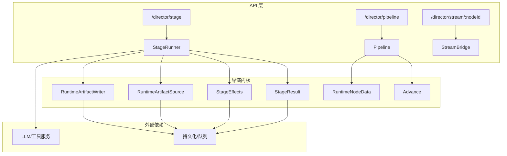
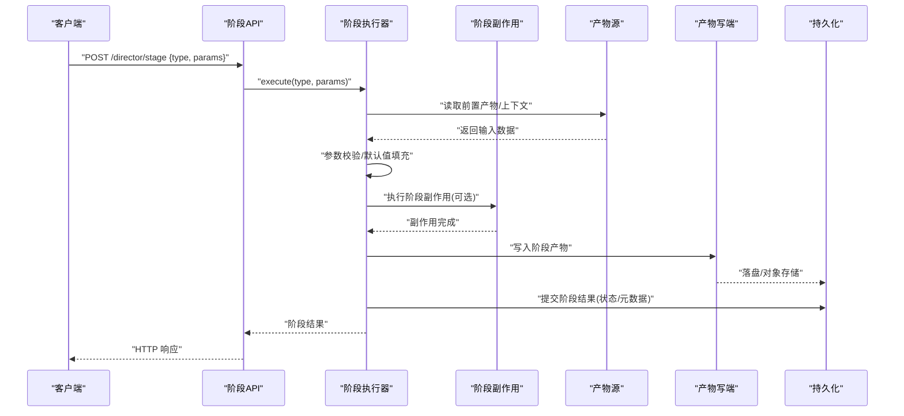
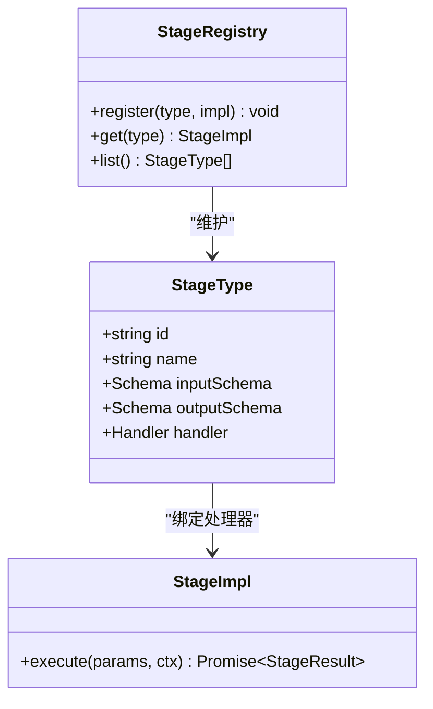
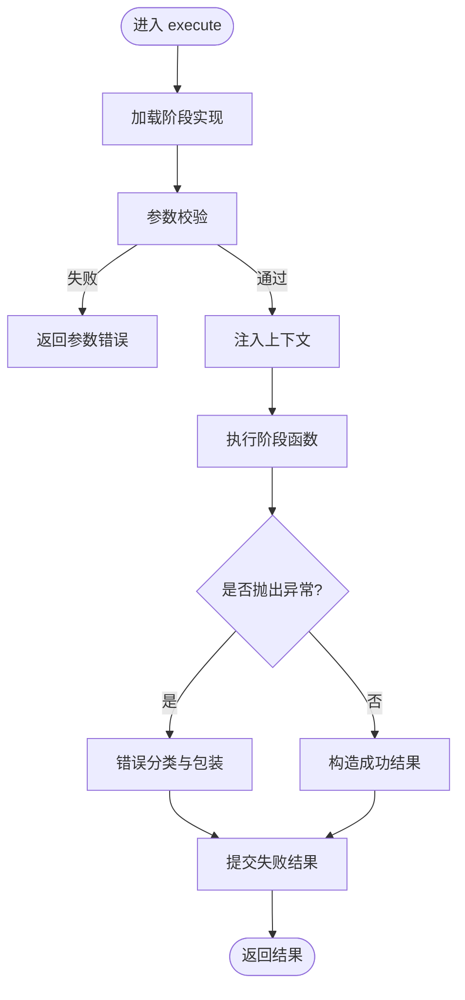
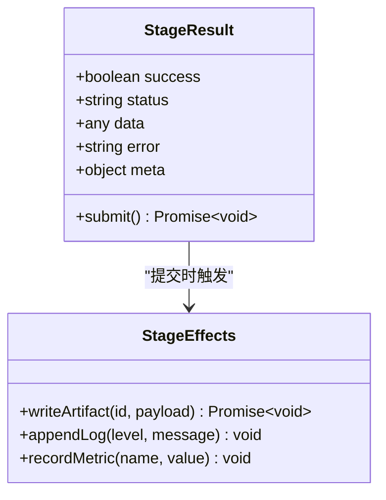
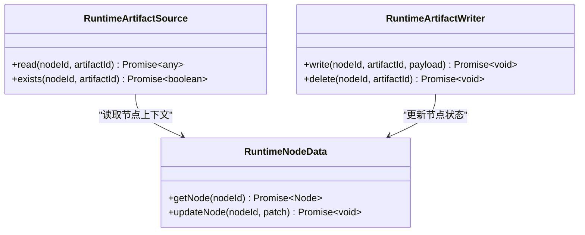
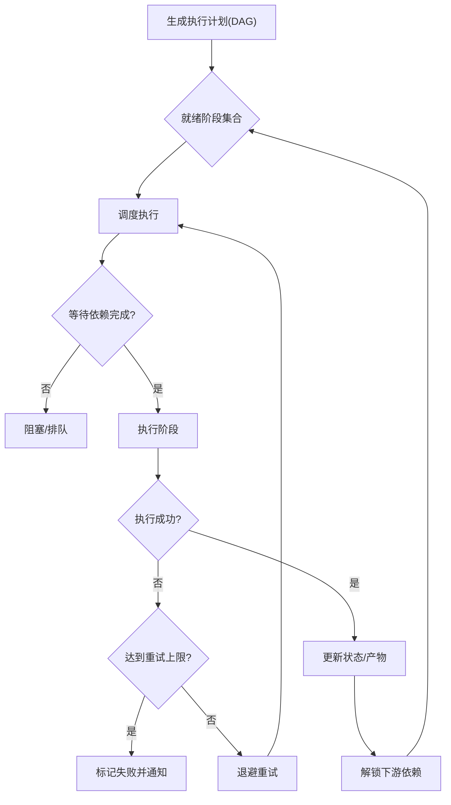
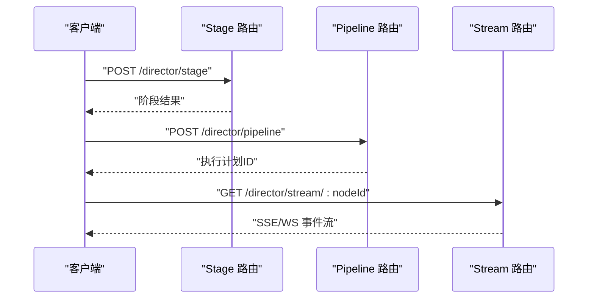
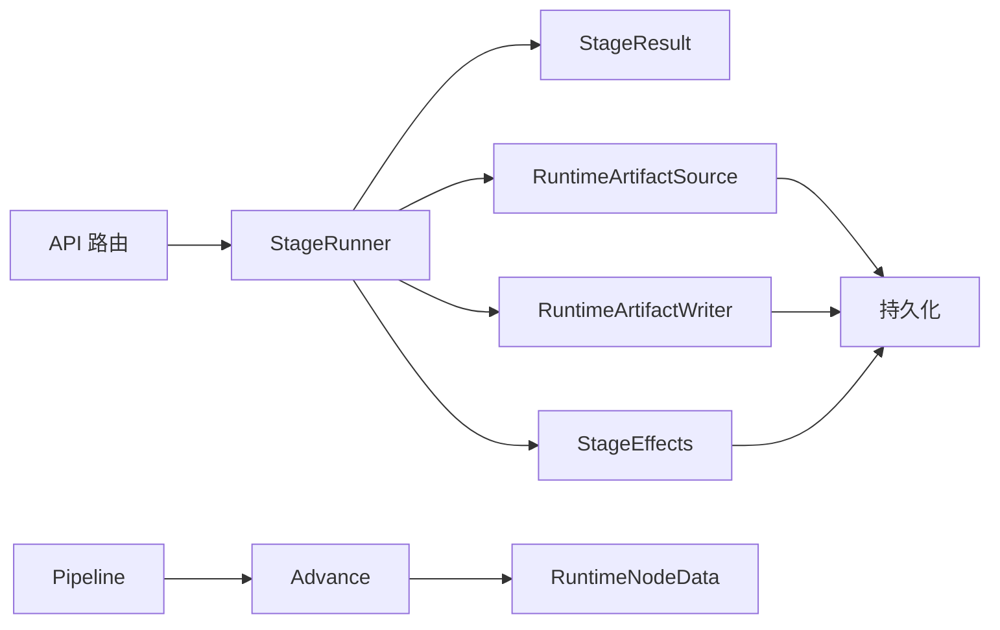

# 阶段管理 API

<cite>
**本文引用的文件**   
- [src/features/director/index.ts](file://src/features/director/index.ts)
- [src/features/director/types.ts](file://src/features/director/types.ts)
- [src/features/director/stage-runner.ts](file://src/features/director/stage-runner.ts)
- [src/features/director/stage-result.ts](file://src/features/director/stage-result.ts)
- [src/features/director/stage-effects.ts](file://src/features/director/stage-effects.ts)
- [src/features/director/runtime-artifact-source.ts](file://src/features/director/runtime-artifact-source.ts)
- [src/features/director/runtime-artifact-writer.ts](file://src/features/director/runtime-artifact-writer.ts)
- [src/features/director/runtime-node-data.ts](file://src/features/director/runtime-node-data.ts)
- [src/features/director/advance.ts](file://src/features/director/advance.ts)
- [src/features/director/pipeline.ts](file://src/features/director/pipeline.ts)
- [src/app/api/director/stage/route.ts](file://src/app/api/director/stage/route.ts)
- [src/app/api/director/pipeline/route.ts](file://src/app/api/director/pipeline/route.ts)
- [src/app/api/director/stream/[nodeId]/route.ts](file://src/app/api/director/stream/[nodeId]/route.ts)
</cite>

## 目录
1. [简介](#简介)
2. [项目结构](#项目结构)
3. [核心组件](#核心组件)
4. [架构总览](#架构总览)
5. [详细组件分析](#详细组件分析)
6. [依赖关系分析](#依赖关系分析)
7. [性能考量](#性能考量)
8. [故障排查指南](#故障排查指南)
9. [结论](#结论)
10. [附录：API 参考](#附录api-参考)

## 简介
本文件为 PurpleInk 导演系统的“阶段管理”功能提供完整的 API 文档，覆盖阶段的定义、注册、执行与结果处理。内容包含：
- 阶段类型与参数校验规范
- 输入输出契约与产物（Artifact）读写接口
- 阶段生命周期、依赖解析与执行调度
- 结果存储、错误传播与状态同步
- 自定义阶段开发、插件集成与扩展点使用方式

## 项目结构
导演系统位于 src/features/director 目录下，API 路由位于 src/app/api/director。关键模块职责如下：
- types.ts：阶段、运行态、产物等核心类型定义
- stage-runner.ts：阶段执行器，负责调用阶段逻辑、捕获异常与记录日志
- stage-result.ts：阶段结果封装与提交
- stage-effects.ts：阶段副作用（如写产物、更新状态）编排
- runtime-artifact-source.ts / runtime-artifact-writer.ts：运行时产物读取/写入抽象
- runtime-node-data.ts：节点数据访问与序列化
- advance.ts：阶段推进与状态机驱动
- pipeline.ts：流水线编排与依赖解析
- API 路由：stage、pipeline、stream 三个入口分别暴露阶段与流水线的 HTTP 接口

图表来源 
- [src/app/api/director/stage/route.ts](file://src/app/api/director/stage/route.ts)
- [src/app/api/director/pipeline/route.ts](file://src/app/api/director/pipeline/route.ts)
- [src/app/api/director/stream/[nodeId]/route.ts](file://src/app/api/director/stream/[nodeId]/route.ts)
- [src/features/director/stage-runner.ts](file://src/features/director/stage-runner.ts)
- [src/features/director/stage-result.ts](file://src/features/director/stage-result.ts)
- [src/features/director/stage-effects.ts](file://src/features/director/stage-effects.ts)
- [src/features/director/runtime-artifact-source.ts](file://src/features/director/runtime-artifact-source.ts)
- [src/features/director/runtime-artifact-writer.ts](file://src/features/director/runtime-artifact-writer.ts)
- [src/features/director/runtime-node-data.ts](file://src/features/director/runtime-node-data.ts)
- [src/features/director/advance.ts](file://src/features/director/advance.ts)
- [src/features/director/pipeline.ts](file://src/features/director/pipeline.ts)

章节来源
- [src/features/director/index.ts](file://src/features/director/index.ts)
- [src/app/api/director/stage/route.ts](file://src/app/api/director/stage/route.ts)
- [src/app/api/director/pipeline/route.ts](file://src/app/api/director/pipeline/route.ts)
- [src/app/api/director/stream/[nodeId]/route.ts](file://src/app/api/director/stream/[nodeId]/route.ts)

## 核心组件
- 阶段执行器（StageRunner）：负责加载阶段实现、注入上下文、执行阶段函数、捕获异常并产出阶段结果。
- 阶段结果（StageResult）：统一封装成功/失败状态、元数据、产物引用与错误信息，支持提交到持久化。
- 阶段副作用（StageEffects）：将阶段产生的中间产物、日志、指标等副作用按策略写入存储或上报。
- 运行时产物源/写端（RuntimeArtifactSource/Writer）：对产物进行只读/写入抽象，屏蔽底层存储差异。
- 节点数据（RuntimeNodeData）：提供节点级数据的读取、序列化与版本兼容能力。
- 推进器（Advance）：基于阶段状态机驱动阶段推进，保证顺序与并发控制。
- 流水线（Pipeline）：解析阶段依赖图、生成执行计划、协调阶段调度与重试。

章节来源
- [src/features/director/stage-runner.ts](file://src/features/director/stage-runner.ts)
- [src/features/director/stage-result.ts](file://src/features/director/stage-result.ts)
- [src/features/director/stage-effects.ts](file://src/features/director/stage-effects.ts)
- [src/features/director/runtime-artifact-source.ts](file://src/features/director/runtime-artifact-source.ts)
- [src/features/director/runtime-artifact-writer.ts](file://src/features/director/runtime-artifact-writer.ts)
- [src/features/director/runtime-node-data.ts](file://src/features/director/runtime-node-data.ts)
- [src/features/director/advance.ts](file://src/features/director/advance.ts)
- [src/features/director/pipeline.ts](file://src/features/director/pipeline.ts)

## 架构总览
阶段管理采用“API 路由 -> 执行器 -> 副作用/产物 -> 持久化”的分层架构。API 层仅做请求解析与鉴权；执行器负责业务编排；副作用与产物读写通过抽象接口隔离存储实现；推进器与流水线负责依赖解析与调度。

图表来源 
- [src/app/api/director/stage/route.ts](file://src/app/api/director/stage/route.ts)
- [src/features/director/stage-runner.ts](file://src/features/director/stage-runner.ts)
- [src/features/director/stage-effects.ts](file://src/features/director/stage-effects.ts)
- [src/features/director/runtime-artifact-source.ts](file://src/features/director/runtime-artifact-source.ts)
- [src/features/director/runtime-artifact-writer.ts](file://src/features/director/runtime-artifact-writer.ts)
- [src/features/director/stage-result.ts](file://src/features/director/stage-result.ts)

## 详细组件分析

### 阶段类型与注册
- 阶段类型：由类型系统约束，常见包括采集、编排、渲染、导出等。每种类型对应一组输入参数与输出产物。
- 阶段注册：在运行时通过类型映射表注册阶段实现，支持热插拔与多实现切换。
- 参数验证：在执行前对入参进行必填项、类型、范围校验，失败即快速返回。

图表来源 
- [src/features/director/types.ts](file://src/features/director/types.ts)
- [src/features/director/index.ts](file://src/features/director/index.ts)

章节来源
- [src/features/director/types.ts](file://src/features/director/types.ts)
- [src/features/director/index.ts](file://src/features/director/index.ts)

### 阶段执行器（StageRunner）
- 职责：加载阶段实现、注入上下文、执行阶段函数、捕获异常、生成阶段结果。
- 关键点：
  - 上下文注入：包含项目/镜头/用户/权限等信息
  - 超时与重试：可配置最大重试次数与退避策略
  - 日志与追踪：结构化日志与链路追踪 ID
  - 错误分类：参数错误、运行时错误、外部依赖错误

图表来源 
- [src/features/director/stage-runner.ts](file://src/features/director/stage-runner.ts)
- [src/features/director/stage-result.ts](file://src/features/director/stage-result.ts)

章节来源
- [src/features/director/stage-runner.ts](file://src/features/director/stage-runner.ts)
- [src/features/director/stage-result.ts](file://src/features/director/stage-result.ts)

### 阶段结果与副作用（StageResult & StageEffects）
- 阶段结果：包含状态码、消息、产物引用、耗时、追踪信息等。
- 副作用：将阶段产生的中间产物、日志、指标等写入存储或上报监控。
- 提交策略：支持批量提交、幂等写入与回滚。

图表来源 
- [src/features/director/stage-result.ts](file://src/features/director/stage-result.ts)
- [src/features/director/stage-effects.ts](file://src/features/director/stage-effects.ts)

章节来源
- [src/features/director/stage-result.ts](file://src/features/director/stage-result.ts)
- [src/features/director/stage-effects.ts](file://src/features/director/stage-effects.ts)

### 运行时产物读写（RuntimeArtifactSource/Writer）
- 产物源：按阶段依赖读取前置产物，支持缓存与版本选择。
- 产物写端：将阶段输出以结构化格式写入，支持分片与断点续传。
- 一致性：读写操作需满足幂等与事务性要求。

图表来源 
- [src/features/director/runtime-artifact-source.ts](file://src/features/director/runtime-artifact-source.ts)
- [src/features/director/runtime-artifact-writer.ts](file://src/features/director/runtime-artifact-writer.ts)
- [src/features/director/runtime-node-data.ts](file://src/features/director/runtime-node-data.ts)

章节来源
- [src/features/director/runtime-artifact-source.ts](file://src/features/director/runtime-artifact-source.ts)
- [src/features/director/runtime-artifact-writer.ts](file://src/features/director/runtime-artifact-writer.ts)
- [src/features/director/runtime-node-data.ts](file://src/features/director/runtime-node-data.ts)

### 阶段推进与流水线（Advance & Pipeline）
- 推进器：根据阶段状态机推进阶段，确保依赖满足后执行，支持并发与限流。
- 流水线：解析阶段依赖图，生成 DAG，分配执行槽位，处理失败重试与补偿。

图表来源 
- [src/features/director/advance.ts](file://src/features/director/advance.ts)
- [src/features/director/pipeline.ts](file://src/features/director/pipeline.ts)

章节来源
- [src/features/director/advance.ts](file://src/features/director/advance.ts)
- [src/features/director/pipeline.ts](file://src/features/director/pipeline.ts)

### API 路由（Stage/Pipeline/Stream）
- /director/stage：创建并执行单个阶段，返回阶段结果
- /director/pipeline：提交流水线任务，返回执行计划与进度
- /director/stream/:nodeId：按节点推送实时日志/事件流

图表来源 
- [src/app/api/director/stage/route.ts](file://src/app/api/director/stage/route.ts)
- [src/app/api/director/pipeline/route.ts](file://src/app/api/director/pipeline/route.ts)
- [src/app/api/director/stream/[nodeId]/route.ts](file://src/app/api/director/stream/[nodeId]/route.ts)

章节来源
- [src/app/api/director/stage/route.ts](file://src/app/api/director/stage/route.ts)
- [src/app/api/director/pipeline/route.ts](file://src/app/api/director/pipeline/route.ts)
- [src/app/api/director/stream/[nodeId]/route.ts](file://src/app/api/director/stream/[nodeId]/route.ts)

## 依赖关系分析
- 低耦合：API 路由不直接执行业务，仅做协议适配；执行器与副作用解耦；产物读写通过抽象接口隔离。
- 高内聚：阶段相关类型、执行、结果、副作用集中在 director 特性域内。
- 外部依赖：持久化、队列、LLM/工具服务通过适配器接入，便于替换与测试。

图表来源 
- [src/app/api/director/stage/route.ts](file://src/app/api/director/stage/route.ts)
- [src/app/api/director/pipeline/route.ts](file://src/app/api/director/pipeline/route.ts)
- [src/app/api/director/stream/[nodeId]/route.ts](file://src/app/api/director/stream/[nodeId]/route.ts)
- [src/features/director/stage-runner.ts](file://src/features/director/stage-runner.ts)
- [src/features/director/stage-result.ts](file://src/features/director/stage-result.ts)
- [src/features/director/stage-effects.ts](file://src/features/director/stage-effects.ts)
- [src/features/director/runtime-artifact-source.ts](file://src/features/director/runtime-artifact-source.ts)
- [src/features/director/runtime-artifact-writer.ts](file://src/features/director/runtime-artifact-writer.ts)
- [src/features/director/runtime-node-data.ts](file://src/features/director/runtime-node-data.ts)
- [src/features/director/advance.ts](file://src/features/director/advance.ts)
- [src/features/director/pipeline.ts](file://src/features/director/pipeline.ts)

章节来源
- [src/features/director/types.ts](file://src/features/director/types.ts)
- [src/features/director/index.ts](file://src/features/director/index.ts)

## 性能考量
- 并行执行：依赖满足的阶段可并发执行，注意资源限制与背压。
- 产物缓存：对读多写少的产物启用缓存，减少重复计算与 IO。
- 批量化写入：副作用与结果提交尽量批量合并，降低锁竞争。
- 超时与重试：合理设置超时与退避策略，避免雪崩。
- 流式输出：长耗时阶段通过 SSE/WS 推送进度，提升用户体验。

[本节为通用指导，无需特定文件来源]

## 故障排查指南
- 参数校验失败：检查入参 schema 与必填字段，确认类型与范围。
- 依赖未就绪：查看上游阶段状态与产物是否存在，必要时清理脏数据。
- 外部依赖错误：区分网络超时、鉴权失败、配额限制等错误类型，针对性重试或降级。
- 产物写入失败：检查存储权限、路径合法性与大小限制，必要时回滚并重试。
- 状态不同步：核对推进器状态机转换是否正确，确认事件是否丢失。

章节来源
- [src/features/director/stage-runner.ts](file://src/features/director/stage-runner.ts)
- [src/features/director/stage-result.ts](file://src/features/director/stage-result.ts)
- [src/features/director/advance.ts](file://src/features/director/advance.ts)

## 结论
PurpleInk 导演系统的阶段管理以清晰的类型与接口为核心，通过执行器、副作用、产物读写与推进器/流水线协同，实现了可扩展、可观测、可恢复的阶段执行体系。开发者可通过类型系统与注册机制快速扩展自定义阶段，并通过标准 API 与流式接口进行集成。

[本节为总结性内容，无需特定文件来源]

## 附录：API 参考

### 阶段执行 API（/director/stage）
- 方法：POST
- 请求体字段：
  - type：阶段类型标识
  - params：阶段参数（按类型 schema 校验）
  - options：执行选项（超时、重试、并发度等）
- 响应体字段：
  - success：是否成功
  - status：阶段状态码
  - data：阶段输出数据（可能为空）
  - error：错误信息（失败时）
  - meta：元数据（耗时、追踪ID等）

章节来源
- [src/app/api/director/stage/route.ts](file://src/app/api/director/stage/route.ts)
- [src/features/director/stage-runner.ts](file://src/features/director/stage-runner.ts)
- [src/features/director/stage-result.ts](file://src/features/director/stage-result.ts)

### 流水线提交 API（/director/pipeline）
- 方法：POST
- 请求体字段：
  - stages：阶段列表（含类型、参数、依赖）
  - options：全局执行选项
- 响应体字段：
  - planId：执行计划 ID
  - status：初始状态
  - nodes：节点状态快照

章节来源
- [src/app/api/director/pipeline/route.ts](file://src/app/api/director/pipeline/route.ts)
- [src/features/director/pipeline.ts](file://src/features/director/pipeline.ts)
- [src/features/director/advance.ts](file://src/features/director/advance.ts)

### 流式事件 API（/director/stream/:nodeId）
- 方法：GET
- 路径参数：
  - nodeId：节点 ID
- 事件类型：
  - log：日志事件
  - progress：进度事件
  - result：阶段结果事件
  - error：错误事件

章节来源
- [src/app/api/director/stream/[nodeId]/route.ts](file://src/app/api/director/stream/[nodeId]/route.ts)
- [src/features/director/stage-effects.ts](file://src/features/director/stage-effects.ts)

### 阶段类型与参数规范
- 阶段类型：采集、编排、渲染、导出等，具体以类型定义为准
- 参数校验：必填项、类型、取值范围、格式校验
- 输入输出：遵循各类型的 schema 定义，产物以结构化格式存储

章节来源
- [src/features/director/types.ts](file://src/features/director/types.ts)
- [src/features/director/index.ts](file://src/features/director/index.ts)

### 自定义阶段开发与插件集成
- 步骤：
  - 定义阶段类型与 schema
  - 实现阶段处理器（execute）
  - 注册阶段到运行时映射表
  - 通过 API 调用执行
- 扩展点：
  - 产物读写适配器
  - 副作用处理器
  - 外部服务适配器（LLM/工具）

章节来源
- [src/features/director/index.ts](file://src/features/director/index.ts)
- [src/features/director/types.ts](file://src/features/director/types.ts)
- [src/features/director/runtime-artifact-source.ts](file://src/features/director/runtime-artifact-source.ts)
- [src/features/director/runtime-artifact-writer.ts](file://src/features/director/runtime-artifact-writer.ts)
- [src/features/director/stage-effects.ts](file://src/features/director/stage-effects.ts)