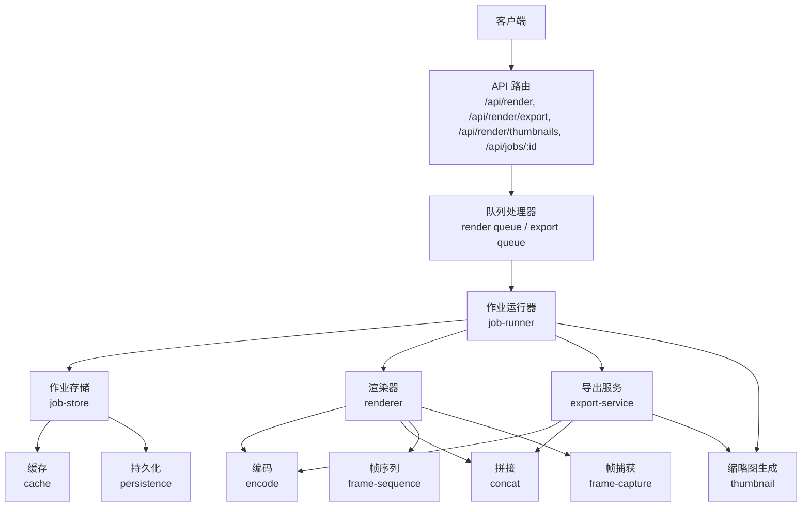
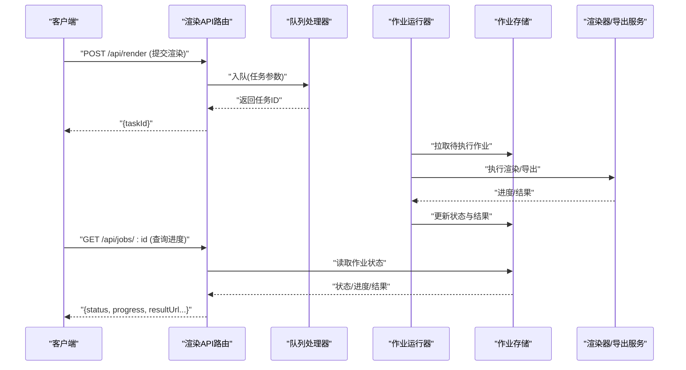
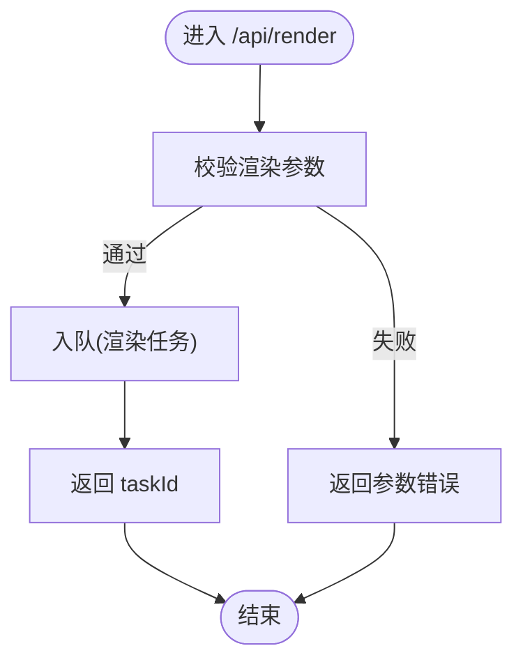
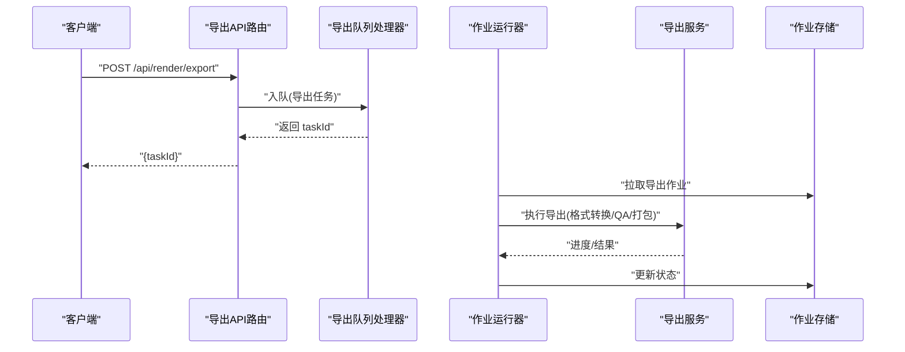
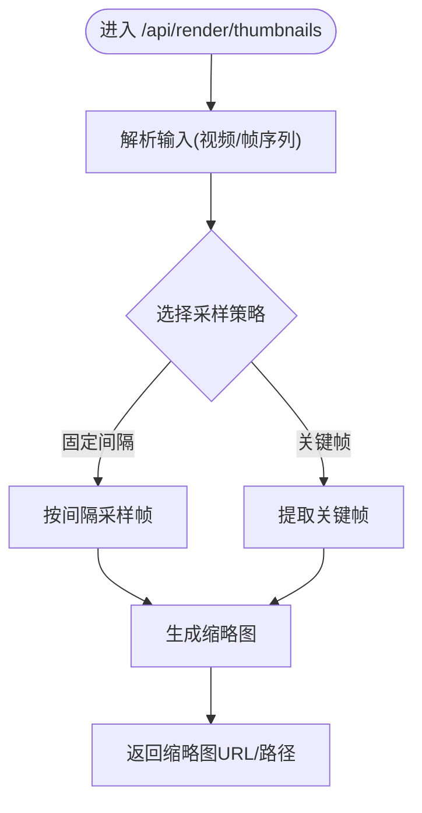
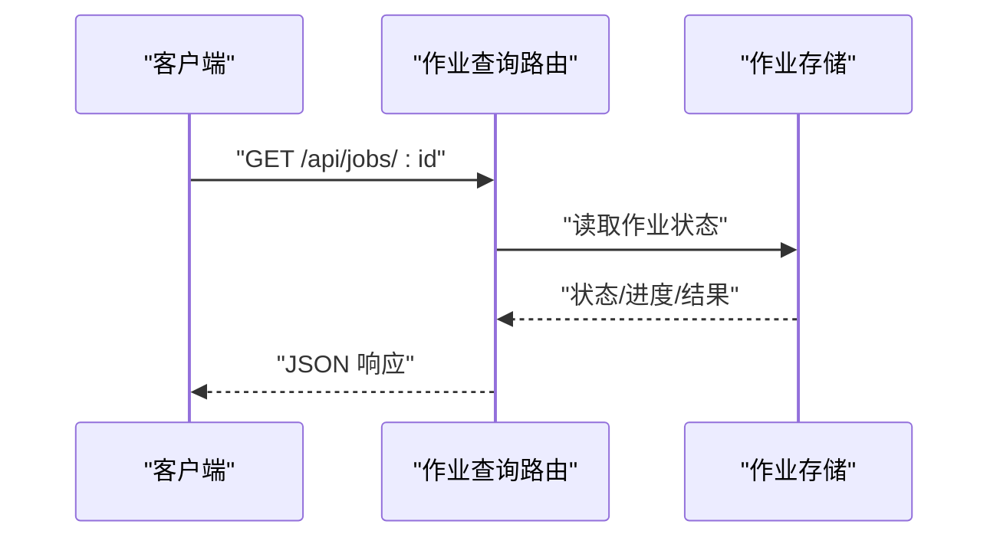
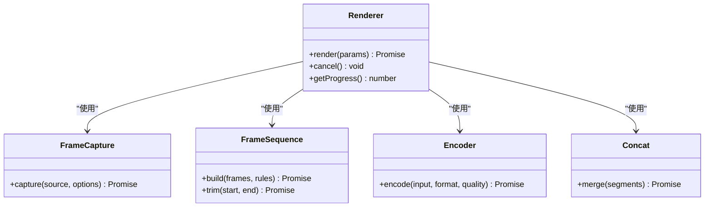
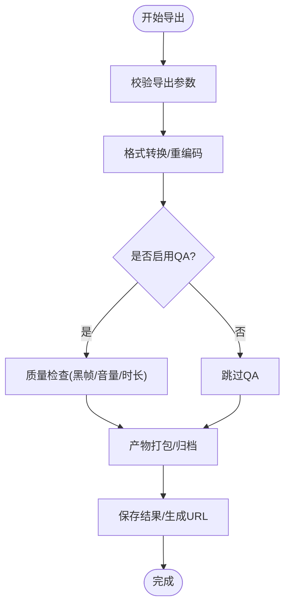
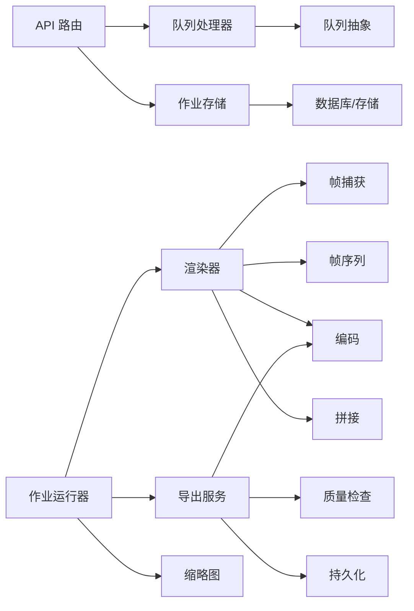

# 渲染 API

<cite>
**本文引用的文件**   
- [server/src/index.ts](file://server/src/index.ts)
- [server/src/server/api.ts](file://server/src/server/api.ts)
- [server/src/server/job-runner.ts](file://server/src/server/job-runner.ts)
- [server/src/server/job-store.ts](file://server/src/server/job-store.ts)
- [src/app/api/render/route.ts](file://src/app/api/render/route.ts)
- [src/app/api/render/export/route.ts](file://src/app/api/render/export/route.ts)
- [src/app/api/render/thumbnails/route.ts](file://src/app/api/render/thumbnails/route.ts)
- [src/app/api/jobs/[id]/route.ts](file://src/app/api/jobs/[id]/route.ts)
- [src/features/render/renderer.ts](file://src/features/render/renderer.ts)
- [src/features/render/export-service.ts](file://src/features/render/export-service.ts)
- [src/features/render/queue-handler.ts](file://src/features/render/queue-handler.ts)
- [src/features/render/export-queue-handler.ts](file://src/features/render/export-queue-handler.ts)
- [src/features/render/thumbnail.ts](file://src/features/render/thumbnail.ts)
- [src/features/render/types.ts](file://src/features/render/types.ts)
- [src/features/render/persistence.ts](file://src/features/render/persistence.ts)
- [src/features/render/cache.ts](file://src/features/render/cache.ts)
- [src/features/render/qa-check.ts](file://src/features/render/qa-check.ts)
- [src/features/render/concat.ts](file://src/features/render/concat.ts)
- [src/features/render/encode.ts](file://src/features/render/encode.ts)
- [src/features/render/frame-capture.ts](file://src/features/render/frame-capture.ts)
- [src/features/render/frame-sequence.ts](file://src/features/render/frame-sequence.ts)
- [src/lib/queue/index.ts](file://src/lib/queue/index.ts)
</cite>

## 目录
1. [简介](#简介)
2. [项目结构](#项目结构)
3. [核心组件](#核心组件)
4. [架构总览](#架构总览)
5. [详细组件分析](#详细组件分析)
6. [依赖关系分析](#依赖关系分析)
7. [性能考虑](#性能考虑)
8. [故障排查指南](#故障排查指南)
9. [结论](#结论)
10. [附录](#附录)

## 简介
本文件为 PurpleInk 渲染引擎的 API 文档，覆盖视频渲染、导出、缩略图生成等所有与渲染相关的接口。内容包含：
- 渲染任务提交、进度跟踪与结果获取的接口规范
- 批量渲染、格式转换与质量检查的调用方式
- 渲染参数配置、输出格式选项与性能优化建议
- 异步任务处理、错误重试与超时管理机制

## 项目结构
渲染相关能力由“Web API 层 + 渲染服务层 + 队列与持久化”组成：
- Web API 层：Next.js App Router 暴露 /api/render、/api/render/export、/api/render/thumbnails、/api/jobs/[id] 等端点
- 渲染服务层：封装渲染器、导出服务、缩略图生成、帧序列与编码、拼接与 QA 检查
- 队列与持久化：统一队列抽象、任务存储与缓存

图表来源
- [server/src/server/api.ts](file://server/src/server/api.ts)
- [src/app/api/render/route.ts](file://src/app/api/render/route.ts)
- [src/app/api/render/export/route.ts](file://src/app/api/render/export/route.ts)
- [src/app/api/render/thumbnails/route.ts](file://src/app/api/render/thumbnails/route.ts)
- [src/app/api/jobs/[id]/route.ts](file://src/app/api/jobs/[id]/route.ts)
- [src/features/render/queue-handler.ts](file://src/features/render/queue-handler.ts)
- [src/features/render/export-queue-handler.ts](file://src/features/render/export-queue-handler.ts)
- [src/server/src/server/job-runner.ts](file://server/src/server/job-runner.ts)
- [src/server/src/server/job-store.ts](file://server/src/server/job-store.ts)
- [src/features/render/renderer.ts](file://src/features/render/renderer.ts)
- [src/features/render/export-service.ts](file://src/features/render/export-service.ts)
- [src/features/render/thumbnail.ts](file://src/features/render/thumbnail.ts)
- [src/features/render/encode.ts](file://src/features/render/encode.ts)
- [src/features/render/concat.ts](file://src/features/render/concat.ts)
- [src/features/render/frame-capture.ts](file://src/features/render/frame-capture.ts)
- [src/features/render/frame-sequence.ts](file://src/features/render/frame-sequence.ts)
- [src/features/render/cache.ts](file://src/features/render/cache.ts)
- [src/features/render/persistence.ts](file://src/features/render/persistence.ts)

章节来源
- [server/src/index.ts](file://server/src/index.ts)
- [server/src/server/api.ts](file://server/src/server/api.ts)
- [src/app/api/render/route.ts](file://src/app/api/render/route.ts)
- [src/app/api/render/export/route.ts](file://src/app/api/render/export/route.ts)
- [src/app/api/render/thumbnails/route.ts](file://src/app/api/render/thumbnails/route.ts)
- [src/app/api/jobs/[id]/route.ts](file://src/app/api/jobs/[id]/route.ts)

## 核心组件
- 渲染器（renderer）：编排帧捕获、序列构建、编码与拼接，支持多阶段流水线
- 导出服务（export-service）：面向导出的端到端流程，含格式转换、质量检查与产物落盘
- 缩略图生成（thumbnail）：从视频或帧序列快速生成预览图
- 队列处理器（queue-handler / export-queue-handler）：将 API 请求入队并驱动后台执行
- 作业运行器（job-runner）：拉取作业、执行、更新状态、处理失败与重试
- 作业存储（job-store）：作业元数据与状态的持久化与查询
- 编码（encode）、拼接（concat）、帧序列（frame-sequence）、帧捕获（frame-capture）：底层媒体处理能力
- 缓存（cache）与持久化（persistence）：中间产物与结果的存取

章节来源
- [src/features/render/renderer.ts](file://src/features/render/renderer.ts)
- [src/features/render/export-service.ts](file://src/features/render/export-service.ts)
- [src/features/render/thumbnail.ts](file://src/features/render/thumbnail.ts)
- [src/features/render/queue-handler.ts](file://src/features/render/queue-handler.ts)
- [src/features/render/export-queue-handler.ts](file://src/features/render/export-queue-handler.ts)
- [src/server/src/server/job-runner.ts](file://server/src/server/job-runner.ts)
- [src/server/src/server/job-store.ts](file://server/src/server/job-store.ts)
- [src/features/render/encode.ts](file://src/features/render/encode.ts)
- [src/features/render/concat.ts](file://src/features/render/concat.ts)
- [src/features/render/frame-sequence.ts](file://src/features/render/frame-sequence.ts)
- [src/features/render/frame-capture.ts](file://src/features/render/frame-capture.ts)
- [src/features/render/cache.ts](file://src/features/render/cache.ts)
- [src/features/render/persistence.ts](file://src/features/render/persistence.ts)

## 架构总览
渲染 API 采用“请求入队 + 后台执行 + 状态轮询”的异步模式，确保高吞吐与可观测性。

图表来源
- [src/app/api/render/route.ts](file://src/app/api/render/route.ts)
- [src/app/api/jobs/[id]/route.ts](file://src/app/api/jobs/[id]/route.ts)
- [src/features/render/queue-handler.ts](file://src/features/render/queue-handler.ts)
- [src/server/src/server/job-runner.ts](file://server/src/server/job-runner.ts)
- [src/server/src/server/job-store.ts](file://server/src/server/job-store.ts)
- [src/features/render/renderer.ts](file://src/features/render/renderer.ts)
- [src/features/render/export-service.ts](file://src/features/render/export-service.ts)

## 详细组件分析

### 渲染 API（/api/render）
- 功能：提交渲染任务，支持单帧/片段/整段渲染，返回任务 ID
- 输入：渲染参数（分辨率、码率、帧率、编码参数、输入源、时间范围等）
- 输出：任务 ID；后续通过 /api/jobs/:id 查询进度与结果
- 行为：校验参数、写入队列、立即返回

图表来源
- [src/app/api/render/route.ts](file://src/app/api/render/route.ts)
- [src/features/render/queue-handler.ts](file://src/features/render/queue-handler.ts)
- [src/features/render/types.ts](file://src/features/render/types.ts)

章节来源
- [src/app/api/render/route.ts](file://src/app/api/render/route.ts)
- [src/features/render/queue-handler.ts](file://src/features/render/queue-handler.ts)
- [src/features/render/types.ts](file://src/features/render/types.ts)

### 导出 API（/api/render/export）
- 功能：提交导出任务，支持格式转换、质量检查、产物打包
- 输入：导出参数（目标格式、质量、是否 QA、输出路径策略等）
- 输出：任务 ID；后续通过 /api/jobs/:id 查询进度与结果
- 行为：参数校验、入队、返回 taskId

图表来源
- [src/app/api/render/export/route.ts](file://src/app/api/render/export/route.ts)
- [src/features/render/export-queue-handler.ts](file://src/features/render/export-queue-handler.ts)
- [src/server/src/server/job-runner.ts](file://server/src/server/job-runner.ts)
- [src/features/render/export-service.ts](file://src/features/render/export-service.ts)
- [src/server/src/server/job-store.ts](file://server/src/server/job-store.ts)

章节来源
- [src/app/api/render/export/route.ts](file://src/app/api/render/export/route.ts)
- [src/features/render/export-queue-handler.ts](file://src/features/render/export-queue-handler.ts)
- [src/features/render/export-service.ts](file://src/features/render/export-service.ts)

### 缩略图 API（/api/render/thumbnails）
- 功能：基于视频或帧序列生成缩略图
- 输入：源地址/帧序列、尺寸、数量、采样策略
- 输出：缩略图列表或压缩包；也可作为导出任务的子步骤

图表来源
- [src/app/api/render/thumbnails/route.ts](file://src/app/api/render/thumbnails/route.ts)
- [src/features/render/thumbnail.ts](file://src/features/render/thumbnail.ts)
- [src/features/render/frame-capture.ts](file://src/features/render/frame-capture.ts)
- [src/features/render/frame-sequence.ts](file://src/features/render/frame-sequence.ts)

章节来源
- [src/app/api/render/thumbnails/route.ts](file://src/app/api/render/thumbnails/route.ts)
- [src/features/render/thumbnail.ts](file://src/features/render/thumbnail.ts)
- [src/features/render/frame-capture.ts](file://src/features/render/frame-capture.ts)
- [src/features/render/frame-sequence.ts](file://src/features/render/frame-sequence.ts)

### 作业查询 API（/api/jobs/:id）
- 功能：查询渲染/导出任务的状态、进度与结果
- 输入：任务 ID
- 输出：{ status, progress, result, error? }

图表来源
- [src/app/api/jobs/[id]/route.ts](file://src/app/api/jobs/[id]/route.ts)
- [src/server/src/server/job-store.ts](file://server/src/server/job-store.ts)

章节来源
- [src/app/api/jobs/[id]/route.ts](file://src/app/api/jobs/[id]/route.ts)
- [src/server/src/server/job-store.ts](file://server/src/server/job-store.ts)

### 渲染器（renderer）
- 职责：编排帧捕获、序列构建、编码与拼接，支持分阶段流水线与中间产物缓存
- 关键点：
  - 帧捕获：从视频或页面渲染中抽取帧
  - 帧序列：管理帧顺序、裁剪、转场
  - 编码：根据目标格式与质量进行编码
  - 拼接：将片段合并为最终视频

图表来源
- [src/features/render/renderer.ts](file://src/features/render/renderer.ts)
- [src/features/render/frame-capture.ts](file://src/features/render/frame-capture.ts)
- [src/features/render/frame-sequence.ts](file://src/features/render/frame-sequence.ts)
- [src/features/render/encode.ts](file://src/features/render/encode.ts)
- [src/features/render/concat.ts](file://src/features/render/concat.ts)

章节来源
- [src/features/render/renderer.ts](file://src/features/render/renderer.ts)
- [src/features/render/frame-capture.ts](file://src/features/render/frame-capture.ts)
- [src/features/render/frame-sequence.ts](file://src/features/render/frame-sequence.ts)
- [src/features/render/encode.ts](file://src/features/render/encode.ts)
- [src/features/render/concat.ts](file://src/features/render/concat.ts)

### 导出服务（export-service）
- 职责：端到端导出流程，包括格式转换、质量检查、产物打包与落盘
- 关键点：
  - 支持多种目标格式与质量档位
  - 可选 QA 检查（如黑帧检测、音量阈值等）
  - 产物归档与 URL 生成

图表来源
- [src/features/render/export-service.ts](file://src/features/render/export-service.ts)
- [src/features/render/qa-check.ts](file://src/features/render/qa-check.ts)
- [src/features/render/encode.ts](file://src/features/render/encode.ts)
- [src/features/render/persistence.ts](file://src/features/render/persistence.ts)

章节来源
- [src/features/render/export-service.ts](file://src/features/render/export-service.ts)
- [src/features/render/qa-check.ts](file://src/features/render/qa-check.ts)
- [src/features/render/encode.ts](file://src/features/render/encode.ts)
- [src/features/render/persistence.ts](file://src/features/render/persistence.ts)

### 缩略图生成（thumbnail）
- 职责：从视频或帧序列快速生成缩略图
- 关键点：
  - 支持固定间隔与关键帧两种采样策略
  - 可指定尺寸与数量
  - 与导出流程解耦，可独立调用

章节来源
- [src/features/render/thumbnail.ts](file://src/features/render/thumbnail.ts)
- [src/features/render/frame-capture.ts](file://src/features/render/frame-capture.ts)
- [src/features/render/frame-sequence.ts](file://src/features/render/frame-sequence.ts)

### 队列与作业运行（queue-handler / export-queue-handler / job-runner）
- 职责：
  - 队列处理器：接收 API 请求，将任务入队并返回 taskId
  - 导出队列处理器：专门处理导出类任务
  - 作业运行器：拉取作业、执行、更新状态、处理失败与重试
- 关键点：
  - 并发控制与限流
  - 失败重试与退避策略
  - 超时管理与取消机制

章节来源
- [src/features/render/queue-handler.ts](file://src/features/render/queue-handler.ts)
- [src/features/render/export-queue-handler.ts](file://src/features/render/export-queue-handler.ts)
- [src/server/src/server/job-runner.ts](file://server/src/server/job-runner.ts)
- [src/lib/queue/index.ts](file://src/lib/queue/index.ts)

### 作业存储与缓存（job-store / cache / persistence）
- 职责：
  - 作业存储：持久化作业元数据、状态、进度与结果
  - 缓存：中间产物与热点数据的缓存
  - 持久化：最终产物落盘与访问路径管理

章节来源
- [src/server/src/server/job-store.ts](file://server/src/server/job-store.ts)
- [src/features/render/cache.ts](file://src/features/render/cache.ts)
- [src/features/render/persistence.ts](file://src/features/render/persistence.ts)

## 依赖关系分析
- API 路由依赖队列处理器与作业存储
- 作业运行器依赖渲染器、导出服务、缩略图生成
- 渲染器依赖帧捕获、帧序列、编码、拼接
- 导出服务依赖编码、质量检查、持久化
- 队列与作业存储依赖统一的队列抽象与持久化实现

图表来源
- [src/app/api/render/route.ts](file://src/app/api/render/route.ts)
- [src/app/api/render/export/route.ts](file://src/app/api/render/export/route.ts)
- [src/app/api/render/thumbnails/route.ts](file://src/app/api/render/thumbnails/route.ts)
- [src/app/api/jobs/[id]/route.ts](file://src/app/api/jobs/[id]/route.ts)
- [src/features/render/queue-handler.ts](file://src/features/render/queue-handler.ts)
- [src/features/render/export-queue-handler.ts](file://src/features/render/export-queue-handler.ts)
- [src/server/src/server/job-runner.ts](file://server/src/server/job-runner.ts)
- [src/server/src/server/job-store.ts](file://server/src/server/job-store.ts)
- [src/features/render/renderer.ts](file://src/features/render/renderer.ts)
- [src/features/render/export-service.ts](file://src/features/render/export-service.ts)
- [src/features/render/thumbnail.ts](file://src/features/render/thumbnail.ts)
- [src/features/render/encode.ts](file://src/features/render/encode.ts)
- [src/features/render/concat.ts](file://src/features/render/concat.ts)
- [src/features/render/frame-capture.ts](file://src/features/render/frame-capture.ts)
- [src/features/render/frame-sequence.ts](file://src/features/render/frame-sequence.ts)
- [src/features/render/qa-check.ts](file://src/features/render/qa-check.ts)
- [src/features/render/persistence.ts](file://src/features/render/persistence.ts)
- [src/lib/queue/index.ts](file://src/lib/queue/index.ts)

章节来源
- [src/lib/queue/index.ts](file://src/lib/queue/index.ts)
- [src/server/src/server/job-store.ts](file://server/src/server/job-store.ts)

## 性能考虑
- 并发与限流：合理设置队列并发度，避免资源争用与 OOM
- 编码参数：根据目标平台选择合适的码率、分辨率与帧率，平衡质量与体积
- 中间产物缓存：复用已生成的帧序列与中间编码结果，减少重复计算
- 批处理：批量渲染时合并相同参数的任务，提升吞吐
- 超时与取消：为长耗时任务设置超时与取消信号，防止僵尸作业
- I/O 优化：使用高速存储与并行读写，降低磁盘瓶颈

[本节为通用指导，不直接分析具体文件]

## 故障排查指南
- 常见错误：
  - 参数校验失败：检查渲染/导出参数是否符合约束
  - 队列积压：检查队列处理器与作业运行器健康状态
  - 编码失败：确认输入源有效性与编码参数合法性
  - 超时/中断：检查任务超时配置与取消逻辑
- 定位方法：
  - 通过 /api/jobs/:id 查询作业状态与错误信息
  - 查看中间产物与日志，定位失败阶段
  - 调整并发与超时参数，观察效果

章节来源
- [src/server/src/server/job-runner.ts](file://server/src/server/job-runner.ts)
- [src/server/src/server/job-store.ts](file://server/src/server/job-store.ts)
- [src/features/render/queue-handler.ts](file://src/features/render/queue-handler.ts)
- [src/features/render/export-queue-handler.ts](file://src/features/render/export-queue-handler.ts)

## 结论
PurpleInk 渲染引擎通过清晰的 API 分层与异步队列机制，提供稳定高效的视频渲染、导出与缩略图生成能力。开发者可通过标准接口提交任务、跟踪进度与获取结果，并结合参数配置与性能优化建议，满足多样化业务需求。

[本节为总结，不直接分析具体文件]

## 附录
- 渲染参数配置要点：
  - 分辨率、码率、帧率、编码格式、质量档位
  - 时间范围与裁剪规则
  - 输出路径与命名策略
- 输出格式选项：
  - MP4、WebM、GIF 等常见格式
  - 针对移动端与网页端的优化预设
- 质量检查项：
  - 黑帧检测、音量阈值、时长一致性
- 异步任务最佳实践：
  - 幂等提交与去重
  - 指数退避重试
  - 超时与取消信号传递

[本节为补充说明，不直接分析具体文件]