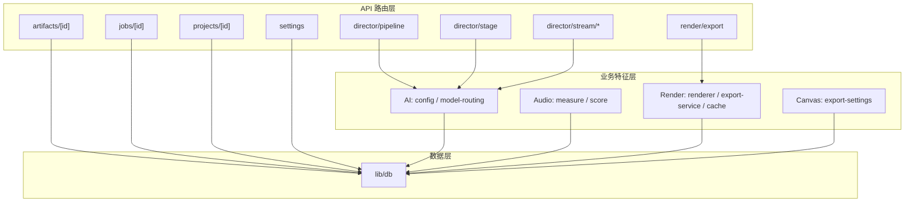
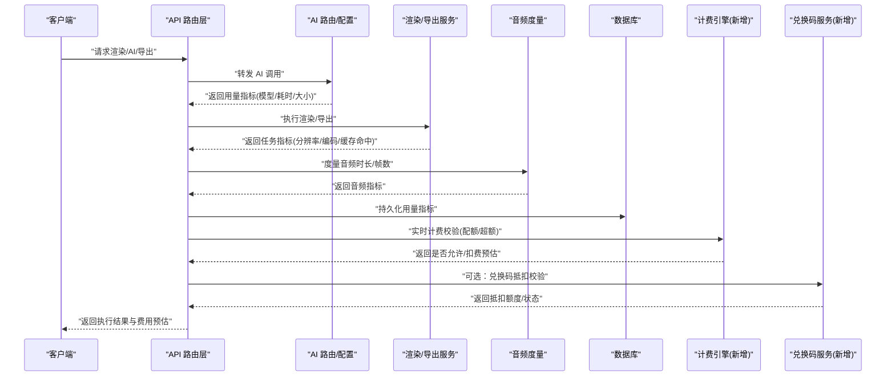
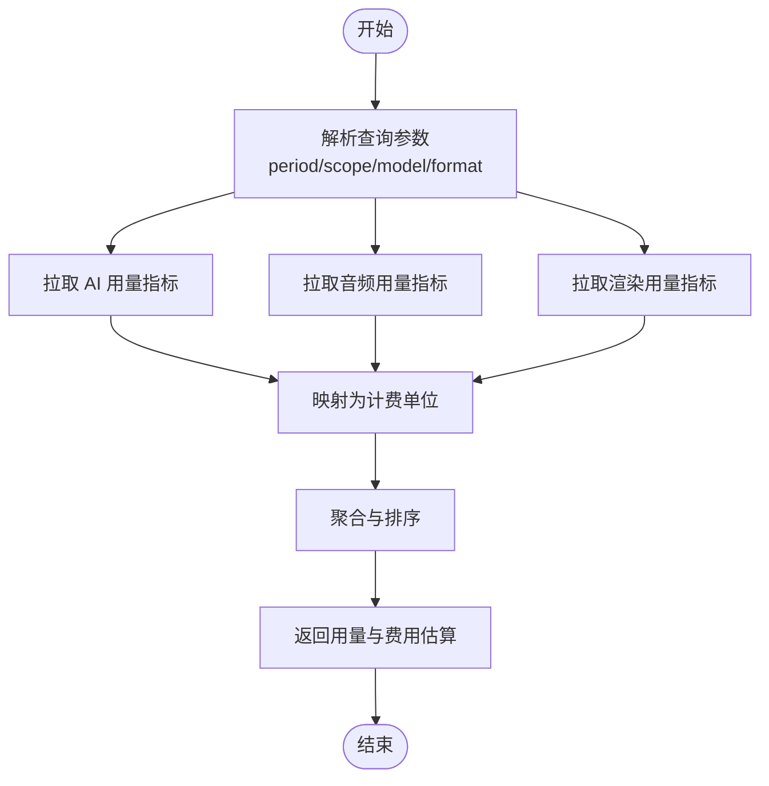
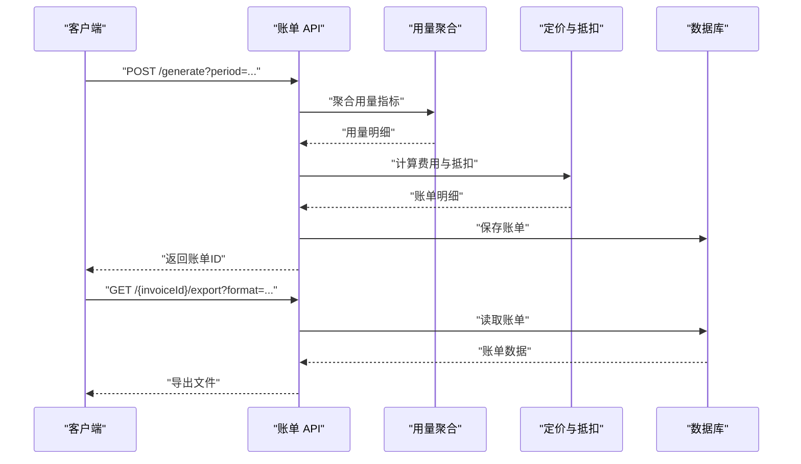
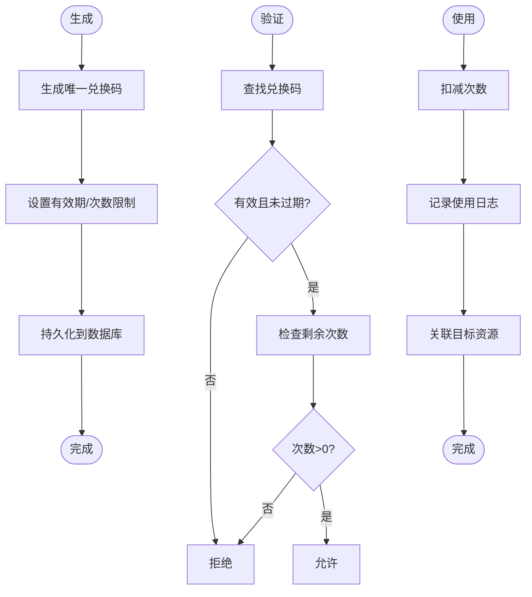
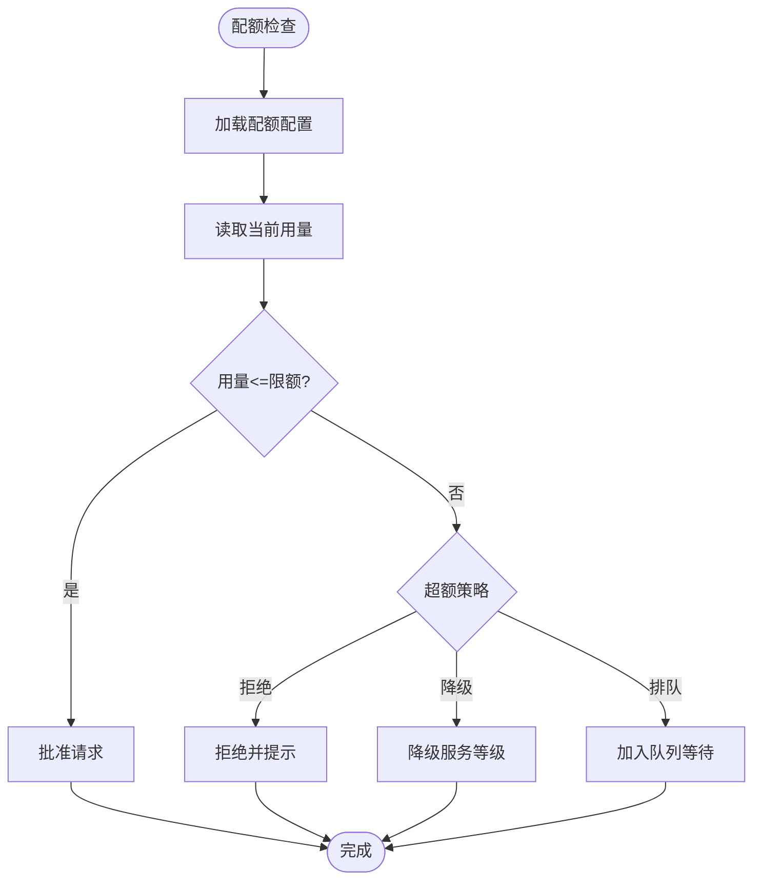
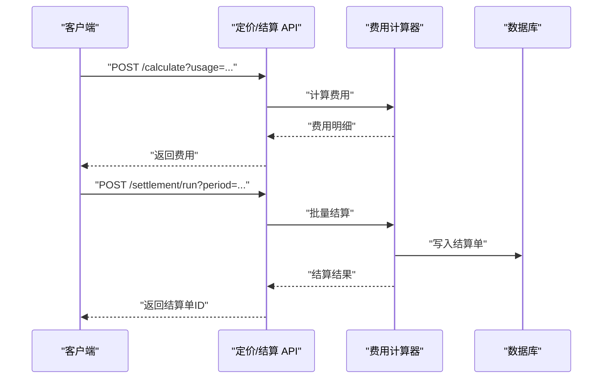
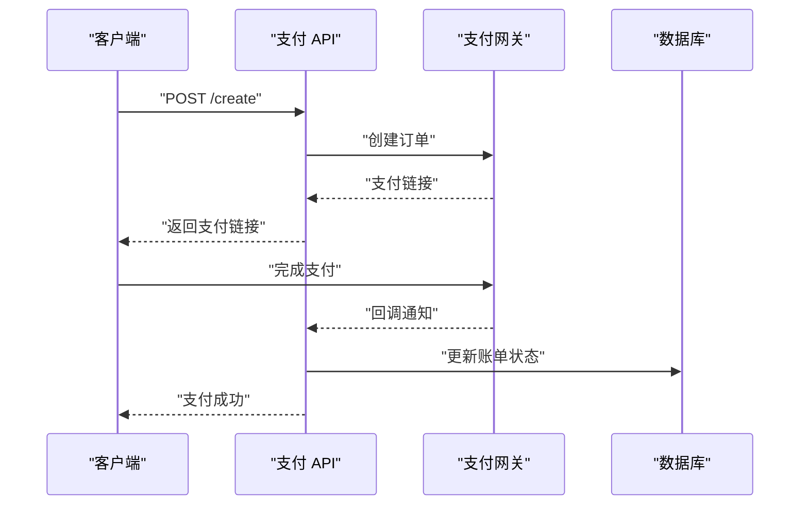
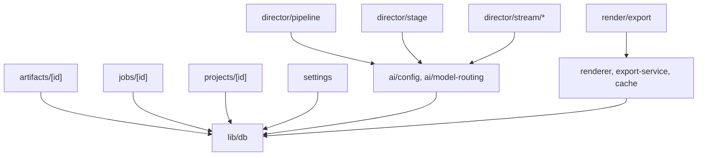

# 计费管理 API

<cite>
**本文引用的文件**   
- [src/app/api/artifacts/[id]/route.ts](file://src/app/api/artifacts/%5Bid%5D/route.ts)
- [src/app/api/director/pipeline/route.ts](file://src/app/api/director/pipeline/route.ts)
- [src/app/api/director/stage/route.ts](file://src/app/api/director/stage/route.ts)
- [src/app/api/director/stream/[nodeId]/route.ts](file://src/app/api/director/stream/%5BnodeId%5D/route.ts)
- [src/app/api/director/stream/project/[projectId]/route.ts](file://src/app/api/director/stream/project/%5BprojectId%5D/route.ts)
- [src/app/api/jobs/[id]/route.ts](file://src/app/api/jobs/%5Bid%5D/route.ts)
- [src/app/api/projects/[id]/route.ts](file://src/app/api/projects/%5Bid%5D/route.ts)
- [src/app/api/render/export/route.ts](file://src/app/api/render/export/route.ts)
- [src/app/api/settings/route.ts](file://src/app/api/settings/route.ts)
- [src/features/ai/config.ts](file://src/features/ai/config.ts)
- [src/features/ai/model-routing.ts](file://src/features/ai/model-routing.ts)
- [src/features/audio/measure.ts](file://src/features/audio/measure.ts)
- [src/features/audio/score.ts](file://src/features/audio/score.ts)
- [src/features/canvas/export-settings.ts](file://src/features/canvas/export-settings.ts)
- [src/features/render/cache.ts](file://src/features/render/cache.ts)
- [src/features/render/export-service.ts](file://src/features/render/export-service.ts)
- [src/features/render/renderer.ts](file://src/features/render/renderer.ts)
- [src/lib/db/index.ts](file://src/lib/db/index.ts)
</cite>

## 目录
1. [简介](#简介)
2. [项目结构](#项目结构)
3. [核心组件](#核心组件)
4. [架构总览](#架构总览)
5. [详细组件分析](#详细组件分析)
6. [依赖分析](#依赖分析)
7. [性能考量](#性能考量)
8. [故障排查指南](#故障排查指南)
9. [结论](#结论)
10. [附录](#附录)

## 简介
本文件为 PurpleInk 计费系统的 API 文档，聚焦用量统计、账单生成与兑换码管理的接口规范。内容涵盖：
- AI 服务使用量的计量方式与计费规则
- 结算流程与配额管理、超额处理、费用计算
- 用量查询、账单导出与支付集成的接口说明
- 兑换码的生成、验证与使用追踪的调用方式

本仓库当前未包含独立的“计费”模块或明确的“兑换码”实现。因此，本文基于现有渲染、AI 路由、音频度量、导出服务等能力，给出可落地的计费 API 设计建议与集成路径，确保在不破坏现有架构的前提下扩展计费功能。

## 项目结构
PurpleInk 采用 Next.js App Router 组织 API 路由，业务逻辑按 feature 划分（如 ai、audio、render、canvas 等），数据库访问集中在 lib/db。计费相关能力主要分布在以下位置：
- API 路由层：用于暴露用量查询、导出、设置等接口
- 特征层：负责具体业务逻辑（AI 模型路由、音频时长度量、渲染导出、缓存策略）
- 数据层：统一数据库访问入口

图表来源
- [src/app/api/artifacts/[id]/route.ts](file://src/app/api/artifacts/%5Bid%5D/route.ts)
- [src/app/api/director/pipeline/route.ts](file://src/app/api/director/pipeline/route.ts)
- [src/app/api/director/stage/route.ts](file://src/app/api/director/stage/route.ts)
- [src/app/api/director/stream/[nodeId]/route.ts](file://src/app/api/director/stream/%5BnodeId%5D/route.ts)
- [src/app/api/director/stream/project/[projectId]/route.ts](file://src/app/api/director/stream/project/%5BprojectId%5D/route.ts)
- [src/app/api/jobs/[id]/route.ts](file://src/app/api/jobs/%5Bid%5D/route.ts)
- [src/app/api/projects/[id]/route.ts](file://src/app/api/projects/%5Bid%5D/route.ts)
- [src/app/api/render/export/route.ts](file://src/app/api/render/export/route.ts)
- [src/app/api/settings/route.ts](file://src/app/api/settings/route.ts)
- [src/features/ai/config.ts](file://src/features/ai/config.ts)
- [src/features/ai/model-routing.ts](file://src/features/ai/model-routing.ts)
- [src/features/audio/measure.ts](file://src/features/audio/measure.ts)
- [src/features/audio/score.ts](file://src/features/audio/score.ts)
- [src/features/canvas/export-settings.ts](file://src/features/canvas/export-settings.ts)
- [src/features/render/cache.ts](file://src/features/render/cache.ts)
- [src/features/render/export-service.ts](file://src/features/render/export-service.ts)
- [src/features/render/renderer.ts](file://src/features/render/renderer.ts)
- [src/lib/db/index.ts](file://src/lib/db/index.ts)

章节来源
- [src/app/api/artifacts/[id]/route.ts](file://src/app/api/artifacts/%5Bid%5D/route.ts)
- [src/app/api/director/pipeline/route.ts](file://src/app/api/director/pipeline/route.ts)
- [src/app/api/director/stage/route.ts](file://src/app/api/director/stage/route.ts)
- [src/app/api/director/stream/[nodeId]/route.ts](file://src/app/api/director/stream/%5BnodeId%5D/route.ts)
- [src/app/api/director/stream/project/[projectId]/route.ts](file://src/app/api/director/stream/project/%5BprojectId%5D/route.ts)
- [src/app/api/jobs/[id]/route.ts](file://src/app/api/jobs/%5Bid%5D/route.ts)
- [src/app/api/projects/[id]/route.ts](file://src/app/api/projects/%5Bid%5D/route.ts)
- [src/app/api/render/export/route.ts](file://src/app/api/render/export/route.ts)
- [src/app/api/settings/route.ts](file://src/app/api/settings/route.ts)
- [src/features/ai/config.ts](file://src/features/ai/config.ts)
- [src/features/ai/model-routing.ts](file://src/features/ai/model-routing.ts)
- [src/features/audio/measure.ts](file://src/features/audio/measure.ts)
- [src/features/audio/score.ts](file://src/features/audio/score.ts)
- [src/features/canvas/export-settings.ts](file://src/features/canvas/export-settings.ts)
- [src/features/render/cache.ts](file://src/features/render/cache.ts)
- [src/features/render/export-service.ts](file://src/features/render/export-service.ts)
- [src/features/render/renderer.ts](file://src/features/render/renderer.ts)
- [src/lib/db/index.ts](file://src/lib/db/index.ts)

## 核心组件
- 用量采集与计量
  - AI 调用量：通过 AI 配置与模型路由记录每次调用的模型、参数规模、耗时与结果大小
  - 音频时长：基于音频度量模块统计时长、帧数与采样率，作为计费单位之一
  - 渲染任务：基于渲染器与导出服务统计任务数量、输出分辨率、编码格式与缓存命中情况
- 计费规则与结算
  - 将上述计量指标映射为计费单位（如“分钟”、“次”、“MB”），结合单价表计算费用
  - 支持配额控制与超额处理（拒绝、降级、等待队列）
- 账单与导出
  - 聚合周期内的用量与费用，生成账单明细与汇总
  - 提供导出接口（CSV/JSON）供对账与审计
- 兑换码管理
  - 生成、验证与使用追踪，绑定用户/项目维度，支持有效期与次数限制

章节来源
- [src/features/ai/config.ts](file://src/features/ai/config.ts)
- [src/features/ai/model-routing.ts](file://src/features/ai/model-routing.ts)
- [src/features/audio/measure.ts](file://src/features/audio/measure.ts)
- [src/features/audio/score.ts](file://src/features/audio/score.ts)
- [src/features/render/renderer.ts](file://src/features/render/renderer.ts)
- [src/features/render/export-service.ts](file://src/features/render/export-service.ts)
- [src/features/render/cache.ts](file://src/features/render/cache.ts)
- [src/features/canvas/export-settings.ts](file://src/features/canvas/export-settings.ts)

## 架构总览
计费系统以“事件驱动 + 指标聚合”的方式接入现有渲染与 AI 管线：
- 在关键操作点埋点（AI 调用、音频处理、渲染导出）
- 将计量指标写入统一存储（数据库）
- 定时任务聚合用量并计算费用，生成账单
- 对外暴露用量查询、账单导出、兑换码管理等 API

图表来源
- [src/app/api/director/pipeline/route.ts](file://src/app/api/director/pipeline/route.ts)
- [src/app/api/director/stage/route.ts](file://src/app/api/director/stage/route.ts)
- [src/app/api/director/stream/[nodeId]/route.ts](file://src/app/api/director/stream/%5BnodeId%5D/route.ts)
- [src/app/api/director/stream/project/[projectId]/route.ts](file://src/app/api/director/stream/project/%5BprojectId%5D/route.ts)
- [src/app/api/render/export/route.ts](file://src/app/api/render/export/route.ts)
- [src/features/ai/config.ts](file://src/features/ai/config.ts)
- [src/features/ai/model-routing.ts](file://src/features/ai/model-routing.ts)
- [src/features/audio/measure.ts](file://src/features/audio/measure.ts)
- [src/features/render/renderer.ts](file://src/features/render/renderer.ts)
- [src/features/render/export-service.ts](file://src/features/render/export-service.ts)
- [src/lib/db/index.ts](file://src/lib/db/index.ts)

## 详细组件分析

### 用量统计 API
- 用途：查询指定时间窗口内各资源的用量（AI 调用次数/时长/大小、音频时长、渲染任务数/输出大小、缓存命中）
- 典型端点建议
  - GET /api/billing/usage?period=...&scope=...
  - GET /api/billing/usage/ai?model=...&project=...
  - GET /api/billing/usage/audio?project=...&duration_range=...
  - GET /api/billing/usage/render?project=...&format=...
- 数据来源
  - AI 调用：从 AI 配置与模型路由中抽取调用元数据
  - 音频时长：从音频度量模块获取时长与帧信息
  - 渲染任务：从渲染器与导出服务获取任务指标与缓存命中
- 计费映射
  - 将指标转换为计费单位（次、分钟、MB），结合单价表计算费用

图表来源
- [src/features/ai/config.ts](file://src/features/ai/config.ts)
- [src/features/ai/model-routing.ts](file://src/features/ai/model-routing.ts)
- [src/features/audio/measure.ts](file://src/features/audio/measure.ts)
- [src/features/render/renderer.ts](file://src/features/render/renderer.ts)
- [src/features/render/export-service.ts](file://src/features/render/export-service.ts)

章节来源
- [src/app/api/jobs/[id]/route.ts](file://src/app/api/jobs/%5Bid%5D/route.ts)
- [src/app/api/projects/[id]/route.ts](file://src/app/api/projects/%5Bid%5D/route.ts)
- [src/features/ai/config.ts](file://src/features/ai/config.ts)
- [src/features/ai/model-routing.ts](file://src/features/ai/model-routing.ts)
- [src/features/audio/measure.ts](file://src/features/audio/measure.ts)
- [src/features/render/renderer.ts](file://src/features/render/renderer.ts)
- [src/features/render/export-service.ts](file://src/features/render/export-service.ts)

### 账单生成与导出 API
- 用途：按周期生成账单明细与汇总，支持导出 CSV/JSON
- 典型端点建议
  - POST /api/billing/invoices/generate?period=...
  - GET /api/billing/invoices/{invoiceId}
  - GET /api/billing/invoices/{invoiceId}/export?format=csv|json
- 数据来源
  - 用量指标聚合结果
  - 单价表与折扣/抵扣（兑换码）
- 处理逻辑
  - 聚合用量 → 计算费用 → 应用抵扣 → 生成账单 → 持久化

图表来源
- [src/app/api/render/export/route.ts](file://src/app/api/render/export/route.ts)
- [src/lib/db/index.ts](file://src/lib/db/index.ts)

章节来源
- [src/app/api/render/export/route.ts](file://src/app/api/render/export/route.ts)
- [src/lib/db/index.ts](file://src/lib/db/index.ts)

### 兑换码管理 API
- 用途：生成、验证与使用追踪兑换码，支持绑定用户/项目、有效期与次数限制
- 典型端点建议
  - POST /api/exchange-codes/generate?owner=...&limit=...&expiry=...
  - POST /api/exchange-codes/verify?code=...
  - POST /api/exchange-codes/use?code=...&target=...
- 处理逻辑
  - 生成：创建唯一码，写入有效期与次数限制
  - 验证：检查有效性、剩余次数、过期状态
  - 使用：扣减次数，记录使用日志，关联目标资源

图表来源
- [src/lib/db/index.ts](file://src/lib/db/index.ts)

章节来源
- [src/lib/db/index.ts](file://src/lib/db/index.ts)

### 配额管理与超额处理
- 用途：控制用户/项目的用量上限，超限后拒绝、降级或进入排队
- 典型端点建议
  - GET /api/quota/check?scope=...&resource=...
  - PUT /api/quota/update?scope=...&limits=...
- 处理逻辑
  - 检查当前用量与限额
  - 若超限：根据策略拒绝/降级/排队
  - 更新配额与通知

图表来源
- [src/lib/db/index.ts](file://src/lib/db/index.ts)

章节来源
- [src/lib/db/index.ts](file://src/lib/db/index.ts)

### 费用计算与结算
- 用途：将用量指标映射为费用，支持折扣与抵扣
- 典型端点建议
  - POST /api/pricing/calculate?usage=...
  - POST /api/settlement/run?period=...
- 处理逻辑
  - 用量归一化 → 单价匹配 → 折扣/抵扣 → 结算单生成

图表来源
- [src/lib/db/index.ts](file://src/lib/db/index.ts)

章节来源
- [src/lib/db/index.ts](file://src/lib/db/index.ts)

### 支付集成
- 用途：对接第三方支付网关，完成支付与回调处理
- 典型端点建议
  - POST /api/payments/create?amount=...&currency=...
  - GET /api/payments/status?orderId=...
  - POST /api/payments/callback
- 处理逻辑
  - 创建订单 → 跳转支付 → 回调确认 → 更新账单状态

图表来源
- [src/lib/db/index.ts](file://src/lib/db/index.ts)

章节来源
- [src/lib/db/index.ts](file://src/lib/db/index.ts)

## 依赖分析
- API 路由层依赖业务特征层进行具体计量与处理
- 业务特征层依赖数据库层进行数据持久化
- 计费引擎与兑换码服务为新增模块，需与现有 API 路由层集成

图表来源
- [src/app/api/artifacts/[id]/route.ts](file://src/app/api/artifacts/%5Bid%5D/route.ts)
- [src/app/api/director/pipeline/route.ts](file://src/app/api/director/pipeline/route.ts)
- [src/app/api/director/stage/route.ts](file://src/app/api/director/stage/route.ts)
- [src/app/api/director/stream/[nodeId]/route.ts](file://src/app/api/director/stream/%5BnodeId%5D/route.ts)
- [src/app/api/director/stream/project/[projectId]/route.ts](file://src/app/api/director/stream/project/%5BprojectId%5D/route.ts)
- [src/app/api/jobs/[id]/route.ts](file://src/app/api/jobs/%5Bid%5D/route.ts)
- [src/app/api/projects/[id]/route.ts](file://src/app/api/projects/%5Bid%5D/route.ts)
- [src/app/api/render/export/route.ts](file://src/app/api/render/export/route.ts)
- [src/app/api/settings/route.ts](file://src/app/api/settings/route.ts)
- [src/features/ai/config.ts](file://src/features/ai/config.ts)
- [src/features/ai/model-routing.ts](file://src/features/ai/model-routing.ts)
- [src/features/render/renderer.ts](file://src/features/render/renderer.ts)
- [src/features/render/export-service.ts](file://src/features/render/export-service.ts)
- [src/features/render/cache.ts](file://src/features/render/cache.ts)
- [src/lib/db/index.ts](file://src/lib/db/index.ts)

章节来源
- [src/app/api/artifacts/[id]/route.ts](file://src/app/api/artifacts/%5Bid%5D/route.ts)
- [src/app/api/director/pipeline/route.ts](file://src/app/api/director/pipeline/route.ts)
- [src/app/api/director/stage/route.ts](file://src/app/api/director/stage/route.ts)
- [src/app/api/director/stream/[nodeId]/route.ts](file://src/app/api/director/stream/%5BnodeId%5D/route.ts)
- [src/app/api/director/stream/project/[projectId]/route.ts](file://src/app/api/director/stream/project/%5BprojectId%5D/route.ts)
- [src/app/api/jobs/[id]/route.ts](file://src/app/api/jobs/%5Bid%5D/route.ts)
- [src/app/api/projects/[id]/route.ts](file://src/app/api/projects/%5Bid%5D/route.ts)
- [src/app/api/render/export/route.ts](file://src/app/api/render/export/route.ts)
- [src/app/api/settings/route.ts](file://src/app/api/settings/route.ts)
- [src/features/ai/config.ts](file://src/features/ai/config.ts)
- [src/features/ai/model-routing.ts](file://src/features/ai/model-routing.ts)
- [src/features/render/renderer.ts](file://src/features/render/renderer.ts)
- [src/features/render/export-service.ts](file://src/features/render/export-service.ts)
- [src/features/render/cache.ts](file://src/features/render/cache.ts)
- [src/lib/db/index.ts](file://src/lib/db/index.ts)

## 性能考量
- 用量采集应异步化，避免阻塞主流程
- 高频指标建议使用内存缓存与批写数据库
- 账单导出采用流式处理，减少内存占用
- 兑换码验证与使用需加锁防止并发重复使用

## 故障排查指南
- 用量不一致：检查埋点是否完整、指标归一化是否正确
- 账单错误：核对单价表、折扣与抵扣逻辑
- 兑换码失效：检查有效期、次数限制与使用日志
- 支付回调失败：核对签名验证与幂等处理

## 结论
PurpleInk 当前未内置独立计费模块，但具备完善的用量采集基础（AI 调用、音频度量、渲染导出）。通过在关键节点埋点并引入计费引擎与兑换码服务，即可构建完整的计费系统。建议优先实现用量统计与账单导出，再逐步扩展配额管理、超额处理与支付集成。

## 附录
- 术语定义
  - 用量指标：AI 调用次数/时长/大小、音频时长/帧数、渲染任务数/输出大小/缓存命中
  - 计费单位：次、分钟、MB
  - 配额：用户/项目维度的用量上限
  - 兑换码：用于抵扣费用的凭证，支持有效期与次数限制
- 最佳实践
  - 指标采集与业务逻辑解耦
  - 计费规则可配置化
  - 兑换码安全生成与防重放
  - 支付回调幂等与对账