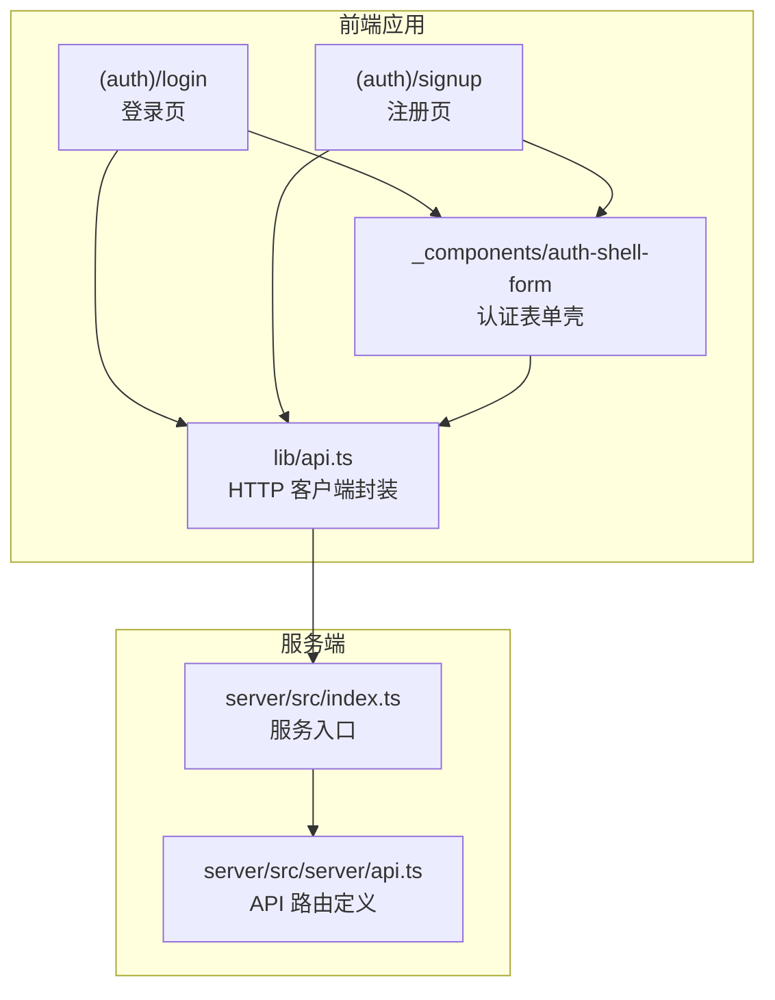
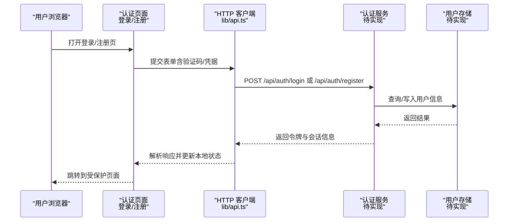
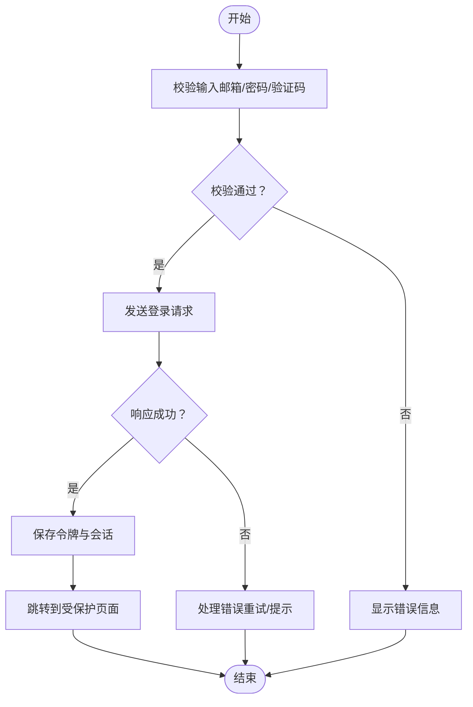
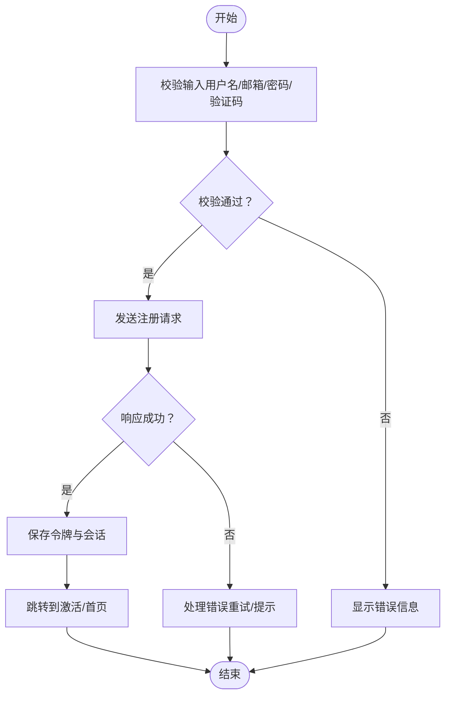
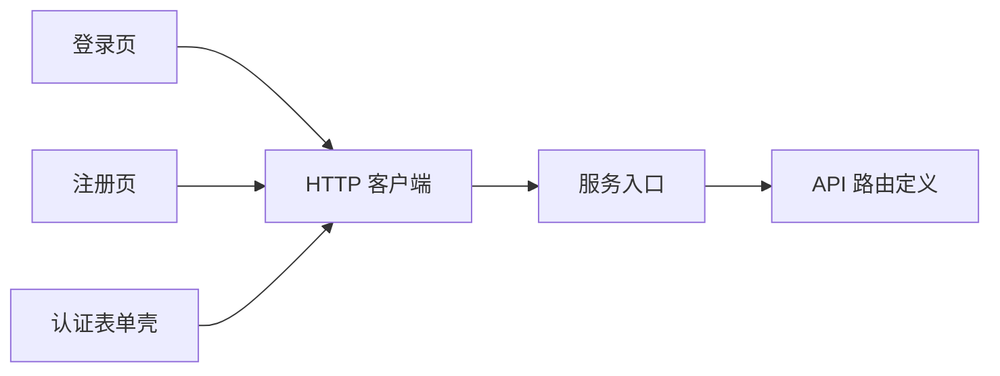

# 认证 API

<cite>
**本文引用的文件**   
- [src/app/(auth)/login/page.tsx](file://src/app/(auth)/login/page.tsx)
- [src/app/(auth)/signup/page.tsx](file://src/app/(auth)/signup/page.tsx)
- [src/app/(auth)/_components/auth-shell-form.tsx](file://src/app/(auth)/_components/auth-shell-form.tsx)
- [src/app/api/ping/route.ts](file://src/app/api/ping/route.ts)
- [src/lib/api.ts](file://src/lib/api.ts)
- [server/src/index.ts](file://server/src/index.ts)
- [server/src/server/api.ts](file://server/src/server/api.ts)
- [deploy/env.example](file://deploy/env.example)
- [config/tts.env.example](file://config/tts.env.example)
</cite>

## 目录
1. [简介](#简介)
2. [项目结构](#项目结构)
3. [核心组件](#核心组件)
4. [架构总览](#架构总览)
5. [详细组件分析](#详细组件分析)
6. [依赖关系分析](#依赖关系分析)
7. [性能考虑](#性能考虑)
8. [故障排查指南](#故障排查指南)
9. [结论](#结论)
10. [附录](#附录)

## 简介
本文件为 PurpleInk 认证系统的 API 文档，聚焦用户注册、登录、登出与密码重置等认证相关能力。当前仓库中未包含服务端认证路由实现，因此本文基于前端页面与通用工具模块进行说明，并给出建议的接口设计、安全最佳实践与部署配置要点。若后续引入认证后端（如 NextAuth、Supabase、自建服务），可据此扩展具体端点与数据契约。

## 项目结构
认证相关的前端代码主要位于：
- (auth) 路由组：登录/注册页面与共享表单壳
- lib/api：通用 HTTP 客户端封装
- server：独立的服务端入口与 API 定义（当前未包含认证路由）
- deploy/config：环境变量示例（用于启用或关闭外部服务）

图表来源 
- [src/app/(auth)/login/page.tsx](file://src/app/(auth)/login/page.tsx)
- [src/app/(auth)/signup/page.tsx](file://src/app/(auth)/signup/page.tsx)
- [src/app/(auth)/_components/auth-shell-form.tsx](file://src/app/(auth)/_components/auth-shell-form.tsx)
- [src/lib/api.ts](file://src/lib/api.ts)
- [server/src/index.ts](file://server/src/index.ts)
- [server/src/server/api.ts](file://server/src/server/api.ts)

章节来源
- [src/app/(auth)/login/page.tsx](file://src/app/(auth)/login/page.tsx)
- [src/app/(auth)/signup/page.tsx](file://src/app/(auth)/signup/page.tsx)
- [src/app/(auth)/_components/auth-shell-form.tsx](file://src/app/(auth)/_components/auth-shell-form.tsx)
- [src/lib/api.ts](file://src/lib/api.ts)
- [server/src/index.ts](file://server/src/index.ts)
- [server/src/server/api.ts](file://server/src/server/api.ts)

## 核心组件
- 认证表单壳（auth-shell-form）
  - 职责：统一渲染登录/注册表单，处理输入校验、提交状态、错误提示与跳转逻辑
  - 交互：根据页面模式切换“登录”或“注册”，调用通用 HTTP 客户端发送请求
- 登录页（login）
  - 职责：承载登录表单，展示验证码（可选）、错误信息与成功回调
- 注册页（signup）
  - 职责：承载注册表单，收集用户名/邮箱/密码等字段，提交后引导用户进入下一步流程
- 通用 HTTP 客户端（lib/api.ts）
  - 职责：封装请求头、基础 URL、错误处理、重试策略与令牌注入（如有）

章节来源
- [src/app/(auth)/_components/auth-shell-form.tsx](file://src/app/(auth)/_components/auth-shell-form.tsx)
- [src/app/(auth)/login/page.tsx](file://src/app/(auth)/login/page.tsx)
- [src/app/(auth)/signup/page.tsx](file://src/app/(auth)/signup/page.tsx)
- [src/lib/api.ts](file://src/lib/api.ts)

## 架构总览
当前认证流程由前端页面驱动，通过通用 HTTP 客户端与服务端通信。由于服务端尚未暴露认证路由，以下为概念性架构图，便于后续接入认证后端时对照实施。

图表来源 
- [src/app/(auth)/login/page.tsx](file://src/app/(auth)/login/page.tsx)
- [src/app/(auth)/signup/page.tsx](file://src/app/(auth)/signup/page.tsx)
- [src/app/(auth)/_components/auth-shell-form.tsx](file://src/app/(auth)/_components/auth-shell-form.tsx)
- [src/lib/api.ts](file://src/lib/api.ts)

## 详细组件分析

### 登录流程
- 触发点：用户在登录页提交表单
- 关键步骤：
  - 表单校验（邮箱/手机号、密码、验证码）
  - 通过 HTTP 客户端发起登录请求
  - 服务端验证凭据并签发 JWT
  - 客户端保存令牌与会话，重定向至目标页面
- 错误处理：网络异常、参数校验失败、凭据错误、验证码失效、账户锁定等

图表来源 
- [src/app/(auth)/login/page.tsx](file://src/app/(auth)/login/page.tsx)
- [src/app/(auth)/_components/auth-shell-form.tsx](file://src/app/(auth)/_components/auth-shell-form.tsx)
- [src/lib/api.ts](file://src/lib/api.ts)

章节来源
- [src/app/(auth)/login/page.tsx](file://src/app/(auth)/login/page.tsx)
- [src/app/(auth)/_components/auth-shell-form.tsx](file://src/app/(auth)/_components/auth-shell-form.tsx)
- [src/lib/api.ts](file://src/lib/api.ts)

### 注册流程
- 触发点：用户在注册页提交表单
- 关键步骤：
  - 表单校验（用户名/邮箱/密码强度、验证码）
  - 通过 HTTP 客户端发起注册请求
  - 服务端创建用户并返回初始令牌或激活链接
  - 客户端保存令牌并跳转至仪表盘或激活确认页
- 错误处理：重复账号、邮箱格式错误、验证码无效、服务不可用等

图表来源 
- [src/app/(auth)/signup/page.tsx](file://src/app/(auth)/signup/page.tsx)
- [src/app/(auth)/_components/auth-shell-form.tsx](file://src/app/(auth)/_components/auth-shell-form.tsx)
- [src/lib/api.ts](file://src/lib/api.ts)

章节来源
- [src/app/(auth)/signup/page.tsx](file://src/app/(auth)/signup/page.tsx)
- [src/app/(auth)/_components/auth-shell-form.tsx](file://src/app/(auth)/_components/auth-shell-form.tsx)
- [src/lib/api.ts](file://src/lib/api.ts)

### 验证码验证（建议）
- 目的：防止自动化滥用与暴力破解
- 建议流程：
  - 获取验证码图片/文本或行为式验证码
  - 提交表单时附带验证码标识与答案
  - 服务端校验验证码有效性及过期时间
- 错误处理：验证码缺失、过期、不匹配、频率限制

章节来源
- [src/app/(auth)/login/page.tsx](file://src/app/(auth)/login/page.tsx)
- [src/app/(auth)/signup/page.tsx](file://src/app/(auth)/signup/page.tsx)
- [src/app/(auth)/_components/auth-shell-form.tsx](file://src/app/(auth)/_components/auth-shell-form.tsx)

### 会话管理与 JWT（建议）
- 令牌类型：JWT（Access Token），可选 Refresh Token
- 存储位置：HttpOnly Cookie（推荐）或内存/LocalStorage（谨慎使用）
- 刷新机制：Access Token 过期自动刷新；Refresh Token 定期轮换
- 安全要点：
  - 设置 SameSite、Secure、HttpOnly
  - 最小化权限与最短有效期
  - 防 CSRF/XSS 措施

章节来源
- [src/lib/api.ts](file://src/lib/api.ts)

### 登出（建议）
- 操作：清除本地令牌与会话，通知服务端销毁会话
- 响应：清空 Cookie、重定向到登录页或首页

章节来源
- [src/app/(auth)/_components/auth-shell-form.tsx](file://src/app/(auth)/_components/auth-shell-form.tsx)
- [src/lib/api.ts](file://src/lib/api.ts)

### 密码重置（建议）
- 流程：
  - 提交邮箱以获取重置链接或验证码
  - 验证重置令牌/验证码
  - 设置新密码并提示成功
- 安全要点：令牌一次性、短有效期、限频

章节来源
- [src/app/(auth)/login/page.tsx](file://src/app/(auth)/login/page.tsx)
- [src/app/(auth)/_components/auth-shell-form.tsx](file://src/app/(auth)/_components/auth-shell-form.tsx)
- [src/lib/api.ts](file://src/lib/api.ts)

## 依赖关系分析
- 前端认证页面依赖通用 HTTP 客户端
- 服务端入口与 API 路由定义目前未包含认证端点
- 环境变量示例用于配置外部服务（如 TTS），认证相关变量可参考部署配置

图表来源 
- [src/app/(auth)/login/page.tsx](file://src/app/(auth)/login/page.tsx)
- [src/app/(auth)/signup/page.tsx](file://src/app/(auth)/signup/page.tsx)
- [src/app/(auth)/_components/auth-shell-form.tsx](file://src/app/(auth)/_components/auth-shell-form.tsx)
- [src/lib/api.ts](file://src/lib/api.ts)
- [server/src/index.ts](file://server/src/index.ts)
- [server/src/server/api.ts](file://server/src/server/api.ts)

章节来源
- [src/lib/api.ts](file://src/lib/api.ts)
- [server/src/index.ts](file://server/src/index.ts)
- [server/src/server/api.ts](file://server/src/server/api.ts)

## 性能考虑
- 减少不必要的请求：合并表单校验与提交，避免重复网络往返
- 缓存策略：对非敏感数据使用短期缓存；令牌刷新尽量后台静默完成
- 并发控制：限制同时进行的认证请求数量，避免雪崩
- 降级与超时：设置合理的超时与重试上限，提升用户体验

[本节为通用指导，无需特定文件引用]

## 故障排查指南
- 常见问题：
  - 网络错误：检查基础 URL、跨域配置、代理设置
  - 参数校验失败：核对必填字段、格式与长度限制
  - 验证码问题：确认验证码是否过期、是否被复用
  - 令牌无效：检查存储位置、有效期、刷新流程
- 调试建议：
  - 开启日志记录（请求/响应、错误堆栈）
  - 使用浏览器开发者工具查看网络面板
  - 在服务端增加详细错误码与消息

章节来源
- [src/lib/api.ts](file://src/lib/api.ts)
- [server/src/index.ts](file://server/src/index.ts)
- [server/src/server/api.ts](file://server/src/server/api.ts)

## 结论
当前仓库未包含认证服务端实现，前端已具备登录/注册页面与通用 HTTP 客户端。建议在服务端补充认证路由，遵循本文的建议接口设计与安全实践，确保验证码、会话管理、JWT 令牌与速率限制等能力完善落地。

[本节为总结，无需特定文件引用]

## 附录

### 建议的认证端点清单（概念性）
- 注册
  - 方法：POST
  - URL：/api/auth/register
  - 请求体：用户名、邮箱、密码、验证码
  - 响应：用户基本信息、访问令牌、刷新令牌（可选）
- 登录
  - 方法：POST
  - URL：/api/auth/login
  - 请求体：邮箱/手机号、密码、验证码
  - 响应：访问令牌、刷新令牌（可选）、用户信息
- 登出
  - 方法：POST
  - URL：/api/auth/logout
  - 请求体：无或令牌
  - 响应：成功状态
- 密码重置
  - 方法：POST
  - URL：/api/auth/password-reset/request
  - 请求体：邮箱
  - 响应：发送成功状态
  - 方法：POST
  - URL：/api/auth/password-reset/confirm
  - 请求体：重置令牌、新密码
  - 响应：成功状态

[本节为概念性内容，无需特定文件引用]

### 安全最佳实践
- 传输安全：强制 HTTPS，启用 HSTS
- 密码安全：服务端哈希存储（bcrypt/argon2），禁止明文
- 令牌安全：短有效期、HttpOnly Cookie、SameSite、Secure
- 验证码：图形/行为式验证码，防重放与限频
- 速率限制：按 IP/用户维度限制登录/注册/重置频率
- 防暴力破解：账户锁定、验证码挑战、设备指纹

[本节为通用指导，无需特定文件引用]

### 环境变量与部署要点
- 认证相关变量（建议）：
  - JWT_SECRET：签名密钥
  - JWT_EXPIRES_IN：访问令牌有效期
  - REFRESH_TOKEN_SECRET：刷新令牌密钥
  - RATE_LIMIT_WINDOW：速率限制窗口
  - RATE_LIMIT_MAX：最大请求数
- 现有环境变量示例：
  - deploy/env.example：部署环境示例
  - config/tts.env.example：TTS 服务配置示例

章节来源
- [deploy/env.example](file://deploy/env.example)
- [config/tts.env.example](file://config/tts.env.example)