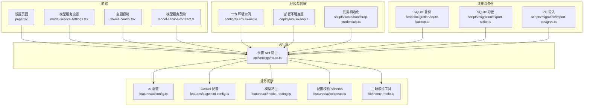
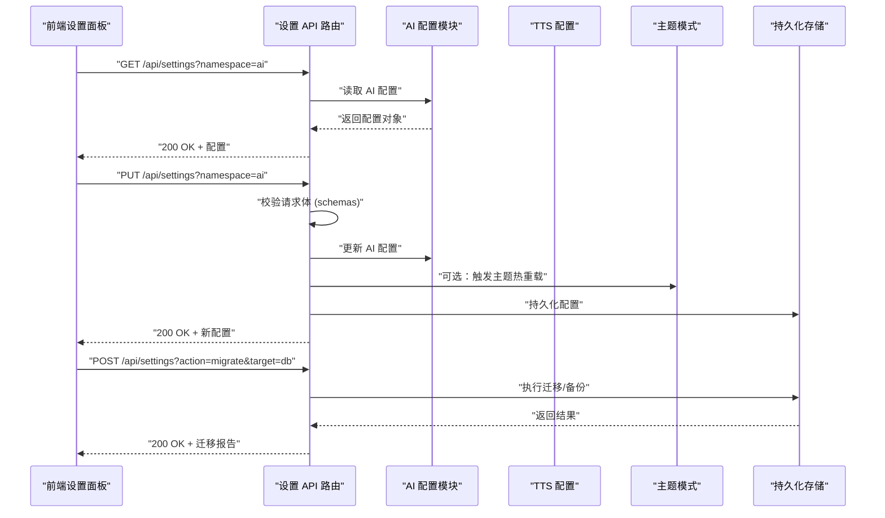
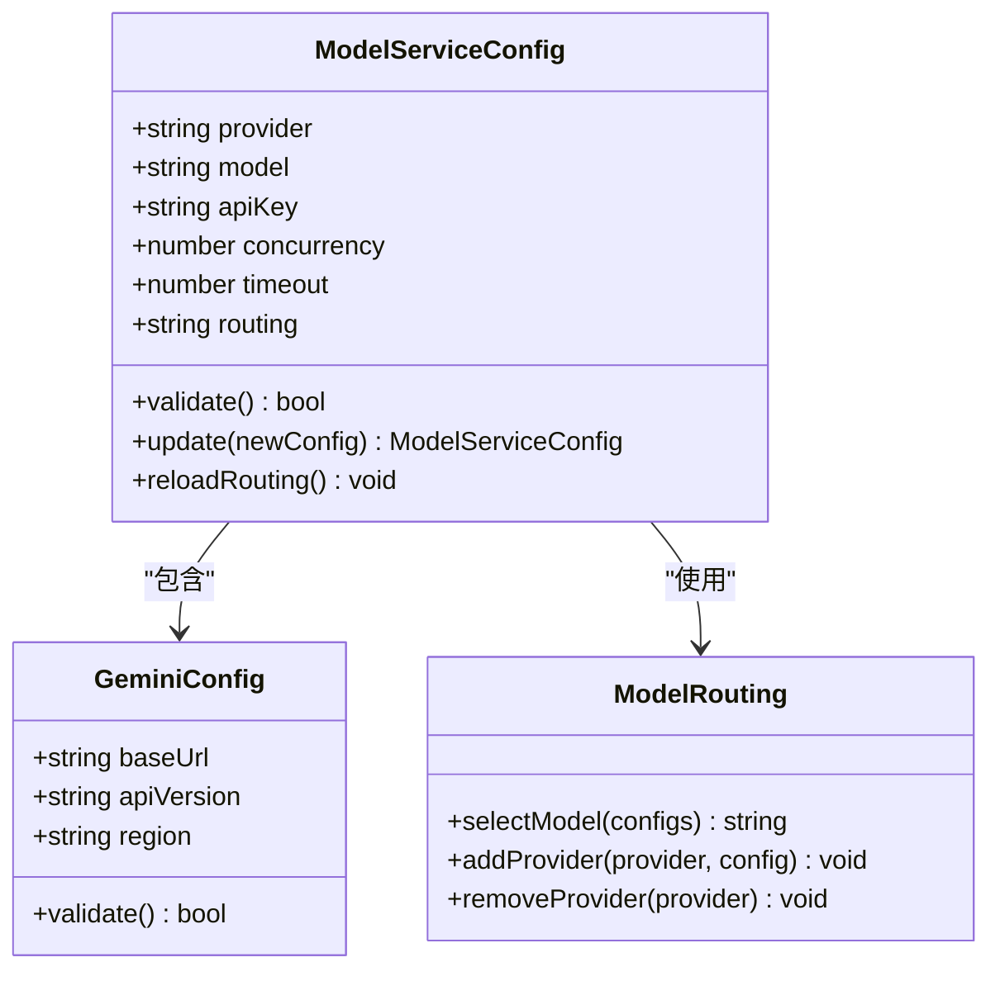
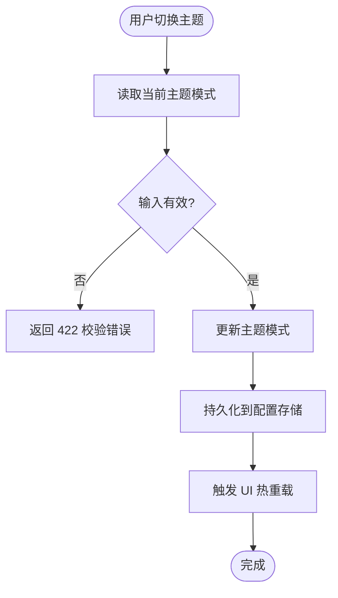
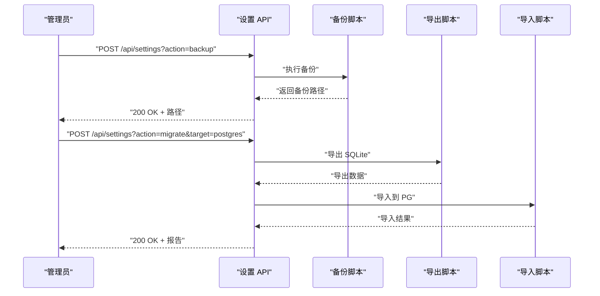
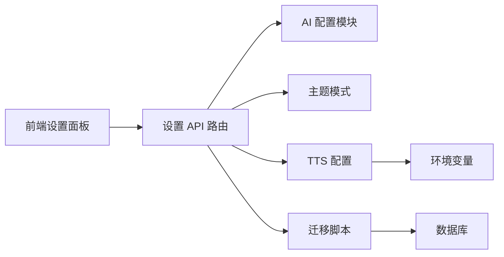

# 设置管理 API

<cite>
**本文引用的文件**   
- [src/app/api/settings/route.ts](file://src/app/api/settings/route.ts)
- [src/app/products/(app)/settings/page.tsx](file://src/app/products/(app)/settings/page.tsx)
- [src/app/products/(app)/settings/model-service-settings.tsx](file://src/app/products/(app)/settings/model-service-settings.tsx)
- [src/app/products/(app)/settings/model-service-contract.ts](file://src/app/products/(app)/settings/model-service-contract.ts)
- [src/app/products/(app)/settings/theme-control.tsx](file://src/app/products/(app)/settings/theme-control.tsx)
- [src/lib/theme-mode.ts](file://src/lib/theme-mode.ts)
- [src/features/ai/config.ts](file://src/features/ai/config.ts)
- [src/features/ai/gemini-config.ts](file://src/features/ai/gemini-config.ts)
- [src/features/ai/model-routing.ts](file://src/features/ai/model-routing.ts)
- [src/features/ai/schemas.ts](file://src/features/ai/schemas.ts)
- [config/tts.env.example](file://config/tts.env.example)
- [deploy/env.example](file://deploy/env.example)
- [scripts/migration/sqlite-backup.ts](file://scripts/migration/sqlite-backup.ts)
- [scripts/migration/export-sqlite.ts](file://scripts/migration/export-sqlite.ts)
- [scripts/migration/import-postgres.ts](file://scripts/migration/import-postgres.ts)
- [scripts/setup/bootstrap-credentials.ts](file://scripts/setup/bootstrap-credentials.ts)
- [tests/tts-config.test.ts](file://tests/tts-config.test.ts)
- [tests/deployment-config.test.mjs](file://tests/deployment-config.test.mjs)
</cite>

## 目录
1. [简介](#简介)
2. [项目结构](#项目结构)
3. [核心组件](#核心组件)
4. [架构总览](#架构总览)
5. [详细组件分析](#详细组件分析)
6. [依赖分析](#依赖分析)
7. [性能考虑](#性能考虑)
8. [故障排查指南](#故障排查指南)
9. [结论](#结论)
10. [附录](#附录)

## 简介
本文件为 PurpleInk 的设置管理系统提供完整的 API 文档，覆盖应用配置、用户偏好与服务设置的接口规范。重点包括：
- AI 模型配置（提供商、路由、密钥与参数）
- TTS 服务配置与环境变量
- 第三方集成凭据管理
- 主题与界面定制（深色/浅色模式、主题色等）
- 功能开关与运行时并发控制
- 配置验证、默认值管理与热重载策略
- 配置备份、恢复与迁移支持

本说明面向开发者与运维人员，既提供高层概览，也给出代码级映射与调用流程，便于快速集成与维护。

## 项目结构
设置相关能力分布在以下位置：
- Next.js API 路由：用于读写设置与触发迁移/备份操作
- 产品页设置面板：前端 UI 与表单校验、状态同步
- AI 配置模块：模型选择、路由策略、提供商配置与校验
- TTS 配置与环境示例：环境变量模板与测试用例
- 部署与环境：全局环境变量与凭据初始化脚本
- 迁移脚本：SQLite/PostgreSQL 数据导出导入与备份

图表来源
- [src/app/api/settings/route.ts](file://src/app/api/settings/route.ts)
- [src/app/products/(app)/settings/page.tsx](file://src/app/products/(app)/settings/page.tsx)
- [src/app/products/(app)/settings/model-service-settings.tsx](file://src/app/products/(app)/settings/model-service-settings.tsx)
- [src/app/products/(app)/settings/model-service-contract.ts](file://src/app/products/(app)/settings/model-service-contract.ts)
- [src/app/products/(app)/settings/theme-control.tsx](file://src/app/products/(app)/settings/theme-control.tsx)
- [src/lib/theme-mode.ts](file://src/lib/theme-mode.ts)
- [src/features/ai/config.ts](file://src/features/ai/config.ts)
- [src/features/ai/gemini-config.ts](file://src/features/ai/gemini-config.ts)
- [src/features/ai/model-routing.ts](file://src/features/ai/model-routing.ts)
- [src/features/ai/schemas.ts](file://src/features/ai/schemas.ts)
- [config/tts.env.example](file://config/tts.env.example)
- [deploy/env.example](file://deploy/env.example)
- [scripts/migration/sqlite-backup.ts](file://scripts/migration/sqlite-backup.ts)
- [scripts/migration/export-sqlite.ts](file://scripts/migration/export-sqlite.ts)
- [scripts/migration/import-postgres.ts](file://scripts/migration/import-postgres.ts)
- [scripts/setup/bootstrap-credentials.ts](file://scripts/setup/bootstrap-credentials.ts)

章节来源
- [src/app/api/settings/route.ts](file://src/app/api/settings/route.ts)
- [src/app/products/(app)/settings/page.tsx](file://src/app/products/(app)/settings/page.tsx)

## 核心组件
- 设置 API 路由：统一入口，处理 GET/POST/PUT/DELETE 请求，负责读取、写入、校验与返回设置；支持按命名空间分组（如 ai、tts、ui、integrations）。
- 模型服务设置面板：前端表单与校验，提交到设置 API，包含提供商选择、模型名称、并发、超时等字段。
- 主题控制：切换深色/浅色模式，持久化到本地存储或后端配置。
- AI 配置模块：集中管理模型路由、提供商配置与校验规则。
- TTS 配置与环境：通过环境变量注入 TTS 服务连接信息，配合测试用例确保可用性。
- 迁移与备份：提供 SQLite/PostgreSQL 的导出导入与备份脚本，供运维在升级或迁移时调用。

章节来源
- [src/app/api/settings/route.ts](file://src/app/api/settings/route.ts)
- [src/app/products/(app)/settings/model-service-settings.tsx](file://src/app/products/(app)/settings/model-service-settings.tsx)
- [src/app/products/(app)/settings/theme-control.tsx](file://src/app/products/(app)/settings/theme-control.tsx)
- [src/features/ai/config.ts](file://src/features/ai/config.ts)
- [src/features/ai/gemini-config.ts](file://src/features/ai/gemini-config.ts)
- [src/features/ai/model-routing.ts](file://src/features/ai/model-routing.ts)
- [src/features/ai/schemas.ts](file://src/features/ai/schemas.ts)
- [config/tts.env.example](file://config/tts.env.example)
- [scripts/migration/sqlite-backup.ts](file://scripts/migration/sqlite-backup.ts)
- [scripts/migration/export-sqlite.ts](file://scripts/migration/export-sqlite.ts)
- [scripts/migration/import-postgres.ts](file://scripts/migration/import-postgres.ts)

## 架构总览
设置管理的整体流程如下：
- 前端通过设置页面与子面板发起请求
- API 路由接收并校验请求体，调用 AI/TTS/主题等模块进行配置读写
- 配置变更可触发热重载（如重新加载模型路由或刷新主题）
- 迁移与备份由独立脚本提供，可通过 API 触发或命令行执行

图表来源
- [src/app/api/settings/route.ts](file://src/app/api/settings/route.ts)
- [src/features/ai/config.ts](file://src/features/ai/config.ts)
- [src/features/ai/schemas.ts](file://src/features/ai/schemas.ts)
- [src/lib/theme-mode.ts](file://src/lib/theme-mode.ts)
- [scripts/migration/sqlite-backup.ts](file://scripts/migration/sqlite-backup.ts)

## 详细组件分析

### 设置 API 路由（/api/settings）
- 方法
  - GET：按命名空间获取配置（ai、tts、ui、integrations）
  - PUT：按命名空间更新配置，支持增量更新与全量替换
  - POST：执行动作（如 migrate、backup、restore、reload）
  - DELETE：删除指定键或命名空间下的配置项
- 查询参数
  - namespace：配置命名空间（必填）
  - action：动作标识（POST 时使用）
  - key：具体配置键（可选）
- 响应
  - 成功：200，返回当前配置或动作执行结果
  - 失败：400/422（校验错误）、500（内部错误）

章节来源
- [src/app/api/settings/route.ts](file://src/app/api/settings/route.ts)

### 模型服务设置（AI 配置）
- 字段
  - provider：提供商（如 gemini、stepfun）
  - model：模型名称
  - apiKey：密钥（加密存储）
  - concurrency：并发数
  - timeout：超时时间（毫秒）
  - routing：路由策略（round-robin、weighted、failover）
- 校验
  - 使用 schemas 定义必填字段、类型与范围
  - 对敏感字段进行脱敏输出
- 热重载
  - 更新后重新加载模型路由与提供商客户端

图表来源
- [src/features/ai/config.ts](file://src/features/ai/config.ts)
- [src/features/ai/gemini-config.ts](file://src/features/ai/gemini-config.ts)
- [src/features/ai/model-routing.ts](file://src/features/ai/model-routing.ts)
- [src/features/ai/schemas.ts](file://src/features/ai/schemas.ts)

章节来源
- [src/app/products/(app)/settings/model-service-settings.tsx](file://src/app/products/(app)/settings/model-service-settings.tsx)
- [src/app/products/(app)/settings/model-service-contract.ts](file://src/app/products/(app)/settings/model-service-contract.ts)
- [src/features/ai/config.ts](file://src/features/ai/config.ts)
- [src/features/ai/gemini-config.ts](file://src/features/ai/gemini-config.ts)
- [src/features/ai/model-routing.ts](file://src/features/ai/model-routing.ts)
- [src/features/ai/schemas.ts](file://src/features/ai/schemas.ts)

### 主题与界面定制
- 主题模式
  - 支持 dark/light/system 三种模式
  - 通过 theme-mode 工具类读取与设置
- 主题色与样式
  - 可在 ui 命名空间中保存主题色、字体大小、布局偏好
- 热重载
  - 修改后立即生效，无需刷新页面

图表来源
- [src/app/products/(app)/settings/theme-control.tsx](file://src/app/products/(app)/settings/theme-control.tsx)
- [src/lib/theme-mode.ts](file://src/lib/theme-mode.ts)

章节来源
- [src/app/products/(app)/settings/theme-control.tsx](file://src/app/products/(app)/settings/theme-control.tsx)
- [src/lib/theme-mode.ts](file://src/lib/theme-mode.ts)

### TTS 服务配置
- 环境变量
  - 参考 tts.env.example 与 deploy/env.example
  - 包含服务地址、认证令牌、音频格式等
- 配置校验
  - 通过 tests/tts-config.test.ts 验证必填字段与连通性
- 运行时行为
  - 根据配置选择 TTS 提供商与语音参数

章节来源
- [config/tts.env.example](file://config/tts.env.example)
- [deploy/env.example](file://deploy/env.example)
- [tests/tts-config.test.ts](file://tests/tts-config.test.ts)

### 凭据与第三方集成
- 凭据初始化
  - 使用 bootstrap-credentials.ts 初始化默认凭据
- 集成配置
  - 在 integrations 命名空间下管理第三方服务的连接信息与开关

章节来源
- [scripts/setup/bootstrap-credentials.ts](file://scripts/setup/bootstrap-credentials.ts)

### 配置备份、恢复与迁移
- 备份
  - sqlite-backup.ts 生成 SQLite 快照
- 导出/导入
  - export-sqlite.ts 导出为结构化数据
  - import-postgres.ts 导入到 PostgreSQL
- API 触发
  - 通过 POST /api/settings?action=migrate 或 backup/restore 触发

图表来源
- [scripts/migration/sqlite-backup.ts](file://scripts/migration/sqlite-backup.ts)
- [scripts/migration/export-sqlite.ts](file://scripts/migration/export-sqlite.ts)
- [scripts/migration/import-postgres.ts](file://scripts/migration/import-postgres.ts)

章节来源
- [scripts/migration/sqlite-backup.ts](file://scripts/migration/sqlite-backup.ts)
- [scripts/migration/export-sqlite.ts](file://scripts/migration/export-sqlite.ts)
- [scripts/migration/import-postgres.ts](file://scripts/migration/import-postgres.ts)

## 依赖分析
- 前端依赖
  - 设置页面与子面板依赖 API 路由与模型服务契约
- 后端依赖
  - API 路由依赖 AI 配置、主题模式、迁移脚本与环境变量
- 外部依赖
  - TTS 服务、AI 提供商、数据库（SQLite/PostgreSQL）

图表来源
- [src/app/api/settings/route.ts](file://src/app/api/settings/route.ts)
- [src/features/ai/config.ts](file://src/features/ai/config.ts)
- [src/lib/theme-mode.ts](file://src/lib/theme-mode.ts)
- [config/tts.env.example](file://config/tts.env.example)
- [scripts/migration/sqlite-backup.ts](file://scripts/migration/sqlite-backup.ts)

章节来源
- [src/app/api/settings/route.ts](file://src/app/api/settings/route.ts)
- [src/features/ai/config.ts](file://src/features/ai/config.ts)
- [src/lib/theme-mode.ts](file://src/lib/theme-mode.ts)
- [config/tts.env.example](file://config/tts.env.example)
- [scripts/migration/sqlite-backup.ts](file://scripts/migration/sqlite-backup.ts)

## 性能考虑
- 配置读取缓存：对频繁读取的配置（如主题、模型路由）进行内存缓存，减少 I/O
- 批量更新：支持批量 PUT 以减少网络往返
- 异步迁移：迁移任务应异步执行，避免阻塞请求
- 限流与重试：对第三方 API 调用增加重试与退避策略

## 故障排查指南
- 常见错误
  - 422 校验失败：检查字段类型、必填项与取值范围
  - 500 内部错误：查看日志与依赖服务状态
- 调试步骤
  - 使用浏览器开发者工具查看请求与响应
  - 检查环境变量是否完整
  - 运行测试用例验证配置有效性

章节来源
- [tests/deployment-config.test.mjs](file://tests/deployment-config.test.mjs)
- [tests/tts-config.test.ts](file://tests/tts-config.test.ts)

## 结论
PurpleInk 的设置管理系统以统一的 API 路由为核心，结合模块化配置与校验机制，提供了完善的 AI 模型、TTS 服务、主题与迁移管理能力。通过清晰的依赖关系与可扩展的设计，便于后续功能扩展与维护。

## 附录
- 环境变量模板：见 config/tts.env.example 与 deploy/env.example
- 测试用例：见 tests/tts-config.test.ts 与 tests/deployment-config.test.mjs
- 迁移脚本：见 scripts/migration 目录