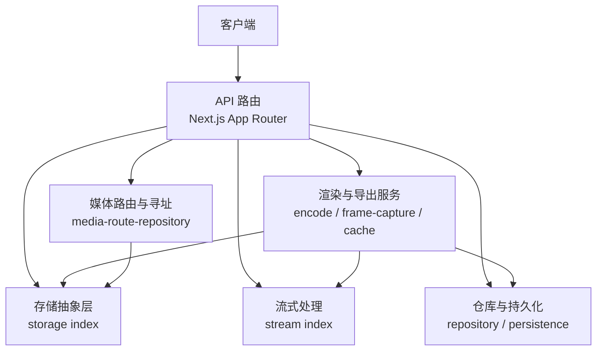
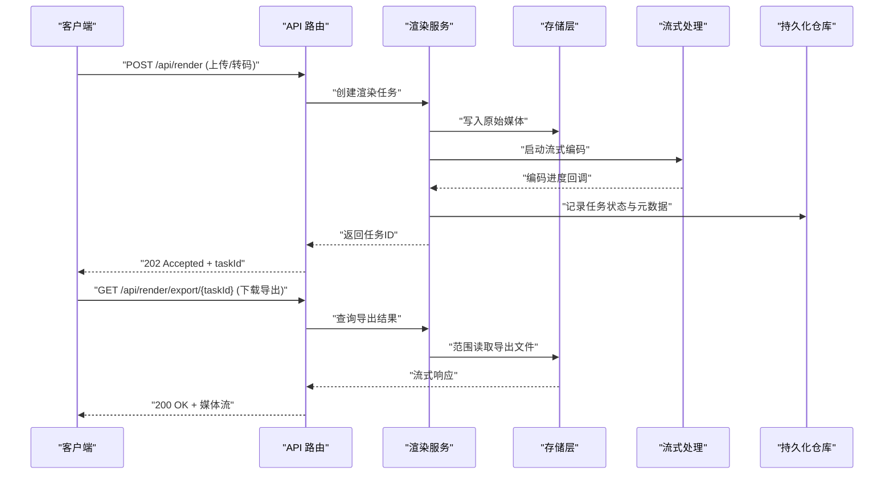
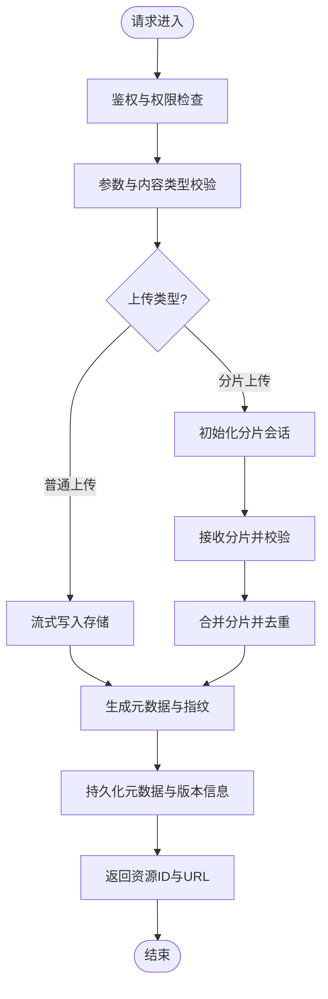
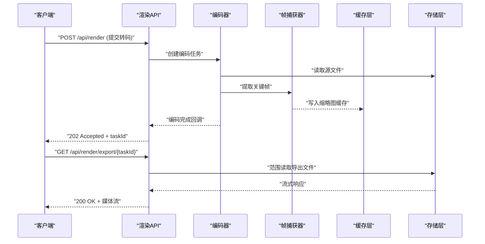
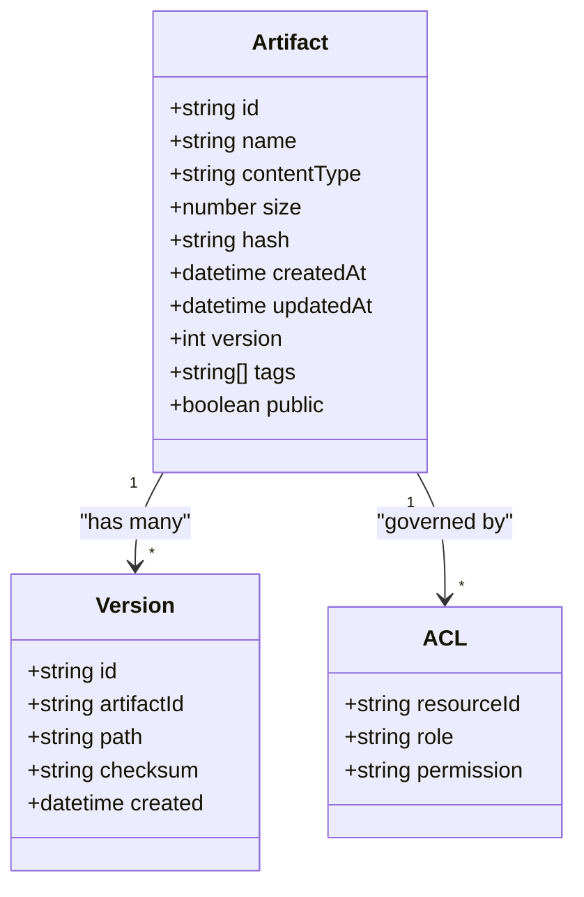
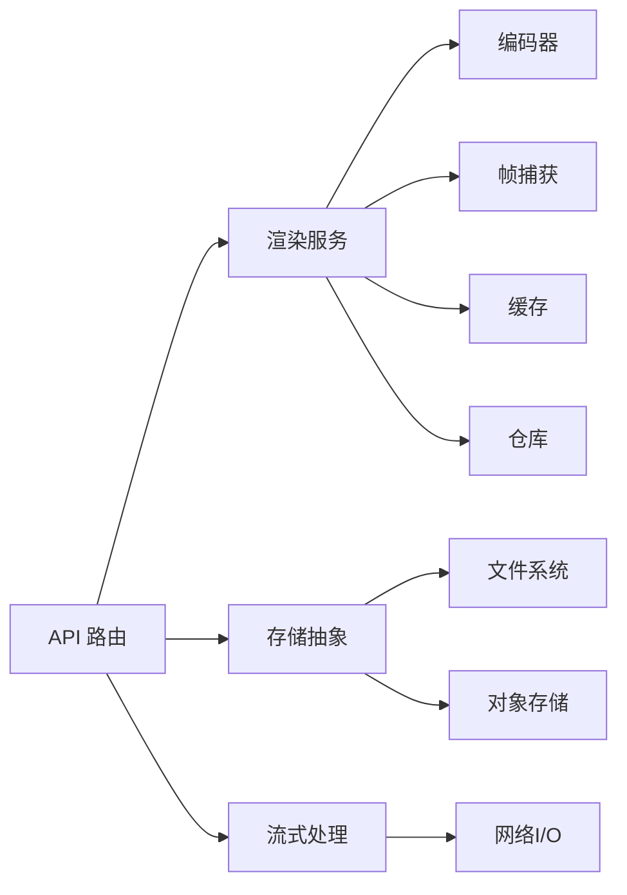

# 资源管理 API

<cite>
**本文引用的文件**   
- [src/app/api/artifacts/[id]/route.ts](file://src/app/api/artifacts/%5Bid%5D/route.ts)
- [src/app/api/render/route.ts](file://src/app/api/render/route.ts)
- [src/app/api/render/export/route.ts](file://src/app/api/render/export/route.ts)
- [src/app/api/render/thumbnails/route.ts](file://src/app/api/render/thumbnails/route.ts)
- [src/features/render/repository.ts](file://src/features/render/repository.ts)
- [src/features/render/cache.ts](file://src/features/render/cache.ts)
- [src/features/render/encode.ts](file://src/features/render/encode.ts)
- [src/features/render/frame-capture.ts](file://src/features/render/frame-capture.ts)
- [src/features/render/persistence.ts](file://src/features/render/persistence.ts)
- [src/features/render/types.ts](file://src/features/render/types.ts)
- [src/lib/storage/index.ts](file://src/lib/storage/index.ts)
- [src/lib/stream/index.ts](file://src/lib/stream/index.ts)
- [src/features/routing/media-route-repository.ts](file://src/features/routing/media-route-repository.ts)
- [src/app/api/projects/[id]/route.ts](file://src/app/api/projects/%5Bid%5D/route.ts)
- [src/app/api/jobs/[id]/route.ts](file://src/app/api/jobs/%5Bid%5D/route.ts)
</cite>

## 目录
1. [简介](#简介)
2. [项目结构](#项目结构)
3. [核心组件](#核心组件)
4. [架构总览](#架构总览)
5. [详细组件分析](#详细组件分析)
6. [依赖分析](#依赖分析)
7. [性能考虑](#性能考虑)
8. [故障排查指南](#故障排查指南)
9. [结论](#结论)
10. [附录](#附录)

## 简介
本文件为 PurpleInM 资源管理系统的完整 API 文档，聚焦媒体文件的上传、下载、预览与管理。内容涵盖：
- 文件元数据管理、内容类型识别与存储策略
- 大文件分片上传、断点续传与并发下载的接口实现
- 文件版本控制、访问权限与内容验证的接口规范
- 存储空间管理、清理策略与性能优化方案

本系统基于 Next.js App Router 提供 RESTful API，并通过渲染与导出管线对媒体进行编码、帧捕获与持久化，结合存储抽象层与流式传输能力，满足高吞吐与高可用的资源管理需求。

## 项目结构
与资源管理相关的代码主要分布在以下位置：
- API 路由：位于 src/app/api 下，按功能域划分（artifacts、render、projects、jobs 等）
- 渲染与导出：位于 src/features/render，包含编码、帧捕获、缓存、持久化与仓库
- 存储与流：位于 src/lib/storage 与 src/lib/stream，提供统一的存储抽象与流式处理能力
- 路由与寻址：位于 src/features/routing，负责媒体资源的寻址与路由映射

图表来源
- [src/app/api/render/route.ts](file://src/app/api/render/route.ts)
- [src/features/render/encode.ts](file://src/features/render/encode.ts)
- [src/lib/storage/index.ts](file://src/lib/storage/index.ts)
- [src/lib/stream/index.ts](file://src/lib/stream/index.ts)
- [src/features/render/repository.ts](file://src/features/render/repository.ts)
- [src/features/routing/media-route-repository.ts](file://src/features/routing/media-route-repository.ts)

章节来源
- [src/app/api/render/route.ts](file://src/app/api/render/route.ts)
- [src/features/render/types.ts](file://src/features/render/types.ts)

## 核心组件
- 渲染与导出服务：负责媒体编码、帧捕获、缩略图生成、导出任务编排与结果持久化
- 存储抽象层：统一不同后端（本地磁盘、对象存储）的读写接口，支持分片与范围读取
- 流式处理：提供流式上传、分块下载与并发下载能力
- 仓库与持久化：维护资源元数据、版本信息与状态，确保一致性
- 媒体路由与寻址：将资源 ID 映射到实际存储路径或 URL，支持 CDN 与缓存

章节来源
- [src/features/render/repository.ts](file://src/features/render/repository.ts)
- [src/features/render/cache.ts](file://src/features/render/cache.ts)
- [src/features/render/encode.ts](file://src/features/render/encode.ts)
- [src/features/render/frame-capture.ts](file://src/features/render/frame-capture.ts)
- [src/features/render/persistence.ts](file://src/features/render/persistence.ts)
- [src/lib/storage/index.ts](file://src/lib/storage/index.ts)
- [src/lib/stream/index.ts](file://src/lib/stream/index.ts)
- [src/features/routing/media-route-repository.ts](file://src/features/routing/media-route-repository.ts)

## 架构总览
下图展示从客户端请求到存储与渲染处理的端到端流程，包括上传、转码、帧捕获、缩略图生成与导出。

图表来源
- [src/app/api/render/route.ts](file://src/app/api/render/route.ts)
- [src/features/render/repository.ts](file://src/features/render/repository.ts)
- [src/lib/storage/index.ts](file://src/lib/storage/index.ts)
- [src/lib/stream/index.ts](file://src/lib/stream/index.ts)

## 详细组件分析

### 上传与下载 API
- 上传接口：支持表单上传与流式上传，自动识别内容类型并校验大小与格式；大文件采用分片上传与断点续传
- 下载接口：支持范围请求（Range），实现分块下载与并发下载；可指定输出格式与质量参数
- 预览接口：根据资源类型生成缩略图或首帧图片，支持尺寸裁剪与格式转换

图表来源
- [src/app/api/artifacts/[id]/route.ts](file://src/app/api/artifacts/%5Bid%5D/route.ts)
- [src/lib/storage/index.ts](file://src/lib/storage/index.ts)
- [src/lib/stream/index.ts](file://src/lib/stream/index.ts)

章节来源
- [src/app/api/artifacts/[id]/route.ts](file://src/app/api/artifacts/%5Bid%5D/route.ts)
- [src/lib/storage/index.ts](file://src/lib/storage/index.ts)
- [src/lib/stream/index.ts](file://src/lib/stream/index.ts)

### 渲染与导出 API
- 渲染接口：提交转码任务，支持多格式输出、分辨率与码率配置；异步执行并返回任务 ID
- 导出接口：根据任务 ID 获取导出结果，支持范围下载与并发下载
- 缩略图接口：生成缩略图或关键帧图片，支持尺寸与格式选项

图表来源
- [src/app/api/render/route.ts](file://src/app/api/render/route.ts)
- [src/features/render/encode.ts](file://src/features/render/encode.ts)
- [src/features/render/frame-capture.ts](file://src/features/render/frame-capture.ts)
- [src/features/render/cache.ts](file://src/features/render/cache.ts)
- [src/lib/storage/index.ts](file://src/lib/storage/index.ts)

章节来源
- [src/app/api/render/route.ts](file://src/app/api/render/route.ts)
- [src/features/render/encode.ts](file://src/features/render/encode.ts)
- [src/features/render/frame-capture.ts](file://src/features/render/frame-capture.ts)
- [src/features/render/cache.ts](file://src/features/render/cache.ts)

### 元数据管理与版本控制
- 元数据模型：包含资源 ID、文件名、内容类型、大小、哈希、创建时间、更新时间、版本信息等字段
- 版本控制：每次更新生成新版本，保留历史版本并可回滚；支持标签与分支概念
- 访问权限：基于角色与资源的访问控制列表（ACL），支持公开、私有与团队共享

图表来源
- [src/features/render/types.ts](file://src/features/render/types.ts)
- [src/features/render/repository.ts](file://src/features/render/repository.ts)

章节来源
- [src/features/render/types.ts](file://src/features/render/types.ts)
- [src/features/render/repository.ts](file://src/features/render/repository.ts)

### 内容类型识别与存储策略
- 内容类型识别：通过文件头与扩展名双重校验，防止伪造类型；支持白名单与黑名单策略
- 存储策略：按资源类型与项目组织目录结构；支持冷热分层与生命周期管理
- 安全策略：文件名清洗、路径穿越防护、大小限制与病毒扫描集成点

章节来源
- [src/lib/storage/index.ts](file://src/lib/storage/index.ts)
- [src/features/render/types.ts](file://src/features/render/types.ts)

### 分片上传与断点续传
- 分片上传：客户端将文件切分为固定大小的分片，逐个上传并携带分片序号与总大小
- 断点续传：服务端记录已上传分片，支持中断后继续；合并前进行完整性校验
- 并发控制：限制并发分片数，避免内存与带宽拥塞

章节来源
- [src/lib/storage/index.ts](file://src/lib/storage/index.ts)
- [src/lib/stream/index.ts](file://src/lib/stream/index.ts)

### 并发下载与范围请求
- 范围请求：支持 HTTP Range 头，客户端可并行请求多个字节范围
- 并发下载：服务端按范围并行读取存储后端，合并响应流
- 缓存优化：对热点资源启用边缘缓存与内存缓存

章节来源
- [src/lib/storage/index.ts](file://src/lib/storage/index.ts)
- [src/lib/stream/index.ts](file://src/lib/stream/index.ts)

### 存储空间管理与清理策略
- 空间监控：统计各分区与桶的使用量，设置阈值告警
- 清理策略：基于时间与引用计数清理孤儿文件；支持软删除与回收站
- 生命周期：按策略自动归档冷数据或删除过期版本

章节来源
- [src/features/render/persistence.ts](file://src/features/render/persistence.ts)
- [src/features/render/repository.ts](file://src/features/render/repository.ts)

## 依赖分析
资源管理模块之间的依赖关系如下：

图表来源
- [src/app/api/render/route.ts](file://src/app/api/render/route.ts)
- [src/features/render/encode.ts](file://src/features/render/encode.ts)
- [src/features/render/frame-capture.ts](file://src/features/render/frame-capture.ts)
- [src/features/render/cache.ts](file://src/features/render/cache.ts)
- [src/lib/storage/index.ts](file://src/lib/storage/index.ts)
- [src/lib/stream/index.ts](file://src/lib/stream/index.ts)

章节来源
- [src/app/api/render/route.ts](file://src/app/api/render/route.ts)
- [src/features/render/repository.ts](file://src/features/render/repository.ts)

## 性能考虑
- 流式处理：避免全量加载，降低内存峰值；使用管道与背压控制
- 并发控制：合理设置分片并发与下载线程数，避免过载
- 缓存策略：多级缓存（内存、边缘、CDN）提升命中率
- I/O 优化：批量写入与顺序读取，减少随机 I/O
- 压缩与编码：按需选择编码参数，平衡质量与体积

[本节为通用指导，不直接分析具体文件]

## 故障排查指南
- 上传失败：检查分片完整性、哈希校验与存储后端连通性
- 下载超时：确认范围请求是否被代理或防火墙拦截；检查存储后端延迟
- 编码错误：核对输入格式与编码参数；查看中间产物日志
- 权限问题：验证 ACL 配置与用户角色；检查资源可见性设置
- 空间不足：监控存储使用率；清理孤儿文件与过期版本

章节来源
- [src/app/api/render/route.ts](file://src/app/api/render/route.ts)
- [src/features/render/repository.ts](file://src/features/render/repository.ts)
- [src/lib/storage/index.ts](file://src/lib/storage/index.ts)

## 结论
PurpleInM 资源管理系统通过清晰的 API 设计与模块化架构，提供了完整的媒体文件管理能力。其分片上传、断点续传、并发下载与版本控制等特性，满足了大规模媒体资源的高效处理与稳定交付需求。建议在生产环境中结合监控与告警机制，持续优化性能与可靠性。

[本节为总结性内容，不直接分析具体文件]

## 附录
- 相关 API 路由参考：
  - 资源操作：[src/app/api/artifacts/[id]/route.ts](file://src/app/api/artifacts/%5Bid%5D/route.ts)
  - 渲染与导出：[src/app/api/render/route.ts](file://src/app/api/render/route.ts)、[src/app/api/render/export/route.ts](file://src/app/api/render/export/route.ts)、[src/app/api/render/thumbnails/route.ts](file://src/app/api/render/thumbnails/route.ts)
  - 项目与作业：[src/app/api/projects/[id]/route.ts](file://src/app/api/projects/%5Bid%5D/route.ts)、[src/app/api/jobs/[id]/route.ts](file://src/app/api/jobs/%5Bid%5D/route.ts)
- 核心实现参考：
  - 渲染与导出：[src/features/render/encode.ts](file://src/features/render/encode.ts)、[src/features/render/frame-capture.ts](file://src/features/render/frame-capture.ts)、[src/features/render/cache.ts](file://src/features/render/cache.ts)、[src/features/render/repository.ts](file://src/features/render/repository.ts)、[src/features/render/persistence.ts](file://src/features/render/persistence.ts)、[src/features/render/types.ts](file://src/features/render/types.ts)
  - 存储与流：[src/lib/storage/index.ts](file://src/lib/storage/index.ts)、[src/lib/stream/index.ts](file://src/lib/stream/index.ts)
  - 路由与寻址：[src/features/routing/media-route-repository.ts](file://src/features/routing/media-route-repository.ts)