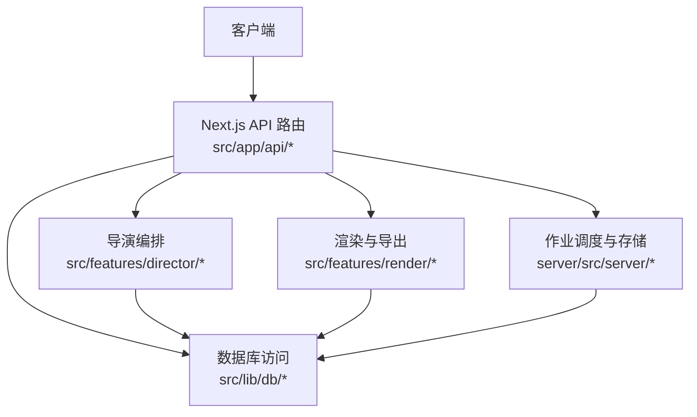
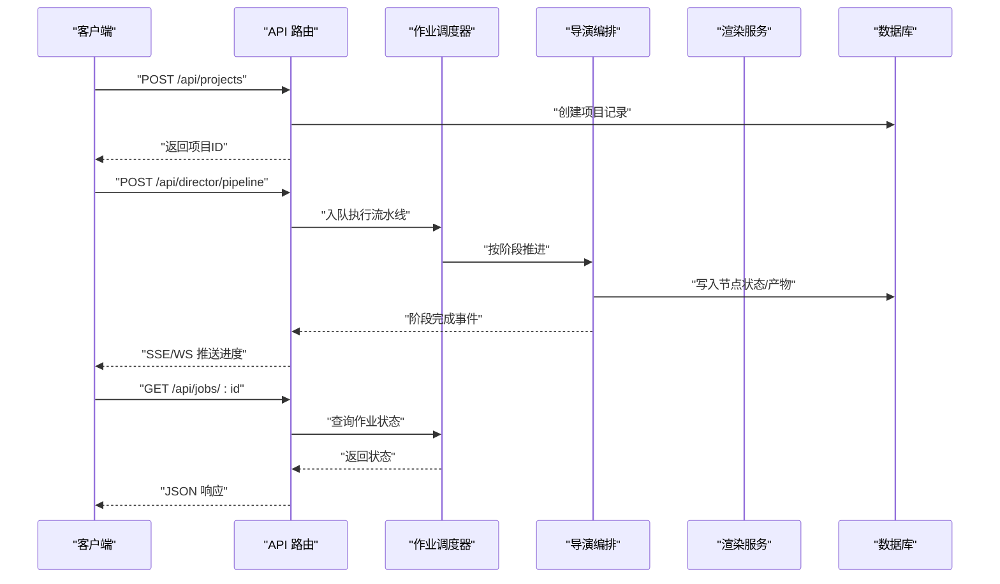
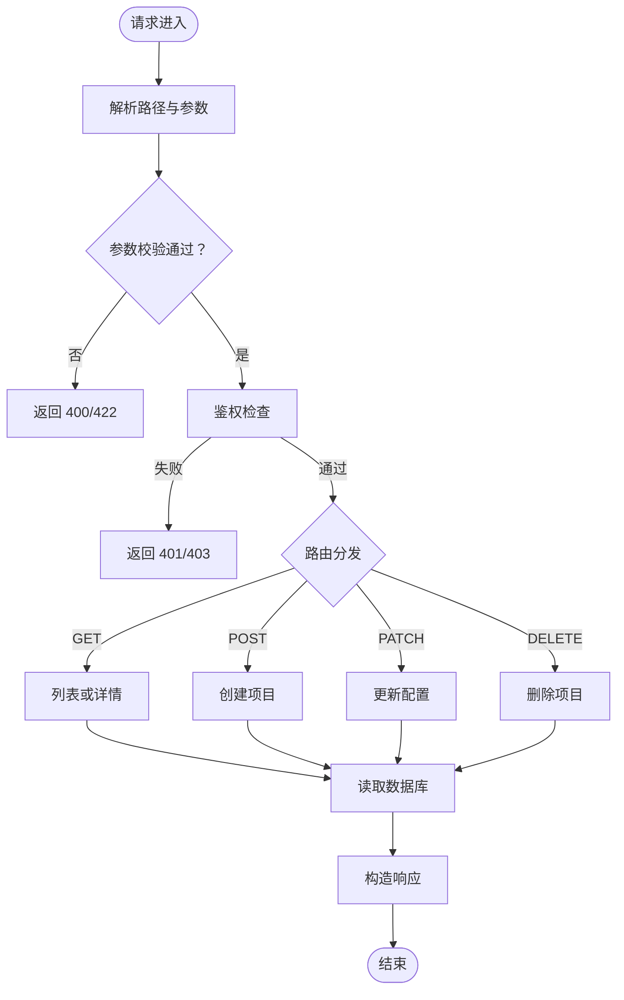
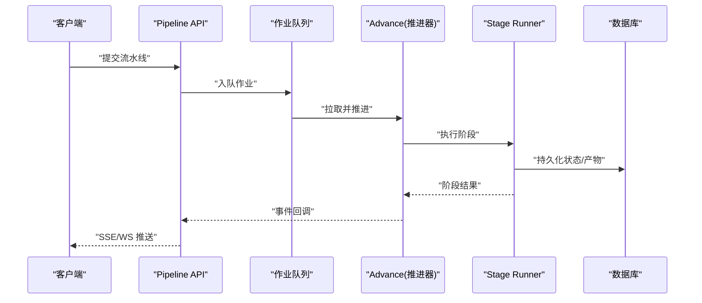
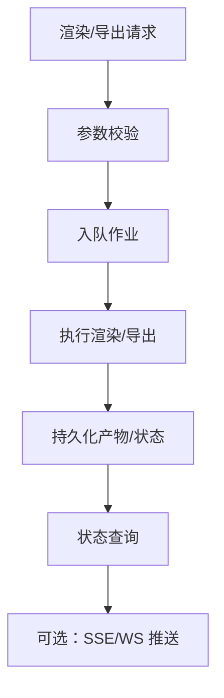
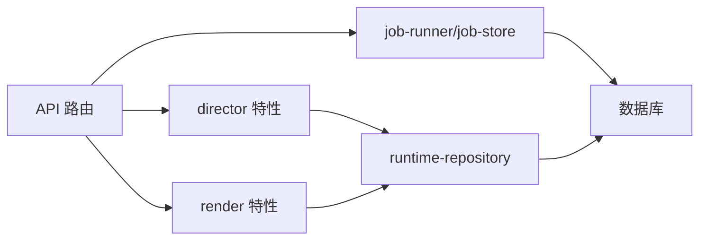

# 项目管理 API

<cite>
**本文引用的文件**   
- [server/src/index.ts](file://server/src/index.ts)
- [src/app/api/projects/route.ts](file://src/app/api/projects/route.ts)
- [src/app/api/projects/[id]/route.ts](file://src/app/api/projects/[id]/route.ts)
- [src/app/api/jobs/[id]/route.ts](file://src/app/api/jobs/[id]/route.ts)
- [src/app/api/director/pipeline/route.ts](file://src/app/api/director/pipeline/route.ts)
- [src/app/api/director/stage/route.ts](file://src/app/api/director/stage/route.ts)
- [src/app/api/director/stream/project/[projectId]/route.ts](file://src/app/api/director/stream/project/[projectId]/route.ts)
- [src/app/api/director/stream/[nodeId]/route.ts](file://src/app/api/director/stream/[nodeId]/route.ts)
- [src/app/api/render/route.ts](file://src/app/api/render/route.ts)
- [src/app/api/render/export/route.ts](file://src/app/api/render/export/route.ts)
- [src/app/api/artifacts/[id]/route.ts](file://src/app/api/artifacts/[id]/route.ts)
- [src/app/api/settings/route.ts](file://src/app/api/settings/route.ts)
- [src/app/api/ping/route.ts](file://src/app/api/ping/route.ts)
- [server/src/server/job-runner.ts](file://server/src/server/job-runner.ts)
- [server/src/server/job-store.ts](file://server/src/server/job-store.ts)
- [server/src/server/api.ts](file://server/src/server/api.ts)
- [src/features/director/advance.ts](file://src/features/director/advance.ts)
- [src/features/director/runtime-repository.ts](file://src/features/director/runtime-repository.ts)
- [src/features/director/queue-handler.ts](file://src/features/director/queue-handler.ts)
- [src/features/render/renderer.ts](file://src/features/render/renderer.ts)
- [src/features/render/export-service.ts](file://src/features/render/export-service.ts)
- [src/features/render/queue-handler.ts](file://src/features/render/queue-handler.ts)
- [src/lib/db/index.ts](file://src/lib/db/index.ts)
</cite>

## 目录
1. [简介](#简介)
2. [项目结构](#项目结构)
3. [核心组件](#核心组件)
4. [架构总览](#架构总览)
5. [详细组件分析](#详细组件分析)
6. [依赖分析](#依赖分析)
7. [性能考虑](#性能考虑)
8. [故障排查指南](#故障排查指南)
9. [结论](#结论)
10. [附录：API 参考](#附录api-参考)

## 简介
本文件为 PurpleInk 项目管理系统的完整 API 文档，覆盖项目的 CRUD、执行控制与状态管理。重点包括：
- 项目创建、配置更新与删除的请求/响应格式
- 项目执行生命周期管理（提交任务、查询进度）
- 项目拓扑、工作流状态与实时更新的接口
- 权限控制、数据验证与错误处理机制

## 项目结构
系统采用 Next.js App Router 作为 HTTP API 入口，后端服务通过 server 子模块提供作业调度与持久化能力。前端通过 src/app/api 下的路由暴露 RESTful 接口；渲染与导出由 features/render 实现；导演编排由 features/director 负责。

**图示来源** 
- [src/app/api/projects/route.ts](file://src/app/api/projects/route.ts)
- [src/app/api/jobs/[id]/route.ts](file://src/app/api/jobs/[id]/route.ts)
- [src/app/api/director/pipeline/route.ts](file://src/app/api/director/pipeline/route.ts)
- [src/app/api/render/route.ts](file://src/app/api/render/route.ts)
- [server/src/server/job-runner.ts](file://server/src/server/job-runner.ts)
- [server/src/server/job-store.ts](file://server/src/server/job-store.ts)
- [src/lib/db/index.ts](file://src/lib/db/index.ts)

**章节来源**
- [server/src/index.ts](file://server/src/index.ts)
- [src/app/api/projects/route.ts](file://src/app/api/projects/route.ts)
- [src/app/api/jobs/[id]/route.ts](file://src/app/api/jobs/[id]/route.ts)
- [src/app/api/director/pipeline/route.ts](file://src/app/api/director/pipeline/route.ts)
- [src/app/api/render/route.ts](file://src/app/api/render/route.ts)
- [server/src/server/job-runner.ts](file://server/src/server/job-runner.ts)
- [server/src/server/job-store.ts](file://server/src/server/job-store.ts)
- [src/lib/db/index.ts](file://src/lib/db/index.ts)

## 核心组件
- API 路由层：统一请求解析、参数校验、鉴权与错误封装，转发至业务层。
- 作业调度器：接收任务、维护队列、驱动执行并持久化状态。
- 导演编排：按阶段推进工作流，管理节点拓扑、产物与状态。
- 渲染与导出：帧捕获、编码、拼接、缩略图生成与导出任务。
- 数据访问：统一的数据库连接与事务封装。

**章节来源**
- [src/app/api/projects/route.ts](file://src/app/api/projects/route.ts)
- [src/app/api/projects/[id]/route.ts](file://src/app/api/projects/[id]/route.ts)
- [src/app/api/jobs/[id]/route.ts](file://src/app/api/jobs/[id]/route.ts)
- [src/app/api/director/pipeline/route.ts](file://src/app/api/director/pipeline/route.ts)
- [src/app/api/director/stage/route.ts](file://src/app/api/director/stage/route.ts)
- [src/app/api/director/stream/project/[projectId]/route.ts](file://src/app/api/director/stream/project/[projectId]/route.ts)
- [src/app/api/director/stream/[nodeId]/route.ts](file://src/app/api/director/stream/[nodeId]/route.ts)
- [src/app/api/render/route.ts](file://src/app/api/render/route.ts)
- [src/app/api/render/export/route.ts](file://src/app/api/render/export/route.ts)
- [src/app/api/artifacts/[id]/route.ts](file://src/app/api/artifacts/[id]/route.ts)
- [src/app/api/settings/route.ts](file://src/app/api/settings/route.ts)
- [src/app/api/ping/route.ts](file://src/app/api/ping/route.ts)
- [server/src/server/job-runner.ts](file://server/src/server/job-runner.ts)
- [server/src/server/job-store.ts](file://server/src/server/job-store.ts)
- [src/features/director/advance.ts](file://src/features/director/advance.ts)
- [src/features/director/runtime-repository.ts](file://src/features/director/runtime-repository.ts)
- [src/features/director/queue-handler.ts](file://src/features/director/queue-handler.ts)
- [src/features/render/renderer.ts](file://src/features/render/renderer.ts)
- [src/features/render/export-service.ts](file://src/features/render/export-service.ts)
- [src/features/render/queue-handler.ts](file://src/features/render/queue-handler.ts)
- [src/lib/db/index.ts](file://src/lib/db/index.ts)

## 架构总览
系统以“API 路由 -> 业务特性 -> 作业调度/持久化”的分层模式组织。HTTP 请求进入 Next.js API 路由后，进行鉴权与参数校验，随后调用导演或渲染等特性模块；这些模块通过作业调度器异步执行，并通过数据库持久化状态。实时状态通过流式接口推送。

**图示来源** 
- [src/app/api/projects/route.ts](file://src/app/api/projects/route.ts)
- [src/app/api/director/pipeline/route.ts](file://src/app/api/director/pipeline/route.ts)
- [src/app/api/jobs/[id]/route.ts](file://src/app/api/jobs/[id]/route.ts)
- [server/src/server/job-runner.ts](file://server/src/server/job-runner.ts)
- [src/features/director/advance.ts](file://src/features/director/advance.ts)
- [src/lib/db/index.ts](file://src/lib/db/index.ts)

## 详细组件分析

### 项目资源 API（CRUD）
- 列表与创建
  - GET /api/projects：分页/过滤/排序，返回项目集合。
  - POST /api/projects：创建项目，请求体包含名称、描述、初始配置等；成功返回项目对象（含 id）。
- 详情与更新
  - GET /api/projects/:id：返回项目详情及关联元数据。
  - PATCH /api/projects/:id：部分更新配置（如模型服务、并发度、主题等），返回更新后的项目。
- 删除
  - DELETE /api/projects/:id：软删除或硬删除，返回确认信息。

**图示来源** 
- [src/app/api/projects/route.ts](file://src/app/api/projects/route.ts)
- [src/app/api/projects/[id]/route.ts](file://src/app/api/projects/[id]/route.ts)

**章节来源**
- [src/app/api/projects/route.ts](file://src/app/api/projects/route.ts)
- [src/app/api/projects/[id]/route.ts](file://src/app/api/projects/[id]/route.ts)

### 执行控制与作业管理
- 提交执行
  - POST /api/director/pipeline：提交项目级流水线执行，支持指定阶段、参数与优先级。
  - POST /api/director/stage：提交单阶段执行，用于重试或回滚。
- 作业状态
  - GET /api/jobs/:id：查询作业状态、进度、日志摘要与产物链接。
- 实时流
  - SSE/WS 流式接口：/api/director/stream/project/[projectId] 与 /[nodeId]，推送阶段事件、日志与产物就绪通知。

**图示来源** 
- [src/app/api/director/pipeline/route.ts](file://src/app/api/director/pipeline/route.ts)
- [src/app/api/director/stage/route.ts](file://src/app/api/director/stage/route.ts)
- [src/app/api/director/stream/project/[projectId]/route.ts](file://src/app/api/director/stream/project/[projectId]/route.ts)
- [src/app/api/director/stream/[nodeId]/route.ts](file://src/app/api/director/stream/[nodeId]/route.ts)
- [src/app/api/jobs/[id]/route.ts](file://src/app/api/jobs/[id]/route.ts)
- [src/features/director/advance.ts](file://src/features/director/advance.ts)
- [src/features/director/queue-handler.ts](file://src/features/director/queue-handler.ts)
- [server/src/server/job-runner.ts](file://server/src/server/job-runner.ts)

**章节来源**
- [src/app/api/director/pipeline/route.ts](file://src/app/api/director/pipeline/route.ts)
- [src/app/api/director/stage/route.ts](file://src/app/api/director/stage/route.ts)
- [src/app/api/director/stream/project/[projectId]/route.ts](file://src/app/api/director/stream/project/[projectId]/route.ts)
- [src/app/api/director/stream/[nodeId]/route.ts](file://src/app/api/director/stream/[nodeId]/route.ts)
- [src/app/api/jobs/[id]/route.ts](file://src/app/api/jobs/[id]/route.ts)
- [src/features/director/advance.ts](file://src/features/director/advance.ts)
- [src/features/director/queue-handler.ts](file://src/features/director/queue-handler.ts)
- [server/src/server/job-runner.ts](file://server/src/server/job-runner.ts)

### 渲染与导出
- 渲染任务
  - POST /api/render：提交渲染任务（帧序列、编码参数、输出格式）。
  - GET /api/render：查询渲染任务状态与进度。
- 导出
  - POST /api/render/export：触发导出（合并片段、生成缩略图、打包下载）。
  - GET /api/render/export：查询导出任务状态与下载链接。
- 缩略图
  - GET /api/render/thumbnails：批量获取缩略图 URL。

**图示来源** 
- [src/app/api/render/route.ts](file://src/app/api/render/route.ts)
- [src/app/api/render/export/route.ts](file://src/app/api/render/export/route.ts)
- [src/features/render/renderer.ts](file://src/features/render/renderer.ts)
- [src/features/render/export-service.ts](file://src/features/render/export-service.ts)
- [src/features/render/queue-handler.ts](file://src/features/render/queue-handler.ts)

**章节来源**
- [src/app/api/render/route.ts](file://src/app/api/render/route.ts)
- [src/app/api/render/export/route.ts](file://src/app/api/render/export/route.ts)
- [src/features/render/renderer.ts](file://src/features/render/renderer.ts)
- [src/features/render/export-service.ts](file://src/features/render/export-service.ts)
- [src/features/render/queue-handler.ts](file://src/features/render/queue-handler.ts)

### 制品与设置
- 制品访问
  - GET /api/artifacts/:id：根据 ID 获取制品元数据或内容。
- 设置管理
  - GET/PUT /api/settings：全局设置项的读取与更新（如模型服务凭证、TTS 配置等）。

**章节来源**
- [src/app/api/artifacts/[id]/route.ts](file://src/app/api/artifacts/[id]/route.ts)
- [src/app/api/settings/route.ts](file://src/app/api/settings/route.ts)

### 健康检查
- GET /api/ping：快速健康检查，返回服务可用性与版本信息。

**章节来源**
- [src/app/api/ping/route.ts](file://src/app/api/ping/route.ts)

## 依赖分析
- API 路由依赖业务特性模块（director、render）与作业调度器（job-runner、job-store）。
- 业务特性通过仓库层访问数据库，保证一致性与事务性。
- 流式接口依赖事件总线或消息通道，将作业状态实时推送到客户端。

**图示来源** 
- [src/app/api/projects/route.ts](file://src/app/api/projects/route.ts)
- [src/app/api/director/pipeline/route.ts](file://src/app/api/director/pipeline/route.ts)
- [src/app/api/render/route.ts](file://src/app/api/render/route.ts)
- [server/src/server/job-runner.ts](file://server/src/server/job-runner.ts)
- [server/src/server/job-store.ts](file://server/src/server/job-store.ts)
- [src/features/director/runtime-repository.ts](file://src/features/director/runtime-repository.ts)
- [src/lib/db/index.ts](file://src/lib/db/index.ts)

**章节来源**
- [server/src/server/api.ts](file://server/src/server/api.ts)
- [server/src/server/job-runner.ts](file://server/src/server/job-runner.ts)
- [server/src/server/job-store.ts](file://server/src/server/job-store.ts)
- [src/features/director/runtime-repository.ts](file://src/features/director/runtime-repository.ts)
- [src/lib/db/index.ts](file://src/lib/db/index.ts)

## 性能考虑
- 作业队列与并发：合理设置队列大小与并发度，避免阻塞与内存溢出。
- 流式推送：使用 SSE/WS 推送细粒度事件，减少轮询开销。
- 缓存策略：对只读数据（如项目列表、设置）启用短期缓存。
- I/O 优化：大文件导出采用分块传输与后台任务，避免长连接超时。

[本节为通用指导，不直接分析具体文件]

## 故障排查指南
- 常见错误码
  - 400/422：请求参数校验失败，检查必填字段与类型。
  - 401/403：鉴权失败，检查令牌与权限范围。
  - 500：服务端异常，查看作业日志与数据库事务状态。
- 定位步骤
  - 通过作业 ID 查询状态与日志摘要。
  - 检查流式事件是否持续推送。
  - 核对数据库事务与锁竞争情况。
- 恢复建议
  - 重试失败阶段或作业。
  - 清理卡住的作业与临时产物。
  - 调整并发与超时参数。

**章节来源**
- [src/app/api/jobs/[id]/route.ts](file://src/app/api/jobs/[id]/route.ts)
- [src/app/api/director/stream/project/[projectId]/route.ts](file://src/app/api/director/stream/project/[projectId]/route.ts)
- [src/app/api/director/stream/[nodeId]/route.ts](file://src/app/api/director/stream/[nodeId]/route.ts)
- [server/src/server/job-runner.ts](file://server/src/server/job-runner.ts)
- [server/src/server/job-store.ts](file://server/src/server/job-store.ts)

## 结论
PurpleInk 的项目管理 API 以清晰的层次结构与职责划分，实现了从项目 CRUD、执行控制到渲染导出的全链路能力。通过作业调度与流式推送，系统具备良好的可扩展性与实时性。建议在集成时严格遵循参数校验与错误处理规范，并结合监控与日志完善可观测性。

[本节为总结，不直接分析具体文件]

## 附录：API 参考

### 项目资源
- GET /api/projects
  - 功能：列出项目（分页/过滤/排序）
  - 响应：项目数组（含 id、名称、状态、时间戳等）
- POST /api/projects
  - 功能：创建项目
  - 请求体：名称、描述、初始配置
  - 响应：项目对象（含 id）
- GET /api/projects/:id
  - 功能：获取项目详情
  - 响应：项目对象及关联元数据
- PATCH /api/projects/:id
  - 功能：更新项目配置
  - 请求体：需更新的字段
  - 响应：更新后的项目对象
- DELETE /api/projects/:id
  - 功能：删除项目
  - 响应：确认信息

**章节来源**
- [src/app/api/projects/route.ts](file://src/app/api/projects/route.ts)
- [src/app/api/projects/[id]/route.ts](file://src/app/api/projects/[id]/route.ts)

### 执行控制
- POST /api/director/pipeline
  - 功能：提交项目级流水线执行
  - 请求体：阶段、参数、优先级
  - 响应：作业 ID 与初始状态
- POST /api/director/stage
  - 功能：提交单阶段执行（重试/回滚）
  - 请求体：阶段标识与参数
  - 响应：作业 ID 与初始状态
- GET /api/jobs/:id
  - 功能：查询作业状态与进度
  - 响应：状态、进度、日志摘要、产物链接
- SSE/WS 流
  - /api/director/stream/project/[projectId]
  - /api/director/stream/[nodeId]
  - 事件：阶段开始/完成、错误、产物就绪

**章节来源**
- [src/app/api/director/pipeline/route.ts](file://src/app/api/director/pipeline/route.ts)
- [src/app/api/director/stage/route.ts](file://src/app/api/director/stage/route.ts)
- [src/app/api/director/stream/project/[projectId]/route.ts](file://src/app/api/director/stream/project/[projectId]/route.ts)
- [src/app/api/director/stream/[nodeId]/route.ts](file://src/app/api/director/stream/[nodeId]/route.ts)
- [src/app/api/jobs/[id]/route.ts](file://src/app/api/jobs/[id]/route.ts)

### 渲染与导出
- POST /api/render
  - 功能：提交渲染任务
  - 请求体：帧序列、编码参数、输出格式
  - 响应：作业 ID 与初始状态
- GET /api/render
  - 功能：查询渲染任务状态
  - 响应：状态、进度、输出链接
- POST /api/render/export
  - 功能：触发导出
  - 请求体：导出规格与目标
  - 响应：作业 ID 与初始状态
- GET /api/render/export
  - 功能：查询导出任务状态
  - 响应：状态、下载链接
- GET /api/render/thumbnails
  - 功能：批量获取缩略图 URL
  - 响应：URL 映射

**章节来源**
- [src/app/api/render/route.ts](file://src/app/api/render/route.ts)
- [src/app/api/render/export/route.ts](file://src/app/api/render/export/route.ts)

### 制品与设置
- GET /api/artifacts/:id
  - 功能：获取制品元数据或内容
  - 响应：二进制或 JSON（视制品类型）
- GET/PUT /api/settings
  - 功能：读取/更新全局设置
  - 请求体：设置键值对
  - 响应：更新后的设置

**章节来源**
- [src/app/api/artifacts/[id]/route.ts](file://src/app/api/artifacts/[id]/route.ts)
- [src/app/api/settings/route.ts](file://src/app/api/settings/route.ts)

### 健康检查
- GET /api/ping
  - 功能：服务可用性检查
  - 响应：版本与状态

**章节来源**
- [src/app/api/ping/route.ts](file://src/app/api/ping/route.ts)