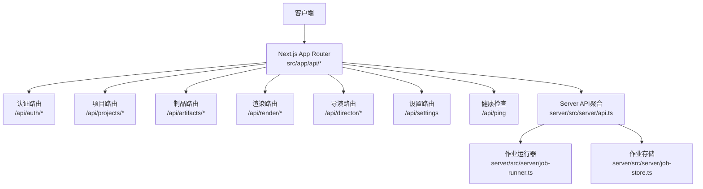
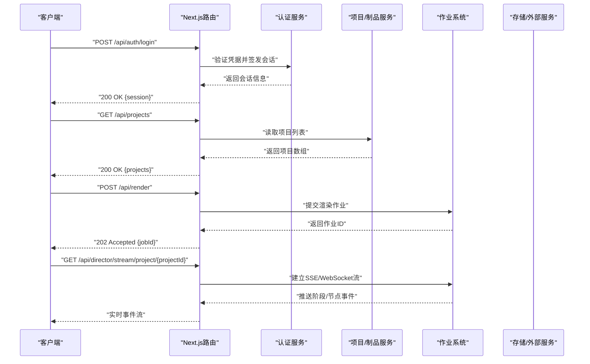
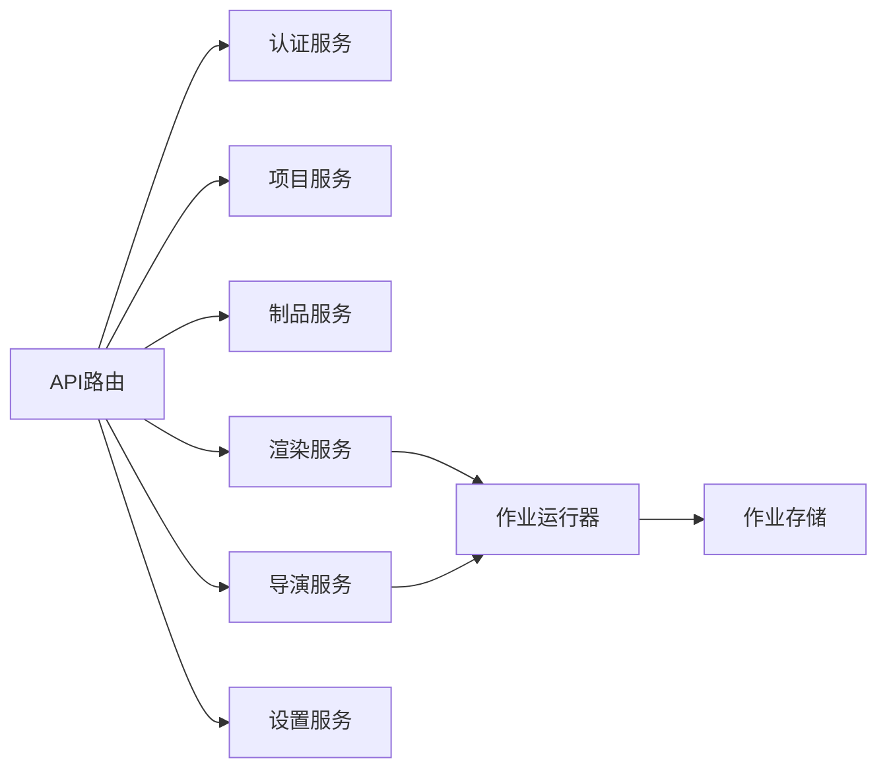

# API参考

<cite>
**本文引用的文件**   
- [server/src/index.ts](file://server/src/index.ts)
- [server/src/server/api.ts](file://server/src/server/api.ts)
- [server/src/server/job-runner.ts](file://server/src/server/job-runner.ts)
- [server/src/server/job-store.ts](file://server/src/server/job-store.ts)
- [src/app/api/ping/route.ts](file://src/app/api/ping/route.ts)
- [src/app/api/auth/login/route.ts](file://src/app/api/auth/login/route.ts)
- [src/app/api/auth/logout/route.ts](file://src/app/api/auth/logout/route.ts)
- [src/app/api/auth/session/route.ts](file://src/app/api/auth/session/route.ts)
- [src/app/api/auth/signup/route.ts](file://src/app/api/auth/signup/route.ts)
- [src/app/api/auth/password/reset/route.ts](file://src/app/api/auth/password/reset/route.ts)
- [src/app/api/auth/password/code/route.ts](file://src/app/api/auth/password/code/route.ts)
- [src/app/api/auth/human-check/route.ts](file://src/app/api/auth/human-check/route.ts)
- [src/app/api/projects/route.ts](file://src/app/api/projects/route.ts)
- [src/app/api/projects/[id]/route.ts](file://src/app/api/projects/[id]/route.ts)
- [src/app/api/artifacts/[id]/route.ts](file://src/app/api/artifacts/[id]/route.ts)
- [src/app/api/jobs/[id]/route.ts](file://src/app/api/jobs/[id]/route.ts)
- [src/app/api/render/route.ts](file://src/app/api/render/route.ts)
- [src/app/api/render/export/route.ts](file://src/app/api/render/export/route.ts)
- [src/app/api/render/thumbnails/route.ts](file://src/app/api/render/thumbnails/route.ts)
- [src/app/api/director/pipeline/route.ts](file://src/app/api/director/pipeline/route.ts)
- [src/app/api/director/stage/route.ts](file://src/app/api/director/stage/route.ts)
- [src/app/api/director/stream/[nodeId]/route.ts](file://src/app/api/director/stream/[nodeId]/route.ts)
- [src/app/api/director/stream/project/[projectId]/route.ts](file://src/app/api/director/stream/project/[projectId]/route.ts)
- [src/app/api/settings/route.ts](file://src/app/api/settings/route.ts)
- [src/features/auth/schemas.ts](file://src/features/auth/schemas.ts)
- [src/features/auth/errors.ts](file://src/features/auth/errors.ts)
- [src/features/auth/http.ts](file://src/features/auth/http.ts)
- [src/lib/api.ts](file://src/lib/api.ts)
</cite>

## 目录
1. [简介](#简介)
2. [项目结构](#项目结构)
3. [核心组件](#核心组件)
4. [架构总览](#架构总览)
5. [详细组件分析](#详细组件分析)
6. [依赖关系分析](#依赖关系分析)
7. [性能考虑](#性能考虑)
8. [故障排查指南](#故障排查指南)
9. [结论](#结论)
10. [附录](#附录)

## 简介
本参考文档面向PurpleInk的REST与WebSocket接口，覆盖认证、项目管理、制品管理、渲染导出、导演工作流与实时流式事件等能力。文档提供：
- REST端点清单（方法、URL模式、请求/响应格式、鉴权要求）
- WebSocket连接建立、消息协议、事件类型与交互模式
- 错误码定义与处理策略（HTTP状态码、业务错误码、错误体格式）
- API版本管理与向后兼容策略
- 测试工具与调试方法

## 项目结构
本项目采用Next.js App Router组织API路由，服务端逻辑位于server/src，前端功能与API客户端位于src。关键入口包括：
- Next.js应用入口与中间件配置
- server层服务编排（作业调度、存储、API聚合）
- features模块按领域划分（auth、director、render、audio等）

图表来源
- [server/src/server/api.ts](file://server/src/server/api.ts)
- [server/src/server/job-runner.ts](file://server/src/server/job-runner.ts)
- [server/src/server/job-store.ts](file://server/src/server/job-store.ts)

章节来源
- [server/src/index.ts](file://server/src/index.ts)
- [server/src/server/api.ts](file://server/src/server/api.ts)

## 核心组件
- 认证子系统：登录、注册、会话校验、密码重置、验证码、人机校验
- 项目与制品：项目CRUD、制品查询与访问控制
- 渲染与导出：渲染任务提交、缩略图生成、导出下载
- 导演工作流：流水线阶段推进、节点级流式事件推送
- 设置：全局或租户级配置读写
- 作业系统：异步任务调度与持久化

章节来源
- [src/app/api/auth/login/route.ts](file://src/app/api/auth/login/route.ts)
- [src/app/api/auth/signup/route.ts](file://src/app/api/auth/signup/route.ts)
- [src/app/api/auth/session/route.ts](file://src/app/api/auth/session/route.ts)
- [src/app/api/auth/password/reset/route.ts](file://src/app/api/auth/password/reset/route.ts)
- [src/app/api/auth/password/code/route.ts](file://src/app/api/auth/password/code/route.ts)
- [src/app/api/auth/human-check/route.ts](file://src/app/api/auth/human-check/route.ts)
- [src/app/api/projects/route.ts](file://src/app/api/projects/route.ts)
- [src/app/api/projects/[id]/route.ts](file://src/app/api/projects/[id]/route.ts)
- [src/app/api/artifacts/[id]/route.ts](file://src/app/api/artifacts/[id]/route.ts)
- [src/app/api/render/route.ts](file://src/app/api/render/route.ts)
- [src/app/api/render/export/route.ts](file://src/app/api/render/export/route.ts)
- [src/app/api/render/thumbnails/route.ts](file://src/app/api/render/thumbnails/route.ts)
- [src/app/api/director/pipeline/route.ts](file://src/app/api/director/pipeline/route.ts)
- [src/app/api/director/stage/route.ts](file://src/app/api/director/stage/route.ts)
- [src/app/api/director/stream/[nodeId]/route.ts](file://src/app/api/director/stream/[nodeId]/route.ts)
- [src/app/api/director/stream/project/[projectId]/route.ts](file://src/app/api/director/stream/project/[projectId]/route.ts)
- [src/app/api/settings/route.ts](file://src/app/api/settings/route.ts)
- [src/app/api/ping/route.ts](file://src/app/api/ping/route.ts)
- [server/src/server/job-runner.ts](file://server/src/server/job-runner.ts)
- [server/src/server/job-store.ts](file://server/src/server/job-store.ts)

## 架构总览
整体采用“Next.js API路由 + 领域特性模块 + 服务端作业系统”的分层架构。认证与会话通过Cookie/Token维护；渲染与导演流程以异步作业驱动，支持SSE/WebSocket实时推送；设置与制品作为资源型API暴露。

图表来源
- [src/app/api/auth/login/route.ts](file://src/app/api/auth/login/route.ts)
- [src/app/api/projects/route.ts](file://src/app/api/projects/route.ts)
- [src/app/api/render/route.ts](file://src/app/api/render/route.ts)
- [src/app/api/director/stream/project/[projectId]/route.ts](file://src/app/api/director/stream/project/[projectId]/route.ts)
- [server/src/server/job-runner.ts](file://server/src/server/job-runner.ts)

## 详细组件分析

### 认证API
- 登录：POST /api/auth/login
  - 请求体：用户名/邮箱、密码
  - 响应：会话令牌或Cookie
  - 鉴权：无
  - 错误：401/422/500
- 注册：POST /api/auth/signup
  - 请求体：用户名、邮箱、密码、可选邀请码
  - 响应：创建成功或冲突提示
  - 鉴权：无
- 会话：GET /api/auth/session
  - 响应：当前用户会话信息
  - 鉴权：需要有效会话
- 登出：POST /api/auth/logout
  - 响应：清除会话
  - 鉴权：需要有效会话
- 密码重置：POST /api/auth/password/reset
  - 请求体：邮箱
  - 响应：发送重置链接/验证码
- 验证码：POST /api/auth/password/code
  - 请求体：邮箱、验证码
  - 响应：重置成功
- 人机校验：POST /api/auth/human-check
  - 请求体：校验token
  - 响应：校验结果

章节来源
- [src/app/api/auth/login/route.ts](file://src/app/api/auth/login/route.ts)
- [src/app/api/auth/signup/route.ts](file://src/app/api/auth/signup/route.ts)
- [src/app/api/auth/session/route.ts](file://src/app/api/auth/session/route.ts)
- [src/app/api/auth/logout/route.ts](file://src/app/api/auth/logout/route.ts)
- [src/app/api/auth/password/reset/route.ts](file://src/app/api/auth/password/reset/route.ts)
- [src/app/api/auth/password/code/route.ts](file://src/app/api/auth/password/code/route.ts)
- [src/app/api/auth/human-check/route.ts](file://src/app/api/auth/human-check/route.ts)
- [src/features/auth/schemas.ts](file://src/features/auth/schemas.ts)
- [src/features/auth/errors.ts](file://src/features/auth/errors.ts)
- [src/features/auth/http.ts](file://src/features/auth/http.ts)

### 项目与制品API
- 项目列表：GET /api/projects
  - 响应：项目集合
  - 鉴权：需要会话
- 项目详情：GET /api/projects/:id
  - 响应：项目对象
  - 鉴权：需要会话
- 更新项目：PUT /api/projects/:id
  - 请求体：项目字段
  - 响应：更新后对象
- 删除项目：DELETE /api/projects/:id
  - 响应：确认删除
- 制品访问：GET /api/artifacts/:id
  - 响应：二进制或元数据
  - 鉴权：基于访问令牌或会话

章节来源
- [src/app/api/projects/route.ts](file://src/app/api/projects/route.ts)
- [src/app/api/projects/[id]/route.ts](file://src/app/api/projects/[id]/route.ts)
- [src/app/api/artifacts/[id]/route.ts](file://src/app/api/artifacts/[id]/route.ts)

### 渲染与导出API
- 提交渲染：POST /api/render
  - 请求体：渲染参数（画布、镜头、输出格式等）
  - 响应：作业ID
  - 鉴权：需要会话
- 获取缩略图：GET /api/render/thumbnails
  - 查询参数：项目/镜头标识
  - 响应：缩略图URL或二进制
- 导出下载：GET /api/render/export
  - 查询参数：作业ID
  - 响应：媒体文件或下载链接

章节来源
- [src/app/api/render/route.ts](file://src/app/api/render/route.ts)
- [src/app/api/render/thumbnails/route.ts](file://src/app/api/render/thumbnails/route.ts)
- [src/app/api/render/export/route.ts](file://src/app/api/render/export/route.ts)

### 导演工作流API
- 流水线推进：POST /api/director/pipeline
  - 请求体：项目ID、阶段动作
  - 响应：新状态或下一步建议
- 阶段操作：POST /api/director/stage
  - 请求体：阶段ID、操作指令
  - 响应：阶段结果
- 节点流式事件：GET /api/director/stream/:nodeId
  - 响应：SSE/WebSocket事件流
- 项目流式事件：GET /api/director/stream/project/:projectId
  - 响应：项目级事件流

章节来源
- [src/app/api/director/pipeline/route.ts](file://src/app/api/director/pipeline/route.ts)
- [src/app/api/director/stage/route.ts](file://src/app/api/director/stage/route.ts)
- [src/app/api/director/stream/[nodeId]/route.ts](file://src/app/api/director/stream/[nodeId]/route.ts)
- [src/app/api/director/stream/project/[projectId]/route.ts](file://src/app/api/director/stream/project/[projectId]/route.ts)

### 设置API
- 获取设置：GET /api/settings
  - 响应：配置键值对
- 更新设置：PATCH /api/settings
  - 请求体：待更新字段
  - 响应：更新后的配置

章节来源
- [src/app/api/settings/route.ts](file://src/app/api/settings/route.ts)

### 健康检查
- 健康检查：GET /api/ping
  - 响应：{status:"ok"}

章节来源
- [src/app/api/ping/route.ts](file://src/app/api/ping/route.ts)

### 作业系统（后台）
- 作业运行器：负责调度与执行渲染/导出等任务
- 作业存储：持久化作业状态与结果

章节来源
- [server/src/server/job-runner.ts](file://server/src/server/job-runner.ts)
- [server/src/server/job-store.ts](file://server/src/server/job-store.ts)

## 依赖关系分析
- 路由层依赖认证与会话校验中间件
- 渲染与导演模块依赖作业系统与存储后端
- 设置模块依赖配置源与环境变量

图表来源
- [server/src/server/api.ts](file://server/src/server/api.ts)
- [server/src/server/job-runner.ts](file://server/src/server/job-runner.ts)
- [server/src/server/job-store.ts](file://server/src/server/job-store.ts)

章节来源
- [server/src/server/api.ts](file://server/src/server/api.ts)

## 性能考虑
- 使用异步作业处理耗时任务（渲染、导出），避免阻塞请求
- 对频繁读的资源（如项目列表、缩略图）启用缓存
- 流式事件优先使用SSE/WebSocket，减少轮询开销
- 合理分页与限流，防止大响应与滥用

## 故障排查指南
- 常见HTTP状态码
  - 400：请求参数错误
  - 401：未认证或会话过期
  - 403：权限不足
  - 404：资源不存在
  - 422：业务校验失败
  - 500：服务器内部错误
- 业务错误码
  - AUTH_*：认证相关错误（无效凭据、验证码错误等）
  - PROJECT_*：项目相关错误（不存在、权限不足）
  - RENDER_*：渲染相关错误（参数非法、队列满）
  - DIRECTOR_*：导演流程错误（阶段不合法、状态机异常）
- 错误体格式
  - { code: string, message: string, details?: any }
- 调试方法
  - 使用/api/ping验证服务可用性
  - 开启日志输出定位错误堆栈
  - 通过作业ID查询作业状态与结果

章节来源
- [src/features/auth/errors.ts](file://src/features/auth/errors.ts)
- [src/lib/api.ts](file://src/lib/api.ts)

## 结论
PurpleInk的API以清晰的领域边界与分层架构实现，结合异步作业与流式事件，满足复杂媒体生产场景。遵循统一的错误模型与鉴权策略，便于集成与扩展。

## 附录

### 请求与响应示例（摘要）
- 登录
  - 请求：POST /api/auth/login
  - 响应：200 OK { session: {...} }
  - 错误：401 Unauthorized { code: "AUTH_INVALID_CREDENTIALS", message: "..." }
- 提交渲染
  - 请求：POST /api/render
  - 响应：202 Accepted { jobId: "..." }
  - 错误：422 Unprocessable Entity { code: "RENDER_INVALID_PARAMS", message: "..." }
- 获取项目
  - 请求：GET /api/projects
  - 响应：200 OK { projects: [...] }
  - 错误：401 Unauthorized

### WebSocket/SSE实时交互
- 连接建立
  - GET /api/director/stream/project/:projectId
  - 或使用浏览器EventSource或WebSocket库
- 消息格式
  - 事件类型：stage_start、stage_complete、node_progress、error等
  - 载荷：包含进度、状态、错误信息等
- 重连策略
  - 指数退避重试，保留最后事件ID

### API版本管理与兼容性
- 路径版本化：/api/v1/*（如需引入）
- 向后兼容策略
  - 新增字段非破坏性
  - 废弃字段保留至少两个主版本
  - 变更通过响应头X-API-Version与文档公告

### 测试与调试
- 单元测试：针对路由契约与业务逻辑
- 端到端测试：模拟用户流程与作业执行
- 调试工具：curl、Postman、浏览器开发者工具、日志采集