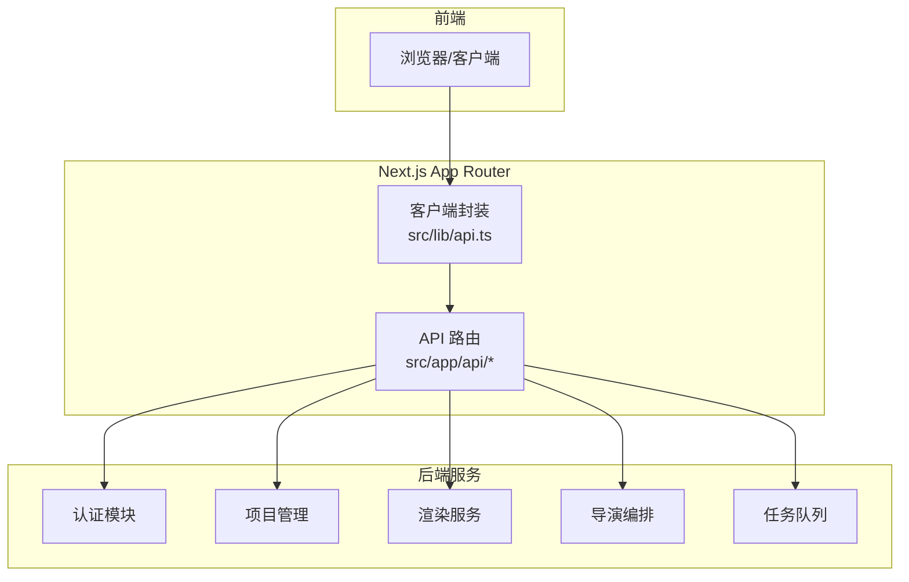
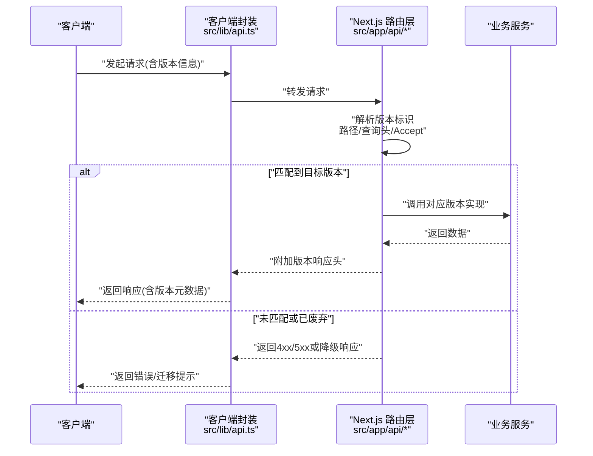
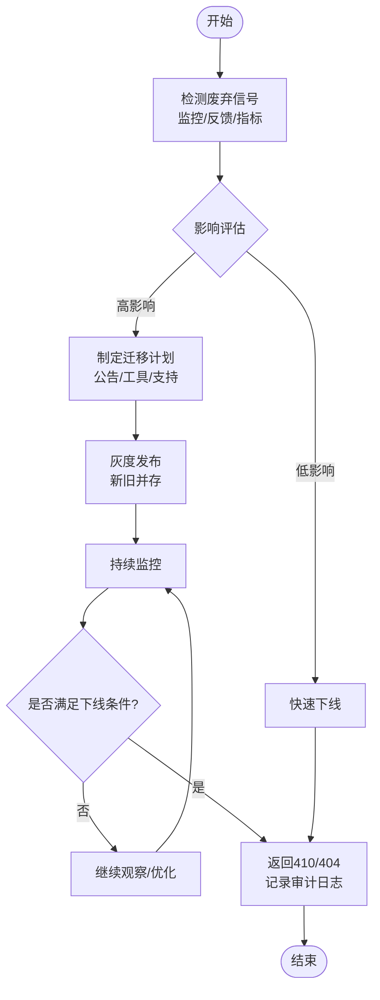
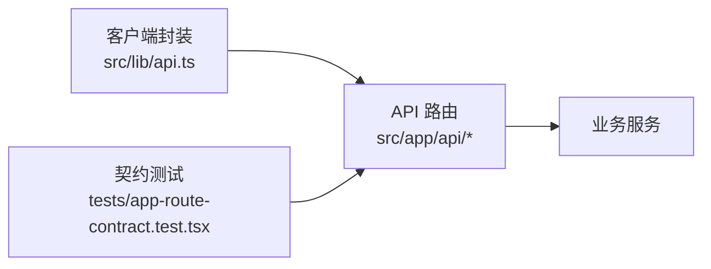

# API版本管理

<cite>
**本文引用的文件**   
- [src/app/api/artifacts/[id]/route.ts](file://src/app/api/artifacts/[id]/route.ts)
- [src/app/api/auth/login/route.ts](file://src/app/api/auth/login/route.ts)
- [src/app/api/auth/logout/route.ts](file://src/app/api/auth/logout/route.ts)
- [src/app/api/auth/signup/route.ts](file://src/app/api/auth/signup/route.ts)
- [src/app/api/director/pipeline/route.ts](file://src/app/api/director/pipeline/route.ts)
- [src/app/api/jobs/[id]/route.ts](file://src/app/api/jobs/[id]/route.ts)
- [src/app/api/projects/route.ts](file://src/app/api/projects/route.ts)
- [src/app/api/render/route.ts](file://src/app/api/render/route.ts)
- [src/app/api/settings/route.ts](file://src/app/api/settings/route.ts)
- [src/lib/api.ts](file://src/lib/api.ts)
- [tests/app-route-contract.test.tsx](file://tests/app-route-contract.test.tsx)
</cite>

## 目录
1. [简介](#简介)
2. [项目结构](#项目结构)
3. [核心组件](#核心组件)
4. [架构总览](#架构总览)
5. [详细组件分析](#详细组件分析)
6. [依赖分析](#依赖分析)
7. [性能考虑](#性能考虑)
8. [故障排查指南](#故障排查指南)
9. [结论](#结论)
10. [附录](#附录)

## 简介
本文件为 PurpleInk 项目的 API 版本管理规范与实施指南，覆盖版本策略、向后兼容性保证、废弃 API 处理、版本标识方法、路由设计、请求头约定、迁移流程、兼容性测试、灰度发布、客户端适配与升级最佳实践。目标是让前后端团队在演进 API 时保持一致性、可观测性与可控风险。

## 项目结构
本项目采用 Next.js App Router 的基于文件的 API 路由组织方式，API 入口位于 src/app/api 下，按功能域划分目录（如 auth、projects、render、director、jobs 等）。通用客户端封装位于 src/lib/api.ts，契约测试位于 tests 目录。

**图示来源** 
- [src/app/api/artifacts/[id]/route.ts](file://src/app/api/artifacts/[id]/route.ts)
- [src/app/api/auth/login/route.ts](file://src/app/api/auth/login/route.ts)
- [src/app/api/projects/route.ts](file://src/app/api/projects/route.ts)
- [src/app/api/render/route.ts](file://src/app/api/render/route.ts)
- [src/app/api/director/pipeline/route.ts](file://src/app/api/director/pipeline/route.ts)
- [src/app/api/jobs/[id]/route.ts](file://src/app/api/jobs/[id]/route.ts)
- [src/lib/api.ts](file://src/lib/api.ts)

**章节来源**
- [src/app/api/artifacts/[id]/route.ts](file://src/app/api/artifacts/[id]/route.ts)
- [src/app/api/auth/login/route.ts](file://src/app/api/auth/login/route.ts)
- [src/app/api/projects/route.ts](file://src/app/api/projects/route.ts)
- [src/app/api/render/route.ts](file://src/app/api/render/route.ts)
- [src/app/api/director/pipeline/route.ts](file://src/app/api/director/pipeline/route.ts)
- [src/app/api/jobs/[id]/route.ts](file://src/app/api/jobs/[id]/route.ts)
- [src/lib/api.ts](file://src/lib/api.ts)

## 核心组件
- API 路由层：每个业务域以独立 route.ts 暴露 RESTful 接口，便于按域进行版本化与治理。
- 客户端封装：统一的 HTTP 客户端封装，集中处理鉴权、重试、错误映射与版本协商。
- 契约测试：对关键路由进行端到端契约校验，保障变更不破坏既有行为。

**章节来源**
- [src/app/api/artifacts/[id]/route.ts](file://src/app/api/artifacts/[id]/route.ts)
- [src/app/api/auth/login/route.ts](file://src/app/api/auth/login/route.ts)
- [src/app/api/projects/route.ts](file://src/app/api/projects/route.ts)
- [src/app/api/render/route.ts](file://src/app/api/render/route.ts)
- [src/app/api/director/pipeline/route.ts](file://src/app/api/director/pipeline/route.ts)
- [src/app/api/jobs/[id]/route.ts](file://src/app/api/jobs/[id]/route.ts)
- [src/lib/api.ts](file://src/lib/api.ts)
- [tests/app-route-contract.test.tsx](file://tests/app-route-contract.test.tsx)

## 架构总览
下图展示从客户端到各业务路由的版本协商与分发流程，强调版本识别、兼容分支与响应头标注。

**图示来源** 
- [src/lib/api.ts](file://src/lib/api.ts)
- [src/app/api/auth/login/route.ts](file://src/app/api/auth/login/route.ts)
- [src/app/api/projects/route.ts](file://src/app/api/projects/route.ts)
- [src/app/api/render/route.ts](file://src/app/api/render/route.ts)
- [src/app/api/director/pipeline/route.ts](file://src/app/api/director/pipeline/route.ts)
- [src/app/api/jobs/[id]/route.ts](file://src/app/api/jobs/[id]/route.ts)

## 详细组件分析

### 版本策略与标识方法
- 版本标识优先级（建议）：
  - 路径前缀：/api/v1/...（最明确，推荐对外公开 API）
  - 查询参数：?version=2024-01-01（适合 A/B 或特性开关）
  - 请求头：X-API-Version、Accept 中的 vendor 媒体类型（适合内部或强约束场景）
- 默认版本：服务端应维护一个“当前稳定版”，未显式指定时回退至该版本。
- 废弃策略：
  - 标记废弃：通过响应头告知客户端即将移除的时间点。
  - 过渡期：至少保留两个大版本并行运行，提供迁移指引。
  - 强制下线：达到弃用期限后返回明确的 410 Gone 或 404 Not Found，并附带迁移文档链接。

**章节来源**
- [src/lib/api.ts](file://src/lib/api.ts)
- [tests/app-route-contract.test.tsx](file://tests/app-route-contract.test.tsx)

### 路由设计与命名规范
- 资源导向：使用名词复数表示资源，动词放在 HTTP 方法上。
- 版本隔离：新版本优先新增路由路径，避免修改旧路由语义。
- 幂等与安全：GET/HEAD/DELETE 幂等；POST/PUT/PATCH 注意幂等键与校验。
- 错误码：遵循标准 HTTP 状态码，结合领域错误码细化。

**章节来源**
- [src/app/api/projects/route.ts](file://src/app/api/projects/route.ts)
- [src/app/api/render/route.ts](file://src/app/api/render/route.ts)
- [src/app/api/director/pipeline/route.ts](file://src/app/api/director/pipeline/route.ts)
- [src/app/api/jobs/[id]/route.ts](file://src/app/api/jobs/[id]/route.ts)

### 请求头与响应头约定
- 版本相关请求头：
  - X-API-Version：客户端声明期望的版本
  - Accept：可包含供应商媒体类型用于版本协商
- 版本相关响应头：
  - X-API-Version：服务端实际使用的版本
  - Deprecation：指示字段或接口是否废弃及下线时间
  - Sunset：废弃接口的最终下线日期
- 其他通用头：
  - Authorization：Bearer Token
  - Content-Type：application/json
  - X-Request-Id：追踪请求链路

**章节来源**
- [src/lib/api.ts](file://src/lib/api.ts)

### 向后兼容性保证
- 允许新增字段，禁止删除或重命名已有字段。
- 枚举值只能追加，不能修改或删除。
- 默认值必须稳定，不可因环境变化而改变。
- 错误响应结构保持稳定，新增错误码需保持兼容。

**章节来源**
- [tests/app-route-contract.test.tsx](file://tests/app-route-contract.test.tsx)

### 废弃 API 处理流程
- 发现废弃：通过监控告警、客户端反馈、指标下降识别。
- 评估影响：统计调用方分布、流量占比、替代方案成熟度。
- 灰度发布：逐步放量新实现，同时保留旧实现。
- 通知与迁移：向调用方发送迁移公告，提供 SDK/工具辅助。
- 下线：到达 Sunset 日期后返回 410/404 并记录审计日志。

[无图示来源，因为该图为概念流程]

### 客户端适配策略与升级最佳实践
- 客户端能力探测：先尝试新版，失败自动回退旧版。
- 配置中心：将版本选择与特性开关纳入配置管理。
- 渐进式升级：小步快跑，每次只引入有限变更。
- 兼容层：在客户端增加适配层，屏蔽服务端差异。
- 自动化回归：CI 中集成契约测试与兼容性用例。

**章节来源**
- [src/lib/api.ts](file://src/lib/api.ts)
- [tests/app-route-contract.test.tsx](file://tests/app-route-contract.test.tsx)

### 关键路由示例分析
- 认证路由：登录、登出、注册等接口需严格版本控制，确保会话与权限模型一致。
- 项目与渲染：涉及复杂数据结构与长任务，需保证分页、状态码、错误体稳定。
- 导演编排：工作流节点与阶段定义变更需保持向前兼容。
- 任务查询：任务生命周期状态机变更需谨慎，避免破坏客户端状态机。

**章节来源**
- [src/app/api/auth/login/route.ts](file://src/app/api/auth/login/route.ts)
- [src/app/api/auth/logout/route.ts](file://src/app/api/auth/logout/route.ts)
- [src/app/api/auth/signup/route.ts](file://src/app/api/auth/signup/route.ts)
- [src/app/api/projects/route.ts](file://src/app/api/projects/route.ts)
- [src/app/api/render/route.ts](file://src/app/api/render/route.ts)
- [src/app/api/director/pipeline/route.ts](file://src/app/api/director/pipeline/route.ts)
- [src/app/api/jobs/[id]/route.ts](file://src/app/api/jobs/[id]/route.ts)

## 依赖分析
- 路由层依赖业务服务，客户端封装统一处理版本协商与错误映射。
- 契约测试覆盖关键路由，降低回归风险。
- 外部依赖（数据库、对象存储、第三方服务）变更需通过适配器隔离，避免影响 API 契约。

**图示来源** 
- [src/lib/api.ts](file://src/lib/api.ts)
- [tests/app-route-contract.test.tsx](file://tests/app-route-contract.test.tsx)
- [src/app/api/projects/route.ts](file://src/app/api/projects/route.ts)
- [src/app/api/render/route.ts](file://src/app/api/render/route.ts)
- [src/app/api/director/pipeline/route.ts](file://src/app/api/director/pipeline/route.ts)
- [src/app/api/jobs/[id]/route.ts](file://src/app/api/jobs/[id]/route.ts)

**章节来源**
- [src/lib/api.ts](file://src/lib/api.ts)
- [tests/app-route-contract.test.tsx](file://tests/app-route-contract.test.tsx)
- [src/app/api/projects/route.ts](file://src/app/api/projects/route.ts)
- [src/app/api/render/route.ts](file://src/app/api/render/route.ts)
- [src/app/api/director/pipeline/route.ts](file://src/app/api/director/pipeline/route.ts)
- [src/app/api/jobs/[id]/route.ts](file://src/app/api/jobs/[id]/route.ts)

## 性能考虑
- 版本路由解析开销：尽量在网关或中间件完成版本识别，减少路由层计算。
- 缓存策略：对读多写少的接口启用缓存，版本变更时需清理相关缓存键。
- 限流与熔断：针对高频接口设置限流，异常时快速失败，保护下游。
- 监控与可观测性：采集版本维度指标，便于定位问题与评估迁移效果。

[本节为通用指导，无需特定文件引用]

## 故障排查指南
- 常见问题：
  - 版本协商失败：检查请求头与路径是否正确，确认服务端支持的版本列表。
  - 兼容性问题：对比契约测试报告，定位字段缺失或类型变更。
  - 废弃接口访问：根据响应头 Deprecation/Sunset 调整客户端逻辑。
- 排查步骤：
  - 查看请求链路日志（X-Request-Id）。
  - 核对版本协商结果与实际调用路由。
  - 回放请求，验证响应结构与状态码。
  - 更新客户端适配层并回归测试。

**章节来源**
- [src/lib/api.ts](file://src/lib/api.ts)
- [tests/app-route-contract.test.tsx](file://tests/app-route-contract.test.tsx)

## 结论
通过明确版本策略、严格的向后兼容性保证、完善的废弃处理流程以及自动化契约测试，PurpleInk 能够在保持 API 稳定的同时持续演进。配合灰度发布与客户端适配策略，可显著降低升级风险，提升系统整体可靠性与用户体验。

[本节为总结，无需特定文件引用]

## 附录
- 版本迁移清单：
  - 更新路由与请求/响应结构
  - 补充版本协商与错误处理
  - 扩展契约测试用例
  - 更新客户端适配层与配置
  - 灰度发布与监控验证
- 常用命令与脚本：
  - 运行契约测试：执行 tests 下的契约测试套件
  - 本地联调：启动 Next.js 服务，使用客户端封装进行端到端验证

[本节为操作参考，无需特定文件引用]