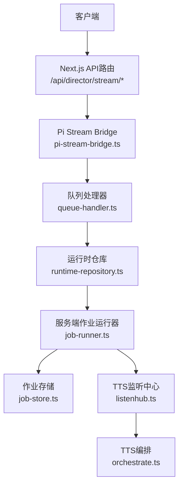
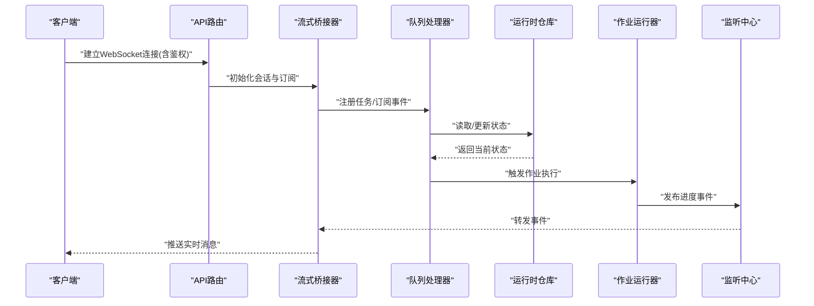
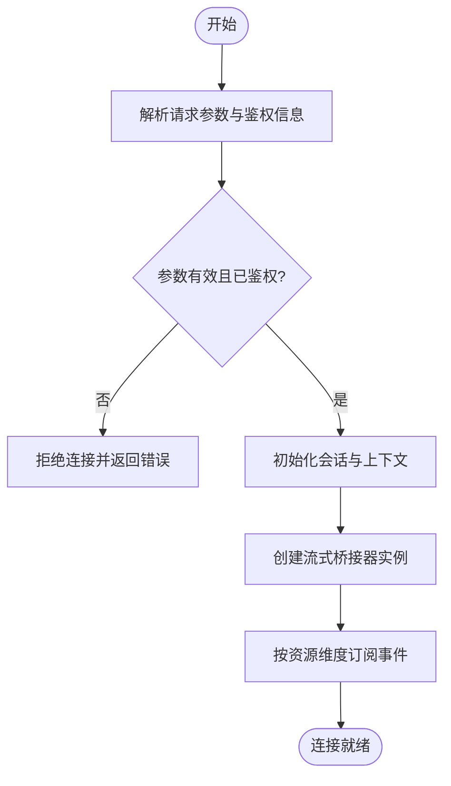
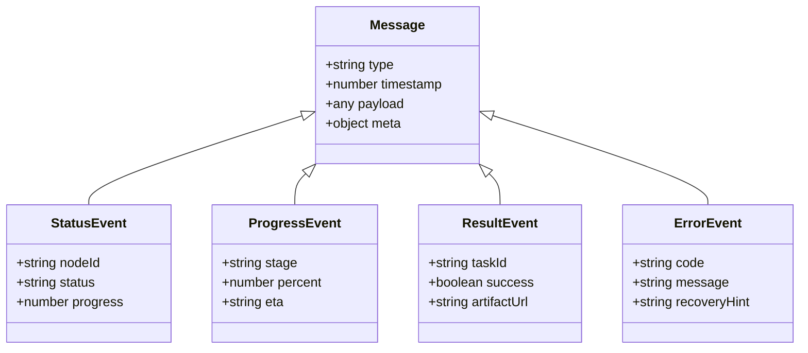
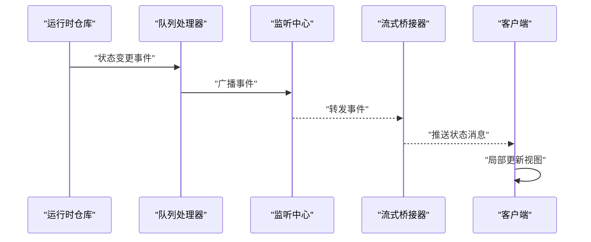
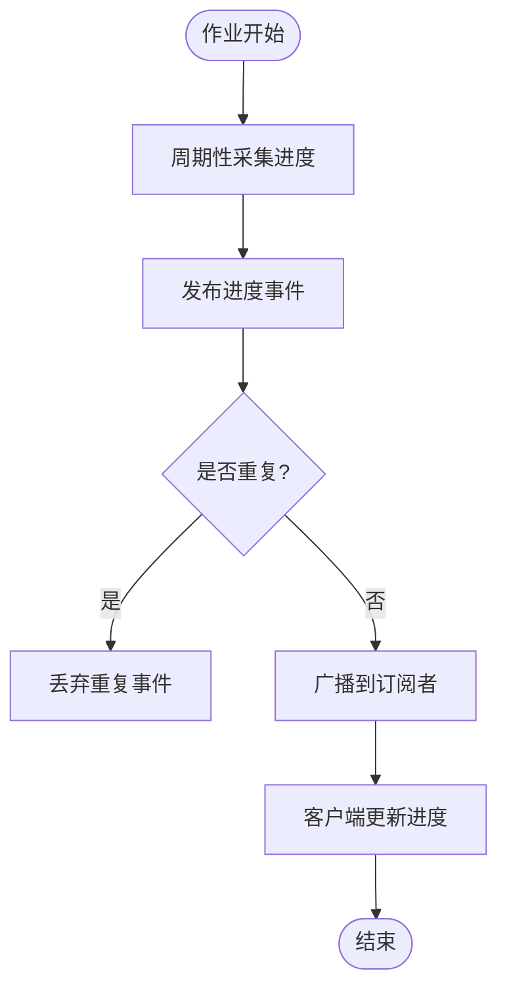
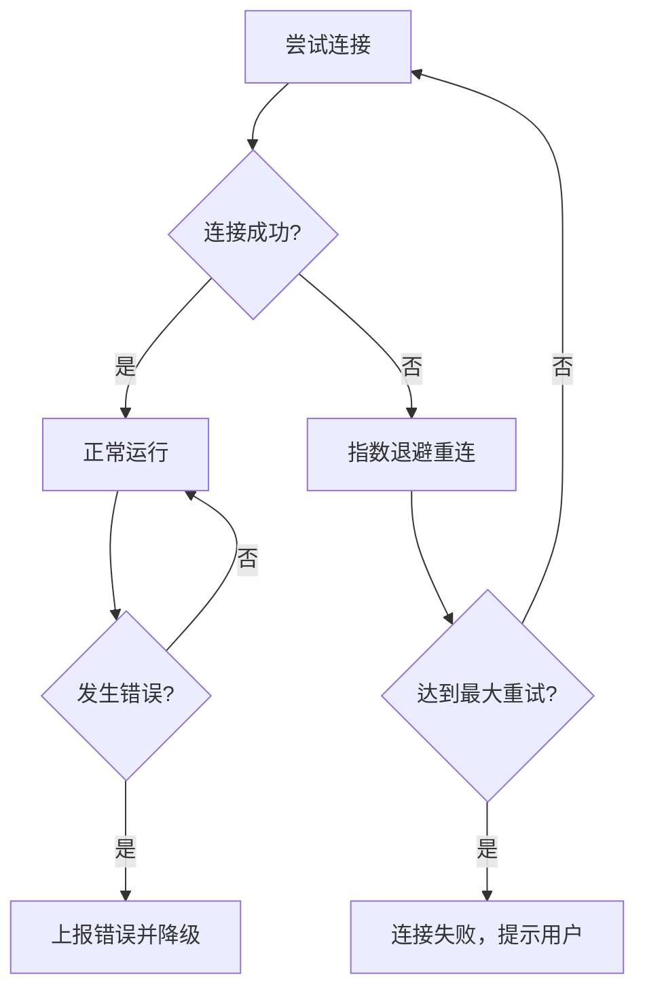
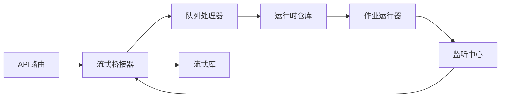

# WebSocket接口

<cite>
**本文档引用的文件**   
- [src/app/api/director/stream/[nodeId]/route.ts](file://src/app/api/director/stream/[nodeId]/route.ts)
- [src/app/api/director/stream/project/[projectId]/route.ts](file://src/app/api/director/stream/project/[projectId]/route.ts)
- [src/features/director/pi-stream-bridge.ts](file://src/features/director/pi-stream-bridge.ts)
- [src/features/director/queue-handler.ts](file://src/features/director/queue-handler.ts)
- [src/features/director/runtime-repository.ts](file://src/features/director/runtime-repository.ts)
- [src/lib/stream/index.ts](file://src/lib/stream/index.ts)
- [src/lib/stream/types.ts](file://src/lib/stream/types.ts)
- [server/src/tts/listenhub.ts](file://server/src/tts/listenhub.ts)
- [server/src/tts/orchestrate.ts](file://server/src/tts/orchestrate.ts)
- [server/src/server/job-runner.ts](file://server/src/server/job-runner.ts)
- [server/src/server/job-store.ts](file://server/src/server/job-store.ts)
- [server/src/index.ts](file://server/src/index.ts)
</cite>

## 目录
1. [简介](#简介)
2. [项目结构](#项目结构)
3. [核心组件](#核心组件)
4. [架构总览](#架构总览)
5. [详细组件分析](#详细组件分析)
6. [依赖关系分析](#依赖关系分析)
7. [性能考虑](#性能考虑)
8. [故障排查指南](#故障排查指南)
9. [结论](#结论)
10. [附录](#附录)

## 简介
本文件面向需要集成或扩展实时通信能力的开发者，系统化说明本项目中WebSocket相关接口的连接建立、认证流程、消息协议、事件类型与使用场景。重点覆盖：
- 连接建立与鉴权
- 实时状态同步（渲染/编排进度）
- 协作编辑（多端一致性与冲突处理思路）
- 进度推送（阶段推进、任务完成通知）
- 错误处理、重连机制与性能优化建议

## 项目结构
本项目采用前后端分离的Next.js应用，后端服务位于server目录，前端API路由位于src/app/api。与WebSocket相关的实现主要分布在以下位置：
- API层：提供HTTP入口并桥接到流式处理
- 业务层：编排器、队列处理器、运行时仓库
- 流式库：通用流式能力封装
- 服务端：TTS监听中心、作业调度与持久化

**图示来源** 
- [src/app/api/director/stream/[nodeId]/route.ts](file://src/app/api/director/stream/[nodeId]/route.ts)
- [src/app/api/director/stream/project/[projectId]/route.ts](file://src/app/api/director/stream/project/[projectId]/route.ts)
- [src/features/director/pi-stream-bridge.ts](file://src/features/director/pi-stream-bridge.ts)
- [src/features/director/queue-handler.ts](file://src/features/director/queue-handler.ts)
- [src/features/director/runtime-repository.ts](file://src/features/director/runtime-repository.ts)
- [server/src/server/job-runner.ts](file://server/src/server/job-runner.ts)
- [server/src/server/job-store.ts](file://server/src/server/job-store.ts)
- [server/src/tts/listenhub.ts](file://server/src/tts/listenhub.ts)
- [server/src/tts/orchestrate.ts](file://server/src/tts/orchestrate.ts)

**章节来源**
- [src/app/api/director/stream/[nodeId]/route.ts](file://src/app/api/director/stream/[nodeId]/route.ts)
- [src/app/api/director/stream/project/[projectId]/route.ts](file://src/app/api/director/stream/project/[projectId]/route.ts)
- [src/features/director/pi-stream-bridge.ts](file://src/features/director/pi-stream-bridge.ts)
- [src/features/director/queue-handler.ts](file://src/features/director/queue-handler.ts)
- [src/features/director/runtime-repository.ts](file://src/features/director/runtime-repository.ts)
- [server/src/server/job-runner.ts](file://server/src/server/job-runner.ts)
- [server/src/server/job-store.ts](file://server/src/server/job-store.ts)
- [server/src/tts/listenhub.ts](file://server/src/tts/listenhub.ts)
- [server/src/tts/orchestrate.ts](file://server/src/tts/orchestrate.ts)

## 核心组件
- 流式桥接器（Pi Stream Bridge）：负责将上游事件转换为统一的流式消息格式，并推送到下游订阅者
- 队列处理器（Queue Handler）：管理任务入队、出队、重试与并发控制，确保稳定推进
- 运行时仓库（Runtime Repository）：维护节点/项目的运行时状态，支持查询与更新
- 作业运行器（Job Runner）：执行具体作业（如TTS合成、渲染），并通过监听中心广播进度
- 监听中心（Listen Hub）：集中管理事件订阅与分发，解耦生产者与消费者
- 流式库（Stream Lib）：提供通用的流式读写、缓冲与背压处理能力

**章节来源**
- [src/features/director/pi-stream-bridge.ts](file://src/features/director/pi-stream-bridge.ts)
- [src/features/director/queue-handler.ts](file://src/features/director/queue-handler.ts)
- [src/features/director/runtime-repository.ts](file://src/features/director/runtime-repository.ts)
- [server/src/server/job-runner.ts](file://server/src/server/job-runner.ts)
- [server/src/tts/listenhub.ts](file://server/src/tts/listenhub.ts)
- [src/lib/stream/index.ts](file://src/lib/stream/index.ts)

## 架构总览
整体采用“API路由 -> 桥接器 -> 队列 -> 运行时 -> 作业运行器 -> 监听中心”的分层架构，保证职责清晰、可扩展性强。

**图示来源** 
- [src/app/api/director/stream/[nodeId]/route.ts](file://src/app/api/director/stream/[nodeId]/route.ts)
- [src/app/api/director/stream/project/[projectId]/route.ts](file://src/app/api/director/stream/project/[projectId]/route.ts)
- [src/features/director/pi-stream-bridge.ts](file://src/features/director/pi-stream-bridge.ts)
- [src/features/director/queue-handler.ts](file://src/features/director/queue-handler.ts)
- [src/features/director/runtime-repository.ts](file://src/features/director/runtime-repository.ts)
- [server/src/server/job-runner.ts](file://server/src/server/job-runner.ts)
- [server/src/tts/listenhub.ts](file://server/src/tts/listenhub.ts)

## 详细组件分析

### 连接建立与认证流程
- 客户端通过API路由发起WebSocket连接，携带必要的鉴权参数（如令牌或会话标识）
- API路由校验身份后，创建或复用会话上下文，并初始化流式桥接器
- 桥接器根据请求参数（节点ID或项目ID）建立对应的订阅通道
- 若鉴权失败或参数缺失，立即关闭连接并返回错误码

**图示来源** 
- [src/app/api/director/stream/[nodeId]/route.ts](file://src/app/api/director/stream/[nodeId]/route.ts)
- [src/app/api/director/stream/project/[projectId]/route.ts](file://src/app/api/director/stream/project/[projectId]/route.ts)
- [src/features/director/pi-stream-bridge.ts](file://src/features/director/pi-stream-bridge.ts)

**章节来源**
- [src/app/api/director/stream/[nodeId]/route.ts](file://src/app/api/director/stream/[nodeId]/route.ts)
- [src/app/api/director/stream/project/[projectId]/route.ts](file://src/app/api/director/stream/project/[projectId]/route.ts)
- [src/features/director/pi-stream-bridge.ts](file://src/features/director/pi-stream-bridge.ts)

### 消息协议与事件类型
- 消息体采用统一结构，包含类型字段、时间戳、数据载荷与可选元数据
- 事件类型包括：
  - 状态变更：节点/项目状态更新
  - 进度推送：阶段推进百分比、预计完成时间
  - 结果通知：任务成功/失败、产物URL
  - 错误上报：异常代码、错误描述、恢复建议
- 客户端应基于类型字段进行分派处理，忽略未知类型以保证向前兼容

**图示来源** 
- [src/lib/stream/types.ts](file://src/lib/stream/types.ts)
- [src/features/director/pi-stream-bridge.ts](file://src/features/director/pi-stream-bridge.ts)

**章节来源**
- [src/lib/stream/types.ts](file://src/lib/stream/types.ts)
- [src/features/director/pi-stream-bridge.ts](file://src/features/director/pi-stream-bridge.ts)

### 实时状态同步
- 运行时仓库维护节点与项目的最新状态，支持增量更新
- 队列处理器在状态变化时触发事件，经监听中心广播给所有订阅者
- 客户端收到状态事件后，局部更新UI，避免全量刷新

**图示来源** 
- [src/features/director/runtime-repository.ts](file://src/features/director/runtime-repository.ts)
- [src/features/director/queue-handler.ts](file://src/features/director/queue-handler.ts)
- [server/src/tts/listenhub.ts](file://server/src/tts/listenhub.ts)
- [src/features/director/pi-stream-bridge.ts](file://src/features/director/pi-stream-bridge.ts)

**章节来源**
- [src/features/director/runtime-repository.ts](file://src/features/director/runtime-repository.ts)
- [src/features/director/queue-handler.ts](file://src/features/director/queue-handler.ts)
- [server/src/tts/listenhub.ts](file://server/src/tts/listenhub.ts)
- [src/features/director/pi-stream-bridge.ts](file://src/features/director/pi-stream-bridge.ts)

### 协作编辑（概念性说明）
- 多端操作通过事件溯源与CRDT思路保证一致性
- 服务端对冲突进行合并策略处理，优先以时间戳与操作类型决定最终状态
- 客户端本地缓存乐观更新，收到服务端确认后再回滚或修正

[本节为概念性说明，不直接分析具体文件]

### 进度推送
- 作业运行器在执行过程中周期性发布进度事件
- 监听中心聚合并去重，避免重复推送
- 客户端展示进度条与ETA，提升用户体验

**图示来源** 
- [server/src/server/job-runner.ts](file://server/src/server/job-runner.ts)
- [server/src/tts/listenhub.ts](file://server/src/tts/listenhub.ts)

**章节来源**
- [server/src/server/job-runner.ts](file://server/src/server/job-runner.ts)
- [server/src/tts/listenhub.ts](file://server/src/tts/listenhub.ts)

### 错误处理与重连机制
- 连接层捕获网络异常，记录日志并触发重连
- 重连策略采用指数退避，限制最大重试次数
- 业务层错误通过统一错误事件上报，客户端可提示用户或自动重试

**图示来源** 
- [src/lib/stream/index.ts](file://src/lib/stream/index.ts)
- [server/src/index.ts](file://server/src/index.ts)

**章节来源**
- [src/lib/stream/index.ts](file://src/lib/stream/index.ts)
- [server/src/index.ts](file://server/src/index.ts)

## 依赖关系分析
- API路由依赖流式桥接器，桥接器依赖队列处理器与运行时仓库
- 作业运行器依赖监听中心，监听中心解耦各模块的事件消费
- 流式库为底层能力支撑，提供缓冲、背压与序列化

**图示来源** 
- [src/app/api/director/stream/[nodeId]/route.ts](file://src/app/api/director/stream/[nodeId]/route.ts)
- [src/app/api/director/stream/project/[projectId]/route.ts](file://src/app/api/director/stream/project/[projectId]/route.ts)
- [src/features/director/pi-stream-bridge.ts](file://src/features/director/pi-stream-bridge.ts)
- [src/features/director/queue-handler.ts](file://src/features/director/queue-handler.ts)
- [src/features/director/runtime-repository.ts](file://src/features/director/runtime-repository.ts)
- [server/src/server/job-runner.ts](file://server/src/server/job-runner.ts)
- [server/src/tts/listenhub.ts](file://server/src/tts/listenhub.ts)
- [src/lib/stream/index.ts](file://src/lib/stream/index.ts)

**章节来源**
- [src/app/api/director/stream/[nodeId]/route.ts](file://src/app/api/director/stream/[nodeId]/route.ts)
- [src/app/api/director/stream/project/[projectId]/route.ts](file://src/app/api/director/stream/project/[projectId]/route.ts)
- [src/features/director/pi-stream-bridge.ts](file://src/features/director/pi-stream-bridge.ts)
- [src/features/director/queue-handler.ts](file://src/features/director/queue-handler.ts)
- [src/features/director/runtime-repository.ts](file://src/features/director/runtime-repository.ts)
- [server/src/server/job-runner.ts](file://server/src/server/job-runner.ts)
- [server/src/tts/listenhub.ts](file://server/src/tts/listenhub.ts)
- [src/lib/stream/index.ts](file://src/lib/stream/index.ts)

## 性能考虑
- 使用背压机制防止消息堆积，必要时限流或丢弃低优先级事件
- 批量发送与合并相似事件，减少网络开销
- 连接池与会话复用，降低握手成本
- 服务端异步化处理，避免阻塞主线程
- 客户端增量更新，避免全量渲染

[本节为通用指导，不直接分析具体文件]

## 故障排查指南
- 检查鉴权参数是否正确传递，确认会话是否有效
- 查看服务器日志，定位错误事件的具体原因
- 验证订阅通道是否与资源ID匹配
- 监控队列长度与作业执行耗时，识别瓶颈
- 客户端重连策略是否合理，避免风暴效应

**章节来源**
- [server/src/server/job-runner.ts](file://server/src/server/job-runner.ts)
- [server/src/server/job-store.ts](file://server/src/server/job-store.ts)
- [server/src/tts/listenhub.ts](file://server/src/tts/listenhub.ts)

## 结论
本项目通过分层架构与事件驱动模式实现了高效可靠的WebSocket实时通信。API路由负责接入与鉴权，桥接器与队列处理器保障消息流转，运行时仓库与作业运行器驱动业务逻辑，监听中心解耦事件生产与消费。结合流式库提供的底层能力，系统具备良好的扩展性与稳定性。建议在生产环境中加强监控、限流与错误恢复机制，以提升整体可靠性。

[本节为总结性内容，不直接分析具体文件]

## 附录
- 连接示例：参考API路由文件中的连接处理逻辑
- 消息格式：参考流式类型定义文件
- 错误处理：参考作业运行器与监听中心的错误上报逻辑
- 重连机制：参考流式库的重试策略实现

[本节为指引性内容，不直接分析具体文件]