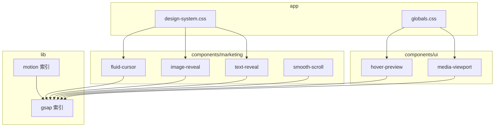
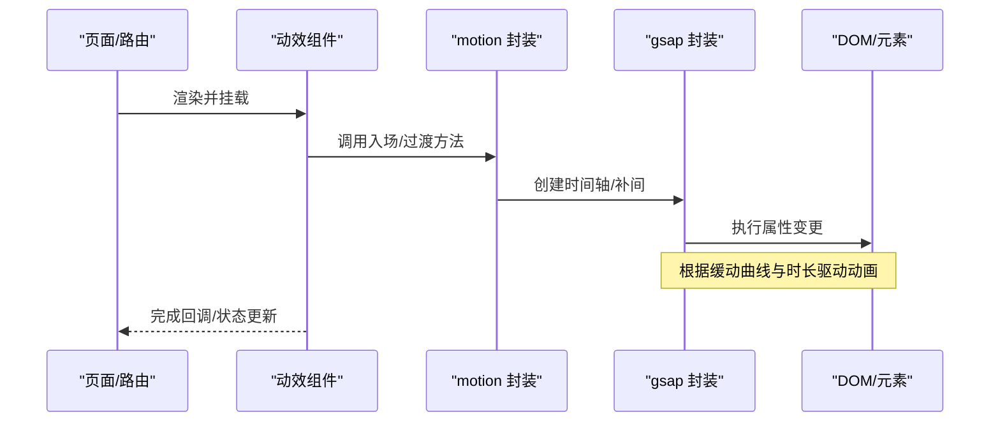
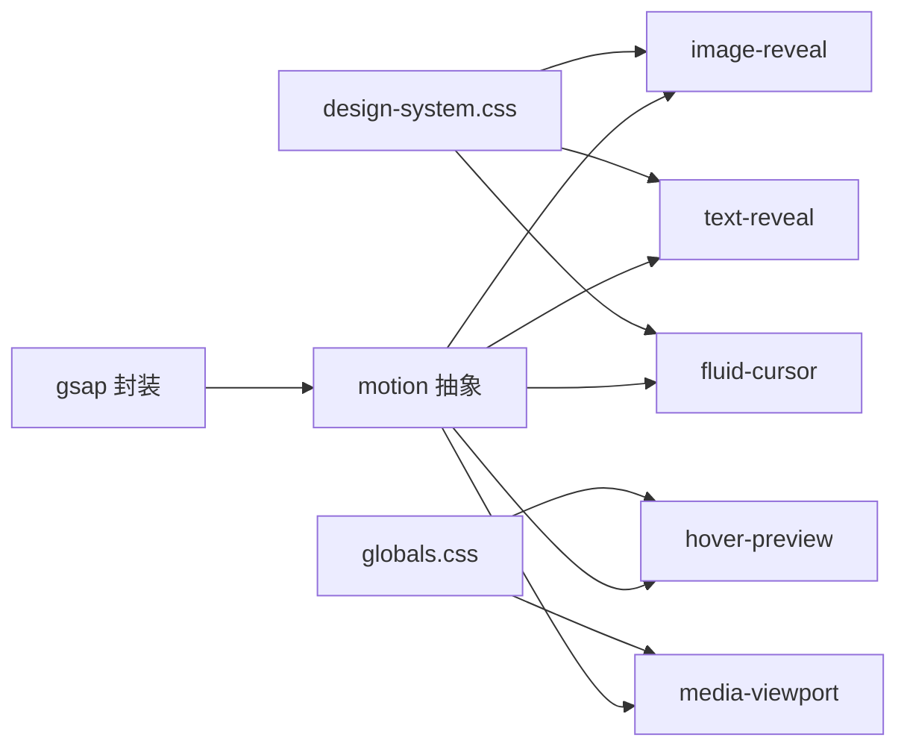

# 动画与运动规范

<cite>
**本文引用的文件**   
- [src/lib/motion/index.ts](file://src/lib/motion/index.ts)
- [src/lib/gsap/index.ts](file://src/lib/gsap/index.ts)
- [src/components/marketing/fluid-cursor.tsx](file://src/components/marketing/fluid-cursor.tsx)
- [src/components/marketing/image-reveal.tsx](file://src/components/marketing/image-reveal.tsx)
- [src/components/marketing/text-reveal.tsx](file://src/components/marketing/text-reveal.tsx)
- [src/components/marketing/smooth-scroll.tsx](file://src/components/marketing/smooth-scroll.tsx)
- [src/components/ui/hover-preview.tsx](file://src/components/ui/hover-preview.tsx)
- [src/components/ui/media-viewport.tsx](file://src/components/ui/media-viewport.tsx)
- [src/app/design-system.css](file://src/app/design-system.css)
- [src/app/globals.css](file://src/app/globals.css)
</cite>

## 目录
1. [简介](#简介)
2. [项目结构](#项目结构)
3. [核心组件](#核心组件)
4. [架构总览](#架构总览)
5. [详细组件分析](#详细组件分析)
6. [依赖关系分析](#依赖关系分析)
7. [性能考量](#性能考量)
8. [故障排查指南](#故障排查指南)
9. [结论](#结论)
10. [附录](#附录)

## 简介
本规范聚焦于项目的“动画与运动”体系，涵盖：
- 统一的动画库封装（GSAP）与基础能力暴露
- 营销页面与通用 UI 的动效组件实现
- 全局样式与 CSS 变量对动效的影响
- 性能优化、可访问性与一致性实践

目标读者包括前端开发者、UI/UX 设计师与内容创作者，帮助他们在统一规范下高效构建一致的动效体验。

## 项目结构
动画与运动相关代码主要分布在以下位置：
- lib 层：提供动画库封装与工具能力
- components/marketing：面向营销页面的动效组件
- components/ui：通用 UI 组件中的交互动效
- app 层：全局样式与动效相关的 CSS 变量

图表来源
- [src/lib/motion/index.ts](file://src/lib/motion/index.ts)
- [src/lib/gsap/index.ts](file://src/lib/gsap/index.ts)
- [src/components/marketing/fluid-cursor.tsx](file://src/components/marketing/fluid-cursor.tsx)
- [src/components/marketing/image-reveal.tsx](file://src/components/marketing/image-reveal.tsx)
- [src/components/marketing/text-reveal.tsx](file://src/components/marketing/text-reveal.tsx)
- [src/components/marketing/smooth-scroll.tsx](file://src/components/marketing/smooth-scroll.tsx)
- [src/components/ui/hover-preview.tsx](file://src/components/ui/hover-preview.tsx)
- [src/components/ui/media-viewport.tsx](file://src/components/ui/media-viewport.tsx)
- [src/app/design-system.css](file://src/app/design-system.css)
- [src/app/globals.css](file://src/app/globals.css)

章节来源
- [src/lib/motion/index.ts](file://src/lib/motion/index.ts)
- [src/lib/gsap/index.ts](file://src/lib/gsap/index.ts)
- [src/components/marketing/fluid-cursor.tsx](file://src/components/marketing/fluid-cursor.tsx)
- [src/components/marketing/image-reveal.tsx](file://src/components/marketing/image-reveal.tsx)
- [src/components/marketing/text-reveal.tsx](file://src/components/marketing/text-reveal.tsx)
- [src/components/marketing/smooth-scroll.tsx](file://src/components/marketing/smooth-scroll.tsx)
- [src/components/ui/hover-preview.tsx](file://src/components/ui/hover-preview.tsx)
- [src/components/ui/media-viewport.tsx](file://src/components/ui/media-viewport.tsx)
- [src/app/design-system.css](file://src/app/design-system.css)
- [src/app/globals.css](file://src/app/globals.css)

## 核心组件
- GSAP 封装（lib/gsap）
  - 职责：集中注册插件、配置默认缓动与时间轴行为，对外暴露统一的动画 API
  - 关键点：避免重复初始化、保证跨组件一致的时间线行为
- Motion 索引（lib/motion）
  - 职责：聚合常用动效能力（如入场、过渡、滚动驱动），为上层组件提供简洁接口
  - 关键点：参数标准化、生命周期管理（挂载/卸载时清理）
- 营销动效组件（marketing）
  - fluid-cursor：跟随鼠标的流体光标效果，强调品牌感与沉浸感
  - image-reveal：图片揭示动画，常用于首屏或重点展示
  - text-reveal：文本逐字/逐行揭示，提升阅读节奏
  - smooth-scroll：平滑滚动与锚点联动，改善导航体验
- 通用 UI 动效（ui）
  - hover-preview：悬停预览的缩放/位移/遮罩等微交互
  - media-viewport：媒体视口内的缩放、平移与边界约束

章节来源
- [src/lib/gsap/index.ts](file://src/lib/gsap/index.ts)
- [src/lib/motion/index.ts](file://src/lib/motion/index.ts)
- [src/components/marketing/fluid-cursor.tsx](file://src/components/marketing/fluid-cursor.tsx)
- [src/components/marketing/image-reveal.tsx](file://src/components/marketing/image-reveal.tsx)
- [src/components/marketing/text-reveal.tsx](file://src/components/marketing/text-reveal.tsx)
- [src/components/marketing/smooth-scroll.tsx](file://src/components/marketing/smooth-scroll.tsx)
- [src/components/ui/hover-preview.tsx](file://src/components/ui/hover-preview.tsx)
- [src/components/ui/media-viewport.tsx](file://src/components/ui/media-viewport.tsx)

## 架构总览
动画系统采用“库封装 + 组件化 + 样式驱动”的分层设计：
- 底层：GSAP 统一入口，屏蔽版本差异与插件注册
- 中间层：motion 抽象出常用动效模式，降低使用复杂度
- 表现层：营销与 UI 组件按需组合 motion/GSAP，配合 CSS 变量控制主题与节奏

图表来源
- [src/lib/motion/index.ts](file://src/lib/motion/index.ts)
- [src/lib/gsap/index.ts](file://src/lib/gsap/index.ts)
- [src/components/marketing/image-reveal.tsx](file://src/components/marketing/image-reveal.tsx)
- [src/components/ui/hover-preview.tsx](file://src/components/ui/hover-preview.tsx)

## 详细组件分析

### GSAP 封装（lib/gsap）
- 设计要点
  - 单例式初始化，避免重复注册插件
  - 统一默认缓动与时间轴配置，确保全局一致性
  - 暴露 createTimeline、from/to/tween 等便捷方法
- 使用建议
  - 在组件挂载时创建时间轴，卸载时销毁
  - 通过参数覆盖默认缓动，保持风格统一

章节来源
- [src/lib/gsap/index.ts](file://src/lib/gsap/index.ts)

### Motion 抽象（lib/motion）
- 设计要点
  - 将常见动效抽象为函数：fadeIn、slideUp、staggerText、scrollReveal 等
  - 统一参数：duration、delay、easing、onComplete、onCancel
  - 自动处理元素存在性检查与无效状态
- 使用建议
  - 优先使用 motion 提供的组合方法，减少重复逻辑
  - 对复杂场景再下沉到 GSAP 原生 API

章节来源
- [src/lib/motion/index.ts](file://src/lib/motion/index.ts)

### 流体光标（marketing/fluid-cursor）
- 功能概述
  - 基于鼠标移动轨迹生成平滑跟随的光标
  - 支持颜色、半径、延迟与阻尼等可调参数
- 关键流程
  - 监听 pointermove → 计算目标位置 → GSAP 驱动 transform
  - 防抖/节流与 requestAnimationFrame 协同，降低抖动
- 注意事项
  - 移动端禁用或降级为静态指示器
  - 注意与页面滚动、固定定位元素的层级关系

章节来源
- [src/components/marketing/fluid-cursor.tsx](file://src/components/marketing/fluid-cursor.tsx)
- [src/app/design-system.css](file://src/app/design-system.css)

### 图片揭示（marketing/image-reveal）
- 功能概述
  - 以遮罩或裁剪路径的方式逐步显示图片
  - 支持多种揭示方向与触发时机（进入视口/点击）
- 关键流程
  - 计算初始/结束几何状态 → 创建时间轴 → 同步 clip-path/transform
  - 结合 IntersectionObserver 控制触发
- 注意事项
  - 大图需考虑性能，必要时使用占位图与懒加载
  - 多张图片同时揭示时需错开 stagger

章节来源
- [src/components/marketing/image-reveal.tsx](file://src/components/marketing/image-reveal.tsx)
- [src/app/design-system.css](file://src/app/design-system.css)

### 文本揭示（marketing/text-reveal）
- 功能概述
  - 按字符/单词/行进行揭示，营造节奏感
  - 支持交错延迟与自定义分隔符
- 关键流程
  - 拆分文本节点 → 为每个片段创建补间 → 统一时间轴编排
  - 可接入滚动驱动，随滚动进度推进
- 注意事项
  - 长文本需限制最大行数，避免重排开销
  - 无障碍：确保屏幕阅读器能读取完整文本

章节来源
- [src/components/marketing/text-reveal.tsx](file://src/components/marketing/text-reveal.tsx)
- [src/app/design-system.css](file://src/app/design-system.css)

### 平滑滚动（marketing/smooth-scroll）
- 功能概述
  - 平滑跳转至锚点或指定偏移量
  - 支持惯性滚动与边界回弹
- 关键流程
  - 拦截 click/hashchange → 计算目标位置 → GSAP 驱动 scrollTop
  - 监听滚动事件，取消冲突动画
- 注意事项
  - 与浏览器原生滚动行为冲突时需降级
  - 长页面需分段采样，避免卡顿

章节来源
- [src/components/marketing/smooth-scroll.tsx](file://src/components/marketing/smooth-scroll.tsx)

### 悬停预览（ui/hover-preview）
- 功能概述
  - 悬停时放大/位移/遮罩，突出预览内容
  - 支持触发区域、缩放比例、过渡时长
- 关键流程
  - 绑定 mouseenter/mouseleave → 计算变换矩阵 → 应用 GSAP 动画
  - 可选：跟随鼠标位置的视差效果
- 注意事项
  - 频繁触发的列表项需去抖
  - 键盘可达性：焦点态与悬停态保持一致

章节来源
- [src/components/ui/hover-preview.tsx](file://src/components/ui/hover-preview.tsx)
- [src/app/globals.css](file://src/app/globals.css)

### 媒体视口（ui/media-viewport）
- 功能概述
  - 在限定视口内对媒体进行缩放、平移与边界约束
  - 支持拖拽、滚轮缩放与触摸手势
- 关键流程
  - 记录初始状态 → 监听输入事件 → 计算新矩阵 → 校验边界
  - 使用 GSAP 驱动过渡，保证流畅度
- 注意事项
  - 大尺寸媒体需虚拟分块或缩略图策略
  - 移动端手势冲突需明确优先级

章节来源
- [src/components/ui/media-viewport.tsx](file://src/components/ui/media-viewport.tsx)
- [src/app/globals.css](file://src/app/globals.css)

## 依赖关系分析
- 组件依赖
  - marketing 与 ui 组件均依赖 lib/gsap 与 lib/motion
  - 样式依赖 src/app/design-system.css 与 src/app/globals.css 中的 CSS 变量
- 运行时依赖
  - GSAP 作为唯一动画引擎，所有动效最终由 GSAP 驱动
- 潜在循环依赖
  - 组件不应直接反向依赖 lib 层；如需扩展，应在 lib 层新增能力

图表来源
- [src/lib/gsap/index.ts](file://src/lib/gsap/index.ts)
- [src/lib/motion/index.ts](file://src/lib/motion/index.ts)
- [src/components/marketing/image-reveal.tsx](file://src/components/marketing/image-reveal.tsx)
- [src/components/marketing/text-reveal.tsx](file://src/components/marketing/text-reveal.tsx)
- [src/components/marketing/fluid-cursor.tsx](file://src/components/marketing/fluid-cursor.tsx)
- [src/components/ui/hover-preview.tsx](file://src/components/ui/hover-preview.tsx)
- [src/components/ui/media-viewport.tsx](file://src/components/ui/media-viewport.tsx)
- [src/app/design-system.css](file://src/app/design-system.css)
- [src/app/globals.css](file://src/app/globals.css)

## 性能考量
- 渲染优化
  - 优先使用 transform/opacity 等合成属性，避免触发重排
  - 大量元素动画时使用批量更新与 requestAnimationFrame
- 内存管理
  - 组件卸载时务必销毁时间轴与事件监听
  - 避免闭包持有大对象引用导致泄漏
- 交互优化
  - 高频事件（pointermove/scroll）做节流/防抖
  - 移动端降级：减少复杂效果，启用硬件加速
- 资源优化
  - 图片懒加载与占位图
  - 媒体视口使用缩略图与分块加载

[本节为通用指导，不直接分析具体文件]

## 故障排查指南
- 常见问题
  - 动画未触发：检查元素是否存在、是否被 display:none 隐藏
  - 动画闪烁：确认是否在挂载前创建了时间轴
  - 移动端异常：确认指针事件与触摸事件兼容
  - 性能卡顿：检查是否触发了布局重排，是否缺少节流
- 调试建议
  - 在开发环境开启 GSAP 日志
  - 使用浏览器性能面板录制动画帧
  - 对关键组件添加最小复现实例

章节来源
- [src/lib/gsap/index.ts](file://src/lib/gsap/index.ts)
- [src/lib/motion/index.ts](file://src/lib/motion/index.ts)
- [src/components/marketing/fluid-cursor.tsx](file://src/components/marketing/fluid-cursor.tsx)
- [src/components/ui/hover-preview.tsx](file://src/components/ui/hover-preview.tsx)

## 结论
本项目通过“GSAP 封装 + motion 抽象 + 组件化实现 + CSS 变量驱动”的架构，构建了统一、可维护且高性能的动画与运动体系。遵循本规范可在不同页面与组件间保持一致的动效体验，并在性能与可访问性之间取得平衡。

[本节为总结性内容，不直接分析具体文件]

## 附录
- 术语
  - 时间轴：用于编排多个补间的容器
  - 缓动：描述属性变化速率的曲线
  - 合成属性：仅影响合成的 CSS 属性（如 transform、opacity）
- 最佳实践清单
  - 始终在 useEffect 中创建与清理动画
  - 优先使用 motion 抽象，必要时再下沉到 GSAP
  - 通过 CSS 变量统一管理主题与节奏
  - 为交互动效提供键盘可达性与屏幕阅读器支持

[本节为补充信息，不直接分析具体文件]