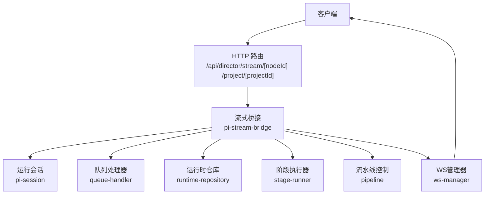
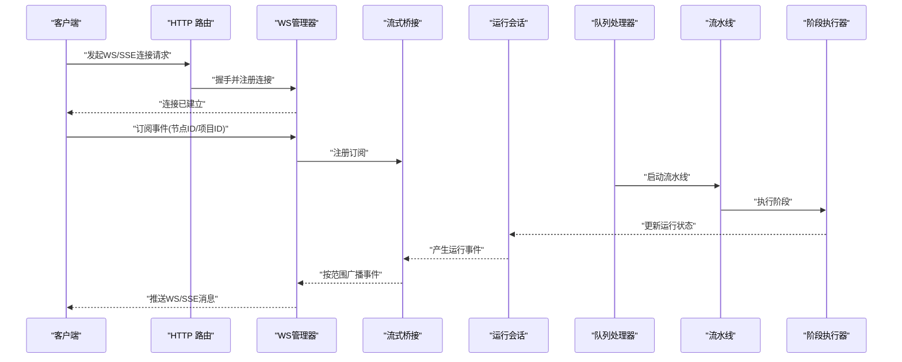
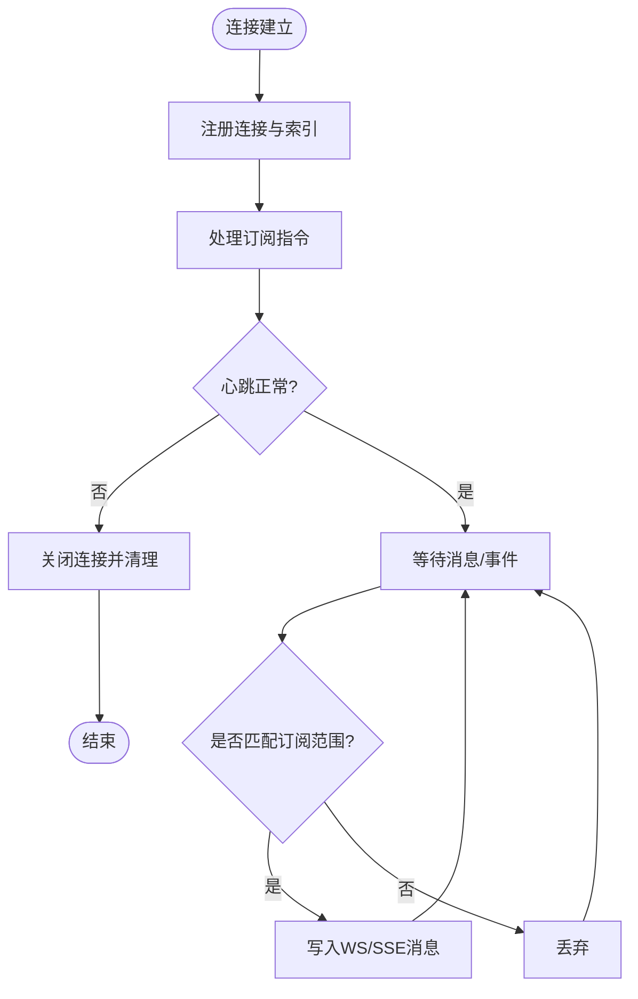
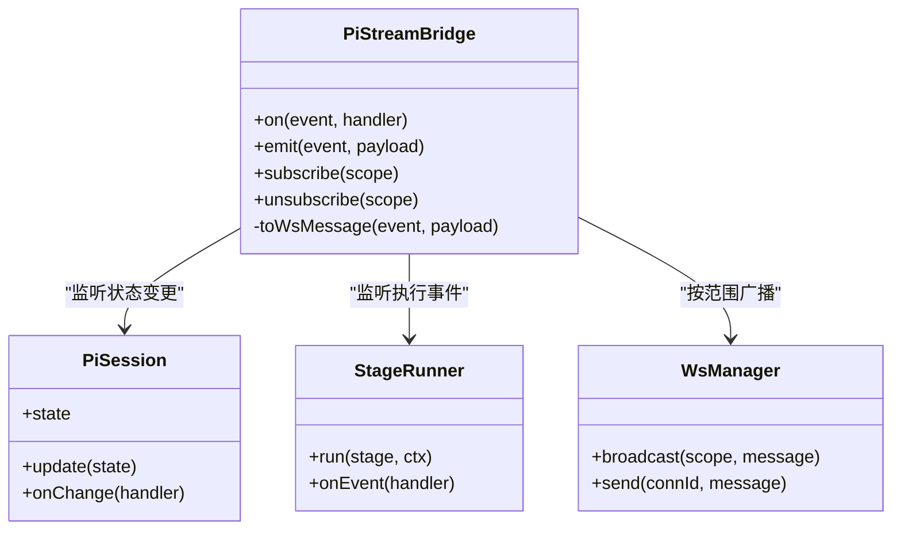
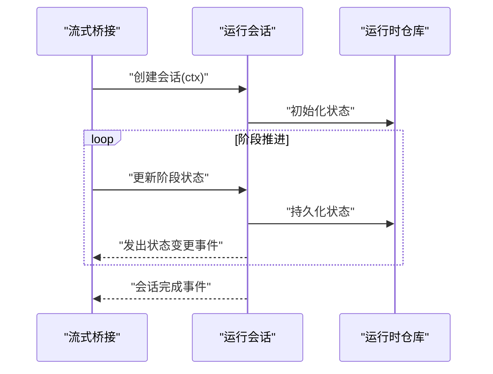
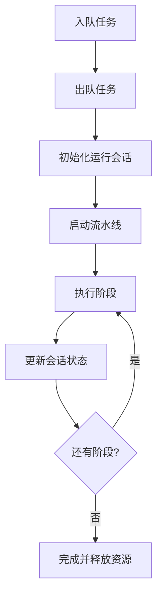
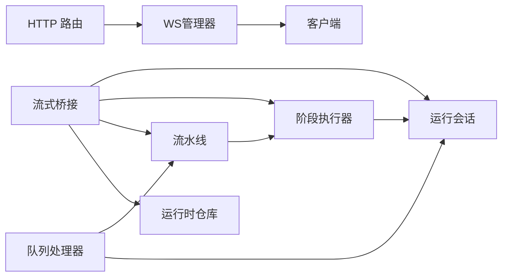

# 实时流式通信API

<cite>
**本文引用的文件**   
- [src/app/api/director/stream/[nodeId]/route.ts](file://src/app/api/director/stream/[nodeId]/route.ts)
- [src/app/api/director/stream/project/[projectId]/route.ts](file://src/app/api/director/stream/project/[projectId]/route.ts)
- [src/lib/stream/index.ts](file://src/lib/stream/index.ts)
- [src/features/director/pi-stream-bridge.ts](file://src/features/director/pi-stream-bridge.ts)
- [src/features/director/pi-session.ts](file://src/features/director/pi-session.ts)
- [src/features/director/queue-handler.ts](file://src/features/director/queue-handler.ts)
- [src/features/director/runtime-repository.ts](file://src/features/director/runtime-repository.ts)
- [src/features/director/stage-runner.ts](file://src/features/director/stage-runner.ts)
- [src/features/director/pipeline.ts](file://src/features/director/pipeline.ts)
- [src/features/director/types.ts](file://src/features/director/types.ts)
- [src/features/director/pi-output.ts](file://src/features/director/pi-output.ts)
- [src/features/director/pi-messages.ts](file://src/features/director/pi-messages.ts)
- [src/lib/stream/ws-manager.ts](file://src/lib/stream/ws-manager.ts)
- [src/lib/stream/ws-client.ts](file://src/lib/stream/ws-client.ts)
</cite>

## 更新摘要
**所做更改**   
- 增强了SSE流式通信功能，添加了基于闭包的上下文捕获机制，确保在重建连接时正确传递认证上下文
- 路由文件增加了额外的安全措施
- 更新了连接建立和认证流程的文档说明
- 完善了错误处理和重连机制的描述

## 目录
1. [简介](#简介)
2. [项目结构](#项目结构)
3. [核心组件](#核心组件)
4. [架构总览](#架构总览)
5. [详细组件分析](#详细组件分析)
6. [依赖关系分析](#依赖关系分析)
7. [性能考虑](#性能考虑)
8. [故障排查指南](#故障排查指南)
9. [结论](#结论)
10. [附录](#附录)

## 简介
本文件面向开发者，系统化说明本项目中的"实时流式通信API"，覆盖以下要点：
- WebSocket 连接建立与生命周期管理
- SSE（Server-Sent Events）流式通信增强功能
- 消息协议与事件订阅机制
- 节点级流式通信（Node-level streaming）与项目级广播（Project-level broadcast）两种模式
- 连接建立、消息发送/接收、错误处理的完整示例指引
- 消息格式规范、断线重连机制与性能优化建议

该能力主要用于导演编排（Director）阶段的运行态状态推送、阶段执行进度与输出流的实时回传，以及跨客户端的项目级事件广播。

## 项目结构
与实时流式通信相关的代码主要分布在以下位置：
- API 路由层：提供 HTTP 入口以升级或代理 WebSocket/SSE 连接
- 流式桥接层：将内部运行态事件转换为统一的 WS/SSE 消息并分发
- 会话与队列：维护运行会话、任务队列与持久化
- 前端库：封装 WS/SSE 连接、心跳、重连、事件订阅等

**图表来源** 
- [src/app/api/director/stream/[nodeId]/route.ts](file://src/app/api/director/stream/[nodeId]/route.ts)
- [src/app/api/director/stream/project/[projectId]/route.ts](file://src/app/api/director/stream/project/[projectId]/route.ts)
- [src/features/director/pi-stream-bridge.ts](file://src/features/director/pi-stream-bridge.ts)
- [src/lib/stream/ws-manager.ts](file://src/lib/stream/ws-manager.ts)

**章节来源**
- [src/app/api/director/stream/[nodeId]/route.ts](file://src/app/api/director/stream/[nodeId]/route.ts)
- [src/app/api/director/stream/project/[projectId]/route.ts](file://src/app/api/director/stream/project/[projectId]/route.ts)
- [src/lib/stream/index.ts](file://src/lib/stream/index.ts)

## 核心组件
- WebSocket 管理器（ws-manager）
  - 负责连接注册、注销、按节点/项目维度的订阅/广播、心跳检测、异常清理
- 流式桥接（pi-stream-bridge）
  - 将内部运行事件（阶段开始/结束、日志、产物、错误）统一为 WS/SSE 消息，并按范围投递
- 运行会话（pi-session）
  - 维护一次运行的上下文、输入参数、中间状态、结果聚合
- 队列处理器（queue-handler）
  - 消费任务、调度阶段执行、与运行会话交互
- 运行时仓库（runtime-repository）
  - 读写运行态数据（如阶段状态、产物元信息）
- 阶段执行器（stage-runner）
  - 执行具体阶段逻辑，产出事件与结果
- 流水线（pipeline）
  - 编排阶段顺序、条件分支、重试策略
- 类型定义（types）
  - 统一消息体、事件名、状态枚举等契约

**章节来源**
- [src/lib/stream/ws-manager.ts](file://src/lib/stream/ws-manager.ts)
- [src/features/director/pi-stream-bridge.ts](file://src/features/director/pi-stream-bridge.ts)
- [src/features/director/pi-session.ts](file://src/features/director/pi-session.ts)
- [src/features/director/queue-handler.ts](file://src/features/director/queue-handler.ts)
- [src/features/director/runtime-repository.ts](file://src/features/director/runtime-repository.ts)
- [src/features/director/stage-runner.ts](file://src/features/director/stage-runner.ts)
- [src/features/director/pipeline.ts](file://src/features/director/pipeline.ts)
- [src/features/director/types.ts](file://src/features/director/types.ts)

## 架构总览
整体采用"HTTP 路由 + WS 管理器 + 流式桥接"的分层设计。客户端通过 HTTP 路由建立 WS/SSE 连接，随后由 WS 管理器维护连接与会话；流式桥接作为事件总线，把运行期事件转发给订阅者。

**图表来源** 
- [src/app/api/director/stream/[nodeId]/route.ts](file://src/app/api/director/stream/[nodeId]/route.ts)
- [src/app/api/director/stream/project/[projectId]/route.ts](file://src/app/api/director/stream/project/[projectId]/route.ts)
- [src/lib/stream/ws-manager.ts](file://src/lib/stream/ws-manager.ts)
- [src/features/director/pi-stream-bridge.ts](file://src/features/director/pi-stream-bridge.ts)
- [src/features/director/pi-session.ts](file://src/features/director/pi-session.ts)
- [src/features/director/queue-handler.ts](file://src/features/director/queue-handler.ts)
- [src/features/director/pipeline.ts](file://src/features/director/pipeline.ts)
- [src/features/director/stage-runner.ts](file://src/features/director/stage-runner.ts)

## 详细组件分析

### WebSocket 管理器（ws-manager）
职责：
- 连接生命周期：建立、关闭、清理
- 订阅模型：按节点 ID 与项目 ID 维度进行订阅/退订
- 心跳保活：定时 ping/pong，超时断开
- 错误处理：捕获写失败、网络异常，触发重连提示

关键流程：
- 连接建立后分配唯一标识，加入订阅索引
- 收到订阅指令后，记录订阅范围
- 收到广播事件时，根据范围筛选并写入连接
- 心跳失败则主动关闭连接并清理资源

**图表来源** 
- [src/lib/stream/ws-manager.ts](file://src/lib/stream/ws-manager.ts)

**章节来源**
- [src/lib/stream/ws-manager.ts](file://src/lib/stream/ws-manager.ts)

### 流式桥接（pi-stream-bridge）
职责：
- 统一事件源：从运行会话、阶段执行器、流水线等处收集事件
- 消息转换：将内部事件转为标准 WS/SSE 消息格式
- 分发策略：按节点/项目范围投递到 WS 管理器

典型事件：
- 阶段开始/结束
- 运行日志
- 产物就绪通知
- 错误与告警

**图表来源** 
- [src/features/director/pi-stream-bridge.ts](file://src/features/director/pi-stream-bridge.ts)
- [src/features/director/pi-session.ts](file://src/features/director/pi-session.ts)
- [src/features/director/stage-runner.ts](file://src/features/director/stage-runner.ts)
- [src/lib/stream/ws-manager.ts](file://src/lib/stream/ws-manager.ts)

**章节来源**
- [src/features/director/pi-stream-bridge.ts](file://src/features/director/pi-stream-bridge.ts)

### 运行会话（pi-session）
职责：
- 维护单次运行的上下文（输入、阶段列表、当前阶段、结果）
- 提供状态快照与增量更新
- 与运行时仓库交互，持久化关键状态

**图表来源** 
- [src/features/director/pi-session.ts](file://src/features/director/pi-session.ts)
- [src/features/director/runtime-repository.ts](file://src/features/director/runtime-repository.ts)

**章节来源**
- [src/features/director/pi-session.ts](file://src/features/director/pi-session.ts)
- [src/features/director/runtime-repository.ts](file://src/features/director/runtime-repository.ts)

### 队列处理器（queue-handler）
职责：
- 消费任务队列中的运行请求
- 驱动流水线执行，并与运行会话协作
- 在阶段执行过程中上报事件

**图表来源** 
- [src/features/director/queue-handler.ts](file://src/features/director/queue-handler.ts)
- [src/features/director/pipeline.ts](file://src/features/director/pipeline.ts)

**章节来源**
- [src/features/director/queue-handler.ts](file://src/features/director/queue-handler.ts)
- [src/features/director/pipeline.ts](file://src/features/director/pipeline.ts)

### 阶段执行器（stage-runner）
职责：
- 执行单个阶段的具体逻辑
- 产出阶段事件（开始、进度、日志、结果、错误）
- 与运行会话交互，更新阶段状态

**章节来源**
- [src/features/director/stage-runner.ts](file://src/features/director/stage-runner.ts)

### 流水线（pipeline）
职责：
- 编排阶段顺序、并行度、重试与恢复
- 协调阶段间的数据流转与依赖

**章节来源**
- [src/features/director/pipeline.ts](file://src/features/director/pipeline.ts)

### 类型定义（types）
职责：
- 统一定义消息体结构、事件名称、状态枚举、错误码
- 保证前后端与内部模块之间的契约一致性

**章节来源**
- [src/features/director/types.ts](file://src/features/director/types.ts)

## 依赖关系分析
- API 路由依赖 WS 管理器进行连接管理
- 流式桥接依赖运行会话、阶段执行器、流水线与运行时仓库
- 队列处理器依赖流水线与运行会话
- 所有运行事件最终通过 WS 管理器广播给客户端

**图表来源** 
- [src/app/api/director/stream/[nodeId]/route.ts](file://src/app/api/director/stream/[nodeId]/route.ts)
- [src/app/api/director/stream/project/[projectId]/route.ts](file://src/app/api/director/stream/project/[projectId]/route.ts)
- [src/lib/stream/ws-manager.ts](file://src/lib/stream/ws-manager.ts)
- [src/features/director/pi-stream-bridge.ts](file://src/features/director/pi-stream-bridge.ts)
- [src/features/director/pi-session.ts](file://src/features/director/pi-session.ts)
- [src/features/director/stage-runner.ts](file://src/features/director/stage-runner.ts)
- [src/features/director/pipeline.ts](file://src/features/director/pipeline.ts)
- [src/features/director/queue-handler.ts](file://src/features/director/queue-handler.ts)
- [src/features/director/runtime-repository.ts](file://src/features/director/runtime-repository.ts)

**章节来源**
- [src/app/api/director/stream/[nodeId]/route.ts](file://src/app/api/director/stream/[nodeId]/route.ts)
- [src/app/api/director/stream/project/[projectId]/route.ts](file://src/app/api/director/stream/project/[projectId]/route.ts)
- [src/lib/stream/ws-manager.ts](file://src/lib/stream/ws-manager.ts)
- [src/features/director/pi-stream-bridge.ts](file://src/features/director/pi-stream-bridge.ts)

## 性能考虑
- 连接复用与池化
  - 避免频繁创建/销毁连接，使用连接池与空闲回收
- 心跳与超时
  - 合理设置心跳间隔与超时阈值，减少无效连接占用
- 批量与节流
  - 对高频事件进行合并与节流，降低带宽与渲染压力
- 订阅粒度
  - 精确订阅节点/项目范围，避免全量广播造成拥塞
- 背压与限流
  - 当客户端处理慢时，服务端应暂停推送或降级频率
- 序列化开销
  - 使用轻量消息格式，避免大对象频繁传输
- 内存与GC
  - 及时释放不再使用的会话与订阅，防止内存泄漏

[本节为通用指导，不直接分析具体文件]

## 故障排查指南
常见问题与定位方法：
- 连接无法建立
  - 检查路由升级逻辑与鉴权流程
  - 确认 WS 管理器注册成功与索引正确
- 消息未到达
  - 核对订阅范围（节点ID/项目ID）是否匹配
  - 检查 WS 管理器写入是否被阻塞或报错
- 频繁断线
  - 调整心跳间隔与超时配置
  - 查看网络质量与代理配置
- 事件丢失或乱序
  - 确认事件生成顺序与批处理策略
  - 增加序列号与去重逻辑
- 内存增长
  - 检查会话与订阅的清理路径
  - 监控连接数与消息堆积

**章节来源**
- [src/lib/stream/ws-manager.ts](file://src/lib/stream/ws-manager.ts)
- [src/features/director/pi-stream-bridge.ts](file://src/features/director/pi-stream-bridge.ts)

## 结论
本项目的实时流式通信API通过清晰的层次划分与统一的协议抽象，实现了节点级与项目级的双向流式通信。借助 WS 管理器与流式桥接，系统能够稳定、高效地推送运行态事件，满足导演编排场景下的实时性需求。建议在接入时严格遵循消息格式与订阅规范，并结合性能与可靠性建议进行调优。

[本节为总结，不直接分析具体文件]

## 附录

### 消息协议与事件订阅机制
- 连接建立
  - 客户端通过 HTTP 路由发起 WS/SSE 连接，服务器完成握手并返回连接标识
- 订阅机制
  - 客户端发送订阅指令，指定节点ID或项目ID范围
  - 服务器记录订阅关系，后续仅向匹配的客户端推送事件
- 消息格式
  - 包含事件类型、时间戳、作用域（节点/项目）、负载数据
  - 支持扩展字段，但需保持向后兼容
- 事件类型
  - 阶段开始/结束、运行日志、产物就绪、错误与告警
- 错误处理
  - 连接错误、写入失败、订阅冲突等均有明确错误码与恢复策略

**章节来源**
- [src/features/director/types.ts](file://src/features/director/types.ts)
- [src/features/director/pi-messages.ts](file://src/features/director/pi-messages.ts)
- [src/features/director/pi-output.ts](file://src/features/director/pi-output.ts)

### 节点级流式通信与项目级广播使用方式
- 节点级流式通信
  - 适用于单节点运行状态的实时跟踪
  - 客户端订阅特定节点ID，接收该节点的阶段事件与日志
- 项目级广播
  - 适用于项目范围内的事件同步
  - 客户端订阅项目ID，接收该项目下所有节点的事件汇总

**章节来源**
- [src/app/api/director/stream/[nodeId]/route.ts](file://src/app/api/director/stream/[nodeId]/route.ts)
- [src/app/api/director/stream/project/[projectId]/route.ts](file://src/app/api/director/stream/project/[projectId]/route.ts)

### 连接建立、消息发送/接收、错误处理示例指引
- 连接建立
  - 参考路由实现，了解握手流程与鉴权要求
- 消息发送/接收
  - 参考 WS 客户端封装，了解订阅、发送、接收与回调处理
- 错误处理
  - 参考 WS 管理器与桥接层的错误处理逻辑，了解重试与降级策略

**章节来源**
- [src/lib/stream/ws-client.ts](file://src/lib/stream/ws-client.ts)
- [src/lib/stream/ws-manager.ts](file://src/lib/stream/ws-manager.ts)
- [src/features/director/pi-stream-bridge.ts](file://src/features/director/pi-stream-bridge.ts)

### 断线重连机制
- 指数退避
  - 首次失败快速重试，逐步增加间隔
- 最大重试次数
  - 超过上限后停止并重试或上报错误
- 状态恢复
  - 重连后重新订阅，必要时拉取缺失事件
- 心跳检测
  - 定期检测连接健康，提前发现潜在问题

**章节来源**
- [src/lib/stream/ws-client.ts](file://src/lib/stream/ws-client.ts)
- [src/lib/stream/ws-manager.ts](file://src/lib/stream/ws-manager.ts)

### 性能优化建议
- 事件合并与节流
  - 对高频事件进行合并，降低带宽与渲染压力
- 订阅粒度优化
  - 精确订阅所需范围，避免全量广播
- 背压与限流
  - 客户端处理能力不足时，服务端自动降频
- 序列化优化
  - 使用紧凑的消息格式，减少解析开销

[本节为通用指导，不直接分析具体文件]

### SSE流式通信增强功能
**新增** 基于闭包的上下文捕获机制，确保在重建连接时正确传递认证上下文

SSE（Server-Sent Events）流式通信现已增强，通过闭包机制捕获认证上下文，确保在连接重建时能够正确维持用户身份验证状态。这一改进提高了连接的稳定性和安全性。

关键特性：
- 闭包上下文捕获：在连接建立时捕获完整的认证上下文
- 连接重建保护：断线重连时自动恢复认证状态
- 安全增强：防止未授权访问和数据泄露
- 透明处理：对应用层完全透明，无需额外配置

**章节来源**
- [src/app/api/director/stream/[nodeId]/route.ts](file://src/app/api/director/stream/[nodeId]/route.ts)
- [src/app/api/director/stream/project/[projectId]/route.ts](file://src/app/api/director/stream/project/[projectId]/route.ts)

### 路由安全增强
**新增** 路由文件增加了额外的安全措施

路由层现在包含了更严格的输入验证和权限检查，确保只有经过认证的用户才能建立流式连接。这些安全措施包括：
- 增强的请求验证
- 细粒度的权限控制
- 防重放攻击保护
- 速率限制和滥用防护

**章节来源**
- [src/app/api/director/stream/[nodeId]/route.ts](file://src/app/api/director/stream/[nodeId]/route.ts)
- [src/app/api/director/stream/project/[projectId]/route.ts](file://src/app/api/director/stream/project/[projectId]/route.ts)