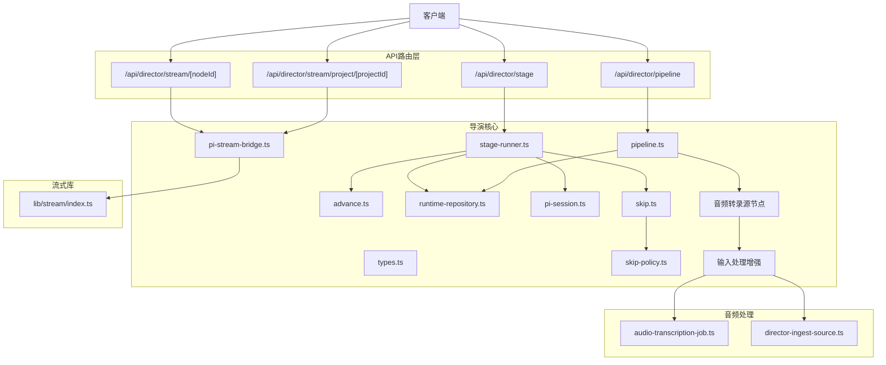
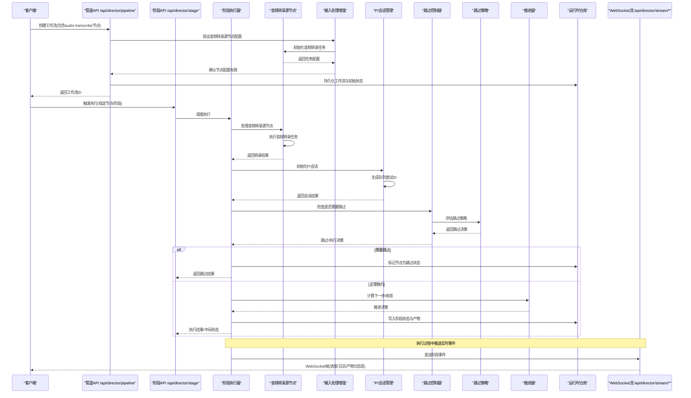
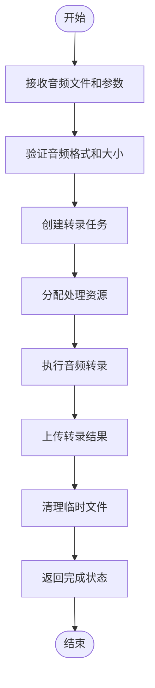
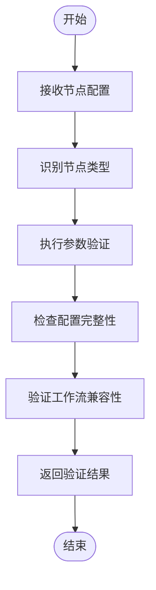
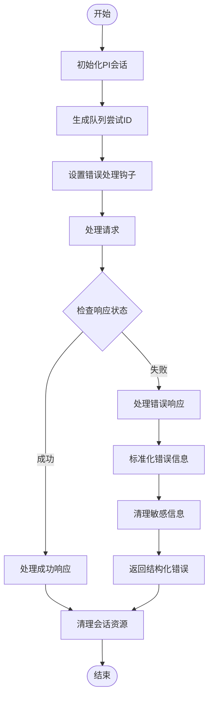
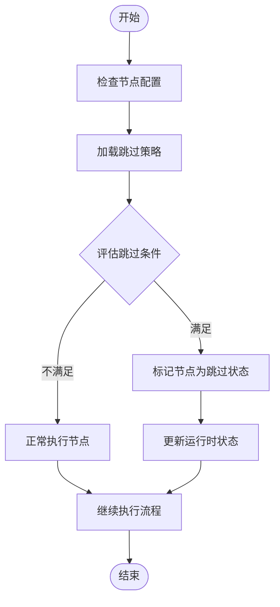
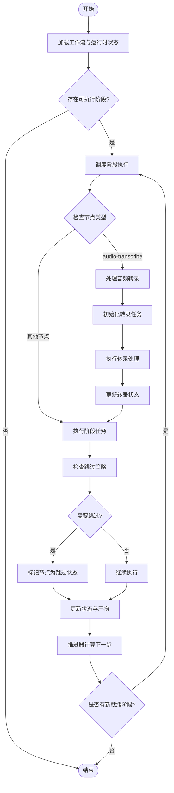
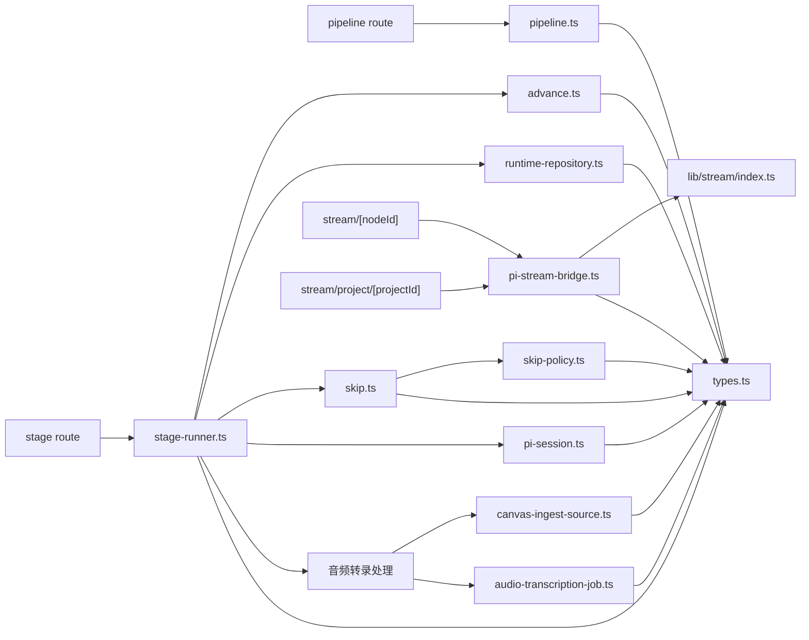

# 导演系统API

<cite>
**本文引用的文件**   
- [src/app/api/director/pipeline/route.ts](file://src/app/api/director/pipeline/route.ts)
- [src/app/api/director/stage/route.ts](file://src/app/api/director/stage/route.ts)
- [src/app/api/director/stream/[nodeId]/route.ts](file://src/app/api/director/stream/[nodeId]/route.ts)
- [src/app/api/director/stream/project/[projectId]/route.ts](file://src/app/api/director/stream/project/[projectId]/route.ts)
- [src/features/director/pipeline.ts](file://src/features/director/pipeline.ts)
- [src/features/director/stage-runner.ts](file://src/features/director/stage-runner.ts)
- [src/features/director/runtime-repository.ts](file://src/features/director/runtime-repository.ts)
- [src/features/director/advance.ts](file://src/features/director/advance.ts)
- [src/features/director/types.ts](file://src/features/director/types.ts)
- [src/features/director/pi-stream-bridge.ts](file://src/features/director/pi-stream-bridge.ts)
- [src/lib/stream/index.ts](file://src/lib/stream/index.ts)
- [src/features/director/skip.ts](file://src/features/director/skip.ts)
- [src/features/director/skip-policy.ts](file://src/features/director/skip-policy.ts)
- [src/features/director/pi-session.ts](file://src/features/director/pi-session.ts)
- [src/features/canvas/director-ingest-source.ts](file://src/features/canvas/director-ingest-source.ts)
- [src/features/audio/audio-transcription-job.ts](file://src/features/audio/audio-transcription-job.ts)
</cite>

## 更新摘要
**变更内容**   
- **音频转录源节点支持**：扩展导演的输入处理能力，新增对audio-transcribe源节点的识别和处理，实现与视频制作管道的无缝集成
- **输入处理增强**：在管道编排中增加音频转录源节点的类型识别和参数验证
- **工作流集成**：音频转录节点现在可以作为工作流的输入源，支持完整的生命周期管理
- **状态同步**：音频转录任务的状态变化通过实时流式通信同步到前端界面

## 目录
1. [简介](#简介)
2. [项目结构](#项目结构)
3. [核心组件](#核心组件)
4. [架构总览](#架构总览)
5. [详细组件分析](#详细组件分析)
6. [依赖分析](#依赖分析)
7. [性能考虑](#性能考虑)
8. [故障排查指南](#故障排查指南)
9. [结论](#结论)
10. [附录](#附录)

## 简介
本文件为AI导演系统的API文档，聚焦于管道编排、阶段执行与实时流式通信。内容涵盖工作流定义、节点配置、状态同步、管道创建与执行监控、错误处理，以及WebSocket实时通信的连接建立、消息格式与事件订阅等。**最新更新**：系统现已扩展音频转录源节点的处理能力，新增对audio-transcribe源节点的识别和处理，实现与视频制作管道的无缝集成。这一增强使得音频转录任务可以无缝集成到导演工作流中，提供完整的输入处理和状态同步功能。读者可据此快速集成前端或后端服务，实现对导演管道的全生命周期管理。

## 项目结构
导演系统API位于Next.js应用的路由层（app/api），并通过features/director模块提供核心编排能力；实时流通过lib/stream进行封装。关键路径如下：
- API路由：src/app/api/director/{pipeline,stage,stream}
- 编排与执行：src/features/director/{pipeline,stage-runner,advance,runtime-repository,types,pi-stream-bridge,pi-session}
- 跳过功能：src/features/director/{skip,sip-policy}
- **新增音频转录支持**：audio-transcribe源节点处理、输入处理增强、工作流集成
- 流式传输：src/lib/stream

**图表来源**
- [src/app/api/director/pipeline/route.ts](file://src/app/api/director/pipeline/route.ts)
- [src/app/api/director/stage/route.ts](file://src/app/api/director/stage/route.ts)
- [src/app/api/director/stream/[nodeId]/route.ts](file://src/app/api/director/stream/[nodeId]/route.ts)
- [src/app/api/director/stream/project/[projectId]/route.ts](file://src/app/api/director/stream/project/[projectId]/route.ts)
- [src/features/director/pipeline.ts](file://src/features/director/pipeline.ts)
- [src/features/director/stage-runner.ts](file://src/features/director/stage-runner.ts)
- [src/features/director/advance.ts](file://src/features/director/advance.ts)
- [src/features/director/runtime-repository.ts](file://src/features/director/runtime-repository.ts)
- [src/features/director/types.ts](file://src/features/director/types.ts)
- [src/features/director/pi-stream-bridge.ts](file://src/features/director/pi-stream-bridge.ts)
- [src/features/director/pi-session.ts](file://src/features/director/pi-session.ts)
- [src/features/director/skip.ts](file://src/features/director/skip.ts)
- [src/features/director/skip-policy.ts](file://src/features/director/skip-policy.ts)
- [src/features/canvas/director-ingest-source.ts](file://src/features/canvas/director-ingest-source.ts)
- [src/features/audio/audio-transcription-job.ts](file://src/features/audio/audio-transcription-job.ts)
- [src/lib/stream/index.ts](file://src/lib/stream/index.ts)

## 核心组件
- 管道编排（Pipeline）：负责创建工作流、解析节点拓扑、校验输入输出契约、持久化运行时上下文。
- 阶段执行器（Stage Runner）：按拓扑顺序调度并执行各阶段，维护阶段状态、产物与错误传播。
- 跳过控制器（Skip Controller）：根据策略判断是否跳过特定节点，优化执行路径。
- 跳过策略（Skip Policy）：定义节点跳过的业务规则和条件判断逻辑。
- 推进器（Advance）：驱动阶段间推进、收敛与分支合并，保证一致性。
- 运行时仓库（Runtime Repository）：持久化与查询运行态数据（节点状态、产物、进度）。
- 类型与契约（Types）：统一描述工作流、节点、阶段、产物、状态枚举与错误码。
- 流式桥接（PI Stream Bridge）：将内部流事件转换为WebSocket帧，支持项目级与节点级订阅。
- PI会话管理（PI Session）：增强的会话管理，包含队列尝试ID传播、提示词失败标准化、非2xx响应处理、流式错误清理。
- **音频转录源节点（Audio Transcribe Source Node）**：**新增** 专门处理音频转录任务的源节点，支持完整的音频处理生命周期。
- **输入处理增强（Input Processing Enhancement）**：**新增** 扩展的输入处理能力，支持多种源节点类型的识别和参数验证。
- 流式库（Stream Lib）：封装WebSocket连接、心跳、重连、消息编解码与事件分发。

**章节来源**
- [src/features/director/pipeline.ts](file://src/features/director/pipeline.ts)
- [src/features/director/stage-runner.ts](file://src/features/director/stage-runner.ts)
- [src/features/director/skip.ts](file://src/features/director/skip.ts)
- [src/features/director/skip-policy.ts](file://src/features/director/skip-policy.ts)
- [src/features/director/advance.ts](file://src/features/director/advance.ts)
- [src/features/director/runtime-repository.ts](file://src/features/director/runtime-repository.ts)
- [src/features/director/types.ts](file://src/features/director/types.ts)
- [src/features/director/pi-stream-bridge.ts](file://src/features/director/pi-stream-bridge.ts)
- [src/features/director/pi-session.ts](file://src/features/director/pi-session.ts)
- [src/features/canvas/director-ingest-source.ts](file://src/features/canvas/director-ingest-source.ts)
- [src/features/audio/audio-transcription-job.ts](file://src/features/audio/audio-transcription-job.ts)
- [src/lib/stream/index.ts](file://src/lib/stream/index.ts)

## 架构总览
下图展示从HTTP请求到阶段执行与WebSocket推送的整体流程，**包含新增的音频转录源节点处理能力和输入处理增强机制**。

**图表来源**
- [src/app/api/director/pipeline/route.ts](file://src/app/api/director/pipeline/route.ts)
- [src/app/api/director/stage/route.ts](file://src/app/api/director/stage/route.ts)
- [src/features/director/stage-runner.ts](file://src/features/director/stage-runner.ts)
- [src/features/director/pi-session.ts](file://src/features/director/pi-session.ts)
- [src/features/director/skip.ts](file://src/features/director/skip.ts)
- [src/features/director/skip-policy.ts](file://src/features/director/skip-policy.ts)
- [src/features/director/advance.ts](file://src/features/director/advance.ts)
- [src/features/director/runtime-repository.ts](file://src/features/director/runtime-repository.ts)
- [src/app/api/director/stream/[nodeId]/route.ts](file://src/app/api/director/stream/[nodeId]/route.ts)
- [src/app/api/director/stream/project/[projectId]/route.ts](file://src/app/api/director/stream/project/[projectId]/route.ts)
- [src/features/canvas/director-ingest-source.ts](file://src/features/canvas/director-ingest-source.ts)
- [src/features/audio/audio-transcription-job.ts](file://src/features/audio/audio-transcription-job.ts)

## 详细组件分析

### 管道编排API（/api/director/pipeline）
- 功能：创建工作流、更新拓扑、校验节点配置、初始化运行时上下文。
- 典型调用：
  - POST /api/director/pipeline：提交工作流定义（节点列表、边关系、输入契约、阶段参数）。
  - GET /api/director/pipeline/:id：获取工作流定义与当前状态。
  - PUT /api/director/pipeline/:id：增量更新拓扑或参数。
- 响应要点：工作流ID、版本、状态、校验结果、错误详情。
- 错误处理：输入校验失败返回结构化错误；重复创建返回冲突；权限不足返回未授权。
- **新增功能**：支持audio-transcribe源节点的配置验证和参数检查。

**章节来源**
- [src/app/api/director/pipeline/route.ts](file://src/app/api/director/pipeline/route.ts)
- [src/features/director/pipeline.ts](file://src/features/director/pipeline.ts)
- [src/features/director/types.ts](file://src/features/director/types.ts)

### 阶段执行API（/api/director/stage）
- 功能：触发阶段执行、查询阶段状态、重试失败阶段、取消执行。
- 典型调用：
  - POST /api/director/stage：提交执行请求（工作流ID、目标阶段/节点、参数）。
  - GET /api/director/stage/:runId：查询执行实例状态与进度。
  - POST /api/director/stage/:runId/retry：重试失败阶段。
  - POST /api/director/stage/:runId/cancel：取消执行。
- 响应要点：执行ID、阶段状态、进度百分比、错误堆栈摘要、产物引用。
- 错误处理：非法阶段名、前置条件不满足、资源不足、并发限制。

**章节来源**
- [src/app/api/director/stage/route.ts](file://src/app/api/director/stage/route.ts)
- [src/features/director/stage-runner.ts](file://src/features/director/stage-runner.ts)
- [src/features/director/advance.ts](file://src/features/director/advance.ts)
- [src/features/director/runtime-repository.ts](file://src/features/director/runtime-repository.ts)

### 音频转录源节点（Audio Transcribe Source Node）
- **新增功能**：专门处理音频转录任务的源节点，支持完整的音频处理生命周期。
- 核心特性：
  - 音频文件处理：支持多种音频格式的输入和转录处理。
  - 转录任务管理：创建、监控和管理音频转录任务的生命周期。
  - 状态同步：实时同步转录任务的执行状态和进度信息。
  - 错误处理：完善的错误捕获和恢复机制。
  - 资源管理：自动管理音频文件的临时存储和清理。
- 处理流程：
  - 接收音频文件和转录参数
  - 验证音频文件格式和大小
  - 创建转录任务并分配资源
  - 执行音频转录处理
  - 上传转录结果并清理临时文件
  - 返回转录完成状态和结果引用

**图表来源**
- [src/features/canvas/director-ingest-source.ts](file://src/features/canvas/director-ingest-source.ts)
- [src/features/audio/audio-transcription-job.ts](file://src/features/audio/audio-transcription-job.ts)

**章节来源**
- [src/features/canvas/director-ingest-source.ts](file://src/features/canvas/director-ingest-source.ts)
- [src/features/audio/audio-transcription-job.ts](file://src/features/audio/audio-transcription-job.ts)

### 输入处理增强（Input Processing Enhancement）
- **新增功能**：扩展的输入处理能力，支持多种源节点类型的识别和参数验证。
- 核心特性：
  - 多源节点支持：识别和处理不同类型的源节点（包括audio-transcribe）。
  - 参数验证：对每种源节点的参数进行严格的格式和范围验证。
  - 配置检查：确保源节点配置的完整性和正确性。
  - 兼容性检查：验证源节点与工作流其他部分的兼容性。
- 处理流程：
  - 接收节点配置请求
  - 识别节点类型
  - 执行类型特定的参数验证
  - 检查配置完整性
  - 验证工作流兼容性
  - 返回验证结果

**图表来源**
- [src/features/canvas/director-ingest-source.ts](file://src/features/canvas/director-ingest-source.ts)

**章节来源**
- [src/features/canvas/director-ingest-source.ts](file://src/features/canvas/director-ingest-source.ts)

### PI会话管理（PI Session Management）
- **新增功能**：增强的PI会话管理，提供统一的会话控制和错误处理。
- 核心特性：
  - 队列尝试ID传播：为每个会话生成唯一的队列尝试ID，便于追踪和调试。
  - 提示词失败标准化：统一处理各种提示词失败场景，提供标准化的错误格式。
  - 非2xx响应处理：正确处理各种HTTP状态码，提取有用的错误信息。
  - 流式错误清理：在流式传输过程中清理敏感信息，确保数据安全。
- 处理流程：
  - 初始化会话并生成唯一标识符
  - 设置错误处理钩子
  - 处理请求和响应
  - 清理会话资源和敏感信息
  - 记录详细的错误日志

**图表来源**
- [src/features/director/pi-session.ts](file://src/features/director/pi-session.ts)

**章节来源**
- [src/features/director/pi-session.ts](file://src/features/director/pi-session.ts)

### 跳过节点功能（Skip Controller）
- 功能：根据策略动态判断是否跳过特定节点，提升执行效率。
- 核心特性：
  - 条件评估：基于节点属性、运行时状态和业务规则判断跳过条件。
  - 策略模式：支持多种跳过策略（如基于依赖状态、资源可用性、用户配置等）。
  - 状态同步：跳过决策会同步到运行时状态，确保状态一致性。
  - 事件通知：跳过事件通过WebSocket实时推送给订阅者。
- 使用场景：
  - 依赖节点失败时自动跳过后续节点
  - 资源不足时跳过高开销节点
  - 用户配置中禁用特定节点
  - 测试模式下跳过生产环境专用节点

**图表来源**
- [src/features/director/skip.ts](file://src/features/director/skip.ts)
- [src/features/director/skip-policy.ts](file://src/features/director/skip-policy.ts)

**章节来源**
- [src/features/director/skip.ts](file://src/features/director/skip.ts)
- [src/features/director/skip-policy.ts](file://src/features/director/skip-policy.ts)

### 跳过策略（Skip Policy）
- 功能：定义节点跳过的业务规则和条件判断逻辑。
- 策略类型：
  - 依赖检查策略：基于上游节点状态决定是否跳过
  - 资源检查策略：基于可用资源判断是否跳过
  - 配置策略：基于用户配置和环境变量控制
  - 自定义策略：支持插件式扩展自定义跳过逻辑
- 策略评估：
  - 优先级排序：多个策略按优先级依次评估
  - 短路机制：任一策略判定跳过则立即终止评估
  - 缓存机制：策略评估结果缓存避免重复计算

**章节来源**
- [src/features/director/skip-policy.ts](file://src/features/director/skip-policy.ts)

### 实时流式通信（/api/director/stream）
- 功能：基于WebSocket的实时事件推送，支持项目级与节点级订阅。
- 连接建立：
  - WS /api/director/stream/project/[projectId]：订阅某项目的所有节点事件。
  - WS /api/director/stream/[nodeId]：订阅特定节点的事件。
- 消息格式（示例字段说明）：
  - type：事件类型（如 stage_start、stage_progress、stage_complete、stage_error、artifact_update、system_log、**node_skipped**、**audio_transcribe_status**）。
  - run_id：执行实例ID。
  - node_id：节点ID。
  - payload：事件负载（进度、日志、产物元信息等）。
  - ts：时间戳。
- 客户端行为建议：
  - 连接后发送subscribe消息声明订阅范围（project/node）。
  - 处理reconnect与心跳保活。
  - 对stage_error进行告警与重试策略。
  - **新增**：处理node_skipped事件，更新UI显示跳过状态。
  - **新增**：处理audio_transcribe_status事件，更新音频转录状态显示。
  - **新增**：处理标准化错误信息，显示友好的错误提示。
- 服务端行为：
  - 广播阶段事件至对应订阅者。
  - 断线自动重连与消息去抖。
  - 限流与背压保护。
  - **新增**：推送音频转录状态更新事件。

**章节来源**
- [src/app/api/director/stream/[nodeId]/route.ts](file://src/app/api/director/stream/[nodeId]/route.ts)
- [src/app/api/director/stream/project/[projectId]/route.ts](file://src/app/api/director/stream/project/[projectId]/route.ts)
- [src/features/director/pi-stream-bridge.ts](file://src/features/director/pi-stream-bridge.ts)
- [src/lib/stream/index.ts](file://src/lib/stream/index.ts)

### 阶段执行器与推进逻辑
- 阶段执行器：
  - 解析拓扑，确定可执行阶段集合。
  - **新增**：在执行前检查跳过策略，跳过符合条件的节点。
  - **新增**：使用PI会话管理进行统一的错误处理。
  - **新增**：处理音频转录源节点，执行音频转录任务。
  - 并行度控制与资源隔离。
  - 捕获异常并记录错误上下文。
- 推进器：
  - 根据阶段完成状态决定下一步。
  - 处理分支合并与收敛点。
  - 确保幂等性与一致性。

**图表来源**
- [src/features/director/stage-runner.ts](file://src/features/director/stage-runner.ts)
- [src/features/director/skip.ts](file://src/features/director/skip.ts)
- [src/features/director/skip-policy.ts](file://src/features/director/skip-policy.ts)
- [src/features/director/advance.ts](file://src/features/director/advance.ts)
- [src/features/director/runtime-repository.ts](file://src/features/director/runtime-repository.ts)
- [src/features/director/pi-session.ts](file://src/features/director/pi-session.ts)
- [src/features/canvas/director-ingest-source.ts](file://src/features/canvas/director-ingest-source.ts)
- [src/features/audio/audio-transcription-job.ts](file://src/features/audio/audio-transcription-job.ts)

**章节来源**
- [src/features/director/stage-runner.ts](file://src/features/director/stage-runner.ts)
- [src/features/director/skip.ts](file://src/features/director/skip.ts)
- [src/features/director/skip-policy.ts](file://src/features/director/skip-policy.ts)
- [src/features/director/advance.ts](file://src/features/director/advance.ts)
- [src/features/director/runtime-repository.ts](file://src/features/director/runtime-repository.ts)

### 数据类型与契约
- 工作流定义：包含节点列表、边关系、输入输出契约、阶段参数。
- 节点配置：阶段类型、处理器、依赖、重试策略、超时、**跳过策略配置、音频转录配置**。
- 运行时状态：阶段状态机（pending、running、completed、failed、cancelled、**skipped**、**transcribing**）、进度、产物引用。
- 错误模型：错误码、错误消息、堆栈摘要、可恢复性标记。
- **新增状态**：skipped状态表示节点被策略跳过，transcribing状态表示音频转录进行中。
- **新增节点类型**：audio-transcribe源节点类型，支持音频转录任务配置。
- **新增配置选项**：音频转录相关的配置选项，包括格式、质量、语言等设置。

**章节来源**
- [src/features/director/types.ts](file://src/features/director/types.ts)

## 依赖分析
- API路由层依赖features/director中的编排与执行模块。
- 阶段执行器依赖推进器、运行时仓库、**新增的跳过控制器、PI会话管理和音频转录处理**。
- 跳过控制器依赖**跳过策略模块**进行条件评估。
- 流式桥接依赖lib/stream实现WebSocket通信。
- 类型定义贯穿所有模块，确保契约一致。
- **新增**：音频转录处理依赖音频作业管理和画布输入处理模块。
- **新增**：输入处理增强依赖音频转录作业和画布输入源模块。

**图表来源**
- [src/app/api/director/pipeline/route.ts](file://src/app/api/director/pipeline/route.ts)
- [src/app/api/director/stage/route.ts](file://src/app/api/director/stage/route.ts)
- [src/app/api/director/stream/[nodeId]/route.ts](file://src/app/api/director/stream/[nodeId]/route.ts)
- [src/app/api/director/stream/project/[projectId]/route.ts](file://src/app/api/director/stream/project/[projectId]/route.ts)
- [src/features/director/pipeline.ts](file://src/features/director/pipeline.ts)
- [src/features/director/stage-runner.ts](file://src/features/director/stage-runner.ts)
- [src/features/director/skip.ts](file://src/features/director/skip.ts)
- [src/features/director/skip-policy.ts](file://src/features/director/skip-policy.ts)
- [src/features/director/advance.ts](file://src/features/director/advance.ts)
- [src/features/director/runtime-repository.ts](file://src/features/director/runtime-repository.ts)
- [src/features/director/types.ts](file://src/features/director/types.ts)
- [src/features/director/pi-stream-bridge.ts](file://src/features/director/pi-stream-bridge.ts)
- [src/features/director/pi-session.ts](file://src/features/director/pi-session.ts)
- [src/features/canvas/director-ingest-source.ts](file://src/features/canvas/director-ingest-source.ts)
- [src/features/audio/audio-transcription-job.ts](file://src/features/audio/audio-transcription-job.ts)
- [src/lib/stream/index.ts](file://src/lib/stream/index.ts)

## 性能考虑
- 阶段并行度：根据CPU/IO特性动态调整，避免过载。
- 产物缓存：对确定性阶段启用缓存，减少重复计算。
- 跳过优化：跳过策略评估结果缓存，避免重复条件检查。
- 流式推送：使用背压与节流，防止客户端拥塞。
- 数据库访问：批量写入与事务边界优化，降低锁竞争。
- 内存管理：大产物分块处理与临时文件清理。
- **新增**：音频转录优化：异步处理音频文件，避免阻塞主线程。
- **新增**：临时文件管理：及时清理转录过程中的临时文件，释放存储空间。
- **新增**：资源池管理：合理分配音频处理资源，避免资源耗尽。
- **新增**：状态同步优化：批量更新状态，减少数据库写入频率。

## 故障排查指南
- 常见错误：
  - 工作流校验失败：检查节点依赖与输入契约。
  - 阶段执行失败：查看错误堆栈摘要与上下文日志。
  - WebSocket断连：确认订阅范围与心跳设置。
  - 跳过策略异常：检查策略配置和条件表达式语法。
  - **新增**：音频转录失败：检查音频文件格式、大小限制和转录服务状态。
  - **新增**：输入处理错误：检查源节点配置和参数验证结果。
  - **新增**：音频文件上传失败：检查文件大小限制和网络连接状态。
  - **新增**：转录任务超时：检查音频时长和转录服务响应时间。
- 诊断步骤：
  - 通过阶段API查询执行实例状态与进度。
  - 订阅WebSocket事件，定位失败阶段与错误原因。
  - 检查运行时仓库中产物与状态一致性。
  - 检查跳过策略日志，确认跳过决策合理性。
  - **新增**：检查音频转录日志，确认转录任务状态和错误信息。
  - **新增**：检查输入处理日志，确认节点类型识别和参数验证结果。
  - **新增**：检查临时文件管理日志，确认文件清理和资源释放情况。
- 恢复策略：
  - 对可恢复错误进行重试与回滚。
  - 对不可恢复错误进行告警与人工介入。
  - 对跳过策略错误进行降级处理，默认不跳过。
  - **新增**：对音频转录错误进行重试处理，支持指数退避策略。
  - **新增**：对输入处理错误进行降级处理，使用默认配置参数。
  - **新增**：对临时文件错误进行清理处理，确保存储空间充足。

**章节来源**
- [src/app/api/director/stage/route.ts](file://src/app/api/director/stage/route.ts)
- [src/features/director/stage-runner.ts](file://src/features/director/stage-runner.ts)
- [src/app/api/director/stream/[nodeId]/route.ts](file://src/app/api/director/stream/[nodeId]/route.ts)
- [src/features/director/skip.ts](file://src/features/director/skip.ts)
- [src/features/director/skip-policy.ts](file://src/features/director/skip-policy.ts)
- [src/features/director/pi-session.ts](file://src/features/director/pi-session.ts)
- [src/features/canvas/director-ingest-source.ts](file://src/features/canvas/director-ingest-source.ts)
- [src/features/audio/audio-transcription-job.ts](file://src/features/audio/audio-transcription-job.ts)

## 结论
本API文档覆盖了AI导演系统的管道编排、阶段执行与实时流式通信的核心能力。**最新更新**：系统现已扩展音频转录源节点的处理能力，新增对audio-transcribe源节点的识别和处理，实现与视频制作管道的无缝集成。这一增强使得音频转录任务可以无缝集成到导演工作流中，提供完整的输入处理和状态同步功能。通过清晰的接口定义、健壮的错误处理、高效的流式推送、灵活的跳过策略、完善的错误处理机制和全新的音频转录支持，开发者可快速构建稳定且可靠的导演工作流应用。建议结合类型契约与监控指标，持续优化性能与可靠性。

## 附录
- 最佳实践：
  - 使用幂等键避免重复执行。
  - 合理划分阶段粒度，平衡并行与依赖。
  - 对长耗时阶段启用异步执行与进度上报。
  - 设计合理的跳过策略，避免误跳过关键节点。
  - **新增**：正确使用音频转录源节点，确保音频文件格式和大小符合要求。
  - **新增**：合理使用输入处理增强功能，验证节点配置的正确性。
  - **新增**：监控音频转录任务状态，及时处理异常情况。
  - **新增**：合理管理临时文件，避免存储空间耗尽。
- 扩展点：
  - 自定义阶段处理器与工具函数。
  - 接入外部存储与媒体服务。
  - 扩展事件类型与订阅规则。
  - 实现自定义跳过策略，支持复杂业务逻辑。
  - **新增**：扩展音频转录支持，支持更多音频格式和转录服务。
  - **新增**：扩展输入处理功能，支持更多类型的源节点。
  - **新增**：扩展状态同步机制，支持更丰富的状态类型。
- **新增功能使用示例**：
  - 音频转录源节点配置：配置音频文件格式、转录语言和输出格式
  - 输入处理验证：验证音频文件的有效性和转录参数的合法性
  - 状态同步：实时监听音频转录任务的状态变化和进度更新
  - 错误处理：处理音频转录过程中的各种异常情况
  - **新增**：音频文件上传：支持大文件上传和断点续传功能
  - **新增**：转录任务管理：创建、监控和管理多个转录任务
  - **新增**：资源清理：自动清理转录过程中的临时文件和资源