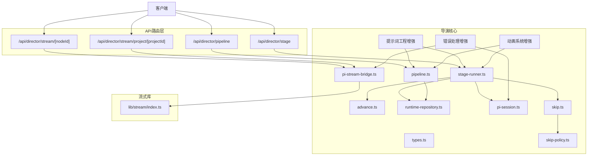
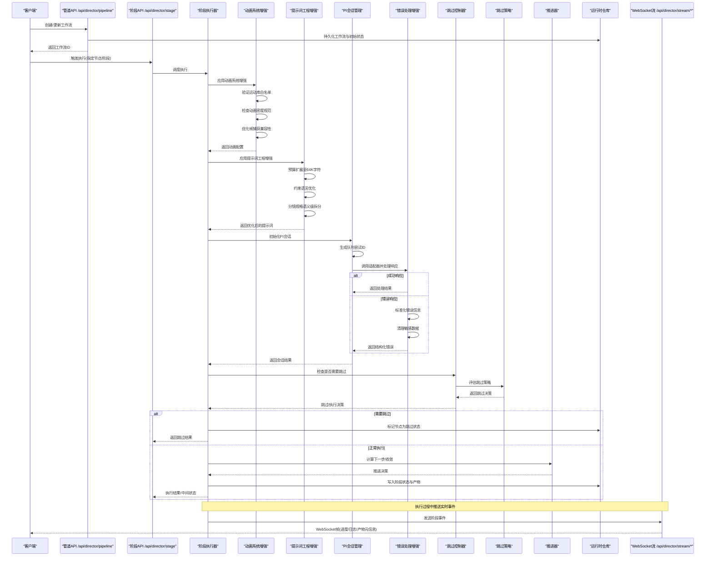
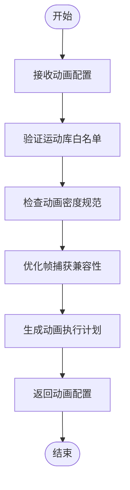
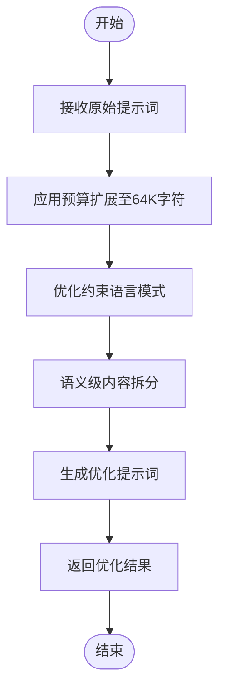
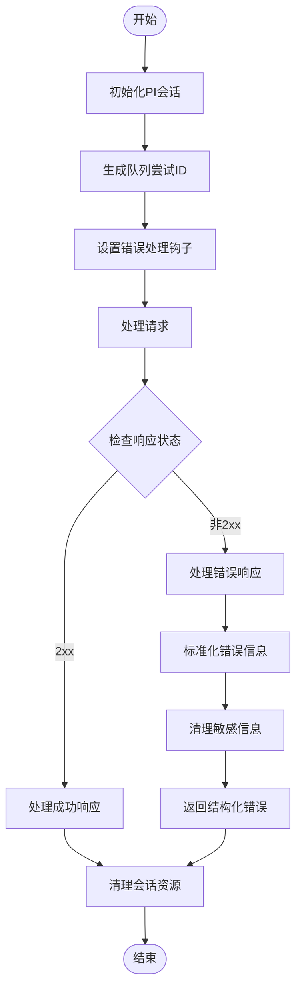
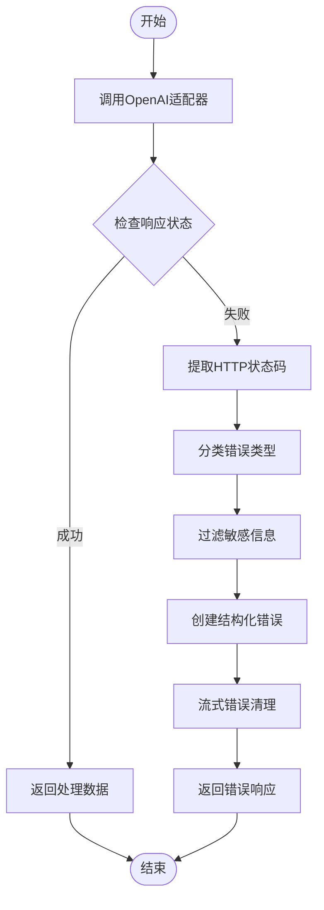
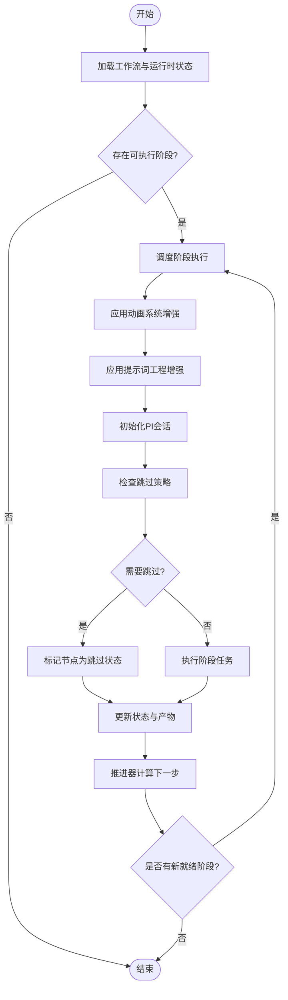
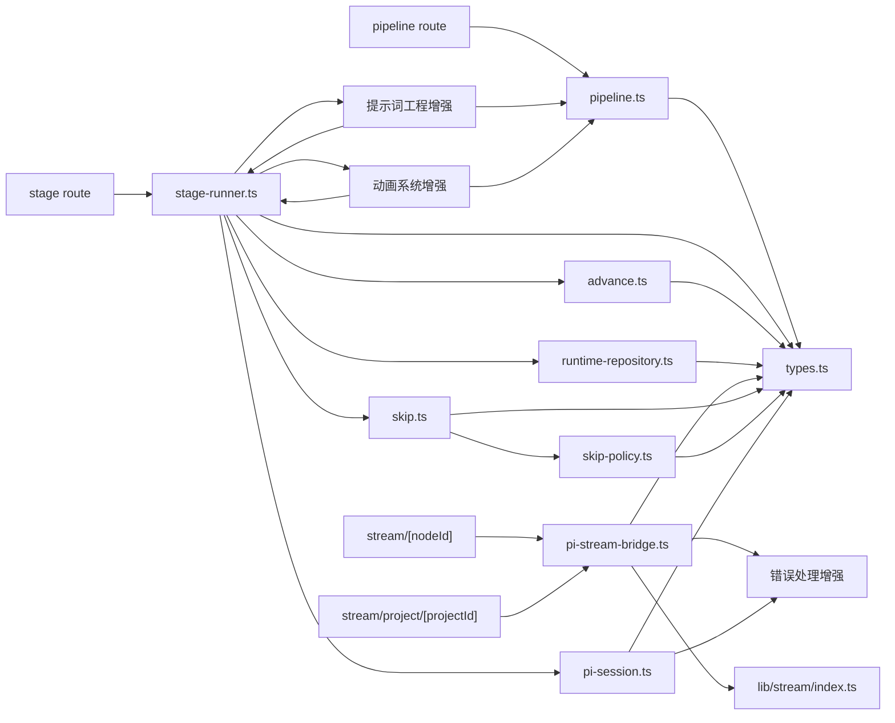

# 导演系统API

<cite>
**本文引用的文件**   
- [src/app/api/director/pipeline/route.ts](file://src/app/api/director/pipeline/route.ts)
- [src/app/api/director/stage/route.ts](file://src/app/api/director/stage/route.ts)
- [src/app/api/director/stream/[nodeId]/route.ts](file://src/app/api/director/stream/[nodeId]/route.ts)
- [src/app/api/director/stream/project/[projectId]/route.ts](file://src/app/api/director/stream/project/[projectId]/route.ts)
- [src/features/director/pipeline.ts](file://src/features/director/pipeline.ts)
- [src/features/director/stage-runner.ts](file://src/features/director/stage-runner.ts)
- [src/features/director/runtime-repository.ts](file://src/features/director/runtime-repository.ts)
- [src/features/director/advance.ts](file://src/features/director/advance.ts)
- [src/features/director/types.ts](file://src/features/director/types.ts)
- [src/features/director/pi-stream-bridge.ts](file://src/features/director/pi-stream-bridge.ts)
- [src/lib/stream/index.ts](file://src/lib/stream/index.ts)
- [src/features/director/skip.ts](file://src/features/director/skip.ts)
- [src/features/director/skip-policy.ts](file://src/features/director/skip-policy.ts)
- [src/features/director/pi-session.ts](file://src/features/director/pi-session.ts)
</cite>

## 更新摘要
**变更内容**   
- 增强动画能力：在导演提示词系统中新增确定性运动库白名单功能，支持更丰富的动画效果
- 动画密度规范：新增动画密度规格定义，确保动画效果的流畅性和性能平衡
- 帧捕获兼容性：优化帧捕获与动画系统的兼容性要求，提升渲染质量
- 提示词工程增强：预算从16,000增加到64,000 HTML字符，提升复杂场景处理能力
- 约束语言改进：从禁止性指令转变为愿景性指导，提高AI响应质量
- 分镜规格优化：实现语义级单元拆分，提升内容解析精度
- PI会话模块增强：改进了队列尝试ID传播机制和错误处理标准化

## 目录
1. [简介](#简介)
2. [项目结构](#项目结构)
3. [核心组件](#核心组件)
4. [架构总览](#架构总览)
5. [详细组件分析](#详细组件分析)
6. [依赖分析](#依赖分析)
7. [性能考虑](#性能考虑)
8. [故障排查指南](#故障排查指南)
9. [结论](#结论)
10. [附录](#附录)

## 简介
本文件为AI导演系统的API文档，聚焦于管道编排、阶段执行与实时流式通信。内容涵盖工作流定义、节点配置、状态同步、管道创建与执行监控、错误处理，以及WebSocket实时通信的连接建立、消息格式与事件订阅等。**最新更新**：系统现已增强动画能力，在提示词系统中新增确定性运动库白名单功能，支持更丰富的动画效果；新增动画密度规范定义，确保动画效果的流畅性和性能平衡；优化帧捕获与动画系统的兼容性要求，提升渲染质量。同时增强了提示词工程能力，预算从16,000提升到64,000 HTML字符，支持更复杂的场景处理；改进了约束语言从禁止性指令到愿景性指导的转变，提升AI响应质量；实现了语义级分镜规格单元拆分，提高内容解析精度。读者可据此快速集成前端或后端服务，实现对导演管道的全生命周期管理。

## 项目结构
导演系统API位于Next.js应用的路由层（app/api），并通过features/director模块提供核心编排能力；实时流通过lib/stream进行封装。关键路径如下：
- API路由：src/app/api/director/{pipeline,stage,stream}
- 编排与执行：src/features/director/{pipeline,stage-runner,advance,runtime-repository,types,pi-stream-bridge,pi-session}
- 跳过功能：src/features/director/{skip,sip-policy}
- **新增动画能力**：确定性运动库白名单、动画密度规范、帧捕获兼容性
- **新增提示词工程增强**：预算提升至64,000 HTML字符，约束语言优化，分镜规格语义级拆分
- **新增错误处理增强**：PI会话模块的队列尝试ID传播、提示词失败标准化、非2xx响应处理、流式错误清理
- 流式传输：src/lib/stream

**图表来源**
- [src/app/api/director/pipeline/route.ts](file://src/app/api/director/pipeline/route.ts)
- [src/app/api/director/stage/route.ts](file://src/app/api/director/stage/route.ts)
- [src/app/api/director/stream/[nodeId]/route.ts](file://src/app/api/director/stream/[nodeId]/route.ts)
- [src/app/api/director/stream/project/[projectId]/route.ts](file://src/app/api/director/stream/project/[projectId]/route.ts)
- [src/features/director/pipeline.ts](file://src/features/director/pipeline.ts)
- [src/features/director/stage-runner.ts](file://src/features/director/stage-runner.ts)
- [src/features/director/advance.ts](file://src/features/director/advance.ts)
- [src/features/director/runtime-repository.ts](file://src/features/director/runtime-repository.ts)
- [src/features/director/types.ts](file://src/features/director/types.ts)
- [src/features/director/pi-stream-bridge.ts](file://src/features/director/pi-stream-bridge.ts)
- [src/features/director/pi-session.ts](file://src/features/director/pi-session.ts)
- [src/features/director/skip.ts](file://src/features/director/skip.ts)
- [src/features/director/skip-policy.ts](file://src/features/director/skip-policy.ts)
- [src/lib/stream/index.ts](file://src/lib/stream/index.ts)

## 核心组件
- 管道编排（Pipeline）：负责创建工作流、解析节点拓扑、校验输入输出契约、持久化运行时上下文。
- 阶段执行器（Stage Runner）：按拓扑顺序调度并执行各阶段，维护阶段状态、产物与错误传播。
- 跳过控制器（Skip Controller）：根据策略判断是否跳过特定节点，优化执行路径。
- 跳过策略（Skip Policy）：定义节点跳过的业务规则和条件判断逻辑。
- 推进器（Advance）：驱动阶段间推进、收敛与分支合并，保证一致性。
- 运行时仓库（Runtime Repository）：持久化与查询运行态数据（节点状态、产物、进度）。
- 类型与契约（Types）：统一描述工作流、节点、阶段、产物、状态枚举与错误码。
- 流式桥接（PI Stream Bridge）：将内部流事件转换为WebSocket帧，支持项目级与节点级订阅。
- PI会话管理（PI Session）：增强的会话管理，包含队列尝试ID传播、提示词失败标准化、非2xx响应处理、流式错误清理。
- **动画系统增强（Animation System Enhancement）**：**新增** 确定性运动库白名单、动画密度规范、帧捕获兼容性优化。
- **提示词工程增强（Prompt Engineering Enhancement）**：预算提升至64,000 HTML字符，约束语言优化，分镜规格语义级拆分。
- **错误处理增强（Error Handling Enhancement）**：统一的错误处理机制，确保错误信息的准确性和安全性。
- 流式库（Stream Lib）：封装WebSocket连接、心跳、重连、消息编解码与事件分发。

**章节来源**
- [src/features/director/pipeline.ts](file://src/features/director/pipeline.ts)
- [src/features/director/stage-runner.ts](file://src/features/director/stage-runner.ts)
- [src/features/director/skip.ts](file://src/features/director/skip.ts)
- [src/features/director/skip-policy.ts](file://src/features/director/skip-policy.ts)
- [src/features/director/advance.ts](file://src/features/director/advance.ts)
- [src/features/director/runtime-repository.ts](file://src/features/director/runtime-repository.ts)
- [src/features/director/types.ts](file://src/features/director/types.ts)
- [src/features/director/pi-stream-bridge.ts](file://src/features/director/pi-stream-bridge.ts)
- [src/features/director/pi-session.ts](file://src/features/director/pi-session.ts)
- [src/lib/stream/index.ts](file://src/lib/stream/index.ts)

## 架构总览
下图展示从HTTP请求到阶段执行与WebSocket推送的整体流程，**包含新增的动画系统增强、提示词工程增强、错误处理增强机制和PI会话管理**。

**图表来源**
- [src/app/api/director/pipeline/route.ts](file://src/app/api/director/pipeline/route.ts)
- [src/app/api/director/stage/route.ts](file://src/app/api/director/stage/route.ts)
- [src/features/director/stage-runner.ts](file://src/features/director/stage-runner.ts)
- [src/features/director/pi-session.ts](file://src/features/director/pi-session.ts)
- [src/features/director/skip.ts](file://src/features/director/skip.ts)
- [src/features/director/skip-policy.ts](file://src/features/director/skip-policy.ts)
- [src/features/director/advance.ts](file://src/features/director/advance.ts)
- [src/features/director/runtime-repository.ts](file://src/features/director/runtime-repository.ts)
- [src/app/api/director/stream/[nodeId]/route.ts](file://src/app/api/director/stream/[nodeId]/route.ts)
- [src/app/api/director/stream/project/[projectId]/route.ts](file://src/app/api/director/stream/project/[projectId]/route.ts)

## 详细组件分析

### 管道编排API（/api/director/pipeline）
- 功能：创建工作流、更新拓扑、校验节点配置、初始化运行时上下文。
- 典型调用：
  - POST /api/director/pipeline：提交工作流定义（节点列表、边关系、输入契约、阶段参数）。
  - GET /api/director/pipeline/:id：获取工作流定义与当前状态。
  - PUT /api/director/pipeline/:id：增量更新拓扑或参数。
- 响应要点：工作流ID、版本、状态、校验结果、错误详情。
- 错误处理：输入校验失败返回结构化错误；重复创建返回冲突；权限不足返回未授权。

**章节来源**
- [src/app/api/director/pipeline/route.ts](file://src/app/api/director/pipeline/route.ts)
- [src/features/director/pipeline.ts](file://src/features/director/pipeline.ts)
- [src/features/director/types.ts](file://src/features/director/types.ts)

### 阶段执行API（/api/director/stage）
- 功能：触发阶段执行、查询阶段状态、重试失败阶段、取消执行。
- 典型调用：
  - POST /api/director/stage：提交执行请求（工作流ID、目标阶段/节点、参数）。
  - GET /api/director/stage/:runId：查询执行实例状态与进度。
  - POST /api/director/stage/:runId/retry：重试失败阶段。
  - POST /api/director/stage/:runId/cancel：取消执行。
- 响应要点：执行ID、阶段状态、进度百分比、错误堆栈摘要、产物引用。
- 错误处理：非法阶段名、前置条件不满足、资源不足、并发限制。

**章节来源**
- [src/app/api/director/stage/route.ts](file://src/app/api/director/stage/route.ts)
- [src/features/director/stage-runner.ts](file://src/features/director/stage-runner.ts)
- [src/features/director/advance.ts](file://src/features/director/advance.ts)
- [src/features/director/runtime-repository.ts](file://src/features/director/runtime-repository.ts)

### 动画系统增强（Animation System Enhancement）
- **新增功能**：在导演提示词系统中集成动画能力，支持确定性运动库和白名单机制。
- 核心特性：
  - 确定性运动库白名单：严格限定可用的动画库，确保动画效果的一致性和可预测性。
  - 动画密度规范：定义动画密度规格，平衡视觉效果与性能表现。
  - 帧捕获兼容性：优化动画系统与帧捕获的兼容性，确保渲染质量。
  - 动画参数验证：验证动画参数的合法性和合理性。
  - 性能优化：自动调整动画复杂度以适应不同设备性能。
- 处理流程：
  - 接收动画配置请求
  - 验证运动库白名单
  - 检查动画密度规范
  - 优化帧捕获兼容性
  - 生成动画执行计划
  - 返回动画配置

**图表来源**
- [src/features/director/pipeline.ts](file://src/features/director/pipeline.ts)
- [src/features/director/stage-runner.ts](file://src/features/director/stage-runner.ts)

**章节来源**
- [src/features/director/pipeline.ts](file://src/features/director/pipeline.ts)
- [src/features/director/stage-runner.ts](file://src/features/director/stage-runner.ts)

### 提示词工程增强（Prompt Engineering Enhancement）
- **新增功能**：增强的提示词工程处理能力，支持更复杂的AI交互场景。
- 核心特性：
  - 预算扩展：从16,000提升到64,000 HTML字符，支持更复杂的提示词内容。
  - 约束语言优化：从禁止性指令转变为愿景性指导，提高AI响应质量和创造性。
  - 分镜规格细化：实现语义级单元拆分，提升内容解析精度和结构化程度。
  - 智能提示词生成：基于上下文自动优化提示词结构和表达方式。
- 处理流程：
  - 接收原始提示词内容
  - 应用预算扩展策略
  - 转换约束语言模式
  - 执行语义级内容拆分
  - 生成优化后的提示词
  - 返回给执行器使用

**图表来源**
- [src/features/director/pipeline.ts](file://src/features/director/pipeline.ts)
- [src/features/director/stage-runner.ts](file://src/features/director/stage-runner.ts)

**章节来源**
- [src/features/director/pipeline.ts](file://src/features/director/pipeline.ts)
- [src/features/director/stage-runner.ts](file://src/features/director/stage-runner.ts)

### PI会话管理（PI Session Management）
- **新增功能**：增强的PI会话管理，提供统一的会话控制和错误处理。
- 核心特性：
  - 队列尝试ID传播：为每个会话生成唯一的队列尝试ID，便于追踪和调试。
  - 提示词失败标准化：统一处理各种提示词失败场景，提供标准化的错误格式。
  - 非2xx响应处理：正确处理各种HTTP状态码，提取有用的错误信息。
  - 流式错误清理：在流式传输过程中清理敏感信息，确保数据安全。
- 处理流程：
  - 初始化会话并生成唯一标识符
  - 设置错误处理钩子
  - 处理请求和响应
  - 清理会话资源和敏感信息
  - 记录详细的错误日志

**图表来源**
- [src/features/director/pi-session.ts](file://src/features/director/pi-session.ts)

**章节来源**
- [src/features/director/pi-session.ts](file://src/features/director/pi-session.ts)

### 错误处理增强（Error Handling Enhancement）
- **新增功能**：统一的错误处理机制，确保错误信息的准确性和安全性。
- 核心特性：
  - HTTP状态码保留：正确提取并保留4xx/5xx状态码前缀，确保错误分类准确性。
  - 敏感信息保护：在不暴露提供商响应体内容的情况下进行错误处理。
  - 错误分类：根据HTTP状态码范围自动分类错误类型（客户端错误、服务器错误、网络错误等）。
  - 结构化错误响应：提供统一的错误格式，便于客户端处理和显示。
  - 流式错误清理：在流式传输过程中过滤敏感数据。
- 处理流程：
  - 捕获原始HTTP响应状态码
  - 提取状态码前缀进行分类
  - 过滤敏感响应数据
  - 生成结构化错误对象
  - 传递到上层错误处理链

**图表来源**
- [src/features/director/pi-stream-bridge.ts](file://src/features/director/pi-stream-bridge.ts)

**章节来源**
- [src/features/director/pi-stream-bridge.ts](file://src/features/director/pi-stream-bridge.ts)

### 跳过节点功能（Skip Controller）
- 功能：根据策略动态判断是否跳过特定节点，提升执行效率。
- 核心特性：
  - 条件评估：基于节点属性、运行时状态和业务规则判断跳过条件。
  - 策略模式：支持多种跳过策略（如基于依赖状态、资源可用性、用户配置等）。
  - 状态同步：跳过决策会同步到运行时状态，确保状态一致性。
  - 事件通知：跳过事件通过WebSocket实时推送给订阅者。
- 使用场景：
  - 依赖节点失败时自动跳过后续节点
  - 资源不足时跳过高开销节点
  - 用户配置中禁用特定节点
  - 测试模式下跳过生产环境专用节点

**图表来源**
- [src/features/director/skip.ts](file://src/features/director/skip.ts)
- [src/features/director/skip-policy.ts](file://src/features/director/skip-policy.ts)

**章节来源**
- [src/features/director/skip.ts](file://src/features/director/skip.ts)
- [src/features/director/skip-policy.ts](file://src/features/director/skip-policy.ts)

### 跳过策略（Skip Policy）
- 功能：定义节点跳过的业务规则和条件判断逻辑。
- 策略类型：
  - 依赖检查策略：基于上游节点状态决定是否跳过
  - 资源检查策略：基于可用资源判断是否跳过
  - 配置策略：基于用户配置和环境变量控制
  - 自定义策略：支持插件式扩展自定义跳过逻辑
- 策略评估：
  - 优先级排序：多个策略按优先级依次评估
  - 短路机制：任一策略判定跳过则立即终止评估
  - 缓存机制：策略评估结果缓存避免重复计算

**章节来源**
- [src/features/director/skip-policy.ts](file://src/features/director/skip-policy.ts)

### 实时流式通信（/api/director/stream）
- 功能：基于WebSocket的实时事件推送，支持项目级与节点级订阅。
- 连接建立：
  - WS /api/director/stream/project/[projectId]：订阅某项目的所有节点事件。
  - WS /api/director/stream/[nodeId]：订阅特定节点的事件。
- 消息格式（示例字段说明）：
  - type：事件类型（如 stage_start、stage_progress、stage_complete、stage_error、artifact_update、system_log、**node_skipped**、**animation_config**）。
  - run_id：执行实例ID。
  - node_id：节点ID。
  - payload：事件负载（进度、日志、产物元信息等）。
  - ts：时间戳。
- 客户端行为建议：
  - 连接后发送subscribe消息声明订阅范围（project/node）。
  - 处理reconnect与心跳保活。
  - 对stage_error进行告警与重试策略。
  - **新增**：处理node_skipped事件，更新UI显示跳过状态。
  - **新增**：处理animation_config事件，更新动画配置显示。
  - **新增**：处理标准化错误信息，显示友好的错误提示。
- 服务端行为：
  - 广播阶段事件至对应订阅者。
  - 断线自动重连与消息去抖。
  - 限流与背压保护。
  - **新增**：在流式传输中清理敏感信息。
  - **新增**：推送动画配置和状态更新事件。

**章节来源**
- [src/app/api/director/stream/[nodeId]/route.ts](file://src/app/api/director/stream/[nodeId]/route.ts)
- [src/app/api/director/stream/project/[projectId]/route.ts](file://src/app/api/director/stream/project/[projectId]/route.ts)
- [src/features/director/pi-stream-bridge.ts](file://src/features/director/pi-stream-bridge.ts)
- [src/lib/stream/index.ts](file://src/lib/stream/index.ts)

### 阶段执行器与推进逻辑
- 阶段执行器：
  - 解析拓扑，确定可执行阶段集合。
  - **新增**：在执行前检查跳过策略，跳过符合条件的节点。
  - **新增**：使用PI会话管理进行统一的错误处理。
  - **新增**：应用提示词工程增强，优化提示词内容。
  - **新增**：应用动画系统增强，验证和优化动画配置。
  - 并行度控制与资源隔离。
  - 捕获异常并记录错误上下文。
- 推进器：
  - 根据阶段完成状态决定下一步。
  - 处理分支合并与收敛点。
  - 确保幂等性与一致性。

**图表来源**
- [src/features/director/stage-runner.ts](file://src/features/director/stage-runner.ts)
- [src/features/director/skip.ts](file://src/features/director/skip.ts)
- [src/features/director/skip-policy.ts](file://src/features/director/skip-policy.ts)
- [src/features/director/advance.ts](file://src/features/director/advance.ts)
- [src/features/director/runtime-repository.ts](file://src/features/director/runtime-repository.ts)
- [src/features/director/pi-session.ts](file://src/features/director/pi-session.ts)

**章节来源**
- [src/features/director/stage-runner.ts](file://src/features/director/stage-runner.ts)
- [src/features/director/skip.ts](file://src/features/director/skip.ts)
- [src/features/director/skip-policy.ts](file://src/features/director/skip-policy.ts)
- [src/features/director/advance.ts](file://src/features/director/advance.ts)
- [src/features/director/runtime-repository.ts](file://src/features/director/runtime-repository.ts)

### 数据类型与契约
- 工作流定义：包含节点列表、边关系、输入输出契约、阶段参数。
- 节点配置：阶段类型、处理器、依赖、重试策略、超时、**跳过策略配置、动画配置**。
- 运行时状态：阶段状态机（pending、running、completed、failed、cancelled、**skipped**）、进度、产物引用。
- 错误模型：错误码、错误消息、堆栈摘要、可恢复性标记。
- **新增状态**：skipped状态表示节点被策略跳过，区别于failed和cancelled。
- **新增错误类型**：标准化的错误格式，包含错误码、消息、详细信息和安全标志。
- **新增提示词配置**：预算限制、约束语言模式、分镜规格粒度设置。
- **新增动画配置**：运动库白名单、动画密度规范、帧捕获兼容性设置。

**章节来源**
- [src/features/director/types.ts](file://src/features/director/types.ts)

## 依赖分析
- API路由层依赖features/director中的编排与执行模块。
- 阶段执行器依赖推进器、运行时仓库、**新增的跳过控制器、PI会话管理和提示词工程增强**。
- 跳过控制器依赖**跳过策略模块**进行条件评估。
- 流式桥接依赖lib/stream实现WebSocket通信。
- 类型定义贯穿所有模块，确保契约一致。
- **新增**：错误处理增强模块依赖OpenAI适配器进行HTTP状态码处理。
- **新增**：PI会话管理依赖错误处理增强模块进行统一错误处理。
- **新增**：提示词工程增强模块依赖管道编排和阶段执行器进行内容优化。
- **新增**：动画系统增强模块依赖管道编排和阶段执行器进行动画配置验证。

**图表来源**
- [src/app/api/director/pipeline/route.ts](file://src/app/api/director/pipeline/route.ts)
- [src/app/api/director/stage/route.ts](file://src/app/api/director/stage/route.ts)
- [src/app/api/director/stream/[nodeId]/route.ts](file://src/app/api/director/stream/[nodeId]/route.ts)
- [src/app/api/director/stream/project/[projectId]/route.ts](file://src/app/api/director/stream/project/[projectId]/route.ts)
- [src/features/director/pipeline.ts](file://src/features/director/pipeline.ts)
- [src/features/director/stage-runner.ts](file://src/features/director/stage-runner.ts)
- [src/features/director/skip.ts](file://src/features/director/skip.ts)
- [src/features/director/skip-policy.ts](file://src/features/director/skip-policy.ts)
- [src/features/director/advance.ts](file://src/features/director/advance.ts)
- [src/features/director/runtime-repository.ts](file://src/features/director/runtime-repository.ts)
- [src/features/director/types.ts](file://src/features/director/types.ts)
- [src/features/director/pi-stream-bridge.ts](file://src/features/director/pi-stream-bridge.ts)
- [src/features/director/pi-session.ts](file://src/features/director/pi-session.ts)
- [src/lib/stream/index.ts](file://src/lib/stream/index.ts)

## 性能考虑
- 阶段并行度：根据CPU/IO特性动态调整，避免过载。
- 产物缓存：对确定性阶段启用缓存，减少重复计算。
- 跳过优化：跳过策略评估结果缓存，避免重复条件检查。
- 流式推送：使用背压与节流，防止客户端拥塞。
- 数据库访问：批量写入与事务边界优化，降低锁竞争。
- 内存管理：大产物分块处理与临时文件清理。
- **新增**：错误处理优化，避免不必要的响应体解析和数据复制。
- **新增**：会话管理优化，及时清理会话资源，防止内存泄漏。
- **新增**：提示词工程优化，合理分配64K字符预算，避免过度消耗。
- **新增**：语义级拆分优化，平衡内容粒度和处理效率。
- **新增**：动画系统优化，根据设备性能自动调整动画复杂度。
- **新增**：帧捕获优化，确保动画渲染质量和性能平衡。

## 故障排查指南
- 常见错误：
  - 工作流校验失败：检查节点依赖与输入契约。
  - 阶段执行失败：查看错误堆栈摘要与上下文日志。
  - WebSocket断连：确认订阅范围与心跳设置。
  - 跳过策略异常：检查策略配置和条件表达式语法。
  - **新增**：PI会话错误：检查队列尝试ID生成和会话资源清理。
  - **新增**：错误处理异常：检查错误标准化流程和敏感信息过滤。
  - **新增**：提示词工程错误：检查预算分配和约束语言转换。
  - **新增**：分镜规格解析错误：检查语义级拆分逻辑和内容结构。
  - **新增**：动画系统错误：检查运动库白名单和动画密度规范。
  - **新增**：帧捕获兼容性问题：检查动画与帧捕获的兼容性设置。
- 诊断步骤：
  - 通过阶段API查询执行实例状态与进度。
  - 订阅WebSocket事件，定位失败阶段与错误原因。
  - 检查运行时仓库中产物与状态一致性。
  - 检查跳过策略日志，确认跳过决策合理性。
  - **新增**：检查PI会话日志，确认队列尝试ID传播和会话状态。
  - **新增**：检查错误处理日志，确认错误标准化和敏感信息清理。
  - **新增**：检查提示词工程日志，确认预算使用和语言转换效果。
  - **新增**：检查分镜规格解析日志，确认语义级拆分准确性。
  - **新增**：检查动画系统日志，确认运动库白名单验证和动画密度检查。
  - **新增**：检查帧捕获日志，确认动画与帧捕获的兼容性。
- 恢复策略：
  - 对可恢复错误进行重试与回滚。
  - 对不可恢复错误进行告警与人工介入。
  - 对跳过策略错误进行降级处理，默认不跳过。
  - **新增**：对PI会话错误进行会话重置和资源清理。
  - **新增**：对错误处理异常进行降级处理，返回基本错误信息。
  - **新增**：对提示词工程错误进行降级处理，使用基础提示词模板。
  - **新增**：对分镜规格解析错误进行降级处理，使用默认分割策略。
  - **新增**：对动画系统错误进行降级处理，使用基础动画配置。
  - **新增**：对帧捕获兼容性问题进行降级处理，禁用高级动画效果。

**章节来源**
- [src/app/api/director/stage/route.ts](file://src/app/api/director/stage/route.ts)
- [src/features/director/stage-runner.ts](file://src/features/director/stage-runner.ts)
- [src/app/api/director/stream/[nodeId]/route.ts](file://src/app/api/director/stream/[nodeId]/route.ts)
- [src/features/director/skip.ts](file://src/features/director/skip.ts)
- [src/features/director/skip-policy.ts](file://src/features/director/skip-policy.ts)
- [src/features/director/pi-session.ts](file://src/features/director/pi-session.ts)

## 结论
本API文档覆盖了AI导演系统的管道编排、阶段执行与实时流式通信的核心能力。**最新更新**：系统现已增强动画能力，在提示词系统中新增确定性运动库白名单功能，支持更丰富的动画效果；新增动画密度规范定义，确保动画效果的流畅性和性能平衡；优化帧捕获与动画系统的兼容性要求，提升渲染质量。同时增强了提示词工程能力，预算从16,000提升到64,000 HTML字符，支持更复杂的场景处理；改进了约束语言从禁止性指令到愿景性指导的转变，提升AI响应质量；实现了语义级分镜规格单元拆分，提高内容解析精度。同时增强了PI会话模块的错误处理能力，改进了队列尝试ID传播、提示词失败标准化、非2xx响应处理和流式错误清理机制，确保在错误发生时能够准确传递错误信息并保护敏感数据。通过清晰的接口定义、健壮的错误处理、高效的流式推送、灵活的跳过策略、完善的错误处理机制、增强的提示词工程能力和全新的动画系统，开发者可快速构建稳定且可靠的导演工作流应用。建议结合类型契约与监控指标，持续优化性能与可靠性。

## 附录
- 最佳实践：
  - 使用幂等键避免重复执行。
  - 合理划分阶段粒度，平衡并行与依赖。
  - 对长耗时阶段启用异步执行与进度上报。
  - 设计合理的跳过策略，避免误跳过关键节点。
  - **新增**：正确使用PI会话管理，确保会话资源的正确分配和清理。
  - **新增**：统一错误处理格式，提供友好的错误提示信息。
  - **新增**：合理使用64K字符预算，避免过度消耗。
  - **新增**：采用愿景性约束语言，提升AI响应创造性。
  - **新增**：合理设置分镜规格粒度，平衡解析精度和处理效率。
  - **新增**：正确使用动画系统白名单，确保动画效果的一致性。
  - **新增**：合理配置动画密度，平衡视觉效果与性能表现。
  - **新增**：优化帧捕获兼容性，确保动画渲染质量。
- 扩展点：
  - 自定义阶段处理器与工具函数。
  - 接入外部存储与媒体服务。
  - 扩展事件类型与订阅规则。
  - 实现自定义跳过策略，支持复杂业务逻辑。
  - **新增**：扩展错误处理策略，支持不同的错误分类和恢复机制。
  - **新增**：扩展PI会话管理，支持自定义会话存储和清理策略。
  - **新增**：扩展提示词工程，支持自定义预算分配和语言转换策略。
  - **新增**：扩展分镜规格解析，支持自定义语义级拆分规则。
  - **新增**：扩展动画系统，支持自定义运动库和动画效果。
  - **新增**：扩展帧捕获兼容性，支持不同的渲染引擎和输出格式。
- **新增功能使用示例**：
  - 基于依赖状态的跳过：当上游节点失败时自动跳过下游节点
  - 基于资源的跳过：内存不足时跳过高内存消耗节点
  - 基于配置的跳过：通过环境变量禁用特定节点
  - 混合策略：组合多个策略实现复杂的跳过逻辑
  - **新增**：PI会话管理：使用统一的会话接口进行错误处理和资源管理
  - **新增**：错误标准化：使用标准化的错误格式进行错误处理和显示
  - **新增**：敏感信息过滤：在错误响应中自动过滤敏感数据
  - **新增**：提示词工程：应用64K字符预算和愿景性约束语言
  - **新增**：分镜规格解析：实现语义级单元拆分和结构化处理
  - **新增**：动画系统配置：使用白名单机制验证运动库和动画效果
  - **新增**：动画密度优化：根据设备性能自动调整动画复杂度
  - **新增**：帧捕获兼容性：确保动画与帧捕获系统的无缝集成