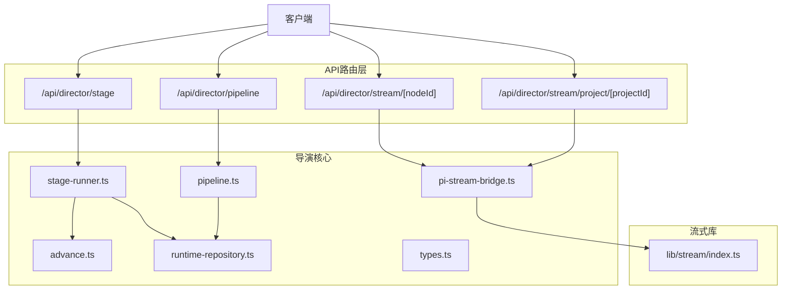
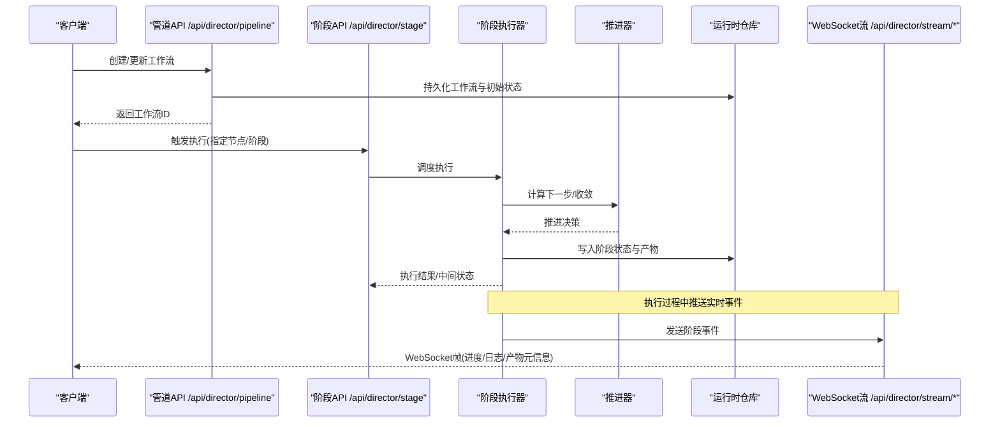
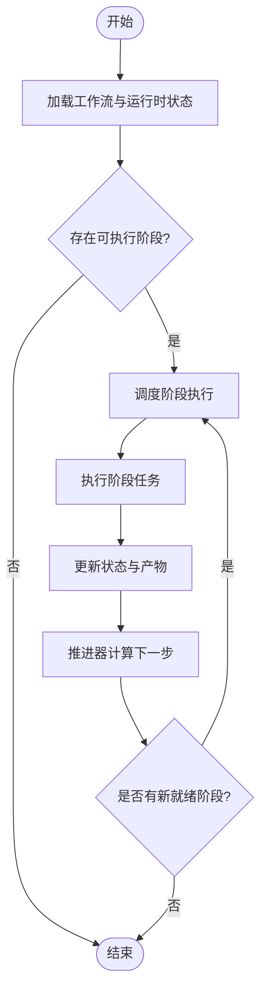
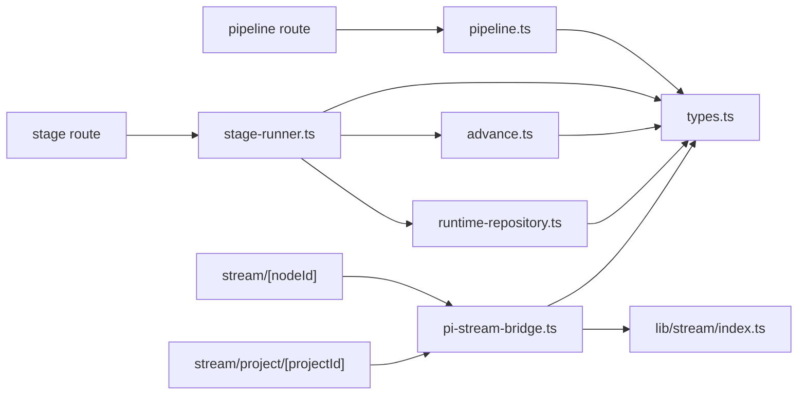

# 导演系统API

<cite>
**本文引用的文件**   
- [src/app/api/director/pipeline/route.ts](file://src/app/api/director/pipeline/route.ts)
- [src/app/api/director/stage/route.ts](file://src/app/api/director/stage/route.ts)
- [src/app/api/director/stream/[nodeId]/route.ts](file://src/app/api/director/stream/[nodeId]/route.ts)
- [src/app/api/director/stream/project/[projectId]/route.ts](file://src/app/api/director/stream/project/[projectId]/route.ts)
- [src/features/director/pipeline.ts](file://src/features/director/pipeline.ts)
- [src/features/director/stage-runner.ts](file://src/features/director/stage-runner.ts)
- [src/features/director/runtime-repository.ts](file://src/features/director/runtime-repository.ts)
- [src/features/director/advance.ts](file://src/features/director/advance.ts)
- [src/features/director/types.ts](file://src/features/director/types.ts)
- [src/features/director/pi-stream-bridge.ts](file://src/features/director/pi-stream-bridge.ts)
- [src/lib/stream/index.ts](file://src/lib/stream/index.ts)
</cite>

## 目录
1. [简介](#简介)
2. [项目结构](#项目结构)
3. [核心组件](#核心组件)
4. [架构总览](#架构总览)
5. [详细组件分析](#详细组件分析)
6. [依赖分析](#依赖分析)
7. [性能考虑](#性能考虑)
8. [故障排查指南](#故障排查指南)
9. [结论](#结论)
10. [附录](#附录)

## 简介
本文件为AI导演系统的API文档，聚焦于管道编排、阶段执行与实时流式通信。内容涵盖工作流定义、节点配置、状态同步、管道创建与执行监控、错误处理，以及WebSocket实时通信的连接建立、消息格式与事件订阅等。读者可据此快速集成前端或后端服务，实现对导演管道的全生命周期管理。

## 项目结构
导演系统API位于Next.js应用的路由层（app/api），并通过features/director模块提供核心编排能力；实时流通过lib/stream进行封装。关键路径如下：
- API路由：src/app/api/director/{pipeline,stage,stream}
- 编排与执行：src/features/director/{pipeline,stage-runner,advance,runtime-repository,types,pi-stream-bridge}
- 流式传输：src/lib/stream

图表来源
- [src/app/api/director/pipeline/route.ts](file://src/app/api/director/pipeline/route.ts)
- [src/app/api/director/stage/route.ts](file://src/app/api/director/stage/route.ts)
- [src/app/api/director/stream/[nodeId]/route.ts](file://src/app/api/director/stream/[nodeId]/route.ts)
- [src/app/api/director/stream/project/[projectId]/route.ts](file://src/app/api/director/stream/project/[projectId]/route.ts)
- [src/features/director/pipeline.ts](file://src/features/director/pipeline.ts)
- [src/features/director/stage-runner.ts](file://src/features/director/stage-runner.ts)
- [src/features/director/advance.ts](file://src/features/director/advance.ts)
- [src/features/director/runtime-repository.ts](file://src/features/director/runtime-repository.ts)
- [src/features/director/types.ts](file://src/features/director/types.ts)
- [src/features/director/pi-stream-bridge.ts](file://src/features/director/pi-stream-bridge.ts)
- [src/lib/stream/index.ts](file://src/lib/stream/index.ts)

章节来源
- [src/app/api/director/pipeline/route.ts](file://src/app/api/director/pipeline/route.ts)
- [src/app/api/director/stage/route.ts](file://src/app/api/director/stage/route.ts)
- [src/app/api/director/stream/[nodeId]/route.ts](file://src/app/api/director/stream/[nodeId]/route.ts)
- [src/app/api/director/stream/project/[projectId]/route.ts](file://src/app/api/director/stream/project/[projectId]/route.ts)
- [src/features/director/pipeline.ts](file://src/features/director/pipeline.ts)
- [src/features/director/stage-runner.ts](file://src/features/director/stage-runner.ts)
- [src/features/director/advance.ts](file://src/features/director/advance.ts)
- [src/features/director/runtime-repository.ts](file://src/features/director/runtime-repository.ts)
- [src/features/director/types.ts](file://src/features/director/types.ts)
- [src/features/director/pi-stream-bridge.ts](file://src/features/director/pi-stream-bridge.ts)
- [src/lib/stream/index.ts](file://src/lib/stream/index.ts)

## 核心组件
- 管道编排（Pipeline）：负责创建工作流、解析节点拓扑、校验输入输出契约、持久化运行时上下文。
- 阶段执行器（Stage Runner）：按拓扑顺序调度并执行各阶段，维护阶段状态、产物与错误传播。
- 推进器（Advance）：驱动阶段间推进、收敛与分支合并，保证一致性。
- 运行时仓库（Runtime Repository）：持久化与查询运行态数据（节点状态、产物、进度）。
- 类型与契约（Types）：统一描述工作流、节点、阶段、产物、状态枚举与错误码。
- 流式桥接（PI Stream Bridge）：将内部流事件转换为WebSocket帧，支持项目级与节点级订阅。
- 流式库（Stream Lib）：封装WebSocket连接、心跳、重连、消息编解码与事件分发。

章节来源
- [src/features/director/pipeline.ts](file://src/features/director/pipeline.ts)
- [src/features/director/stage-runner.ts](file://src/features/director/stage-runner.ts)
- [src/features/director/advance.ts](file://src/features/director/advance.ts)
- [src/features/director/runtime-repository.ts](file://src/features/director/runtime-repository.ts)
- [src/features/director/types.ts](file://src/features/director/types.ts)
- [src/features/director/pi-stream-bridge.ts](file://src/features/director/pi-stream-bridge.ts)
- [src/lib/stream/index.ts](file://src/lib/stream/index.ts)

## 架构总览
下图展示从HTTP请求到阶段执行与WebSocket推送的整体流程。

图表来源
- [src/app/api/director/pipeline/route.ts](file://src/app/api/director/pipeline/route.ts)
- [src/app/api/director/stage/route.ts](file://src/app/api/director/stage/route.ts)
- [src/features/director/stage-runner.ts](file://src/features/director/stage-runner.ts)
- [src/features/director/advance.ts](file://src/features/director/advance.ts)
- [src/features/director/runtime-repository.ts](file://src/features/director/runtime-repository.ts)
- [src/app/api/director/stream/[nodeId]/route.ts](file://src/app/api/director/stream/[nodeId]/route.ts)
- [src/app/api/director/stream/project/[projectId]/route.ts](file://src/app/api/director/stream/project/[projectId]/route.ts)

## 详细组件分析

### 管道编排API（/api/director/pipeline）
- 功能：创建工作流、更新拓扑、校验节点配置、初始化运行时上下文。
- 典型调用：
  - POST /api/director/pipeline：提交工作流定义（节点列表、边关系、输入契约、阶段参数）。
  - GET /api/director/pipeline/:id：获取工作流定义与当前状态。
  - PUT /api/director/pipeline/:id：增量更新拓扑或参数。
- 响应要点：工作流ID、版本、状态、校验结果、错误详情。
- 错误处理：输入校验失败返回结构化错误；重复创建返回冲突；权限不足返回未授权。

章节来源
- [src/app/api/director/pipeline/route.ts](file://src/app/api/director/pipeline/route.ts)
- [src/features/director/pipeline.ts](file://src/features/director/pipeline.ts)
- [src/features/director/types.ts](file://src/features/director/types.ts)

### 阶段执行API（/api/director/stage）
- 功能：触发阶段执行、查询阶段状态、重试失败阶段、取消执行。
- 典型调用：
  - POST /api/director/stage：提交执行请求（工作流ID、目标阶段/节点、参数）。
  - GET /api/director/stage/:runId：查询执行实例状态与进度。
  - POST /api/director/stage/:runId/retry：重试失败阶段。
  - POST /api/director/stage/:runId/cancel：取消执行。
- 响应要点：执行ID、阶段状态、进度百分比、错误堆栈摘要、产物引用。
- 错误处理：非法阶段名、前置条件不满足、资源不足、并发限制。

章节来源
- [src/app/api/director/stage/route.ts](file://src/app/api/director/stage/route.ts)
- [src/features/director/stage-runner.ts](file://src/features/director/stage-runner.ts)
- [src/features/director/advance.ts](file://src/features/director/advance.ts)
- [src/features/director/runtime-repository.ts](file://src/features/director/runtime-repository.ts)

### 实时流式通信（/api/director/stream）
- 功能：基于WebSocket的实时事件推送，支持项目级与节点级订阅。
- 连接建立：
  - WS /api/director/stream/project/[projectId]：订阅某项目的所有节点事件。
  - WS /api/director/stream/[nodeId]：订阅特定节点的事件。
- 消息格式（示例字段说明）：
  - type：事件类型（如 stage_start、stage_progress、stage_complete、stage_error、artifact_update、system_log）。
  - run_id：执行实例ID。
  - node_id：节点ID。
  - payload：事件负载（进度、日志、产物元信息等）。
  - ts：时间戳。
- 客户端行为建议：
  - 连接后发送subscribe消息声明订阅范围（project/node）。
  - 处理reconnect与心跳保活。
  - 对stage_error进行告警与重试策略。
- 服务端行为：
  - 广播阶段事件至对应订阅者。
  - 断线自动重连与消息去抖。
  - 限流与背压保护。

章节来源
- [src/app/api/director/stream/[nodeId]/route.ts](file://src/app/api/director/stream/[nodeId]/route.ts)
- [src/app/api/director/stream/project/[projectId]/route.ts](file://src/app/api/director/stream/project/[projectId]/route.ts)
- [src/features/director/pi-stream-bridge.ts](file://src/features/director/pi-stream-bridge.ts)
- [src/lib/stream/index.ts](file://src/lib/stream/index.ts)

### 阶段执行器与推进逻辑
- 阶段执行器：
  - 解析拓扑，确定可执行阶段集合。
  - 并行度控制与资源隔离。
  - 捕获异常并记录错误上下文。
- 推进器：
  - 根据阶段完成状态决定下一步。
  - 处理分支合并与收敛点。
  - 确保幂等性与一致性。

图表来源
- [src/features/director/stage-runner.ts](file://src/features/director/stage-runner.ts)
- [src/features/director/advance.ts](file://src/features/director/advance.ts)
- [src/features/director/runtime-repository.ts](file://src/features/director/runtime-repository.ts)

章节来源
- [src/features/director/stage-runner.ts](file://src/features/director/stage-runner.ts)
- [src/features/director/advance.ts](file://src/features/director/advance.ts)
- [src/features/director/runtime-repository.ts](file://src/features/director/runtime-repository.ts)

### 数据类型与契约
- 工作流定义：包含节点列表、边关系、输入输出契约、阶段参数。
- 节点配置：阶段类型、处理器、依赖、重试策略、超时。
- 运行时状态：阶段状态机（pending、running、completed、failed、cancelled）、进度、产物引用。
- 错误模型：错误码、错误消息、堆栈摘要、可恢复性标记。

章节来源
- [src/features/director/types.ts](file://src/features/director/types.ts)

## 依赖分析
- API路由层依赖features/director中的编排与执行模块。
- 阶段执行器依赖推进器与运行时仓库。
- 流式桥接依赖lib/stream实现WebSocket通信。
- 类型定义贯穿所有模块，确保契约一致。

图表来源
- [src/app/api/director/pipeline/route.ts](file://src/app/api/director/pipeline/route.ts)
- [src/app/api/director/stage/route.ts](file://src/app/api/director/stage/route.ts)
- [src/app/api/director/stream/[nodeId]/route.ts](file://src/app/api/director/stream/[nodeId]/route.ts)
- [src/app/api/director/stream/project/[projectId]/route.ts](file://src/app/api/director/stream/project/[projectId]/route.ts)
- [src/features/director/pipeline.ts](file://src/features/director/pipeline.ts)
- [src/features/director/stage-runner.ts](file://src/features/director/stage-runner.ts)
- [src/features/director/advance.ts](file://src/features/director/advance.ts)
- [src/features/director/runtime-repository.ts](file://src/features/director/runtime-repository.ts)
- [src/features/director/types.ts](file://src/features/director/types.ts)
- [src/features/director/pi-stream-bridge.ts](file://src/features/director/pi-stream-bridge.ts)
- [src/lib/stream/index.ts](file://src/lib/stream/index.ts)

章节来源
- [src/features/director/types.ts](file://src/features/director/types.ts)
- [src/lib/stream/index.ts](file://src/lib/stream/index.ts)

## 性能考虑
- 阶段并行度：根据CPU/IO特性动态调整，避免过载。
- 产物缓存：对确定性阶段启用缓存，减少重复计算。
- 流式推送：使用背压与节流，防止客户端拥塞。
- 数据库访问：批量写入与事务边界优化，降低锁竞争。
- 内存管理：大产物分块处理与临时文件清理。

[本节为通用指导，无需具体文件来源]

## 故障排查指南
- 常见错误：
  - 工作流校验失败：检查节点依赖与输入契约。
  - 阶段执行失败：查看错误堆栈摘要与上下文日志。
  - WebSocket断连：确认订阅范围与心跳设置。
- 诊断步骤：
  - 通过阶段API查询执行实例状态与进度。
  - 订阅WebSocket事件，定位失败阶段与错误原因。
  - 检查运行时仓库中产物与状态一致性。
- 恢复策略：
  - 对可恢复错误进行重试与回滚。
  - 对不可恢复错误进行告警与人工介入。

章节来源
- [src/app/api/director/stage/route.ts](file://src/app/api/director/stage/route.ts)
- [src/features/director/stage-runner.ts](file://src/features/director/stage-runner.ts)
- [src/app/api/director/stream/[nodeId]/route.ts](file://src/app/api/director/stream/[nodeId]/route.ts)

## 结论
本API文档覆盖了AI导演系统的管道编排、阶段执行与实时流式通信的核心能力。通过清晰的接口定义、健壮的错误处理与高效的流式推送，开发者可快速构建稳定的导演工作流应用。建议结合类型契约与监控指标，持续优化性能与可靠性。

[本节为总结，无需具体文件来源]

## 附录
- 最佳实践：
  - 使用幂等键避免重复执行。
  - 合理划分阶段粒度，平衡并行与依赖。
  - 对长耗时阶段启用异步执行与进度上报。
- 扩展点：
  - 自定义阶段处理器与工具函数。
  - 接入外部存储与媒体服务。
  - 扩展事件类型与订阅规则。

[本节为补充信息，无需具体文件来源]