# 管道编排API

<cite>
**本文档引用的文件**
- [src/app/api/director/pipeline/route.ts](file://src/app/api/director/pipeline/route.ts)
- [src/app/api/director/stage/route.ts](file://src/app/api/director/stage/route.ts)
- [src/app/api/director/stream/[nodeId]/route.ts](file://src/app/api/director/stream/[nodeId]/route.ts)
- [src/app/api/director/stream/project/[projectId]/route.ts](file://src/app/api/director/stream/project/[projectId]/route.ts)
- [src/features/director/index.ts](file://src/features/director/index.ts)
- [src/features/director/types.ts](file://src/features/director/types.ts)
- [src/features/director/pipeline.ts](file://src/features/director/pipeline.ts)
- [src/features/director/advance.ts](file://src/features/director/advance.ts)
- [src/features/director/runtime-repository.ts](file://src/features/director/runtime-repository.ts)
- [src/features/director/session-store.ts](file://src/features/director/session-store.ts)
- [src/features/director/stage-runner.ts](file://src/features/director/stage-runner.ts)
- [src/features/director/stage-result.ts](file://src/features/director/stage-result.ts)
- [src/features/director/stage-effects.ts](file://src/features/director/stage-effects.ts)
- [src/features/director/runtime-artifact-source.ts](file://src/features/director/runtime-artifact-source.ts)
- [src/features/director/runtime-artifact-writer.ts](file://src/features/director/runtime-artifact-writer.ts)
- [src/features/director/runtime-node-data.ts](file://src/features/director/runtime-node-data.ts)
- [src/features/director/pi-provider.ts](file://src/features/director/pi-provider.ts)
- [src/features/director/pi-session.ts](file://src/features/director/pi-session.ts)
- [src/features/director/queue-handler.ts](file://src/features/director/queue-handler.ts)
- [src/features/director/recovery.ts](file://src/features/director/recovery.ts)
- [server/src/compose/run-pipeline.ts](file://server/src/compose/run-pipeline.ts)
</cite>

## 更新摘要
**所做更改**
- 在管道创建接口中新增配额预验证机制
- 添加成本池验证和402计费合同错误处理
- 更新管道启动流程以包含配额检查步骤
- 增强错误处理以支持标准化计费错误响应

## 目录
1. [简介](#简介)
2. [项目结构](#项目结构)
3. [核心组件](#核心组件)
4. [架构总览](#架构总览)
5. [详细组件分析](#详细组件分析)
6. [依赖关系分析](#依赖关系分析)
7. [性能考量](#性能考量)
8. [故障排查指南](#故障排查指南)
9. [结论](#结论)
10. [附录](#附录)

## 简介
本文件面向"管道编排API"，系统化说明工作流管道的创建、配置与执行接口，涵盖以下关键主题：
- 管道定义结构与节点依赖关系
- 执行参数与运行上下文
- **新增：配额预验证与计费管理**
- 管道状态管理、进度跟踪与结果获取
- 错误处理与恢复策略
- 完整示例：基础管道、复杂工作流、错误处理场景

该API以REST风格暴露端点，并通过内部编排器驱动阶段（Stage）的调度、执行与结果持久化。

## 项目结构
与管道编排相关的代码主要分布在以下位置：
- API路由层：负责接收请求、校验输入、调用编排服务并返回响应
- 编排核心：定义管道模型、阶段执行、依赖解析、状态推进与结果提交
- 运行时数据：节点数据、工件读写、会话存储与队列处理
- 外部集成：AI提供者、流式输出等

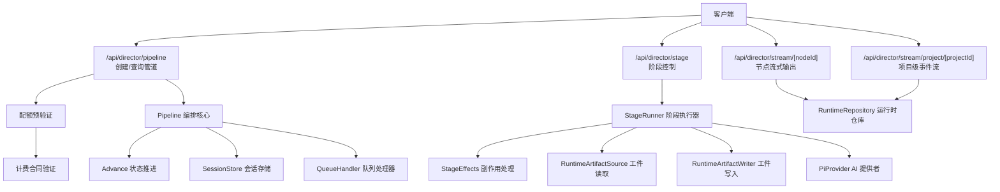

**图表来源**
- [src/app/api/director/pipeline/route.ts](file://src/app/api/director/pipeline/route.ts)
- [src/app/api/director/stage/route.ts](file://src/app/api/director/stage/route.ts)
- [src/app/api/director/stream/[nodeId]/route.ts](file://src/app/api/director/stream/[nodeId]/route.ts)
- [src/app/api/director/stream/project/[projectId]/route.ts](file://src/app/api/director/stream/project/[projectId]/route.ts)
- [src/features/director/pipeline.ts](file://src/features/director/pipeline.ts)
- [src/features/director/advance.ts](file://src/features/director/advance.ts)
- [src/features/director/stage-runner.ts](file://src/features/director/stage-runner.ts)
- [src/features/director/runtime-repository.ts](file://src/features/director/runtime-repository.ts)
- [src/features/director/session-store.ts](file://src/features/director/session-store.ts)
- [src/features/director/queue-handler.ts](file://src/features/director/queue-handler.ts)
- [src/features/director/stage-effects.ts](file://src/features/director/stage-effects.ts)
- [src/features/director/runtime-artifact-source.ts](file://src/features/director/runtime-artifact-source.ts)
- [src/features/director/runtime-artifact-writer.ts](file://src/features/director/runtime-artifact-writer.ts)
- [src/features/director/pi-provider.ts](file://src/features/director/pi-provider.ts)

**章节来源**
- [src/app/api/director/pipeline/route.ts](file://src/app/api/director/pipeline/route.ts)
- [src/app/api/director/stage/route.ts](file://src/app/api/director/stage/route.ts)
- [src/app/api/director/stream/[nodeId]/route.ts](file://src/app/api/director/stream/[nodeId]/route.ts)
- [src/app/api/director/stream/project/[projectId]/route.ts](file://src/app/api/director/stream/project/[projectId]/route.ts)
- [src/features/director/pipeline.ts](file://src/features/director/pipeline.ts)
- [src/features/director/advance.ts](file://src/features/director/advance.ts)
- [src/features/director/stage-runner.ts](file://src/features/director/stage-runner.ts)
- [src/features/director/runtime-repository.ts](file://src/features/director/runtime-repository.ts)
- [src/features/director/session-store.ts](file://src/features/director/session-store.ts)
- [src/features/director/queue-handler.ts](file://src/features/director/queue-handler.ts)
- [src/features/director/stage-effects.ts](file://src/features/director/stage-effects.ts)
- [src/features/director/runtime-artifact-source.ts](file://src/features/director/runtime-artifact-source.ts)
- [src/features/director/runtime-artifact-writer.ts](file://src/features/director/runtime-artifact-writer.ts)
- [src/features/director/pi-provider.ts](file://src/features/director/pi-provider.ts)

## 核心组件
- 管道定义与依赖图：描述节点集合、边（依赖）、初始输入与全局配置
- 阶段执行器：按拓扑顺序或依赖就绪条件调度阶段，执行业务逻辑
- 状态推进器：维护管道生命周期状态（如待运行、运行中、完成、失败），支持重试与恢复
- 运行时仓库：提供节点数据、工件读写、事件流订阅
- 会话存储：保存执行上下文、中间状态与临时数据
- 队列处理器：异步任务调度与并发控制
- 副作用处理：阶段完成后对工件、元数据进行落盘或通知
- AI提供者：与外部AI能力交互（可选）
- **新增：配额验证器：在执行前验证成本池配额和计费合同**

**章节来源**
- [src/features/director/types.ts](file://src/features/director/types.ts)
- [src/features/director/pipeline.ts](file://src/features/director/pipeline.ts)
- [src/features/director/advance.ts](file://src/features/director/advance.ts)
- [src/features/director/stage-runner.ts](file://src/features/director/stage-runner.ts)
- [src/features/director/runtime-repository.ts](file://src/features/director/runtime-repository.ts)
- [src/features/director/session-store.ts](file://src/features/director/session-store.ts)
- [src/features/director/queue-handler.ts](file://src/features/director/queue-handler.ts)
- [src/features/director/stage-effects.ts](file://src/features/director/stage-effects.ts)
- [src/features/director/pi-provider.ts](file://src/features/director/pi-provider.ts)

## 架构总览
下图展示了从HTTP请求到阶段执行的端到端流程，包括新增的配额预验证、状态推进、工件读写与事件流。

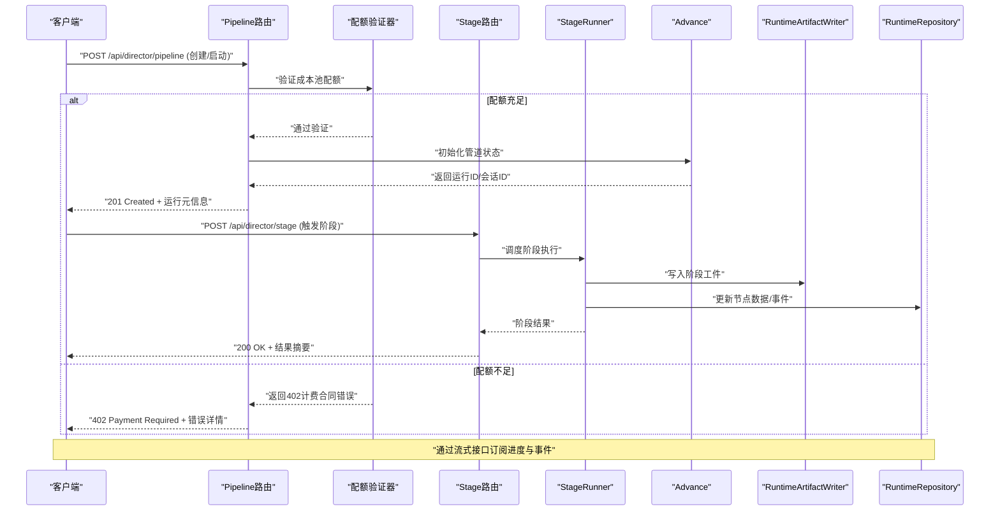

**图表来源**
- [src/app/api/director/pipeline/route.ts](file://src/app/api/director/pipeline/route.ts)
- [src/app/api/director/stage/route.ts](file://src/app/api/director/stage/route.ts)
- [src/features/director/stage-runner.ts](file://src/features/director/stage-runner.ts)
- [src/features/director/advance.ts](file://src/features/director/advance.ts)
- [src/features/director/runtime-artifact-writer.ts](file://src/features/director/runtime-artifact-writer.ts)
- [src/features/director/runtime-repository.ts](file://src/features/director/runtime-repository.ts)
- [src/features/director/queue-handler.ts](file://src/features/director/queue-handler.ts)

## 详细组件分析

### 管道创建与执行接口（/api/director/pipeline）
- 功能要点
  - 创建管道实例，绑定项目、节点定义与依赖关系
  - **新增：执行前配额预验证，检查成本池余额**
  - 设置执行参数（并发度、超时、重试策略、环境变量等）
  - 立即启动或延迟启动（入队）
  - 返回运行标识与会话信息，便于后续查询与流式订阅
- 典型流程
  - 校验输入结构（节点列表、依赖边、初始输入）
  - **新增：验证当前成本池配额和计费合同**
  - 初始化会话与运行时仓库
  - 构建依赖图并计算可执行阶段集合
  - 推进至"运行中"状态，必要时入队异步执行
- 错误处理
  - 输入校验失败返回422
  - **新增：配额不足返回402计费合同错误**
  - 资源不足或队列满返回429/503
  - 启动失败回滚状态并记录原因

**更新** 新增了配额预验证机制，在管道启动前检查成本池余额，确保有足够的配额执行管道任务。

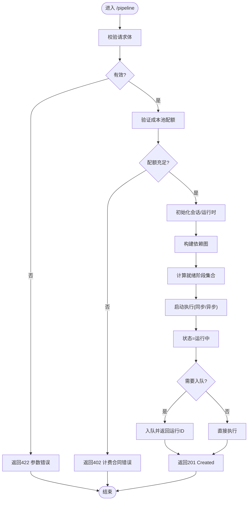

**图表来源**
- [src/app/api/director/pipeline/route.ts](file://src/app/api/director/pipeline/route.ts)
- [src/features/director/pipeline.ts](file://src/features/director/pipeline.ts)
- [src/features/director/advance.ts](file://src/features/director/advance.ts)
- [src/features/director/queue-handler.ts](file://src/features/director/queue-handler.ts)

**章节来源**
- [src/app/api/director/pipeline/route.ts](file://src/app/api/director/pipeline/route.ts)
- [src/features/director/pipeline.ts](file://src/features/director/pipeline.ts)
- [src/features/director/advance.ts](file://src/features/director/advance.ts)
- [src/features/director/queue-handler.ts](file://src/features/director/queue-handler.ts)

### 阶段控制接口（/api/director/stage）
- 功能要点
  - 手动触发指定阶段（跳过自动调度）
  - 暂停/恢复/终止阶段执行
  - 查看阶段状态与日志
- 典型流程
  - 解析阶段ID与操作类型
  - 校验当前管道状态是否允许该操作
  - 调用阶段执行器执行或变更状态
  - 返回阶段结果或状态变更确认

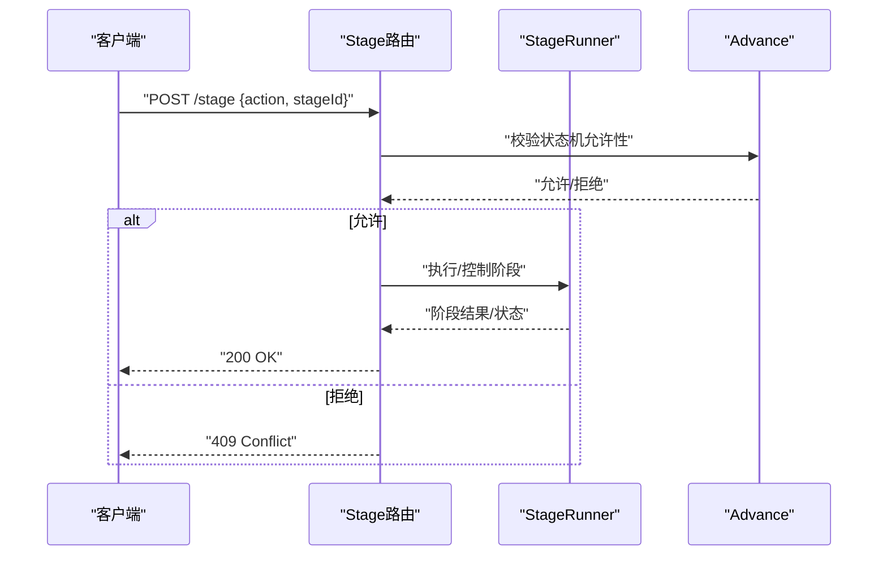

**图表来源**
- [src/app/api/director/stage/route.ts](file://src/app/api/director/stage/route.ts)
- [src/features/director/stage-runner.ts](file://src/features/director/stage-runner.ts)
- [src/features/director/advance.ts](file://src/features/director/advance.ts)

**章节来源**
- [src/app/api/director/stage/route.ts](file://src/app/api/director/stage/route.ts)
- [src/features/director/stage-runner.ts](file://src/features/director/stage-runner.ts)
- [src/features/director/advance.ts](file://src/features/director/advance.ts)

### 流式输出接口（/api/director/stream）
- 节点级流（/stream/[nodeId]）
  - 实时推送节点日志、进度、工件生成事件
  - 支持断线重连与增量拉取
- 项目级流（/stream/project/[projectId]）
  - 聚合项目内所有运行事件，便于前端统一展示
- 典型流程
  - 建立长连接（SSE/WebSocket）
  - 根据运行ID/节点ID过滤事件
  - 持续推送直至连接关闭或运行结束

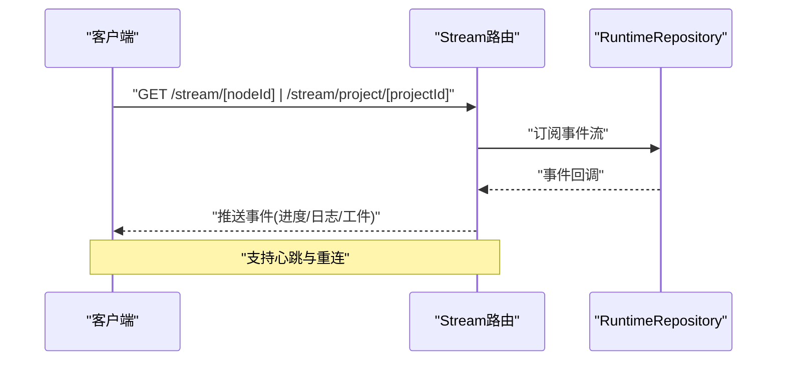

**图表来源**
- [src/app/api/director/stream/[nodeId]/route.ts](file://src/app/api/director/stream/[nodeId]/route.ts)
- [src/app/api/director/stream/project/[projectId]/route.ts](file://src/app/api/director/stream/project/[projectId]/route.ts)
- [src/features/director/runtime-repository.ts](file://src/features/director/runtime-repository.ts)

**章节来源**
- [src/app/api/director/stream/[nodeId]/route.ts](file://src/app/api/director/stream/[nodeId]/route.ts)
- [src/app/api/director/stream/project/[projectId]/route.ts](file://src/app/api/director/stream/project/[projectId]/route.ts)
- [src/features/director/runtime-repository.ts](file://src/features/director/runtime-repository.ts)

### 阶段执行器与副作用（StageRunner & StageEffects）
- 职责
  - 解析阶段输入（上游工件/节点数据）
  - 执行阶段逻辑（含AI调用、外部API、本地计算）
  - 写入阶段工件与元数据
  - 触发副作用（通知、清理、归档）
- 关键点
  - 幂等性与重试：阶段应支持幂等，结合队列进行重试
  - 资源隔离：每个阶段独立上下文，避免共享可变状态
  - 错误传播：异常需转换为标准错误结构，便于上层处理

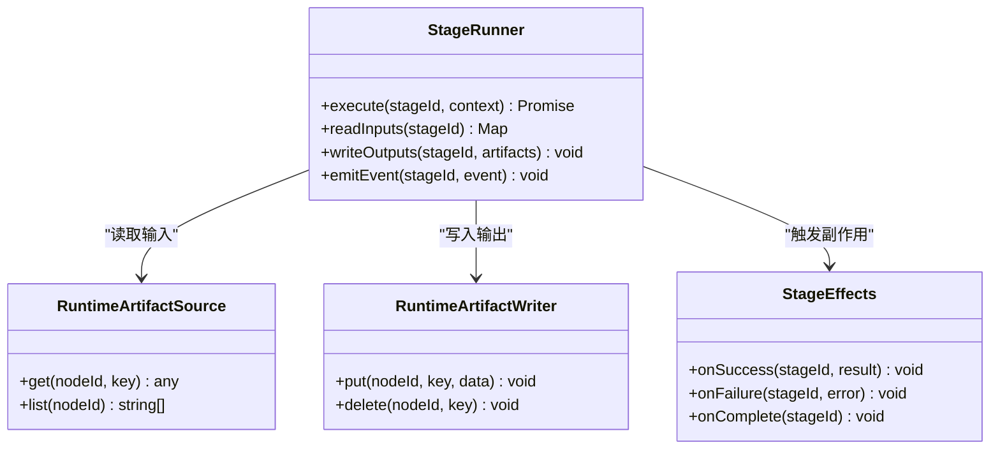

**图表来源**
- [src/features/director/stage-runner.ts](file://src/features/director/stage-runner.ts)
- [src/features/director/stage-effects.ts](file://src/features/director/stage-effects.ts)
- [src/features/director/runtime-artifact-source.ts](file://src/features/director/runtime-artifact-source.ts)
- [src/features/director/runtime-artifact-writer.ts](file://src/features/director/runtime-artifact-writer.ts)

**章节来源**
- [src/features/director/stage-runner.ts](file://src/features/director/stage-runner.ts)
- [src/features/director/stage-effects.ts](file://src/features/director/stage-effects.ts)
- [src/features/director/runtime-artifact-source.ts](file://src/features/director/runtime-artifact-source.ts)
- [src/features/director/runtime-artifact-writer.ts](file://src/features/director/runtime-artifact-writer.ts)

### 运行时数据与会话（RuntimeRepository & SessionStore）
- 运行时仓库
  - 节点数据存取（键值/结构化）
  - 事件发布/订阅
  - 工件元数据与内容访问
- 会话存储
  - 保存执行上下文、中间变量、配置快照
  - 支持序列化与跨进程共享（如持久化到数据库）

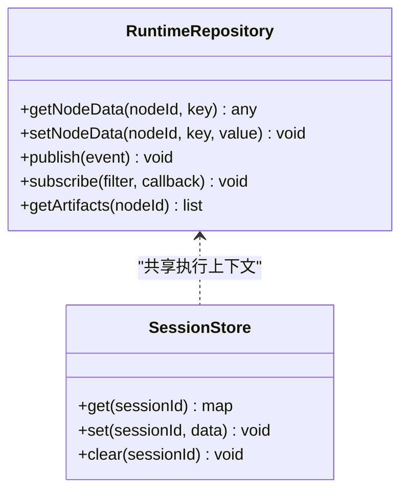

**图表来源**
- [src/features/director/runtime-repository.ts](file://src/features/director/runtime-repository.ts)
- [src/features/director/session-store.ts](file://src/features/director/session-store.ts)

**章节来源**
- [src/features/director/runtime-repository.ts](file://src/features/director/runtime-repository.ts)
- [src/features/director/session-store.ts](file://src/features/director/session-store.ts)

### 状态推进与恢复（Advance & Recovery）
- 状态推进器
  - 维护管道状态机（待运行、运行中、暂停、完成、失败）
  - 基于依赖就绪条件推进阶段
  - 支持人工干预（跳过、重试、终止）
- 恢复机制
  - 检查未完成阶段与工件一致性
  - 从最近检查点恢复执行
  - 失败后自动重试或降级策略

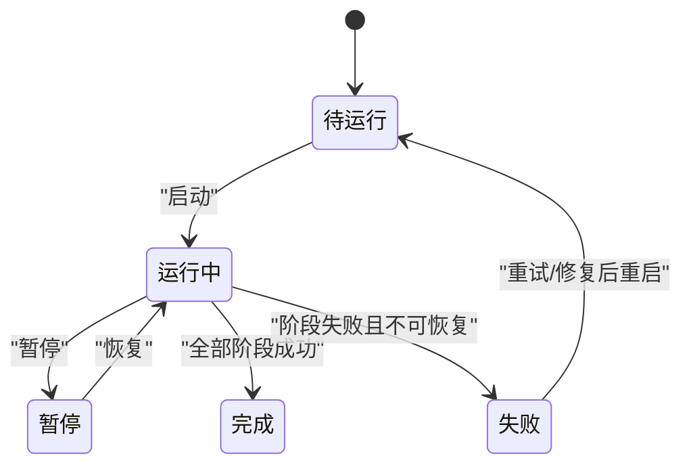

**图表来源**
- [src/features/director/advance.ts](file://src/features/director/advance.ts)
- [src/features/director/recovery.ts](file://src/features/director/recovery.ts)

**章节来源**
- [src/features/director/advance.ts](file://src/features/director/advance.ts)
- [src/features/director/recovery.ts](file://src/features/director/recovery.ts)

### AI集成（PiProvider & PiSession）
- 职责
  - 封装AI调用（提示词、模型选择、流式响应）
  - 管理会话上下文（历史消息、工具调用）
- 使用方式
  - 在阶段执行器中按需调用
  - 将AI输出作为工件写入运行时仓库

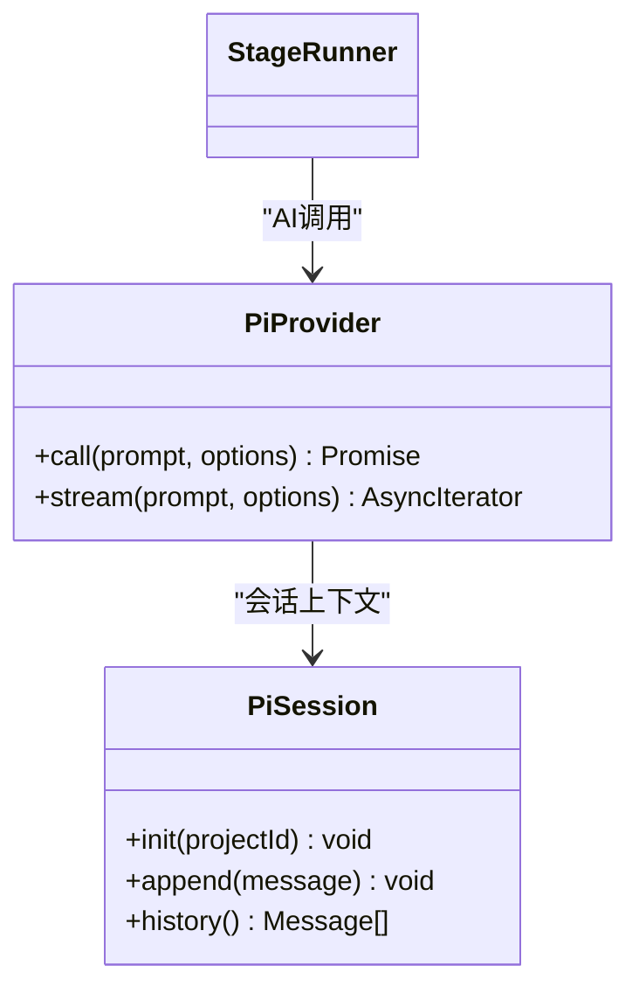

**图表来源**
- [src/features/director/pi-provider.ts](file://src/features/director/pi-provider.ts)
- [src/features/director/pi-session.ts](file://src/features/director/pi-session.ts)

**章节来源**
- [src/features/director/pi-provider.ts](file://src/features/director/pi-provider.ts)
- [src/features/director/pi-session.ts](file://src/features/director/pi-session.ts)

### 队列与并发（QueueHandler）
- 职责
  - 任务入队/出队
  - 并发限制与优先级
  - 失败重试与退避
- 适用场景
  - 长时间运行的阶段
  - 高负载下的背压保护

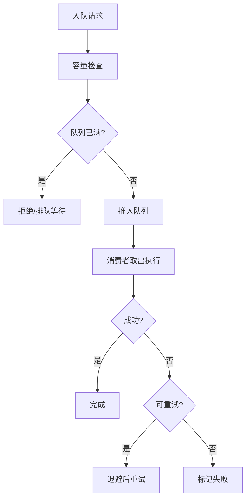

**图表来源**
- [src/features/director/queue-handler.ts](file://src/features/director/queue-handler.ts)

**章节来源**
- [src/features/director/queue-handler.ts](file://src/features/director/queue-handler.ts)

### 组合管道运行（server/compose/run-pipeline）
- 作用
  - 高层编排入口，整合管道定义、阶段执行与结果汇总
  - 提供批处理与批量导出能力
- 特点
  - 与Director模块解耦，便于复用
  - 支持多种运行模式（同步/异步、批处理）

**章节来源**
- [server/src/compose/run-pipeline.ts](file://server/src/compose/run-pipeline.ts)

## 依赖关系分析
- 组件耦合
  - API路由仅依赖编排核心与运行时仓库，保持薄控制器
  - StageRunner依赖工件读写、副作用与AI提供者，职责清晰
  - Advance与Recovery共同维护状态机，降低状态漂移风险
- 外部依赖
  - 队列处理器可能对接消息中间件
  - AI提供者对接外部模型服务
  - **新增：配额验证器依赖计费系统**
- 潜在循环依赖
  - 通过接口抽象与事件解耦避免循环引用

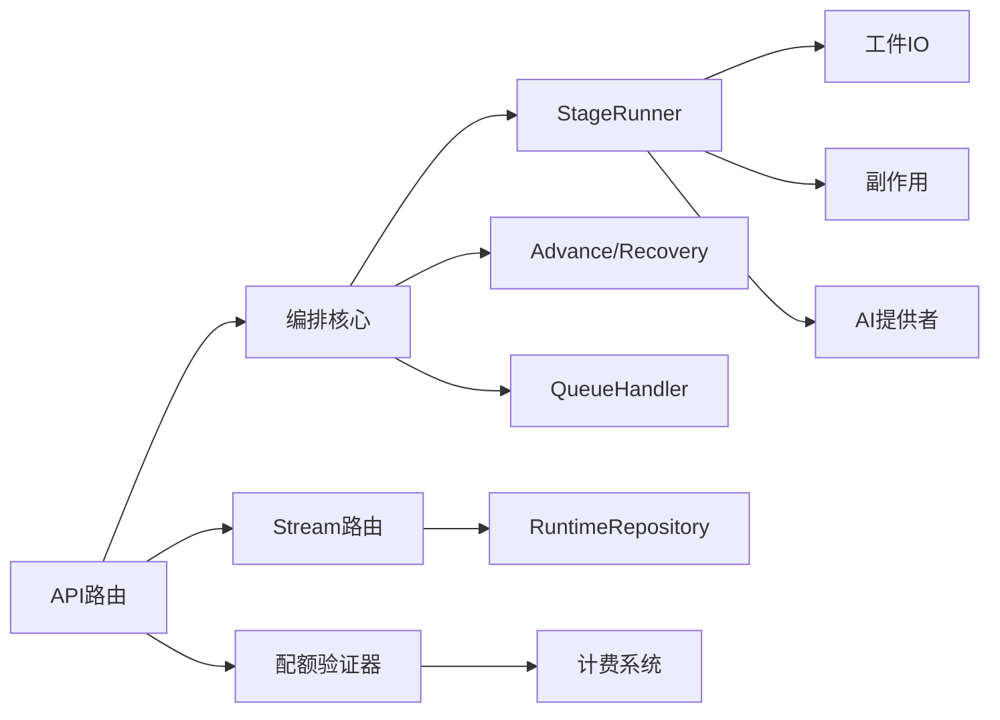

**图表来源**
- [src/app/api/director/pipeline/route.ts](file://src/app/api/director/pipeline/route.ts)
- [src/app/api/director/stage/route.ts](file://src/app/api/director/stage/route.ts)
- [src/app/api/director/stream/[nodeId]/route.ts](file://src/app/api/director/stream/[nodeId]/route.ts)
- [src/app/api/director/stream/project/[projectId]/route.ts](file://src/app/api/director/stream/project/[projectId]/route.ts)
- [src/features/director/pipeline.ts](file://src/features/director/pipeline.ts)
- [src/features/director/stage-runner.ts](file://src/features/director/stage-runner.ts)
- [src/features/director/runtime-repository.ts](file://src/features/director/runtime-repository.ts)
- [src/features/director/advance.ts](file://src/features/director/advance.ts)
- [src/features/director/recovery.ts](file://src/features/director/recovery.ts)
- [src/features/director/queue-handler.ts](file://src/features/director/queue-handler.ts)
- [src/features/director/stage-effects.ts](file://src/features/director/stage-effects.ts)
- [src/features/director/runtime-artifact-source.ts](file://src/features/director/runtime-artifact-source.ts)
- [src/features/director/runtime-artifact-writer.ts](file://src/features/director/runtime-artifact-writer.ts)
- [src/features/director/pi-provider.ts](file://src/features/director/pi-provider.ts)

**章节来源**
- [src/features/director/index.ts](file://src/features/director/index.ts)
- [src/features/director/types.ts](file://src/features/director/types.ts)

## 性能考量
- 阶段并行度：依据CPU/IO特性调整并发上限，避免资源争用
- 工件大小：大对象建议分块写入与流式传输
- 队列背压：监控队列长度与消费延迟，动态限流
- 缓存策略：对只读工件与模板进行缓存，减少重复计算
- 连接池：对外部API与数据库连接池进行合理配置
- **新增：配额验证缓存：缓存配额检查结果，减少计费系统调用频率**

[本节为通用指导，不直接分析具体文件]

## 故障排查指南
- 常见问题
  - 阶段执行超时：检查外部依赖响应时间与超时配置
  - 工件缺失：核对上游阶段输出键名与写入路径
  - 状态不一致：查看状态推进日志与检查点恢复记录
  - 队列积压：监控队列指标与消费者健康状态
  - **新增：配额不足错误：检查成本池余额和计费合同状态**
- 定位手段
  - 通过节点级流与项目级流观察实时事件
  - 检查运行时仓库中的节点数据与工件元数据
  - 查看会话存储中的上下文快照
  - 启用更详细的日志级别
  - **新增：检查配额验证日志和计费系统响应**

**章节来源**
- [src/features/director/runtime-repository.ts](file://src/features/director/runtime-repository.ts)
- [src/features/director/session-store.ts](file://src/features/director/session-store.ts)
- [src/features/director/recovery.ts](file://src/features/director/recovery.ts)
- [src/features/director/queue-handler.ts](file://src/features/director/queue-handler.ts)

## 结论
本API围绕"管道定义—阶段执行—状态推进—工件管理—事件流"形成闭环，具备可扩展、可观测与可恢复的特性。**新增的配额预验证机制**确保了计费系统的集成和资源使用的可控性。通过清晰的接口与模块化设计，用户可灵活构建从简单到复杂的编排工作流，并在生产环境中获得稳定的执行保障。

[本节为总结性内容，不直接分析具体文件]

## 附录

### 管道定义结构（概念）
- 节点集合：包含节点ID、类型、输入输出契约、执行参数
- 依赖关系：有向边表示数据或控制依赖
- 初始输入：全局变量、环境配置、项目上下文
- 执行参数：并发度、超时、重试策略、错误处理策略

[本节为概念说明，不直接分析具体文件]

### 执行参数（概念）
- 运行模式：同步/异步、批处理
- 资源限制：内存、CPU、并发度
- 重试与退避：最大重试次数、退避策略
- 错误策略：失败即停、继续执行、降级

[本节为概念说明，不直接分析具体文件]

### 管道状态与进度（概念）
- 状态：待运行、运行中、暂停、完成、失败
- 进度：阶段级进度、整体进度百分比、关键里程碑
- 结果：阶段输出摘要、工件清单、错误堆栈

[本节为概念说明，不直接分析具体文件]

### 完整示例（概念）
- 基础管道：线性阶段链，依次处理输入并产出最终工件
- 复杂工作流：分支与汇聚、条件执行、并行阶段
- 错误处理：捕获异常、重试、回滚与补偿
- **新增：配额不足处理：当成本池余额不足时返回402错误并提供充值指引**

[本节为概念说明，不直接分析具体文件]