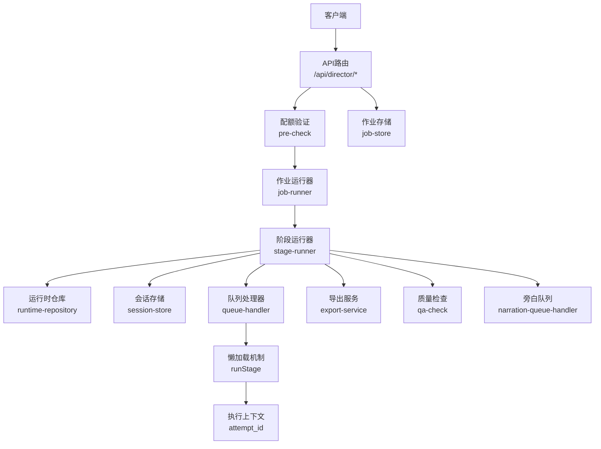
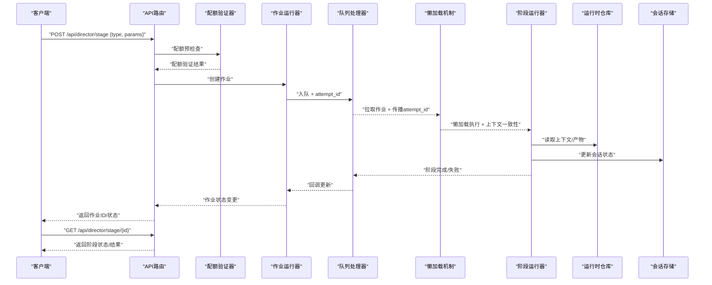
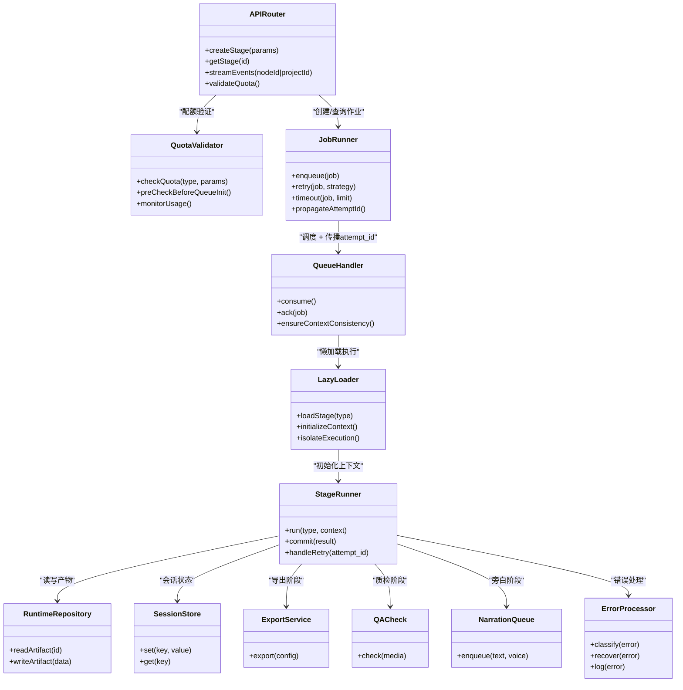

# 阶段执行API

<cite>
**本文引用的文件**   
- [server/src/server/api.ts](file://server/src/server/api.ts)
- [server/src/server/job-runner.ts](file://server/src/server/job-runner.ts)
- [server/src/server/job-store.ts](file://server/src/server/job-store.ts)
- [src/app/api/director/pipeline/route.ts](file://src/app/api/director/pipeline/route.ts)
- [src/app/api/director/stage/route.ts](file://src/app/api/director/stage/route.ts)
- [src/app/api/director/stream/[nodeId]/route.ts](file://src/app/api/director/stream/[nodeId]/route.ts)
- [src/app/api/director/stream/project/[projectId]/route.ts](file://src/app/api/director/stream/project/[projectId]/route.ts)
- [src/features/director/advance.ts](file://src/features/director/advance.ts)
- [src/features/director/stage-runner.ts](file://src/features/director/stage-runner.ts)
- [src/features/director/stage-result.ts](file://src/features/director/stage-result.ts)
- [src/features/director/runtime-repository.ts](file://src/features/director/runtime-repository.ts)
- [src/features/director/session-store.ts](file://src/features/director/session-store.ts)
- [src/features/director/queue-handler.ts](file://src/features/director/queue-handler.ts)
- [src/features/render/export-service.ts](file://src/features/render/export-service.ts)
- [src/features/render/qa-check.ts](file://src/features/render/qa-check.ts)
- [src/features/audio/narration-queue-handler.ts](file://src/features/audio/narration-queue-handler.ts)
- [tests/job-phase-contract.test.ts](file://tests/job-phase-contract.test.ts)
</cite>

## 更新摘要
**变更内容**   
- 增强阶段级配额验证，在队列初始化前进行预检查
- 阶段API在所有入口点实现一致的配额检查行为
- 优化资源管理和限流机制
- 提升系统稳定性和可预测性

## 目录
1. [简介](#简介)
2. [项目结构](#项目结构)
3. [核心组件](#核心组件)
4. [架构总览](#架构总览)
5. [详细组件分析](#详细组件分析)
6. [依赖关系分析](#依赖关系分析)
7. [性能考量](#性能考量)
8. [故障排查指南](#故障排查指南)
9. [结论](#结论)
10. [附录](#附录)

## 简介
本文件面向"阶段执行API"的使用与集成，聚焦于导演（Director）管线中的阶段（Stage）创建、执行、状态同步与结果回写。文档涵盖：
- 各处理阶段的调用接口、参数配置与返回值格式
- 阶段类型、输入输出规范、错误码定义
- 常见场景调用示例（AI生成、媒体处理、质量检查等）
- 阶段状态同步、重试机制与超时处理策略
- **新增**：增强的阶段级配额验证和队列初始化预检查

该API服务于前后端协作的异步任务编排，典型流程包括：提交阶段任务、轮询或流式获取进度、最终获取结果或错误信息。

## 项目结构
与阶段执行相关的代码主要分布在以下位置：
- API路由层：Next.js App Router下的 /api/director/* 路由
- 服务端作业调度：server/src/server 下的 job-runner、job-store、api
- 业务逻辑层：src/features/director 下的 stage-runner、advance、runtime-repository、session-store、queue-handler
- 相关能力扩展：渲染导出、音频旁白队列、QA检查等

**图表来源**
- [src/app/api/director/pipeline/route.ts](file://src/app/api/director/pipeline/route.ts)
- [src/app/api/director/stage/route.ts](file://src/app/api/director/stage/route.ts)
- [server/src/server/job-runner.ts](file://server/src/server/job-runner.ts)
- [server/src/server/job-store.ts](file://server/src/server/job-store.ts)
- [src/features/director/stage-runner.ts](file://src/features/director/stage-runner.ts)
- [src/features/director/runtime-repository.ts](file://src/features/director/runtime-repository.ts)
- [src/features/director/session-store.ts](file://src/features/director/session-store.ts)
- [src/features/director/queue-handler.ts](file://src/features/director/queue-handler.ts)
- [src/features/render/export-service.ts](file://src/features/render/export-service.ts)
- [src/features/render/qa-check.ts](file://src/features/render/qa-check.ts)
- [src/features/audio/narration-queue-handler.ts](file://src/features/audio/narration-queue-handler.ts)

## 核心组件
- API路由层
  - 负责接收HTTP请求，校验参数，转发到作业运行器或查询作业状态
  - 提供阶段创建、查询、取消、流式事件订阅等接口
  - **新增**：统一的配额验证机制
- 作业运行器（Job Runner）
  - 管理作业的入队、调度、重试、超时控制
  - 与持久化存储交互，保证幂等与可恢复性
  - **新增**：尝试标识符传播机制
- 阶段运行器（Stage Runner）
  - 解析阶段类型，加载上下文，执行业务逻辑（AI生成、媒体处理、QA检查等）
  - 将中间结果写入运行时仓库与会话存储
  - **新增**：支持懒加载机制和上下文一致性
- 运行时仓库（Runtime Repository）
  - 提供阶段间数据共享、产物落盘、元数据读写
- 会话存储（Session Store）
  - 维护阶段执行的会话上下文、临时状态
- 队列处理器（Queue Handler）
  - 消费作业队列，支持并发、限流、重试退避
  - **新增**：尝试标识符的正确传播
- 能力扩展
  - 导出服务：视频/图片导出、缩略图生成
  - 质量检查：视觉/音频指标检测
  - 旁白队列：TTS生成与合成
- **新增**：懒加载机制（Lazy Loader）
  - 延迟加载阶段执行逻辑
  - 确保执行上下文的完整性和一致性
  - 支持尝试级别的上下文隔离
- **新增**：配额验证器（Quota Validator）
  - 在队列初始化前进行资源预检查
  - 防止资源耗尽和系统过载
  - 提供细粒度的配额控制

**章节来源**
- [src/app/api/director/pipeline/route.ts](file://src/app/api/director/pipeline/route.ts)
- [src/app/api/director/stage/route.ts](file://src/app/api/director/stage/route.ts)
- [server/src/server/job-runner.ts](file://server/src/server/job-runner.ts)
- [server/src/server/job-store.ts](file://server/src/server/job-store.ts)
- [src/features/director/stage-runner.ts](file://src/features/director/stage-runner.ts)
- [src/features/director/runtime-repository.ts](file://src/features/director/runtime-repository.ts)
- [src/features/director/session-store.ts](file://src/features/director/session-store.ts)
- [src/features/director/queue-handler.ts](file://src/features/director/queue-handler.ts)
- [src/features/render/export-service.ts](file://src/features/render/export-service.ts)
- [src/features/render/qa-check.ts](file://src/features/render/qa-check.ts)
- [src/features/audio/narration-queue-handler.ts](file://src/features/audio/narration-queue-handler.ts)

## 架构总览
阶段执行的整体时序如下：
- 客户端通过 /api/director/stage 提交阶段任务
- **新增**：配额验证器在队列初始化前进行预检查
- 作业运行器分配ID并写入作业存储
- 队列处理器拉取作业并创建尝试标识符
- 阶段运行器通过懒加载机制加载执行逻辑
- **新增**：确保尝试标识符在队列操作和执行上下文间的一致性
- 执行过程中通过运行时仓库与会话存储读写状态
- 完成后返回结果；失败时按策略重试或上报错误
- 客户端可通过流式接口实时获取进度

**图表来源**
- [src/app/api/director/stage/route.ts](file://src/app/api/director/stage/route.ts)
- [server/src/server/job-runner.ts](file://server/src/server/job-runner.ts)
- [server/src/server/job-store.ts](file://server/src/server/job-store.ts)
- [src/features/director/stage-runner.ts](file://src/features/director/stage-runner.ts)
- [src/features/director/runtime-repository.ts](file://src/features/director/runtime-repository.ts)
- [src/features/director/session-store.ts](file://src/features/director/session-store.ts)
- [src/features/director/queue-handler.ts](file://src/features/director/queue-handler.ts)

## 详细组件分析

### 阶段创建与执行接口
- 接口路径
  - POST /api/director/stage：创建阶段任务
  - GET /api/director/stage/:id：查询阶段状态与结果
  - POST /api/director/pipeline：批量提交阶段（可选）
  - GET /api/director/stream/[nodeId]：节点级流式事件
  - GET /api/director/stream/project/[projectId]：项目级流式事件
- 请求体字段（阶段创建）
  - type：阶段类型（如 ai_generate、media_process、qa_check、export、narration）
  - params：阶段参数（随类型变化）
  - options：执行选项（超时、重试次数、优先级等）
- 响应体
  - id：作业ID
  - status：PENDING/RUNNING/SUCCEEDED/FAILED/CANCELLED
  - result：成功时的阶段结果（随类型变化）
  - error：失败时的错误对象（code、message、details）
  - **新增**：attempt_id：尝试标识符，用于追踪重试和上下文
- 错误码
  - 400：参数校验失败
  - 404：作业不存在
  - 409：重复提交（幂等键冲突）
  - 429：限流
  - 500：内部错误
  - 503：服务不可用（队列满/下游不可用）
  - **新增**：429：配额不足（资源限制）

**章节来源**
- [src/app/api/director/stage/route.ts](file://src/app/api/director/stage/route.ts)
- [src/app/api/director/pipeline/route.ts](file://src/app/api/director/pipeline/route.ts)
- [src/app/api/director/stream/[nodeId]/route.ts](file://src/app/api/director/stream/[nodeId]/route.ts)
- [src/app/api/director/stream/project/[projectId]/route.ts](file://src/app/api/director/stream/project/[projectId]/route.ts)
- [tests/job-phase-contract.test.ts](file://tests/job-phase-contract.test.ts)

### 阶段类型与输入输出规范
- AI生成（ai_generate）
  - 输入：prompt、模型配置、采样参数
  - 输出：文本/图像/音频产物URL或二进制引用
- 媒体处理（media_process）
  - 输入：源媒体URL、转码参数、滤镜/裁剪规则
  - 输出：处理后媒体URL、元数据（时长、分辨率、编码）
- 质量检查（qa_check）
  - 输入：待检制品URL、检查项（清晰度、音量、字幕对齐等）
  - 输出：检查结果（pass/fail）、指标详情、修复建议
- 导出（export）
  - 输入：画布/时间线配置、导出格式、分辨率
  - 输出：导出文件URL、大小、哈希
- 旁白（narration）
  - 输入：文本、语音风格、语速、语言
  - 输出：音频URL、时长、音素标注（可选）

**章节来源**
- [src/features/director/stage-runner.ts](file://src/features/director/stage-runner.ts)
- [src/features/render/export-service.ts](file://src/features/render/export-service.ts)
- [src/features/render/qa-check.ts](file://src/features/render/qa-check.ts)
- [src/features/audio/narration-queue-handler.ts](file://src/features/audio/narration-queue-handler.ts)

### 阶段状态同步与流式事件
- 状态同步
  - 轮询：GET /api/director/stage/:id
  - 事件流：SSE/WebSocket（/api/director/stream/*）
- 事件类型
  - stage.started：阶段开始
  - stage.progress：进度（百分比、当前步骤）
  - stage.artifact：中间产物上传完成
  - stage.completed：阶段完成
  - stage.failed：阶段失败（含错误码与消息）
  - **新增**：stage.attempt_updated：尝试标识符更新
  - **新增**：stage.quota_warning：配额警告
- 客户端建议
  - 指数退避重试连接
  - 去抖合并进度事件
  - 断线重连与状态回滚
  - **新增**：监听尝试标识符变化以支持重试跟踪
  - **新增**：处理配额警告事件

**章节来源**
- [src/app/api/director/stream/[nodeId]/route.ts](file://src/app/api/director/stream/[nodeId]/route.ts)
- [src/app/api/director/stream/project/[projectId]/route.ts](file://src/app/api/director/stream/project/[projectId]/route.ts)
- [src/features/director/queue-handler.ts](file://src/features/director/queue-handler.ts)

### 重试机制与超时处理
- 重试策略
  - 可配置最大重试次数与退避间隔
  - 区分可重试错误（网络抖动、下游限流）与不可重试错误（参数错误）
  - **新增**：尝试标识符在重试过程中的正确传播
- 超时控制
  - 阶段级超时：防止长时间占用资源
  - 作业级超时：整体生命周期上限
- 幂等性
  - 幂等键避免重复执行
  - 失败后恢复从最近检查点继续
  - **新增**：尝试级别的上下文隔离和一致性保证

**章节来源**
- [server/src/server/job-runner.ts](file://server/src/server/job-runner.ts)
- [server/src/server/job-store.ts](file://server/src/server/job-store.ts)
- [src/features/director/queue-handler.ts](file://src/features/director/queue-handler.ts)

### 阶段结果提交与验证
- 结果提交
  - 阶段运行器在完成后提交结果至运行时仓库
  - 结果包含产物引用、元数据、校验摘要
- 结果验证
  - 可选的二次校验（哈希、尺寸、时长）
  - 不通过则标记失败并进入重试或人工审核

**章节来源**
- [src/features/director/stage-result.ts](file://src/features/director/stage-result.ts)
- [src/features/director/runtime-repository.ts](file://src/features/director/runtime-repository.ts)

### 增强的队列处理机制
- **新增功能**：尝试标识符传播
  - 为每个作业分配唯一的尝试标识符（attempt_id）
  - 在队列操作和执行上下文间保持一致性
  - 支持重试场景下的上下文追踪
- 懒加载机制
  - 延迟加载阶段执行逻辑以减少内存占用
  - 确保执行环境的完整性和隔离性
  - 支持动态加载不同的阶段实现
- 上下文一致性
  - 确保所有重试尝试都使用正确的上下文
  - 避免跨尝试的数据污染
  - 支持并行执行时的上下文隔离

**章节来源**
- [src/features/director/queue-handler.ts](file://src/features/director/queue-handler.ts)
- [src/features/director/stage-runner.ts](file://src/features/director/stage-runner.ts)
- [server/src/server/job-runner.ts](file://server/src/server/job-runner.ts)

### 增强的错误处理和流式日志记录
- **新增功能**：结构化错误处理
  - 统一的错误分类和编码体系
  - 详细的错误上下文信息
  - 自动错误恢复策略
- 错误类型分类
  - 可恢复错误：网络问题、临时资源不足
  - 不可恢复错误：参数错误、权限不足
  - 上下文错误：尝试标识符不一致等
  - **新增**：配额错误：资源限制、配额不足
- 流式日志记录增强
  - 实时进度推送
  - 结构化日志事件
  - 错误详情流式传输
  - 性能指标实时监控
  - **新增**：尝试级别的生命周期追踪
  - **新增**：配额使用监控

**章节来源**
- [src/features/director/stage-runner.ts](file://src/features/director/stage-runner.ts)
- [src/app/api/director/stream/[nodeId]/route.ts](file://src/app/api/director/stream/[nodeId]/route.ts)

### 增强的配额验证机制
- **新增功能**：阶段级配额预检查
  - 在队列初始化前进行资源可用性验证
  - 防止因资源不足导致的队列阻塞
  - 提供细粒度的配额控制和限制
- 配额检查点
  - API入口点统一配额验证
  - 队列初始化前资源预检查
  - 执行前最终配额确认
- 配额管理策略
  - 基于阶段类型的差异化配额
  - 动态配额调整机制
  - 配额使用监控和告警
- 错误处理
  - 明确的配额不足错误码
  - 友好的错误提示信息
  - 自动降级和重试策略

**章节来源**
- [src/app/api/director/stage/route.ts](file://src/app/api/director/stage/route.ts)
- [src/app/api/director/pipeline/route.ts](file://src/app/api/director/pipeline/route.ts)
- [server/src/server/job-runner.ts](file://server/src/server/job-runner.ts)

## 依赖关系分析
- API路由依赖作业运行器与作业存储
- 阶段运行器依赖运行时仓库、会话存储、队列处理器
- 能力扩展模块（导出、QA、旁白）作为阶段实现被阶段运行器调用
- **新增**：懒加载机制与队列处理器的深度集成
- **新增**：配额验证器与所有API入口点的集成

**图表来源**
- [src/app/api/director/stage/route.ts](file://src/app/api/director/stage/route.ts)
- [server/src/server/job-runner.ts](file://server/src/server/job-runner.ts)
- [server/src/server/job-store.ts](file://server/src/server/job-store.ts)
- [src/features/director/stage-runner.ts](file://src/features/director/stage-runner.ts)
- [src/features/director/runtime-repository.ts](file://src/features/director/runtime-repository.ts)
- [src/features/director/session-store.ts](file://src/features/director/session-store.ts)
- [src/features/director/queue-handler.ts](file://src/features/director/queue-handler.ts)
- [src/features/render/export-service.ts](file://src/features/render/export-service.ts)
- [src/features/render/qa-check.ts](file://src/features/render/qa-check.ts)
- [src/features/audio/narration-queue-handler.ts](file://src/features/audio/narration-queue-handler.ts)

## 性能考量
- 队列并发与限流
  - 合理设置消费者数量与速率限制，避免下游过载
- 批处理与合并
  - 对短小任务进行批处理，减少IO与网络开销
- 缓存与复用
  - 中间产物缓存、模型权重缓存、转码缓存
- 流式传输
  - 大文件使用分块上传/下载，降低内存峰值
- 监控与告警
  - 关键指标：队列长度、平均耗时、失败率、超时率
- **新增**：懒加载优化
  - 延迟加载减少初始内存占用
  - 按需加载阶段实现提高启动速度
  - 上下文隔离避免不必要的状态复制
- **新增**：尝试标识符优化
  - 轻量级的标识符生成和管理
  - 高效的上下文查找和验证
  - 最小化的序列化开销
- **新增**：配额验证优化
  - 快速配额检查算法
  - 缓存配额状态减少数据库查询
  - 异步配额更新避免阻塞

## 故障排查指南
- 常见问题
  - 阶段卡住：检查队列是否堆积、下游服务健康、超时配置
  - 结果不一致：确认幂等键、检查产物校验、查看中间日志
  - 流式中断：检查网络稳定性、客户端重连策略
  - **新增**：尝试标识符不一致：检查队列传播机制、上下文初始化
  - **新增**：配额不足：检查配额配置、资源使用情况、系统负载
- 定位手段
  - 通过作业ID查询状态与错误信息
  - 查看运行时仓库产物是否存在且完整
  - 检查会话存储中是否有异常状态
  - **新增**：查看尝试标识符的传播日志
  - **新增**：检查懒加载的执行上下文
  - **新增**：监控配额使用情况和限制阈值
- 恢复策略
  - 自动重试（可配置）
  - 人工介入（失败任务列表、重新提交）
  - **新增**：重置尝试标识符、重新初始化执行上下文
  - **新增**：调整配额限制、清理资源、扩容系统

**章节来源**
- [server/src/server/job-runner.ts](file://server/src/server/job-runner.ts)
- [server/src/server/job-store.ts](file://server/src/server/job-store.ts)
- [src/features/director/runtime-repository.ts](file://src/features/director/runtime-repository.ts)
- [src/features/director/session-store.ts](file://src/features/director/session-store.ts)
- [src/features/director/queue-handler.ts](file://src/features/director/queue-handler.ts)

## 结论
阶段执行API以清晰的接口与可扩展的阶段类型为支撑，结合作业调度、状态同步与重试机制，提供了稳定可靠的异步处理能力。**新增的增强队列处理机制、尝试标识符传播功能和配额验证机制**进一步提升了系统的可追踪性、健壮性和资源管理能力。通过懒加载机制、上下文一致性保证和配额预检查，系统在处理复杂的工作流时能够保持更高的性能和可靠性，同时提供更好的用户体验和系统稳定性。

## 附录
- 调用示例（概念性）
  - AI生成：提交 prompt 与模型参数，等待阶段完成并获取文本/图像/音频产物
  - 媒体处理：提交源媒体与转码参数，获取处理后媒体与元数据
  - 质量检查：提交制品URL与检查项，获取通过/失败及指标详情
  - 导出：提交画布配置与导出格式，获取导出文件URL
  - 旁白：提交文本与语音配置，获取音频URL与时长
- 最佳实践
  - 使用幂等键避免重复提交
  - 合理设置超时与重试策略
  - 利用流式接口提升用户体验
  - 对关键阶段增加校验与回滚
  - **新增**：合理使用尝试标识符进行调试和追踪
  - **新增**：配置适当的错误处理策略
  - **新增**：监控配额使用情况，设置合理的限制阈值
- **新增**：尝试标识符使用示例
  - 重试追踪：`{attempt_id: "trace_123", retry_count: 2}`
  - 上下文隔离：`{context_isolation: true, scope: "execution_attempt"}`
  - 懒加载配置：`{lazy_load: true, preload_dependencies: false}`
- **新增**：配额配置示例
  - 基础配额：`{quota_limit: 100, quota_window: "hourly"}`
  - 阶段特定配额：`{ai_generate: 50, media_process: 30}`
  - 动态调整：`{auto_scale: true, max_concurrent: 10}`