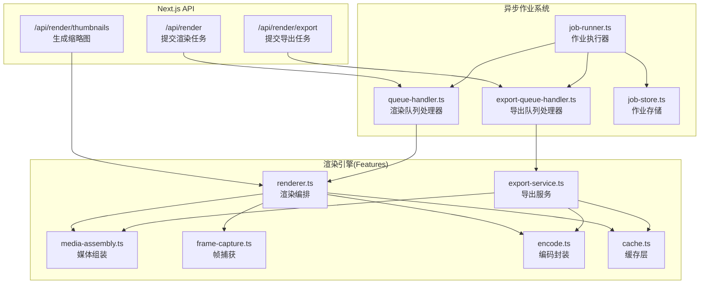
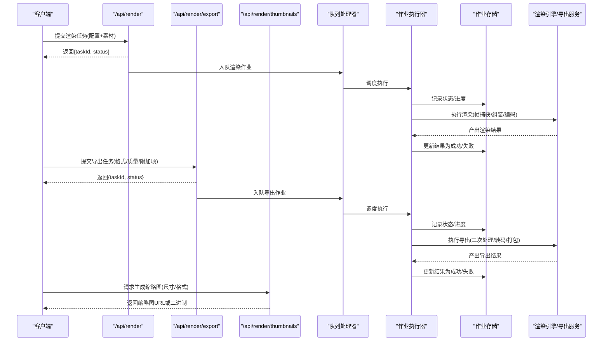
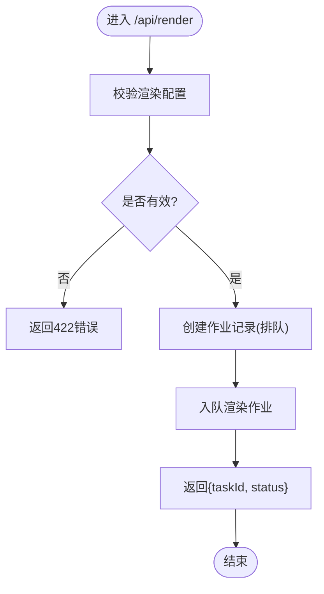
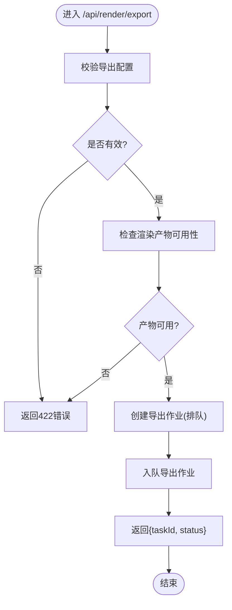
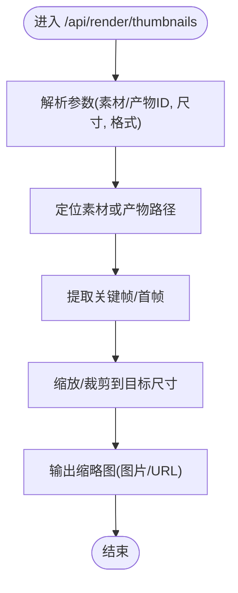
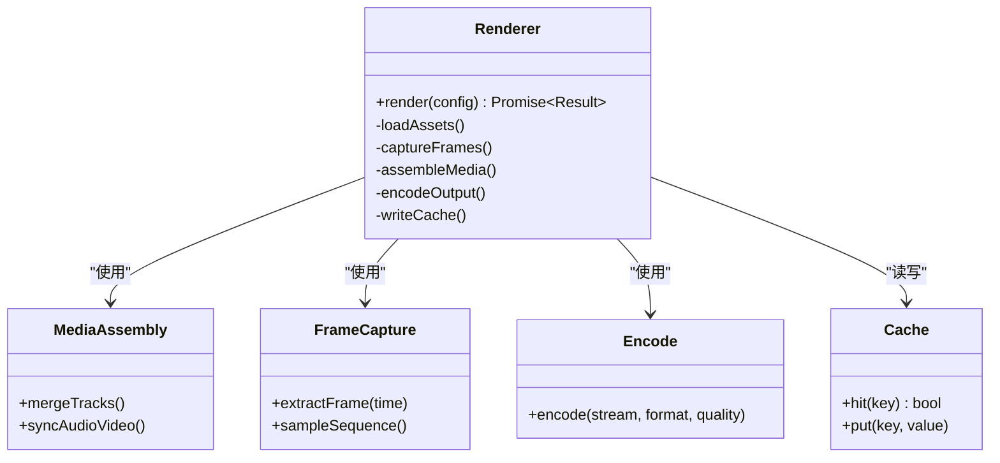
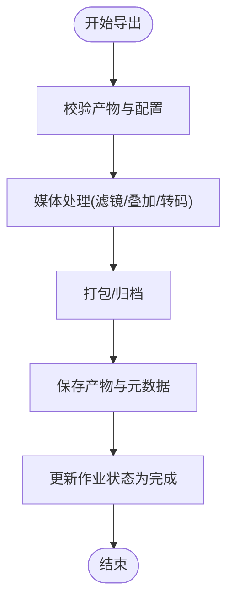
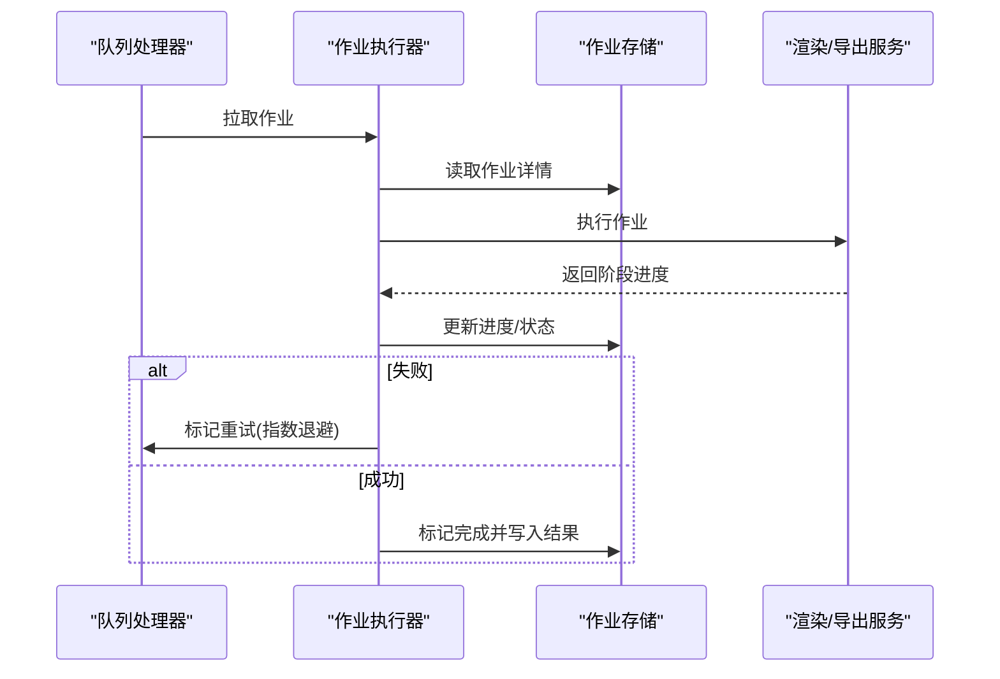
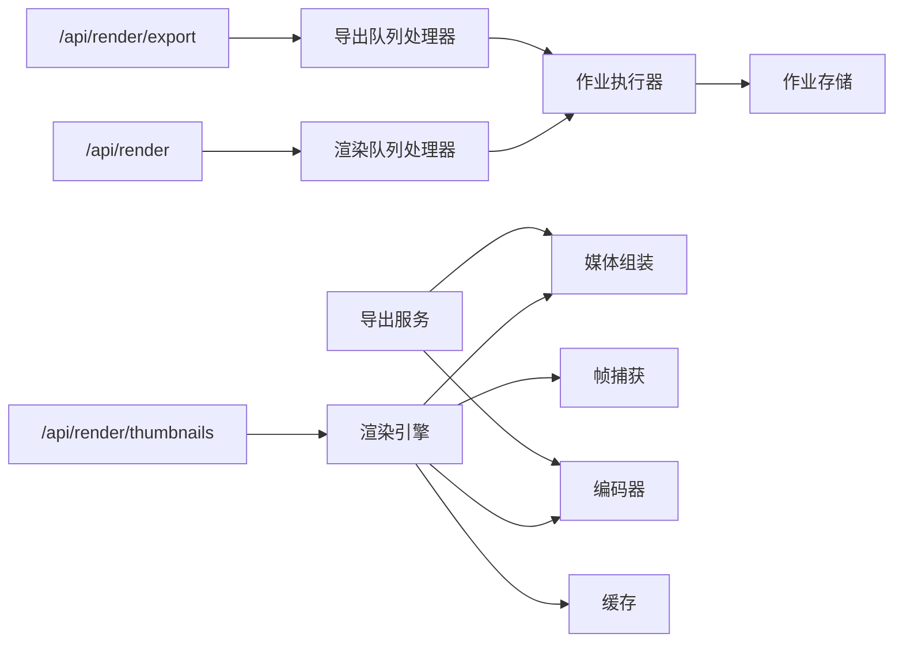

# 渲染API

<cite>
**本文引用的文件**   
- [src/app/api/render/route.ts](file://src/app/api/render/route.ts)
- [src/app/api/render/export/route.ts](file://src/app/api/render/export/route.ts)
- [src/app/api/render/thumbnails/route.ts](file://src/app/api/render/thumbnails/route.ts)
- [src/features/render/renderer.ts](file://src/features/render/renderer.ts)
- [src/features/render/export-service.ts](file://src/features/render/export-service.ts)
- [src/features/render/export-queue-handler.ts](file://src/features/render/export-queue-handler.ts)
- [src/features/render/queue-handler.ts](file://src/features/render/queue-handler.ts)
- [src/features/render/cache.ts](file://src/features/render/cache.ts)
- [src/features/render/media-assembly.ts](file://src/features/render/media-assembly.ts)
- [src/features/render/frame-capture.ts](file://src/features/render/frame-capture.ts)
- [src/features/render/encode.ts](file://src/features/render/encode.ts)
- [src/features/render/types.ts](file://src/features/render/types.ts)
- [src/lib/queue/index.ts](file://src/lib/queue/index.ts)
- [server/src/server/job-runner.ts](file://server/src/server/job-runner.ts)
- [server/src/server/job-store.ts](file://server/src/server/job-store.ts)
</cite>

## 目录
1. [简介](#简介)
2. [项目结构](#项目结构)
3. [核心组件](#核心组件)
4. [架构总览](#架构总览)
5. [详细组件分析](#详细组件分析)
6. [依赖关系分析](#依赖关系分析)
7. [性能考虑](#性能考虑)
8. [故障排查指南](#故障排查指南)
9. [结论](#结论)
10. [附录](#附录)

## 简介
本文件面向使用“渲染与导出”能力的开发者，提供完整的API说明与实践指南。内容覆盖：
- 视频渲染、导出、缩略图生成的接口定义与调用流程
- 渲染任务提交、进度查询、结果获取的端到端流程
- 渲染配置参数、输出格式选项、质量设置等详细说明
- 异步任务处理、错误重试、性能优化等高级特性

## 项目结构
渲染与导出能力由前端Next.js API路由与后端渲染服务共同实现，采用“队列+作业”的异步模式，确保高并发下的稳定性与可观测性。

**图表来源** 
- [src/app/api/render/route.ts](file://src/app/api/render/route.ts)
- [src/app/api/render/export/route.ts](file://src/app/api/render/export/route.ts)
- [src/app/api/render/thumbnails/route.ts](file://src/app/api/render/thumbnails/route.ts)
- [src/features/render/renderer.ts](file://src/features/render/renderer.ts)
- [src/features/render/export-service.ts](file://src/features/render/export-service.ts)
- [src/features/render/media-assembly.ts](file://src/features/render/media-assembly.ts)
- [src/features/render/frame-capture.ts](file://src/features/render/frame-capture.ts)
- [src/features/render/encode.ts](file://src/features/render/encode.ts)
- [src/features/render/cache.ts](file://src/features/render/cache.ts)
- [src/features/render/queue-handler.ts](file://src/features/render/queue-handler.ts)
- [src/features/render/export-queue-handler.ts](file://src/features/render/export-queue-handler.ts)
- [server/src/server/job-runner.ts](file://server/src/server/job-runner.ts)
- [server/src/server/job-store.ts](file://server/src/server/job-store.ts)

**章节来源**
- [src/app/api/render/route.ts](file://src/app/api/render/route.ts)
- [src/app/api/render/export/route.ts](file://src/app/api/render/export/route.ts)
- [src/app/api/render/thumbnails/route.ts](file://src/app/api/render/thumbnails/route.ts)

## 核心组件
- 渲染API路由：负责接收请求、校验参数、入队渲染或导出任务，并返回任务ID以便后续查询。
- 导出API路由：专门用于批量导出（如多轨道合成、字幕叠加、转码等），支持多种输出格式与质量配置。
- 缩略图API路由：基于渲染产物或源素材快速生成预览缩略图，支持尺寸与格式选择。
- 渲染引擎：编排帧捕获、媒体组装、编码输出等步骤，支持缓存命中与增量渲染。
- 导出服务：将渲染产物按业务需求进行二次处理（如拼接、水印、封面生成）。
- 队列处理器：分别处理渲染与导出两类作业，保证并发控制与失败重试。
- 作业执行器与存储：持久化作业状态、进度与结果，供外部轮询或回调通知。

**章节来源**
- [src/features/render/renderer.ts](file://src/features/render/renderer.ts)
- [src/features/render/export-service.ts](file://src/features/render/export-service.ts)
- [src/features/render/queue-handler.ts](file://src/features/render/queue-handler.ts)
- [src/features/render/export-queue-handler.ts](file://src/features/render/export-queue-handler.ts)
- [server/src/server/job-runner.ts](file://server/src/server/job-runner.ts)
- [server/src/server/job-store.ts](file://server/src/server/job-store.ts)

## 架构总览
渲染与导出采用“API路由 + 队列 + 作业执行器”的分层架构，职责清晰、扩展性强。

**图表来源** 
- [src/app/api/render/route.ts](file://src/app/api/render/route.ts)
- [src/app/api/render/export/route.ts](file://src/app/api/render/export/route.ts)
- [src/app/api/render/thumbnails/route.ts](file://src/app/api/render/thumbnails/route.ts)
- [src/features/render/queue-handler.ts](file://src/features/render/queue-handler.ts)
- [src/features/render/export-queue-handler.ts](file://src/features/render/export-queue-handler.ts)
- [server/src/server/job-runner.ts](file://server/src/server/job-runner.ts)
- [server/src/server/job-store.ts](file://server/src/server/job-store.ts)
- [src/features/render/renderer.ts](file://src/features/render/renderer.ts)
- [src/features/render/export-service.ts](file://src/features/render/export-service.ts)

## 详细组件分析

### 渲染API（/api/render）
- 功能：提交渲染任务，包含输入素材、时间线、布局、编码参数等。
- 行为：参数校验后创建渲染作业并写入队列，立即返回任务ID与初始状态。
- 典型流程：
  - 接收请求体（渲染配置）
  - 校验必填字段与取值范围
  - 生成唯一任务ID
  - 写入作业存储（初始状态为排队）
  - 入队渲染作业处理器
  - 返回任务信息

**图表来源** 
- [src/app/api/render/route.ts](file://src/app/api/render/route.ts)
- [src/features/render/queue-handler.ts](file://src/features/render/queue-handler.ts)
- [server/src/server/job-store.ts](file://server/src/server/job-store.ts)

**章节来源**
- [src/app/api/render/route.ts](file://src/app/api/render/route.ts)
- [src/features/render/queue-handler.ts](file://src/features/render/queue-handler.ts)

### 导出API（/api/render/export）
- 功能：对已渲染产物进行二次处理（如拼接、水印、字幕、转码、打包）。
- 行为：接收导出配置（目标格式、质量、附加项），创建导出作业并返回任务ID。
- 典型流程：
  - 接收导出配置
  - 校验输入产物是否存在且可用
  - 创建导出作业（排队）
  - 入队导出作业处理器
  - 返回任务信息

**图表来源** 
- [src/app/api/render/export/route.ts](file://src/app/api/render/export/route.ts)
- [src/features/render/export-queue-handler.ts](file://src/features/render/export-queue-handler.ts)
- [server/src/server/job-store.ts](file://server/src/server/job-store.ts)

**章节来源**
- [src/app/api/render/export/route.ts](file://src/app/api/render/export/route.ts)
- [src/features/render/export-queue-handler.ts](file://src/features/render/export-queue-handler.ts)

### 缩略图API（/api/render/thumbnails）
- 功能：根据渲染产物或源素材生成缩略图，支持指定尺寸与格式。
- 行为：读取素材关键帧或中间产物，裁剪缩放后输出图片。
- 典型流程：
  - 接收缩略图请求（素材ID/渲染产物ID、尺寸、格式）
  - 定位素材或产物路径
  - 提取关键帧或首帧
  - 生成缩略图并返回URL或二进制数据

**图表来源** 
- [src/app/api/render/thumbnails/route.ts](file://src/app/api/render/thumbnails/route.ts)
- [src/features/render/frame-capture.ts](file://src/features/render/frame-capture.ts)

**章节来源**
- [src/app/api/render/thumbnails/route.ts](file://src/app/api/render/thumbnails/route.ts)
- [src/features/render/frame-capture.ts](file://src/features/render/frame-capture.ts)

### 渲染引擎（renderer.ts）
- 职责：编排渲染全流程，包括帧捕获、媒体组装、编码输出；支持缓存命中与增量渲染。
- 关键步骤：
  - 解析渲染配置（分辨率、帧率、编码参数）
  - 加载媒体资源（视频、音频、图像）
  - 捕获帧序列（按时间线采样）
  - 组装媒体流（音画同步、轨道合并）
  - 编码输出（H.264/H.265、AAC、MP4/MKV等）
  - 写入缓存与产物存储

**图表来源** 
- [src/features/render/renderer.ts](file://src/features/render/renderer.ts)
- [src/features/render/media-assembly.ts](file://src/features/render/media-assembly.ts)
- [src/features/render/frame-capture.ts](file://src/features/render/frame-capture.ts)
- [src/features/render/encode.ts](file://src/features/render/encode.ts)
- [src/features/render/cache.ts](file://src/features/render/cache.ts)

**章节来源**
- [src/features/render/renderer.ts](file://src/features/render/renderer.ts)
- [src/features/render/media-assembly.ts](file://src/features/render/media-assembly.ts)
- [src/features/render/frame-capture.ts](file://src/features/render/frame-capture.ts)
- [src/features/render/encode.ts](file://src/features/render/encode.ts)
- [src/features/render/cache.ts](file://src/features/render/cache.ts)

### 导出服务（export-service.ts）
- 职责：对渲染产物进行二次处理，如拼接、水印、字幕叠加、转码、打包。
- 关键步骤：
  - 校验输入产物与导出配置
  - 执行媒体处理（滤镜、叠加、转码）
  - 生成最终产物（文件/压缩包）
  - 更新作业状态与结果元数据

**图表来源** 
- [src/features/render/export-service.ts](file://src/features/render/export-service.ts)

**章节来源**
- [src/features/render/export-service.ts](file://src/features/render/export-service.ts)

### 队列处理器（queue-handler.ts 与 export-queue-handler.ts）
- 职责：消费队列中的渲染/导出作业，协调执行器与存储，管理重试与超时。
- 关键特性：
  - 并发控制（限制同时执行的作业数）
  - 失败重试（指数退避策略）
  - 进度上报（阶段化进度更新）
  - 超时保护（长任务自动中断）

**图表来源** 
- [src/features/render/queue-handler.ts](file://src/features/render/queue-handler.ts)
- [src/features/render/export-queue-handler.ts](file://src/features/render/export-queue-handler.ts)
- [server/src/server/job-runner.ts](file://server/src/server/job-runner.ts)
- [server/src/server/job-store.ts](file://server/src/server/job-store.ts)

**章节来源**
- [src/features/render/queue-handler.ts](file://src/features/render/queue-handler.ts)
- [src/features/render/export-queue-handler.ts](file://src/features/render/export-queue-handler.ts)
- [server/src/server/job-runner.ts](file://server/src/server/job-runner.ts)
- [server/src/server/job-store.ts](file://server/src/server/job-store.ts)

## 依赖关系分析
- API路由依赖队列处理器与作业存储，解耦了请求响应与后台处理。
- 渲染引擎依赖媒体组装、帧捕获、编码器与缓存层，形成稳定的数据处理管线。
- 导出服务依赖渲染产物与媒体处理能力，支持灵活的二次加工。
- 作业执行器统一驱动队列处理器与作业存储，保障状态一致性与可恢复性。

**图表来源** 
- [src/app/api/render/route.ts](file://src/app/api/render/route.ts)
- [src/app/api/render/export/route.ts](file://src/app/api/render/export/route.ts)
- [src/app/api/render/thumbnails/route.ts](file://src/app/api/render/thumbnails/route.ts)
- [src/features/render/queue-handler.ts](file://src/features/render/queue-handler.ts)
- [src/features/render/export-queue-handler.ts](file://src/features/render/export-queue-handler.ts)
- [server/src/server/job-runner.ts](file://server/src/server/job-runner.ts)
- [server/src/server/job-store.ts](file://server/src/server/job-store.ts)
- [src/features/render/renderer.ts](file://src/features/render/renderer.ts)
- [src/features/render/media-assembly.ts](file://src/features/render/media-assembly.ts)
- [src/features/render/frame-capture.ts](file://src/features/render/frame-capture.ts)
- [src/features/render/encode.ts](file://src/features/render/encode.ts)
- [src/features/render/cache.ts](file://src/features/render/cache.ts)
- [src/features/render/export-service.ts](file://src/features/render/export-service.ts)

**章节来源**
- [src/lib/queue/index.ts](file://src/lib/queue/index.ts)

## 性能考虑
- 缓存命中：在渲染与导出前检查缓存键，避免重复计算与编码。
- 增量渲染：仅重算变更片段，减少整体渲染时长。
- 并发控制：限制队列并发度，防止资源争用与OOM。
- 分块处理：大文件采用分块读取与写入，降低内存峰值。
- 编码优化：选择合适的编码器预设与质量参数，平衡速度与画质。
- 批处理：导出任务支持批量处理，减少I/O开销。

[本节为通用性能建议，不直接分析具体文件]

## 故障排查指南
- 常见错误：
  - 参数校验失败（422）：检查渲染/导出配置的必填字段与取值范围。
  - 产物不可用：确认渲染产物存在且路径正确。
  - 队列积压：检查作业执行器是否正常运行，必要时扩容并发。
  - 编码失败：检查编码器依赖与输入格式兼容性。
- 调试手段：
  - 查看作业存储中的状态与进度日志。
  - 启用详细日志输出，定位失败阶段。
  - 使用缩略图API验证素材可访问性。
- 恢复策略：
  - 失败作业自动重试（指数退避）。
  - 超时作业中断并回滚部分状态。
  - 支持手动触发重新执行。

**章节来源**
- [server/src/server/job-store.ts](file://server/src/server/job-store.ts)
- [server/src/server/job-runner.ts](file://server/src/server/job-runner.ts)

## 结论
本渲染与导出API通过清晰的职责划分与异步作业机制，提供了稳定、可扩展的视频处理服务能力。开发者可基于本文档快速集成渲染、导出与缩略图生成功能，并利用缓存、并发控制与重试机制优化性能与可靠性。

[本节为总结性内容，不直接分析具体文件]

## 附录
- 渲染配置参数：分辨率、帧率、编码格式、质量等级、音轨配置等。
- 输出格式选项：MP4、MKV、WebM、MOV等容器；H.264、H.265、AV1等视频编码；AAC、MP3等音频编码。
- 质量设置：码率、CRF、预设、分辨率上限、音频比特率等。
- 异步任务处理：任务ID、状态枚举（排队、执行中、完成、失败）、进度百分比、错误消息。
- 错误重试：最大重试次数、退避策略、超时阈值。
- 性能优化：缓存策略、增量渲染、并发限制、分块处理。

[本节为补充说明，不直接分析具体文件]