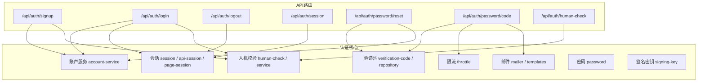
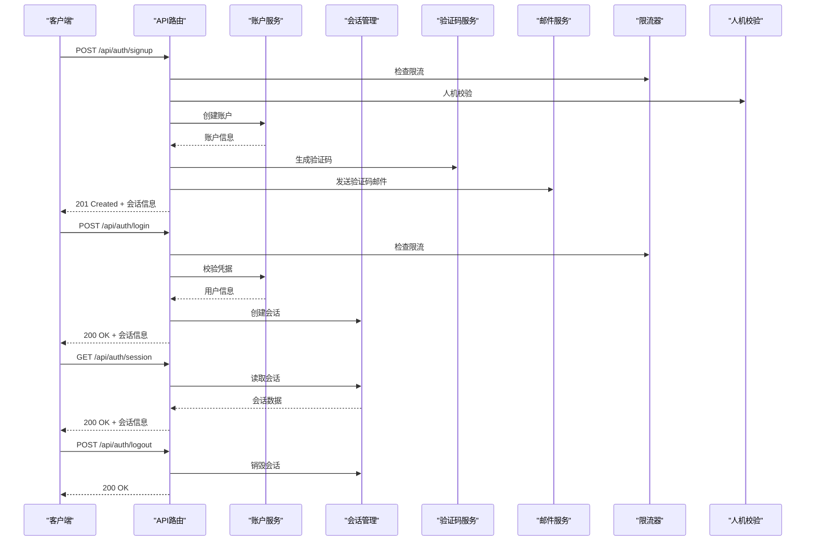
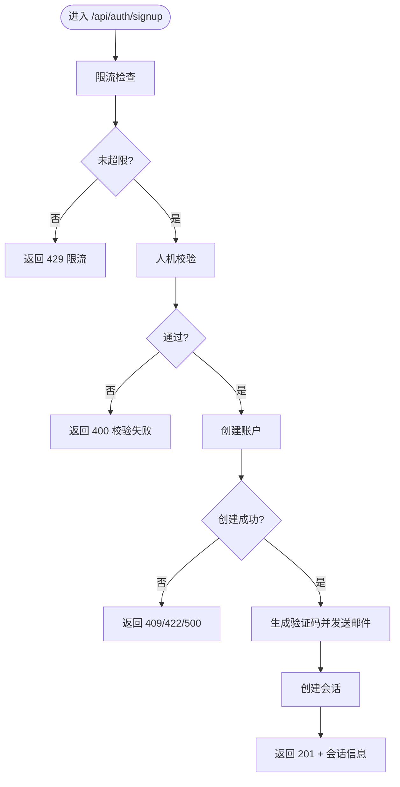
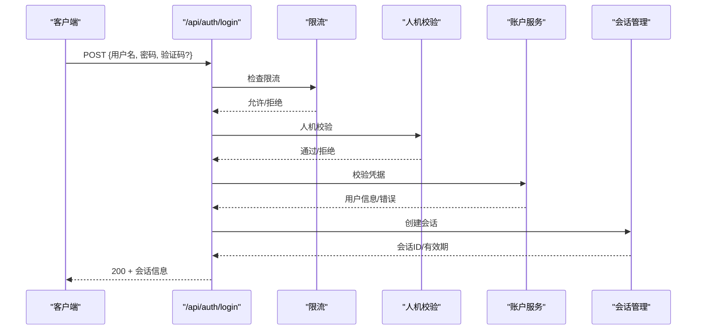
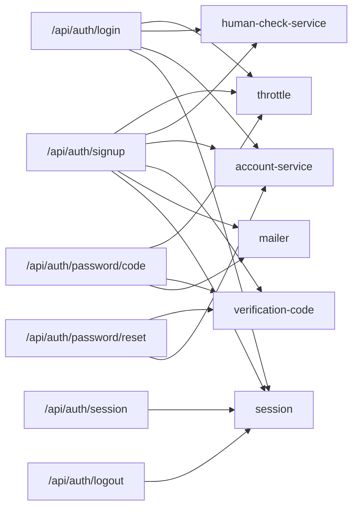

# 认证API

<cite>
**本文引用的文件**   
- [src/app/api/auth/signup/route.ts](file://src/app/api/auth/signup/route.ts)
- [src/app/api/auth/login/route.ts](file://src/app/api/auth/login/route.ts)
- [src/app/api/auth/logout/route.ts](file://src/app/api/auth/logout/route.ts)
- [src/app/api/auth/session/route.ts](file://src/app/api/auth/session/route.ts)
- [src/app/api/auth/password/reset/route.ts](file://src/app/api/auth/password/reset/route.ts)
- [src/app/api/auth/password/code/route.ts](file://src/app/api/auth/password/code/route.ts)
- [src/app/api/auth/human-check/route.ts](file://src/app/api/auth/human-check/route.ts)
- [src/features/auth/index.ts](file://src/features/auth/index.ts)
- [src/features/auth/account-service.ts](file://src/features/auth/account-service.ts)
- [src/features/auth/session.ts](file://src/features/auth/session.ts)
- [src/features/auth/api-session.ts](file://src/features/auth/api-session.ts)
- [src/features/auth/page-session.ts](file://src/features/auth/page-session.ts)
- [src/features/auth/schemas.ts](file://src/features/auth/schemas.ts)
- [src/features/auth/errors.ts](file://src/features/auth/errors.ts)
- [src/features/auth/verification-code.ts](file://src/features/auth/verification-code.ts)
- [src/features/auth/verification-repository.ts](file://src/features/auth/verification-repository.ts)
- [src/features/auth/mailer.ts](file://src/features/auth/mailer.ts)
- [src/features/auth/mail-templates.ts](file://src/features/auth/mail-templates.ts)
- [src/features/auth/throttle.ts](file://src/features/auth/throttle.ts)
- [src/features/auth/human-check.ts](file://src/features/auth/human-check.ts)
- [src/features/auth/human-check-service.ts](file://src/features/auth/human-check-service.ts)
- [src/features/auth/signing-key.ts](file://src/features/auth/signing-key.ts)
- [src/features/auth/password.ts](file://src/features/auth/password.ts)
- [src/features/auth/http.ts](file://src/features/auth/http.ts)
- [src/features/auth/next-path.ts](file://src/features/auth/next-path.ts)
</cite>

## 目录
1. [简介](#简介)
2. [项目结构](#项目结构)
3. [核心组件](#核心组件)
4. [架构总览](#架构总览)
5. [详细组件分析](#详细组件分析)
6. [依赖关系分析](#依赖关系分析)
7. [性能考虑](#性能考虑)
8. [故障排查指南](#故障排查指南)
9. [结论](#结论)
10. [附录：接口清单与示例](#附录接口清单与示例)

## 简介
本文件为 PurpleInk 项目的认证相关 API 文档，覆盖用户注册、登录、登出、会话管理、密码重置等能力。文档包含每个接口的 HTTP 方法、URL 路径、请求参数、响应格式、错误处理说明，并提供成功与常见错误的请求/响应示例。同时给出认证流程、会话机制、安全考虑与最佳实践，帮助开发者快速集成并安全使用。

## 项目结构
认证功能采用 Next.js App Router 的 API Routes 组织，业务逻辑集中在 features/auth 模块中，按职责拆分为账户服务、会话管理、验证码、邮件发送、限流、人机校验、密码工具等子模块。

图表来源 
- [src/app/api/auth/signup/route.ts](file://src/app/api/auth/signup/route.ts)
- [src/app/api/auth/login/route.ts](file://src/app/api/auth/login/route.ts)
- [src/app/api/auth/logout/route.ts](file://src/app/api/auth/logout/route.ts)
- [src/app/api/auth/session/route.ts](file://src/app/api/auth/session/route.ts)
- [src/app/api/auth/password/reset/route.ts](file://src/app/api/auth/password/reset/route.ts)
- [src/app/api/auth/password/code/route.ts](file://src/app/api/auth/password/code/route.ts)
- [src/app/api/auth/human-check/route.ts](file://src/app/api/auth/human-check/route.ts)
- [src/features/auth/account-service.ts](file://src/features/auth/account-service.ts)
- [src/features/auth/session.ts](file://src/features/auth/session.ts)
- [src/features/auth/api-session.ts](file://src/features/auth/api-session.ts)
- [src/features/auth/page-session.ts](file://src/features/auth/page-session.ts)
- [src/features/auth/verification-code.ts](file://src/features/auth/verification-code.ts)
- [src/features/auth/verification-repository.ts](file://src/features/auth/verification-repository.ts)
- [src/features/auth/mailer.ts](file://src/features/auth/mailer.ts)
- [src/features/auth/mail-templates.ts](file://src/features/auth/mail-templates.ts)
- [src/features/auth/throttle.ts](file://src/features/auth/throttle.ts)
- [src/features/auth/human-check.ts](file://src/features/auth/human-check.ts)
- [src/features/auth/human-check-service.ts](file://src/features/auth/human-check-service.ts)
- [src/features/auth/signing-key.ts](file://src/features/auth/signing-key.ts)
- [src/features/auth/password.ts](file://src/features/auth/password.ts)

章节来源
- [src/app/api/auth/signup/route.ts](file://src/app/api/auth/signup/route.ts)
- [src/app/api/auth/login/route.ts](file://src/app/api/auth/login/route.ts)
- [src/app/api/auth/logout/route.ts](file://src/app/api/auth/logout/route.ts)
- [src/app/api/auth/session/route.ts](file://src/app/api/auth/session/route.ts)
- [src/app/api/auth/password/reset/route.ts](file://src/app/api/auth/password/reset/route.ts)
- [src/app/api/auth/password/code/route.ts](file://src/app/api/auth/password/code/route.ts)
- [src/app/api/auth/human-check/route.ts](file://src/app/api/auth/human-check/route.ts)
- [src/features/auth/index.ts](file://src/features/auth/index.ts)

## 核心组件
- 账户服务：负责用户账号的创建、查询、更新与删除等核心操作。
- 会话管理：提供服务端会话的创建、读取、刷新与销毁，支持 API 与页面两种会话模式。
- 验证码：生成、存储、校验一次性验证码，支持过期与次数限制。
- 邮件：模板化邮件发送，用于验证码与密码重置通知。
- 限流：对敏感接口进行频率限制，防止滥用。
- 人机校验：通过第三方或内置策略验证请求是否来自人类。
- 密码：密码强度校验、哈希与比对工具。
- 签名密钥：用于签发与校验令牌（如会话令牌）的安全密钥管理。

章节来源
- [src/features/auth/account-service.ts](file://src/features/auth/account-service.ts)
- [src/features/auth/session.ts](file://src/features/auth/session.ts)
- [src/features/auth/api-session.ts](file://src/features/auth/api-session.ts)
- [src/features/auth/page-session.ts](file://src/features/auth/page-session.ts)
- [src/features/auth/verification-code.ts](file://src/features/auth/verification-code.ts)
- [src/features/auth/verification-repository.ts](file://src/features/auth/verification-repository.ts)
- [src/features/auth/mailer.ts](file://src/features/auth/mailer.ts)
- [src/features/auth/mail-templates.ts](file://src/features/auth/mail-templates.ts)
- [src/features/auth/throttle.ts](file://src/features/auth/throttle.ts)
- [src/features/auth/human-check.ts](file://src/features/auth/human-check.ts)
- [src/features/auth/human-check-service.ts](file://src/features/auth/human-check-service.ts)
- [src/features/auth/password.ts](file://src/features/auth/password.ts)
- [src/features/auth/signing-key.ts](file://src/features/auth/signing-key.ts)

## 架构总览
认证系统以 API Routes 为入口，调用 features/auth 中的服务层完成业务逻辑，并通过数据库、缓存、邮件服务等外部依赖实现持久化与通知。

图表来源 
- [src/app/api/auth/signup/route.ts](file://src/app/api/auth/signup/route.ts)
- [src/app/api/auth/login/route.ts](file://src/app/api/auth/login/route.ts)
- [src/app/api/auth/session/route.ts](file://src/app/api/auth/session/route.ts)
- [src/app/api/auth/logout/route.ts](file://src/app/api/auth/logout/route.ts)
- [src/features/auth/account-service.ts](file://src/features/auth/account-service.ts)
- [src/features/auth/session.ts](file://src/features/auth/session.ts)
- [src/features/auth/verification-code.ts](file://src/features/auth/verification-code.ts)
- [src/features/auth/mailer.ts](file://src/features/auth/mailer.ts)
- [src/features/auth/throttle.ts](file://src/features/auth/throttle.ts)
- [src/features/auth/human-check-service.ts](file://src/features/auth/human-check-service.ts)

## 详细组件分析

### 用户注册 /api/auth/signup
- 方法：POST
- 路径：/api/auth/signup
- 请求体字段：
  - 用户名/邮箱：必填，遵循唯一性约束
  - 密码：必填，满足强度要求
  - 验证码：可选，若开启需提交
- 响应：
  - 成功：201，返回新账户基本信息与会话信息
  - 失败：400/409/422/500，具体见错误码表
- 流程要点：
  - 限流检查
  - 人机校验
  - 账户创建与唯一性校验
  - 生成验证码并发送邮件（可选）
  - 创建会话并返回

图表来源 
- [src/app/api/auth/signup/route.ts](file://src/app/api/auth/signup/route.ts)
- [src/features/auth/throttle.ts](file://src/features/auth/throttle.ts)
- [src/features/auth/human-check-service.ts](file://src/features/auth/human-check-service.ts)
- [src/features/auth/account-service.ts](file://src/features/auth/account-service.ts)
- [src/features/auth/verification-code.ts](file://src/features/auth/verification-code.ts)
- [src/features/auth/mailer.ts](file://src/features/auth/mailer.ts)
- [src/features/auth/session.ts](file://src/features/auth/session.ts)

章节来源
- [src/app/api/auth/signup/route.ts](file://src/app/api/auth/signup/route.ts)
- [src/features/auth/schemas.ts](file://src/features/auth/schemas.ts)
- [src/features/auth/account-service.ts](file://src/features/auth/account-service.ts)
- [src/features/auth/verification-code.ts](file://src/features/auth/verification-code.ts)
- [src/features/auth/mailer.ts](file://src/features/auth/mailer.ts)
- [src/features/auth/session.ts](file://src/features/auth/session.ts)

### 用户登录 /api/auth/login
- 方法：POST
- 路径：/api/auth/login
- 请求体字段：
  - 用户名/邮箱：必填
  - 密码：必填
  - 验证码：可选，若开启需提交
- 响应：
  - 成功：200，返回会话信息
  - 失败：400/401/422/500
- 流程要点：
  - 限流检查
  - 人机校验
  - 凭据校验
  - 创建会话并返回

图表来源 
- [src/app/api/auth/login/route.ts](file://src/app/api/auth/login/route.ts)
- [src/features/auth/throttle.ts](file://src/features/auth/throttle.ts)
- [src/features/auth/human-check-service.ts](file://src/features/auth/human-check-service.ts)
- [src/features/auth/account-service.ts](file://src/features/auth/account-service.ts)
- [src/features/auth/session.ts](file://src/features/auth/session.ts)

章节来源
- [src/app/api/auth/login/route.ts](file://src/app/api/auth/login/route.ts)
- [src/features/auth/schemas.ts](file://src/features/auth/schemas.ts)
- [src/features/auth/account-service.ts](file://src/features/auth/account-service.ts)
- [src/features/auth/session.ts](file://src/features/auth/session.ts)

### 用户登出 /api/auth/logout
- 方法：POST
- 路径：/api/auth/logout
- 请求体字段：无（或携带当前会话标识）
- 响应：
  - 成功：200
  - 失败：400/500
- 流程要点：
  - 读取并验证会话
  - 销毁会话

章节来源
- [src/app/api/auth/logout/route.ts](file://src/app/api/auth/logout/route.ts)
- [src/features/auth/session.ts](file://src/features/auth/session.ts)

### 会话管理 /api/auth/session
- 方法：GET
- 路径：/api/auth/session
- 请求头：需携带会话标识（Cookie 或 Authorization）
- 响应：
  - 成功：200，返回当前会话信息
  - 失败：401/403/500
- 流程要点：
  - 解析会话标识
  - 校验有效性
  - 返回会话数据

章节来源
- [src/app/api/auth/session/route.ts](file://src/app/api/auth/session/route.ts)
- [src/features/auth/api-session.ts](file://src/features/auth/api-session.ts)
- [src/features/auth/page-session.ts](file://src/features/auth/page-session.ts)
- [src/features/auth/session.ts](file://src/features/auth/session.ts)

### 密码重置验证码 /api/auth/password/code
- 方法：POST
- 路径：/api/auth/password/code
- 请求体字段：
  - 邮箱：必填
- 响应：
  - 成功：200，提示已发送验证码
  - 失败：400/422/429/500
- 流程要点：
  - 限流检查
  - 生成验证码并存储
  - 发送邮件

章节来源
- [src/app/api/auth/password/code/route.ts](file://src/app/api/auth/password/code/route.ts)
- [src/features/auth/throttle.ts](file://src/features/auth/throttle.ts)
- [src/features/auth/verification-code.ts](file://src/features/auth/verification-code.ts)
- [src/features/auth/verification-repository.ts](file://src/features/auth/verification-repository.ts)
- [src/features/auth/mailer.ts](file://src/features/auth/mailer.ts)

### 密码重置 /api/auth/password/reset
- 方法：POST
- 路径：/api/auth/password/reset
- 请求体字段：
  - 邮箱：必填
  - 验证码：必填
  - 新密码：必填，满足强度要求
- 响应：
  - 成功：200，提示重置成功
  - 失败：400/401/404/422/500
- 流程要点：
  - 校验验证码有效性
  - 更新密码

章节来源
- [src/app/api/auth/password/reset/route.ts](file://src/app/api/auth/password/reset/route.ts)
- [src/features/auth/verification-code.ts](file://src/features/auth/verification-code.ts)
- [src/features/auth/account-service.ts](file://src/features/auth/account-service.ts)
- [src/features/auth/password.ts](file://src/features/auth/password.ts)

### 人机校验 /api/auth/human-check
- 方法：POST
- 路径：/api/auth/human-check
- 请求体字段：
  - 挑战参数：由前端获取的挑战值
- 响应：
  - 成功：200，返回校验结果
  - 失败：400/500
- 用途：在注册、登录等敏感操作中降低机器人风险

章节来源
- [src/app/api/auth/human-check/route.ts](file://src/app/api/auth/human-check/route.ts)
- [src/features/auth/human-check.ts](file://src/features/auth/human-check.ts)
- [src/features/auth/human-check-service.ts](file://src/features/auth/human-check-service.ts)

## 依赖关系分析
认证 API 与内部服务及外部依赖的关系如下：

图表来源 
- [src/app/api/auth/signup/route.ts](file://src/app/api/auth/signup/route.ts)
- [src/app/api/auth/login/route.ts](file://src/app/api/auth/login/route.ts)
- [src/app/api/auth/session/route.ts](file://src/app/api/auth/session/route.ts)
- [src/app/api/auth/logout/route.ts](file://src/app/api/auth/logout/route.ts)
- [src/app/api/auth/password/code/route.ts](file://src/app/api/auth/password/code/route.ts)
- [src/app/api/auth/password/reset/route.ts](file://src/app/api/auth/password/reset/route.ts)
- [src/features/auth/throttle.ts](file://src/features/auth/throttle.ts)
- [src/features/auth/human-check-service.ts](file://src/features/auth/human-check-service.ts)
- [src/features/auth/account-service.ts](file://src/features/auth/account-service.ts)
- [src/features/auth/verification-code.ts](file://src/features/auth/verification-code.ts)
- [src/features/auth/mailer.ts](file://src/features/auth/mailer.ts)
- [src/features/auth/session.ts](file://src/features/auth/session.ts)

章节来源
- [src/features/auth/index.ts](file://src/features/auth/index.ts)

## 性能考虑
- 限流策略：对注册、登录、验证码发送等接口实施严格的速率限制，避免资源耗尽与暴力破解。
- 会话优化：合理设置会话有效期与刷新策略，减少频繁鉴权开销。
- 验证码存储：使用高效键值存储，确保高并发下的读写性能。
- 邮件发送：异步发送，避免阻塞主流程；支持重试与失败告警。
- 密码哈希：选择安全的哈希算法，平衡安全性与计算成本。

## 故障排查指南
- 常见问题定位：
  - 限流触发：检查请求频率与阈值配置
  - 人机校验失败：确认前端挑战参数是否正确传递
  - 验证码无效：检查过期时间、使用次数与存储一致性
  - 邮件发送失败：检查邮件服务配置与模板渲染
  - 会话异常：检查会话标识传输方式与有效期
- 日志与监控：
  - 记录关键步骤的入参与出参（脱敏）
  - 统计各接口成功率、延迟与错误分布
  - 对失败场景进行告警与追踪

章节来源
- [src/features/auth/errors.ts](file://src/features/auth/errors.ts)
- [src/features/auth/throttle.ts](file://src/features/auth/throttle.ts)
- [src/features/auth/human-check-service.ts](file://src/features/auth/human-check-service.ts)
- [src/features/auth/verification-code.ts](file://src/features/auth/verification-code.ts)
- [src/features/auth/mailer.ts](file://src/features/auth/mailer.ts)
- [src/features/auth/session.ts](file://src/features/auth/session.ts)

## 结论
本认证体系通过清晰的 API 分层与模块化服务设计，实现了注册、登录、登出、会话管理与密码重置等核心能力。结合限流、人机校验、验证码与邮件通知，兼顾了安全性与可用性。建议在生产环境严格配置密钥、限流阈值与邮件服务，并完善监控与告警，确保稳定运行。

## 附录：接口清单与示例

### 接口清单
- 用户注册：POST /api/auth/signup
- 用户登录：POST /api/auth/login
- 用户登出：POST /api/auth/logout
- 会话查询：GET /api/auth/session
- 密码重置验证码：POST /api/auth/password/code
- 密码重置：POST /api/auth/password/reset
- 人机校验：POST /api/auth/human-check

### 请求与响应示例（成功场景）
- 用户注册
  - 请求：POST /api/auth/signup
    - 请求体：{ "email": "user@example.com", "password": "StrongPass123!" }
  - 响应：201
    - 响应体：{ "user": { "id": "...", "email": "user@example.com" }, "session": { "id": "...", "expiresAt": "..." } }
- 用户登录
  - 请求：POST /api/auth/login
    - 请求体：{ "email": "user@example.com", "password": "StrongPass123!" }
  - 响应：200
    - 响应体：{ "session": { "id": "...", "expiresAt": "..." } }
- 会话查询
  - 请求：GET /api/auth/session
    - 头部：Cookie: session=...
  - 响应：200
    - 响应体：{ "session": { "id": "...", "userId": "...", "expiresAt": "..." } }
- 密码重置验证码
  - 请求：POST /api/auth/password/code
    - 请求体：{ "email": "user@example.com" }
  - 响应：200
    - 响应体：{ "message": "验证码已发送至邮箱" }
- 密码重置
  - 请求：POST /api/auth/password/reset
    - 请求体：{ "email": "user@example.com", "code": "123456", "newPassword": "NewStrongPass123!" }
  - 响应：200
    - 响应体：{ "message": "密码重置成功" }
- 人机校验
  - 请求：POST /api/auth/human-check
    - 请求体：{ "challenge": "..." }
  - 响应：200
    - 响应体：{ "passed": true }

### 常见错误场景
- 400 请求参数错误
  - 原因：缺少必填字段、格式不正确
  - 处理：检查请求体字段与类型
- 401 未授权
  - 原因：会话失效或不存在
  - 处理：重新登录或刷新会话
- 403 禁止访问
  - 原因：权限不足或会话非法
  - 处理：检查权限与会话状态
- 404 资源不存在
  - 原因：邮箱未注册或验证码无效
  - 处理：确认邮箱与验证码
- 409 冲突
  - 原因：邮箱已存在
  - 处理：更换邮箱或尝试登录
- 422 校验失败
  - 原因：密码强度不达标、验证码过期
  - 处理：调整密码或重新获取验证码
- 429 限流
  - 原因：请求过于频繁
  - 处理：等待后重试或降低频率
- 500 服务器错误
  - 原因：内部异常或外部服务不可用
  - 处理：查看日志与服务健康状态

章节来源
- [src/features/auth/schemas.ts](file://src/features/auth/schemas.ts)
- [src/features/auth/errors.ts](file://src/features/auth/errors.ts)
- [src/features/auth/throttle.ts](file://src/features/auth/throttle.ts)
- [src/features/auth/verification-code.ts](file://src/features/auth/verification-code.ts)
- [src/features/auth/account-service.ts](file://src/features/auth/account-service.ts)
- [src/features/auth/session.ts](file://src/features/auth/session.ts)