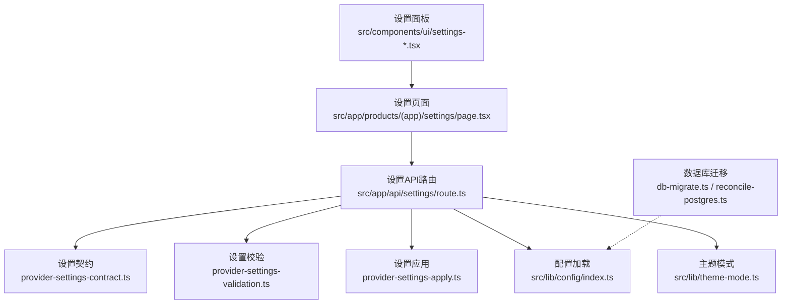
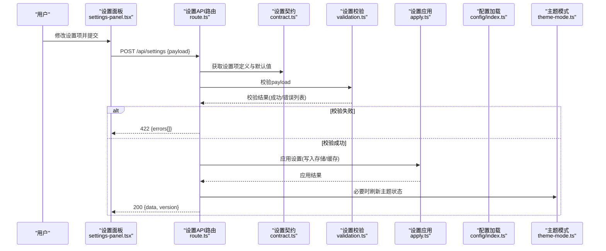
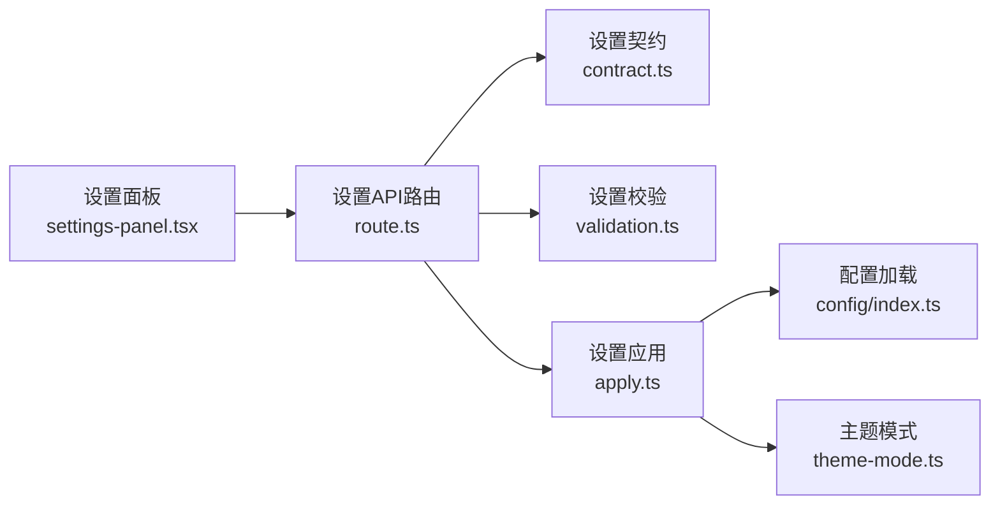

# 设置API

<cite>
**本文引用的文件**   
- [src/app/api/settings/route.ts](file://src/app/api/settings/route.ts)
- [src/app/api/settings/route.test.ts](file://src/app/api/settings/route.test.ts)
- [src/features/ai/provider-settings-contract.ts](file://src/features/ai/provider-settings-contract.ts)
- [src/features/ai/provider-settings-validation.ts](file://src/features/ai/provider-settings-validation.ts)
- [src/features/ai/provider-settings-projection.ts](file://src/features/ai/provider-settings-projection.ts)
- [src/features/ai/provider-settings-dependencies.ts](file://src/features/ai/provider-settings-dependencies.ts)
- [src/features/ai/provider-settings-apply.ts](file://src/features/ai/provider-settings-apply.ts)
- [src/lib/config/index.ts](file://src/lib/config/index.ts)
- [src/lib/theme-mode.ts](file://src/lib/theme-mode.ts)
- [src/components/ui/settings-panel.tsx](file://src/components/ui/settings-panel.tsx)
- [src/components/ui/settings-row.tsx](file://src/components/ui/settings-row.tsx)
- [src/components/ui/settings-group.tsx](file://src/components/ui/settings-group.tsx)
- [src/app/products/(app)/settings/page.tsx](file://src/app/products/(app)/settings/page.tsx)
- [scripts/setup/db-migrate.ts](file://scripts/setup/db-migrate.ts)
- [scripts/migration/reconcile-postgres.ts](file://scripts/migration/reconcile-postgres.ts)
</cite>

## 目录
1. [简介](#简介)
2. [项目结构](#项目结构)
3. [核心组件](#核心组件)
4. [架构总览](#架构总览)
5. [详细组件分析](#详细组件分析)
6. [依赖关系分析](#依赖关系分析)
7. [性能考虑](#性能考虑)
8. [故障排查指南](#故障排查指南)
9. [结论](#结论)
10. [附录](#附录)

## 简介
本文件面向“应用设置”相关API，覆盖用户偏好、系统配置与主题定制等能力。文档聚焦以下目标：
- 配置的读取、更新与校验流程
- 设置项定义、默认值与约束条件说明
- 批量操作、配置迁移与版本兼容性的高级用法
- 前后端协作方式与错误处理约定

## 项目结构
设置功能由“前端UI组件 + API路由 + 设置契约与校验 + 配置加载 + 主题模式 + 迁移脚本”共同组成。关键路径如下：
- API入口：src/app/api/settings/route.ts
- 设置契约与校验：src/features/ai/provider-settings-*.ts
- 配置加载：src/lib/config/index.ts
- 主题模式：src/lib/theme-mode.ts
- 前端设置面板：src/components/ui/settings-*.tsx 与 src/app/products/(app)/settings/page.tsx
- 迁移与初始化：scripts/setup/db-migrate.ts、scripts/migration/reconcile-postgres.ts

图表来源
- [src/app/api/settings/route.ts](file://src/app/api/settings/route.ts)
- [src/features/ai/provider-settings-contract.ts](file://src/features/ai/provider-settings-contract.ts)
- [src/features/ai/provider-settings-validation.ts](file://src/features/ai/provider-settings-validation.ts)
- [src/features/ai/provider-settings-apply.ts](file://src/features/ai/provider-settings-apply.ts)
- [src/lib/config/index.ts](file://src/lib/config/index.ts)
- [src/lib/theme-mode.ts](file://src/lib/theme-mode.ts)
- [scripts/setup/db-migrate.ts](file://scripts/setup/db-migrate.ts)
- [scripts/migration/reconcile-postgres.ts](file://scripts/migration/reconcile-postgres.ts)

章节来源
- [src/app/api/settings/route.ts](file://src/app/api/settings/route.ts)
- [src/app/api/settings/route.test.ts](file://src/app/api/settings/route.test.ts)
- [src/features/ai/provider-settings-contract.ts](file://src/features/ai/provider-settings-contract.ts)
- [src/features/ai/provider-settings-validation.ts](file://src/features/ai/provider-settings-validation.ts)
- [src/features/ai/provider-settings-apply.ts](file://src/features/ai/provider-settings-apply.ts)
- [src/lib/config/index.ts](file://src/lib/config/index.ts)
- [src/lib/theme-mode.ts](file://src/lib/theme-mode.ts)
- [src/components/ui/settings-panel.tsx](file://src/components/ui/settings-panel.tsx)
- [src/components/ui/settings-row.tsx](file://src/components/ui/settings-row.tsx)
- [src/components/ui/settings-group.tsx](file://src/components/ui/settings-group.tsx)
- [src/app/products/(app)/settings/page.tsx](file://src/app/products/(app)/settings/page.tsx)
- [scripts/setup/db-migrate.ts](file://scripts/setup/db-migrate.ts)
- [scripts/migration/reconcile-postgres.ts](file://scripts/migration/reconcile-postgres.ts)

## 核心组件
- 设置API路由：统一接收GET/POST请求，负责参数解析、校验、读取与持久化、响应返回。
- 设置契约：定义设置项的键名、类型、默认值与约束。
- 设置校验：对输入进行严格校验，返回结构化错误信息。
- 设置应用：将校验通过的设置应用到运行时或存储层。
- 配置加载：从环境变量/配置文件加载系统级配置。
- 主题模式：管理界面主题（如明/暗）及切换逻辑。
- 前端设置面板：提供用户交互、表单展示与提交。
- 迁移脚本：保障配置结构与数据在版本升级时的兼容。

章节来源
- [src/app/api/settings/route.ts](file://src/app/api/settings/route.ts)
- [src/features/ai/provider-settings-contract.ts](file://src/features/ai/provider-settings-contract.ts)
- [src/features/ai/provider-settings-validation.ts](file://src/features/ai/provider-settings-validation.ts)
- [src/features/ai/provider-settings-apply.ts](file://src/features/ai/provider-settings-apply.ts)
- [src/lib/config/index.ts](file://src/lib/config/index.ts)
- [src/lib/theme-mode.ts](file://src/lib/theme-mode.ts)
- [src/components/ui/settings-panel.tsx](file://src/components/ui/settings-panel.tsx)
- [src/components/ui/settings-row.tsx](file://src/components/ui/settings-row.tsx)
- [src/components/ui/settings-group.tsx](file://src/components/ui/settings-group.tsx)
- [src/app/products/(app)/settings/page.tsx](file://src/app/products/(app)/settings/page.tsx)

## 架构总览
设置API采用“契约驱动 + 校验先行 + 应用落库”的分层设计。前端通过设置面板发起请求，后端路由按契约解析并校验，再调用应用层完成持久化与缓存更新，最后返回标准化结果。

图表来源
- [src/app/api/settings/route.ts](file://src/app/api/settings/route.ts)
- [src/features/ai/provider-settings-contract.ts](file://src/features/ai/provider-settings-contract.ts)
- [src/features/ai/provider-settings-validation.ts](file://src/features/ai/provider-settings-validation.ts)
- [src/features/ai/provider-settings-apply.ts](file://src/features/ai/provider-settings-apply.ts)
- [src/lib/config/index.ts](file://src/lib/config/index.ts)
- [src/lib/theme-mode.ts](file://src/lib/theme-mode.ts)

## 详细组件分析

### 设置API路由（读取/更新/验证）
- 职责
  - 解析请求体与查询参数
  - 基于契约生成默认值
  - 执行字段级校验与业务规则校验
  - 调用应用层完成持久化与缓存更新
  - 返回统一的成功/错误响应格式
- 典型流程
  - GET：返回当前有效设置（合并默认值与已保存值）
  - POST：接收增量或全量设置，校验后应用并返回新版本号
- 错误处理
  - 参数缺失/类型错误：返回422与字段错误明细
  - 权限不足：返回403
  - 服务异常：返回500与可观测日志ID

章节来源
- [src/app/api/settings/route.ts](file://src/app/api/settings/route.ts)
- [src/app/api/settings/route.test.ts](file://src/app/api/settings/route.test.ts)

### 设置契约（定义/默认值/约束）
- 职责
  - 集中声明所有设置项的键名、类型、是否必填、默认值、取值范围与枚举
  - 为校验与应用层提供权威来源
- 常见设置域
  - 用户偏好：语言、时区、通知开关、编辑器行为
  - 系统配置：模型提供商、TTS配置、渲染队列策略
  - 主题定制：主题色、字体大小、布局密度
- 版本兼容
  - 支持向后兼容的字段弃用与新增字段默认值注入

章节来源
- [src/features/ai/provider-settings-contract.ts](file://src/features/ai/provider-settings-contract.ts)

### 设置校验（输入验证）
- 职责
  - 类型检查、必填校验、范围/格式校验、跨字段依赖校验
  - 聚合错误信息，便于前端逐项提示
- 输出
  - 成功：空错误集
  - 失败：结构化错误数组（字段、消息、代码）

章节来源
- [src/features/ai/provider-settings-validation.ts](file://src/features/ai/provider-settings-validation.ts)

### 设置应用（持久化与生效）
- 职责
  - 将校验通过的设置写入存储（内存/数据库/对象存储）
  - 触发必要的副作用（如刷新主题、重建会话、重载配置）
  - 记录变更审计信息与版本号
- 事务性
  - 多字段更新建议原子化，失败回滚

章节来源
- [src/features/ai/provider-settings-apply.ts](file://src/features/ai/provider-settings-apply.ts)

### 配置加载（系统级配置）
- 职责
  - 从环境变量/配置文件加载系统级配置
  - 提供只读接口供设置API使用
- 特性
  - 冷启动加载、热重载可选
  - 敏感信息加密或外部密钥管理

章节来源
- [src/lib/config/index.ts](file://src/lib/config/index.ts)

### 主题模式（界面主题）
- 职责
  - 管理主题模式（如明/暗）、主题变量与切换
  - 与设置API联动，当主题相关设置变更时即时生效
- 特性
  - 客户端优先，服务端同步状态
  - 支持自定义主题扩展点

章节来源
- [src/lib/theme-mode.ts](file://src/lib/theme-mode.ts)

### 前端设置面板（交互与提交）
- 职责
  - 展示设置分组、行项与帮助文案
  - 收集用户输入，组装payload并调用API
  - 展示校验错误与成功反馈
- 组件
  - 设置面板容器、分组、行项、开关、选择器等

章节来源
- [src/components/ui/settings-panel.tsx](file://src/components/ui/settings-panel.tsx)
- [src/components/ui/settings-row.tsx](file://src/components/ui/settings-row.tsx)
- [src/components/ui/settings-group.tsx](file://src/components/ui/settings-group.tsx)
- [src/app/products/(app)/settings/page.tsx](file://src/app/products/(app)/settings/page.tsx)

### 配置迁移与版本兼容
- 职责
  - 在部署或首次启动时执行迁移，确保数据结构与默认值一致
  - 支持增量迁移与回滚策略
- 工具
  - 数据库迁移脚本、配置对齐脚本

章节来源
- [scripts/setup/db-migrate.ts](file://scripts/setup/db-migrate.ts)
- [scripts/migration/reconcile-postgres.ts](file://scripts/migration/reconcile-postgres.ts)

## 依赖关系分析
设置API依赖契约、校验、应用、配置与主题模块，形成清晰的单向依赖链，避免循环依赖。

图表来源
- [src/app/api/settings/route.ts](file://src/app/api/settings/route.ts)
- [src/features/ai/provider-settings-contract.ts](file://src/features/ai/provider-settings-contract.ts)
- [src/features/ai/provider-settings-validation.ts](file://src/features/ai/provider-settings-validation.ts)
- [src/features/ai/provider-settings-apply.ts](file://src/features/ai/provider-settings-apply.ts)
- [src/lib/config/index.ts](file://src/lib/config/index.ts)
- [src/lib/theme-mode.ts](file://src/lib/theme-mode.ts)
- [src/components/ui/settings-panel.tsx](file://src/components/ui/settings-panel.tsx)

章节来源
- [src/app/api/settings/route.ts](file://src/app/api/settings/route.ts)
- [src/features/ai/provider-settings-contract.ts](file://src/features/ai/provider-settings-contract.ts)
- [src/features/ai/provider-settings-validation.ts](file://src/features/ai/provider-settings-validation.ts)
- [src/features/ai/provider-settings-apply.ts](file://src/features/ai/provider-settings-apply.ts)
- [src/lib/config/index.ts](file://src/lib/config/index.ts)
- [src/lib/theme-mode.ts](file://src/lib/theme-mode.ts)
- [src/components/ui/settings-panel.tsx](file://src/components/ui/settings-panel.tsx)

## 性能考虑
- 校验前置：尽早失败，减少无效I/O
- 增量更新：仅提交变更字段，降低网络与存储压力
- 缓存策略：热点设置项短期缓存，避免频繁读取
- 批处理：批量更新时使用事务，减少锁竞争
- 异步副作用：主题刷新、会话重建等异步执行，避免阻塞主流程

## 故障排查指南
- 常见问题
  - 422校验失败：检查字段类型、必填项、取值范围与跨字段依赖
  - 403权限错误：确认当前用户角色与访问范围
  - 500服务异常：查看服务端日志与链路追踪ID
- 定位步骤
  - 复现最小用例，缩小payload范围
  - 对比契约定义与默认值
  - 检查迁移脚本是否执行成功
  - 观察主题与配置热重载是否生效
- 恢复手段
  - 回滚到上一版本设置快照
  - 重新运行迁移脚本
  - 重置默认值并逐步回填

章节来源
- [src/app/api/settings/route.test.ts](file://src/app/api/settings/route.test.ts)
- [scripts/setup/db-migrate.ts](file://scripts/setup/db-migrate.ts)
- [scripts/migration/reconcile-postgres.ts](file://scripts/migration/reconcile-postgres.ts)

## 结论
设置API以契约为核心，结合严格的校验与稳健的应用层，实现了用户偏好、系统配置与主题定制的完整生命周期管理。配合迁移脚本与版本兼容策略，可在演进中保持稳定性与一致性。建议在开发中遵循“契约优先、校验先行、增量更新、幂等应用”的原则，以获得更好的可维护性与用户体验。

## 附录
- 常用设置项示例（概念性）
  - 用户偏好：语言、时区、通知开关、编辑器行为
  - 系统配置：模型提供商、TTS配置、渲染队列策略
  - 主题定制：主题色、字体大小、布局密度
- 最佳实践
  - 使用增量更新与幂等键
  - 为每个设置项添加描述与帮助文案
  - 对敏感字段进行加密与最小权限访问
  - 为重要变更添加审计日志与回滚方案