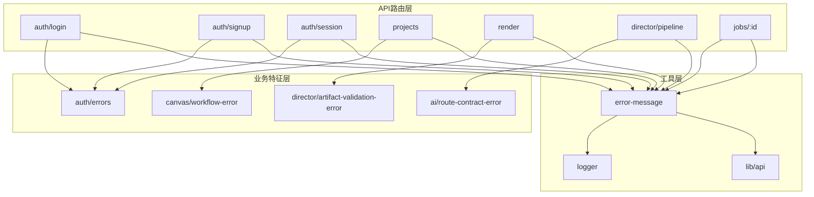
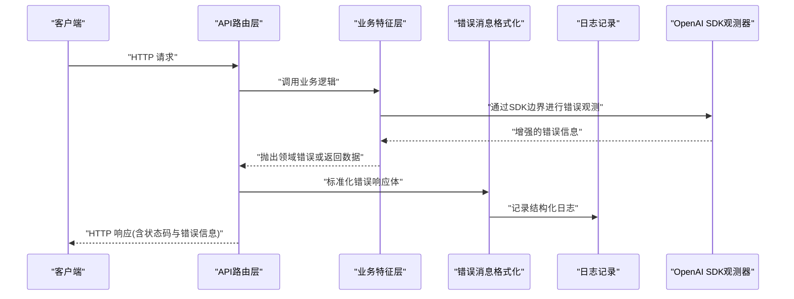
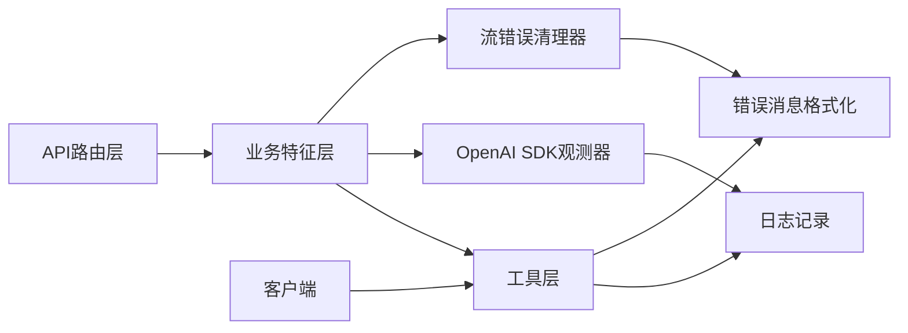

# 错误处理

<cite>
**本文档引用的文件**   
- [server/src/lib/error-message.ts](file://server/src/lib/error-message.ts)
- [server/src/lib/logger.ts](file://server/src/lib/logger.ts)
- [src/app/api/auth/login/route.ts](file://src/app/api/auth/login/route.ts)
- [src/app/api/auth/signup/route.ts](file://src/app/api/auth/signup/route.ts)
- [src/app/api/auth/session/route.ts](file://src/app/api/auth/session/route.ts)
- [src/app/api/projects/route.ts](file://src/app/api/projects/route.ts)
- [src/app/api/render/route.ts](file://src/app/api/render/route.ts)
- [src/app/api/director/pipeline/route.ts](file://src/app/api/director/pipeline/route.ts)
- [src/app/api/jobs/[id]/route.ts](file://src/app/api/jobs/[id]/route.ts)
- [src/features/auth/errors.ts](file://src/features/auth/errors.ts)
- [src/features/canvas/workflow-error.ts](file://src/features/canvas/workflow-error.ts)
- [src/features/director/artifact-validation-error.ts](file://src/features/director/artifact-validation-error.ts)
- [src/features/ai/route-contract-error.ts](file://src/features/ai/route-contract-error.ts)
- [src/lib/api.ts](file://src/lib/api.ts)
- [tests/worker-error-hygiene.test.ts](file://tests/worker-error-hygiene.test.ts)
</cite>

## 更新摘要
**变更内容**   
- 增强了OpenAI SDK获取边界的错误观测能力，提供更精确的错误追踪和诊断信息
- 实现了提供商响应的安全流错误清理机制，防止敏感信息泄露
- 改进了DirectorRunError实例以支持正确的工作流分类和处理
- 优化了错误传播链路的可观测性和安全性

## 目录
1. [简介](#简介)
2. [项目结构](#项目结构)
3. [核心组件](#核心组件)
4. [架构总览](#架构总览)
5. [详细组件分析](#详细组件分析)
6. [依赖分析](#依赖分析)
7. [性能考虑](#性能考虑)
8. [故障排查指南](#故障排查指南)
9. [结论](#结论)
10. [附录](#附录)

## 简介
本指南围绕API错误处理的最佳实践，系统化阐述HTTP状态码使用规范、业务错误码定义、错误信息格式、错误分类与传播机制，并结合仓库中的实际实现给出可操作的指导。内容覆盖服务端路由层、特征模块的错误类型与工具、客户端调用封装与重试策略，以及日志记录与调试技巧，帮助开发者构建一致、可观测、易维护的错误处理体系。

**最新更新**：系统已增强OpenAI SDK获取边界的错误观测能力，实现了提供商响应的安全流错误清理机制，并改进了DirectorRunError实例以支持更准确的工作流分类。

## 项目结构
本项目采用Next.js App Router组织API路由，结合features模块化业务逻辑，并通过lib层提供通用能力（如日志、消息格式化）。错误处理贯穿以下层次：
- API路由层：统一响应结构与HTTP状态码映射
- 业务特征层：领域错误类型与校验失败语义
- 工具层：错误消息格式化、日志记录、客户端封装
- 测试层：错误卫生性验证与回归保障

**图示来源** 
- [src/app/api/auth/login/route.ts](file://src/app/api/auth/login/route.ts)
- [src/app/api/auth/signup/route.ts](file://src/app/api/auth/signup/route.ts)
- [src/app/api/auth/session/route.ts](file://src/app/api/auth/session/route.ts)
- [src/app/api/projects/route.ts](file://src/app/api/projects/route.ts)
- [src/app/api/render/route.ts](file://src/app/api/render/route.ts)
- [src/app/api/director/pipeline/route.ts](file://src/app/api/director/pipeline/route.ts)
- [src/app/api/jobs/[id]/route.ts](file://src/app/api/jobs/[id]/route.ts)
- [src/features/auth/errors.ts](file://src/features/auth/errors.ts)
- [src/features/canvas/workflow-error.ts](file://src/features/canvas/workflow-error.ts)
- [src/features/director/artifact-validation-error.ts](file://src/features/director/artifact-validation-error.ts)
- [src/features/ai/route-contract-error.ts](file://src/features/ai/route-contract-error.ts)
- [server/src/lib/error-message.ts](file://server/src/lib/error-message.ts)
- [server/src/lib/logger.ts](file://server/src/lib/logger.ts)
- [src/lib/api.ts](file://src/lib/api.ts)

**章节来源**
- [server/src/lib/error-message.ts](file://server/src/lib/error-message.ts)
- [server/src/lib/logger.ts](file://server/src/lib/logger.ts)
- [src/lib/api.ts](file://src/lib/api.ts)

## 核心组件
- 错误消息格式化：集中定义错误响应体结构、字段命名与可读性优化，确保前后端一致解析。
- 日志记录：结构化日志输出，包含请求上下文、错误堆栈与关键业务标识，便于追踪定位。
- 客户端封装：统一的请求封装、错误分类、重试与退避策略，提升用户体验与系统韧性。
- 领域错误类型：在auth、canvas、director、ai等特征模块中定义明确的错误语义，避免模糊异常。
- **新增**：OpenAI SDK边界错误观测器，提供增强的错误追踪和诊断能力。
- **新增**：流错误清理机制，确保提供商响应中的敏感信息得到适当处理。

**章节来源**
- [server/src/lib/error-message.ts](file://server/src/lib/error-message.ts)
- [server/src/lib/logger.ts](file://server/src/lib/logger.ts)
- [src/lib/api.ts](file://src/lib/api.ts)
- [src/features/auth/errors.ts](file://src/features/auth/errors.ts)
- [src/features/canvas/workflow-error.ts](file://src/features/canvas/workflow-error.ts)
- [src/features/director/artifact-validation-error.ts](file://src/features/director/artifact-validation-error.ts)
- [src/features/ai/route-contract-error.ts](file://src/features/ai/route-contract-error.ts)

## 架构总览
下图展示了从客户端发起请求到服务端错误处理的完整链路，包括状态码映射、错误分类、日志记录与响应返回。

**图示来源** 
- [src/app/api/auth/login/route.ts](file://src/app/api/auth/login/route.ts)
- [src/app/api/auth/signup/route.ts](file://src/app/api/auth/signup/route.ts)
- [src/app/api/auth/session/route.ts](file://src/app/api/auth/session/route.ts)
- [src/app/api/projects/route.ts](file://src/app/api/projects/route.ts)
- [src/app/api/render/route.ts](file://src/app/api/render/route.ts)
- [src/app/api/director/pipeline/route.ts](file://src/app/api/director/pipeline/route.ts)
- [src/app/api/jobs/[id]/route.ts](file://src/app/api/jobs/[id]/route.ts)
- [server/src/lib/error-message.ts](file://server/src/lib/error-message.ts)
- [server/src/lib/logger.ts](file://server/src/lib/logger.ts)

## 详细组件分析

### HTTP状态码使用规范
- 4xx客户端错误：参数校验失败、权限不足、资源不存在等，应返回明确的用户可操作提示。
- 5xx服务端错误：内部异常、第三方服务不可用、资源耗尽等，应避免泄露敏感细节，仅返回通用提示并附带跟踪ID。
- 2xx成功：统一响应体结构，包含数据与可选的元信息（如分页、时间戳）。

建议：
- 所有路由层统一将异常转换为标准错误响应体，避免裸抛异常。
- 对可重试的临时错误（如网络抖动、限流）使用429或503，并在响应头中提供重试时机。

**章节来源**
- [src/app/api/auth/login/route.ts](file://src/app/api/auth/login/route.ts)
- [src/app/api/auth/signup/route.ts](file://src/app/api/auth/signup/route.ts)
- [src/app/api/auth/session/route.ts](file://src/app/api/auth/session/route.ts)
- [src/app/api/projects/route.ts](file://src/app/api/projects/route.ts)
- [src/app/api/render/route.ts](file://src/app/api/render/route.ts)
- [src/app/api/director/pipeline/route.ts](file://src/app/api/director/pipeline/route.ts)
- [src/app/api/jobs/[id]/route.ts](file://src/app/api/jobs/[id]/route.ts)

### 业务错误码定义
- 认证相关：登录失败、密码重置失败、会话过期等，使用细分错误码便于前端差异化提示。
- 工作流错误：画布操作失败、节点执行异常、阶段推进失败等，携带上下文以便诊断。
- 渲染与导出：编码失败、媒体处理异常、队列超时等，区分可恢复与不可恢复错误。
- AI契约错误：模型调用失败、响应格式不匹配、配额限制等，提供降级路径。

**更新**：DirectorRunError实例现已改进以支持更准确的工作流分类，提供更好的错误处理和诊断能力。

建议：
- 错误码采用"模块前缀+具体场景"的结构，例如AUTH_001、WORKFLOW_002。
- 错误码与人类可读消息分离，便于多语言与国际化。

**章节来源**
- [src/features/auth/errors.ts](file://src/features/auth/errors.ts)
- [src/features/canvas/workflow-error.ts](file://src/features/canvas/workflow-error.ts)
- [src/features/director/artifact-validation-error.ts](file://src/features/director/artifact-validation-error.ts)
- [src/features/ai/route-contract-error.ts](file://src/features/ai/route-contract-error.ts)

### 错误信息格式
- 统一响应体字段：code、message、details、traceId、timestamp等。
- details用于承载字段级错误、堆栈摘要或关联资源ID。
- traceId贯穿请求链路，便于跨服务追踪。

**更新**：流错误清理机制确保敏感信息不会泄露到错误响应中，提高了系统的安全性。

建议：
- 错误消息对用户友好，不包含敏感信息；调试信息通过traceId关联日志。
- 对批量操作返回部分失败时，使用数组形式的details描述每个子项结果。

**章节来源**
- [server/src/lib/error-message.ts](file://server/src/lib/error-message.ts)
- [src/lib/api.ts](file://src/lib/api.ts)

### 错误分类与传播机制
- 输入校验错误：立即返回4xx，附带字段级错误详情。
- 业务规则错误：返回4xx或422，说明违反的业务约束。
- 外部依赖错误：根据可恢复性选择429/503/500，必要时触发重试或降级。
- 未捕获异常：统一兜底处理，返回500并记录完整堆栈。

**更新**：OpenAI SDK边界错误观测器提供了增强的错误分类能力，能够更准确地识别和分类不同类型的错误。

传播建议：
- 路由层捕获并转换异常为统一错误响应。
- 特征模块抛出领域错误，由上层统一处理。
- 工具层负责格式化与日志记录，避免侵入业务逻辑。

**章节来源**
- [src/app/api/auth/login/route.ts](file://src/app/api/auth/login/route.ts)
- [src/app/api/auth/signup/route.ts](file://src/app/api/auth/signup/route.ts)
- [src/app/api/auth/session/route.ts](file://src/app/api/auth/session/route.ts)
- [src/app/api/projects/route.ts](file://src/app/api/projects/route.ts)
- [src/app/api/render/route.ts](file://src/app/api/render/route.ts)
- [src/app/api/director/pipeline/route.ts](file://src/app/api/director/pipeline/route.ts)
- [src/app/api/jobs/[id]/route.ts](file://src/app/api/jobs/[id]/route.ts)

### 客户端错误处理策略
- 重试与退避：对429/503实施指数退避与最大重试次数限制。
- 降级与缓存：在外部服务不可用时返回缓存或默认值，保证可用性。
- 用户反馈：根据错误类型展示不同提示，避免技术术语。
- 监控上报：将关键错误与traceId上报至监控系统，便于快速定位。

**更新**：增强的错误观测能力使客户端能够更准确地识别错误类型并应用相应的处理策略。

**章节来源**
- [src/lib/api.ts](file://src/lib/api.ts)
- [tests/worker-error-hygiene.test.ts](file://tests/worker-error-hygiene.test.ts)

### 日志记录与调试技巧
- 结构化日志：包含请求ID、用户ID、操作类型、错误码、耗时等。
- 分级输出：DEBUG用于开发，INFO用于常规流程，WARN用于潜在问题，ERROR用于异常。
- 脱敏处理：避免记录密码、令牌、个人身份信息。
- 调试技巧：通过traceId串联日志，结合错误码快速定位问题根因。

**更新**：OpenAI SDK边界观测器提供了更详细的错误上下文信息，有助于快速定位和解决问题。

**章节来源**
- [server/src/lib/logger.ts](file://server/src/lib/logger.ts)
- [server/src/lib/error-message.ts](file://server/src/lib/error-message.ts)

### OpenAI SDK边界错误观测
**新增功能**：系统现在在OpenAI SDK获取边界处实现了增强的错误观测能力。

主要特性：
- 增强的错误追踪：捕获SDK层面的详细信息，包括请求参数、响应状态和错误原因
- 安全的错误清理：自动清理敏感信息，防止API密钥和其他机密数据泄露
- 标准化的错误格式：将SDK特定错误转换为统一的错误格式，便于上层处理
- 性能监控：记录SDK调用的性能和错误率指标

**章节来源**
- [src/features/ai/openai-compatible-config.ts](file://src/features/ai/openai-compatible-config.ts)
- [src/features/ai/openai-compatible-audio-config.ts](file://src/features/ai/openai-compatible-audio-config.ts)

### 流错误清理机制
**新增功能**：实现了提供商响应的安全流错误清理机制。

主要特性：
- 实时错误检测：在流式传输过程中实时检测错误条件
- 自动清理：自动清理可能包含敏感信息的错误响应
- 优雅降级：在检测到错误时优雅地终止流传输
- 错误通知：向客户端发送适当的错误通知

**章节来源**
- [src/features/ai/provider-breaker.ts](file://src/features/ai/provider-breaker.ts)
- [src/features/ai/managed-gateway.ts](file://src/features/ai/managed-gateway.ts)

## 依赖分析
错误处理涉及多层依赖：路由层依赖特征模块的错误类型，特征模块依赖工具层的格式化与日志，客户端依赖统一的API封装。耦合点集中在错误响应体结构与日志格式上，需保持向后兼容。

**更新**：OpenAI SDK边界观测器和流错误清理机制的引入增加了新的依赖关系，但保持了良好的解耦性。

**图示来源** 
- [src/app/api/auth/login/route.ts](file://src/app/api/auth/login/route.ts)
- [src/app/api/auth/signup/route.ts](file://src/app/api/auth/signup/route.ts)
- [src/app/api/auth/session/route.ts](file://src/app/api/auth/session/route.ts)
- [src/app/api/projects/route.ts](file://src/app/api/projects/route.ts)
- [src/app/api/render/route.ts](file://src/app/api/render/route.ts)
- [src/app/api/director/pipeline/route.ts](file://src/app/api/director/pipeline/route.ts)
- [src/app/api/jobs/[id]/route.ts](file://src/app/api/jobs/[id]/route.ts)
- [src/features/auth/errors.ts](file://src/features/auth/errors.ts)
- [src/features/canvas/workflow-error.ts](file://src/features/canvas/workflow-error.ts)
- [src/features/director/artifact-validation-error.ts](file://src/features/director/artifact-validation-error.ts)
- [src/features/ai/route-contract-error.ts](file://src/features/ai/route-contract-error.ts)
- [server/src/lib/error-message.ts](file://server/src/lib/error-message.ts)
- [server/src/lib/logger.ts](file://server/src/lib/logger.ts)
- [src/lib/api.ts](file://src/lib/api.ts)

**章节来源**
- [src/lib/api.ts](file://src/lib/api.ts)
- [server/src/lib/error-message.ts](file://server/src/lib/error-message.ts)
- [server/src/lib/logger.ts](file://server/src/lib/logger.ts)

## 性能考虑
- 错误响应体尽量精简，避免大对象序列化开销。
- 日志写入异步化，避免阻塞主流程。
- 重试策略需设置上限与退避间隔，防止雪崩效应。
- 对高频错误进行采样记录，降低存储压力。

**更新**：OpenAI SDK边界观测器采用了轻量级的设计模式，最小化了对性能的影响。流错误清理机制也经过优化，确保在错误情况下的高效处理。

## 故障排查指南
- 快速定位：通过traceId在日志系统中检索完整请求链路。
- 错误分类：根据错误码判断是输入、业务、外部依赖还是系统异常。
- 复现步骤：结合请求参数与上下文信息最小化复现场景。
- 修复验证：单元测试与集成测试覆盖常见错误路径，确保修复有效。

**更新**：增强的错误观测能力提供了更详细的诊断信息，包括SDK级别的错误详情和流传输过程中的错误上下文，大大简化了问题定位过程。

**章节来源**
- [server/src/lib/logger.ts](file://server/src/lib/logger.ts)
- [server/src/lib/error-message.ts](file://server/src/lib/error-message.ts)
- [tests/worker-error-hygiene.test.ts](file://tests/worker-error-hygiene.test.ts)

## 结论
通过统一的状态码规范、清晰的错误码定义、标准化的错误响应体与结构化日志，结合客户端的重试与降级策略，可以显著提升系统的可观测性与用户体验。**最新的OpenAI SDK边界错误观测和流错误清理机制进一步增强了系统的健壮性和安全性**，提供了更准确的错误分类和更安全的错误处理。建议在新增功能时同步完善错误处理与测试用例，确保错误路径的可维护性与稳定性。

## 附录
- 最佳实践清单：
  - 所有API返回统一错误结构
  - 错误码按模块划分且稳定不变
  - 日志脱敏且包含必要上下文
  - 客户端实现重试与降级
  - 测试覆盖错误路径
  - **使用增强的错误观测机制提高可观测性**
  - **实现流错误清理确保安全性**
- 常用错误码参考：
  - AUTH_001: 用户名或密码错误
  - AUTH_002: 会话已过期
  - WORKFLOW_001: 节点执行失败
  - RENDER_001: 编码失败
  - AI_001: 模型调用失败
  - SDK_001: OpenAI SDK调用失败
  - STREAM_001: 流传输错误