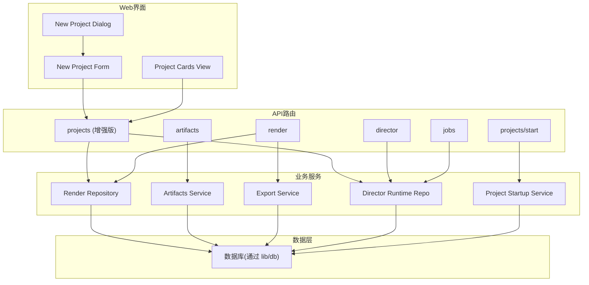
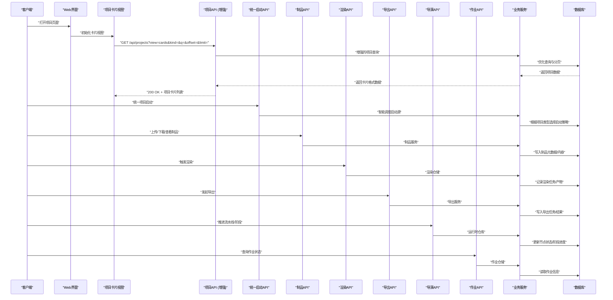
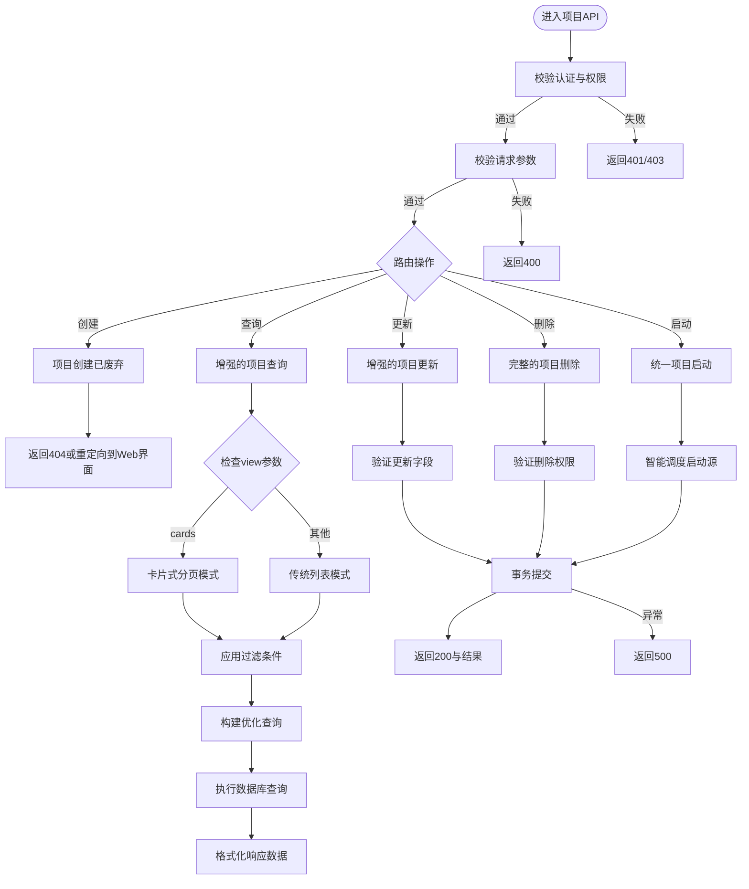
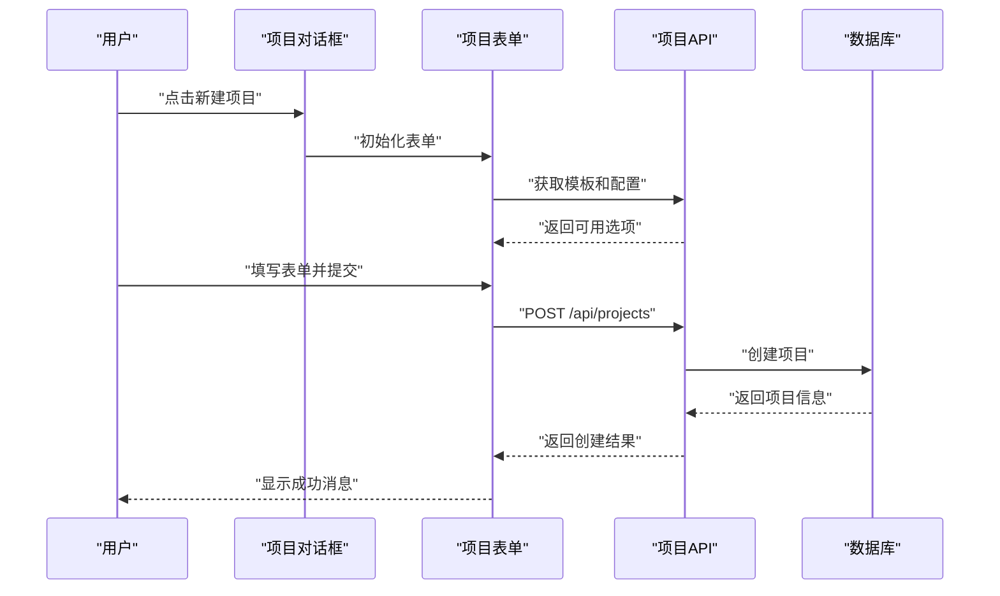
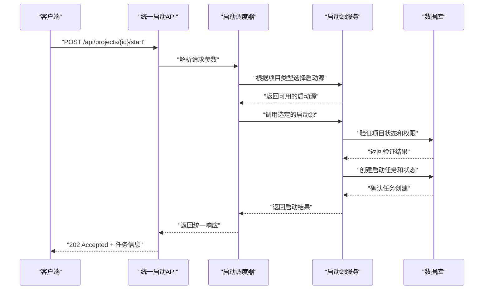
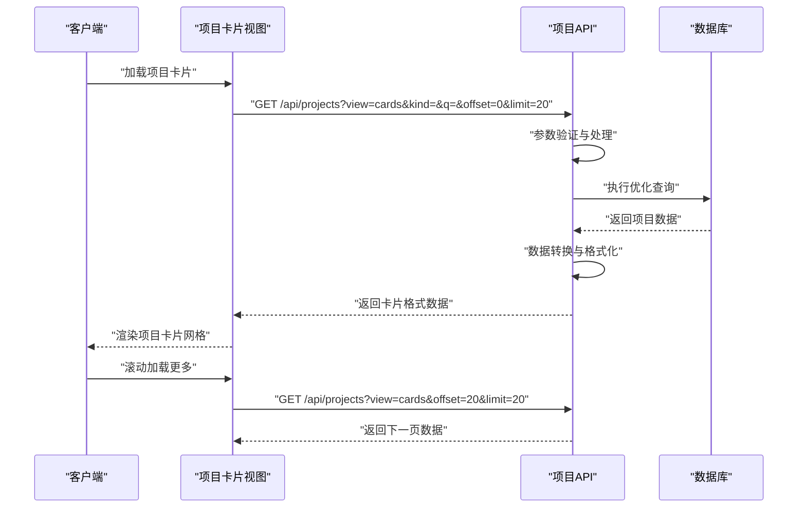
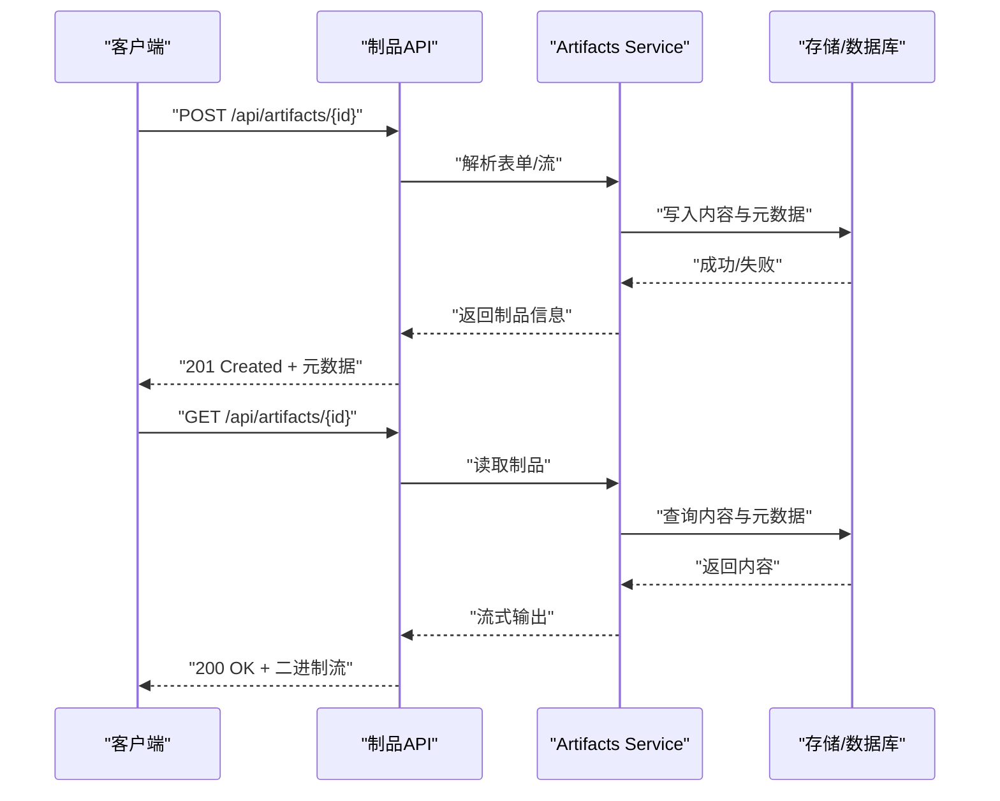
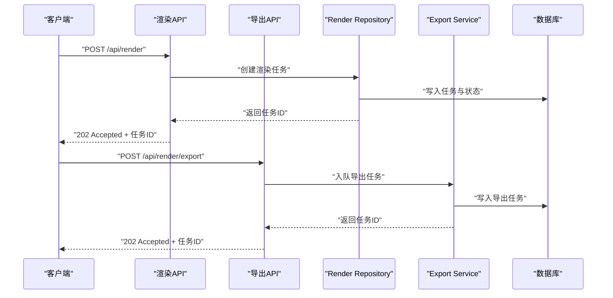
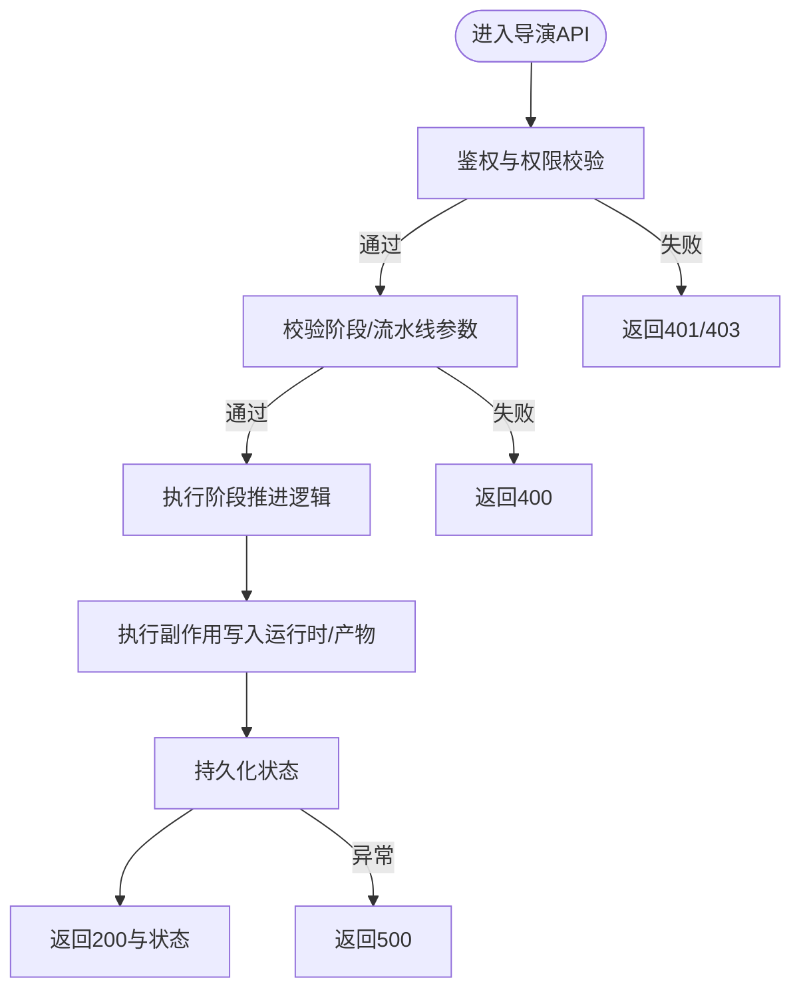
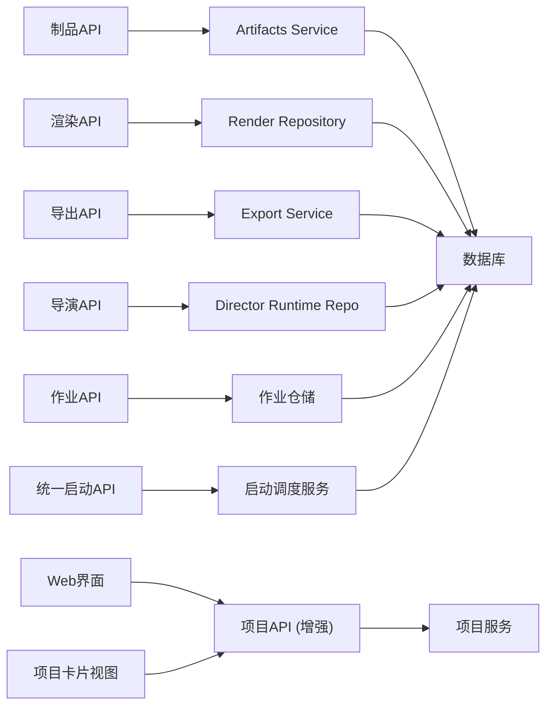

# 项目管理API

<cite>
**本文引用的文件**   
- [src/app/api/projects/route.ts](file://src/app/api/projects/route.ts)
- [src/app/api/projects/[id]/route.ts](file://src/app/api/projects/[id]/route.ts)
- [src/app/api/artifacts/[id]/route.ts](file://src/app/api/artifacts/[id]/route.ts)
- [src/app/api/render/route.ts](file://src/app/api/render/route.ts)
- [src/app/api/render/export/route.ts](file://src/app/api/render/export/route.ts)
- [src/app/api/director/pipeline/route.ts](file://src/app/api/director/pipeline/route.ts)
- [src/app/api/director/stage/route.ts](file://src/app/api/director/stage/route.ts)
- [src/app/api/jobs/[id]/route.ts](file://src/app/api/jobs/[id]/route.ts)
- [src/features/artifacts/service.ts](file://src/features/artifacts/service.ts)
- [src/features/artifacts/commit.ts](file://src/features/artifacts/commit.ts)
- [src/features/render/repository.ts](file://src/features/render/repository.ts)
- [src/features/render/export-service.ts](file://src/features/render/export-service.ts)
- [src/features/director/runtime-repository.ts](file://src/features/director/runtime-repository.ts)
- [src/lib/db/index.ts](file://src/lib/db/index.ts)
- [src/app/_components/new-project-dialog.tsx](file://src/app/_components/new-project-dialog.tsx)
- [src/app/_components/new-project-form.ts](file://src/app/_components/new-project-form.ts)
</cite>

## 更新摘要
**所做更改**
- **重要变更**：增强了 `/api/projects/[id]` 端点，新增 DELETE 方法支持项目完全删除功能
- **功能增强**：PATCH 方法现在支持重命名项目和导出设置更新操作
- 完善了项目CRUD操作的完整性，提供完整的删除和更新能力
- 更新了相关示例和错误处理说明

## 目录
1. [简介](#简介)
2. [项目结构](#项目结构)
3. [核心组件](#核心组件)
4. [架构总览](#架构总览)
5. [详细组件分析](#详细组件分析)
6. [依赖关系分析](#依赖关系分析)
7. [性能考虑](#性能考虑)
8. [故障排查指南](#故障排查指南)
9. [结论](#结论)
10. [附录](#附录)

## 简介
本文件面向"项目管理与制品"相关API，覆盖以下能力：
- 项目的完整CRUD操作（查询、创建、更新、删除）
- 项目状态管理（生命周期推进、阶段推进、统一启动）
- 制品上传下载
- 渲染与导出流程
- 作业调度与状态跟踪
- 数据同步机制（运行时仓库与持久化）

**重要变更**：`/api/projects/[id]` 端点现已支持完整的DELETE方法用于项目完全删除，PATCH方法支持重命名项目和导出设置更新。这些增强功能提供了更完整的项目管理能力。

文档提供接口定义、请求/响应格式、参数校验要点、权限控制说明、完整示例以及常见问题排查建议。

## 项目结构
本项目采用Next.js App Router组织API路由，业务逻辑位于features层，数据库访问通过lib/db统一封装。关键路径如下：
- API路由：src/app/api/*
- 业务服务：src/features/*
- Web界面组件：src/app/_components/*
- 数据库连接与迁移：src/lib/db/*

图表来源
- [src/app/api/projects/route.ts](file://src/app/api/projects/route.ts)
- [src/app/api/projects/[id]/route.ts](file://src/app/api/projects/[id]/route.ts)
- [src/app/api/artifacts/[id]/route.ts](file://src/app/api/artifacts/[id]/route.ts)
- [src/app/api/render/route.ts](file://src/app/api/render/route.ts)
- [src/app/api/director/pipeline/route.ts](file://src/app/api/director/pipeline/route.ts)
- [src/app/api/jobs/[id]/route.ts](file://src/app/api/jobs/[id]/route.ts)
- [src/app/_components/new-project-dialog.tsx](file://src/app/_components/new-project-dialog.tsx)
- [src/app/_components/new-project-form.ts](file://src/app/_components/new-project-form.ts)
- [src/features/artifacts/service.ts](file://src/features/artifacts/service.ts)
- [src/features/render/repository.ts](file://src/features/render/repository.ts)
- [src/features/render/export-service.ts](file://src/features/render/export-service.ts)
- [src/features/director/runtime-repository.ts](file://src/features/director/runtime-repository.ts)
- [src/lib/db/index.ts](file://src/lib/db/index.ts)

## 核心组件
- 项目API路由：提供项目列表、详情、更新、删除等REST接口。**已增强：支持完整的DELETE方法和增强的PATCH方法**
- **统一项目启动API**：提供统一的 `/api/projects/[id]/start` 端点，整合多种项目启动源
- 制品API路由：提供按ID获取/操作制品的接口，支持上传与下载
- 渲染API路由：触发渲染任务、查询渲染状态
- 导出API路由：发起导出任务并获取导出结果
- 导演（Director）API路由：推进流水线与阶段，驱动项目状态演进
- 作业API路由：查询作业执行状态与结果
- **Web界面项目创建组件**：new-project-dialog和new-project-form处理项目创建流程
- **项目卡片视图组件**：支持卡片式展示和交互的项目列表界面
- 业务服务：
  - Artifacts Service：制品读写、版本提交、预览模式处理
  - Render Repository：渲染产物存取、缩略图生成、媒体装配
  - Export Service：导出队列与异步处理
  - Director Runtime Repository：运行时节点数据、阶段推进、状态回写
  - **Project Startup Service**：智能调度多种项目启动源
- 数据层：统一的数据库连接与事务封装

## 架构总览
下图展示了从客户端到后端服务再到数据库的整体调用链，涵盖项目、制品、渲染、导出、导演与作业模块，以及新的Web界面项目创建流程、统一项目启动机制和增强的卡片式分页功能。

## 详细组件分析

### 项目API（CRUD与状态管理）
- 功能范围
  - 项目列表：**增强的卡片式分页**，支持view=cards参数，提供优化的卡片展示体验
  - **新增查询参数**：kind（项目类型过滤）、q（搜索关键词）、offset（偏移量）、limit（每页数量）
  - **向后兼容**：保持原有查询参数不变，新参数为可选
  - 项目详情：按ID获取项目元数据
  - **增强的项目更新**：PATCH方法现在支持重命名项目和导出设置更新
  - **完整的项目删除**：DELETE方法支持项目的完全删除操作
  - 状态管理：结合导演流水线推进项目状态
  - **统一启动：通过 `/api/projects/[id]/start` 端点整合多种启动源**
- 典型请求/响应
  - **项目创建：POST /api/projects - 已废弃**
    - 原请求体包含项目名称、描述、初始配置等
    - 原响应返回项目ID、创建时间、初始状态
    - **迁移指南：请使用Web界面表单进行项目创建**
  - **增强的项目列表查询：GET /api/projects?view=cards**
    - 支持参数：
      - `view=cards`：启用卡片式分页（新增）
      - `kind=`：按项目类型过滤（可选）
      - `q=`：搜索关键词（可选）
      - `offset=`：分页偏移量（默认0）
      - `limit=`：每页数量（默认20）
    - 响应返回：项目卡片数组、总数、分页信息
  - **增强的项目更新：PATCH /api/projects/{id}**
    - 支持字段：名称重命名、导出设置更新
    - 请求体为增量字段
    - 响应返回更新后的项目对象
  - **完整的项目删除：DELETE /api/projects/{id}**
    - 支持项目的完全删除操作
    - 成功返回空体或确认信息
  - **统一启动：POST /api/projects/{id}/start**
    - 请求体包含启动参数、工作流版本等
    - 响应返回启动状态、任务ID、预计完成时间
- 参数校验
  - 名称非空、长度限制；描述可选；配置项类型校验
  - **卡片式分页参数验证**：offset≥0、limit>0且≤100、kind有效值检查
  - **搜索参数验证**：q参数长度限制、特殊字符处理
  - **启动参数验证**：项目存在性、工作流版本兼容性、启动源可用性
  - **更新参数验证**：重命名字段验证、导出设置格式校验
  - **删除参数验证**：项目存在性检查、权限验证
- 权限控制
  - 鉴权中间件校验会话/令牌
  - 资源级权限校验（仅项目所有者或授权角色可操作）
  - **启动权限：需要项目编辑或启动权限**
  - **卡片式分页权限：所有用户均可查询，但受项目可见性限制**
  - **更新权限：需要项目编辑权限**
  - **删除权限：需要项目管理员权限**
- 错误码
  - 400 参数校验失败
  - 401 未认证
  - 403 无权限
  - 404 项目不存在
  - 409 项目状态冲突（如已启动）
  - 500 服务器内部错误

**章节来源**
- [src/app/api/projects/route.ts](file://src/app/api/projects/route.ts)
- [src/app/api/projects/[id]/route.ts](file://src/app/api/projects/[id]/route.ts)
- [src/lib/db/index.ts](file://src/lib/db/index.ts)

### Web界面项目创建
- 功能范围
  - **新项目对话框**：提供用户友好的项目创建界面
  - **表单验证**：前端表单验证确保数据完整性
  - **模板选择**：支持多种项目模板快速创建
  - **配置向导**：引导用户完成项目配置
- 组件结构
  - New Project Dialog：项目创建对话框容器
  - New Project Form：表单组件，处理用户输入和验证
  - New Project Source Card：项目源选择卡片组件
- 工作流程
  - 用户打开新建项目对话框
  - 选择项目模板和配置选项
  - 填写必要的表单字段
  - 提交表单创建项目
  - 显示创建结果和后续操作指引
- 与API交互
  - 查询可用模板和配置选项
  - 提交项目创建请求
  - 处理创建结果和错误状态

**章节来源**
- [src/app/_components/new-project-dialog.tsx](file://src/app/_components/new-project-dialog.tsx)
- [src/app/_components/new-project-form.ts](file://src/app/_components/new-project-form.ts)

### 统一项目启动API
- 功能范围
  - **统一入口**：通过单一端点 `/api/projects/[id]/start` 处理所有项目启动请求
  - **智能调度**：根据项目类型（kind）和工作流版本自动选择合适的启动源
  - **多源支持**：整合三种不同的项目启动源，提供一致的API体验
  - **状态管理**：处理项目启动状态转换和错误恢复
- 启动源类型
  - **工作流启动**：基于预定义工作流模板的项目初始化
  - **模板启动**：使用项目模板快速创建实例
  - **克隆启动**：从现有项目克隆创建新实例
- 典型请求/响应
  - 统一启动：POST /api/projects/{id}/start
    - 请求体包含：
      - `workflowVersion`: 工作流版本标识
      - `sourceType`: 启动源类型（workflow/template/clone）
      - `sourceId`: 源项目或模板ID（克隆场景）
      - `config`: 自定义配置参数
    - 响应返回：
      - `taskId`: 启动任务ID
      - `status`: 启动状态（pending/running/success/failed）
      - `estimatedTime`: 预计完成时间
      - `nextSteps`: 后续操作步骤
- 参数校验
  - 项目存在性与状态验证
  - 工作流版本兼容性检查
  - 启动源可用性和权限验证
  - 配置参数格式和范围校验
- 权限控制
  - 需要项目编辑或启动权限
  - 工作流版本访问权限验证
  - 模板/克隆源访问权限检查
- 错误处理
  - 400 参数无效或版本不兼容
  - 401/403 鉴权失败
  - 404 项目或启动源不存在
  - 409 项目状态冲突（如已启动）
  - 500 启动失败或系统错误

**章节来源**
- [src/app/api/projects/[id]/route.ts](file://src/app/api/projects/[id]/route.ts)

### 增强的项目卡片式分页
- 功能范围
  - **卡片式展示**：提供优化的卡片布局，适合网格展示大量项目
  - **智能过滤**：支持按项目类型（kind）进行精确过滤
  - **全文搜索**：支持对项目标题、描述等字段的模糊搜索
  - **高效分页**：基于offset和limit的分页机制，支持大数据集
  - **向后兼容**：完全兼容现有的查询参数和响应格式
- 查询参数详解
  - `view=cards`：启用卡片式分页模式（必需）
  - `kind=`：项目类型过滤器（可选），支持多种项目类型
  - `q=`：搜索关键词（可选），支持多字段模糊匹配
  - `offset=`：分页起始位置（可选，默认0）
  - `limit=`：每页项目数量（可选，默认20，最大100）
- 响应数据结构
  - `projects`：项目卡片数组，包含必要展示信息
  - `total`：符合条件的项目总数
  - `hasMore`：是否有更多数据
  - `filters`：应用的过滤条件
- 性能优化
  - 数据库查询优化，避免N+1问题
  - 索引利用，提升搜索和过滤性能
  - 响应数据裁剪，只返回必要字段
- 使用示例
  - 获取所有项目卡片：`GET /api/projects?view=cards`
  - 按类型过滤：`GET /api/projects?view=cards&kind=video`
  - 搜索项目：`GET /api/projects?view=cards&q=设计`
  - 分页查询：`GET /api/projects?view=cards&offset=20&limit=10`

**章节来源**
- [src/app/api/projects/route.ts](file://src/app/api/projects/route.ts)

### 制品API（上传与下载）
- 功能范围
  - 按ID获取制品元数据与内容
  - 上传二进制/文本内容
  - 下载制品流式输出
  - 版本提交与预览模式切换
- 典型请求/响应
  - 上传：POST /api/artifacts/{id}
    - 请求体为multipart/form-data或二进制流
    - 响应返回制品ID、大小、哈希、存储位置
  - 下载：GET /api/artifacts/{id}
    - 响应为二进制流或JSON元数据
- 参数校验
  - ID存在性校验；文件大小限制；MIME类型白名单
- 权限控制
  - 仅项目成员或具备制品读写权限的用户可操作
- 错误码
  - 400 参数无效
  - 401/403 鉴权失败
  - 404 制品不存在
  - 413 文件过大
  - 500 存储或服务异常

**章节来源**
- [src/app/api/artifacts/[id]/route.ts](file://src/app/api/artifacts/[id]/route.ts)
- [src/features/artifacts/service.ts](file://src/features/artifacts/service.ts)
- [src/features/artifacts/commit.ts](file://src/features/artifacts/commit.ts)

### 渲染与导出API
- 功能范围
  - 触发渲染任务（视频/图片/HTML等）
  - 查询渲染状态与产物
  - 发起导出任务（打包、转码、归档）
  - 获取导出结果与缩略图
- 典型请求/响应
  - 渲染：POST /api/render
    - 请求体包含项目ID、目标格式、参数
    - 响应返回任务ID与状态
  - 导出：POST /api/render/export
    - 请求体包含项目ID、导出格式、选项
    - 响应返回导出任务ID
- 参数校验
  - 项目存在性；格式合法性；参数范围校验
- 权限控制
  - 渲染/导出需具备项目编辑或导出权限
- 错误码
  - 400 参数非法
  - 401/403 鉴权失败
  - 404 资源不存在
  - 500 渲染/导出失败

**章节来源**
- [src/app/api/render/route.ts](file://src/app/api/render/route.ts)
- [src/app/api/render/export/route.ts](file://src/app/api/render/export/route.ts)
- [src/features/render/repository.ts](file://src/features/render/repository.ts)
- [src/features/render/export-service.ts](file://src/features/render/export-service.ts)

### 导演API（流水线与阶段推进）
- 功能范围
  - 推进流水线阶段（如采集、编排、合成、质检）
  - 读取/更新运行时节点数据
  - 阶段前置条件校验与副作用处理
- 典型请求/响应
  - 推进阶段：POST /api/director/stage
    - 请求体包含项目ID、阶段名、输入参数
    - 响应返回阶段状态与下一步动作
  - 推进流水线：POST /api/director/pipeline
    - 请求体包含项目ID、目标阶段
    - 响应返回流水线状态
- 参数校验
  - 阶段有效性；输入参数契约；幂等性约束
- 权限控制
  - 仅具备导演权限的角色可推进阶段
- 错误码
  - 400 参数非法或阶段不可推进
  - 401/403 鉴权失败
  - 404 项目/阶段不存在
  - 500 推进失败

**章节来源**
- [src/app/api/director/stage/route.ts](file://src/app/api/director/stage/route.ts)
- [src/app/api/director/pipeline/route.ts](file://src/app/api/director/pipeline/route.ts)
- [src/features/director/runtime-repository.ts](file://src/features/director/runtime-repository.ts)

### 作业API（状态查询）
- 功能范围
  - 查询作业执行状态、进度、日志摘要
  - 支持按项目ID或任务ID过滤
- 典型请求/响应
  - 查询作业：GET /api/jobs/{id}
    - 响应包含作业ID、状态、开始/结束时间、结果URL
- 参数校验
  - ID存在性与格式校验
- 权限控制
  - 仅项目成员或具备作业查看权限的用户可查询
- 错误码
  - 401/403 鉴权失败
  - 404 作业不存在
  - 500 查询失败

**章节来源**
- [src/app/api/jobs/[id]/route.ts](file://src/app/api/jobs/[id]/route.ts)

## 依赖关系分析
- 耦合与内聚
  - API路由保持薄控制器职责，主要进行参数校验、鉴权与转发
  - 业务服务负责领域逻辑与跨模块协作
  - 数据层统一封装数据库访问，保证事务一致性
- 外部依赖
  - 存储系统（对象存储/文件系统）用于制品与渲染产物
  - 消息队列（可选）用于渲染/导出异步处理
- 潜在循环依赖
  - 避免服务间直接互相调用，使用事件或队列解耦

**章节来源**
- [src/app/api/projects/route.ts](file://src/app/api/projects/route.ts)
- [src/app/api/projects/[id]/route.ts](file://src/app/api/projects/[id]/route.ts)
- [src/app/api/artifacts/[id]/route.ts](file://src/app/api/artifacts/[id]/route.ts)
- [src/app/api/render/route.ts](file://src/app/api/render/route.ts)
- [src/app/api/render/export/route.ts](file://src/app/api/render/export/route.ts)
- [src/app/api/director/pipeline/route.ts](file://src/app/api/director/pipeline/route.ts)
- [src/app/api/director/stage/route.ts](file://src/app/api/director/stage/route.ts)
- [src/app/api/jobs/[id]/route.ts](file://src/app/api/jobs/[id]/route.ts)
- [src/app/_components/new-project-dialog.tsx](file://src/app/_components/new-project-dialog.tsx)
- [src/app/_components/new-project-form.ts](file://src/app/_components/new-project-form.ts)
- [src/features/artifacts/service.ts](file://src/features/artifacts/service.ts)
- [src/features/render/repository.ts](file://src/features/render/repository.ts)
- [src/features/render/export-service.ts](file://src/features/render/export-service.ts)
- [src/features/director/runtime-repository.ts](file://src/features/director/runtime-repository.ts)
- [src/lib/db/index.ts](file://src/lib/db/index.ts)

## 性能考虑
- 大文件上传/下载
  - 使用分片上传与断点续传提升稳定性
  - 启用CDN缓存静态制品与缩略图
- 渲染与导出
  - 异步队列处理，避免阻塞HTTP请求
  - 并行处理多帧/多片段，合理设置并发度
- 数据库访问
  - 索引优化（项目ID、状态、时间戳）
  - 批量写入与事务合并减少锁竞争
- 缓存策略
  - 热点项目元数据与制品清单缓存
  - 渲染/导出任务状态短期缓存
- **启动优化**
  - 启动源缓存和预加载
  - 异步启动任务处理
  - 启动状态实时推送
- **Web界面优化**
  - 表单预加载和缓存
  - 渐进式表单验证
  - 用户体验优化
- **卡片式分页优化**
  - 数据库查询优化，避免N+1问题
  - 响应数据裁剪，只返回必要字段
  - 分页参数验证与限制
- **删除操作优化**
  - 级联删除的异步处理
  - 删除操作的权限验证优化
  - 删除状态的实时更新

## 故障排查指南
- 常见错误定位
  - 400 参数校验失败：检查请求体字段类型、必填项、范围限制
  - 401/403 鉴权失败：确认会话/令牌有效且具备相应权限
  - 404 资源不存在：核对ID是否正确、资源是否已被删除
  - 409 项目状态冲突：检查项目当前状态是否允许该操作
  - 413 文件过大：调整服务端限制或改用分片上传
  - 500 服务器错误：查看日志堆栈、数据库连接、存储可用性
- 调试建议
  - 开启详细日志（请求/响应、SQL语句、队列消费）
  - 使用健康检查端点验证服务状态
  - 针对渲染/导出任务，检查任务队列与消费者状态
  - **启动问题排查：检查启动源配置、工作流版本兼容性、权限设置**
  - **项目创建问题排查：确认使用Web界面而非API接口，检查表单验证和模板配置**
  - **卡片式分页问题排查：检查view=cards参数、分页参数范围、过滤条件有效性**
  - **删除操作问题排查：检查删除权限、级联依赖、数据完整性**
  - **更新操作问题排查：检查更新字段验证、导出设置格式、权限控制**

## 结论
本项目通过清晰的API分层与模块化设计，实现了项目CRUD（除创建外）、制品管理、渲染导出、导演推进与作业跟踪等核心能力。**重要变更：项目创建功能已从API接口迁移至Web界面表单，这提升了系统的易用性和安全性，但要求任何依赖程序化项目创建接口的集成都必须更新以使用新的Web界面方法**。新增的统一项目启动API提供了更简洁、智能的项目启动机制，通过单一接口整合多种启动源，进一步提升了系统的易用性和可维护性。**最新增强：/api/projects端点新增了view=cards参数，支持优化的卡片式分页功能，提供更好的用户体验和查询灵活性**。**重要更新：`/api/projects/[id]`端点现已支持完整的DELETE方法用于项目完全删除，PATCH方法支持重命名项目和导出设置更新，提供了更完整的项目管理能力**。建议在后续迭代中持续完善参数校验、权限模型、错误语义与监控告警，以提升系统的健壮性与可观测性。

## 附录
- 接口示例（以文字描述为主，避免粘贴代码）
  - **项目创建：已废弃**
    - 原方法：POST /api/projects
    - 原请求体：包含项目名称、描述、初始配置等字段
    - 原响应：返回项目ID、创建时间、初始状态
    - **迁移：请使用Web界面表单进行项目创建**
  - **增强的项目列表查询**
    - 方法：GET /api/projects?view=cards
    - 支持参数：kind（类型过滤）、q（搜索）、offset（偏移）、limit（数量）
    - 响应：项目卡片数组、总数、分页信息
  - **增强的项目更新**
    - 方法：PATCH /api/projects/{id}
    - 支持字段：名称重命名、导出设置更新
    - 请求体：增量字段
    - 响应：返回更新后的项目对象
  - **完整的项目删除**
    - 方法：DELETE /api/projects/{id}
    - 权限：需要项目管理员权限
    - 响应：空体或确认信息
  - **统一项目启动**
    - 方法：POST /api/projects/{id}/start
    - 请求体：工作流版本、启动源类型、配置参数
    - 响应：任务ID、启动状态、预计完成时间
  - 上传制品
    - 方法：POST /api/artifacts/{id}
    - 请求体：multipart/form-data或二进制流
    - 响应：返回制品ID、大小、哈希、存储位置
  - 下载制品
    - 方法：GET /api/artifacts/{id}
    - 响应：二进制流或JSON元数据
  - 触发渲染
    - 方法：POST /api/render
    - 请求体：项目ID、目标格式、参数
    - 响应：任务ID与状态
  - 发起导出
    - 方法：POST /api/render/export
    - 请求体：项目ID、导出格式、选项
    - 响应：导出任务ID
  - 推进阶段
    - 方法：POST /api/director/stage
    - 请求体：项目ID、阶段名、输入参数
    - 响应：阶段状态与下一步动作
  - 推进流水线
    - 方法：POST /api/director/pipeline
    - 请求体：项目ID、目标阶段
    - 响应：流水线状态
  - 查询作业
    - 方法：GET /api/jobs/{id}
    - 响应：作业ID、状态、开始/结束时间、结果URL
- **Web界面项目创建流程**
  - 打开新建项目对话框
  - 选择项目模板和配置选项
  - 填写必要的表单字段
  - 提交表单创建项目
  - 显示创建结果和后续操作指引
- **卡片式分页使用示例**
  - 基础查询：GET /api/projects?view=cards
  - 类型过滤：GET /api/projects?view=cards&kind=video
  - 搜索功能：GET /api/projects?view=cards&q=设计
  - 分页加载：GET /api/projects?view=cards&offset=20&limit=10
  - 组合查询：GET /api/projects?view=cards&kind=design&q=logo&offset=0&limit=20
- **项目更新操作示例**
  - 重命名项目：PATCH /api/projects/{id}，请求体包含新名称
  - 更新导出设置：PATCH /api/projects/{id}，请求体包含导出配置
- **项目删除操作示例**
  - 完全删除项目：DELETE /api/projects/{id}，需要管理员权限
  - 删除确认：系统会验证权限并执行级联删除