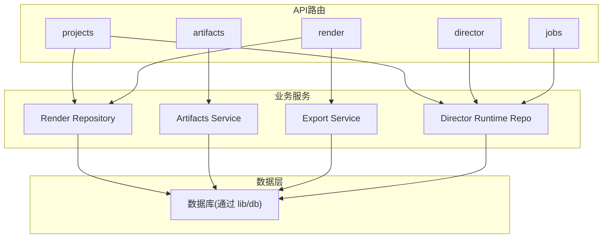
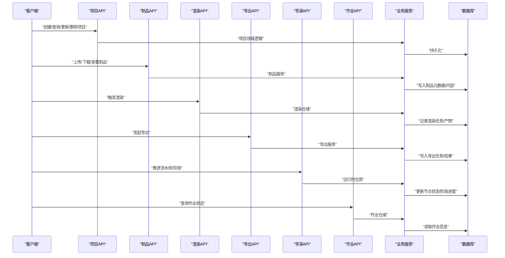
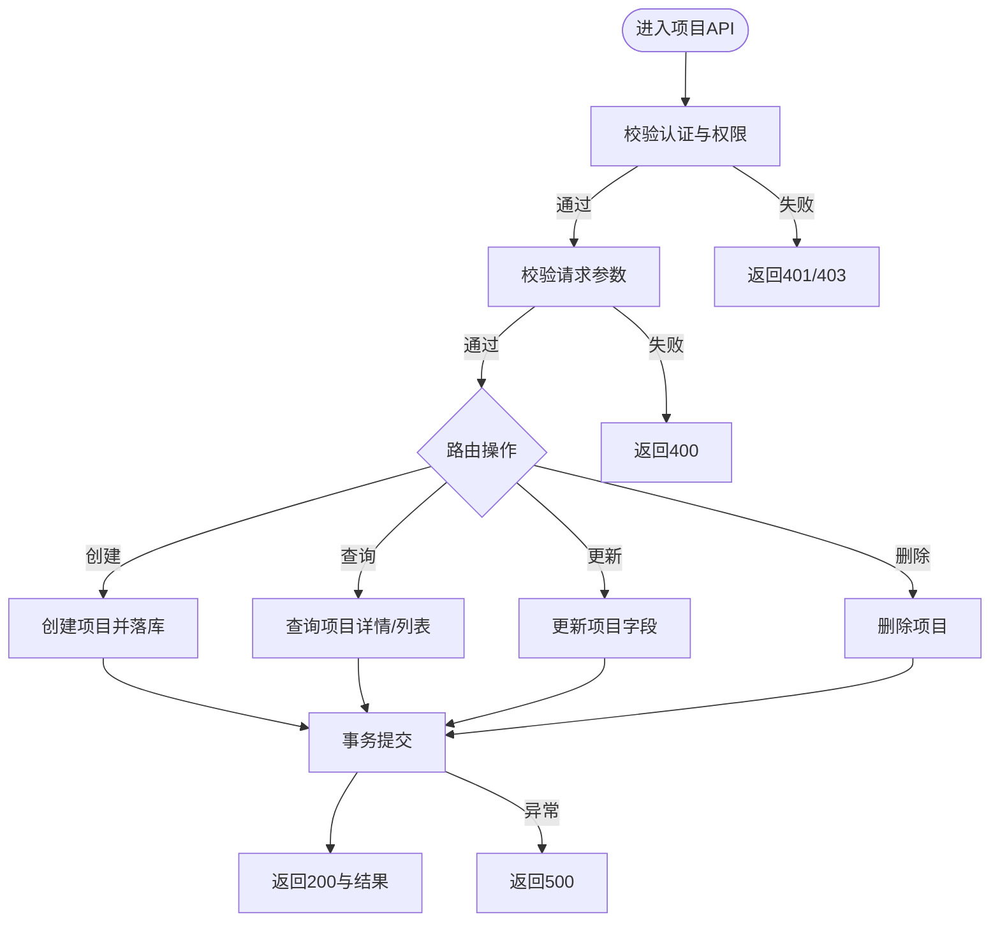
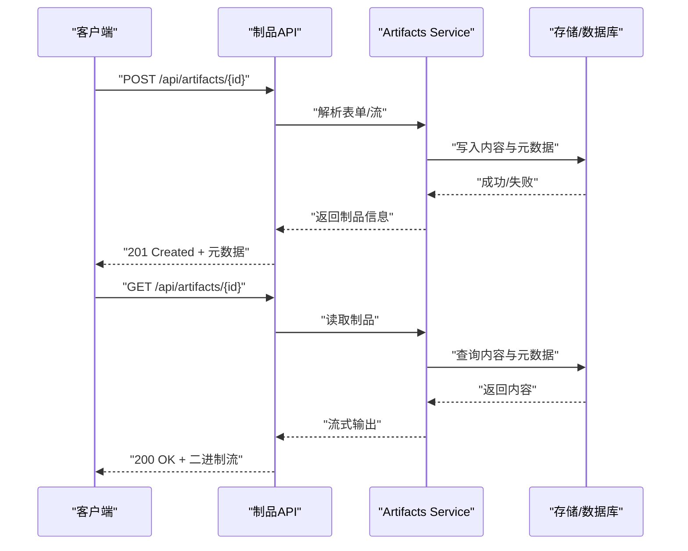
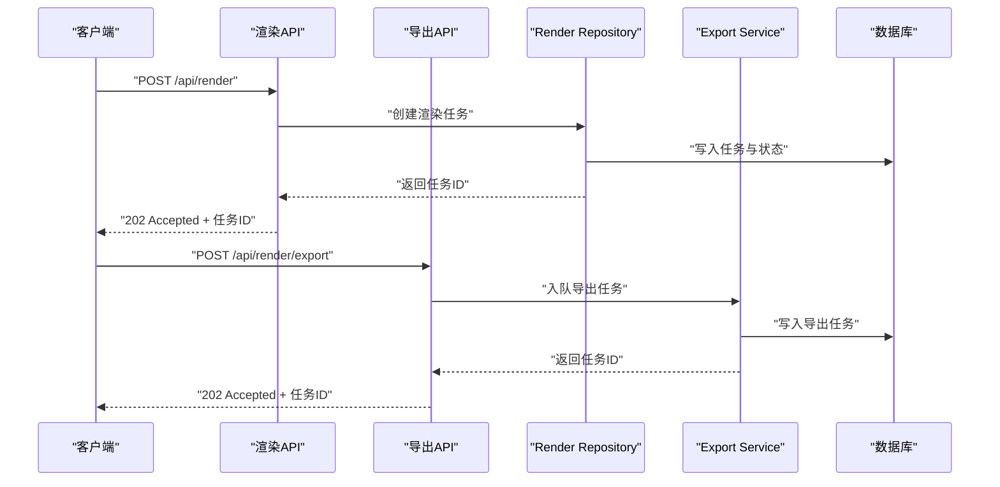
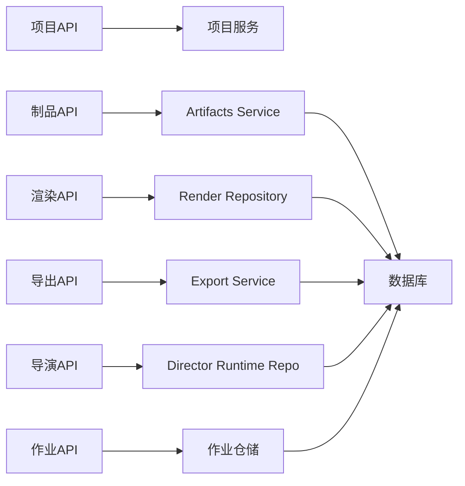

# 项目管理API

<cite>
**本文引用的文件**   
- [src/app/api/projects/route.ts](file://src/app/api/projects/route.ts)
- [src/app/api/projects/[id]/route.ts](file://src/app/api/projects/[id]/route.ts)
- [src/app/api/artifacts/[id]/route.ts](file://src/app/api/artifacts/[id]/route.ts)
- [src/app/api/render/route.ts](file://src/app/api/render/route.ts)
- [src/app/api/render/export/route.ts](file://src/app/api/render/export/route.ts)
- [src/app/api/director/pipeline/route.ts](file://src/app/api/director/pipeline/route.ts)
- [src/app/api/director/stage/route.ts](file://src/app/api/director/stage/route.ts)
- [src/app/api/jobs/[id]/route.ts](file://src/app/api/jobs/[id]/route.ts)
- [src/features/artifacts/service.ts](file://src/features/artifacts/service.ts)
- [src/features/artifacts/commit.ts](file://src/features/artifacts/commit.ts)
- [src/features/render/repository.ts](file://src/features/render/repository.ts)
- [src/features/render/export-service.ts](file://src/features/render/export-service.ts)
- [src/features/director/runtime-repository.ts](file://src/features/director/runtime-repository.ts)
- [src/lib/db/index.ts](file://src/lib/db/index.ts)
</cite>

## 目录
1. [简介](#简介)
2. [项目结构](#项目结构)
3. [核心组件](#核心组件)
4. [架构总览](#架构总览)
5. [详细组件分析](#详细组件分析)
6. [依赖关系分析](#依赖关系分析)
7. [性能考虑](#性能考虑)
8. [故障排查指南](#故障排查指南)
9. [结论](#结论)
10. [附录](#附录)

## 简介
本文件面向“项目管理与制品”相关API，覆盖以下能力：
- 项目的CRUD（创建、查询、更新、删除）
- 项目状态管理（生命周期推进、阶段推进）
- 制品上传与下载
- 渲染与导出流程
- 作业调度与状态跟踪
- 数据同步机制（运行时仓库与持久化）

文档提供接口定义、请求/响应格式、参数校验要点、权限控制说明、完整示例以及常见问题排查建议。

## 项目结构
本项目采用Next.js App Router组织API路由，业务逻辑位于features层，数据库访问通过lib/db统一封装。关键路径如下：
- API路由：src/app/api/*
- 业务服务：src/features/*
- 数据库连接与迁移：src/lib/db/*

图表来源
- [src/app/api/projects/route.ts](file://src/app/api/projects/route.ts)
- [src/app/api/artifacts/[id]/route.ts](file://src/app/api/artifacts/[id]/route.ts)
- [src/app/api/render/route.ts](file://src/app/api/render/route.ts)
- [src/app/api/director/pipeline/route.ts](file://src/app/api/director/pipeline/route.ts)
- [src/app/api/jobs/[id]/route.ts](file://src/app/api/jobs/[id]/route.ts)
- [src/features/artifacts/service.ts](file://src/features/artifacts/service.ts)
- [src/features/render/repository.ts](file://src/features/render/repository.ts)
- [src/features/render/export-service.ts](file://src/features/render/export-service.ts)
- [src/features/director/runtime-repository.ts](file://src/features/director/runtime-repository.ts)
- [src/lib/db/index.ts](file://src/lib/db/index.ts)

章节来源
- [src/app/api/projects/route.ts](file://src/app/api/projects/route.ts)
- [src/app/api/artifacts/[id]/route.ts](file://src/app/api/artifacts/[id]/route.ts)
- [src/app/api/render/route.ts](file://src/app/api/render/route.ts)
- [src/app/api/director/pipeline/route.ts](file://src/app/api/director/pipeline/route.ts)
- [src/app/api/jobs/[id]/route.ts](file://src/app/api/jobs/[id]/route.ts)
- [src/features/artifacts/service.ts](file://src/features/artifacts/service.ts)
- [src/features/render/repository.ts](file://src/features/render/repository.ts)
- [src/features/render/export-service.ts](file://src/features/render/export-service.ts)
- [src/features/director/runtime-repository.ts](file://src/features/director/runtime-repository.ts)
- [src/lib/db/index.ts](file://src/lib/db/index.ts)

## 核心组件
- 项目API路由：提供项目列表、创建、详情、更新、删除等REST接口。
- 制品API路由：提供按ID获取/操作制品的接口，支持上传与下载。
- 渲染API路由：触发渲染任务、查询渲染状态。
- 导出API路由：发起导出任务并获取导出结果。
- 导演（Director）API路由：推进流水线与阶段，驱动项目状态演进。
- 作业API路由：查询作业执行状态与结果。
- 业务服务：
  - Artifacts Service：制品读写、版本提交、预览模式处理。
  - Render Repository：渲染产物存取、缩略图生成、媒体装配。
  - Export Service：导出队列与异步处理。
  - Director Runtime Repository：运行时节点数据、阶段推进、状态回写。
- 数据层：统一的数据库连接与事务封装。

章节来源
- [src/app/api/projects/route.ts](file://src/app/api/projects/route.ts)
- [src/app/api/artifacts/[id]/route.ts](file://src/app/api/artifacts/[id]/route.ts)
- [src/app/api/render/route.ts](file://src/app/api/render/route.ts)
- [src/app/api/render/export/route.ts](file://src/app/api/render/export/route.ts)
- [src/app/api/director/pipeline/route.ts](file://src/app/api/director/pipeline/route.ts)
- [src/app/api/director/stage/route.ts](file://src/app/api/director/stage/route.ts)
- [src/app/api/jobs/[id]/route.ts](file://src/app/api/jobs/[id]/route.ts)
- [src/features/artifacts/service.ts](file://src/features/artifacts/service.ts)
- [src/features/artifacts/commit.ts](file://src/features/artifacts/commit.ts)
- [src/features/render/repository.ts](file://src/features/render/repository.ts)
- [src/features/render/export-service.ts](file://src/features/render/export-service.ts)
- [src/features/director/runtime-repository.ts](file://src/features/director/runtime-repository.ts)
- [src/lib/db/index.ts](file://src/lib/db/index.ts)

## 架构总览
下图展示了从客户端到后端服务再到数据库的整体调用链，涵盖项目、制品、渲染、导出、导演与作业模块。

图表来源
- [src/app/api/projects/route.ts](file://src/app/api/projects/route.ts)
- [src/app/api/artifacts/[id]/route.ts](file://src/app/api/artifacts/[id]/route.ts)
- [src/app/api/render/route.ts](file://src/app/api/render/route.ts)
- [src/app/api/render/export/route.ts](file://src/app/api/render/export/route.ts)
- [src/app/api/director/pipeline/route.ts](file://src/app/api/director/pipeline/route.ts)
- [src/app/api/director/stage/route.ts](file://src/app/api/director/stage/route.ts)
- [src/app/api/jobs/[id]/route.ts](file://src/app/api/jobs/[id]/route.ts)
- [src/features/artifacts/service.ts](file://src/features/artifacts/service.ts)
- [src/features/render/repository.ts](file://src/features/render/repository.ts)
- [src/features/render/export-service.ts](file://src/features/render/export-service.ts)
- [src/features/director/runtime-repository.ts](file://src/features/director/runtime-repository.ts)
- [src/lib/db/index.ts](file://src/lib/db/index.ts)

## 详细组件分析

### 项目API（CRUD与状态管理）
- 功能范围
  - 项目列表：分页、过滤、排序
  - 项目创建：必填字段校验、默认值设置、权限检查
  - 项目详情：按ID获取项目元数据
  - 项目更新：部分字段更新、状态变更校验
  - 项目删除：软删除或硬删除策略
  - 状态管理：结合导演流水线推进项目状态
- 典型请求/响应
  - 创建项目：POST /api/projects
    - 请求体包含项目名称、描述、初始配置等
    - 响应返回项目ID、创建时间、初始状态
  - 更新项目：PATCH /api/projects/{id}
    - 请求体为增量字段
    - 响应返回更新后的项目对象
  - 删除项目：DELETE /api/projects/{id}
    - 成功返回空体或确认信息
- 参数校验
  - 名称非空、长度限制；描述可选；配置项类型校验
- 权限控制
  - 鉴权中间件校验会话/令牌
  - 资源级权限校验（仅项目所有者或授权角色可操作）
- 错误码
  - 400 参数校验失败
  - 401 未认证
  - 403 无权限
  - 404 项目不存在
  - 500 服务器内部错误

图表来源
- [src/app/api/projects/route.ts](file://src/app/api/projects/route.ts)
- [src/app/api/projects/[id]/route.ts](file://src/app/api/projects/[id]/route.ts)
- [src/lib/db/index.ts](file://src/lib/db/index.ts)

章节来源
- [src/app/api/projects/route.ts](file://src/app/api/projects/route.ts)
- [src/app/api/projects/[id]/route.ts](file://src/app/api/projects/[id]/route.ts)
- [src/lib/db/index.ts](file://src/lib/db/index.ts)

### 制品API（上传与下载）
- 功能范围
  - 按ID获取制品元数据与内容
  - 上传二进制/文本内容
  - 下载制品流式输出
  - 版本提交与预览模式切换
- 典型请求/响应
  - 上传：POST /api/artifacts/{id}
    - 请求体为multipart/form-data或二进制流
    - 响应返回制品ID、大小、哈希、存储位置
  - 下载：GET /api/artifacts/{id}
    - 响应为二进制流或JSON元数据
- 参数校验
  - ID存在性校验；文件大小限制；MIME类型白名单
- 权限控制
  - 仅项目成员或具备制品读写权限的用户可操作
- 错误码
  - 400 参数无效
  - 401/403 鉴权失败
  - 404 制品不存在
  - 413 文件过大
  - 500 存储或服务异常

图表来源
- [src/app/api/artifacts/[id]/route.ts](file://src/app/api/artifacts/[id]/route.ts)
- [src/features/artifacts/service.ts](file://src/features/artifacts/service.ts)
- [src/features/artifacts/commit.ts](file://src/features/artifacts/commit.ts)

章节来源
- [src/app/api/artifacts/[id]/route.ts](file://src/app/api/artifacts/[id]/route.ts)
- [src/features/artifacts/service.ts](file://src/features/artifacts/service.ts)
- [src/features/artifacts/commit.ts](file://src/features/artifacts/commit.ts)

### 渲染与导出API
- 功能范围
  - 触发渲染任务（视频/图片/HTML等）
  - 查询渲染状态与产物
  - 发起导出任务（打包、转码、归档）
  - 获取导出结果与缩略图
- 典型请求/响应
  - 渲染：POST /api/render
    - 请求体包含项目ID、目标格式、参数
    - 响应返回任务ID与状态
  - 导出：POST /api/render/export
    - 请求体包含项目ID、导出格式、选项
    - 响应返回导出任务ID
- 参数校验
  - 项目存在性；格式合法性；参数范围校验
- 权限控制
  - 渲染/导出需具备项目编辑或导出权限
- 错误码
  - 400 参数非法
  - 401/403 鉴权失败
  - 404 资源不存在
  - 500 渲染/导出失败

图表来源
- [src/app/api/render/route.ts](file://src/app/api/render/route.ts)
- [src/app/api/render/export/route.ts](file://src/app/api/render/export/route.ts)
- [src/features/render/repository.ts](file://src/features/render/repository.ts)
- [src/features/render/export-service.ts](file://src/features/render/export-service.ts)

章节来源
- [src/app/api/render/route.ts](file://src/app/api/render/route.ts)
- [src/app/api/render/export/route.ts](file://src/app/api/render/export/route.ts)
- [src/features/render/repository.ts](file://src/features/render/repository.ts)
- [src/features/render/export-service.ts](file://src/features/render/export-service.ts)

### 导演API（流水线与阶段推进）
- 功能范围
  - 推进流水线阶段（如采集、编排、合成、质检）
  - 读取/更新运行时节点数据
  - 阶段前置条件校验与副作用处理
- 典型请求/响应
  - 推进阶段：POST /api/director/stage
    - 请求体包含项目ID、阶段名、输入参数
    - 响应返回阶段状态与下一步动作
  - 推进流水线：POST /api/director/pipeline
    - 请求体包含项目ID、目标阶段
    - 响应返回流水线状态
- 参数校验
  - 阶段有效性；输入参数契约；幂等性约束
- 权限控制
  - 仅具备导演权限的角色可推进阶段
- 错误码
  - 400 参数非法或阶段不可推进
  - 401/403 鉴权失败
  - 404 项目/阶段不存在
  - 500 推进失败

图表来源
- [src/app/api/director/stage/route.ts](file://src/app/api/director/stage/route.ts)
- [src/app/api/director/pipeline/route.ts](file://src/app/api/director/pipeline/route.ts)
- [src/features/director/runtime-repository.ts](file://src/features/director/runtime-repository.ts)

章节来源
- [src/app/api/director/stage/route.ts](file://src/app/api/director/stage/route.ts)
- [src/app/api/director/pipeline/route.ts](file://src/app/api/director/pipeline/route.ts)
- [src/features/director/runtime-repository.ts](file://src/features/director/runtime-repository.ts)

### 作业API（状态查询）
- 功能范围
  - 查询作业执行状态、进度、日志摘要
  - 支持按项目ID或任务ID过滤
- 典型请求/响应
  - 查询作业：GET /api/jobs/{id}
    - 响应包含作业ID、状态、开始/结束时间、结果URL
- 参数校验
  - ID存在性与格式校验
- 权限控制
  - 仅项目成员或具备作业查看权限的用户可查询
- 错误码
  - 401/403 鉴权失败
  - 404 作业不存在
  - 500 查询失败

章节来源
- [src/app/api/jobs/[id]/route.ts](file://src/app/api/jobs/[id]/route.ts)

## 依赖关系分析
- 耦合与内聚
  - API路由保持薄控制器职责，主要进行参数校验、鉴权与转发
  - 业务服务负责领域逻辑与跨模块协作
  - 数据层统一封装数据库访问，保证事务一致性
- 外部依赖
  - 存储系统（对象存储/文件系统）用于制品与渲染产物
  - 消息队列（可选）用于渲染/导出异步处理
- 潜在循环依赖
  - 避免服务间直接互相调用，使用事件或队列解耦

图表来源
- [src/app/api/projects/route.ts](file://src/app/api/projects/route.ts)
- [src/app/api/artifacts/[id]/route.ts](file://src/app/api/artifacts/[id]/route.ts)
- [src/app/api/render/route.ts](file://src/app/api/render/route.ts)
- [src/app/api/render/export/route.ts](file://src/app/api/render/export/route.ts)
- [src/app/api/director/pipeline/route.ts](file://src/app/api/director/pipeline/route.ts)
- [src/app/api/director/stage/route.ts](file://src/app/api/director/stage/route.ts)
- [src/app/api/jobs/[id]/route.ts](file://src/app/api/jobs/[id]/route.ts)
- [src/features/artifacts/service.ts](file://src/features/artifacts/service.ts)
- [src/features/render/repository.ts](file://src/features/render/repository.ts)
- [src/features/render/export-service.ts](file://src/features/render/export-service.ts)
- [src/features/director/runtime-repository.ts](file://src/features/director/runtime-repository.ts)
- [src/lib/db/index.ts](file://src/lib/db/index.ts)

章节来源
- [src/app/api/projects/route.ts](file://src/app/api/projects/route.ts)
- [src/app/api/artifacts/[id]/route.ts](file://src/app/api/artifacts/[id]/route.ts)
- [src/app/api/render/route.ts](file://src/app/api/render/route.ts)
- [src/app/api/render/export/route.ts](file://src/app/api/render/export/route.ts)
- [src/app/api/director/pipeline/route.ts](file://src/app/api/director/pipeline/route.ts)
- [src/app/api/director/stage/route.ts](file://src/app/api/director/stage/route.ts)
- [src/app/api/jobs/[id]/route.ts](file://src/app/api/jobs/[id]/route.ts)
- [src/features/artifacts/service.ts](file://src/features/artifacts/service.ts)
- [src/features/render/repository.ts](file://src/features/render/repository.ts)
- [src/features/render/export-service.ts](file://src/features/render/export-service.ts)
- [src/features/director/runtime-repository.ts](file://src/features/director/runtime-repository.ts)
- [src/lib/db/index.ts](file://src/lib/db/index.ts)

## 性能考虑
- 大文件上传/下载
  - 使用分片上传与断点续传提升稳定性
  - 启用CDN缓存静态制品与缩略图
- 渲染与导出
  - 异步队列处理，避免阻塞HTTP请求
  - 并行处理多帧/多片段，合理设置并发度
- 数据库访问
  - 索引优化（项目ID、状态、时间戳）
  - 批量写入与事务合并减少锁竞争
- 缓存策略
  - 热点项目元数据与制品清单缓存
  - 渲染/导出任务状态短期缓存

[本节为通用指导，不直接分析具体文件]

## 故障排查指南
- 常见错误定位
  - 400 参数校验失败：检查请求体字段类型、必填项、范围限制
  - 401/403 鉴权失败：确认会话/令牌有效且具备相应权限
  - 404 资源不存在：核对ID是否正确、资源是否已被删除
  - 413 文件过大：调整服务端限制或改用分片上传
  - 500 服务器错误：查看日志堆栈、数据库连接、存储可用性
- 调试建议
  - 开启详细日志（请求/响应、SQL语句、队列消费）
  - 使用健康检查端点验证服务状态
  - 针对渲染/导出任务，检查任务队列与消费者状态

章节来源
- [src/app/api/projects/route.ts](file://src/app/api/projects/route.ts)
- [src/app/api/artifacts/[id]/route.ts](file://src/app/api/artifacts/[id]/route.ts)
- [src/app/api/render/route.ts](file://src/app/api/render/route.ts)
- [src/app/api/render/export/route.ts](file://src/app/api/render/export/route.ts)
- [src/app/api/director/pipeline/route.ts](file://src/app/api/director/pipeline/route.ts)
- [src/app/api/director/stage/route.ts](file://src/app/api/director/stage/route.ts)
- [src/app/api/jobs/[id]/route.ts](file://src/app/api/jobs/[id]/route.ts)

## 结论
本项目通过清晰的API分层与模块化设计，实现了项目CRUD、制品管理、渲染导出、导演推进与作业跟踪等核心能力。建议在后续迭代中持续完善参数校验、权限模型、错误语义与监控告警，以提升系统的健壮性与可观测性。

[本节为总结性内容，不直接分析具体文件]

## 附录
- 接口示例（以文字描述为主，避免粘贴代码）
  - 创建项目
    - 方法：POST /api/projects
    - 请求体：包含项目名称、描述、初始配置等字段
    - 响应：返回项目ID、创建时间、初始状态
  - 更新项目
    - 方法：PATCH /api/projects/{id}
    - 请求体：增量字段
    - 响应：返回更新后的项目对象
  - 删除项目
    - 方法：DELETE /api/projects/{id}
    - 响应：空体或确认信息
  - 上传制品
    - 方法：POST /api/artifacts/{id}
    - 请求体：multipart/form-data或二进制流
    - 响应：返回制品ID、大小、哈希、存储位置
  - 下载制品
    - 方法：GET /api/artifacts/{id}
    - 响应：二进制流或JSON元数据
  - 触发渲染
    - 方法：POST /api/render
    - 请求体：项目ID、目标格式、参数
    - 响应：任务ID与状态
  - 发起导出
    - 方法：POST /api/render/export
    - 请求体：项目ID、导出格式、选项
    - 响应：导出任务ID
  - 推进阶段
    - 方法：POST /api/director/stage
    - 请求体：项目ID、阶段名、输入参数
    - 响应：阶段状态与下一步动作
  - 推进流水线
    - 方法：POST /api/director/pipeline
    - 请求体：项目ID、目标阶段
    - 响应：流水线状态
  - 查询作业
    - 方法：GET /api/jobs/{id}
    - 响应：作业ID、状态、开始/结束时间、结果URL

[本节为补充说明，不直接分析具体文件]